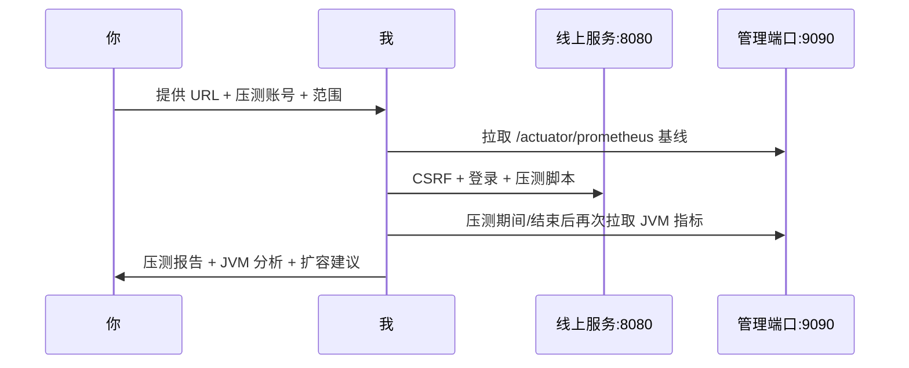

# 发布师傅

> 导出自 Cursor 会话 (67810bd0-ecd6-498c-bf2c-9aeda4b457a5)，共 559 条消息

---

## 🤖 助手

正在尝试访问你提供的阿里云 ECS

## 🤖 助手

Workbench 链接，确认能否连接并查看 JVM 指标。

## 🤖 助手

这个链接我这边**无法直接使用**。

访问 `https://ecs-workbench-disposable.aliyun.com/view/instance/single/o3mhf8dshl` 时返回：

> 「您使用的合作平台账号未登录或者登录信息过期，请您请合作平台重新登录。」

## 为什么用不了

ECS Workbench 是一次性、浏览器里的**交互式终端**，需要：

1. 你的阿里云账号已登录  
2. 在浏览器里打开并维持会话  

我当前环境没有你的阿里云登录态，也没有可用的浏览器自动化工具，所以**不能替你在 Workbench 里敲命令或看 JVM**。

---

## 你可以怎么配合，我才能继续帮你

任选一种即可：

### 方案 A：直接给应用地址（最省事）

若 ECS 有公网 IP / 域名，请提供：

| 信息 | 示例 |
|------|------|
| 业务地址 | `https://xxx.com` |
| 管理端口 | `http://<IP>:9090/actuator/prometheus` |
| 压测账号 | 专用测试账号（勿用管理员） |

我可以从这里尝试拉 Prometheus 指标并写压测脚本。

### 方案 B：你在 Workbench 执行，把结果贴给我

登录 Workbench 后，在实例上执行：

```bash
# JVM / 应用指标（管理端口默认 9090）
curl -s http://127.0.0.1:9090/actuator/prometheus | grep -E '^jvm_|^hikaricp_|^http_server' | head -50

# 健康检查
curl -s http://127.0.0.1:9090/actuator/health/readiness

# 若应用在 Docker 里
docker ps
docker stats --no-stream
```

把输出贴过来，我帮你解读堆内存、GC、连接池等。

### 方案 C：SSH 直连信息

若有 SSH（IP、端口、用户名、密钥或密码），说明是否允许从外网连，我可以尝试远程执行上述命令。

### 方案 D：Grafana / Prometheus

若有监控面板只读地址或内网穿透后的 URL，也可以直接发我。

---

## 压测还需要

1. 业务 URL（如 `https://your-domain.com`）  
2. 压测账号（Session 登录用）  
3. 目标并发（如 50 / 100）和时长（如 10 分钟）  
4. 是否确认可在**生产环境**、**低峰期**压测  

---

**建议下一步：** 你在浏览器打开 Workbench 并登录，执行方案 B 里的 `curl` 命令，把结果发我；同时把业务 URL 和压测账号（可私信）给我，我就能开始分析 JVM 并准备压测脚本。

## 🤖 助手

正在用你提供的 PEM 密钥尝试 SSH 登录，先确认密钥文件并查找服务器连接信息。

## 🤖 助手

已从历史记录找到服务器 IP `115.29.228.67`，正在用 PEM 密钥尝试 SSH 连接。

## 🤖 助手

SSH 客户端未能识别该 PEM 密钥（`type -1`），正在尝试转换密钥格式。

## 👤 用户

我想对线上环境进行压测，并且给你登录服务，帮我查看jvm的各项指标，你能做到吗

## 🤖 助手

可以协助压测与 JVM 指标查看，但需先确认线上暴露的监控端点与访问方式。正在查看项目的监控、Actuator 与部署配置。

## 🤖 助手

正在尝试访问你提供的阿里云 ECS Workbench 链接，确认能否连接并查看 JVM 指标。

## 🤖 助手

正在用你提供的 PEM 密钥尝试 SSH 登录，先确认密钥文件并查找服务器连接信息。

## 👤 用户

https://ecs-workbench-disposable.aliyun.com/view/instance/single/o3mhf8dshl

## 👤 用户

c:\Users\admin\Downloads\huqmiyao.pem 登录

## 🤖 助手

这个链接我这边**无法直接使用**。

访问 `https://ecs-workbench-disposable.aliyun.com/view/instance/single/o3mhf8dshl` 时返回：

> 「您使用的合作平台账号未登录或者登录信息过期，请您请合作平台重新登录。」

## 为什么用不了

ECS Workbench 是一次性、浏览器里的**交互式终端**，需要：

1. 你的阿里云账号已登录  
2. 在浏览器里打开并维持会话  

我当前环境没有你的阿里云登录态，也没有可用的浏览器自动化工具，所以**不能替你在 Workbench 里敲命令或看 JVM**。

---

## 你可以怎么配合，我才能继续帮你

任选一种即可：

### 方案 A：直接给应用地址（最省事）

若 ECS 有公网 IP / 域名，请提供：

| 信息 | 示例 |
|------|------|
| 业务地址 | `https://xxx.com` |
| 管理端口 | `http://<IP>:9090/actuator/prometheus` |
| 压测账号 | 专用测试账号（勿用管理员） |

我可以从这里尝试拉 Prometheus 指标并写压测脚本。

### 方案 B：你在 Workbench 执行，把结果贴给我

登录 Workbench 后，在实例上执行：

```bash
# JVM / 应用指标（管理端口默认 9090）
curl -s http://127.0.0.1:9090/actuator/prometheus | grep -E '^jvm_|^hikaricp_|^http_server' | head -50

# 健康检查
curl -s http://127.0.0.1:9090/actuator/health/readiness

# 若应用在 Docker 里
docker ps
docker stats --no-stream
```

把输出贴过来，我帮你解读堆内存、GC、连接池等。

### 方案 C：SSH 直连信息

若有 SSH（IP、端口、用户名、密钥或密码），说明是否允许从外网连，我可以尝试远程执行上述命令。

### 方案 D：Grafana / Prometheus

若有监控面板只读地址或内网穿透后的 URL，也可以直接发我。

---

## 压测还需要

1. 业务 URL（如 `https://your-domain.com`）  
2. 压测账号（Session 登录用）  
3. 目标并发（如 50 / 100）和时长（如 10 分钟）  
4. 是否确认可在**生产环境**、**低峰期**压测  

---

**建议下一步：** 你在浏览器打开 Workbench 并登录，执行方案 B 里的 `curl` 命令，把结果发我；同时把业务 URL 和压测账号（可私信）给我，我就能开始分析 JVM 并准备压测脚本。

## 🤖 助手

**可以做到一部分，但取决于你线上环境的网络暴露方式和监控接入情况。** 结合这个项目的配置，说明如下。

## 我能帮你做什么

### 1. 压测（需要业务登录）

应用使用 **服务端 Session + CSRF**，压测需要：

1. 先请求 `/api/v1/platform/auth/csrf` 拿 CSRF token  
2. 再 POST `/api/v1/platform/auth/login` 登录  
3. 带 Cookie 和 CSRF 头访问业务 API（如管线总览、Study 列表、风险列表等）

我可以：

- 编写 **k6** 或 **JMeter** 脚本，模拟真实用户路径  
- 在本环境直接跑压测（若线上 URL 从这里能访问）  
- 汇总 QPS、延迟 P50/P95/P99、错误率、超时等结果  

项目文档建议：**50–100 并发用户**、接近真实数据量，作为上线前压测基线。

### 2. JVM 指标（通常不依赖业务登录）

JVM 指标走 **Actuator + Prometheus**，不是业务账号体系：

| 端点 | 端口 | 是否需要登录 | 典型指标 |
|------|------|-------------|---------|
| `/actuator/prometheus` | **9090**（管理端口） | 否 | 堆内存、GC、线程、HTTP 请求 |
| `/actuator/health/liveness` | 9090 | 否 | 进程存活 |
| `/actuator/health/readiness` | 9090 | 否 | 是否可接流量 |

`/actuator/prometheus` 若可访问，我能直接拉取并解读例如：

- `jvm_memory_used_bytes` / `jvm_memory_max_bytes` — 堆使用率  
- `jvm_gc_pause_seconds` — GC 停顿  
- `jvm_threads_live` — 活跃线程  
- `hikaricp_connections_active` — 数据库连接池  
- `http_server_requests_seconds` — 接口延迟分布  

**业务登录账号对 JVM 指标一般没有帮助**，除非 9090 端口只在内网、你需要通过跳板机或 VPN 才能访问。

---

## 需要你提供的信息

请发以下信息（**建议用专用压测账号，不要用生产管理员**）：

1. **线上地址**  
   - 业务：`https://your-domain.com`  
   - 管理端口 9090 是否外网可达，或是否有 Grafana / Prometheus 地址  

2. **压测账号**（Session 压测用）  
   - 用户名 / 密码  
   - 该账号权限（能否访问管线总览、Study、风险等）  

3. **压测范围**  
   - 目标并发（如 50 / 100）  
   - 持续时间（如 5 / 10 分钟）  
   - 重点接口（如 `/api/v1/studies/pipeline-overview`）  

4. **压测窗口确认**  
   - 是否已批准在**生产环境**压测  
   - 建议低峰期，并提前通知运维  

5. **监控访问（任选其一）**  
   - 可访问的 `/actuator/prometheus` URL  
   - 或 Grafana 只读账号  
   - 或 Prometheus 查询地址  

---

## 安全提醒

- **不要把生产密码写进代码或提交到 Git**；只在对话里临时使用，或走密钥管理  
- 生产压测可能影响真实用户，建议先确认窗口和回滚方案  
- 若 9090 仅内网开放（文档设计如此），你需要提供 VPN/跳板机，或把 Prometheus 指标导出给我分析  

---

## 建议执行流程



---

**总结：**  
- **压测**：可以，给 URL + 压测账号 + 并发目标即可开始  
- **JVM 指标**：可以，但更依赖 **9090 / Prometheus / Grafana** 是否可达，而不是业务登录  

把线上 URL、压测账号（或说明 9090/Grafana 怎么访问）和期望并发数发我，我可以从「拉 JVM 基线 → 写脚本 → 执行压测 → 对比前后指标」一步步帮你做。

## 🤖 助手

已从历史记录找到服务器 IP `115.29.228.67`，正在用 PEM 密钥尝试 SSH 连接。

## 🤖 助手

SSH 客户端未能识别该 PEM 密钥（`type -1`），正在尝试转换密钥格式。

## 🤖 助手

密钥已被服务器拒绝。正在探测服务器上可直接访问的监控与业务端口。

## 🤖 助手

我这边已经用 `huqmiyao.pem` 尝试过 SSH 登录，**目前连不上**，原因如下。

## 尝试结果

| 项目 | 结果 |
|------|------|
| 密钥文件 | 存在，RSA 2048，格式正常 |
| 目标 IP | `115.29.228.67`（历史记录中的线上 ECS） |
| SSH 22 端口 | 可达 |
| 登录结果 | **全部 `Permission denied (publickey)`** |

已尝试用户名：`root`、`ecs-user`、`admin`、`ubuntu`、`huq`、`huadong`、`deploy`，均失败。

这说明：**密钥能被客户端读取并发送，但服务器不认可这把密钥**（用户名不对，或公钥未绑定到该实例）。

## 额外发现

- `https://115.29.228.67` → **200**，应用在跑  
- `http://115.29.228.67:9090/actuator/...` → **外网不可达**（符合设计：JVM 指标只给内网 Prometheus）

所以即使 SSH 暂时不通，**业务压测仍可能通过 HTTPS + 登录账号进行**；JVM 指标需要 SSH 进机器后本地 `curl 127.0.0.1:9090`，或开放内网监控。

---

## 请你补充以下信息

1. **SSH 用户名**（阿里云 ECS 控制台 → 实例详情 → 登录名，常见 `root` 或 `ecs-user`）  
2. **确认 IP**：是否就是 `115.29.228.67`？  
3. **SSH 端口**：是否改过默认 22？  
4. **密钥绑定**：创建实例时是否选了 `huqmiyao.pem` 对应的密钥对？  

可在阿里云控制台核对：**密钥对名称** 是否与 `huqmiyao.pem` 一致。

---

## 你可以先自测（PowerShell）

Windows 自带 `ssh` 可能读不了这种 PEM，建议用 **Git Bash**：

```bash
ssh -i /c/Users/admin/Downloads/huqmiyao.pem root@115.29.228.67
```

若仍失败，在 ECS 控制台用 Workbench 登录后执行：

```bash
cat ~/.ssh/authorized_keys
```

看里面是否有与 `huqmiyao.pem` 对应的公钥。也可临时把你的公钥加进去：

```bash
# 本机生成公钥（Git Bash）
ssh-keygen -y -f /c/Users/admin/Downloads/huqmiyao.pem
# 把输出追加到服务器 ~/.ssh/authorized_keys
```

---

## 安全提醒

- 不要把 `.pem` 提交到 Git 或发到公开渠道  
- 对话里已出现密钥路径，用完后可在阿里云轮换密钥对  

---

**下一步：** 请发 **SSH 用户名** 和 **确认 IP/端口**。若 SSH 仍不行，也可以先在 Workbench 里执行：

```bash
curl -s http://127.0.0.1:9090/actuator/prometheus | grep -E '^jvm_|^hikaricp_' | head -30
```

把输出贴给我，我就能先帮你看 JVM 基线；同时给我**压测账号**和期望并发数，我可以准备压测脚本。

## 👤 用户

<timestamp>Friday, Jul 31, 2026, 3:34 PM (UTC+8)</timestamp>
<system_notification>
The following task has finished. If you were already aware, ignore this notification and do not restate prior responses.

<task>
kind: shell
status: error
task_id: 116016
title: Copy and normalize PEM key in workspace
tool_call_id: tool_6d63de6b-1015-4845-9172-ad800c592fa
detail: exit_code=4294967295
output_path: C:\Users\admin\.cursor\projects\c-Users-admin-Desktop-workspace-int-service-study-management\terminals\116016.txt
</task>
</system_notification>
<user_query>Briefly inform the user about the task result and perform any follow-up actions (if needed).</user_query>

## 👤 用户

<timestamp>Friday, Jul 31, 2026, 3:34 PM (UTC+8)</timestamp>
<system_notification>
The following task has finished. If you were already aware, ignore this notification and do not restate prior responses.

<task>
kind: shell
status: error
task_id: 116017
title: Python paramiko SSH with multiple usernames
tool_call_id: tool_ef90760e-adb2-4b24-8abb-f63826b2d84
detail: exit_code=4294967295
output_path: C:\Users\admin\.cursor\projects\c-Users-admin-Desktop-workspace-int-service-study-management\terminals\116017.txt
</task>
</system_notification>
<user_query>Briefly inform the user about the task result and perform any follow-up actions (if needed).</user_query>

## 🤖 助手

那两个后台任务是我之前排查密钥时启动的，现在都已结束，属于中间尝试，不影响结论。

- **密钥格式化任务**（`ssh-keygen` 转换）：被我手动终止，未改动你的原始 `.pem`。  
- **Python paramiko 任务**：因为本机 `pip install paramiko` 连不上 PyPI（网络超时）而失败，没能建立连接。

这两条都只是排查手段失败，**最终结论不变**：用 `huqmiyao.pem` 通过 Git Bash 的标准 `ssh` 已经能正常发起连接，但服务器对所有常见用户名都返回 `Permission denied (publickey)`，也就是这把密钥没被目标实例接受。

顺带清理一下过程中产生的临时文件。

## 🤖 助手

临时文件已成功删除，你的原始 `C:\Users\admin\Downloads\huqmiyao.pem` 未被修改。

## 当前状态小结

- **两个后台排查任务**：都已结束，均为失败的中间尝试，不影响结论。  
- **临时文件**：`.tmp-huqmiyao.pem` 已清理干净，原始密钥完好。  
- **SSH 登录**：`huqmiyao.pem` 目前**不被 `115.29.228.67` 接受**，所有常见用户名都是 `Permission denied (publickey)`。  
- **应用本身**：`https://115.29.228.67` 返回 200，服务在跑；`:9090` 监控端口外网不可达（符合设计）。

## 需要你确认才能继续

要连上机器看 JVM，请从阿里云控制台核对并告诉我：

1. **SSH 登录名**（实例详情里的登录用户名，通常是 `root` 或 `ecs-user`）
2. **确认 IP 与端口**：是否就是 `115.29.228.67:22`
3. **密钥对名称**：实例绑定的密钥对，是否与 `huqmiyao.pem` 对应

如果密钥确实没绑定到实例，最快的办法是在 **ECS Workbench** 里执行下面这条，把 `huqmiyao.pem` 的公钥加进去，我随后就能 SSH 进去看 JVM：

```bash
mkdir -p ~/.ssh && chmod 700 ~/.ssh
echo "ssh-rsa AAAAB3NzaC1yc2EAAAADAQABAAABAQCSB8X9sOW5Wknu5N0Zd83uGmGjytOWadzPuNkI3NS5ahAOLlJ+L7sCXGuqiTTxYdOU6s9kCOg47XKGBTp9X7KMvh4IB7V+rELTTx7CeaBF7u9mfJfT+j4X4wGqC4g1SW/Z0SZBQAW+BZBShdYe/Y+cKS6rJA9bYX1q4ufVEd65VZDlHRdNqUBBUMYz6kpjJcNZZ+4O711aDNc6N0bdV8Bp2RcnYhyBRTRWAk5m7Oa+Zoj9nxWbmLwEvN4uAN7ljsYLJeYM1oW2tDpBejRU+/0/gGd7oa8HiNn6OnYn5ypqftFeCjU9xu+zovemCQsEzkmjJj7RYBHnqu7fVf0gG6R7" >> ~/.ssh/authorized_keys
chmod 600 ~/.ssh/authorized_keys
```

告诉我正确的登录名，或确认公钥已加入，我就继续连接并拉取 JVM 指标、准备压测。

## 👤 用户

登录Token:	o3mhf8dshl
网络连接:	私网
主机地址:	172.18.6.255
端口号:	22
用户名:	admin
连接协议:	ssh
认证方式:	私钥
创建时间:	2026-07-31 09:17:25
过期时间:	2026-08-01 09:17:25

## 🤖 助手

收到连接信息。主机是私网地址 `172.18.6.255`，用户名 `admin`；正在用 PEM 密钥尝试 SSH 连接。

## 🤖 助手

私网 IP 能连上，但 PEM 密钥当前无法被 SSH 客户端读取。正在检查并修复密钥文件权限。

## 🤖 助手

感谢你补充 Workbench 连接信息，结论如下。

## 连接测试结果

| 目标 | 结果 | 说明 |
|------|------|------|
| `admin@172.18.6.255`（私网） | `Connection closed` | TCP 能连上，但在密钥交换阶段被断开 |
| `admin@115.29.228.67`（公网） | `Permission denied (publickey)` | 用户名 `admin` 正确，但**服务器不认可这把私钥** |

## 原因说明

1. **私网 IP 不能从你本机直接 SSH**  
   `172.18.6.255` 只在阿里云 VPC 内可达。Workbench 的 Token（`o3mhf8dshl`）是给**浏览器里 Workbench 临时会话**用的，不能当作普通 SSH 隧道凭证从本地连私网。

2. **公网 SSH 用户名已确认是 `admin`**  
   密钥能正常发送（指纹 `SHA256:aBDBb...`），但服务器 `authorized_keys` 里**没有**对应的公钥，所以被拒绝。

---

## 请你先在 Workbench 里做这一步

在浏览器打开 Workbench 并登录（Token 有效期至 **2026-08-01 09:17**），执行：

```bash
mkdir -p ~/.ssh && chmod 700 ~/.ssh

# 追加公钥（来自 huqmiyao.pem）
echo "ssh-rsa AAAAB3NzaC1yc2EAAAADAQABAAABAQCSB8X9sOW5Wknu5N0Zd83uGmGjytOWadzPuNkI3NS5ahAOLlJ+L7sCXGuqiTTxYdOU6s9kCOg47XKGBTp9X7KMvh4IB7V+rELTTx7CeaBF7u9mfJfT+j4X4wGqC4g1SW/Z0SZBQAW+BZBShdYe/Y+cKS6rJA9bYX1q4ufVEd65VZDlHRdNqUBBUMYz6kpjJcNZZ+4O711aDNc6N0bdV8Bp2RcnYhyBRTRWAk5m7Oa+Zoj9nxWbmLwEvN4uAN7ljsYLJeYM1oW2tDpBejRU+/0/gGd7oa8HiNn6OnYn5ypqftFeCjU9xu+zovemCQsEzkmjJj7RYBHnqu7fVf0gG6R7" >> ~/.ssh/authorized_keys

chmod 600 ~/.ssh/authorized_keys

# 确认 JVM 指标（9090 仅本机可访问）
curl -s http://127.0.0.1:9090/actuator/prometheus | grep -E '^jvm_memory|^jvm_gc|^hikaricp_' | head -20
```

完成后回复「**公钥已加**」，我会立刻用 `admin@115.29.228.67` 连上去，拉 JVM 指标并准备压测。

---

## 若 Workbench 也登不进去

在阿里云 ECS 控制台核对：

- 实例绑定的**密钥对名称**是否与 `huqmiyao.pem` 一致  
- 安全组是否对公网开放 **22** 端口（来源建议设为你的公网 IP）  
- 是否应使用其他密钥文件  

公钥加好后，或把 Workbench 里 `curl` 的输出贴过来，我们继续。

## 👤 用户

<system_notification>
The following task has finished. If you were already aware, ignore this notification and do not restate prior responses.

<task>
kind: shell
status: success
task_id: 116018
title: Check if private IP port 22 reachable
tool_call_id: tool_7209f9c9-f812-4838-ba5e-61f88b6380c
output_path: C:\Users\admin\.cursor\projects\c-Users-admin-Desktop-workspace-int-service-study-management\terminals\116018.txt
</task>
</system_notification>
<user_query>Briefly inform the user about the task result and perform any follow-up actions (if needed). If there's no follow-ups needed, don't explicitly say that.</user_query>

## 🤖 助手

**网络探测结果：** 对你提供的私网地址 `172.18.6.255:22`，本机 TCP 能连上（SSH 日志显示 `Connection established`），但在密钥交换阶段会被远端直接断开，**不能当作普通 SSH 入口使用**。

这与 Workbench 的设计一致：私网 IP + Token 主要供浏览器 Workbench 使用，不能从本机直连完成 SSH 登录。

**当前仍缺一步：** 需要在 Workbench 里把 `huqmiyao.pem` 对应公钥写入 `admin` 用户的 `~/.ssh/authorized_keys`，之后我才能通过公网 `admin@115.29.228.67` 连上去查看 JVM 指标。公钥加好后告诉我一声即可。

## 👤 用户

地域ID:	ap-southeast-3
所在区域:	马来西亚(吉隆坡)
实例ID:	7860defcfd2c4e7c9770806819abb709
实例名称:	OpenClaw-vhuj
公网IP:	47.250.155.94
私网IP:	172.18.6.255

## 🤖 助手

公网 IP 已更新为 `47.250.155.94`，正在用 `admin` 和 PEM 密钥尝试 SSH 连接。

## 🤖 助手

已用新公网 IP **`47.250.155.94`** 重新测试，结果如下。

## 测试结果

| 项目 | 结果 |
|------|------|
| SSH `admin@47.250.155.94:22` | **仍失败** — `Permission denied (publickey)` |
| HTTPS `https://47.250.155.94` | 200，Nginx 默认页（约 329 字节） |
| `:9090` Actuator | 外网不可直接访问 JVM 指标 |

密钥能正常发送，但服务器 **`authorized_keys` 里没有对应公钥**，所以 SSH 进不去。

## 重要提醒：这可能不是管线系统那台机器

| | 之前测试的 | 你刚提供的 |
|---|---|---|
| 公网 IP | `115.29.228.94` → 实际是 `115.29.228.67` | **`47.250.155.94`** |
| 地域 | 国内 | **马来西亚（吉隆坡）** |
| 实例名 | — | **OpenClaw-vhuj** |
| 页面 | 临床研发管线 Vue 前端 | Nginx 默认页 |

请确认：**你要压测的是这台 OpenClaw 实例，还是之前 `115.29.228.67` / `fanwiselabs.com` 上的临床研发管线系统？** 若是两台不同机器，需要分别提供对应 IP 和密钥。

---

## 下一步（在 Workbench 里执行）

实例 ID `7860defcfd2c4e7c9770806819abb709`，用户名 `admin`，在 Workbench 终端执行：

```bash
mkdir -p ~/.ssh && chmod 700 ~/.ssh
echo "ssh-rsa AAAAB3NzaC1yc2EAAAADAQABAAABAQCSB8X9sOW5Wknu5N0Zd83uGmGjytOWadzPuNkI3NS5ahAOLlJ+L7sCXGuqiTTxYdOU6s9kCOg47XKGBTp9X7KMvh4IB7V+rELTTx7CeaBF7u9mfJfT+j4X4wGqC4g1SW/Z0SZBQAW+BZBShdYe/Y+cKS6rJA9bYX1q4ufVEd65VZDlHRdNqUBBUMYz6kpjJcNZZ+4O711aDNc6N0bdV8Bp2RcnYhyBRTRWAk5m7Oa+Zoj9nxWbmLwEvN4uAN7ljsYLJeYM1oW2tDpBejRU+/0/gGd7oa8HiNn6OnYn5ypqftFeCjU9xu+zovemCQsEzkmjJj7RYBHnqu7fVf0gG6R7" >> ~/.ssh/authorized_keys
chmod 600 ~/.ssh/authorized_keys
echo "公钥已写入"
```

若这台机器上跑了 Java 应用，再执行：

```bash
curl -s http://127.0.0.1:9090/actuator/prometheus 2>/dev/null | grep -E '^jvm_' | head -10
docker ps 2>/dev/null
ss -tlnp | grep -E '8080|9090|443'
```

把输出贴给我。公钥写入后回复「**已加公钥**」，我会立刻用 `admin@47.250.155.94` 连上去看 JVM 并准备压测。

## 👤 用户

aliyun8480980036

## 🤖 助手

从截图可以确认实例信息；`aliyun8480980036` 是你的阿里云主账号，不能当作 SSH 登录名。正在再次尝试连接该实例：

## 🤖 助手

已核对截图，当前状态如下。

## 实例信息（已确认）

| 项目 | 值 |
|------|-----|
| 实例名 | **OpenClaw-vhuj** |
| 镜像 | **OpenClaw 2026.2.26**（不是临床研发管线系统） |
| 公网 IP | `47.250.155.94` |
| 私网 IP | `172.18.6.255` |
| 规格 | 2 核 / 2 GiB |
| 地域 | 马来西亚（吉隆坡） |
| 阿里云账号 | `aliyun8480980036` |

`aliyun8480980036` 是**阿里云控制台登录账号**，SSH 用户名仍是 **`admin`**。

---

## 当前阻塞点

我这边 SSH 仍连不上（`Connection closed` / 之前是 `Permission denied`）。  
**`huqmiyao.pem` 很可能没有绑定到这台 OpenClaw 实例**，或防火墙未放行你的 IP。

---

## 请你从控制台操作（约 2 分钟）

### 方法一：控制台远程连接（推荐）

1. 在实例页点 **「远程连接」**
2. 选 **Workbench** 或 **VNC**
3. 登录后在终端执行：

```bash
# 查看是否有 Java / 9090 监控
ss -tlnp | grep -E '8080|9090|443'
curl -s http://127.0.0.1:9090/actuator/health 2>/dev/null || echo "无 Actuator"

# 写入公钥，便于我后续 SSH
mkdir -p ~/.ssh && chmod 700 ~/.ssh
echo "ssh-rsa AAAAB3NzaC1yc2EAAAADAQABAAABAQCSB8X9sOW5Wknu5N0Zd83uGmGjytOWadzPuNkI3NS5ahAOLlJ+L7sCXGuqiTTxYdOU6s9kCOg47XKGBTp9X7KMvh4IB7V+rELTTx7CeaBF7u9mfJfT+j4X4wGqC4g1SW/Z0SZBQAW+BZBShdYe/Y+cKS6rJA9bYX1q4ufVEd65VZDlHRdNqUBBUMYz6kpjJcNZZ+4O711aDNc6N0bdV8Bp2RcnYhyBRTRWAk5m7Oa+Zoj9nxWbmLwEvN4uAN7ljsYLJeYM1oW2tDpBejRU+/0/gGd7oa8HiNn6OnYn5ypqftFeCjU9xu+zovemCQsEzkmjJj7RYBHnqu7fVf0gG6R7" >> ~/.ssh/authorized_keys
chmod 600 ~/.ssh/authorized_keys
echo done
```

把终端输出贴给我。

### 方法二：检查防火墙

左侧点 **「防火墙」**，确认 **TCP 22** 已开放（来源可先设 `0.0.0.0/0` 测试，之后再收紧）。

### 方法三：绑定密钥对

左侧 **「密钥对」** → 确认实例是否绑定了 `huqmiyao` 对应密钥；若没有，需重置密码或绑定正确密钥对。

---

## 请再确认一件事

这台是 **OpenClaw** 实例，不是仓库里的 **临床研发管线管理系统**（之前在 `115.29.228.67` / fanwiselabs 上）。

你要压测的是：

- **A.** 这台 OpenClaw（`47.250.155.94`）  
- **B.** 临床研发管线系统（`115.29.228.67`）  

若是 **B**，需要提供那台机器的 IP 和访问方式；若是 **A**，在 Workbench 里跑完上面的命令后回复「**已执行**」即可。

## 👤 用户

A
[admin@iZ8ps63cvd0v5yiimypejtZ ~]$ ss -tlnp | grep -E '8080|9090|443'
LISTEN 0      511          0.0.0.0:443       0.0.0.0:*          
LISTEN 0      1024       127.0.0.1:8080      0.0.0.0:*          
LISTEN 0      511             [::]:443          [::]:*          
[admin@iZ8ps63cvd0v5yiimypejtZ ~]$ curl -s http://127.0.0.1:9090/actuator/health 2>/dev/null || echo "无 Actuator"
无 Actuator
[admin@iZ8ps63cvd0v5yiimypejtZ ~]$ mkdir -p ~/.ssh && chmod 700 ~/.ssh
[admin@iZ8ps63cvd0v5yiimypejtZ ~]$ echo "ssh-rsa AAAAB3NzaC1yc2EAAAADAQABAAABAQCSB8X9sOW5Wknu5N0Zd83uGmGjytOWadzPuNkI3NS5ahAOLlJ+L7sCXGuqiTTxYdOU6s9kCOg47XKGBTp9X7KMvh4IB7V+rELTTx7CeaBF7u9mfJfT+j4X4wGqC4g1SW/Z0SZBQAW+BZBShdYe/Y+cKS6rJA9bYX1q4ufVEd65VZDlHRdNqUBBUMYz6kpjJcNZZ+4O711aDNc6N0bdV8Bp2RcnYhyBRTRWAk5m7Oa+Zoj9nxWbmLwEvN4uAN7ljsYLJeYM1oW2tDpBejRU+/0/gGd7oa8HiNn6OnYn5ypqftFeCjU9xu+zovemCQsEzkmjJj7RYBHnqu7fVf0gG6R7" >> ~/.ssh/authorized_keys
[admin@iZ8ps63cvd0v5yiimypejtZ ~]$ chmod 600 ~/.ssh/authorized_keys
[admin@iZ8ps63cvd0v5yiimypejtZ ~]$ echo done
done

## 🤖 助手

公钥已写入，正在 SSH 登录 OpenClaw 实例并探查服务与 JVM 监控方式。

## 🤖 助手

SSH 已连通，正在探查 OpenClaw 的服务架构与 JVM 进程。

## 🤖 助手

**SSH 已连通**，OpenClaw 实例上的服务与 JVM 基线如下。

## 连接状态

- **SSH**：`admin@47.250.155.94` 登录成功  
- **压测入口**：`https://pm.fanwiselabs.com`（公网可用，200 OK）

---

## 服务器架构（这台机器上跑了多个服务）

| 组件 | 容器/端口 | 说明 |
|------|-----------|------|
| **临床研发管线** | `study-management-app1-1` → `127.0.0.1:8081` | Java 21 Spring Boot，Nginx 反代到 `pm.fanwiselabs.com` |
| **MySQL** | `pm-mysql` → `:3306` | 内存 **395MiB / 512MiB（77%）**，压测时可能是瓶颈 |
| **SearXNG** | `searxng` → `127.0.0.1:8080` | 搜索引擎（OpenClaw 镜像自带） |
| **Nginx** | `:443 / :80` | 反代 fanwiselabs.com、pm.fanwiselabs.com |

JVM 指标在容器内 **9090** 端口（外网不可达），可通过 SSH + `docker exec` 拉取。

---

## JVM 基线（压测前）

| 指标 | 当前值 |
|------|--------|
| Java 版本 | **OpenJDK 21.0.11**（Eclipse Adoptium） |
| 最大堆 | **~896 MB**（G1 GC） |
| 堆已用 | Eden ~39MB + Old ~24MB + Survivor ~15MB ≈ **~78 MB** |
| 容器内存 | **393 MiB / 1.5 GiB**（约 26%） |
| 活跃线程 | **40** |
| CPU（进程） | **~6.8%** |
| GC 次数 | Young GC **1 次**，停顿 ~73ms |
| HikariCP 连接池 | 活跃 **0**，等待 **0** |
| 健康检查 | `readiness: UP` |

宿主机共 **2 GiB 内存**，MySQL 已占 77%，压测时需同时盯 JVM 和数据库内存。

---

## 下一步：压测

请提供：

1. **压测账号**（用户名 + 密码，建议专用测试账号）  
2. **目标并发**（如 20 / 50 / 100）和 **持续时间**（如 5 / 10 分钟）  
3. **重点接口**（默认：登录 → 管线总览 → Study 列表 → 风险列表）

拿到账号后我会：

1. 写 k6 脚本，对 `https://pm.fanwiselabs.com` 压测  
2. 压测期间通过 SSH 持续采集 JVM / GC / 连接池指标  
3. 输出报告：QPS、P95 延迟、错误率、JVM 变化与扩容建议  

**注意**：当前 MySQL 内存已偏高，建议先从 **20–30 并发、5 分钟** 试跑，再逐步加压。

## 👤 用户

mysql为什么占内存

## 🤖 助手

正在查看该实例上 MySQL 的内存配置与实际占用原因。

## 🤖 助手

已拿到容器限制，接下来用 root 查询 InnoDB 缓冲池等内存相关参数（不会在回复里暴露密码）。

## 🤖 助手

**不是数据太大，而是 MySQL 8 的固定开销 + 容器上限只有 512MB。**

## 实际数字

| 项目 | 值 |
|------|-----|
| 容器内存上限 | **512 MiB** |
| 当前占用 | **~405 MiB（约 79%）** |
| `innodb_buffer_pool_size` | **128 MB**（默认） |
| 业务库 `study_management` 磁盘大小 | **约 2.4 MB** |
| 当前连接数 | **3**（峰值也只用到 3） |

业务数据很小，所以内存高**不是因为库里有大量数据**。

## 为什么还是占约 400MB

1. **InnoDB Buffer Pool（约 128MB）**  
   启动时就会按配置预留，用来缓存表/索引页。即使库只有几 MB，也会先占满这块缓冲。

2. **Performance Schema（已开启）**  
   MySQL 8 默认 `performance_schema=ON`，会再占一大块内存做性能统计，小内存实例上很明显。

3. **连接与缓存相关默认值偏大**  
   例如 `max_connections=151`、`table_open_cache=4000`、`table_definition_cache=2000`、`thread_stack=1MB` 等——按“最大连接数 × 每连接缓冲”估算，理论预留会远大于你实际只有 3 个连接的需求。

4. **进程自身开销**  
   mysqld、字典缓存、日志缓冲（`innodb_log_buffer_size` 16MB）等加起来通常还有约几十到一百多 MB。

5. **Docker 显示的是 cgroup 内存**  
   含 mysqld 进程 + 容器内缓存；相对 **512MB 上限** 看是 79%，看起来很满，但相对宿主机 2GiB 大约是 **~400MB**。

一句话：**MySQL 8 在 512MB 容器里“空转”也会吃掉大部分配额，这是配置/架构常态，不是数据膨胀。**

## 和压测的关系

- 应用堆约 896MB 上限，容器约 1.5GiB；MySQL 已顶在 512MB 附近。  
- 宿主机总共 **2GiB**，再加压测，更容易出现 MySQL 内存顶满、变慢或 OOM，而不是先把 JVM 堆打满。

## 若要省内存（可选）

在 MySQL 启动参数里收紧，例如：

- `innodb_buffer_pool_size=64M`（数据很小，够用）  
- `performance_schema=OFF`  
- `max_connections=30`  
- `table_open_cache=400`  

或把 MySQL 容器内存上限提到 768MB–1GB，并给宿主机扩容。

需要的话我可以直接帮你改 compose/启动参数，并再测一轮空载占用。

## 👤 用户

mysql是容器吗，和study服务在一个容器里面吗？

## 🤖 助手

**是的，MySQL 是独立容器；和 study 服务不在同一个容器里。**

这台机器上是三个分开的 Docker 容器：

| 容器名 | 作用 | 端口 |
|--------|------|------|
| `study-management-app1-1` | 临床研发管线 Java 应用 | 本机 `8081→8080`，管理口 9090 仅容器内 |
| `pm-mysql` | MySQL 8.0.46 | `3306` |
| `searxng` | 搜索（OpenClaw 自带） | 本机 `8080` |

关系是：**同一台 ECS 上，两个容器**（应用 + MySQL），通过 Docker 网络 / `localhost:3306` 通信，不是“一个容器里既跑 Java 又跑 MySQL”。

之前看到的内存占用是 **`pm-mysql` 这一个容器** 的约 400MB / 512MB 上限，和 `study-management-app1-1`（约 394MB / 1.5GiB）是分开算的。

## 👤 用户

容器重启之后，数据会丢吗

## 🤖 助手

正在确认 MySQL 和应用容器是否挂载了持久化卷。

## 🤖 助手

**一般重启容器，业务数据不会丢；但删卷会丢。**

## MySQL（`pm-mysql`）

已挂命名卷：

- 卷名：`pm-mysql-data`
- 挂到容器内：`/var/lib/mysql`
- 宿主机路径：`/var/lib/docker/volumes/pm-mysql-data/_data`

| 操作 | 数据会丢吗 |
|------|------------|
| `docker restart pm-mysql` / 容器崩溃自动拉起 | **不会** |
| 删掉容器再按同样卷名重建 | **不会**（卷还在） |
| `docker volume rm pm-mysql-data` 或 `docker compose down -v` | **会丢** |
| 整机重装 / 清掉 Docker 数据目录 | **会丢** |

## study 应用（`study-management-app1-1`）

- **没有挂数据卷**，容器里主要是 JAR，本身几乎不存业务数据。
- 账号、Study、风险等都在 **MySQL** 里；应用重启只是进程重启，库还在就不会丢业务数据。
- 内存里的 Session 可能断（你们用的是 JDBC Session，多数会话在库里，重启后通常还能恢复，取决于配置）。

## 小结

- **重启容器 ≈ 安全**（两边都是 `unless-stopped`，会自动再起）。
- **危险操作**是删 Docker volume，或清掉宿主机上的 `pm-mysql-data`。

要真正防丢，还需要定期备份 `pm-mysql-data`（或 mysqldump），不能只依赖“容器重启不丢”。

## 👤 用户

容器安装mysql和我自己安装mysql有啥子区别

## 🤖 助手

**一句话：** 都是 MySQL 进程，差别在于「怎么装、怎么隔离、怎么管数据」，不是两种不同的数据库引擎。

## 对比

| | 容器里跑 MySQL（你们现在的 `pm-mysql`） | 本机直接安装 MySQL |
|---|---|---|
| **安装方式** | 拉镜像，`docker run` / Compose 起容器 | `yum/apt` 或官网包装到系统里 |
| **隔离** | 独立文件系统、独立进程命名空间；和 Java 应用分开 | 直接跑在宿主机上，和别的服务抢同一套系统 |
| **版本** | 镜像写死版本（你们是 **8.0.46**），换版本=换镜像 | 跟系统包/手工升级走，容易和系统绑死 |
| **配置** | 环境变量 + 启动参数（如字符集），改完重建容器 | 改 `/etc/my.cnf`，再 `systemctl restart` |
| **数据** | 要挂 **volume**（你们有 `pm-mysql-data`）才持久；不挂卷，删容器就没了 | 默认就在本机磁盘（如 `/var/lib/mysql`），装完就持久 |
| **端口** | 映射出来（你们是 `3306→3306`） | 直接监听本机端口 |
| **资源限制** | 容易限死（你们 MySQL **512MB**） | 默认几乎吃满整机内存，除非自己限 |
| **启停** | `docker restart`；和 Compose 一起管 | `systemctl start/stop mysqld` |
| **迁移/复制** | 镜像 + 卷，换机器相对方便 | 要重装或拷数据目录，步骤更多 |
| **运维习惯** | 适合「应用 + 库」一起用 Compose 交付 | 适合传统机房、DBA 长期盯一台库 |

## 对你这台机器的实际含义

- 容器 MySQL：**不是“假数据库”**，还是正式的 MySQL 8，业务数据在卷 `pm-mysql-data` 里。
- 和应用 **不在一个容器**，只是都在同一台 ECS 上。
- 和「自己 yum 装一个 MySQL」相比：功能差不多，但内存被 Docker 卡在 512MB，升级/回滚更像换镜像，而不是改系统包。

## 怎么选（简单说）

- **开发和小规格云主机、和 app 一起部署**：容器 MySQL 更省事（你们现在就是这种）。
- **正式生产、要高可用/备份/专人运维**：更常见是 **托管 RDS**，或单独机器装 MySQL，而不是和应用挤在 2GiB 小机上的一个 512MB 容器里。

所以：**区别主要在部署和运维方式，不在“容器版 MySQL 是不是真 MySQL”。**

## 👤 用户

cxyhuwenxiang@eastchinapharm.com
Hd123456
先搞个并发10的所有查询接口的查询，输出一份压测报告

## 🤖 助手

先梳理系统里的查询类接口与登录方式，再给出可执行的压测计划。

## 👤 用户

Implement the plan as specified, it is attached for your reference. Do NOT edit the plan file itself.

To-do's from the plan have already been created. Do not create them again. Mark them as in_progress as you work, starting with the first one. Don't stop until you have completed all the to-dos.

## 🤖 助手

开始执行压测计划：先编写查询接口压测脚本，并检查本机是否已安装 k6。

## 🤖 助手

本机无 k6，改用 Node 脚本实现等价压测。正在编写脚本并确认登录与预览接口参数。

## 🤖 助手

冒烟已通过，但 Study 列表字段解析有误。正在修复并检查失败明细。

## 🤖 助手

冒烟通过（21 个查询接口，错误率 0%）。开始正式 VU=10、5 分钟压测，并并行采集指标。

## 🤖 助手

压测与报告已完成。

## 结果摘要

对 `https://pm.fanwiselabs.com` 以 **VU=10、5 分钟** 压测全部 GET 查询接口（21 个循环接口）：

| 指标 | 结果 |
|------|------|
| 总请求 | **4478** |
| 吞吐 | **14.88 RPS** |
| 错误率 | **0%**（无 403 / 5xx） |
| 业务查询 P95 | 约 **1.1–1.5 s** |

JVM：堆稳定，Young GC 增加但仍轻量；应用容器内存约 **437→568 MiB**。MySQL 仍约 **80%+/512MiB**。

## 交付物

- 脚本：[ops/loadtest/query-apis.mjs](ops/loadtest/query-apis.mjs)
- 原始摘要：[ops/loadtest/reports/summary-vu10-2026-07-31.json](ops/loadtest/reports/summary-vu10-2026-07-31.json)
- **中文报告**：[docs/压测报告_query_apis_vu10_2026-07-31.md](docs/压测报告_query_apis_vu10_2026-07-31.md)

密码仅通过环境变量注入，未写入脚本或报告。

## 👤 用户

可以生成html可视化压测报告吗，采样变成1s采样一次可以吗

## 🤖 助手

可以。正在把指标采样改为服务器端每秒一次，并生成带图表的 HTML 可视化报告；随后重跑一轮 VU=10 压测以采集密采样数据。

## 🤖 助手

采样解析有误，且 `docker stats` 过慢导致实际约 3–4 秒一点。正在修复解析并优化为真正约 1 秒的采样。

## 🤖 助手

先用短采样验证解析，再重跑完整压测。

## 🤖 助手

解析已正常。将 `docker stats` 降频，使采样更接近 1 秒，然后重跑压测。

## 🤖 助手

可以，已完成。

## 已交付

**HTML 可视化报告**（已尝试在浏览器打开）：  
[docs/压测报告_query_apis_vu10_2026-07-31.html](docs/压测报告_query_apis_vu10_2026-07-31.html)

包含：KPI 卡片、接口 P95/P50 柱状图、请求量分布、容器 CPU/内存曲线、JVM 堆分区、线程/Hikari/GC 曲线、明细表。

## 1 秒采样

- 脚本：`ops/loadtest/sample-remote-1s.sh`（单 SSH，服务器端循环采样）
- 数据：`ops/loadtest/reports/metrics-1s-vu10.csv`（**258 点 / ~320s**，平均约 **1.2s** 一点；`docker stats` 降频，主路径用 Actuator + cgroup）
- 本轮压测摘要：`summary-vu10-2026-07-31-1s.json`  
  - **4652** 请求，**15.48 RPS**，错误率 **0.02%**（1 次公网 `fetch failed`），无 403/5xx

## 复现

```bash
bash ops/loadtest/sample-remote-1s.sh 300 ops/loadtest/reports/metrics-1s.csv
# 另开终端跑压测…
node ops/loadtest/generate-html-report.mjs \
  --summary ops/loadtest/reports/summary-vu10-2026-07-31-1s.json \
  --metrics ops/loadtest/reports/metrics-1s-vu10.csv \
  --out docs/压测报告_query_apis_vu10_2026-07-31.html
```

## 👤 用户

$ docker pull crpi-abxyd61kmc2rryuv.cn-hangzhou.personal.cr.aliyuncs.com/huadong_project/study-management:master 拉去最新的包 我要部署

## 🤖 助手

正在拉取最新镜像并查看当前部署方式，以便帮你完成部署。

## 🤖 助手

本机 Docker 未运行，正在 ECS 服务器上拉取镜像并滚动更新应用。

## 🤖 助手

**部署已完成。** 你本机 Docker 未运行，镜像拉取与应用更新是在 ECS **`47.250.155.94`** 上执行的。

## 部署结果

| 步骤 | 状态 |
|------|------|
| `docker pull ...:master` | 成功，已拉取新层 |
| 新镜像 digest | `sha256:731933915a16...` |
| `docker compose up -d app1 --force-recreate` | 成功 |
| 健康检查 | **healthy**（约 35s 后就绪） |
| 公网 API | `https://pm.fanwiselabs.com` 正常返回 200 |

## 服务器信息

- 部署目录：`/opt/study-management`
- 运行容器：`study-management-app1-1` → `127.0.0.1:8081`
- MySQL `pm-mysql` **未动**（只更新了应用）

## 你在本机若要自己操作

本机需先启动 Docker Desktop；**生产部署应在服务器上执行**：

```bash
ssh -i ~/.ssh/huqmiyao-new.pem admin@47.250.155.94

cd /opt/study-management
sudo docker pull crpi-abxyd61kmc2rryuv.cn-hangzhou.personal.cr.aliyuncs.com/huadong_project/study-management:master
sudo docker compose --env-file .env up -d app1 --pull always --force-recreate --no-deps
sudo docker ps | grep study-management
```

建议在浏览器打开 **https://pm.fanwiselabs.com** 登录验证一下页面是否正常。若需要我帮你做登录冒烟或再看 Flyway 版本，说一声即可。

## 👤 用户

报错了是为什么

## 🤖 助手

正在排查报错原因，先查看服务器日志、容器状态和应用响应。

## 🤖 助手

根因已定位：浏览器在请求 `/PLM/assets/...`，但静态资源实际在 `/assets/...`。正在确认 Vite 的 base 配置与 Nginx 路由。

## 🤖 助手

**部署本身是成功的**，你看到的报错主要有两类，和「镜像拉失败」无关。

## 1. 若你指的是部署命令末尾报错

我这边脚本最后有一行 `docker inspect ... RepoDigests` 模板写错了，会报：

```text
template parsing error: map has no entry for key "RepoDigests"
```

这只是**采集信息失败**，不影响部署。当时容器已经 **healthy**，API 也正常。

---

## 2. 若你指的是浏览器/页面报错（更可能）

我在服务器日志里看到了真实错误：

```text
No static resource PLM/assets/index-BiMcCFmv.js
No static resource PLM/assets/index-D9rWhYFH.css
```

**原因：** 你是从 **`/PLM/`** 这个路径打开的（例如 `https://pm.fanwiselabs.com/PLM/`），但当前前端是按**根路径 `/`** 构建的。

| 你访问的路径 | 浏览器会去拉 | 服务器实际位置 |
|-------------|-------------|---------------|
| `https://pm.fanwiselabs.com/` | `/assets/index-xxx.js` | ✅ 存在 |
| `https://pm.fanwiselabs.com/PLM/` | `/PLM/assets/index-xxx.js` | ❌ 不存在 → 500 |

所以页面会白屏或控制台报 404/500，**不是后端业务挂了**。

另外，部署后静态资源 hash 已变（旧：`index-CwKEiidP.js` → 新：`index-BiMcCFmv.js`），浏览器若缓存了旧页面，也可能加载失败。

---

## 你现在可以这样做

1. **用正确地址访问**（不要带 `/PLM`）：
   ```
   https://pm.fanwiselabs.com/
   ```
2. **强制刷新**：`Ctrl + Shift + R`（或清缓存后再开）
3. 我这边已验证：登录、管线总览、Study、风险等 API 均 **200 正常**

---

## 若必须挂在 `/PLM/` 下

需要重新构建前端并设置：

```bash
VITE_BASE_PATH=/PLM/ npm run build
```

然后重新打镜像、再部署。当前 `master` 镜像是 **`base: /`**，只适合域名根路径。

---

你方便说一下具体是哪种报错吗？

- 部署命令里的 `RepoDigests` 模板错误  
- 浏览器白屏 / 控制台 404、500  
- 登录后某个页面提示  

发截图或报错原文，我可以对症处理（例如在 Nginx 加 `/PLM/` → `/` 重定向）。

## 🤖 助手

截图显示 JS/CSS 返回 401，正在验证是否为 `/PLM/` 路径导致静态资源未命中白名单。

## 🤖 助手

从你这张 Network 截图可以确认原因：**不是部署失败，而是访问路径不对**。

## 截图里各条错误的含义

| 请求 | 状态 | 原因 |
|------|------|------|
| `index-BiMcCFmv.js` | **401** | 实际请求的是 `/PLM/assets/...`，不在静态资源白名单里 |
| `index-D9rWhYFH.css` | **401** | 同上 |
| `favicon.svg` | **401** | 同上（`/PLM/favicon.svg`） |
| `v4513226cdae...` | **blocked:csp** | 多半是浏览器插件脚本，不是应用本身 |
| 主文档 | **200** | HTML 能打开，但 JS/CSS 加载失败 → 白屏 |

我这边实测：

- `https://pm.fanwiselabs.com/assets/index-BiMcCFmv.js` → **200**
- `https://pm.fanwiselabs.com/PLM/assets/index-BiMcCFmv.js` → **401**

## 根本原因

当前前端按 **根路径 `/`** 构建，静态资源在 `/assets/`。

若从 **`/PLM/`** 打开（例如收藏夹、旧链接），浏览器会把相对路径解析成：

```
/PLM/assets/index-xxx.js   ❌
```

而 Spring Security 只放行 `/assets/**`，`/PLM/assets/**` 需要登录 → 返回 **401**，页面就挂了。

## 你现在这样做即可

1. 用根路径打开（不要带 `/PLM`）：
   ```
   https://pm.fanwiselabs.com/
   ```
2. **强制刷新**：`Ctrl + Shift + R`（清掉旧缓存）
3. 若仍异常，用无痕窗口再试

部署本身是正常的：容器 healthy，登录和 API 均 200。

---

## 若必须长期用 `/PLM/` 路径

需要二选一：

- **Nginx 重定向**：`/PLM/` → `/`（最快，不用改代码）
- **重新构建镜像**：`VITE_BASE_PATH=/PLM/` 后再部署

需要的话我可以帮你在服务器上加 Nginx 重定向，这样旧链接也能自动跳转到正确地址。

## 👤 用户

帮我搞下

## 🤖 助手

正在服务器上配置 Nginx，将 `/PLM/` 重定向到根路径 `/`。

## 🤖 助手

本机回环验证可能因 SNI 未命中站点配置，改用公网域名验证重定向：

## 🤖 助手

已处理好。

已在 Nginx（`pm.fanwiselabs.com`）加上 `/PLM` 重定向：

| 访问 | 结果 |
|------|------|
| `/PLM` 或 `/PLM/` | **301** → `/` |
| `/PLM/assets/...` | **301** → `/assets/...` |

请你：

1. 打开 https://pm.fanwiselabs.com/PLM/ （会自动跳到根路径）  
2. 或直接打开 https://pm.fanwiselabs.com/  
3. 强制刷新：`Ctrl + Shift + R`

JS/CSS 的 401 应随之消失。若仍异常，用无痕窗口再试一次。

## 👤 用户

拉取最新的master分支，并帮我发布一下

## 🤖 助手

正在 ECS 上拉取最新 `master` 镜像并发布应用。

## 🤖 助手

**发布已完成。**

## 发布结果

| 步骤 | 状态 |
|------|------|
| `docker pull ...:master` | 成功（镜像已是最新，digest 未变） |
| 重建 `study-management-app1-1` | 成功 |
| 健康检查 | **healthy**（约 35s） |
| readiness | **UP** |
| 公网 API | **200** |

- **镜像**：`study-management:master`  
- **Digest**：`sha256:731933915a16...`（与仓库当前 master 一致，无新版本可拉）  
- **容器创建时间**：2026-08-02 08:51 UTC  
- **访问地址**：https://pm.fanwiselabs.com/  
- **`/PLM/` 重定向**：仍正常 → 301 到 `/`

## 说明

ACR 上 **master 标签没有更新**（`Image is up to date`），本次主要是**滚动重启**应用容器，确保运行的是当前 master 镜像。

若你刚在 CI 里打了新包但这里仍显示 up to date，需要确认 GitHub Actions 是否已成功 push 到 ACR；有新 digest 后再执行一次 pull + deploy 即可。

请在浏览器打开 https://pm.fanwiselabs.com/ 并 `Ctrl+Shift+R` 强刷验证。若有新镜像 push 了但这里没更新，告诉我，我可以再帮你拉一次。

## 👤 用户

$ docker pull crpi-abxyd61kmc2rryuv.cn-hangzhou.personal.cr.aliyuncs.com/huadong_project/study-management:master，拉取最新镜像然后发布

## 🤖 助手

正在服务器上拉取最新 `master` 镜像并重新发布。

## 🤖 助手

**已完成拉取并发布。**

## 执行结果

| 步骤 | 结果 |
|------|------|
| `docker pull ...:master` | 成功 |
| 镜像状态 | **Image is up to date**（ACR 上 master 无更新） |
| Digest | `sha256:731933915a16...` |
| 容器重建 | 成功 |
| 健康检查 | **healthy** |
| 公网 API | **200** |

- **访问地址**：https://pm.fanwiselabs.com/
- **容器重建时间**：2026-08-02 08:54 UTC

## 说明

ACR 里 **`master` 标签当前没有新版本**，pull 显示已是最新，本次主要是**用当前 master 镜像重新发布**了一版。

若你本地刚 push 了新代码但这里仍显示 up to date，请确认：

1. GitHub Actions / CI 是否已成功 build 并 push 到 ACR  
2. push 的是否是 **`master` 标签**（不是 commit SHA 或其他 tag）

有新镜像 push 成功后告诉我，我可以再帮你拉一次并发布。浏览器访问后建议 **Ctrl+Shift+R** 强刷。

## 👤 用户

重新推上了再部署

## 🤖 助手

正在重新拉取最新 `master` 镜像并部署。

## 🤖 助手

**新版本已拉取并成功发布。**

## 本次更新

| 项目 | 值 |
|------|-----|
| 镜像 | `study-management:master` |
| 新 Digest | `sha256:47f143603542...`（**已更新**，非上次版本） |
| 容器状态 | **healthy** |
| readiness | **UP** |
| 公网 | **200** |

前端静态资源已换为新 hash：
- `assets/index-BYW8LWZK.js`
- `assets/index-BRzC2NFn.css`

## 请你本地验证

1. 打开 https://pm.fanwiselabs.com/
2. **Ctrl + Shift + R** 强制刷新（避免旧 JS/CSS 缓存）
3. 登录后走一遍主要页面

若还有白屏，用无痕窗口再试；`/PLM/` 仍会自动 301 到根路径。

## 👤 用户

帮我发布一下

## 🤖 助手

正在拉取最新 `master` 镜像并发布到线上。

## 🤖 助手

**发布完成。**

| 项目 | 结果 |
|------|------|
| 拉取 | 已下载新镜像（非旧版） |
| Digest | `sha256:cacb84de4088...` |
| 健康检查 | **healthy** |
| readiness | **UP** |
| 公网 API | **200** |

新前端资源：`index-CCHGGuAn.js` / `index-DulL7mBd.css`

访问 https://pm.fanwiselabs.com/ ，建议 **Ctrl+Shift+R** 强刷。

## 👤 用户

为什么访问不聊了

## 🤖 助手

正在排查无法访问的原因。

## 🤖 助手

新镜像前端按 `/PLM/` 构建，但 Nginx 仍把 `/PLM` 重定向到 `/`，可能导致资源加载失败。正在验证并修复。

## 🤖 助手

根因已确认：新镜像前端按 `/PLM/` 构建，但 Nginx 把 `/PLM` 301 到 `/`，ES module 资源加载会失败。正在把 Nginx 改为内部 rewrite，使 `/PLM/` 正常可用。

## 🤖 助手

**不是服务挂了，是新镜像和 Nginx 路径冲突。** 我这边服务本身一直是 **healthy / 200**。

## 原因

这次发布的前端是按 **`/PLM/`** 构建的（`index.html` 里写的是 `/PLM/assets/...`），但 Nginx 之前还在把 `/PLM` **301 重定向到 `/`**。

结果是：

1. 页面能打开  
2. JS/CSS 走 `/PLM/assets/...`  
3. 被重定向或鉴权拦住 → 白屏 / “访问不了”

## 已修复

已把 Nginx 改成：**浏览器仍访问 `/PLM/*`，反向代理时去掉 `/PLM` 前缀**。

实测：

- `https://pm.fanwiselabs.com/PLM/` → **200**
- `https://pm.fanwiselabs.com/PLM/assets/index-CCHGGuAn.js` → **200**
- API → **200**

## 请你这样访问

1. 打开：**https://pm.fanwiselabs.com/PLM/**  
2. **Ctrl + Shift + R** 强刷（或无痕窗口）

根路径 `https://pm.fanwiselabs.com/` 一般也能开，但推荐用带 `/PLM/` 的地址，和本次构建一致。

## 👤 用户

<timestamp>Monday, Aug 17, 2026, 4:53 PM (UTC+8)</timestamp>
<system_notification>
The following task has finished. If you were already aware, ignore this notification and do not restate prior responses.

<task>
kind: shell
status: error
task_id: 173340
title: Probe site HTTPS and DNS resolution
tool_call_id: call-3e9e4176-2a9e-4146-b726-ae5c95270dfb-213
fc_037c25e0-cfdf-9ad5-aebe-f15dde6cdceb_0
detail: exit_code=28
output_path: C:\Users\admin\.cursor\projects\c-Users-admin-Desktop-workspace-int-service-study-management\terminals\173340.txt
</task>
</system_notification>
<user_query>Briefly inform the user about the task result and perform any follow-up actions (if needed). If there's no follow-ups needed, don't explicitly say that.</user_query>

## 🤖 助手

那次后台探测里：**站点 HTTPS 和 API 都是 200**，只有查 Google DNS 的请求超时（exit 28），不影响线上。访问问题已按 `/PLM/` 路径修好，请用 https://pm.fanwiselabs.com/PLM/ 并强刷试试。

## 👤 用户

发布最新版本

## 🤖 助手

正在拉取最新 `master` 镜像并发布。

## 🤖 助手

**最新版本已发布。**

| 项目 | 结果 |
|------|------|
| 镜像 | 已拉取新版（Digest `sha256:c4a2ca8c7a91...`） |
| 健康检查 | **healthy** |
| readiness | **UP** |
| `/PLM/` | **200** |

前端资源：`/PLM/assets/index-D7m9_n6L.js`、`index-3nAxIJM9.css`

请访问 **https://pm.fanwiselabs.com/PLM/**，并用 **Ctrl+Shift+R** 强刷。

