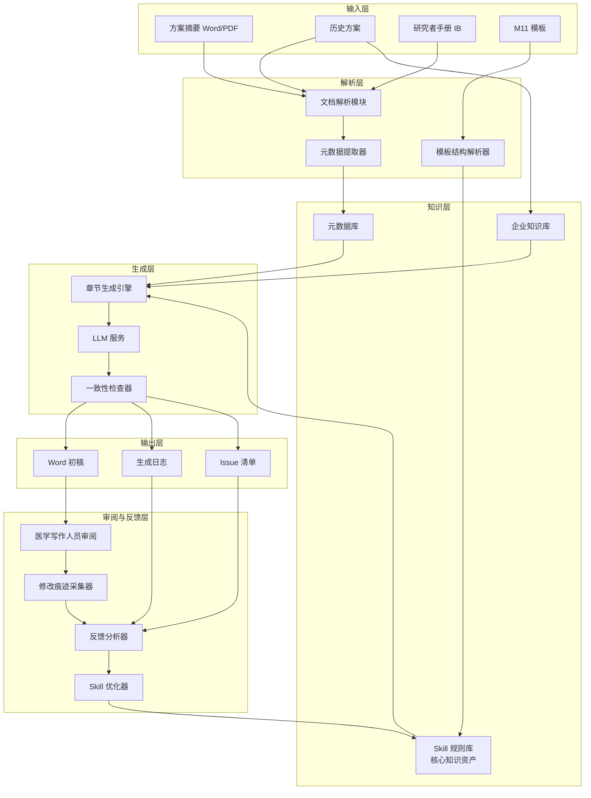
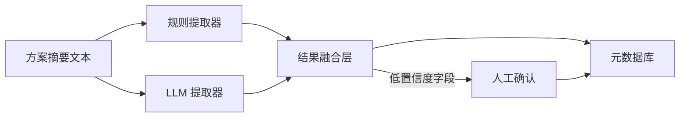
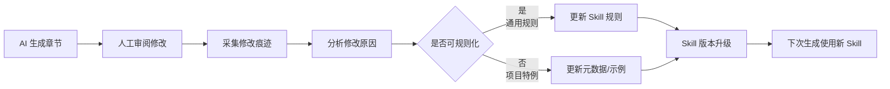
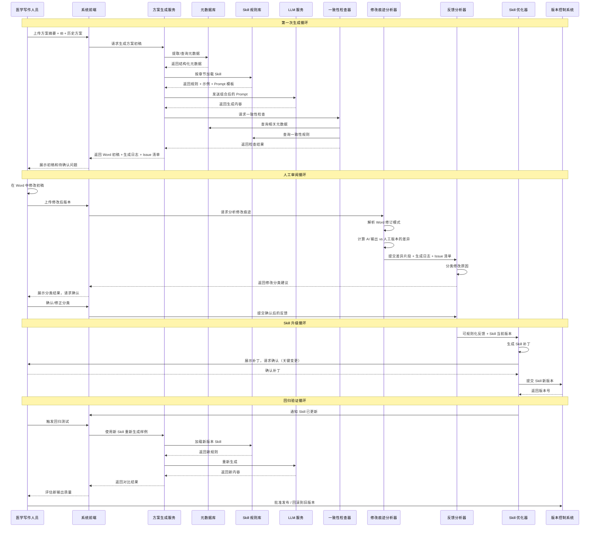

# AI 辅助方案撰写：竞品分析、差异化定位与 MVP 架构

> 本文档基于当前项目方向整理：利用 AI 基于摘要和元数据生成 M11 方案初稿，再交人工修改。

---

## 1. 竞品分析框架

### 1.1 评估维度总览

| 维度        | 权重建议 | 评估重点                        |
| --------- | ---- | --------------------------- |
| **功能能力**  | 30%  | 支持的文档类型、生成质量、章节覆盖度          |
| **合规与验证** | 25%  | GxP、CSV、21 CFR Part 11、审计追踪 |
| **技术架构**  | 20%  | 部署方式、集成能力、可扩展性              |
| **内容与知识** | 15%  | 模板支持、领域知识、历史方案复用            |
| **成本与服务** | 10%  | 价格模式、实施周期、客户成功支持            |

### 1.2 功能能力 Checklist

#### 文档生成能力

- [ ] 是否支持 ICH M11 模板结构？
- [ ] 是否支持公司自定义模板？
- [ ] 是否支持从方案摘要生成完整方案？
- [ ] 是否支持分章节独立生成？
- [ ] 生成内容是否保留占位符（如 `<输入...>`、`[选择...]`）？
- [ ] 是否支持生成多语言版本？
- [ ] 是否支持修正案生成？
- [ ] 是否支持从 SAP 反向生成统计章节？

#### 输入与元数据

- [ ] 支持哪些输入格式？（Word、PDF、Markdown、JSON）
- [ ] 是否提供结构化输入界面？
- [ ] 是否支持从研究者手册（IB）自动提取关键信息？
- [ ] 是否支持从既往方案复用内容？
- [ ] 是否支持试验设计参数导入（如 IxRS、CTMS）？

#### 输出与编辑

- [ ] 输出格式是什么？（Word、PDF、结构化 XML）
- [ ] 是否支持 Word 修订模式？
- [ ] 是否支持版本对比？
- [ ] 是否支持一键更新交叉引用？
- [ ] 是否支持样式和公司品牌定制？

#### 质量控制

- [ ] 是否有跨章节一致性检查？
- [ ] 是否有术语一致性检查？
- [ ] 是否有引用完整性检查？
- [ ] 是否能识别缺失内容并标记？
- [ ] 是否支持规则库 / Skill 管理？

### 1.3 合规与验证 Checklist

- [ ] 是否符合 GxP 要求？
- [ ] 是否支持 21 CFR Part 11 电子签名？
- [ ] 是否提供完整的审计追踪（Audit Trail）？
- [ ] 是否支持计算机化系统验证（CSV）？
- [ ] 是否有用户权限管理（RBAC）？
- [ ] 是否有数据备份和恢复机制？
- [ ] 是否提供验证文档（IQ/OQ/PQ）？
- [ ] 是否符合数据隐私法规（GDPR、中国数据安全法）？

### 1.4 技术架构 Checklist

- [ ] 是 SaaS 还是本地部署（On-premise）？
- [ ] 是否支持私有云 / VPC 部署？
- [ ] 是否提供 API 接口？
- [ ] 是否支持与企业现有系统集成？（CTMS、EDC、eTMF、RIM）
- [ ] 是否支持 SSO（单点登录）？
- [ ] 模型是否可定制？（微调、RAG、Prompt 管理）
- [ ] 是否支持多租户？
- [ ] 系统可用性 SLA 是多少？

### 1.5 内容与知识 Checklist

- [ ] 是否内置 ICH M11 模板？
- [ ] 是否内置其他模板？（如公司 SOP 模板、各国法规模板）
- [ ] 是否支持疾病领域知识库？（肿瘤、免疫、罕见病等）
- [ ] 是否支持从企业历史方案中学习？
- [ ] 是否支持医学术语库？（MedDRA、WHO-DD）
- [ ] 是否支持指南引用和更新？

### 1.6 成本与服务 Checklist

- [ ] 定价模式是什么？（按用户、按项目、按文档、按 token）
- [ ] 是否有实施费用？
- [ ] 培训和上手周期多长？
- [ ] 是否提供客户成功经理？
- [ ] 是否支持定制开发？
- [ ] 技术支持响应时间如何？
- [ ] 是否有同行业成功案例？

---

## 2. 差异化定位分析

### 2.1 现有市场玩家的典型路线

| 路线 | 代表 | 优势 | 劣势 |
|------|------|------|------|
| **CRO 服务 + 内部工具** | IQVIA、Syneos、Parexel | 有海量历史方案和专家经验 | 不单独卖软件，定制化成本高 |
| **通用医学写作 AI** | Yseop、Sorcero | 技术平台化程度高 | 需要大量企业内数据对接 |
| **结构化写作平台** | Paligo、Tridion、IXIASOFT | 内容管理能力强 | AI 生成能力弱，主要是基础设施 |
| **端到端 Agent 初创** | 少数前沿公司 | 自动化程度高 | 合规风险大，难被监管接受 |
| **大模型 + RAG 定制** | 各类初创 / 药企自建 | 灵活、可定制 | 工程质量参差不齐 |

### 2.2 我们项目的潜在定位

基于你之前描述的思路，我建议将项目定位为：

> **"面向中国药企和 CRO 的 M11 方案初稿生成 Copilot"**

核心主张：
- 不是替代医学写作人员，而是把"空白文档"变成"有内容的可编辑初稿"
- 深度适配 ICH M11 中文模板和中国监管语境
- 以"元数据 + 章节 Skill"为核心，支持持续迭代和质量提升
- 强调人机协作、可解释、可审计

### 2.3 差异化优势（可能方向）

#### 差异点 1：M11 中文模板深度适配

- 全球多数工具先适配英文 M11，中文版本可能滞后
- 可以针对中文医学写作习惯、NMPA 要求做优化
- 支持中英文对照生成

#### 差异点 2：轻量级元数据驱动

- 不需要企业前期建设庞大知识图谱
- 只需要从方案摘要提取关键元数据即可开始生成
- 降低采用门槛

#### 差异点 3：可进化的 Skill 规则库

- 把每个章节的写作规则显式化、可配置
- 医学写作人员可以持续优化 Skill，而不只是改提示词
- 形成企业的私有写作能力资产

#### 差异点 4：面向"初稿"而非"终稿"

- 不夸大 AI 能力，明确边界
- 生成内容天然预留人工修改空间
- 符合当前监管和企业接受度

#### 差异点 5：与中国企业工作流集成

- 对接飞书、钉钉、企业微信等协作工具
- 支持国产化部署（信创、私有化）
- 符合中国数据安全和隐私法规

### 2.4 风险与短板

| 风险           | 说明                 | 应对策略                |
| ------------ | ------------------ | ------------------- |
| **生成质量不稳定**  | LLM 可能产生幻觉或不一致     | 强约束模板 + 事实表 + 一致性检查 |
| **专家规则获取难**  | 高质量的 Skill 需要专业知识  | 与医学写作专家共创，持续迭代      |
| **监管接受度不确定** | 企业可能担心 AI 生成内容的合规性 | 明确人机分工，保留完整审计追踪     |
| **数据获取难**    | 需要历史方案训练/优化        | 从公开模板、去标识化样本开始      |
| **大模型成本**    | 长文档生成 token 消耗大    | 优化提示词，使用合适模型，控制生成长度 |

### 2.5 目标客户画像

**第一阶段（早期采用者）**：
- 中国本土药企的医学写作团队
- 中小型 CRO 的临床运营部门
- 有多个同领域试验、内容可复用的团队

**第二阶段（扩展）**：
- 大型药企的中国区团队
- 需要快速生成方案摘要或修正案的场景
- 医学写作外包服务商

---

## 3. MVP 技术架构草图

### 3.1 设计原则

- **最小可行**：先做通一个端到端流程，再扩展
- **模块化**：每个章节 Skill 独立，便于迭代
- **可解释**：生成过程可追溯，便于人工审阅
- **可集成**：输出为标准 Word/Markdown，便于后续处理

### 3.2 系统架构图



### 3.3 模块说明

#### 3.3.1 输入层

| 组件 | 说明 |
|------|------|
| 方案摘要 | 最重要的输入，包含试验核心设计 |
| 历史方案 | 用于风格学习和内容复用 |
| 研究者手册 | 用于第 2 章引言、获益风险评估等 |
| M11 模板 | 输出格式约束和章节结构 |

#### 3.3.2 解析层

| 组件 | 功能 |
|------|------|
| 文档解析模块 | 将 Word/PDF 转为文本或结构化数据 |
| 元数据提取器 | 从摘要中提取关键事实（目的、设计、人群、干预等） |
| 模板结构解析器 | 解析 M11 模板，提取章节结构、占位符、规则说明 |

**元数据提取策略：规则引擎 + LLM 并行**

经过测试验证，单一规则引擎无法覆盖真实世界方案摘要的多样性。因此采用**规则提取为主、LLM 增强为辅**的并行策略：



**字段分工原则**：

| 字段类型 | 推荐负责方 | 原因 |
|----------|-----------|------|
| 标题、编号、分期、适应症 | 规则引擎 | 模式稳定，正则即可覆盖 |
| 设计类型、盲法、对照、样本量 | 规则引擎 | 关键词明确，可解释性强 |
| 年龄范围、性别 | 规则引擎 | 数值/关键词模式明确 |
| 入排标准 | 规则引擎 | 列表结构稳定 |
| 药物名称、剂量、给药途径 | 规则引擎 | 实体识别规则清晰 |
| **给药频率/持续时间** | **LLM 增强** | 描述多样，如"第0、4、8周"、"诱导期+维持期" |
| **终点评估方法** | **LLM 增强** | 需要医学语义理解，如 ACR20、DAS28-CRP |
| **活动时间表** | **LLM 增强** | 需要合并多时间点和多评估项 |
| **估计目标五属性** | **LLM 增强** | ICH E9(R1) 语义复杂，规则难以胜任 |

**融合策略（推荐 LLM 后处理模式）**：

1. 规则提取器先生成结构化初稿，并标记每个字段的置信度
2. 对低置信度字段（如"未识别"、"未识别"），把原始文本片段传给 LLM
3. LLM 输出规范化补丁（JSON Patch 格式）
4. 融合层合并规则结果和 LLM 补丁
5. 对仍然不确定的字段，标记为待人工确认

**技术选型建议**：
- 文档解析：Python + `python-docx` / `PyMuPDF`
- 规则提取：正则 + 关键词 + 规则引擎
- LLM 增强：Claude / GPT-4 / 国产模型 API
- 融合层：Python + JSON Schema 校验
- 模板解析：正则 / XML 解析 / 自定义 DSL

#### 3.3.3 知识层

知识层是整个系统的核心资产层，其中 **Skill 规则库是最关键的知识资产**。

| 组件 | 功能 | 资产属性 |
|------|------|----------|
| 元数据库 | 存储从摘要提取的关键事实 | 临时数据，按项目变化 |
| **Skill 规则库** | 每个章节的写作规则、提示词模板、示例、禁忌、一致性规则 | **核心知识资产，可跨项目复用，持续增值** |
| 企业知识库 | 历史方案片段、公司术语、SOP、指南引用 | 半静态知识资产 |

**Skill 规则库的内容构成**：

```yaml
skill:
  chapter_id: "3.1.1"
  chapter_title: "主要目的和相关估计目标"
  version: "1.2"
  owner: "医学写作团队"
  
  # 1. 元数据需求
  required_metadata:
    - primary_objectives
    - secondary_objectives
    - estimands
    - target_population
    - treatment_conditions
    - endpoints
  
  # 2. 写作规则
  writing_rules:
    - "先写目的句，使用'本试验旨在评估...'句式"
    - "估计目标按 ICH E9(R1) 五属性描述"
    - "如果目的超过半页，只保留最重要的，其余交叉引用第 3 节"
  
  # 3. 禁止项
  forbidden_patterns:
    - "不得使用'证明'，应使用'评估'"
    - "不得遗漏伴发事件策略"
  
  # 4. 示例库
  examples:
    - example_id: "oncology_phase3_001"
      content: "..."
      score: 0.95
  
  # 5. 一致性规则
  consistency_rules:
    - "主要终点必须与第 8 章评估程序一致"
    - "估计目标必须与第 10 章统计方法匹配"
  
  # 6. 反馈历史
  feedback_history:
    - date: "2026-08-10"
      issue: "遗漏目标人群描述"
      fix: "在规则 2 中增加'必须明确目标人群的关键特征'"
```

**技术选型建议**：
- 元数据库：SQLite / PostgreSQL / JSON 文件
- Skill 规则库：YAML / Markdown + Git 版本控制 + Jinja2 模板
- 企业知识库：向量数据库（如 Chroma、Milvus）+ RAG

---

#### 3.3.6 Skill 资产与经验回补链路

这是把人工审阅经验持续转化为系统能力的关键闭环。



**经验回补的具体方式**：

| 回补类型 | 触发条件 | 进入 Skill 的什么位置 |
|----------|----------|----------------------|
| **规则补充** | 人工反复修改同一类错误 | 添加到 `writing_rules` 或 `forbidden_patterns` |
| **示例补充** | 人工写出特别好的段落 | 添加到 `examples`，标注领域和评分 |
| **元数据补充** | 发现 AI 缺少必要输入 | 更新 `required_metadata` |
| **一致性规则补充** | 发现跨章节不一致 | 更新 `consistency_rules` |
| **提示词优化** | 生成结构不符合预期 | 优化 prompt_template |
| **输出格式调整** | Word 样式/段落格式问题 | 更新渲染模板 |

**回补机制设计**：

1. **显式反馈**：医学写作人员在审阅界面标记问题类型和原因
2. **隐式反馈**：系统自动比较 AI 输出与人工修改后的版本，计算差异
3. **定期复盘**：每周/每月汇总高频修改类型，决定是否需要升级 Skill
4. **A/B 测试**：新 Skill 版本先在少数项目试点，验证有效后再全量发布

**Skill 版本管理**：

```
skills/
├── chapter_1_1_1/
│   ├── v1.0.yaml      # 初始版本
│   ├── v1.1.yaml      # 补充了终点描述规则
│   └── v2.0.yaml      # 增加了估计目标五属性要求
├── chapter_3_1_1/
│   ├── v1.0.yaml
│   └── v1.2.yaml
└── _meta/
    └── skill_index.json
```

**关键原则**：
- Skill 是可审计、可版本化的知识资产
- 人工修改不是结束，而是 Skill 升级的输入
- 项目经验通过 Skill 沉淀为企业能力
- 不同疾病领域可以有自己的 Skill 变体

#### 3.3.4 反馈闭环时序图



**时序图说明**：

整个反馈闭环分为四个循环：
1. **生成循环**：从输入到 Word 初稿
2. **审阅循环**：人工修改 + 修改痕迹分析 + 反馈分类
3. **升级循环**：根据确认后的反馈更新 Skill 并版本化
4. **验证循环**：用新 Skill 回归测试，确认质量提升后发布

关键设计点：
- 所有修改痕迹必须**结构化**（不是只保存 Word 文件，而是要解析出改了什么）
- 反馈分类需要**人工确认**，避免系统误判
- Skill 升级必须**版本化**，支持回滚
- 回归测试是闭环的必要环节，否则无法确认 Skill 升级是否有效

#### 3.3.5 生成层

| 组件 | 功能 |
|------|------|
| 章节生成引擎 | 根据元数据和 Skill 规则，调用 LLM 生成各章节 |
| LLM 服务 | 提供生成能力 |
| 一致性检查器 | 检查跨章节一致性、术语一致性、引用完整性 |

**技术选型建议**：
- LLM：Claude / GPT-4 / 国产大模型（根据数据隐私要求选择）
- 提示词管理：LangChain / 自研模板引擎
- 一致性检查：规则引擎 + LLM 辅助

#### 3.3.6 输出层

| 组件 | 功能 |
|------|------|
| Word 初稿 | 可编辑的方案初稿 |
| 生成日志 | 记录每段内容来自哪个输入、哪个 Skill |
| Issue 清单 | 标记缺失、冲突、待确认项 |

**技术选型建议**：
- Word 生成：`python-docx` / `docxtpl` / Pandoc
- 生成日志：Markdown 或数据库
- Issue 清单：JSON / YAML

### 3.4 数据流

```
1. 用户上传方案摘要 + 历史方案 + IB
        ↓
2. 系统解析并提取元数据到元数据库
        ↓
3. 系统根据 M11 模板解析章节结构
        ↓
4. 对每个章节，从 Skill 规则库加载对应 Skill
        ↓
5. Skill 组合：元数据 + 规则 + 示例 → Prompt
        ↓
6. 调用 LLM 生成章节内容
        ↓
7. 一致性检查器校验
        ↓
8. 渲染为 Word 初稿 + 生成日志 + Issue 清单
        ↓
9. 医学写作人员在 Word 中修改
        ↓
10. 系统采集修改痕迹，分析修改原因
        ↓
11. 可规则化的修改 → 更新 Skill 规则库
    项目特例 → 更新元数据或示例库
        ↓
12. Skill 版本升级，用于下一次生成
```

**关键变化**：
- 传统数据流到 Word 初稿就结束了
- 本架构把人工修改作为 Skill 升级的输入，形成**知识闭环**
- Skill 规则库因此持续增值，成为企业核心知识资产

### 3.5 推荐技术栈

> 2026-08-19 起，逐层论证、默认决策与切换触发点以 [[技术选型]] 为准；本节保留概要。

| 层级 | 推荐技术 | 说明 |
|------|----------|------|
| 前端 | React + TypeScript + Ant Design（SSE 推进度） | 任务式交互；飞书/钉钉通知（可选） |
| 后端 | Python + FastAPI + 独立 worker | 服务编排；PG jobs 表驱动任务状态机，MVP 不引 Celery/Redis |
| 文档处理 | `python-docx`, `PyMuPDF`, `docxtpl`, `lxml` | 解析与生成 Word/PDF、修订与批注处理 |
| 数据存储 | PostgreSQL（JSONB 存元数据）+ 本地盘/MinIO | 向量库延后，需要时先用 pgvector |
| **Skill 管理** | **YAML/Markdown + Git + Jinja2** | **知识资产版本化管理** |
| **规则提取** | **正则 + 关键词 + 规则引擎** | **元数据基础结构提取** |
| **LLM 增强** | **Claude API / OpenAI API / 国产模型 API** | **复杂医学语义理解与规范化** |
| LLM 网关 | 双泳道（生成旗舰模型 / 提取轻量模型） | 调用全量落库，支撑成本记录与模型替换 |
| 元数据融合 | Python + JSON Schema | 规则结果与 LLM 补丁合并 |
| 提示词/模板 | Jinja2 + YAML | Skill 规则渲染和 LLM Prompt 管理 |
| 一致性检查 | 规则引擎 + LLM 辅助 | 跨章节校验 |
| 修改痕迹采集 | python-docx 修订模式解析 | 提取人工修改 |
| 部署 | Docker Compose 一体化（web/worker/postgres/minio） | MVP 单包交付，即私有化形态 |

**Skill 管理特别说明**：

Skill 规则库建议用 **Git 管理的 YAML/Markdown 文件**，而不是数据库，原因：
- 可版本化，便于审计和回滚
- 便于多人协作和 Code Review
- 便于 A/B 测试和灰度发布
- 符合技术人员的工程习惯
- 可以与 CI/CD 流程集成（例如 Skill 变更自动触发测试）

### 3.7 MVP 阶段建议

**第一阶段（1-2 个月）：跑通一个章节 + 建立 Skill 闭环**

- 选择 1 个核心章节（如第 1.1.1 节"主要和次要目的"）
- 设计元数据结构
- 编写第一个 Skill（含规则、示例、一致性检查）
- 实现从摘要 → 元数据 → AI 生成 → Word 输出
- 医学写作人员修改后，手动将经验回补到 Skill
- 验证 Skill 升级后再次生成的质量提升

**第二阶段（2-4 个月）：扩展章节 + 自动化回补**

- 扩展到第 3 章、第 4 章
- 引入历史方案作为企业知识库
- 增加一致性检查
- 实现修改痕迹自动采集和分析
- 建立 Skill 版本管理和发布流程

**第三阶段（4-6 个月）：完整覆盖 + 平台化**

- 覆盖全部 14 章
- 支持模板化 Word 输出
- 支持修正案生成
- 增加审计追踪
- 建立多领域 Skill 变体（肿瘤、免疫、罕见病等）

---

## 4. 研发人员做功点分析

把整个流程拆开看，研发人员可以在以下 11 个关键点上做工。每个点都标注了**当前优先级**、**技术难点**和**推荐做法**。

### 4.1 元数据提取器

| 项目 | 说明 |
|------|------|
| **作用** | 从方案摘要、IB、历史方案中提取结构化元数据 |
| **优先级** | ⭐⭐⭐⭐⭐ 最高 |
| **技术难点** | 医学术语歧义、数字单位、多语言混合、PDF 格式不统一；真实摘要给药方案描述高度多样化 |
| **推荐做法** | 1. 先定义严格的元数据 Schema<br>2. **采用规则提取 + LLM 增强并行的混合策略**<br>3. 规则负责结构稳定字段（标题、分期、设计、样本量、入排等）<br>4. LLM 负责语义复杂字段（给药频率/持续时间、终点评估方法、活动时间表、估计目标五属性）<br>5. 对关键字段（剂量、样本量、终点）做二次校验<br>6. 建立"提取置信度"评分，低置信度字段人工确认 |
| **产出物** | 元数据 Schema、规则提取器、LLM 增强模块、融合层、校验规则、测试用例集 |

**已验证的测试发现**：

用 3 份基于公开信息重构的方案摘要（Secukinumab 银屑病、Ponesimod 银屑病、Peresolimab 类风湿关节炎）测试规则提取器后，发现：

- **规则提取表现良好**：标题、编号、分期、适应症、设计类型、盲法、对照、样本量、入排标准、统计参数
- **规则提取存在局限**：
  - 给药方案描述多样，"第 0、4、8 周给药"等模式难以用固定正则规范化为频率/持续时间
  - 不同疾病领域终点评估方法不同（ACR20、DAS28-CRP 等），规则映射表难以覆盖
  - 活动时间表中的复杂医学术语容易被截断或误提取
- **LLM 增强的目标字段**：给药方案规范化、终点评估方法识别、活动时间表整理、估计目标五属性提取

**推荐融合流程**：

```
规则提取器生成初稿
    ↓
对每个字段计算置信度
    ↓
高置信度字段 → 直接采用
中置信度字段 → LLM 校验
低置信度字段（如"未识别"） → LLM 重新提取
    ↓
LLM 输出 JSON Patch
    ↓
融合层合并结果
    ↓
人工确认不确定字段
    ↓
写入元数据库
```

### 4.2 模板结构解析器

| 项目 | 说明 |
|------|------|
| **作用** | 把 M11 Word 模板解析为章节树、占位符、条件文本 |
| **优先级** | ⭐⭐⭐⭐ 高 |
| **技术难点** | Word 样式复杂、条件文本标识不统一、层级关系解析 |
| **推荐做法** | 1. 用 `python-docx` 读取段落样式和编号<br>2. 建立标题层级识别规则（L1/L2/L3/L4）<br>3. 提取占位符（`<输入...>`、`[选择...]`、`{...}`）<br>4. 输出为结构化 JSON 章节树 |
| **产出物** | 模板解析器、章节树 Schema、占位符词典 |

### 4.3 Skill DSL 设计

| 项目 | 说明 |
|------|------|
| **作用** | 定义 Skill 的数据结构和规则表达语言 |
| **优先级** | ⭐⭐⭐⭐⭐ 最高 |
| **技术难点** | 平衡表达能力与易用性；让非研发人员也能维护 |
| **推荐做法** | 1. 用 YAML/Markdown 作为载体<br>2. 定义标准字段：metadata、rules、examples、consistency、forbidden、prompt_template<br>3. 用 Jinja2 做模板渲染<br>4. 提供 Skill 校验工具，确保格式正确 |
| **产出物** | Skill Schema、示例 Skill、校验工具 |

### 4.4 章节生成引擎

| 项目 | 说明 |
|------|------|
| **作用** | 把元数据和 Skill 组合成 Prompt，调用 LLM 生成 |
| **优先级** | ⭐⭐⭐⭐⭐ 最高 |
| **技术难点** | Prompt 长度控制、上下文组织、输出格式稳定 |
| **推荐做法** | 1. 设计"元数据 + 规则 + 示例 + 约束"的标准 Prompt 结构<br>2. 对长章节做分块生成，再拼接<br>3. 输出要求明确（如"只输出第 X 章内容"）<br>4. 添加输出格式示例（few-shot） |
| **产出物** | Prompt 模板、生成服务、输出解析器 |

### 4.5 LLM 调用与模型选择层

| 项目 | 说明 |
|------|------|
| **作用** | 统一管理模型调用、回退、成本、缓存 |
| **优先级** | ⭐⭐⭐⭐ 高 |
| **技术难点** | 长文本 token 成本高、不同模型输出风格差异、API 稳定性 |
| **推荐做法** | 1. 封装统一 LLM Client，支持多模型切换<br>2. 对生成任务做缓存（相同输入直接复用）<br>3. 设置 token 预算和超时机制<br>4. 记录每次调用的输入输出和成本 |
| **产出物** | LLM 网关、调用日志、成本监控 |

### 4.6 一致性检查器

| 项目 | 说明 |
|------|------|
| **作用** | 检查跨章节一致性、术语一致性、引用完整性 |
| **优先级** | ⭐⭐⭐⭐ 高 |
| **技术难点** | 需要理解医学语义，不能只做字符串匹配 |
| **推荐做法** | 1. 先做规则引擎（如样本量、终点、剂量的数值一致性）<br>2. 再用 LLM 做语义一致性检查<br>3. 输出结构化的 Issue 清单<br>4. 支持按严重程度分级 |
| **产出物** | 一致性规则库、检查服务、Issue 清单生成器 |

### 4.7 Word 渲染器

| 项目 | 说明 |
|------|------|
| **作用** | 把生成内容注入 M11 Word 模板，保持样式 |
| **优先级** | ⭐⭐⭐⭐ 高 |
| **技术难点** | 样式继承、占位符替换、表格生成、页眉页脚 |
| **推荐做法** | 1. 用 `docxtpl` 做模板填充<br>2. 或者用 `python-docx` 直接构建文档<br>3. 保留原始模板的样式定义<br>4. 对复杂表格单独处理 |
| **产出物** | Word 渲染服务、模板映射配置 |

### 4.8 修改痕迹采集与分析

| 项目 | 说明 |
|------|------|
| **作用** | 解析 Word 修订模式，提取人工修改内容 |
| **优先级** | ⭐⭐⭐⭐ 高 |
| **技术难点** | Word 修订 XML 复杂、中文分句、修改意图识别 |
| **推荐做法** | 1. 用 `python-docx` 读取 `w:ins`/`w:del` 元素<br>2. 把修改映射到段落和章节<br>3. 对修改做分类：补充事实、调整表述、修正错误、删除冗余<br>4. 结合生成日志定位原始 Skill 和 Prompt |
| **产出物** | 修改痕迹解析器、修改分类器 |

### 4.9 反馈分析器

| 项目 | 说明 |
|------|------|
| **作用** | 分析修改原因，判断是否可以规则化 |
| **优先级** | ⭐⭐⭐ 中高 |
| **技术难点** | 需要区分通用规则和项目特例 |
| **推荐做法** | 1. 用 LLM 对修改片段做原因分类<br>2. 建立分类体系：规则缺失、示例不足、元数据错误、格式问题、项目特例<br>3. 对高频修改类型优先升级 Skill<br>4. 人工确认分类结果，避免误判 |
| **产出物** | 反馈分类模型、人工确认界面 |

### 4.10 Skill 优化器与版本管理

| 项目 | 说明 |
|------|------|
| **作用** | 根据反馈自动/半自动生成 Skill 补丁，并版本化管理 |
| **优先级** | ⭐⭐⭐⭐ 高 |
| **技术难点** | 自动补丁可能影响其他场景；需要安全更新机制 |
| **推荐做法** | 1. 对低风险更新（如添加示例、补充规则）自动生成补丁<br>2. 对高风险更新（如修改 prompt 模板）人工审核<br>3. 用 Git 管理 Skill 版本<br>4. 支持 A/B 测试和回滚 |
| **产出物** | Skill 优化器、版本控制系统、A/B 测试框架 |

### 4.11 反馈 UI 与审阅工作流

| 项目 | 说明 |
|------|------|
| **作用** | 让医学写作人员低摩擦地审阅、修改、反馈 |
| **优先级** | ⭐⭐⭐⭐ 高 |
| **技术难点** | 医学写作人员不习惯新工具；需要与现有 Word 工作流兼容 |
| **推荐做法** | 1. 初稿输出为标准 Word，不强制使用新编辑器<br>2. 提供上传修改后 Word 的功能<br>3. 在 Web 端展示修改分类建议，支持一键确认/修正<br>4. 集成飞书/钉钉通知 |
| **产出物** | 审阅界面、反馈采集界面、通知机制 |

### 4.12 评估与回归测试体系

| 项目 | 说明 |
|------|------|
| **作用** | 量化生成质量，验证 Skill 升级是否有效 |
| **优先级** | ⭐⭐⭐ 中 |
| **技术难点** | 医学写作质量难以自动打分 |
| **推荐做法** | 1. 建立"黄金样本"测试集（人工写好的方案章节）<br>2. 用 BLEU/ROUGE 做参考性评估<br>3. 用 LLM 做质量评估（如"检查这一段是否符合 M11 要求"）<br>4. 记录人工修改比例作为核心指标<br>5. Skill 升级前必须通过回归测试 |
| **产出物** | 测试集、评估指标、回归测试流水线 |

---

## 5. 研发人员的工作优先级建议

### 第一阶段（1-2 个月）：核心生成能力

**必须做工的点**：
1. 元数据 Schema 设计
2. 模板结构解析
3. Skill DSL 设计
4. 章节生成引擎
5. Word 渲染器

**目标**：能从一个方案摘要生成一个章节的 Word 初稿。

### 第二阶段（2-4 个月）：质量与闭环

**新增做工的点**：
6. 一致性检查器
7. 修改痕迹采集
8. 反馈分析器
9. Skill 优化器与版本管理

**目标**：建立从生成到 Skill 升级的完整闭环。

### 第三阶段（4-6 个月）：平台化与规模化

**新增做工的点**：
10. LLM 网关与成本优化
11. 反馈 UI 与审阅工作流
12. 评估与回归测试体系

**目标**：覆盖 14 章，支持多用户协作，Skill 可持续进化。

---

## 6. 下一步建议

基于以上分析，建议按以下顺序推进：

1. **用 Checklist 调研 3-5 家潜在竞品**，形成竞争地图
2. **明确 1-2 个差异化卖点**，不要试图面面俱到
3. **搭建最小可行架构**，先跑通一个章节的生成流程
4. **与 1-2 位医学写作专家共创**，建立第一个高质量 Skill
5. **做一个内部 Demo**，验证从摘要到 Word 初稿的端到端流程
6. **建立反馈闭环机制**，从第一个 Demo 开始就记录人工修改并反哺 Skill

---

*本文档由 Claude 基于项目讨论整理，供战略规划参考。*
