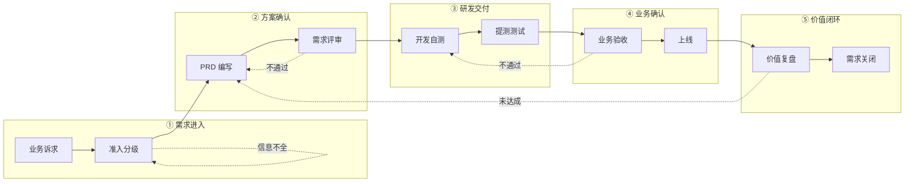
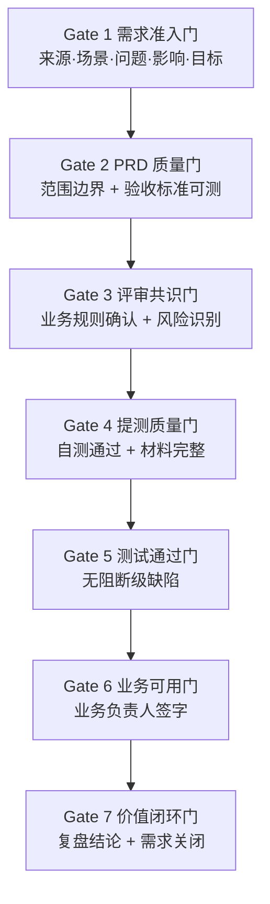
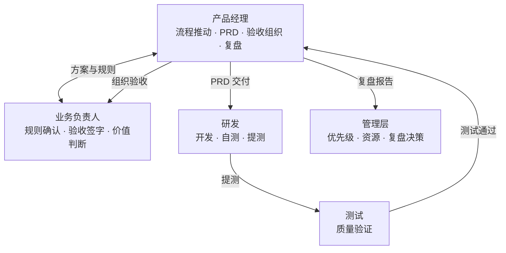
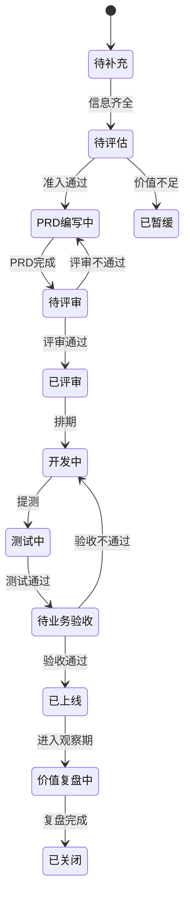

	# 业务需求 → 业务价值验收 SOP 总纲

> **适用**：医药公司产品、研发、业务、质量、合规相关团队  
> **用途**：流程宣讲、跨部门对齐、管理汇报  
> 	**详细标准**：见文末「分阶段文档索引」

---

## 一、为什么要有这套 SOP？

```text
痛点                          目标
────────────────────────────────────────────────
口头/微信直推研发        →    统一入口，需求可追溯
做了功能，业务仍不能用   →    业务验收，确认真正可用
上线即结束              →    价值复盘，验证是否达标
各方理解不一致          →    PRD 契约 + 评审共识
```

**一句话**：把「有人提了需求」变成「业务问题被解决、价值可衡量」。

---

## 二、全流程一张图



### 阶段速览（汇报用）

| 阶段 | 做什么 | 谁牵头 | 关键产出 | 过关条件 |
|:----:|--------|--------|----------|----------|
| **1** 准入 | 登记诉求、评优先级 | 产品 | 需求池记录 | 5 项必填 + P 级 |
| **2** PRD | 写清方案与验收口径 | 产品 | PRD + 原型 | 背景/范围/规则/验收齐全 |
| **3** 评审 | 各方对齐、识别风险 | 产品 | 评审纪要 | 业务确认规则，研发确认可行 |
| **4** 交付 | 开发 → 自测 → 测试 | 研发/测试 | 提测说明 + 测试报告 | 无阻断 Bug |
| **5** 验收 | 业务按真实场景验证 | 业务负责人 | 验收记录 | 业务签字通过 |
| **6** 复盘 | 验证是否产生价值 | 产品 + 业务 | 复盘报告 | 达成/部分达成/未达成 |

---

## 三、六道质量门（Gate）

不满足，**不得进入下一阶段**。



---

## 四、角色分工（RACI 精简版）



| 阶段 | 产品 | 业务 | 研发 | 测试 |
|------|:----:|:----:|:----:|:----:|
| 需求准入 | **负责** | 配合 | 知会 | 知会 |
| PRD 编写 | **负责** | 确认 | 评估 | 评估 |
| 需求评审 | 组织 | **确认** | 评估 | 评估 |
| 开发提测 | 跟进 | 知会 | **负责** | 验收 |
| 业务验收 | 组织 | **确认** | 支持 | 支持 |
| 价值复盘 | **负责** | **判断** | 支持 | 支持 |

---

## 五、需求状态流转（看板视角）



> **记住**：`已上线 ≠ 已关闭`。完成价值复盘后才能关闭。

---

## 六、医药行业特别关注点

汇报时可强调：**我们不是只做功能，是做合规、可追溯的业务能力。**

| 环节 | 医药重点 | 常见翻车点 |
|------|----------|------------|
| 需求准入 | 是否涉及 GxP、审批留痕、敏感数据 | 口头需求，无业务场景 |
| PRD | 流程节点、审批人、数据口径、版本追溯 | 规则模糊，「按现有流程」 |
| 评审 | 质量/合规/审计是否参与高风险需求 | 业务规则未书面确认 |
| 提测 | 审批记录完整、关键数据不可随意改 | 能走通流程，但无留痕 |
| 业务验收 | 真实业务场景操作，非只看页面 | 测试过了，一线仍不会用 |
| 价值复盘 | 合规率、准确率、处理时长、审计问题数 | 上线即忘，重复踩坑 |

---

## 七、优先级怎么定？（30 秒版）

| 等级 | 什么时候用 | 响应 |
|:----:|------------|------|
| **P0** | 核心流程中断、合规风险、重大客户阻断 | 立即处理 |
| **P1** | 影响核心业务、关键客户、明确时间窗口 | 优先排期 |
| **P2** | 有提效/体验价值，不阻断业务 | 正常排期 |
| **P3** | 低频、局部、价值不明确 | 观察池 |

**原则**：优先级看价值评分，不看职位、不看谁催得急。

---

## 八、节奏建议（推行用）

| 动作 | 频率 | 时长 | 目的 |
|------|------|------|------|
| 需求池梳理 | 每周 | 30 min | 清待补充、调优先级 |
| 需求评审 | 每周 1–2 次 | 60 min | 批量对齐方案 |
| 版本验收 | 按发布节奏 | 60–90 min | 业务签字 |
| 价值复盘 | 每月 | 60 min | 上月上线需求回顾 |

---

## 九、5 分钟汇报话术（可直接用）

> **开场（30 秒）**  
> 我们推行这套 SOP，是为了解决三个问题：需求来源乱、做了不能用、上线没复盘。目标是把每个需求从「有人提了」走到「价值可验证」。

> **流程（2 分钟）**  
> 全流程分五步：需求准入 → 方案确认（PRD+评审）→ 研发交付 → 业务验收 → 价值复盘。每步有一道质量门，不过关不能往下走。产品负责推动和文档，业务负责规则确认和验收签字，研发和测试负责交付质量。

> **医药特色（1 分钟）**  
> 对我们行业，重点不是页面好不好看，而是流程是否合规、审批是否留痕、数据是否准确、版本是否可追溯。高风险需求必须拉质量/合规一起评审。

> **落地（1 分钟）**  
> 近期三件事：① 所有需求统一进需求池；② PRD 必须写验收标准和复盘指标；③ 已上线需求按月复盘，结论反哺下期优先级。

> **收尾（30 秒）**  
> 详细执行标准已沉淀在 7 份分阶段文档里，今天讲的是总纲。下一步我们选 1–2 个需求试点跑通全流程。

---

## 十、一页纸 Checklist

**需求进入**
- [ ] 有编号、有来源、有场景、有问题、有影响、有目标
- [ ] 优先级已评定（P0–P3）

**方案确认**
- [ ] PRD 写清「本期做 / 不做」
- [ ] 验收标准可测试（谁、在什么条件下、做什么、得到什么）
- [ ] 评审通过，业务规则已确认

**研发交付**
- [ ] 研发自测完成
- [ ] 提测说明完整
- [ ] 测试无阻断 Bug

**业务验收**
- [ ] 业务负责人按真实场景验收并签字
- [ ] 数据口径、权限、审批流程已确认

**价值闭环**
- [ ] 上线后进入观察期
- [ ] 输出复盘报告（达成 / 部分达成 / 未达成）
- [ ] 需求状态更新为「已关闭」

---

## 十一、分阶段文档索引

需要查细则时，点进对应文档：

| 阶段 | 文档 | 什么时候看 |
|------|------|------------|
| 需求准入 | [[01-需求准入与分级标准]] | 登记新需求、定优先级 |
| PRD 编写 | [[02-PRD产品需求文档标准]] | 写方案、准备评审 |
| 需求评审 | [[03-需求评审标准]] | 组织评审会 |
| 开发提测 | [[04-开发提测标准]] | 研发提测、测试接收 |
| 业务验收 | [[05-业务验收标准]] | 组织业务验收 |
| 价值复盘 | [[06-需求价值复盘标准]] | 上线后复盘 |
| 状态流转 | [[07-需求池与状态流转标准]] | 维护需求池看板 |

---

## 十二、下一步落地建议

1. **选工具**：需求池用飞书多维表格 / TAPD / Jira（选一个，不混用）
2. **选试点**：挑 1 个 P2 需求，2 周内跑完全流程
3. **定节奏**：固定每周需求评审时间
4. **定人**：每个需求明确产品负责人 + 业务负责人
5. **一个月后**：复盘 SOP 本身，调整摩擦点

---

*版本：V1.0 · 医药行业定制 · 2026-07*
