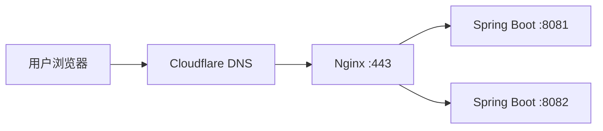
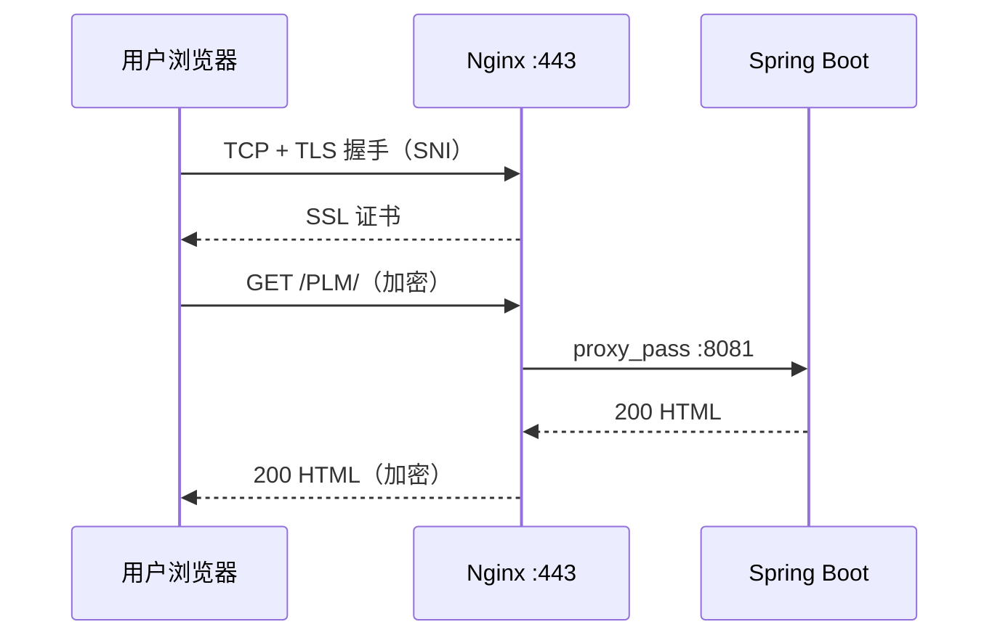
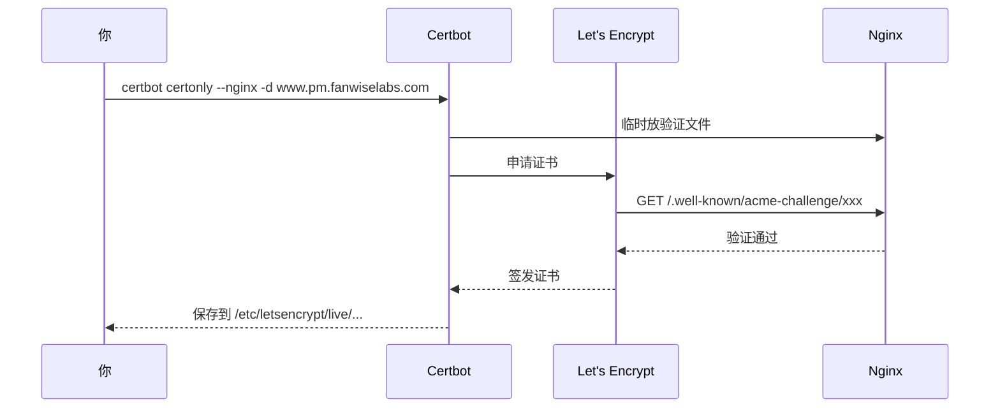

# HTTPS 与 Nginx 部署知识库

> 整理自临床研发管线管理系统上线排查过程。  
> 关联项目：[[README|华东医药研发管线管理系统]]  
> 服务器：`115.29.228.67`  
> 目标域名：`www.pm.fanwiselabs.com`  
> 应用入口：`/PLM/`

---

## 目录

- [[#1-整体架构]]
- [[#2-80-与-443-默认端口]]
- [[#3-HTTPS-完整请求流程]]
- [[#4-SNI-服务器名称指示]]
- [[#5-DNS-与-SSL-证书的关系]]
- [[#6-SSL-证书是谁发的]]
- [[#7-Let's-Encrypt-在链路中的角色]]
- [[#8-证书验证两种方式]]
- [[#9-HTTPS-握手后还会请求-80-吗]]
- [[#10-反向代理是什么]]
- [[#11-本项目-Nginx-配置解读]]
- [[#12-常见问题对照表]]
- [[#13-推荐配置与上线清单]]
- [[#14-英文缩写对照表]]

---

## 1. 整体架构

```text
用户浏览器
    ↓
DNS（Cloudflare）
    ↓  域名 → IP
115.29.228.67（云服务器）
    ↓
Nginx（80 / 443 端口）
    ↓  反向代理（proxy_pass）
Spring Boot 应用（8081 / 8082 两个实例）
```

**Nginx 做两件事：**

1. **HTTPS 终结**：对外提供 SSL 证书，解密 HTTPS
2. **反向代理**：把请求转发给后端 Java 应用

**应用不直接暴露在公网 8081/8082**，而是藏在 Nginx 后面。



---

## 2. 80 与 443 默认端口

| 协议 | 默认端口 | 说明 |
|---|---|---|
| **HTTP** | **80** | 明文网页访问 |
| **HTTPS** | **443** | 加密网页访问（TLS/SSL） |

**写地址时可以不写端口：**

- `http://example.com` = `http://example.com:80`
- `https://example.com` = `https://example.com:443`

**80 和 443 是两条独立通道：**

| 端口 | 用途 |
|---|---|
| 80 | 明文 HTTP，或只做 301 跳转到 HTTPS |
| 443 | HTTPS 全程（TLS 握手 + HTTP 请求/响应） |

---

## 3. HTTPS 完整请求流程

以 `https://www.pm.fanwiselabs.com/PLM/` 为例：

```text
① DNS 解析
   www.pm.fanwiselabs.com → 115.29.228.67

② TCP 三次握手（只连 443，不连 80）
   浏览器 ←──────────────→ Nginx :443

③ TLS 握手（还在 443 上）
   - 浏览器发送 SNI: www.pm.fanwiselabs.com
   - Nginx 选择匹配的 server 块和证书
   - 浏览器验证证书
   - 协商会话密钥

④ HTTP 请求（同一条 443 连接，已加密）
   GET /PLM/ HTTP/1.1
   Host: www.pm.fanwiselabs.com

⑤ Nginx 反向代理
   proxy_pass → http://127.0.0.1:8081 或 8082

⑥ HTTP 响应（同一条连接返回，已加密）
   HTTP/1.1 200 OK + HTML

⑦ 浏览器渲染页面
```



**关键理解：HTTPS = HTTP 跑在 TLS 加密通道里，全程在 443 上完成。**

---

## 4. SNI（Server Name Indication）

**全称：** Server Name Indication（服务器名称指示）

**作用：** TLS 握手时，客户端提前告诉服务器「我要访问哪个域名」，服务器据此选择对应的虚拟主机和 SSL 证书。

### Nginx 如何根据 SNI 选证书

```nginx
# 站点 A
server {
    listen 443 ssl;
    server_name www.pm.fanwiselabs.com;
    ssl_certificate /etc/letsencrypt/live/www.pm.fanwiselabs.com/fullchain.pem;
}

# 默认站点（兜底）
server {
    listen 443 ssl default_server;
    server_name _;
    ssl_certificate /etc/ssl/default/self-signed.pem;
}
```

**匹配过程：**

```text
收到 SNI: www.pm.fanwiselabs.com
    ↓
找 server_name 匹配的 server 块
    ↓
用该块的 ssl_certificate 做 TLS 握手
```

### 为什么 IP 访问和域名访问结果不同

| 访问方式 | SNI | 结果 |
|---|---|---|
| `https://115.29.228.67` | 无 SNI 或 IP | 走 default_server，用默认证书 |
| `https://www.pm.fanwiselabs.com` | `www.pm.fanwiselabs.com` | 必须匹配 server_name 和证书 |

**本项目曾出现的问题：** `server_name` 是 `www.pm.fanwiselabs.com`，证书却签给 `www.fanwiselabs.com` → 域名访问失败。

---

## 5. DNS 与 SSL 证书的关系

**两者独立，但上线 HTTPS 时两个都要配对。**

| | DNS | SSL 证书 |
|---|---|---|
| **作用** | 域名 → IP（导航） | 证明 HTTPS 站点属于该域名（身份证） |
| **谁管** | Cloudflare | Let's Encrypt / CA |
| **何时参与** | 每次访问前先解析 | TLS 握手时验证 |

```text
DNS（Cloudflare）：  www.pm.fanwiselabs.com → 115.29.228.67
证书（Nginx）：      签给 www.pm.fanwiselabs.com，装在 443 上
```

**Cloudflare 管 DNS ≠ 自动给源站配好证书。** 证书还要在服务器上用 Certbot 申请。

### DNS 记录类型（常用）

| 类型 | 全称 | 作用 |
|---|---|---|
| **A** | Address Record | 域名 → IPv4 |
| **TXT** | Text Record | 存文本（证书 DNS 验证时用） |
| **CNAME** | Canonical Name | 域名别名 |

---

## 6. SSL 证书是谁发的

**SSL 证书由 CA（Certificate Authority，证书颁发机构）签发。**

| 角色 | 做什么 | 发证书吗 |
|---|---|---|
| **CA（Let's Encrypt）** | 验证域名、签发证书 | ✅ |
| **Certbot** | 帮你在服务器上申请、保存、续期 | ❌ 只是工具 |
| **Cloudflare** | DNS 解析；橙云时可提供边缘 SSL | 边缘 SSL 由 CF 发 |
| **Nginx** | 读取证书，HTTPS 时使用 | ❌ |
| **浏览器** | 验证证书是否可信 | ❌ |

### 证书链

```text
根 CA（内置在操作系统/浏览器）
    ↓
中间 CA（如 Let's Encrypt R3）
    ↓
你的网站证书（www.pm.fanwiselabs.com）
```

`fullchain.pem` = 网站证书 + 中间 CA 证书。

### 费用

| 类型 | 费用 | 说明 |
|---|---|---|
| **Let's Encrypt** | 免费 | 90 天有效，Certbot 自动续期 |
| **Cloudflare 免费 SSL** | 免费 | 域名走橙云代理时 |
| **付费 DV/OV/EV** | 付费 | 一般不需要 |

---

## 7. Let's Encrypt 在链路中的角色

**Let's Encrypt = 免费 CA，只在「申请/续期证书」时出现，不参与日常用户访问。**

### 申请证书流程（HTTP 验证，本项目常用）



### 日常用户访问（LE 不在场）

```text
用户 → DNS → Nginx（出示 LE 之前签发的证书）→ 浏览器验证 → 返回页面
```

### 续期

- 证书 **90 天**有效
- Certbot 定时任务在过期前 **30 天**自动续期
- 查看：`sudo certbot certificates`

---

## 8. 证书验证两种方式

**二选一即可，不需要两个都做。**

| | HTTP 验证 | DNS 验证 |
|---|---|---|
| **命令** | `certbot --nginx` | `certbot --manual --preferred-challenges dns` |
| **验证方式** | 访问服务器上的临时文件 | 查 Cloudflare 里的 TXT 记录 |
| **要不要改 Cloudflare** | **不要** | **要**（加 `_acme-challenge` TXT） |
| **前提** | 80 端口通、DNS 已指向服务器 | 能改 DNS |
| **适用** | Nginx 已在公网（本项目） | 通配符证书、Web 未部署 |

### 为什么不能给 baidu.com 随便发证

Let's Encrypt 必须验证你控制该域名：

- 申请 `www.baidu.com` → 验证失败（你控制不了百度 DNS/服务器）
- 本机自签名 → 浏览器不信任，只影响本机

**证书的价值 = 受信任 CA 签发 + 域名验证通过。**

---

## 9. HTTPS 握手后还会请求 80 吗

**不会。** HTTPS 握手成功后，HTTP 请求和响应都在 **同一条 443 加密连接** 上完成。

```text
✅ 443 = TCP + TLS + HTTP，全在一起
❌ 不是：443 握手 → 80 要数据
```

**唯一涉及 80 的场景：**

| 场景 | 80 的作用 |
|---|---|
| 用户访问 `http://...` | 301 跳转到 HTTPS（不传页面数据） |
| Certbot HTTP 验证 | 临时验证文件 |

---

## 10. 反向代理是什么

| | 正向代理 | 反向代理 |
|---|---|---|
| **代理对象** | 客户端（用户） | 服务端（后端） |
| **方向** | 帮用户向外访问 | 帮服务器向内接客 |
| **例子** | VPN、Mihomo | Nginx `proxy_pass` |
| **用户感知** | 用户主动配代理 | 用户不知道后面有后端 |

```text
正向：你 → Mihomo → 外网
反向：用户 → Nginx → Spring Boot 8081/8082
```

**Nginx `proxy_pass` = 反向代理：** 用户只和 Nginx 说话，Nginx 再转发给 Java 应用。

---

## 11. 本项目 Nginx 配置解读

### 实际架构

| 项目 | 值 |
|---|---|
| 服务器 IP | `115.29.228.67` |
| 正式域名 | `www.pm.fanwiselabs.com` |
| 应用入口 | `/PLM/` |
| 后端 | `127.0.0.1:8081` + `8082` |
| 证书 | Let's Encrypt（Certbot 管理） |

### 曾发现的配置问题

| 问题 | 后果 |
|---|---|
| `server_name` = `www.pm.fanwiselabs.com`，证书签给 `www.fanwiselabs.com` | 域名 HTTPS 失败 |
| 80 端口非目标 Host 返回 404 | `http://IP` 打不开 |
| 访问 `www.fanwiselabs.com`（错误域名） | 与配置不匹配 |

### location 规则

```nginx
location = /PLM {
    return 301 /PLM/;    # /PLM → /PLM/（URL 规范化）
}

location ^~ /PLM/ {
    proxy_pass http://study_management_backend/;   # 应用主入口
}

location / {
    proxy_pass http://study_management_backend;    # 其他路径
}
```

**`return 301 /PLM/` 含义：** 把不带末尾斜杠的 `/PLM` 永久重定向到 `/PLM/`，避免子路径部署时资源路径错乱。

---

## 12. 常见问题对照表

| 现象 | 原因 | 归属 |
|---|---|---|
| 域名解析不到 IP | Cloudflare A 记录未配 | DNS |
| IP 能开、域名 HTTPS 失败 | 证书/`server_name` 不匹配 | 证书 + Nginx |
| `http://IP` 404 | 80 未配跳转 | Nginx |
| 浏览器报证书错误 | 证书域名与访问域名不一致 | 证书 |
| 本地 DNS 解析到 `198.18.0.x` | Mihomo fake-ip 代理 | 本机代理 |
| TLS 握手失败 | SNI 无匹配证书 | Nginx + 证书 |

---

## 13. 推荐配置与上线清单

### 推荐 Nginx 配置（`conf.d/study-management.conf`）

```nginx
upstream study_management_backend {
    least_conn;
    server 127.0.0.1:8081 max_fails=3 fail_timeout=10s;
    server 127.0.0.1:8082 max_fails=3 fail_timeout=10s;
    keepalive 32;
}

# 80 → HTTPS 跳转
server {
    listen 80;
    server_name www.pm.fanwiselabs.com;
    return 301 https://$host$request_uri;
}

# 443 正式站点
server {
    listen 443 ssl;
    server_name www.pm.fanwiselabs.com;

    ssl_certificate     /etc/letsencrypt/live/www.pm.fanwiselabs.com/fullchain.pem;
    ssl_certificate_key /etc/letsencrypt/live/www.pm.fanwiselabs.com/privkey.pem;
    include /etc/letsencrypt/options-ssl-nginx.conf;
    ssl_dhparam /etc/letsencrypt/ssl-dhparams.pem;

    client_max_body_size 20m;

    location = /PLM {
        return 301 /PLM/;
    }

    location ^~ /PLM/ {
        proxy_pass http://study_management_backend/;
        proxy_http_version 1.1;
        proxy_set_header Connection "";
        proxy_set_header Host $host;
        proxy_set_header X-Real-IP $remote_addr;
        proxy_set_header X-Forwarded-For $proxy_add_x_forwarded_for;
        proxy_set_header X-Forwarded-Proto $scheme;
    }

    location = / {
        return 301 /PLM/;
    }

    location / {
        proxy_pass http://study_management_backend;
        proxy_http_version 1.1;
        proxy_set_header Connection "";
        proxy_set_header Host $host;
        proxy_set_header X-Real-IP $remote_addr;
        proxy_set_header X-Forwarded-For $proxy_add_x_forwarded_for;
        proxy_set_header X-Forwarded-Proto $scheme;
    }
}
```

### 申请证书

```bash
sudo certbot certonly --nginx -d www.pm.fanwiselabs.com
sudo nginx -t
sudo systemctl reload nginx
```

### Cloudflare DNS

| 类型 | 名称 | 值 |
|---|---|---|
| A | `www.pm` | `115.29.228.67` |

### 上线 Checklist

```text
□ DNS: www.pm.fanwiselabs.com → 115.29.228.67
□ 证书: 签给 www.pm.fanwiselabs.com（与 server_name 一致）
□ Nginx: 443 配 proxy_pass，80 做 301 跳转
□ 后端: 8081、8082 都在跑
□ 访问: https://www.pm.fanwiselabs.com/PLM/
```

### 验证命令

```bash
nslookup www.pm.fanwiselabs.com
curl -I http://127.0.0.1:8081/PLM/
curl -I https://www.pm.fanwiselabs.com/PLM/
sudo certbot certificates
sudo nginx -t
```

---

## 14. 英文缩写对照表

### 网络与协议

| 缩写 | 全称 | 中文 |
|---|---|---|
| HTTP | HyperText Transfer Protocol | 超文本传输协议 |
| HTTPS | HTTP Secure | 安全超文本传输协议 |
| TLS | Transport Layer Security | 传输层安全 |
| SSL | Secure Sockets Layer | 安全套接字层 |
| TCP | Transmission Control Protocol | 传输控制协议 |
| IP | Internet Protocol | 网际协议 |
| DNS | Domain Name System | 域名系统 |
| SNI | Server Name Indication | 服务器名称指示 |
| HSTS | HTTP Strict Transport Security | HTTP 严格传输安全 |

### 证书相关

| 缩写 | 全称 | 中文 |
|---|---|---|
| CA | Certificate Authority | 证书颁发机构 |
| ACME | Automatic Certificate Management Environment | 自动证书管理环境 |
| DV | Domain Validation | 域名验证型证书 |
| PEM | Privacy-Enhanced Mail | 证书/密钥文件格式 |
| CN | Common Name | 证书通用名称（主域名） |
| SAN | Subject Alternative Name | 证书备用域名 |

### 角色与工具

| 名称 | 角色 |
|---|---|
| Let's Encrypt | 免费 CA，签发证书 |
| Certbot | 向 LE 申请/续期的客户端工具 |
| Cloudflare | DNS 解析（+ 可选 CDN/SSL） |
| Nginx | 反向代理 + HTTPS 终结 |

---

## 一句话总结

```text
DNS 告诉浏览器「域名在哪台机器」
证书告诉浏览器「这台机器的 HTTPS 站确实是这个域名」
Nginx 在 443 终结 HTTPS，proxy_pass 转发给 Spring Boot
Let's Encrypt 免费发证，Certbot 申请，90 天自动续期
三者（DNS、server_name、证书域名）必须一致
```

---

#部署 #HTTPS #Nginx #SSL #Cloudflare #Let's-Encrypt #临床研发管线管理系统
