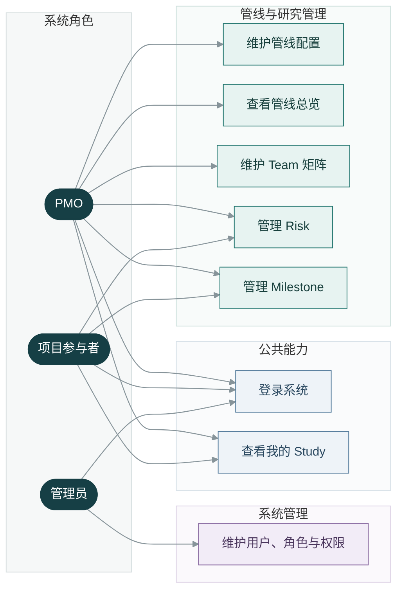
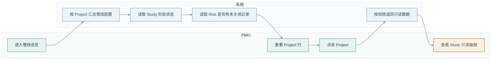
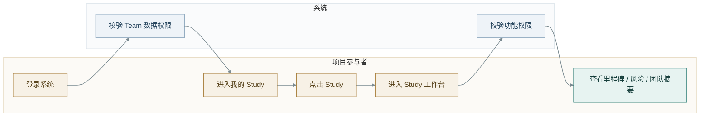
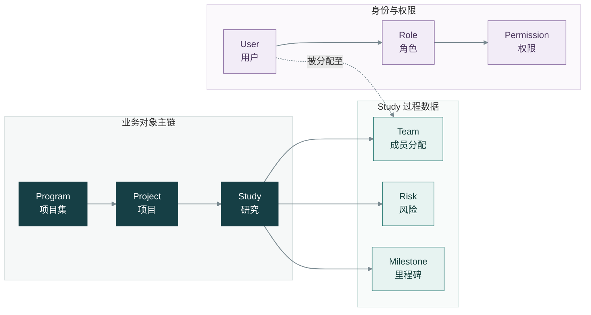
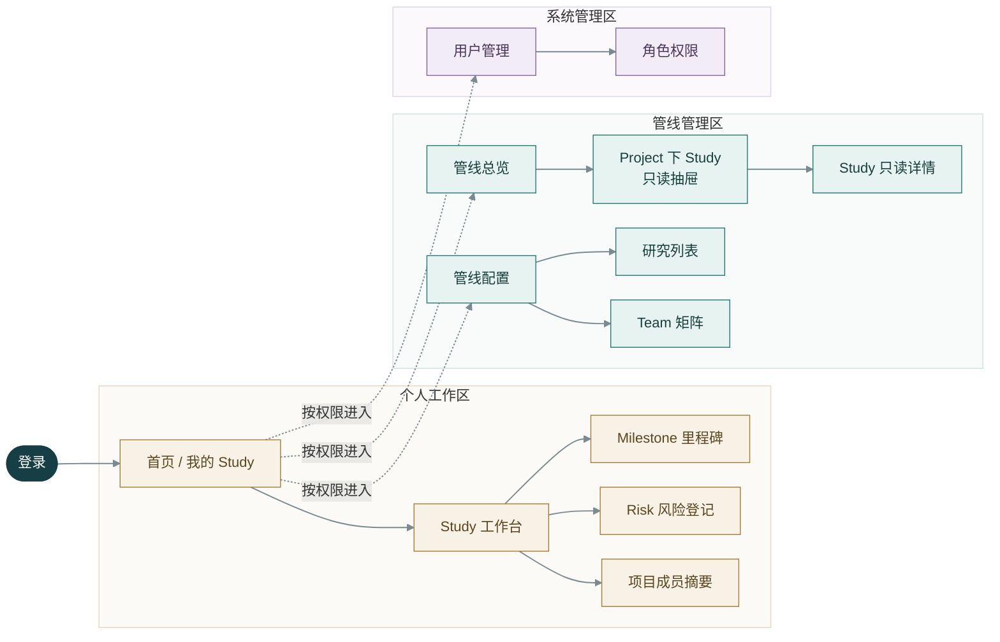

# 研发管线管理系统

> **产品需求文档 PRD**  
> 产品范围：V1 核心业务闭环 · 文档版本：V3.0 · 状态：需求封版

---

| 文档属性 | 内容 |
| :--- | :--- |
| **产品名称** | 研发管线管理系统 |
| **文档类型** | 产品需求文档（PRD） |
| **产品版本** | V1 |
| **文档版本** | V3.0 |
| **文档状态** | 第一版需求封版 |
| **更新日期** | 2026-07-13 |
| **适用对象** | 产品设计、系统设计、研发、测试及项目相关干系人 |
| **文档归属** | 华东医药研发管线管理系统项目 |
| **需求负责人** | 待补充 |
| **评审参与人** | PMO、研发职能代表、系统管理员、研发与测试代表 |

> [!IMPORTANT]
> 本文档描述的是 **产品 V1 范围**。V3.0 指 PRD 的结构与表达版本，不代表产品需求新增或产品升级。

## 阅读导航

| 想了解什么 | 建议阅读 |
| :--- | :--- |
| 为什么要建设该系统 | [项目背景与目标](#2-项目背景与目标) |
| V1 做什么、不做什么 | [V1 范围](#7-v1-范围) |
| Program、Project、Study 的关系 | [业务对象关系](#8-业务对象关系) |
| 用户能看什么、改什么 | [用户角色与权限概览](#4-用户角色与权限概览)、[数据与权限规则](#10-数据与权限规则) |
| 每个页面如何设计 | [页面需求](#9-页面需求) |
| 如何判断 V1 是否交付完成 | [验收标准](#13-验收标准) |
| 汇总数据如何计算 | [数据加工与统计口径](#14-数据加工与统计口径) |
| 如何组织内部上线 | [内部上线与协同方案](#16-内部上线与协同方案) |
| 如何验证产品效果 | [产品验证计划](#17-产品验证计划) |
| 哪些需求留待后续 | [后续规划 / TODO](#18-后续规划--todo) |

## 一页摘要

### 产品定位

研发管线管理系统是面向 **PMO 与研发流程参与者** 的项目管理平台。PMO 负责建立和维护 Study、配置 Team 并查看 Project 级管线总览；研发参与者围绕自己被分配的 Study，维护里程碑与风险等关键过程信息。

### 核心业务闭环

### 五项核心决策

| # | 决策 | V1 结论 |
| :---: | :--- | :--- |
| 01 | 核心业务层级 | `Program → Project → Study` |
| 02 | 过程数据挂载维度 | Team、Risk、Milestone 统一挂在 Study |
| 03 | 普通成员数据可见性 | 由 Team 分配决定可见的 Study |
| 04 | 权限安全边界 | 后端强制校验；多角色权限取并集 |
| 05 | 管线总览展示维度 | 按 Project 展示，阶段状态读取对应 Study |

### V1 范围速览

| V1 包含 | V1 暂不包含 |
| :--- | :--- |
| 登录、我的 Study、Study 工作台 | 通知提醒、附件上传 |
| 管线总览、管线配置、研究列表 | 月度进展、月度报告 |
| Team、Risk、Milestone | 导出、外部系统集成 |
| 用户、角色、权限、审计、软删除 | Risk / Team / Milestone Excel 导入 |

---

## 1. 文档约定

| 约定 | 说明 |
| :--- | :--- |
| 需求状态 | 本文所列 V1 需求均视为已确认，标记为 TODO 的内容除外。 |
| 权限表述 | 页面显示不等于安全控制，最终权限均以后端校验结果为准。 |
| 删除表述 | 文中“删除”默认指软删除；明确说明物理删除时除外。 |
| 图表格式 | 业务关系及流程使用 Mermaid，便于继续维护。 |

## 2. 项目背景与目标

### 2.1 背景

当前研发管线、Study、项目团队、风险、里程碑等信息主要依赖 Excel 和人工汇总维护，容易出现以下问题：

- Program / Project / Study 层级关系不够结构化。
- PMO 需要反复人工汇总各项目参与者提供的信息。
- 项目参与者只关心自己负责的 Study，但入口和权限边界不清晰。
- Risk、Milestone、Team 分配等关键过程信息缺少统一留痕。
- 管线总览需要展示 Project 维度信息，同时又要映射 Study 阶段状态。

### 2.2 系统目标

V1 目标是建设一个结构化、可追溯、权限可控的研发管线管理平台：

- PMO 统一维护管线配置、创建 Study、分配 Team、查看管线总览。
- 项目参与者查看自己被分配的 Study，并维护自己权限范围内的过程信息。
- 系统以 Study 为核心承载 Team、Risk、Milestone 等过程数据。
- 统一控制角色权限和数据权限。
- 替代散落 Excel 和人工汇总，为后续月报、通知、附件、导出、外部集成预留基础。

### 2.3 产品价值

| 视角 | 当前问题 | V1 价值 |
| :--- | :--- | :--- |
| **组织 / 管理** | PMO 依赖 Excel 汇总，信息分散且更新口径不一致 | 建立统一的管线、Study、Team、Risk、Milestone 数据入口 |
| **产品 / 系统** | Project 与 Study 状态映射不清晰，权限逻辑容易散落在页面 | 形成稳定的业务层级、数据挂载关系和后端权限边界 |
| **用户 / 协作** | 参与者难以快速定位自己负责的 Study 和待维护信息 | 通过“我的 Study”提供个人工作入口，并保留关键变更记录 |

### 2.4 用户故事地图

```mermaid
%%{init: {"flowchart": {"curve": "basis", "nodeSpacing": 30, "rankSpacing": 44}}}%%
flowchart LR
  subgraph Discover["建立项目"]
    A1["PMO 创建 Study"] --> A2["维护 Program / Project<br/>及主数据"]
  end
  subgraph Organize["组织团队"]
    B1["PMO 配置 Team"] --> B2["参与者获得<br/>Study 可见权"]
  end
  subgraph Execute["执行研究"]
    C1["参与者查看<br/>我的 Study"] --> C2["维护 Milestone"] --> C3["登记与跟踪 Risk"]
  end
  subgraph Govern["汇总管理"]
    D1["PMO 查看<br/>Project 管线"] --> D2["下钻查看 Study<br/>只读详情"]
  end

  A2 --> B1
  B2 --> C1
  C3 --> D1

  classDef pmo fill:#E7F3F1,stroke:#23766F,color:#173F3C;
  classDef member fill:#F7F1E6,stroke:#A57A35,color:#5B461F;
  class A1,A2,B1,D1,D2 pmo;
  class B2,C1,C2,C3 member;
  style Discover fill:#F8FBFA,stroke:#CFE1DE;
  style Organize fill:#FAFBFC,stroke:#D8E1E8;
  style Execute fill:#FCFAF6,stroke:#E5D8BE;
  style Govern fill:#F8FBFA,stroke:#CFE1DE;
  linkStyle default stroke:#7A8A91,stroke-width:1.4px;
```

核心用户故事：

| 编号 | 角色 | 用户故事 | 验证结果 |
| :--- | :--- | :--- | :--- |
| US-01 | PMO | 作为 PMO，我希望创建并维护 Study，以便建立统一的研发管线台账。 | Study No 唯一；保存后自动生成固定 Milestone。 |
| US-02 | PMO | 作为 PMO，我希望为 Study 分配各职能参与者，以便明确人员分工和数据可见范围。 | Team 支持多成员；分配后成员可看到该 Study。 |
| US-03 | 项目参与者 | 作为参与者，我希望只看到自己参与的 Study，以便快速进入负责的工作。 | “我的 Study”仅返回 Team 分配给当前用户的数据。 |
| US-04 | 项目参与者 | 作为参与者，我希望维护 Study 的里程碑和风险，以便记录执行状态和关键问题。 | 用户按后端权限完成查看或编辑，变更保留审计记录。 |
| US-05 | PMO | 作为 PMO，我希望按 Project 查看各阶段 Study 状态，以便掌握研发管线进展。 | Ph1 至 Ph3-2 格子显示对应 Study 的实际状态。 |
| US-06 | 管理员 | 作为管理员，我希望自定义角色权限集合，以便灵活控制系统能力。 | 多角色权限取并集，后端强制校验。 |

## 3. 术语说明

| 术语 | 说明 |
| --- | --- |
| Program | 项目集或产品管线层级，通常位于 Project 之上，用于归集一组相关研发项目。 |
| Project | 项目层级，可理解为某个产品或化合物在特定适应症方向上的项目单元。 |
| Study / 研究 | 具体研究执行单元。本系统中“研究”等同于 Study，Team、Risk、Milestone 都挂在 Study 维度。 |
| Project Indication | Project 级别的适应症字段，即该 Project 对应的治疗方向或疾病方向。 |
| IND | Investigational New Drug，新药临床试验申请。药物进入临床试验前通常需要完成 IND 申报。 |
| NDA | New Drug Application，新药上市申请。药物完成关键研究后，向监管机构提交上市申请。 |
| Milestone | 里程碑，指研发过程中固定的关键节点，例如启动、申报、完成、获批等。V1 中里程碑模板固定。 |
| Risk | 风险，指 Study 执行过程中需要识别、记录、跟进和关闭的风险事项。 |
| PMO | Project Management Office，项目管理办公室或管线管理角色，负责管线、项目协调和汇总管理。 |
| PL / PM | 项目相关负责人字段。具体职责以企业内部分工为准，系统中作为 Study / Project 展示与筛选字段。 |
| TA | Therapeutic Area，治疗领域，例如肿瘤、免疫、代谢等。V1 中作为字典类字段维护。 |

## 4. 用户角色与权限概览

### 4.1 业务角色

| 角色 | 业务定位 | 典型能力 |
| --- | --- | --- |
| PMO | 管线与项目管理者 | 维护管线配置、查看管线总览、分配 Team、管理 Risk、管理 Milestone。 |
| 项目参与者 | 研发流程参与人员 | 查看被分配的 Study，进入 Study 工作台，查看或按权限维护 Risk / Milestone。 |
| 管理员 | 系统管理者 | 维护用户、角色、权限集合。 |

### 4.2 权限原则

- 系统不在前端硬编码 PMO、管理员、项目参与者的权限逻辑。
- 后端通过“角色权限集合”判断功能权限。
- 用户可拥有多个角色，最终权限取所有角色权限的并集。
- Team 分配决定普通成员可见哪些 Study。
- 能看到 Study 后，是否可新增、编辑、删除具体数据，由后端功能权限继续判断。
- 前端只做菜单、按钮、入口的体验控制，不作为安全边界。

## 5. 用例图

## 6. 核心业务流程泳道图

### 6.1 Study 创建与团队分配流程

### 6.2 管线总览查看流程

### 6.3 普通成员处理 Study 流程

## 7. V1 范围

### 7.1 V1 包含

- 登录页。
- 首页 / 我的 Study。
- Study 工作台。
- 管线总览页。
- 管线总览 Study 只读抽屉。
- 管线配置页。
- 研究列表页。
- Team 矩阵页。
- Risk 风险登记页。
- Milestone 里程碑页。
- 用户管理页。
- 角色权限页。
- 审计记录。
- 软删除。
- 管线配置标准模板导入。

### 7.2 V1 不做

- 通知提醒。
- 附件上传。
- 导出 / 月报生成。
- 月度进展 / 月度报告入口。
- 外部系统集成。
- Risk Excel 导入。
- Team Excel 导入。
- Milestone Excel 导入。

### 7.3 交付范围

| 项目 | V1 约定 |
| :--- | :--- |
| **使用终端** | PC Web 管理端 |
| **产品形态** | PC Web 内部业务系统；具体技术架构在系统设计阶段确定 |
| **目标用户** | PMO、研发流程参与者、系统管理员 |
| **账户来源** | 系统内人工维护，不接入企业统一账户系统 |
| **历史数据** | V1 仅支持管线配置标准模板导入；不支持任意历史 Excel 智能解析 |
| **期望上线时间** | 待项目排期确认 |
| **是否需要产品走查** | 是，至少覆盖需求评审、联调走查和上线验收 |

### 7.4 需求清单

| 编号 | 模块 | 核心功能 | 关键规则 | 优先级 |
| :--- | :--- | :--- | :--- | :---: |
| FR-01 | 登录与账户 | 邮箱密码登录、用户启停 | 用户人工维护；禁用用户不可登录 | P0 |
| FR-02 | 我的 Study | 查看当前用户可见 Study | PMO 可看全部；普通成员由 Team 分配决定 | P0 |
| FR-03 | Study 工作台 | 查看 Study 上下文、里程碑、风险、团队摘要 | 根据后端权限决定查看与编辑能力 | P0 |
| FR-04 | 管线配置 | 创建、编辑、软删除 Study 主数据 | Study No 唯一且不可修改；所有核心字段必填 | P0 |
| FR-05 | 管线总览 | 按 Project 汇总阶段状态与风险信号 | 阶段格仅显示对应 Study 实际状态；无总体状态 | P0 |
| FR-06 | 研究列表 | 分页查询 Study | 页面不允许新增或删除 | P1 |
| FR-07 | Team 矩阵 | 按 Study 和 Function 分配成员 | 一列一个 Study；单元格支持多人；单元格级更新 | P0 |
| FR-08 | Risk | 新建、查询、编辑、关闭风险 | Risk 挂 Study；总分自动计算；不展示业务序号 | P0 |
| FR-09 | Milestone | 查看与维护固定里程碑 | 创建 Study 时自动生成；页面不可新增或删除 | P0 |
| FR-10 | 角色权限 | 用户、角色、权限集合管理 | 权限取角色并集；后端为安全边界 | P0 |
| FR-11 | 审计与删除 | 关键变更留痕、核心数据软删除 | 保留操作人、时间、变更前后值 | P1 |
| FR-12 | 标准导入 | 管线配置模板校验与整批导入 | 任一行错误则整批不写入 | P1 |

## 8. 业务对象关系

### 8.1 对象关系说明

### 8.2 核心规则

- Program、Project、Study 是核心业务层级。
- 管线配置实际维护的是 Study 维度数据，但展示上更关注 Program / Project。
- Study 是 Team、Risk、Milestone 的挂载维度。
- 管线总览以 Project 为行展示，同时读取 Study 阶段状态填充 Ph1、Ph2、Pre-3、Ph3-1、Ph3-2。
- Team 分配决定项目参与者是否可见某个 Study。
- Risk 只要能看到 Study 即可查看；编辑能力仍由后端权限控制。
- Milestone 模板固定，Study 创建时自动生成全量里程碑。

## 9. 页面需求

### 9.0 页面地图

页面按使用场景分为三组：

| 页面组 | 服务对象 | 页面 |
| :--- | :--- | :--- |
| **个人工作区** | 研发流程参与者 | 登录、我的 Study、Study 工作台、Risk、Milestone |
| **管线管理区** | PMO | 管线总览、只读抽屉、管线配置、研究列表、Team 矩阵 |
| **系统管理区** | 管理员或授权用户 | 用户管理、角色权限 |

> [!NOTE]
> 以下页面均使用统一规格模板：页面定位 → 使用角色 → 数据来源 → 字段 → 操作 → 权限 → 状态 → 验收标准。涉及安全的规则始终以后端判断为准。

### 9.1 登录页

| 项目 | 内容 |
| --- | --- |
| 页面定位 | 系统登录入口。 |
| 使用角色 | 所有用户。 |
| 数据来源 | 用户账号、密码、用户状态、角色权限。 |
| 字段 | 邮箱、密码。 |
| 操作 | 登录。 |
| 权限 | 禁用用户不可登录。登录成功后根据权限返回菜单与数据范围。 |
| 空状态 / 异常状态 | 邮箱或密码错误提示；账号禁用提示。 |
| 验收标准 | 无注册、忘记密码、验证码、SSO、MFA；登录成功进入首页 / 我的 Study。 |

### 9.2 首页 / 我的 Study

| 项目         | 内容                                                          |
| ---------- | ----------------------------------------------------------- |
| 页面定位       | 登录后的工作入口，展示当前用户可见的 Study。                                   |
| 使用角色       | PMO、项目参与者、管理员按权限可见。                                         |
| 数据来源       | Study、Team 分配、用户权限。                                         |
| 字段         | Study、Program、Project、Indication、当前阶段、当前状态、PL、PM、最近更新、更新时间。 |
| 操作         | 查询、分页、点击 Study 进入 Study 工作台。                                |
| 权限         | PMO 可查看全部；普通成员只能看到 Team 分配给自己的 Study。                       |
| 空状态 / 异常状态 | 普通成员无 Study 时提示联系 PMO；PMO 无 Study 时提示先维护管线配置。               |
| 验收标准       | 不展示统计卡片；只展示未软删除 Study；支持分页查询。                               |

### 9.3 Study 工作台

| 项目 | 内容 |
| --- | --- |
| 页面定位 | 单个 Study 的操作入口，用于查看关键上下文并跳转处理里程碑、风险、团队摘要。 |
| 使用角色 | 对该 Study 有可见权限的用户。 |
| 数据来源 | Study、Team、Risk、Milestone。 |
| 字段 | Study No、Study 名称、Project、Indication、当前阶段、当前状态、PL、PM、团队摘要、里程碑摘要、风险摘要、最近更新。 |
| 操作 | 查看 Study 上下文；进入 Milestone；进入 Risk；查看团队摘要。 |
| 权限 | 先校验 Team 数据权限，再校验功能权限。 |
| 空状态 / 异常状态 | Study 不存在或已删除时不可进入；无权限时提示无访问权限。 |
| 验收标准 | 页面采用工作台布局；Team 摘要只读；不在工作台内直接新增 Risk。 |

### 9.4 管线总览页

| 项目 | 内容 |
| --- | --- |
| 页面定位 | PMO 查看 Project 维度管线状态的总览页面。 |
| 使用角色 | 有管线总览查看权限的用户，通常为 PMO。 |
| 数据来源 | 管线配置、Study 阶段状态、Risk、Team。 |
| 字段 | Product、Program、Project、Project Indication、TA、Ph1、Ph2、Pre-3、Ph3-1、Ph3-2、PL、PM、风险提示、最近更新。 |
| 操作 | 查询、排序、点击 Project 打开 Study 只读抽屉。 |
| 权限 | 只读；后端按用户权限返回可见数据。 |
| 空状态 / 异常状态 | 无数据时提示先维护管线配置；阶段无对应 Study 时显示“-”。 |
| 验收标准 | 阶段格子只显示状态；不展示 Project 总体状态；风险提示只展示“有风险 / 无风险”。 |

管线总览状态颜色：

| 状态 | 颜色语义 |
| --- | --- |
| 未开始 | 灰色 |
| 进行中 | 蓝色 |
| 延迟 | 橙色 |
| 暂停 | 黄色 |
| 已完成 | 绿色 |
| 已终止 | 红色 |

### 9.5 管线总览 Study 只读抽屉

| 项目 | 内容 |
| --- | --- |
| 页面定位 | 从 Project 行查看其下 Study 列表与 Study 详情。 |
| 使用角色 | 有管线总览查看权限且可查看该 Project 数据的用户。 |
| 数据来源 | Study、Risk、Milestone、Team。 |
| 字段 | Study 列表字段：Study、当前阶段、当前状态、PL、PM、风险提示、最近更新。详情 Header：Study No、Study 名称、Program、Project、Indication、当前阶段、当前状态、PL、PM。 |
| 操作 | 点击 Project 打开抽屉；点击 Study 查看只读详情；返回 Study 列表。 |
| 权限 | 全部只读；后端控制是否可读取。 |
| 空状态 / 异常状态 | Project 下无可见 Study 时展示空状态。 |
| 验收标准 | 抽屉中 Milestone、Risk、项目成员管理三个 Tab 全部只读；不提供新增、编辑、删除、导入。 |

### 9.6 管线配置页

| 项目 | 内容 |
| --- | --- |
| 页面定位 | PMO 维护 Study 级管线基础数据。 |
| 使用角色 | 有管线配置权限的用户。 |
| 数据来源 | Study 主数据、TA 字典、Source / Origin 枚举。 |
| 字段 | Study No、Study 名称、Source、Origin、Product、MOA、Program、Project、Project Indication、TA、Phase3 项目区分。 |
| 操作 | 查询、新增、编辑、软删除、标准模板导入。 |
| 权限 | 后端控制新增、编辑、删除、导入权限。 |
| 空状态 / 异常状态 | 无数据时提示新增 Study；导入失败时展示行级错误并整批不导入。 |
| 验收标准 | Study No 必须唯一且创建后不可修改；创建 Study 后自动生成固定 Milestone；新增、编辑页面不包含阶段与状态、负责人对应字段。 |

字段规则：

- 所有核心业务字段必填。
- Phase3 项目区分仅用于 Ph3-1、Ph3-2 展示槽位，取值为 Ph3-1、Ph3-2。
- 同一 Project 下不得出现重复的 Ph3-1 或 Ph3-2。
- Product、Program、Project、Project Indication 支持自由录入和历史值联想。
- TA 是数据库字典字段。
- Source 枚举：自研、引进、合作。
- Origin 枚举：进口、国产。

### 9.7 研究列表页

| 项目 | 内容 |
| --- | --- |
| 页面定位 | 从研究执行视角查看 Study 列表。 |
| 使用角色 | 对 Study 有可见权限的用户。 |
| 数据来源 | Study、Team、当前阶段、当前状态。 |
| 字段 | Study、Program、Project、Project Indication、当前阶段、当前状态、PL、PM、最近更新、更新时间、操作。 |
| 操作 | 查询、分页、点击 Study 进入工作台。 |
| 权限 | 不允许在该页面新增或删除 Study。 |
| 空状态 / 异常状态 | 无 Study 时按角色提示维护或联系 PMO。 |
| 验收标准 | 列表字段全部展示；保留按当前阶段、当前状态、PL、PM 的条件查询。 |

### 9.8 Team 矩阵页

| 项目 | 内容 |
| --- | --- |
| 页面定位 | PMO 为 Study 分配各职能参与人，同时形成普通成员的 Study 可见性来源。 |
| 使用角色 | 有 Team 矩阵查看 / 编辑权限的用户，通常为 PMO 和管理员。 |
| 数据来源 | Study、User、Team assignment。 |
| 字段 | 一列一个 Study；基础行：Study No、Project、Project Indication、Status；职能行：PL、APL、PM、APM、RA、CM、CP、PV、TM、CO、Lab、Supply、ST、PG、DM、MW、NC、CMC、IP。 |
| 操作 | 查询、分页、横向滚动、单元格编辑用户、移除单元格用户。 |
| 权限 | 后端控制可见 Study 和可编辑单元格；普通成员不进入全局 Team 矩阵。 |
| 空状态 / 异常状态 | 无 Study 时提示先维护管线配置；无用户可选时提示先维护用户。 |
| 验收标准 | 不按 Tab 分组；不提供 Excel 导入；不提供页面级删除；只做单元格级更新。 |

Team 单元格规则：

- 允许多人。
- 用户展示为“姓名（邮箱）”。
- 新增时只能选择启用用户。
- 删除单元格用户只表示移除该 Study / Function 的人员分配，不物理删除用户。
- 不做主负责人标识。

### 9.9 Risk 风险登记页

| 项目 | 内容 |
| --- | --- |
| 页面定位 | 统一登记和维护 Study 维度风险。 |
| 使用角色 | 有 Risk 查看 / 新增 / 编辑权限的用户。 |
| 数据来源 | Study、Team、Risk。 |
| 字段 | 产品、Program / 项目集、Project / 项目、Study、Function、风险描述、影响评分、可能性评分、可检测性评分、风险总分、风险归属、已有控制措施、沟通情况、阶段性评估日期、额外控制措施、行动责任人、完成日期、触发再评估原因、评估后措施、风险状态。 |
| 操作 | 查询、新建、点击行打开编辑抽屉、保存。 |
| 权限 | Study 可见后才能看到对应 Risk；新增 / 编辑由后端功能权限控制。 |
| 空状态 / 异常状态 | 无风险时展示空状态；状态为已关闭但未填完成日期时阻止保存。 |
| 验收标准 | 不展示业务风险编号或序号；不提供 Excel 导入；新建 Risk 只在全局 Risk 页完成。 |

Risk 规则：

- Risk 挂在 Study 维度。
- Function 必填，来自 Study Team 的职能角色。
- 风险状态固定枚举：待处理、处理中、已关闭。
- 影响评分、可能性评分、可检测性评分均为 1-5。
- 风险总分 = 影响评分 * 可能性评分 * 可检测性评分。
- 风险归属和行动责任人从该 Study 的有效 Team 成员中选择，单选。
- 完成日期仅在风险状态为已关闭时必填。
- 触发再评估原因可选。
- 保留 Function 和 Status 查询条件。

### 9.10 Milestone 里程碑页

| 项目 | 内容 |
| --- | --- |
| 页面定位 | 查看和维护 Study 固定里程碑执行情况。 |
| 使用角色 | 对 Study 有可见权限且具备 Milestone 权限的用户。 |
| 数据来源 | Study、Milestone 模板、Milestone 执行记录。 |
| 字段 | Study 列表字段：Study、Program、产品 / 化合物、Indication、当前阶段、当前状态、PL、PM。明细字段：Milestone、Ver 1.0、Ver 2.0、Actual Start、Actual End、Note。 |
| 操作 | 查询 Study、进入单 Study 明细、编辑、保存。 |
| 权限 | 后端控制查看和编辑权限。 |
| 空状态 / 异常状态 | Study 不存在或已删除时不可进入；无里程碑模板时提示初始化模板。 |
| 验收标准 | 所有里程碑全部展示且全部展开；不允许页面新增 / 删除里程碑；不提供 Excel 导入。 |

Milestone 规则：

- 每个 Study 创建时生成全量固定里程碑。
- Ver 1.0 是初始计划日期。
- Ver 2.0 是调整后计划日期。
- Actual Start / Actual End 是实际开始和实际完成日期。
- Actual End 有值时，行状态为已完成。
- Actual Start 有值且 Actual End 为空时，行状态为进行中。
- Actual Start 和 Actual End 均为空时，行状态为未开始。
- Note 用于记录延迟 / 提前原因，选填。
- 如果 Actual End 早于或晚于 Ver 2.0，系统提示填写原因，但不强制。

### 9.11 用户管理页

| 项目 | 内容 |
| --- | --- |
| 页面定位 | 管理系统用户。 |
| 使用角色 | 有用户管理权限的用户。 |
| 数据来源 | User、Role。 |
| 字段 | 姓名、邮箱、状态、角色、创建时间、更新时间。 |
| 操作 | 新增、编辑、启用、禁用、分配角色。 |
| 权限 | 后端控制用户管理权限。 |
| 空状态 / 异常状态 | 邮箱重复时阻止保存；禁用用户不可登录也不可被新分配到 Team。 |
| 验收标准 | 不与企业系统打通；用户通过人工维护；邮箱作为登录账号和 Team 识别字段。 |

### 9.12 角色权限页

| 项目 | 内容 |
| --- | --- |
| 页面定位 | 维护角色和权限集合。 |
| 使用角色 | 有角色权限管理权限的用户。 |
| 数据来源 | Role、Permission。 |
| 字段 | 角色名称、角色说明、权限集合、状态。 |
| 操作 | 新增角色、编辑角色、配置权限、启用 / 停用。 |
| 权限 | 后端控制角色权限管理能力。 |
| 空状态 / 异常状态 | 角色仍被用户使用时，停用或调整需提示影响范围。 |
| 验收标准 | 权限取用户多个角色的并集；V1 不做字段级权限；初始角色和权限集合属于初始化配置。 |

### 9.13 核心交互结果矩阵

本节明确用户操作后的页面反馈与数据变化，作为交互设计、接口设计和测试用例的共同依据。

| 操作 | 前置条件 | 页面反馈 | 数据变化 | 审计要求 |
| :--- | :--- | :--- | :--- | :--- |
| 创建 Study | 具备管线配置新增权限；必填字段合法 | 保存成功后返回列表并展示新记录 | 新增 Study；生成全量固定 Milestone | 记录创建人和创建时间 |
| 编辑 Study | 具备编辑权限；Study 未删除 | 保存成功并刷新最近更新时间 | 更新允许编辑的主数据；Study No 不变 | 记录变更前后值 |
| 删除 Study | 具备删除权限；用户确认影响范围 | 记录从前台列表、我的 Study 和总览消失 | 写入软删除标记；关联历史数据保留 | 记录删除人和删除时间 |
| 分配 Team 成员 | 具备 Team 单元格编辑权限；用户启用 | 单元格立即展示“姓名（邮箱）” | 新增 Study、Function、User 分配关系 | 记录新增分配关系 |
| 移除 Team 成员 | 具备 Team 单元格编辑权限 | 成员从对应单元格消失 | 终止对应分配关系；不删除用户 | 记录移除前后值 |
| 新建 Risk | Study 可见且具备 Risk 新增权限 | 保存成功后关闭抽屉并刷新列表 | 新增 Study 维度 Risk；自动计算风险总分 | 记录创建信息 |
| 关闭 Risk | 具备 Risk 编辑权限；已填写完成日期 | 状态显示为“已关闭” | 更新状态和完成日期 | 记录状态变化 |
| 编辑 Milestone | Study 可见且具备编辑权限 | 保存后刷新行状态 | 更新计划、实际日期或 Note；状态自动计算 | 记录日期与备注变化 |
| 导入管线配置 | 文件通过全部校验；用户确认导入 | 先展示预览；完成后返回成功结果 | 整批写入；任一行错误时全部不写入 | 记录导入人、时间和批次结果 |

## 10. 数据与权限规则

### 10.1 层级关系

- Program 下可有多个 Project。
- Project 下可有多个 Study。
- Study No 全局唯一。
- Study 是 Team、Risk、Milestone 的统一挂载维度。
- 管线总览以 Project 为行，但阶段状态来自 Study。

### 10.2 阶段与状态

阶段枚举：

- 立项前。
- 立项中。
- IND 准备。
- IND 申报。
- 临床 I 期。
- 临床 II 期。
- 临床 III 期。
- NDA 准备。
- NDA 申报。
- 获批上市。
- 上市后研究。
- 终止。

状态枚举：

- 未开始。
- 进行中。
- 暂停。
- 延迟。
- 已完成。
- 已终止。

### 10.3 Phase3 项目区分

- Phase3 项目区分是 Study 级字段。
- 取值仅为 Ph3-1、Ph3-2。
- 该字段用于解决同一 Project 下多个 Ph3 Study 在管线总览中无法映射展示的问题。
- 同一 Project 下 Ph3-1 和 Ph3-2 不允许重复。
- 管线总览中 Ph3-1、Ph3-2 格子展示对应 Study 的实际状态。

### 10.4 Risk 规则

- Risk 挂 Study。
- 只要用户能看 Study，即可按权限查看其 Risk。
- Risk 编辑由后端功能权限控制。
- 管线总览风险提示只显示“有风险 / 无风险”。
- Project 下任一 Study 存在未关闭 Risk，则该 Project 风险提示为“有风险”。

### 10.5 Milestone 规则

- Milestone 挂 Study。
- 所有 Milestone 来自固定模板。
- Study 创建时自动生成全量 Milestone。
- Milestone 页面不允许新增或删除里程碑。
- Milestone 行状态由 Actual Start / Actual End 自动计算。

### 10.6 权限规则

- 用户通过人工维护，不接入企业账号系统。
- 用户可拥有多个角色。
- 多角色权限取并集。
- 角色由权限集合组成。
- 权限包括功能权限和数据权限。
- Team 分配决定普通成员可见哪些 Study。
- 后端强制校验所有权限。
- 前端只用于优化入口、按钮、菜单展示。

## 11. 数据导入策略

### 11.1 V1 导入范围

V1 仅支持管线配置标准模板导入。
不支持：
- Risk 导入。
- Team 导入。
- Milestone 导入。
- 任意 Excel 智能识别导入。

### 11.2 管线配置导入规则

- 系统提供标准模板下载。
- 模板包含字段说明 Sheet。
- 上传后先预览校验结果。
- 用户确认后才写入数据。
- 整批导入不允许部分成功：任意行错误时整批不写入。
- 唯一键为 Study No。
- 校验内容包括必填字段、Study No 唯一性、枚举值、字典值、Phase3 唯一性、Project / Study 关系合法性。

## 12. 审计与删除规则

### 12.1 审计字段

核心业务表保留：

- created_by。
- created_at。
- updated_by。
- updated_at。

### 12.2 关键变更日志

以下操作需要记录变更日志：

- Team 成员分配变更。
- Risk 新增、编辑、关闭。
- Milestone 日期和备注更新。
- Study 新增、编辑、软删除。

日志至少包含：

- 操作人。
- 操作时间。
- 操作类型。
- 业务对象。
- Study。
- 变更前内容。
- 变更后内容。

### 12.3 软删除

- 核心业务数据不物理删除。
- 删除使用 deleted、deleted_by、deleted_at 标记。
- Study 软删除后不在前台列表、我的 Study、研究列表、管线总览中展示。
- Study 软删除后，其历史 Team、Risk、Milestone 保留。
- 管线配置删除 Study 时，如已有关联数据，需要提示用户影响范围。

## 13. 验收标准

### 13.1 登录与权限

- 禁用用户不能登录。
- 用户多角色时，功能权限按角色权限并集生效。
- 普通成员只能看到 Team 分配给自己的 Study。
- 后端必须校验权限，不能仅依赖前端隐藏按钮。

### 13.2 管线配置

- Study No 必须唯一。
- Study No 创建后不可修改。
- 创建 Study 后自动生成固定 Milestone。
- 同一 Project 下 Ph3-1 / Ph3-2 不允许重复。
- 管线配置支持标准模板导入。
- 管线配置删除为软删除。

### 13.3 管线总览

- 管线总览按 Project 维度展示。
- 阶段格子只显示状态。
- 无对应 Study 的阶段格子显示“-”。
- 不展示 Project 总体状态。
- 风险提示只展示“有风险 / 无风险”。
- 点击 Project 打开 Study 只读抽屉。

### 13.4 Study 与 Team

- 新建 Study 后自动出现在 Team 矩阵中。
- Team 矩阵一列一个 Study。
- Team 单元格允许多人。
- Team 只支持单元格级更新。
- Team 不提供 Excel 导入。
- 普通成员不进入全局 Team 矩阵。

### 13.5 Risk

- Risk 必须挂到 Study。
- Risk 不展示业务风险编号或序号。
- Risk 风险总分自动计算。
- Risk 状态为已关闭时，完成日期必填。
- Risk 页保留 Function 和 Status 查询。
- Risk 不提供 Excel 导入。

### 13.6 Milestone

- Milestone 挂到 Study。
- Milestone 展示所有固定里程碑。
- Milestone 明细默认全部展开。
- Milestone 不允许页面新增 / 删除。
- Milestone 不提供 Excel 导入。
- 行状态由 Actual Start / Actual End 自动计算。

## 14. 数据加工与统计口径

V1 不建设独立 BI 或算法模块，但以下展示结果涉及跨表计算，必须统一口径。

| 输出结果 | 数据来源 | 加工规则 | 更新时机 |
| :--- | :--- | :--- | :--- |
| 我的 Study 列表 | Study、Team assignment、User | PMO 按权限查看全部；普通成员仅返回有效 Team 分配关联的 Study | 查询时实时计算 |
| 管线总览阶段状态 | Project、Study、当前阶段、当前状态、Phase3 项目区分 | 按 Project 汇总；Ph1、Ph2、Pre-3、Ph3-1、Ph3-2 分别读取对应 Study 实际状态 | 查询时实时计算 |
| Project 风险提示 | Project、Study、Risk status | Project 下任一有效 Study 存在未关闭 Risk，则显示“有风险” | 查询时实时计算 |
| Risk 风险总分 | 影响评分、可能性评分、可检测性评分 | 三项评分相乘；任一评分缺失时不得形成有效总分 | 编辑时实时计算，保存时后端复算 |
| Milestone 行状态 | Actual Start、Actual End | Actual End 有值为已完成；仅 Actual Start 有值为进行中；均为空为未开始 | 查询或保存时计算 |
| 最近更新 | Study 及关联关键业务记录 | 取该 Study 主数据、Team、Risk、Milestone 最近一次有效更新时间 | 查询时聚合 |

数据时效要求：

- V1 所有页面读取业务库实时数据，不建设离线数仓同步链路。
- 所有聚合结果由后端按统一口径返回，前端不自行拼接权限或核心业务口径。
- 软删除数据不进入前台列表与汇总计算，但继续保留用于审计和历史追溯。

## 15. 埋点与数据分析需求

本系统为内部管理工具，V1 不以曝光率、点击率、转化率作为产品目标。为评估系统是否真正替代人工汇总，建议保留最小必要的使用分析事件；该部分不影响业务审计日志。

| 事件名称 | 触发场景 | 建议属性 | 用途 |
| :--- | :--- | :--- | :--- |
| `login_success` | 用户登录成功 | user_id、role_ids、time | 评估实际使用用户规模 |
| `study_open` | 用户进入 Study 工作台 | study_id、entry_page、user_id | 识别主要工作入口 |
| `team_assignment_change` | Team 成员分配发生变化 | study_id、function、change_type | 评估团队配置完成度；同时属于审计事件 |
| `risk_saved` | Risk 新建或编辑成功 | study_id、function、status | 评估风险登记覆盖情况；同时属于审计事件 |
| `milestone_saved` | Milestone 保存成功 | study_id、milestone_id | 评估里程碑维护活跃度；同时属于审计事件 |
| `pipeline_view` | 用户进入管线总览 | user_id、filter_count | 评估 PMO 总览使用情况 |
| `pipeline_import_result` | 管线配置导入结束 | batch_id、success、error_count | 评估导入质量和模板问题 |

> [!NOTE]
> 产品分析事件用于统计使用情况；审计日志用于追溯责任与数据变更。两者目的不同，不可互相替代。是否在 V1 实施独立埋点，由技术设计阶段结合成本确认。

## 16. 内部上线与协同方案

该系统属于企业内部研发管理工具，不采用面向市场的 GTM（Go-to-Market，产品上市推广）模式。V1 上线重点是内部启用、数据初始化和使用规范落地。

| 阶段 | 参与人 | 主要工作 | 退出条件 |
| :--- | :--- | :--- | :--- |
| 需求评审 | PMO、研发职能代表、产品、研发、测试 | 确认业务范围、字段、权限和验收标准 | P0 需求无未决阻塞项 |
| 初始化准备 | PMO、管理员 | 准备 TA 字典、Milestone 模板、初始用户与角色权限 | 初始化清单完成并复核 |
| 内部试用 | PMO 与少量 Study 参与者 | 录入代表性 Project / Study，完整走通 Team、Risk、Milestone | 核心闭环可执行，无阻塞缺陷 |
| 全量迁移 | PMO | 使用标准模板导入确认过的管线配置，人工配置 Team | 数据抽查通过 |
| 正式启用 | 全体目标用户 | 新增和更新数据统一进入系统 | Excel 不再作为新增数据主入口 |

培训与支持：

- PMO：管线配置、Team 矩阵、管线总览和导入规则。
- 项目参与者：我的 Study、Risk、Milestone 操作。
- 管理员：用户、角色、权限配置及影响范围确认。
- 上线初期问题由统一渠道收集，按“权限问题、数据问题、功能缺陷、需求建议”分类处理；具体渠道待组织内部确认。

## 17. 产品验证计划

### 17.1 上线前验证

- 选择至少一个包含多个 Study 的 Project，覆盖 Ph1、Ph2、Pre-3、Ph3-1、Ph3-2 映射场景。
- 选择至少一个多人参与 Study，验证 Team 单元格多人分配和可见范围。
- 构造未关闭与已关闭 Risk，验证 Project 风险提示和完成日期规则。
- 完整验证 Study 创建后固定 Milestone 自动生成。
- 使用不同角色账号验证功能权限、数据权限和多角色权限并集。
- 验证软删除后前台不可见、历史与审计数据仍保留。

### 17.2 上线后验证指标

| 验证目标 | 建议观察指标 | 判定方式 |
| :--- | :--- | :--- |
| 系统成为统一工作入口 | 目标用户登录覆盖率、Study 打开用户数 | 上线后按周观察，目标值由 PMO 在试用期后确定 |
| Study 可见范围正确 | 越权数据问题数、缺少可见权限问题数 | P0 越权问题必须为 0 |
| 数据维护形成闭环 | 有效 Team 配置率、Milestone 维护率、Risk 状态完整率 | 按 Study 抽查并与 PMO 台账核对 |
| 减少人工汇总 | PMO 月度汇总耗时、线下补录次数 | 与启用前基线比较；基线待上线前记录 |
| 系统稳定可用 | 阻塞缺陷数、接口失败率、关键操作保存失败数 | 正式启用前无阻塞缺陷 |

### 17.3 用户反馈

- 内部试用结束后分别访谈 PMO 和研发参与者。
- 重点收集：信息是否找得到、权限是否符合预期、字段是否容易理解、维护成本是否低于 Excel。
- 反馈分为缺陷、V1 范围遗漏、体验优化和后续规划四类，避免试用反馈直接无边界扩大 V1。

### 17.4 潜在应对方案

| 风险 | 应对方案 |
| :--- | :--- |
| 历史数据质量不一致 | 仅导入经过模板校验和 PMO 确认的数据；原始文件留档 |
| Team 配置不完整导致成员看不到 Study | 上线前按 Study 复核关键职能分配，提供 PMO 检查清单 |
| 权限配置过宽或过窄 | 使用角色权限矩阵评审；后端权限测试覆盖正向与越权场景 |
| 用户继续使用线下 Excel | 明确系统为新增数据主入口，试用期集中处理阻塞问题 |
| 月度报告诉求提前出现 | 保留在 TODO，不在 V1 临时加入未定义入口 |

## 18. 后续规划 / TODO

| 优先级 | 待确认项 | 当前处理方式 |
| :---: | :--- | :--- |
| P1 | TA 字典初始值 | 开发初始化前确认 |
| P1 | 固定 Milestone 模板清单 | 开发初始化前确认 |
| P1 | 初始角色 / 权限集合 | 部署初始化前确认 |
| P2 | 月度报告规则 | V1 不实现 |
| P2 | 月度进展写入方式 | V1 不实现 |
| P2 | 通知提醒 | V1 不实现 |
| P2 | 附件 | V1 不实现 |
| P2 | 导出 | V1 不实现 |
| P3 | 外部系统集成 | V1 不实现 |
| P3 | Project 状态如何由 Study 映射 | V1 不展示总体状态；后续如启用需重新定义 |

---

## 附录：文档变更记录

| 文档版本 | 日期 | 变更说明 |
| :--- | :--- | :--- |
| V1.0 | 2026-07-13 | 基于已封版产品讨论形成首版完整 PRD。 |
| V2.0 | 2026-07-13 | 优化文档信息架构与视觉排版；新增一页摘要、阅读导航和页面地图；不改变产品 V1 需求范围。 |
| V3.0 | 2026-07-13 | 参考标准 PRD 规范补充产品价值、用户故事、需求清单、交互结果、数据口径、内部上线和验证计划；不改变产品 V1 封版范围。 |
