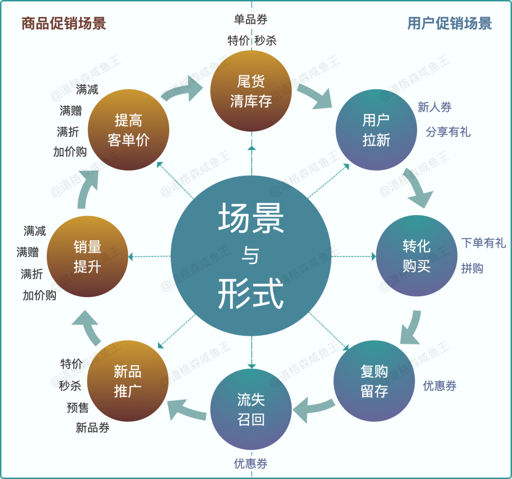
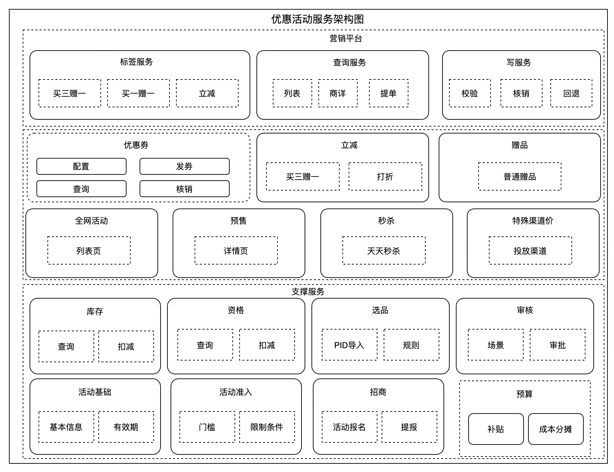
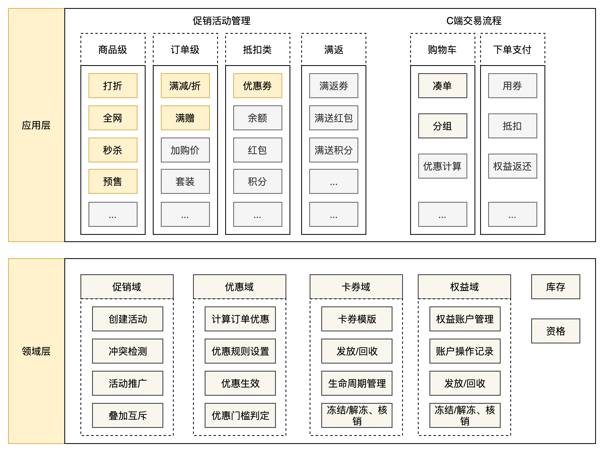
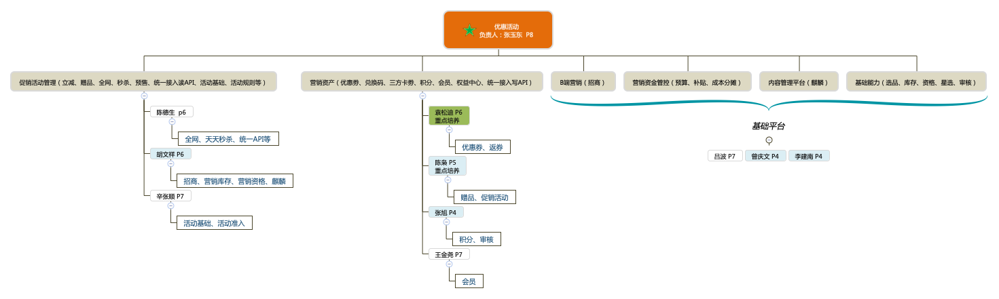

[转至元数据结尾](#page-metadata-end) [转至元数据起始](#page-metadata-start)

## 一、整体介绍

负责业务领域和链路整体介绍，现状和25年规划，绩效目标，Q3重点

1、业务模块介绍

优惠活动主要建设并完善基础类营销工具，营销工具是用来吸引消费者购物的一种手段，目的是让更多的人知道并购买他们的产品，这样就能卖得更多。促销的方法有很多种，比如，价格优惠、赠品、优惠券、折扣、买一赠一等形式。当前主要的业务模块如下：

<table><colgroup><col> <col> <col> <col> <col> <col> <col></colgroup><thead><tr><th colspan="1">
序号
</th><th colspan="1">
领域
</th><th>
模块
</th><th>
描述
</th><th>
使用频率
</th><th colspan="1">
开发Owner
</th><th colspan="1">
产品Owner
</th></tr></thead><tbody><tr><td colspan="1">1</td><td colspan="1">优惠接入</td><td colspan="1">统一接入读服务</td><td colspan="1">到手价、优惠查询等</td><td colspan="1"></td><td colspan="1">陈德生</td><td colspan="1">-</td></tr><tr><td colspan="1">2</td><td colspan="1">优惠接入</td><td colspan="1">统一接入写服务</td><td colspan="1">券、赠品核销校验，回滚回退</td><td colspan="1"></td><td colspan="1">袁松迪</td><td colspan="1">-</td></tr><tr><td colspan="1">3</td><td colspan="1">优惠接入</td><td colspan="1">统一对端服务</td><td colspan="1">券个人中心、会员模块等</td><td colspan="1"></td><td colspan="1">袁松迪</td><td colspan="1">-</td></tr><tr><td colspan="1">4</td><td colspan="1">优惠工具</td><td>全网</td><td>单品价格类优惠，在主入口（列表、商祥、提单）露出</td><td>非常高</td><td colspan="1">陈德生</td><td colspan="1">曹佳南</td></tr><tr><td colspan="1">5</td><td colspan="1">优惠工具</td><td colspan="1">特殊渠道价</td><td colspan="1">单品价格类优惠，在指定入口（活动页、企微）露出</td><td colspan="1">高</td><td colspan="1">陈德生</td><td colspan="1">曹佳南</td></tr><tr><td colspan="1">6</td><td colspan="1">优惠工具</td><td colspan="1">天天秒杀</td><td colspan="1">单品价格类优惠，首页秒杀频道页，搜索列表露出</td><td colspan="1">非常高</td><td colspan="1">陈德生</td><td colspan="1">曹佳南</td></tr><tr><td colspan="1">7</td><td colspan="1">优惠工具</td><td colspan="1">预售</td><td colspan="1">单品价格类优惠，在主入口（列表、商祥、提单）露出</td><td colspan="1">当前无使用</td><td colspan="1">陈德生</td><td colspan="1">曹佳南</td></tr><tr><td colspan="1">8</td><td colspan="1">优惠工具</td><td colspan="1">打折</td><td colspan="1">单品价格类优惠，在主入口（列表、商祥、提单）露出</td><td colspan="1">轮胎使用高，其他无使用</td><td colspan="1">陈德生</td><td colspan="1">曹佳南</td></tr><tr><td colspan="1">9</td><td colspan="1">优惠工具</td><td colspan="1">买三赠一</td><td colspan="1">单品价格类优惠，在主入口（列表、商祥、提单）露出</td><td colspan="1">轮胎使用高，其他无使用</td><td colspan="1">陈德生</td><td colspan="1">曹佳南</td></tr><tr><td colspan="1">10</td><td colspan="1">优惠工具</td><td colspan="1">买一赠一</td><td colspan="1">单品价格类优惠，在主入口（列表、商祥、提单）露出</td><td colspan="1">轮胎使用高，其他无使用</td><td colspan="1">陈德生</td><td colspan="1">曹佳南</td></tr><tr><td colspan="1">11</td><td colspan="1">优惠工具</td><td colspan="1">赠品</td><td colspan="1">单品赠优惠，在主入口（列表、商祥、提单）露出</td><td colspan="1">非常高</td><td colspan="1">陈枭</td><td colspan="1">曹佳南</td></tr><tr><td colspan="1">12</td><td colspan="1">优惠工具</td><td colspan="1">优惠券</td><td colspan="1">抵扣类优惠，在主入口（列表、商祥、提单）露出</td><td colspan="1">非常高</td><td colspan="1">袁松迪</td><td colspan="1">江惠娟</td></tr><tr><td colspan="1">13</td><td colspan="1">优惠工具</td><td colspan="1">积分</td><td colspan="1">抵扣类优惠，在主入口（列表、商祥、提单）露出</td><td colspan="1">非常高</td><td colspan="1">张旭</td><td colspan="1">曹佳南</td></tr><tr><td colspan="1">14</td><td colspan="1">优惠工具</td><td colspan="1">站外触达</td><td colspan="1">满返类优惠、圈人塞券，下单后置任务</td><td colspan="1">高</td><td colspan="1">袁松迪</td><td colspan="1">江惠娟</td></tr><tr><td colspan="1">15</td><td colspan="1">优惠工具</td><td colspan="1">会员</td><td colspan="1">购买类优惠（卡），在主入口（列表、商祥、提单）露出</td><td colspan="1">高</td><td colspan="1">王金尧</td><td colspan="1">王修萍</td></tr><tr><td colspan="1">16</td><td colspan="1">优惠工具</td><td colspan="1">麒麟</td><td colspan="1">活动页搭建</td><td colspan="1">非常高</td><td colspan="1">胡文祥</td><td colspan="1">妥瑾菲</td></tr><tr><td colspan="1">17</td><td colspan="1">优惠工具</td><td colspan="1">活动预演</td><td colspan="1">提前预演活动页能力</td><td colspan="1">低</td><td colspan="1">辛张顺</td><td colspan="1">曹佳南</td></tr><tr><td colspan="1">18</td><td colspan="1">优惠工具</td><td colspan="1">国补活动</td><td colspan="1">按地区配置折扣比例</td><td colspan="1">仅车品使用</td><td colspan="1">陈枭</td><td colspan="1">曹佳南</td></tr><tr><td colspan="1">19</td><td colspan="1">优惠基础</td><td colspan="1">活动基础</td><td colspan="1">活动基础名称、时间、描述、宣传语等信息维护</td><td colspan="1"></td><td colspan="1">辛张顺</td><td colspan="1">曹佳南</td></tr><tr><td colspan="1">20</td><td colspan="1">优惠基础</td><td colspan="1">活动准入</td><td colspan="1">活动各种规则（安装方式、订单渠道、人群标签、分城市等）信息维护</td><td colspan="1"></td><td colspan="1">辛张顺</td><td colspan="1">曹佳南</td></tr><tr><td colspan="1">21</td><td colspan="1">优惠基础</td><td colspan="1">活动库存</td><td colspan="1">活动唯独参与商品购买个数，周期库存限制等</td><td colspan="1"></td><td colspan="1">吕波</td><td colspan="1">曹佳南</td></tr><tr><td colspan="1">22</td><td colspan="1">优惠基础</td><td colspan="1">活动资格</td><td colspan="1">用户、设备等唯独参与活动、商品次数，周期资格等</td><td colspan="1"></td><td colspan="1">胡文祥</td><td colspan="1">曹佳南</td></tr><tr><td colspan="1">23</td><td colspan="1">优惠基础</td><td colspan="1">选品</td><td colspan="1">提供各种条件圈品能力</td><td colspan="1"></td><td colspan="1">吕波</td><td colspan="1">曹佳南</td></tr><tr><td colspan="1">24</td><td colspan="1">优惠基础</td><td colspan="1">审核</td><td colspan="1">优惠工具审核能力</td><td colspan="1">中</td><td colspan="1">张旭</td><td colspan="1">曹佳南</td></tr><tr><td colspan="1">25</td><td colspan="1">其他</td><td colspan="1">招商</td><td colspan="1">门店优惠招商、商家POP招商</td><td colspan="1">中</td><td colspan="1">胡文祥</td><td colspan="1">江惠娟</td></tr><tr><td colspan="1">26</td><td colspan="1">其他</td><td colspan="1">成本分摊</td><td colspan="1">订单优惠成本分摊、商品分销红包计算</td><td colspan="1">中</td><td colspan="1">胡文祥</td><td colspan="1">曹佳南</td></tr><tr><td colspan="1">27</td><td colspan="1">其他</td><td colspan="1">营销预算平台</td><td colspan="1">营销预算填写，申请，扣减，告警等</td><td colspan="1">低</td><td colspan="1">吕波</td><td colspan="1">张圣闵</td></tr></tbody></table>

工具常见使用场景：  

因此，从上述可看出，优惠活动有4条核心链路：

- 优惠配置后台，配置链路，配置错误及异常对C端订单转化存在影响。
- 优惠价、优惠宣传等展示链路，计算错误影响订单转化。
- 优惠下单链路，校验核销异常直接阻碍订单生成。
- 招商、优惠成本分摊链路，易产生资金错误，资金损失。

2、系统架构演进

2023年以前，阶段一：工具垂直化建设

2023年至今，阶段二：平台化建设

 

未来，阶段三：智能化SAAS建设

- **灵活性:**支持多种促销活动类型，商家可以根据自身需求灵活配置。
- **可扩展性:**系统架构设计需要考虑业务增长和用户并发，方便扩展。
- **智能化:**通过数据分析和算法，实现促销活动的智能推荐、个性化营销等。
- **安全性:**保证用户数据安全，防止恶意攻击。
- **易用性:**提供友好的用户界面，方便商家使用和用户参与。

3、H2绩效目标及重点事项

绩效目标： [https://doc.weixin.qq.com/sheet/e3\_ABcAJgZ2AModbUfTLhORqm6iFOpXy?scode=ANAAUQePAAY8SsmFRmABIA2gYyADM&tab=vyqeam](https://doc.weixin.qq.com/sheet/e3_ABcAJgZ2AModbUfTLhORqm6iFOpXy?scode=ANAAUQePAAY8SsmFRmABIA2gYyADM&tab=vyqeam)

Q3重点事项： [https://doc.weixin.qq.com/sheet/e3\_ABIA2gYyADMRLTWNYEERpypfL044k?scode=ANAAUQePAAY2ZQcZWqABIA2gYyADM&tab=fb31ir](https://doc.weixin.qq.com/sheet/e3_ABIA2gYyADMRLTWNYEERpypfL044k?scode=ANAAUQePAAY2ZQcZWqABIA2gYyADM&tab=fb31ir)

系统规划：

- 资金安全： [资金安全管控](https://wiki.tuhu.cn/pages/viewpage.action?pageId=461087203)
- 配置交互提效： [优惠工具配置提效](https://wiki.tuhu.cn/pages/viewpage.action?pageId=461087191)
- 系统架构能力升级： [系统架构能力升级](https://wiki.tuhu.cn/pages/viewpage.action?pageId=462758039)

## 二、重点方向&项目

业务和技术文档/系统架构/代码仓库/系统link/监控报警link群

1、团队文档： [优惠活动技术组](https://wiki.tuhu.cn/pages/viewpage.action?pageId=43757067)

2、技术方案文档： [B01-方案评审](https://wiki.tuhu.cn/pages/viewpage.action?pageId=523285962)

3、业务知识文档： [B03-系统文档](https://wiki.tuhu.cn/pages/viewpage.action?pageId=43757182)

4、系统架构： [整体架构](https://wiki.tuhu.cn/pages/viewpage.action?pageId=305991659)

5、代码仓库： [https://gitlab.tuhuyun.cn/mkt](https://gitlab.tuhuyun.cn/mkt)

6、监控告警： [优惠活动监控告警全景梳理](https://wiki.tuhu.cn/pages/viewpage.action?pageId=412321165)

业务告警群：优惠活动P0告警群、优惠活动P1告警群、优惠活动P2告警群

系统告警群：途虎通、生产系统告警【P0】、生产系统告警【P1】、生产系统告警【P2】

7、重点项目：Q3:JA、积分与E卡解耦、优惠券支持算法发券、库存、资格基础能力提升；Q4:双十一大促保障、营销预算平台接入E卡

## 三、团队合作（按角色划分）

产品业务方（发起方 / 使用者）

| 合作方 | 合作方式（业务线产品->平台产品->技术，平台产品->技术） | 关系说明 |
| --- | --- | --- |
| **营销平台产品经理** （如：曹佳南） | \- 提需求（玩法支持、活动配置）- 参与活动方案设计- 定制活动指标（转化/ROI）- 配合灰度/测试 | 是 **主要服务对象** ，驱动营销玩法演进的核心。有时会和多个产品方需求冲突，需要统一统筹优先级与资源。以及历史发生过因产品及研发需求理解不一致导致的线上case，责任归属的争论。整体合作较顺畅。 |
| **运营团队** （实际执行人） | \- 使用营销平台配置活动（投放、限量）- 要求提供灵活的活动控制台- 对接活动效果看板 | 是平台的 **直接操作者** ，对“可配置性”和“上线效率”要求高。需重点保障其自助配置+可控性。发起过调研，整体研发对运营的支持比较满意。 |

研发部门内部协作系统（落地实现方）

<table><colgroup><col> <col> <col></colgroup><thead><tr><th>
合作系统
</th><th>
合作方式
</th><th>
关系说明
</th></tr></thead><tbody><tr><td><strong>商品中心</strong></td><td>- 提供商品类目/标签/品牌等信息- 支持活动商品范围筛选- 商品变更事件回流</td><td>支持活动商品维度定义，是“可参与活动”的基础信息来源。属于下游强依赖。历史发生过无法创建虚拟商品边界业务争吵。整体合作友好。</td></tr><tr><td><strong>价格平台（定价平台）</strong></td><td>- 将营销活动作为价格计算输入- 执行到手价计算</td><td>营销给“优惠价”，价格平台“做算价”是营销平台的 <strong>关键落地合作方</strong> ，两者职责边界不清，偶有一些逻辑是在价格域做还是营销做的争端发生，比如一些根据app version判断的逻辑。强依赖。</td></tr><tr><td><strong>交易/下单系统</strong></td><td>- 营销活动校验（是否可用）- 核销券/活动记录- 活动参与幂等控制</td><td><strong>最终活动落地执行者</strong> ，需确保前端算价一致、订单落单正确。强依赖，接口质量必须保障。营销系统的改造，有不少设计交易环节改造，经常因为交易排期较晚，导致营销改造延后。强依赖。</td></tr><tr><td><strong>人群标签系统</strong></td><td>- 提供用户标签/等级/身份- 判断是否符合某活动资格- 控制专属活动</td><td>提供 <strong>用户细分能力</strong> ，实现“千人千面活动”属于配置约束来源。强依赖，需提供性能保障。</td></tr><tr><td><strong>推送系统</strong></td><td>- 配合活动露出、配置 banner、频道推荐- 联动首页活动入口</td><td>帮助活动在不同位置投放，是“曝光链路”重要合作方，弱依赖</td></tr><tr><td><strong>前端 / 客户端团队</strong></td><td>- 展示活动信息、券角标、倒计时等- 营销埋点采集、曝光/点击- 通过统一服务获取营销展示数据</td><td>是活动“用户可见效果”的呈现方对活动体验影响很大，需密切协同设计一致性。强依赖，更多的是交互体验上有不少合作，有共同目标，合作较顺利。</td></tr><tr><td><strong>BI / 数据团队</strong></td><td>- 提供活动数据归因、转化统计- 支持 AB 实验、活动复盘</td><td>支撑营销结果“分析与回流”，是营销优化闭环的基础。弱依赖，技术方案设计涉及表改动，需提前告知BI，一般BI排期较晚，前期不告知，会影响整体项目交付速度。弱依赖。</td></tr><tr><td><strong>风控 / 安全团队</strong></td><td>- 黑产识别、活动作弊防护- 限频限量控制、风控兜底策略</td><td>活动防刷不可缺的重要合作方，合作频繁且密切。当前主要是把促销信息同步给风控团队。弱依赖</td></tr><tr><td><strong>支付 / 财务/清结算系统</strong></td><td>- 券补贴结算、商家分摊报表- 营销成本归属统计</td><td>营销活动最终牵涉成本归属，需协同生成核销凭证与结算单，强依赖。两者职责边界不清，偶有发生业务逻辑谁来实现的争端。</td></tr><tr><td colspan="1"><strong>各业务团队</strong></td><td colspan="1">-活动标签、活动详情、活动筛选等能力提供</td><td colspan="1">支持不同商品页面活动宣传语的露出，活动规则的展示。合作较为频繁，但经常因为业务逻辑应归属那边实现，而导致争吵。</td></tr></tbody></table>

## 四、人才盘点

团队人才盘点，都有哪些子方向，每个子方向的owner是谁，评价，团队组织架构

职责方向：

## 五、问题与挑战

目前遇到的挑战和问题 (业务/技术/团队) ，需要什么帮助

系统能力方面：

**（1）从列表、** **商详** **到提单** **链路** **无标准化统一接入层** **：** 目前列表、商祥、提单、下单都是同一接口，无法清晰区分差异化场景，故障无法隔离；其次，优惠下单校验、核销、回退等能力不一，如存在部分优惠在校验时扣减库存资格，部分在核销时扣减，逻辑不一存在潜在资损风险；

**（2）单品类优惠工具能力未** **统一** **收拢** **：** 当前存在全网、打折、秒杀、限时抢购、预售等多个工具，其配置和使用均相互独立，导致新增优惠规则（如：分城市投放活动）需重复开发，系统可维护性差，开发迭代成本高；

**（3）优惠工具基础** **能力不足** ：库存、资格、选品、活动规则引擎等多个基础服务仍处于建设初期，功能完善度和系统性能上都需进一步提升。否则一是影响营销工具的接入时效，更主要是 **导致价格展示链路及优惠下单链路稳定性不足；**

（4）招商、成本分摊，从0到1新建设系统，持续迭代慢，新系统各种问题仍就很多，易产生资损风险。

资金安全方面：

（1）交易拆单场景，优惠记录主订单号，主订单状态不更新无法进行对账

（2）会员（组合售卖）场景未记录优惠劵信息，无法进行对账

（3）返劵、优惠成本分摊、分销补贴场景未覆盖对账

（4）系统异常未建设自动化补偿能力，数据修复慢，修复晚

（5）运营优惠工具配置错误未及时发现

（6）积分、会员新承接业务资金安全未覆盖

配置效率方面：

（1）营销工具割裂，需频繁在各工具间进行切换操作，效率低，错误率高

（2）选品工具交互复杂，功能不统一，小问题较多，导致操作时效长（H1 5个事故中2个是选品系统问题导致，占比40%）

（3）赠品功能缺失，需运营周期性进行配置，影响交互时长‘

因此，在当前系统稳定性还不足的情况下，急需研发资源补足高风险链路。，包括中心架构师，转调其他团队等，又随着校招生换社招同学，优惠活动组织架构已明显缺乏核心P6骨干同学。