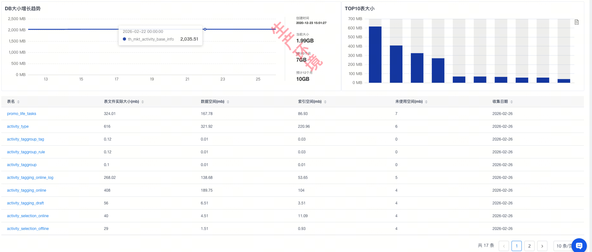

[转至元数据结尾](#page-metadata-end) [转至元数据起始](#page-metadata-start)

## 0x00 系统概述

## 0x00-01 系统目标

为营销活动提供活动信息的增删改查能力，如：创建/编辑活动，提审活动，上下架活动，根据活动 ID 查询活动基础信息。

## 0x00-02 名词解释

| 名词 | 说明 |
| --- | --- |
| activityId | 活动 ID，活动唯一标识 |

---

## 0x01 系统功能分析

- （5分）清晰完整的业务链路
- （5分）清晰完整的功能用例图、功能列表

### 0x01-00-00 业务链路


### 0x01-00-01 功能列表

<table><colgroup><col> <col> <col></colgroup><tbody><tr><th>模块</th><th>子功能</th><th>功能描述</th></tr><tr><td rowspan="12">活动配置后台</td><td colspan="1">创建、更新活动信息</td><td colspan="1"></td></tr><tr><td>提审活动</td><td></td></tr><tr><td>活动审核通过</td><td></td></tr><tr><td>活动审核拒绝</td><td></td></tr><tr><td colspan="1">线上编辑到草稿</td><td colspan="1"></td></tr><tr><td colspan="1">线下复制到草稿</td><td colspan="1"></td></tr><tr><td colspan="1">线上复制到草稿</td><td colspan="1"></td></tr><tr><td colspan="1">线下活动作废</td><td colspan="1"></td></tr><tr><td colspan="1">线下活动提前结束</td><td colspan="1"></td></tr><tr><td colspan="1">分页查询活动列表</td><td colspan="1"></td></tr><tr><td colspan="1">查询活动状态 TAB 数量</td><td colspan="1"></td></tr><tr><td colspan="1">查询活动详情</td><td colspan="1"></td></tr><tr><td rowspan="7">活动 C 端查询</td><td>批量查询活动基本信息</td><td></td></tr><tr><td colspan="1">批量查询活动标签信息</td><td colspan="1"></td></tr><tr><td colspan="1">批量查询活动类型</td><td colspan="1"></td></tr><tr><td colspan="1">批量查询活动牛皮癣</td><td colspan="1"></td></tr><tr><td colspan="1">根据活动类型查询当前在线活动信息</td><td colspan="1">仅支持部分活动</td></tr><tr><td colspan="1">批量查询活动选品ID</td><td colspan="1"></td></tr><tr><td>批量映射查询活动id映射</td><td></td></tr></tbody></table>

---

## 0x02 系统分析

## 0x02-01 系统链路分析

### 0x02-01-00 服务交互图

<svg style="left: 0px; top: 0px; width: 100%; height: 100%; display: block; min-width: 675px; min-height: 500px; background-color: transparent; background-image: none;"><defs></defs><g transformorigin="0 0" transform="scale(0.97,0.97)translate(218,-12)"><g></g><g><g transform="translate(0.5,0.5)" style="visibility: visible;"><path d="M -210 20 L -60 20 L -60 35 L -70 50 L -210 50 Z" fill="#ffffff" stroke="#000000" stroke-miterlimit="10" pointer-events="all"></path><path d="M -60 20 L 460 20 L 460 240 L -210 240 L -210 50" fill="none" stroke="white" stroke-miterlimit="10" pointer-events="stroke" visibility="hidden" stroke-width="9"></path><path d="M -60 20 L 460 20 L 460 240 L -210 240 L -210 50" fill="none" stroke="#000000" stroke-miterlimit="10" pointer-events="all"></path></g><g style=""><g><foreignObject style="overflow: visible; text-align: left;" pointer-events="none" width="100%" height="100%"><div style="display: flex; align-items: unsafe center; justify-content: unsafe center; width: 148px; height: 1px; padding-top: 35px; margin-left: -209px;"><div style="box-sizing: border-box; font-size: 0; text-align: center; "><div style="display: inline-block; font-size: 12px; font-family: Helvetica; color: #000000; line-height: 1.2; pointer-events: all; white-space: normal; word-wrap: normal; ">M 端</div></div></div></foreignObject></g></g><g transform="translate(0.5,0.5)" style="visibility: visible;"><path d="M -30 160 L 183.63 160" fill="none" stroke="white" stroke-miterlimit="10" pointer-events="stroke" visibility="hidden" stroke-width="9"></path><path d="M -30 160 L 183.63 160" fill="none" stroke="#000000" stroke-miterlimit="10" pointer-events="stroke"></path><path d="M 188.88 160 L 181.88 163.5 L 183.63 160 L 181.88 156.5 Z" fill="#000000" stroke="#000000" stroke-miterlimit="10" pointer-events="all"></path></g><g style=""><g><foreignObject style="overflow: visible; text-align: left;" pointer-events="none" width="100%" height="100%"><div style="display: flex; align-items: unsafe center; justify-content: unsafe center; width: 1px; height: 1px; padding-top: 159px; margin-left: 73px;"><div style="box-sizing: border-box; font-size: 0; text-align: center; "><div style="display: inline-block; font-size: 11px; font-family: Helvetica; color: #000000; line-height: 1.2; pointer-events: all; background-color: #ffffff; white-space: nowrap; ">创建、查看</div></div></div></foreignObject></g></g><g transform="translate(0.5,0.5)" style="visibility: visible;"><ellipse cx="-90" cy="160" rx="60" ry="40" fill="#ffffff" stroke="#000000" pointer-events="all"></ellipse></g><g style=""><g><foreignObject style="overflow: visible; text-align: left;" pointer-events="none" width="100%" height="100%"><div style="display: flex; align-items: unsafe center; justify-content: unsafe center; width: 118px; height: 1px; padding-top: 160px; margin-left: -149px;"><div style="box-sizing: border-box; font-size: 0; text-align: center; "><div style="display: inline-block; font-size: 17px; font-family: Helvetica; color: #000000; line-height: 1.2; pointer-events: all; white-space: normal; word-wrap: normal; ">admin-web</div></div></div></foreignObject></g></g><g transform="translate(0.5,0.5)" style="visibility: visible;"><ellipse cx="250" cy="160" rx="60" ry="40" fill="#ffffff" stroke="#000000" pointer-events="all"></ellipse></g><g style=""><g><foreignObject style="overflow: visible; text-align: left;" pointer-events="none" width="100%" height="100%"><div style="display: flex; align-items: unsafe center; justify-content: unsafe center; width: 118px; height: 1px; padding-top: 160px; margin-left: 191px;"><div style="box-sizing: border-box; font-size: 0; text-align: center; "><div style="display: inline-block; font-size: 17px; font-family: Helvetica; color: #000000; line-height: 1.2; pointer-events: all; white-space: normal; word-wrap: normal; ">活动基础服务</div></div></div></foreignObject></g></g><g transform="translate(0.5,0.5)" style="visibility: visible;"><path d="M -210 290 L -60 290 L -60 305 L -70 320 L -210 320 Z" fill="#ffffff" stroke="#000000" stroke-miterlimit="10" pointer-events="all"></path><path d="M -60 290 L 460 290 L 460 510 L -210 510 L -210 320" fill="none" stroke="white" stroke-miterlimit="10" pointer-events="stroke" visibility="hidden" stroke-width="9"></path><path d="M -60 290 L 460 290 L 460 510 L -210 510 L -210 320" fill="none" stroke="#000000" stroke-miterlimit="10" pointer-events="all"></path></g><g style=""><g><foreignObject style="overflow: visible; text-align: left;" pointer-events="none" width="100%" height="100%"><div style="display: flex; align-items: unsafe center; justify-content: unsafe center; width: 148px; height: 1px; padding-top: 305px; margin-left: -209px;"><div style="box-sizing: border-box; font-size: 0; text-align: center; "><div style="display: inline-block; font-size: 12px; font-family: Helvetica; color: #000000; line-height: 1.2; pointer-events: all; white-space: normal; word-wrap: normal; ">C 端查询</div></div></div></foreignObject></g></g><g transform="translate(0.5,0.5)" style="visibility: visible;"><path d="M -30 430 L 183.63 430" fill="none" stroke="white" stroke-miterlimit="10" pointer-events="stroke" visibility="hidden" stroke-width="9"></path><path d="M -30 430 L 183.63 430" fill="none" stroke="#000000" stroke-miterlimit="10" pointer-events="stroke"></path><path d="M 188.88 430 L 181.88 433.5 L 183.63 430 L 181.88 426.5 Z" fill="#000000" stroke="#000000" stroke-miterlimit="10" pointer-events="all"></path></g><g transform="translate(0.5,0.5)" style="visibility: visible;"><ellipse cx="-90" cy="430" rx="60" ry="40" fill="#ffffff" stroke="#000000" pointer-events="all"></ellipse></g><g style=""><g><foreignObject style="overflow: visible; text-align: left;" pointer-events="none" width="100%" height="100%"><div style="display: flex; align-items: unsafe center; justify-content: unsafe center; width: 118px; height: 1px; padding-top: 430px; margin-left: -149px;"><div style="box-sizing: border-box; font-size: 0; text-align: center; "><div style="display: inline-block; font-size: 17px; font-family: Helvetica; color: #000000; line-height: 1.2; pointer-events: all; white-space: normal; word-wrap: normal; ">营销统一 API</div></div></div></foreignObject></g></g><g transform="translate(0.5,0.5)" style="visibility: visible;"><ellipse cx="250" cy="430" rx="60" ry="40" fill="#ffffff" stroke="#000000" pointer-events="all"></ellipse></g><g style=""><g><foreignObject style="overflow: visible; text-align: left;" pointer-events="none" width="100%" height="100%"><div style="display: flex; align-items: unsafe center; justify-content: unsafe center; width: 118px; height: 1px; padding-top: 430px; margin-left: 191px;"><div style="box-sizing: border-box; font-size: 0; text-align: center; "><div style="display: inline-block; font-size: 17px; font-family: Helvetica; color: #000000; line-height: 1.2; pointer-events: all; white-space: normal; word-wrap: normal; ">活动基础服务</div></div></div></foreignObject></g></g></g><g></g><g></g></g></svg>

### 0x02-01-01 上下游依赖

<svg style="left: 0px; top: 0px; width: 100%; height: 100%; display: block; min-width: 1005px; min-height: 436px; background-color: transparent; background-image: none;"><defs></defs><g transformorigin="0 0" transform="scale(0.98,0.98)translate(238,-82)"><g></g><g><g transform="translate(0.5,0.5)" style="visibility: visible;"><rect x="-230" y="90" width="1000" height="420" fill="#ffffff" stroke="#000000" pointer-events="all"></rect></g><g transform="translate(0.5,0.5)" style="visibility: visible;"><rect x="-190" y="170" width="80" height="40" fill="#ffffff" stroke="#000000" pointer-events="all"></rect></g><g style=""><g><foreignObject style="overflow: visible; text-align: left;" pointer-events="none" width="100%" height="100%"><div style="display: flex; align-items: unsafe center; justify-content: unsafe center; width: 78px; height: 1px; padding-top: 190px; margin-left: -189px;"><div style="box-sizing: border-box; font-size: 0; text-align: center; "><div style="display: inline-block; font-size: 12px; font-family: Helvetica; color: #000000; line-height: 1.2; pointer-events: all; white-space: normal; word-wrap: normal; ">全网活动</div></div></div></foreignObject></g></g><g transform="translate(0.5,0.5)" style="visibility: visible;"><rect x="-70" y="170" width="80" height="40" fill="#ffffff" stroke="#000000" pointer-events="all"></rect></g><g style=""><g><foreignObject style="overflow: visible; text-align: left;" pointer-events="none" width="100%" height="100%"><div style="display: flex; align-items: unsafe center; justify-content: unsafe center; width: 78px; height: 1px; padding-top: 190px; margin-left: -69px;"><div style="box-sizing: border-box; font-size: 0; text-align: center; "><div style="display: inline-block; font-size: 12px; font-family: Helvetica; color: #000000; line-height: 1.2; pointer-events: all; white-space: normal; word-wrap: normal; ">预售活动</div></div></div></foreignObject></g></g><g transform="translate(0.5,0.5)" style="visibility: visible;"><rect x="50" y="170" width="80" height="40" fill="#ffffff" stroke="#000000" pointer-events="all"></rect></g><g style=""><g><foreignObject style="overflow: visible; text-align: left;" pointer-events="none" width="100%" height="100%"><div style="display: flex; align-items: unsafe center; justify-content: unsafe center; width: 78px; height: 1px; padding-top: 190px; margin-left: 51px;"><div style="box-sizing: border-box; font-size: 0; text-align: center; "><div style="display: inline-block; font-size: 12px; font-family: Helvetica; color: #000000; line-height: 1.2; pointer-events: all; white-space: normal; word-wrap: normal; ">特殊渠道价活动</div></div></div></foreignObject></g></g><g transform="translate(0.5,0.5)" style="visibility: visible;"><rect x="170" y="170" width="80" height="40" fill="#ffffff" stroke="#000000" pointer-events="all"></rect></g><g style=""><g><foreignObject style="overflow: visible; text-align: left;" pointer-events="none" width="100%" height="100%"><div style="display: flex; align-items: unsafe center; justify-content: unsafe center; width: 78px; height: 1px; padding-top: 190px; margin-left: 171px;"><div style="box-sizing: border-box; font-size: 0; text-align: center; "><div style="display: inline-block; font-size: 12px; font-family: Helvetica; color: #000000; line-height: 1.2; pointer-events: all; white-space: normal; word-wrap: normal; ">天天秒杀活动</div></div></div></foreignObject></g></g><g transform="translate(0.5,0.5)" style="visibility: visible;"><rect x="290" y="170" width="80" height="40" fill="#ffffff" stroke="#000000" pointer-events="all"></rect></g><g style=""><g><foreignObject style="overflow: visible; text-align: left;" pointer-events="none" width="100%" height="100%"><div style="display: flex; align-items: unsafe center; justify-content: unsafe center; width: 78px; height: 1px; padding-top: 190px; margin-left: 291px;"><div style="box-sizing: border-box; font-size: 0; text-align: center; "><div style="display: inline-block; font-size: 12px; font-family: Helvetica; color: #000000; line-height: 1.2; pointer-events: all; white-space: normal; word-wrap: normal; ">打折活动</div></div></div></foreignObject></g></g><g transform="translate(0.5,0.5)" style="visibility: visible;"><rect x="410" y="170" width="80" height="40" fill="#ffffff" stroke="#000000" pointer-events="all"></rect></g><g style=""><g><foreignObject style="overflow: visible; text-align: left;" pointer-events="none" width="100%" height="100%"><div style="display: flex; align-items: unsafe center; justify-content: unsafe center; width: 78px; height: 1px; padding-top: 190px; margin-left: 411px;"><div style="box-sizing: border-box; font-size: 0; text-align: center; "><div style="display: inline-block; font-size: 12px; font-family: Helvetica; color: #000000; line-height: 1.2; pointer-events: all; white-space: normal; word-wrap: normal; ">买赠活动</div></div></div></foreignObject></g></g><g transform="translate(0.5,0.5)" style="visibility: visible;"><rect x="530" y="170" width="80" height="40" fill="#ffffff" stroke="#000000" pointer-events="all"></rect></g><g style=""><g><foreignObject style="overflow: visible; text-align: left;" pointer-events="none" width="100%" height="100%"><div style="display: flex; align-items: unsafe center; justify-content: unsafe center; width: 78px; height: 1px; padding-top: 190px; margin-left: 531px;"><div style="box-sizing: border-box; font-size: 0; text-align: center; "><div style="display: inline-block; font-size: 12px; font-family: Helvetica; color: #000000; line-height: 1.2; pointer-events: all; white-space: normal; word-wrap: normal; ">赠品活动</div></div></div></foreignObject></g></g><g transform="translate(0.5,0.5)" style="visibility: visible;"><rect x="650" y="170" width="80" height="40" fill="#ffffff" stroke="#000000" pointer-events="all"></rect></g><g style=""><g><foreignObject style="overflow: visible; text-align: left;" pointer-events="none" width="100%" height="100%"><div style="display: flex; align-items: unsafe center; justify-content: unsafe center; width: 78px; height: 1px; padding-top: 190px; margin-left: 651px;"><div style="box-sizing: border-box; font-size: 0; text-align: center; "><div style="display: inline-block; font-size: 12px; font-family: Helvetica; color: #000000; line-height: 1.2; pointer-events: all; white-space: normal; word-wrap: normal; ">国补活动</div></div></div></foreignObject></g></g><g style="visibility: visible;"><path d="M -190 255 L 730 255" fill="none" stroke="white" stroke-width="10" stroke-miterlimit="10" pointer-events="stroke" visibility="hidden"></path><path d="M -190 255 L 730 255" fill="none" stroke="#000000" stroke-width="2" stroke-miterlimit="10" stroke-dasharray="6 6" pointer-events="all"></path></g><g transform="translate(0.5,0.5)" style="visibility: visible;"><rect x="-190" y="290" width="920" height="60" fill="#ffffff" stroke="#000000" pointer-events="all"></rect></g><g style=""><g><foreignObject style="overflow: visible; text-align: left;" pointer-events="none" width="100%" height="100%"><div style="display: flex; align-items: unsafe center; justify-content: unsafe center; width: 918px; height: 1px; padding-top: 320px; margin-left: -189px;"><div style="box-sizing: border-box; font-size: 0; text-align: center; "><div style="display: inline-block; font-size: 23px; font-family: Helvetica; color: #000000; line-height: 1.2; pointer-events: all; white-space: normal; word-wrap: normal; ">活动基础服务</div></div></div></foreignObject></g></g><g style="visibility: visible;"><path d="M -190 385 L 730 385" fill="none" stroke="white" stroke-width="10" stroke-miterlimit="10" pointer-events="stroke" visibility="hidden"></path><path d="M -190 385 L 730 385" fill="none" stroke="#000000" stroke-width="2" stroke-miterlimit="10" stroke-dasharray="6 6" pointer-events="all"></path></g><g transform="translate(0.5,0.5)" style="visibility: visible;"><path d="M 0 427.5 C 0 419.22 13.43 412.5 30 412.5 C 37.96 412.5 45.59 414.08 51.21 416.89 C 56.84 419.71 60 423.52 60 427.5 L 60 462.5 C 60 470.78 46.57 477.5 30 477.5 C 13.43 477.5 0 470.78 0 462.5 Z" fill="#ffffff" stroke="#000000" stroke-miterlimit="10" pointer-events="all"></path><path d="M 60 427.5 C 60 435.78 46.57 442.5 30 442.5 C 13.43 442.5 0 435.78 0 427.5" fill="none" stroke="#000000" stroke-miterlimit="10" pointer-events="all"></path></g><g style=""><g><foreignObject style="overflow: visible; text-align: left;" pointer-events="none" width="100%" height="100%"><div style="display: flex; align-items: unsafe center; justify-content: unsafe center; width: 58px; height: 1px; padding-top: 458px; margin-left: 1px;"><div style="box-sizing: border-box; font-size: 0; text-align: center; "><div style="display: inline-block; font-size: 18px; font-family: Helvetica; color: #000000; line-height: 1.2; pointer-events: all; white-space: normal; word-wrap: normal; ">DB</div></div></div></foreignObject></g></g><g style="visibility: visible;"></g><g style=""><g><foreignObject style="overflow: visible; text-align: left;" pointer-events="none" width="100%" height="100%"><div style="display: flex; align-items: unsafe flex-start; justify-content: unsafe center; width: 1px; height: 1px; padding-top: 477px; margin-left: 410px;"><div style="box-sizing: border-box; font-size: 0; text-align: center; "><div style="display: inline-block; font-size: 12px; font-family: Helvetica; color: #000000; line-height: 1.2; pointer-events: all; background-color: white; white-space: nowrap; ">Redis</div></div></div></foreignObject></g></g></g><g></g><g></g></g></svg>

### 0x02-01-02 状态图

<svg style="left: 0px; top: 0px; width: 100%; height: 100%; display: block; min-width: 1255px; min-height: 397px; background-color: transparent; background-image: none;"><defs></defs><g transformorigin="0 0" transform="scale(0.98,0.98)translate(-82,108)"><g></g><g><g transform="translate(0.5,0.5)" style="visibility: visible;"><ellipse cx="105" cy="55" rx="15" ry="15" fill="#000000" stroke="#000000" pointer-events="all"></ellipse></g><g transform="translate(0.5,0.5)" style="visibility: visible;"><rect x="200" y="25" width="100" height="60" rx="9" ry="9" fill="#dae8fc" stroke="#6c8ebf" pointer-events="all"></rect></g><g style=""><g><foreignObject style="overflow: visible; text-align: left;" pointer-events="none" width="100%" height="100%"><div style="display: flex; align-items: unsafe center; justify-content: unsafe center; width: 98px; height: 1px; padding-top: 55px; margin-left: 201px;"><div style="box-sizing: border-box; font-size: 0; text-align: center; "><div style="display: inline-block; font-size: 12px; font-family: Helvetica; color: #000000; line-height: 1.2; pointer-events: all; font-weight: bold; white-space: normal; word-wrap: normal; ">草稿<br>DRAFT</div></div></div></foreignObject></g></g><g transform="translate(0.5,0.5)" style="visibility: visible;"><rect x="380" y="25" width="100" height="60" rx="9" ry="9" fill="#fff2cc" stroke="#d6b656" pointer-events="all"></rect></g><g style=""><g><foreignObject style="overflow: visible; text-align: left;" pointer-events="none" width="100%" height="100%"><div style="display: flex; align-items: unsafe center; justify-content: unsafe center; width: 98px; height: 1px; padding-top: 55px; margin-left: 381px;"><div style="box-sizing: border-box; font-size: 0; text-align: center; "><div style="display: inline-block; font-size: 12px; font-family: Helvetica; color: #000000; line-height: 1.2; pointer-events: all; font-weight: bold; white-space: normal; word-wrap: normal; ">待审核<br>WAIT_AUDIT</div></div></div></foreignObject></g></g><g transform="translate(0.5,0.5)" style="visibility: visible;"><rect x="1240" y="-100" width="100" height="60" rx="9" ry="9" fill="#f5f5f5" stroke="#666666" pointer-events="all"></rect></g><g style=""><g><foreignObject style="overflow: visible; text-align: left;" pointer-events="none" width="100%" height="100%" y="-70"><div style="display: flex; align-items: unsafe center; justify-content: unsafe center; width: 98px; height: 1px; margin-left: 1241px;"><div style="box-sizing: border-box; font-size: 0; text-align: center; "><div style="display: inline-block; font-size: 12px; font-family: Helvetica; color: #333333; line-height: 1.2; pointer-events: all; font-weight: bold; white-space: normal; word-wrap: normal; ">已作废<br>ABROGATE</div></div></div></foreignObject></g></g><g transform="translate(0.5,0.5)" style="visibility: visible;"><rect x="570" y="25" width="100" height="60" rx="9" ry="9" fill="#ffe6cc" stroke="#d79b00" pointer-events="all"></rect></g><g style=""><g><foreignObject style="overflow: visible; text-align: left;" pointer-events="none" width="100%" height="100%"><div style="display: flex; align-items: unsafe center; justify-content: unsafe center; width: 98px; height: 1px; padding-top: 55px; margin-left: 571px;"><div style="box-sizing: border-box; font-size: 0; text-align: center; "><div style="display: inline-block; font-size: 12px; font-family: Helvetica; color: #000000; line-height: 1.2; pointer-events: all; font-weight: bold; white-space: normal; word-wrap: normal; ">审核通过<br>AUDIT_PASS</div></div></div></foreignObject></g></g><g transform="translate(0.5,0.5)" style="visibility: visible;"><rect x="570" y="130" width="100" height="60" rx="9" ry="9" fill="#f8cecc" stroke="#b85450" pointer-events="all"></rect></g><g style=""><g><foreignObject style="overflow: visible; text-align: left;" pointer-events="none" width="100%" height="100%"><div style="display: flex; align-items: unsafe center; justify-content: unsafe center; width: 98px; height: 1px; padding-top: 160px; margin-left: 571px;"><div style="box-sizing: border-box; font-size: 0; text-align: center; "><div style="display: inline-block; font-size: 12px; font-family: Helvetica; color: #000000; line-height: 1.2; pointer-events: all; font-weight: bold; white-space: normal; word-wrap: normal; ">已拒绝<br>AUDIT_REJECT</div></div></div></foreignObject></g></g><g transform="translate(0.5,0.5)" style="visibility: visible;"><path d="M 910 85 L 910 175 L 1233.63 175" fill="none" stroke="white" stroke-miterlimit="10" pointer-events="stroke" visibility="hidden" stroke-width="9"></path><path d="M 910 85 L 910 175 L 1233.63 175" fill="none" stroke="#000000" stroke-miterlimit="10" pointer-events="stroke"></path><path d="M 1238.88 175 L 1231.88 178.5 L 1233.63 175 L 1231.88 171.5 Z" fill="#000000" stroke="#000000" stroke-miterlimit="10" pointer-events="all"></path></g><g transform="translate(0.5,0.5)" style="visibility: visible;"><path d="M 890 85 L 890 270 L 225 270 L 225 91.37" fill="none" stroke="white" stroke-miterlimit="10" pointer-events="stroke" visibility="hidden" stroke-width="9"></path><path d="M 890 85 L 890 270 L 225 270 L 225 91.37" fill="none" stroke="#000000" stroke-miterlimit="10" pointer-events="stroke"></path><path d="M 225 86.12 L 228.5 93.12 L 225 91.37 L 221.5 93.12 Z" fill="#000000" stroke="#000000" stroke-miterlimit="10" pointer-events="all"></path></g><g style=""><g><foreignObject style="overflow: visible; text-align: left;" pointer-events="none" width="100%" height="100%"><div style="display: flex; align-items: unsafe center; justify-content: unsafe center; width: 1px; height: 1px; padding-top: 268px; margin-left: 539px;"><div style="box-sizing: border-box; font-size: 0; text-align: center; "><div style="display: inline-block; font-size: 11px; font-family: Helvetica; color: #000000; line-height: 1.2; pointer-events: all; background-color: #ffffff; white-space: nowrap; ">编辑到草稿</div></div></div></foreignObject></g></g><g transform="translate(0.5,0.5)" style="visibility: visible;"><rect x="860" y="25" width="100" height="60" rx="9" ry="9" fill="#e1d5e7" stroke="#9673a6" pointer-events="all"></rect></g><g style=""><g><foreignObject style="overflow: visible; text-align: left;" pointer-events="none" width="100%" height="100%"><div style="display: flex; align-items: unsafe center; justify-content: unsafe center; width: 98px; height: 1px; padding-top: 55px; margin-left: 861px;"><div style="box-sizing: border-box; font-size: 0; text-align: center; "><div style="display: inline-block; font-size: 12px; font-family: Helvetica; color: #000000; line-height: 1.2; pointer-events: all; font-weight: bold; white-space: normal; word-wrap: normal; ">待生效<br>NOT_START</div></div></div></foreignObject></g></g><g transform="translate(0.5,0.5)" style="visibility: visible;"><path d="M 1140 55 L 1233.63 55" fill="none" stroke="white" stroke-miterlimit="10" pointer-events="stroke" visibility="hidden" stroke-width="9"></path><path d="M 1140 55 L 1233.63 55" fill="none" stroke="#000000" stroke-miterlimit="10" pointer-events="stroke"></path><path d="M 1238.88 55 L 1231.88 58.5 L 1233.63 55 L 1231.88 51.5 Z" fill="#000000" stroke="#000000" stroke-miterlimit="10" pointer-events="all"></path></g><g style=""><g><foreignObject style="overflow: visible; text-align: left;" pointer-events="none" width="100%" height="100%"><div style="display: flex; align-items: unsafe center; justify-content: unsafe center; width: 1px; height: 1px; padding-top: 53px; margin-left: 1179px;"><div style="box-sizing: border-box; font-size: 0; text-align: center; "><div style="display: inline-block; font-size: 11px; font-family: Helvetica; color: #000000; line-height: 1.2; pointer-events: all; background-color: #ffffff; white-space: nowrap; ">活动结束</div></div></div></foreignObject></g></g><g transform="translate(0.5,0.5)" style="visibility: visible;"><path d="M 1090 85 L 1090 160 L 1233.63 160" fill="none" stroke="white" stroke-miterlimit="10" pointer-events="stroke" visibility="hidden" stroke-width="9"></path><path d="M 1090 85 L 1090 160 L 1233.63 160" fill="none" stroke="#000000" stroke-miterlimit="10" pointer-events="stroke"></path><path d="M 1238.88 160 L 1231.88 163.5 L 1233.63 160 L 1231.88 156.5 Z" fill="#000000" stroke="#000000" stroke-miterlimit="10" pointer-events="all"></path></g><g transform="translate(0.5,0.5)" style="visibility: visible;"><rect x="1040" y="25" width="100" height="60" rx="9" ry="9" fill="#d5e8d4" stroke="#82b366" pointer-events="all"></rect></g><g style=""><g><foreignObject style="overflow: visible; text-align: left;" pointer-events="none" width="100%" height="100%"><div style="display: flex; align-items: unsafe center; justify-content: unsafe center; width: 98px; height: 1px; padding-top: 55px; margin-left: 1041px;"><div style="box-sizing: border-box; font-size: 0; text-align: center; "><div style="display: inline-block; font-size: 12px; font-family: Helvetica; color: #000000; line-height: 1.2; pointer-events: all; font-weight: bold; white-space: normal; word-wrap: normal; ">进行中<br>PROCESSING</div></div></div></foreignObject></g></g><g transform="translate(0.5,0.5)" style="visibility: visible;"><rect x="1240" y="25" width="100" height="60" rx="9" ry="9" fill="#f5f5f5" stroke="#666666" pointer-events="all"></rect></g><g style=""><g><foreignObject style="overflow: visible; text-align: left;" pointer-events="none" width="100%" height="100%"><div style="display: flex; align-items: unsafe center; justify-content: unsafe center; width: 98px; height: 1px; padding-top: 55px; margin-left: 1241px;"><div style="box-sizing: border-box; font-size: 0; text-align: center; "><div style="display: inline-block; font-size: 12px; font-family: Helvetica; color: #000000; line-height: 1.2; pointer-events: all; font-weight: bold; white-space: normal; word-wrap: normal; ">已结束<br>END</div></div></div></foreignObject></g></g><g transform="translate(0.5,0.5)" style="visibility: visible;"><rect x="1240" y="130" width="100" height="60" rx="9" ry="9" fill="#f5f5f5" stroke="#666666" pointer-events="all"></rect></g><g style=""><g><foreignObject style="overflow: visible; text-align: left;" pointer-events="none" width="100%" height="100%"><div style="display: flex; align-items: unsafe center; justify-content: unsafe center; width: 98px; height: 1px; padding-top: 160px; margin-left: 1241px;"><div style="box-sizing: border-box; font-size: 0; text-align: center; "><div style="display: inline-block; font-size: 12px; font-family: Helvetica; color: #333333; line-height: 1.2; pointer-events: all; font-weight: bold; white-space: normal; word-wrap: normal; ">提前结束<br>DISABLE</div></div></div></foreignObject></g></g><g transform="translate(0.5,0.5)" style="visibility: visible;"><path d="M 120 55 L 193.63 55" fill="none" stroke="white" stroke-miterlimit="10" pointer-events="stroke" visibility="hidden" stroke-width="9"></path><path d="M 120 55 L 193.63 55" fill="none" stroke="#333333" stroke-miterlimit="10" pointer-events="stroke"></path><path d="M 198.88 55 L 191.88 58.5 L 193.63 55 L 191.88 51.5 Z" fill="#333333" stroke="#333333" stroke-miterlimit="10" pointer-events="all"></path></g><g style=""><g><foreignObject style="overflow: visible; text-align: left;" pointer-events="none" width="100%" height="100%"><div style="display: flex; align-items: unsafe center; justify-content: unsafe center; width: 1px; height: 1px; padding-top: 56px; margin-left: 153px;"><div style="box-sizing: border-box; font-size: 0; text-align: center; "><div style="display: inline-block; font-size: 11px; font-family: Helvetica; color: #000000; line-height: 1.2; pointer-events: all; background-color: #ffffff; white-space: nowrap; ">新建活动</div></div></div></foreignObject></g></g><g transform="translate(0.5,0.5)" style="visibility: visible;"><path d="M 300 55 L 373.63 55" fill="none" stroke="white" stroke-miterlimit="10" pointer-events="stroke" visibility="hidden" stroke-width="9"></path><path d="M 300 55 L 373.63 55" fill="none" stroke="#333333" stroke-miterlimit="10" pointer-events="stroke"></path><path d="M 378.88 55 L 371.88 58.5 L 373.63 55 L 371.88 51.5 Z" fill="#333333" stroke="#333333" stroke-miterlimit="10" pointer-events="all"></path></g><g style=""><g><foreignObject style="overflow: visible; text-align: left;" pointer-events="none" width="100%" height="100%"><div style="display: flex; align-items: unsafe center; justify-content: unsafe center; width: 1px; height: 1px; padding-top: 56px; margin-left: 333px;"><div style="box-sizing: border-box; font-size: 0; text-align: center; "><div style="display: inline-block; font-size: 11px; font-family: Helvetica; color: #000000; line-height: 1.2; pointer-events: all; background-color: #ffffff; white-space: nowrap; ">提审</div></div></div></foreignObject></g></g><g transform="translate(0.5,0.5)" style="visibility: visible;"><path d="M 250 25 L 250 -70 L 1233.63 -70" fill="none" stroke="white" stroke-miterlimit="10" pointer-events="stroke" visibility="hidden" stroke-width="9"></path><path d="M 250 25 L 250 -70 L 1233.63 -70" fill="none" stroke="#333333" stroke-miterlimit="10" pointer-events="stroke"></path><path d="M 1238.88 -70 L 1231.88 -66.5 L 1233.63 -70 L 1231.88 -73.5 Z" fill="#333333" stroke="#333333" stroke-miterlimit="10" pointer-events="all"></path></g><g style=""><g><foreignObject style="overflow: visible; text-align: left;" pointer-events="none" width="100%" height="100%" y="-69"><div style="display: flex; align-items: unsafe center; justify-content: unsafe center; width: 1px; height: 1px; margin-left: 590px;"><div style="box-sizing: border-box; font-size: 0; text-align: center; "><div style="display: inline-block; font-size: 11px; font-family: Helvetica; color: #000000; line-height: 1.2; pointer-events: all; background-color: #ffffff; white-space: nowrap; ">作废</div></div></div></foreignObject></g></g><g transform="translate(0.5,0.5)" style="visibility: visible;"><path d="M 480 55 L 563.63 55" fill="none" stroke="white" stroke-miterlimit="10" pointer-events="stroke" visibility="hidden" stroke-width="9"></path><path d="M 480 55 L 563.63 55" fill="none" stroke="#000000" stroke-miterlimit="10" pointer-events="stroke"></path><path d="M 568.88 55 L 561.88 58.5 L 563.63 55 L 561.88 51.5 Z" fill="#000000" stroke="#000000" stroke-miterlimit="10" pointer-events="all"></path></g><g style=""><g><foreignObject style="overflow: visible; text-align: left;" pointer-events="none" width="100%" height="100%"><div style="display: flex; align-items: unsafe center; justify-content: unsafe center; width: 1px; height: 1px; padding-top: 56px; margin-left: 517px;"><div style="box-sizing: border-box; font-size: 0; text-align: center; "><div style="display: inline-block; font-size: 11px; font-family: Helvetica; color: #000000; line-height: 1.2; pointer-events: all; background-color: #ffffff; white-space: nowrap; ">审核通过</div></div></div></foreignObject></g></g><g transform="translate(0.5,0.5)" style="visibility: visible;"><path d="M 430 85 L 430 150 L 563.63 150" fill="none" stroke="white" stroke-miterlimit="10" pointer-events="stroke" visibility="hidden" stroke-width="9"></path><path d="M 430 85 L 430 150 L 563.63 150" fill="none" stroke="#000000" stroke-miterlimit="10" pointer-events="stroke"></path><path d="M 568.88 150 L 561.88 153.5 L 563.63 150 L 561.88 146.5 Z" fill="#000000" stroke="#000000" stroke-miterlimit="10" pointer-events="all"></path></g><g style=""><g><foreignObject style="overflow: visible; text-align: left;" pointer-events="none" width="100%" height="100%"><div style="display: flex; align-items: unsafe center; justify-content: unsafe center; width: 1px; height: 1px; padding-top: 151px; margin-left: 448px;"><div style="box-sizing: border-box; font-size: 0; text-align: center; "><div style="display: inline-block; font-size: 11px; font-family: Helvetica; color: #000000; line-height: 1.2; pointer-events: all; background-color: #ffffff; white-space: nowrap; ">审核拒绝</div></div></div></foreignObject></g></g><g transform="translate(0.5,0.5)" style="visibility: visible;"><path d="M 670 55 L 853.63 55" fill="none" stroke="white" stroke-miterlimit="10" pointer-events="stroke" visibility="hidden" stroke-width="9"></path><path d="M 670 55 L 853.63 55" fill="none" stroke="#000000" stroke-miterlimit="10" pointer-events="stroke"></path><path d="M 858.88 55 L 851.88 58.5 L 853.63 55 L 851.88 51.5 Z" fill="#000000" stroke="#000000" stroke-miterlimit="10" pointer-events="all"></path></g><g style=""><g><foreignObject style="overflow: visible; text-align: left;" pointer-events="none" width="100%" height="100%"><div style="display: flex; align-items: unsafe center; justify-content: unsafe center; width: 1px; height: 1px; padding-top: 56px; margin-left: 747px;"><div style="box-sizing: border-box; font-size: 0; text-align: center; "><div style="display: inline-block; font-size: 11px; font-family: Helvetica; color: #000000; line-height: 1.2; pointer-events: all; background-color: #ffffff; white-space: nowrap; ">活动时间未开始</div></div></div></foreignObject></g></g><g transform="translate(0.5,0.5)" style="visibility: visible;"><path d="M 620 25 L 620 5 L 1090 5 L 1090 18.63" fill="none" stroke="white" stroke-miterlimit="10" pointer-events="stroke" visibility="hidden" stroke-width="9"></path><path d="M 620 25 L 620 5 L 1090 5 L 1090 18.63" fill="none" stroke="#000000" stroke-miterlimit="10" pointer-events="stroke"></path><path d="M 1090 23.88 L 1086.5 16.88 L 1090 18.63 L 1093.5 16.88 Z" fill="#000000" stroke="#000000" stroke-miterlimit="10" pointer-events="all"></path></g><g style=""><g><foreignObject style="overflow: visible; text-align: left;" pointer-events="none" width="100%" height="100%"><div style="display: flex; align-items: unsafe center; justify-content: unsafe center; width: 1px; height: 1px; padding-top: 6px; margin-left: 805px;"><div style="box-sizing: border-box; font-size: 0; text-align: center; "><div style="display: inline-block; font-size: 11px; font-family: Helvetica; color: #000000; line-height: 1.2; pointer-events: all; background-color: #ffffff; white-space: nowrap; ">活动时间已开始</div></div></div></foreignObject></g></g><g transform="translate(0.5,0.5)" style="visibility: visible;"><path d="M 960 55 L 1033.63 55" fill="none" stroke="white" stroke-miterlimit="10" pointer-events="stroke" visibility="hidden" stroke-width="9"></path><path d="M 960 55 L 1033.63 55" fill="none" stroke="#333333" stroke-miterlimit="10" pointer-events="stroke"></path><path d="M 1038.88 55 L 1031.88 58.5 L 1033.63 55 L 1031.88 51.5 Z" fill="#333333" stroke="#333333" stroke-miterlimit="10" pointer-events="all"></path></g><g style=""><g><foreignObject style="overflow: visible; text-align: left;" pointer-events="none" width="100%" height="100%"><div style="display: flex; align-items: unsafe center; justify-content: unsafe center; width: 1px; height: 1px; padding-top: 56px; margin-left: 993px;"><div style="box-sizing: border-box; font-size: 0; text-align: center; "><div style="display: inline-block; font-size: 11px; font-family: Helvetica; color: #000000; line-height: 1.2; pointer-events: all; background-color: #ffffff; white-space: nowrap; ">活动开始</div></div></div></foreignObject></g></g><g transform="translate(0.5,0.5)" style="visibility: visible;"><path d="M 620 190 L 620 220 L 250 220 L 250 91.37" fill="none" stroke="white" stroke-miterlimit="10" pointer-events="stroke" visibility="hidden" stroke-width="9"></path><path d="M 620 190 L 620 220 L 250 220 L 250 91.37" fill="none" stroke="#000000" stroke-miterlimit="10" pointer-events="stroke"></path><path d="M 250 86.12 L 253.5 93.12 L 250 91.37 L 246.5 93.12 Z" fill="#000000" stroke="#000000" stroke-miterlimit="10" pointer-events="all"></path></g><g style=""><g><foreignObject style="overflow: visible; text-align: left;" pointer-events="none" width="100%" height="100%"><div style="display: flex; align-items: unsafe center; justify-content: unsafe center; width: 1px; height: 1px; padding-top: 221px; margin-left: 437px;"><div style="box-sizing: border-box; font-size: 0; text-align: center; "><div style="display: inline-block; font-size: 11px; font-family: Helvetica; color: #000000; line-height: 1.2; pointer-events: all; background-color: #ffffff; white-space: nowrap; ">编辑</div></div></div></foreignObject></g></g><g transform="translate(0.5,0.5)" style="visibility: visible;"><path d="M 1115 25 L 1115 -20 L 275 -20 L 275 18.63" fill="none" stroke="white" stroke-miterlimit="10" pointer-events="stroke" visibility="hidden" stroke-width="9"></path><path d="M 1115 25 L 1115 -20 L 275 -20 L 275 18.63" fill="none" stroke="#000000" stroke-miterlimit="10" pointer-events="stroke"></path><path d="M 275 23.88 L 271.5 16.88 L 275 18.63 L 278.5 16.88 Z" fill="#000000" stroke="#000000" stroke-miterlimit="10" pointer-events="all"></path></g><g style=""><g><foreignObject style="overflow: visible; text-align: left;" pointer-events="none" width="100%" height="100%" y="-19"><div style="display: flex; align-items: unsafe center; justify-content: unsafe center; width: 1px; height: 1px; margin-left: 789px;"><div style="box-sizing: border-box; font-size: 0; text-align: center; "><div style="display: inline-block; font-size: 11px; font-family: Helvetica; color: #000000; line-height: 1.2; pointer-events: all; background-color: #ffffff; white-space: nowrap; ">编辑到草稿</div></div></div></foreignObject></g></g></g><g></g><g></g></g></svg>

### 0x02-01-03 用例图

<svg style="left: 0px; top: 0px; width: 100%; height: 100%; display: block; min-width: 335px; min-height: 495px; background-color: transparent; background-image: none;"><defs></defs><g transformorigin="0 0" transform="scale(0.94,0.94)translate(309,-191)"><g></g><g><g transform="translate(0.5,0.5)" style="visibility: visible;"><rect x="-170" y="200" width="200" height="500" fill="#ffffff" stroke="#000000" pointer-events="all"></rect></g><g transform="translate(0.5,0.5)" style="visibility: visible;"><path d="M -270 378.39 L -135.04 273.9" fill="none" stroke="white" stroke-miterlimit="10" pointer-events="stroke" visibility="hidden" stroke-width="9"></path><path d="M -270 378.39 L -135.04 273.9" fill="none" stroke="#000000" stroke-miterlimit="10" pointer-events="stroke"></path><path d="M -130.88 270.68 L -134.28 277.74 L -135.04 273.9 L -138.56 272.2 Z" fill="#000000" stroke="#000000" stroke-miterlimit="10" pointer-events="all"></path></g><g transform="translate(0.5,0.5)" style="visibility: visible;"><path d="M -270 388.06 L -136.32 370.81" fill="none" stroke="white" stroke-miterlimit="10" pointer-events="stroke" visibility="hidden" stroke-width="9"></path><path d="M -270 388.06 L -136.32 370.81" fill="none" stroke="#000000" stroke-miterlimit="10" pointer-events="stroke"></path><path d="M -131.11 370.14 L -137.6 374.51 L -136.32 370.81 L -138.5 367.57 Z" fill="#000000" stroke="#000000" stroke-miterlimit="10" pointer-events="all"></path></g><g transform="translate(0.5,0.5)" style="visibility: visible;"><path d="M -270 397.74 L -135.66 467.08" fill="none" stroke="white" stroke-miterlimit="10" pointer-events="stroke" visibility="hidden" stroke-width="9"></path><path d="M -270 397.74 L -135.66 467.08" fill="none" stroke="#000000" stroke-miterlimit="10" pointer-events="stroke"></path><path d="M -130.99 469.49 L -138.82 469.39 L -135.66 467.08 L -135.61 463.17 Z" fill="#000000" stroke="#000000" stroke-miterlimit="10" pointer-events="all"></path></g><g transform="translate(0.5,0.5)" style="visibility: visible;"><path d="M -270 406.45 L -134.29 555.29" fill="none" stroke="white" stroke-miterlimit="10" pointer-events="stroke" visibility="hidden" stroke-width="9"></path><path d="M -270 406.45 L -134.29 555.29" fill="none" stroke="#000000" stroke-miterlimit="10" pointer-events="stroke"></path><path d="M -130.75 559.17 L -138.06 556.36 L -134.29 555.29 L -132.88 551.64 Z" fill="#000000" stroke="#000000" stroke-miterlimit="10" pointer-events="all"></path></g><g transform="translate(0.5,0.5)" style="visibility: visible;"><path d="M -270 415.16 L -133.26 644.53" fill="none" stroke="white" stroke-miterlimit="10" pointer-events="stroke" visibility="hidden" stroke-width="9"></path><path d="M -270 415.16 L -133.26 644.53" fill="none" stroke="#000000" stroke-miterlimit="10" pointer-events="stroke"></path><path d="M -130.57 649.04 L -137.16 644.82 L -133.26 644.53 L -131.15 641.23 Z" fill="#000000" stroke="#000000" stroke-miterlimit="10" pointer-events="all"></path></g><g transform="translate(0.5,0.5)" style="visibility: visible;"><ellipse cx="-285" cy="367.5" rx="7.5" ry="7.5" fill="#ffffff" stroke="#000000" pointer-events="all"></ellipse><path d="M -285 375 L -285 400 M -285 380 L -300 380 M -285 380 L -270 380 M -285 400 L -300 420 M -285 400 L -270 420" fill="none" stroke="white" stroke-miterlimit="10" pointer-events="stroke" visibility="hidden" stroke-width="9"></path><path d="M -285 375 L -285 400 M -285 380 L -300 380 M -285 380 L -270 380 M -285 400 L -300 420 M -285 400 L -270 420" fill="none" stroke="#000000" stroke-miterlimit="10" pointer-events="all"></path></g><g style=""><g><foreignObject style="overflow: visible; text-align: left;" pointer-events="none" width="100%" height="100%"><div style="display: flex; align-items: unsafe flex-start; justify-content: unsafe center; width: 1px; height: 1px; padding-top: 427px; margin-left: -285px;"><div style="box-sizing: border-box; font-size: 0; text-align: center; "><div style="display: inline-block; font-size: 12px; font-family: Helvetica; color: #000000; line-height: 1.2; pointer-events: all; white-space: nowrap; ">Actor</div></div></div></foreignObject></g></g><g transform="translate(0.5,0.5)" style="visibility: visible;"><ellipse cx="-70" cy="270" rx="60" ry="30" fill="#ffffff" stroke="#000000" pointer-events="all"></ellipse></g><g style=""><g><foreignObject style="overflow: visible; text-align: left;" pointer-events="none" width="100%" height="100%"><div style="display: flex; align-items: unsafe center; justify-content: unsafe center; width: 118px; height: 1px; padding-top: 270px; margin-left: -129px;"><div style="box-sizing: border-box; font-size: 0; text-align: center; "><div style="display: inline-block; font-size: 15px; font-family: Helvetica; color: #000000; line-height: 1.2; pointer-events: all; white-space: normal; word-wrap: normal; ">创建活动</div></div></div></foreignObject></g></g><g transform="translate(0.5,0.5)" style="visibility: visible;"><ellipse cx="-70" cy="470" rx="60" ry="30" fill="#ffffff" stroke="#000000" pointer-events="all"></ellipse></g><g style=""><g><foreignObject style="overflow: visible; text-align: left;" pointer-events="none" width="100%" height="100%"><div style="display: flex; align-items: unsafe center; justify-content: unsafe center; width: 118px; height: 1px; padding-top: 470px; margin-left: -129px;"><div style="box-sizing: border-box; font-size: 0; text-align: center; "><div style="display: inline-block; font-size: 15px; font-family: Helvetica; color: #000000; line-height: 1.2; pointer-events: all; white-space: normal; word-wrap: normal; ">提审活动</div></div></div></foreignObject></g></g><g transform="translate(0.5,0.5)" style="visibility: visible;"><ellipse cx="-70" cy="560" rx="60" ry="30" fill="#ffffff" stroke="#000000" pointer-events="all"></ellipse></g><g style=""><g><foreignObject style="overflow: visible; text-align: left;" pointer-events="none" width="100%" height="100%"><div style="display: flex; align-items: unsafe center; justify-content: unsafe center; width: 118px; height: 1px; padding-top: 560px; margin-left: -129px;"><div style="box-sizing: border-box; font-size: 0; text-align: center; "><div style="display: inline-block; font-size: 15px; font-family: Helvetica; color: #000000; line-height: 1.2; pointer-events: all; white-space: normal; word-wrap: normal; ">提前结束活动</div></div></div></foreignObject></g></g><g transform="translate(0.5,0.5)" style="visibility: visible;"><ellipse cx="-70" cy="370" rx="60" ry="30" fill="#ffffff" stroke="#000000" pointer-events="all"></ellipse></g><g style=""><g><foreignObject style="overflow: visible; text-align: left;" pointer-events="none" width="100%" height="100%"><div style="display: flex; align-items: unsafe center; justify-content: unsafe center; width: 118px; height: 1px; padding-top: 370px; margin-left: -129px;"><div style="box-sizing: border-box; font-size: 0; text-align: center; "><div style="display: inline-block; font-size: 15px; font-family: Helvetica; color: #000000; line-height: 1.2; pointer-events: all; white-space: normal; word-wrap: normal; ">更新活动</div></div></div></foreignObject></g></g><g transform="translate(0.5,0.5)" style="visibility: visible;"><ellipse cx="-70" cy="650" rx="60" ry="30" fill="#ffffff" stroke="#000000" pointer-events="all"></ellipse></g><g style=""><g><foreignObject style="overflow: visible; text-align: left;" pointer-events="none" width="100%" height="100%"><div style="display: flex; align-items: unsafe center; justify-content: unsafe center; width: 118px; height: 1px; padding-top: 650px; margin-left: -129px;"><div style="box-sizing: border-box; font-size: 0; text-align: center; "><div style="display: inline-block; font-size: 15px; font-family: Helvetica; color: #000000; line-height: 1.2; pointer-events: all; white-space: normal; word-wrap: normal; ">编辑到草稿</div></div></div></foreignObject></g></g></g><g></g><g></g></g></svg>

## 0x02-02 整体架构设计

### 0x02-03-00 业务架构图

<svg style="left: 0px; top: 0px; width: 100%; height: 100%; display: block; min-width: 978px; min-height: 574px; background-color: transparent; background-image: none;"><defs></defs><g transformorigin="0 0" transform="scale(0.98,0.98)translate(-52,68)"><g></g><g><g transform="translate(0.5,0.5)" style="visibility: visible;"><rect x="60" y="-60" width="900" height="520" fill="#ffffff" stroke="none" pointer-events="all"></rect></g><g transform="translate(0.5,0.5)" style="visibility: visible;"><rect x="100" y="150" width="800" height="110" fill="#ffffff" stroke="#000000" stroke-dasharray="3 3" pointer-events="all"></rect></g><g transform="translate(0.5,0.5)" style="visibility: visible;"><rect x="470" y="160" width="50" height="20" fill="none" stroke="white" pointer-events="stroke" visibility="hidden" stroke-width="9"></rect><rect x="470" y="160" width="50" height="20" fill="none" stroke="none" pointer-events="all"></rect></g><g style=""><g><foreignObject style="overflow: visible; text-align: left;" pointer-events="none" width="100%" height="100%"><div style="display: flex; align-items: unsafe center; justify-content: unsafe center; width: 48px; height: 1px; padding-top: 170px; margin-left: 471px;"><div style="box-sizing: border-box; font-size: 0; text-align: center; "><div style="display: inline-block; font-size: 12px; font-family: Helvetica; color: #000000; line-height: 1.2; pointer-events: all; white-space: normal; word-wrap: normal; ">核心链路</div></div></div></foreignObject></g></g><g transform="translate(0.5,0.5)" style="visibility: visible;"><rect x="190" y="190" width="90" height="40" rx="6" ry="6" fill="#ffffff" stroke="#000000" pointer-events="all"></rect></g><g style=""><g><foreignObject style="overflow: visible; text-align: left;" pointer-events="none" width="100%" height="100%"><div style="display: flex; align-items: unsafe center; justify-content: unsafe center; width: 88px; height: 1px; padding-top: 210px; margin-left: 191px;"><div style="box-sizing: border-box; font-size: 0; text-align: center; "><div style="display: inline-block; font-size: 12px; font-family: Helvetica; color: #000000; line-height: 1.2; pointer-events: all; white-space: normal; word-wrap: normal; ">创建活动</div></div></div></foreignObject></g></g><g transform="translate(0.5,0.5)" style="visibility: visible;"><rect x="370" y="190" width="90" height="40" rx="6" ry="6" fill="#ffffff" stroke="#000000" pointer-events="all"></rect></g><g style=""><g><foreignObject style="overflow: visible; text-align: left;" pointer-events="none" width="100%" height="100%"><div style="display: flex; align-items: unsafe center; justify-content: unsafe center; width: 88px; height: 1px; padding-top: 210px; margin-left: 371px;"><div style="box-sizing: border-box; font-size: 0; text-align: center; "><div style="display: inline-block; font-size: 12px; font-family: Helvetica; color: #000000; line-height: 1.2; pointer-events: all; white-space: normal; word-wrap: normal; ">编辑活动</div></div></div></foreignObject></g></g><g transform="translate(0.5,0.5)" style="visibility: visible;"><rect x="550" y="190" width="90" height="40" rx="6" ry="6" fill="#ffffff" stroke="#000000" pointer-events="all"></rect></g><g style=""><g><foreignObject style="overflow: visible; text-align: left;" pointer-events="none" width="100%" height="100%"><div style="display: flex; align-items: unsafe center; justify-content: unsafe center; width: 88px; height: 1px; padding-top: 210px; margin-left: 551px;"><div style="box-sizing: border-box; font-size: 0; text-align: center; "><div style="display: inline-block; font-size: 12px; font-family: Helvetica; color: #000000; line-height: 1.2; pointer-events: all; white-space: normal; word-wrap: normal; ">提审活动</div></div></div></foreignObject></g></g><g transform="translate(0.5,0.5)" style="visibility: visible;"><rect x="730" y="190" width="90" height="40" rx="6" ry="6" fill="#ffffff" stroke="#000000" pointer-events="all"></rect></g><g style=""><g><foreignObject style="overflow: visible; text-align: left;" pointer-events="none" width="100%" height="100%"><div style="display: flex; align-items: unsafe center; justify-content: unsafe center; width: 88px; height: 1px; padding-top: 210px; margin-left: 731px;"><div style="box-sizing: border-box; font-size: 0; text-align: center; "><div style="display: inline-block; font-size: 12px; font-family: Helvetica; color: #000000; line-height: 1.2; pointer-events: all; white-space: normal; word-wrap: normal; ">查询活动信息</div></div></div></foreignObject></g></g><g transform="translate(0.5,0.5)" style="visibility: visible;"><rect x="100" y="290" width="800" height="140" fill="#ffffff" stroke="#000000" stroke-dasharray="3 3" pointer-events="all"></rect></g><g transform="translate(0.5,0.5)" style="visibility: visible;"><rect x="470" y="290" width="60" height="20" fill="none" stroke="white" pointer-events="stroke" visibility="hidden" stroke-width="9"></rect><rect x="470" y="290" width="60" height="20" fill="none" stroke="none" pointer-events="all"></rect></g><g style=""><g><foreignObject style="overflow: visible; text-align: left;" pointer-events="none" width="100%" height="100%"><div style="display: flex; align-items: unsafe center; justify-content: unsafe center; width: 58px; height: 1px; padding-top: 300px; margin-left: 471px;"><div style="box-sizing: border-box; font-size: 0; text-align: center; "><div style="display: inline-block; font-size: 12px; font-family: Helvetica; color: #000000; line-height: 1.2; pointer-events: all; white-space: normal; word-wrap: normal; ">基础依赖</div></div></div></foreignObject></g></g><g transform="translate(0.5,0.5)" style="visibility: visible;"><rect x="927.5" y="290" width="105" height="40" rx="6" ry="6" fill="#ffffff" stroke="none" pointer-events="all"></rect></g><g style=""><g><foreignObject style="overflow: visible; text-align: left;" pointer-events="none" width="100%" height="100%"><div style="display: flex; align-items: unsafe center; justify-content: unsafe center; width: 103px; height: 1px; padding-top: 310px; margin-left: 929px;"><div style="box-sizing: border-box; font-size: 0; text-align: center; "><div style="display: inline-block; font-size: 12px; font-family: Helvetica; color: #000000; line-height: 1.2; pointer-events: all; white-space: normal; word-wrap: normal; ">...</div></div></div></foreignObject></g></g><g transform="translate(0.5,0.5)" style="visibility: visible;"><rect x="939" y="470" width="92" height="30" rx="4.5" ry="4.5" fill="#ffffff" stroke="none" pointer-events="all"></rect></g><g style=""><g><foreignObject style="overflow: visible; text-align: left;" pointer-events="none" width="100%" height="100%"><div style="display: flex; align-items: unsafe center; justify-content: unsafe center; width: 90px; height: 1px; padding-top: 485px; margin-left: 940px;"><div style="box-sizing: border-box; font-size: 0; text-align: center; "><div style="display: inline-block; font-size: 12px; font-family: Helvetica; color: #000000; line-height: 1.2; pointer-events: all; white-space: normal; word-wrap: normal; ">...</div></div></div></foreignObject></g></g><g transform="translate(0.5,0.5)" style="visibility: visible;"><rect x="100" y="-10" width="800" height="150" fill="#ffffff" stroke="#000000" stroke-dasharray="3 3" pointer-events="all"></rect></g><g style=""><g><foreignObject style="overflow: visible; text-align: left;" pointer-events="none" width="100%" height="100%" y="-3"><div style="display: flex; align-items: unsafe flex-start; justify-content: unsafe center; width: 798px; height: 1px; margin-left: 101px;"><div style="box-sizing: border-box; font-size: 0; text-align: center; "><div style="display: inline-block; font-size: 12px; font-family: Helvetica; color: #000000; line-height: 1.2; pointer-events: all; white-space: normal; word-wrap: normal; ">活动基础服务-产品功能</div></div></div></foreignObject></g></g><g transform="translate(0.5,0.5)" style="visibility: visible;"><rect x="130" y="50" width="90" height="40" rx="6" ry="6" fill="#ffffff" stroke="#000000" pointer-events="all"></rect></g><g style=""><g><foreignObject style="overflow: visible; text-align: left;" pointer-events="none" width="100%" height="100%"><div style="display: flex; align-items: unsafe center; justify-content: unsafe center; width: 88px; height: 1px; padding-top: 70px; margin-left: 131px;"><div style="box-sizing: border-box; font-size: 0; text-align: center; "><div style="display: inline-block; font-size: 12px; font-family: Helvetica; color: #000000; line-height: 1.2; pointer-events: all; white-space: normal; word-wrap: normal; ">赠品活动</div></div></div></foreignObject></g></g><g transform="translate(0.5,0.5)" style="visibility: visible;"><rect x="265" y="50" width="90" height="40" rx="6" ry="6" fill="#ffffff" stroke="#000000" pointer-events="all"></rect></g><g style=""><g><foreignObject style="overflow: visible; text-align: left;" pointer-events="none" width="100%" height="100%"><div style="display: flex; align-items: unsafe center; justify-content: unsafe center; width: 88px; height: 1px; padding-top: 70px; margin-left: 266px;"><div style="box-sizing: border-box; font-size: 0; text-align: center; "><div style="display: inline-block; font-size: 12px; font-family: Helvetica; color: #000000; line-height: 1.2; pointer-events: all; white-space: normal; word-wrap: normal; ">打折活动</div></div></div></foreignObject></g></g><g transform="translate(0.5,0.5)" style="visibility: visible;"><rect x="400" y="50" width="90" height="40" rx="6" ry="6" fill="#ffffff" stroke="#000000" pointer-events="all"></rect></g><g style=""><g><foreignObject style="overflow: visible; text-align: left;" pointer-events="none" width="100%" height="100%"><div style="display: flex; align-items: unsafe center; justify-content: unsafe center; width: 88px; height: 1px; padding-top: 70px; margin-left: 401px;"><div style="box-sizing: border-box; font-size: 0; text-align: center; "><div style="display: inline-block; font-size: 12px; font-family: Helvetica; color: #000000; line-height: 1.2; pointer-events: all; white-space: normal; word-wrap: normal; ">买赠活动</div></div></div></foreignObject></g></g><g transform="translate(0.5,0.5)" style="visibility: visible;"><rect x="540" y="50" width="90" height="40" rx="6" ry="6" fill="#ffffff" stroke="#000000" pointer-events="all"></rect></g><g style=""><g><foreignObject style="overflow: visible; text-align: left;" pointer-events="none" width="100%" height="100%"><div style="display: flex; align-items: unsafe center; justify-content: unsafe center; width: 88px; height: 1px; padding-top: 70px; margin-left: 541px;"><div style="box-sizing: border-box; font-size: 0; text-align: center; "><div style="display: inline-block; font-size: 12px; font-family: Helvetica; color: #000000; line-height: 1.2; pointer-events: all; white-space: normal; word-wrap: normal; ">全网活动</div></div></div></foreignObject></g></g><g transform="translate(0.5,0.5)" style="visibility: visible;"><path d="M 355 335 C 355 326.72 368.43 320 385 320 C 392.96 320 400.59 321.58 406.21 324.39 C 411.84 327.21 415 331.02 415 335 L 415 385 C 415 393.28 401.57 400 385 400 C 368.43 400 355 393.28 355 385 Z" fill="#ffffff" stroke="#000000" stroke-miterlimit="10" pointer-events="all"></path><path d="M 415 335 C 415 343.28 401.57 350 385 350 C 368.43 350 355 343.28 355 335" fill="none" stroke="#000000" stroke-miterlimit="10" pointer-events="all"></path></g><g style=""><g><foreignObject style="overflow: visible; text-align: left;" pointer-events="none" width="100%" height="100%"><div style="display: flex; align-items: unsafe center; justify-content: unsafe center; width: 58px; height: 1px; padding-top: 373px; margin-left: 356px;"><div style="box-sizing: border-box; font-size: 0; text-align: center; "><div style="display: inline-block; font-size: 12px; font-family: Helvetica; color: #000000; line-height: 1.2; pointer-events: all; white-space: normal; word-wrap: normal; ">DB</div></div></div></foreignObject></g></g><g style="visibility: visible;"></g><g style=""><g><foreignObject style="overflow: visible; text-align: left;" pointer-events="none" width="100%" height="100%"><div style="display: flex; align-items: unsafe flex-start; justify-content: unsafe center; width: 1px; height: 1px; padding-top: 386px; margin-left: 665px;"><div style="box-sizing: border-box; font-size: 0; text-align: center; "><div style="display: inline-block; font-size: 12px; font-family: Helvetica; color: #000000; line-height: 1.2; pointer-events: all; background-color: white; white-space: nowrap; ">Reids</div></div></div></foreignObject></g></g><g transform="translate(0.5,0.5)" style="visibility: visible;"><rect x="680" y="50" width="90" height="40" rx="6" ry="6" fill="#ffffff" stroke="#000000" pointer-events="all"></rect></g><g style=""><g><foreignObject style="overflow: visible; text-align: left;" pointer-events="none" width="100%" height="100%"><div style="display: flex; align-items: unsafe center; justify-content: unsafe center; width: 88px; height: 1px; padding-top: 70px; margin-left: 681px;"><div style="box-sizing: border-box; font-size: 0; text-align: center; "><div style="display: inline-block; font-size: 12px; font-family: Helvetica; color: #000000; line-height: 1.2; pointer-events: all; white-space: normal; word-wrap: normal; ">国补活动</div></div></div></foreignObject></g></g><g transform="translate(0.5,0.5)" style="visibility: visible;"><rect x="800" y="50" width="80" height="40" rx="6" ry="6" fill="#ffffff" stroke="#000000" pointer-events="all"></rect></g><g style=""><g><foreignObject style="overflow: visible; text-align: left;" pointer-events="none" width="100%" height="100%"><div style="display: flex; align-items: unsafe center; justify-content: unsafe center; width: 78px; height: 1px; padding-top: 70px; margin-left: 801px;"><div style="box-sizing: border-box; font-size: 0; text-align: center; "><div style="display: inline-block; font-size: 12px; font-family: Helvetica; color: #000000; line-height: 1.2; pointer-events: all; white-space: normal; word-wrap: normal; ">......</div></div></div></foreignObject></g></g></g><g></g><g></g></g></svg>

### 0x02-03-01 技术架构图

<svg style="left: 0px; top: 0px; width: 100%; height: 100%; display: block; min-width: 1048px; min-height: 825px; background-color: transparent; background-image: none;"><defs></defs><g transformorigin="0 0" transform="scale(0.98,0.98)translate(-1899,1601)"><g></g><g><g transform="translate(0.5,0.5)" style="visibility: visible;"><rect x="2000" y="-1350" width="947" height="320" fill="#ffffff" stroke="#000000" stroke-dasharray="1 1" pointer-events="all"></rect></g><g transform="translate(0.5,0.5)" style="visibility: visible;"><rect x="2005.51" y="-1000" width="944.49" height="109" fill="#ffffff" stroke="#000000" pointer-events="all"></rect></g><g style=""><g><foreignObject style="overflow: visible; text-align: left;" pointer-events="none" width="100%" height="100%" y="-993"><div style="display: flex; align-items: unsafe flex-start; justify-content: unsafe center; width: 942px; height: 1px; margin-left: 2007px;"><div style="box-sizing: border-box; font-size: 0; text-align: center; "><div style="display: inline-block; font-size: 15px; font-family: Helvetica; color: #000000; line-height: 1.2; pointer-events: all; font-weight: bold; white-space: normal; word-wrap: normal; "><font color="#303133" face="helvetica neue, helvetica, pingfang sc, hiragino sans gb, microsoft yahei, arial, sans-serif">活动基础服务：ext-spring-mkt-activity-base-info</font></div></div></div></foreignObject></g></g><g style="visibility: visible;"></g><g transform="translate(0.5,0.5)" style="visibility: visible;"><rect x="2620" y="-1320" width="313" height="290" fill="#ffffff" stroke="#000000" pointer-events="all"></rect></g><g style=""><g><foreignObject style="overflow: visible; text-align: left;" pointer-events="none" width="100%" height="100%" y="-1313"><div style="display: flex; align-items: unsafe flex-start; justify-content: unsafe center; width: 311px; height: 1px; margin-left: 2621px;"><div style="box-sizing: border-box; font-size: 0; text-align: center; "><div style="display: inline-block; font-size: 15px; font-family: Helvetica; color: #000000; line-height: 1.2; pointer-events: all; white-space: normal; word-wrap: normal; "><font color="#303133" face="helvetica neue, helvetica, pingfang sc, hiragino sans gb, microsoft yahei, arial, sans-serif">营销统一配置服务(M端)</font><br style="color: rgb(48 , 49 , 51) ; font-family: &quot;helvetica neue&quot; , &quot;helvetica&quot; , &quot;pingfang sc&quot; , &quot;hiragino sans gb&quot; , &quot;microsoft yahei&quot; , &quot;arial&quot; , sans-serif"><div style="text-align: left"><font face="helvetica">ext-service-mkt-promo-united-admin-web</font></div></div></div></div></foreignObject></g></g><g transform="translate(0.5,0.5)" style="visibility: visible;"><rect x="2651" y="-1260" width="66.75" height="30" fill="#ffffff" stroke="#000000" stroke-dasharray="3 3" pointer-events="all"></rect></g><g style=""><g><foreignObject style="overflow: visible; text-align: left;" pointer-events="none" width="100%" height="100%" y="-1245"><div style="display: flex; align-items: unsafe center; justify-content: unsafe center; width: 65px; height: 1px; margin-left: 2652px;"><div style="box-sizing: border-box; font-size: 0; text-align: center; "><div style="display: inline-block; font-size: 15px; font-family: Helvetica; color: #000000; line-height: 1.2; pointer-events: all; white-space: normal; word-wrap: normal; "><font color="#333333">营销工具</font></div></div></div></foreignObject></g></g><g transform="translate(0.5,0.5)" style="visibility: visible;"><rect x="2648.48" y="-1205" width="71.79" height="30" fill="#ffffff" stroke="#000000" stroke-dasharray="3 3" pointer-events="all"></rect></g><g style=""><g><foreignObject style="overflow: visible; text-align: left;" pointer-events="none" width="100%" height="100%" y="-1190"><div style="display: flex; align-items: unsafe center; justify-content: unsafe center; width: 70px; height: 1px; margin-left: 2649px;"><div style="box-sizing: border-box; font-size: 0; text-align: center; "><div style="display: inline-block; font-size: 15px; font-family: Helvetica; color: #000000; line-height: 1.2; pointer-events: all; white-space: normal; word-wrap: normal; "><font color="#333333">选品</font></div></div></div></foreignObject></g></g><g transform="translate(0.5,0.5)" style="visibility: visible;"><rect x="2798.1" y="-1140" width="70" height="30" fill="#ffffff" stroke="#000000" stroke-dasharray="3 3" pointer-events="all"></rect></g><g style=""><g><foreignObject style="overflow: visible; text-align: left;" pointer-events="none" width="100%" height="100%" y="-1125"><div style="display: flex; align-items: unsafe center; justify-content: unsafe center; width: 68px; height: 1px; margin-left: 2799px;"><div style="box-sizing: border-box; font-size: 0; text-align: center; "><div style="display: inline-block; font-size: 15px; font-family: Helvetica; color: #000000; line-height: 1.2; pointer-events: all; white-space: normal; word-wrap: normal; "><font color="#333333">国补</font></div></div></div></foreignObject></g></g><g transform="translate(0.5,0.5)" style="visibility: visible;"><rect x="2018.94" y="-1320" width="261.06" height="290" fill="#ffffff" stroke="#000000" pointer-events="all"></rect></g><g style=""><g><foreignObject style="overflow: visible; text-align: left;" pointer-events="none" width="100%" height="100%" y="-1313"><div style="display: flex; align-items: unsafe flex-start; justify-content: unsafe center; width: 259px; height: 1px; margin-left: 2020px;"><div style="box-sizing: border-box; font-size: 0; text-align: center; "><div style="display: inline-block; font-size: 15px; font-family: Helvetica; color: #000000; line-height: 1.2; pointer-events: all; white-space: normal; word-wrap: normal; "><font style="font-size: 14px"><span style="color: rgb(48 , 49 , 51) ; font-family: &quot;helvetica neue&quot; , &quot;helvetica&quot; , &quot;pingfang sc&quot; , &quot;hiragino sans gb&quot; , &quot;microsoft yahei&quot; , &quot;arial&quot; , sans-serif">营销统一 API 服务(C端)</span><br style="color: rgb(48 , 49 , 51) ; font-family: &quot;helvetica neue&quot; , &quot;helvetica&quot; , &quot;pingfang sc&quot; , &quot;hiragino sans gb&quot; , &quot;microsoft yahei&quot; , &quot;arial&quot; , sans-serif"></font><div><span style="color: rgb(0 , 0 , 0) ; font-family: &quot;helvetica&quot; ; font-size: 14px">（</span> <font face="helvetica"><span style="font-size: 14px">ext-spring-mkt-activity-service）</span></font></div></div></div></div></foreignObject></g></g><g transform="translate(0.5,0.5)" style="visibility: visible;"><rect x="2049" y="-1250" width="80" height="31.75" fill="#ffffff" stroke="#000000" stroke-dasharray="3 3" pointer-events="all"></rect></g><g style=""><g><foreignObject style="overflow: visible; text-align: left;" pointer-events="none" width="100%" height="100%" y="-1234"><div style="display: flex; align-items: unsafe center; justify-content: unsafe center; width: 78px; height: 1px; margin-left: 2050px;"><div style="box-sizing: border-box; font-size: 0; text-align: center; "><div style="display: inline-block; font-size: 15px; font-family: Helvetica; color: #000000; line-height: 1.2; pointer-events: all; white-space: normal; word-wrap: normal; "><font color="#333333" style="font-size: 15px">到手价</font></div></div></div></foreignObject></g></g><g transform="translate(0.5,0.5)" style="visibility: visible;"><rect x="2173.5" y="-1250" width="64.5" height="31.75" fill="#ffffff" stroke="#000000" stroke-dasharray="3 3" pointer-events="all"></rect></g><g style=""><g><foreignObject style="overflow: visible; text-align: left;" pointer-events="none" width="100%" height="100%" y="-1234"><div style="display: flex; align-items: unsafe center; justify-content: unsafe center; width: 63px; height: 1px; margin-left: 2175px;"><div style="box-sizing: border-box; font-size: 0; text-align: center; "><div style="display: inline-block; font-size: 15px; font-family: Helvetica; color: #000000; line-height: 1.2; pointer-events: all; white-space: normal; word-wrap: normal; "><font color="#333333" style="font-size: 15px">活动查询</font></div></div></div></foreignObject></g></g><g transform="translate(0.5,0.5)" style="visibility: visible;"><rect x="2047" y="-1180" width="82" height="26" fill="#ffffff" stroke="#000000" stroke-dasharray="3 3" pointer-events="all"></rect></g><g style=""><g><foreignObject style="overflow: visible; text-align: left;" pointer-events="none" width="100%" height="100%" y="-1167"><div style="display: flex; align-items: unsafe center; justify-content: unsafe center; width: 80px; height: 1px; margin-left: 2048px;"><div style="box-sizing: border-box; font-size: 0; text-align: center; "><div style="display: inline-block; font-size: 15px; font-family: Helvetica; color: #000000; line-height: 1.2; pointer-events: all; white-space: normal; word-wrap: normal; "><font color="#333333">优惠券查询</font></div></div></div></foreignObject></g></g><g transform="translate(0.5,0.5)" style="visibility: visible;"><rect x="2173.5" y="-1103.37" width="86.5" height="27.5" fill="#ffffff" stroke="#000000" stroke-dasharray="3 3" pointer-events="all"></rect></g><g style=""><g><foreignObject style="overflow: visible; text-align: left;" pointer-events="none" width="100%" height="100%" y="-1090"><div style="display: flex; align-items: unsafe center; justify-content: unsafe center; width: 85px; height: 1px; margin-left: 2175px;"><div style="box-sizing: border-box; font-size: 0; text-align: center; "><div style="display: inline-block; font-size: 15px; font-family: Helvetica; color: #000000; line-height: 1.2; pointer-events: all; white-space: normal; word-wrap: normal; "><font color="#333333" style="font-size: 15px">牛皮癣查询</font></div></div></div></foreignObject></g></g><g transform="translate(0.5,0.5)" style="visibility: visible;"><rect x="2645.96" y="-1143.25" width="71.79" height="30" fill="#ffffff" stroke="#000000" stroke-dasharray="3 3" pointer-events="all"></rect></g><g style=""><g><foreignObject style="overflow: visible; text-align: left;" pointer-events="none" width="100%" height="100%" y="-1128"><div style="display: flex; align-items: unsafe center; justify-content: unsafe center; width: 70px; height: 1px; margin-left: 2647px;"><div style="box-sizing: border-box; font-size: 0; text-align: center; "><div style="display: inline-block; font-size: 15px; font-family: Helvetica; color: #000000; line-height: 1.2; pointer-events: all; white-space: normal; word-wrap: normal; "><font color="#333333" style="font-size: 15px">优惠券</font></div></div></div></foreignObject></g></g><g transform="translate(0.5,0.5)" style="visibility: visible;"><rect x="2074.97" y="-961.62" width="125.03" height="30" fill="#ffffff" stroke="#000000" stroke-dasharray="3 3" pointer-events="all"></rect></g><g style=""><g><foreignObject style="overflow: visible; text-align: left;" pointer-events="none" width="100%" height="100%" y="-947"><div style="display: flex; align-items: unsafe center; justify-content: unsafe center; width: 123px; height: 1px; margin-left: 2076px;"><div style="box-sizing: border-box; font-size: 0; text-align: center; "><div style="display: inline-block; font-size: 15px; font-family: Helvetica; color: #000000; line-height: 1.2; pointer-events: all; font-weight: bold; white-space: normal; word-wrap: normal; "><font color="#333333">查询活动信息</font></div></div></div></foreignObject></g></g><g transform="translate(0.5,0.5)" style="visibility: visible;"><rect x="2427.26" y="-961.62" width="101" height="30" fill="#ffffff" stroke="#000000" stroke-dasharray="3 3" pointer-events="all"></rect></g><g style=""><g><foreignObject style="overflow: visible; text-align: left;" pointer-events="none" width="100%" height="100%" y="-947"><div style="display: flex; align-items: unsafe center; justify-content: unsafe center; width: 99px; height: 1px; margin-left: 2428px;"><div style="box-sizing: border-box; font-size: 0; text-align: center; "><div style="display: inline-block; font-size: 15px; font-family: Helvetica; color: #000000; line-height: 1.2; pointer-events: all; font-weight: bold; white-space: normal; word-wrap: normal; "><font color="#333333">审核活动</font></div></div></div></foreignObject></g></g><g transform="translate(0.5,0.5)" style="visibility: visible;"><rect x="2049" y="-1103.37" width="81" height="26" fill="#ffffff" stroke="#000000" stroke-dasharray="3 3" pointer-events="all"></rect></g><g style=""><g><foreignObject style="overflow: visible; text-align: left;" pointer-events="none" width="100%" height="100%" y="-1090"><div style="display: flex; align-items: unsafe center; justify-content: unsafe center; width: 79px; height: 1px; margin-left: 2050px;"><div style="box-sizing: border-box; font-size: 0; text-align: center; "><div style="display: inline-block; font-size: 15px; font-family: Helvetica; color: #000000; line-height: 1.2; pointer-events: all; white-space: normal; word-wrap: normal; "><font color="#333333">提单</font></div></div></div></foreignObject></g></g><g transform="translate(0.5,0.5)" style="visibility: visible;"><rect x="2161.78" y="-1180" width="95" height="26" fill="#ffffff" stroke="#000000" stroke-dasharray="3 3" pointer-events="all"></rect></g><g style=""><g><foreignObject style="overflow: visible; text-align: left;" pointer-events="none" width="100%" height="100%" y="-1167"><div style="display: flex; align-items: unsafe center; justify-content: unsafe center; width: 93px; height: 1px; margin-left: 2163px;"><div style="box-sizing: border-box; font-size: 0; text-align: center; "><div style="display: inline-block; font-size: 15px; font-family: Helvetica; color: #000000; line-height: 1.2; pointer-events: all; white-space: normal; word-wrap: normal; "><font color="#333333" style="font-size: 15px">查询优惠标签</font></div></div></div></foreignObject></g></g><g transform="translate(0.5,0.5)" style="visibility: visible;"><rect x="2798.1" y="-1260" width="66.75" height="30" fill="#ffffff" stroke="#000000" stroke-dasharray="3 3" pointer-events="all"></rect></g><g style=""><g><foreignObject style="overflow: visible; text-align: left;" pointer-events="none" width="100%" height="100%" y="-1245"><div style="display: flex; align-items: unsafe center; justify-content: unsafe center; width: 65px; height: 1px; margin-left: 2799px;"><div style="box-sizing: border-box; font-size: 0; text-align: center; "><div style="display: inline-block; font-size: 15px; font-family: Helvetica; color: #000000; line-height: 1.2; pointer-events: all; white-space: normal; word-wrap: normal; "><font color="#333333" style="font-size: 15px">营销活动</font></div></div></div></foreignObject></g></g><g transform="translate(0.5,0.5)" style="visibility: visible;"><rect x="2798.1" y="-1198.62" width="70" height="30" fill="#ffffff" stroke="#000000" stroke-dasharray="3 3" pointer-events="all"></rect></g><g style=""><g><foreignObject style="overflow: visible; text-align: left;" pointer-events="none" width="100%" height="100%" y="-1184"><div style="display: flex; align-items: unsafe center; justify-content: unsafe center; width: 68px; height: 1px; margin-left: 2799px;"><div style="box-sizing: border-box; font-size: 0; text-align: center; "><div style="display: inline-block; font-size: 15px; font-family: Helvetica; color: #000000; line-height: 1.2; pointer-events: all; white-space: normal; word-wrap: normal; "><font color="#333333">赠品</font></div></div></div></foreignObject></g></g><g transform="translate(0.5,0.5)" style="visibility: visible;"><rect x="2645.96" y="-1080.75" width="71.79" height="30" fill="#ffffff" stroke="#000000" stroke-dasharray="3 3" pointer-events="all"></rect></g><g style=""><g><foreignObject style="overflow: visible; text-align: left;" pointer-events="none" width="100%" height="100%" y="-1066"><div style="display: flex; align-items: unsafe center; justify-content: unsafe center; width: 70px; height: 1px; margin-left: 2647px;"><div style="box-sizing: border-box; font-size: 0; text-align: center; "><div style="display: inline-block; font-size: 15px; font-family: Helvetica; color: #000000; line-height: 1.2; pointer-events: all; white-space: normal; word-wrap: normal; "><font color="#333333">预演</font></div></div></div></foreignObject></g></g><g transform="translate(0.5,0.5)" style="visibility: visible;"><rect x="2800" y="-1079.87" width="71.79" height="30" fill="#ffffff" stroke="#000000" stroke-dasharray="3 3" pointer-events="all"></rect></g><g style=""><g><foreignObject style="overflow: visible; text-align: left;" pointer-events="none" width="100%" height="100%" y="-1065"><div style="display: flex; align-items: unsafe center; justify-content: unsafe center; width: 70px; height: 1px; margin-left: 2801px;"><div style="box-sizing: border-box; font-size: 0; text-align: center; "><div style="display: inline-block; font-size: 15px; font-family: Helvetica; color: #000000; line-height: 1.2; pointer-events: all; white-space: normal; word-wrap: normal; "><font color="#333333">打折</font></div></div></div></foreignObject></g></g><g transform="translate(0.5,0.5)" style="visibility: visible;"><rect x="2266.5" y="-960.5" width="109" height="30" fill="#ffffff" stroke="#000000" stroke-dasharray="3 3" pointer-events="all"></rect></g><g style=""><g><foreignObject style="overflow: visible; text-align: left;" pointer-events="none" width="100%" height="100%" y="-945"><div style="display: flex; align-items: unsafe center; justify-content: unsafe center; width: 107px; height: 1px; margin-left: 2268px;"><div style="box-sizing: border-box; font-size: 0; text-align: center; "><div style="display: inline-block; font-size: 15px; font-family: Helvetica; color: #000000; line-height: 1.2; pointer-events: all; font-weight: bold; white-space: normal; word-wrap: normal; "><font color="#333333">创建活动</font></div></div></div></foreignObject></g></g><g transform="translate(0.5,0.5)" style="visibility: visible;"><rect x="2010" y="-871.44" width="940" height="94" fill="#ffffff" stroke="#000000" stroke-dasharray="1 1" pointer-events="all"></rect></g><g transform="translate(0.5,0.5)" style="visibility: visible;"><path d="M 2108.47 -839.44 C 2108.47 -847.72 2126.83 -854.44 2149.47 -854.44 C 2160.34 -854.44 2170.77 -852.86 2178.46 -850.05 C 2186.15 -847.23 2190.47 -843.42 2190.47 -839.44 L 2190.47 -811.1 C 2190.47 -802.82 2172.11 -796.1 2149.47 -796.1 C 2126.83 -796.1 2108.47 -802.82 2108.47 -811.1 Z" fill="#ffffff" stroke="#000000" stroke-miterlimit="10" pointer-events="all"></path><path d="M 2190.47 -839.44 C 2190.47 -831.16 2172.11 -824.44 2149.47 -824.44 C 2126.83 -824.44 2108.47 -831.16 2108.47 -839.44" fill="none" stroke="#000000" stroke-miterlimit="10" pointer-events="all"></path></g><g style=""><g><foreignObject style="overflow: visible; text-align: left;" pointer-events="none" width="100%" height="100%" y="-813"><div style="display: flex; align-items: unsafe center; justify-content: unsafe center; width: 80px; height: 1px; margin-left: 2109px;"><div style="box-sizing: border-box; font-size: 0; text-align: center; "><div style="display: inline-block; font-size: 15px; font-family: Helvetica; color: #000000; line-height: 1.2; pointer-events: all; white-space: normal; word-wrap: normal; ">MySQL</div></div></div></foreignObject></g></g><g transform="translate(0.5,0.5)" style="visibility: visible;"><path d="M 2340 -839.44 C 2340 -847.72 2358.36 -854.44 2381 -854.44 C 2391.87 -854.44 2402.3 -852.86 2409.99 -850.05 C 2417.68 -847.23 2422 -843.42 2422 -839.44 L 2422 -809.44 C 2422 -801.16 2403.64 -794.44 2381 -794.44 C 2358.36 -794.44 2340 -801.16 2340 -809.44 Z" fill="#ffffff" stroke="#000000" stroke-miterlimit="10" pointer-events="all"></path><path d="M 2422 -839.44 C 2422 -831.16 2403.64 -824.44 2381 -824.44 C 2358.36 -824.44 2340 -831.16 2340 -839.44" fill="none" stroke="#000000" stroke-miterlimit="10" pointer-events="all"></path></g><g style=""><g><foreignObject style="overflow: visible; text-align: left;" pointer-events="none" width="100%" height="100%" y="-812"><div style="display: flex; align-items: unsafe center; justify-content: unsafe center; width: 80px; height: 1px; margin-left: 2341px;"><div style="box-sizing: border-box; font-size: 0; text-align: center; "><div style="display: inline-block; font-size: 15px; font-family: Helvetica; color: #000000; line-height: 1.2; pointer-events: all; white-space: normal; word-wrap: normal; ">Redis</div></div></div></foreignObject></g></g><g transform="translate(0.5,0.5)" style="visibility: visible;"><path d="M 2569 -840.88 C 2569 -849.16 2587.36 -855.88 2610 -855.88 C 2620.87 -855.88 2631.3 -854.3 2638.99 -851.49 C 2646.68 -848.67 2651 -844.86 2651 -840.88 L 2651 -809.44 C 2651 -801.16 2632.64 -794.44 2610 -794.44 C 2587.36 -794.44 2569 -801.16 2569 -809.44 Z" fill="#ffffff" stroke="#000000" stroke-miterlimit="10" pointer-events="all"></path><path d="M 2651 -840.88 C 2651 -832.6 2632.64 -825.88 2610 -825.88 C 2587.36 -825.88 2569 -832.6 2569 -840.88" fill="none" stroke="#000000" stroke-miterlimit="10" pointer-events="all"></path></g><g style=""><g><foreignObject style="overflow: visible; text-align: left;" pointer-events="none" width="100%" height="100%" y="-813"><div style="display: flex; align-items: unsafe center; justify-content: unsafe center; width: 80px; height: 1px; margin-left: 2570px;"><div style="box-sizing: border-box; font-size: 0; text-align: center; "><div style="display: inline-block; font-size: 15px; font-family: Helvetica; color: #000000; line-height: 1.2; pointer-events: all; white-space: normal; word-wrap: normal; ">kafka</div></div></div></foreignObject></g></g><g transform="translate(0.5,0.5)" style="visibility: visible;"><rect x="2000" y="-1518.75" width="947" height="60" fill="#ffffff" stroke="#000000" stroke-dasharray="1 1" pointer-events="all"></rect></g><g transform="translate(0.5,0.5)" style="visibility: visible;"><rect x="2000" y="-1592.5" width="947" height="60" fill="#ffffff" stroke="#000000" stroke-dasharray="1 1" pointer-events="all"></rect></g><g transform="translate(0.5,0.5)" style="visibility: visible;"><rect x="2018.19" y="-1510" width="887" height="45" fill="#ffffff" stroke="#000000" pointer-events="all"></rect></g><g style=""><g><foreignObject style="overflow: visible; text-align: left;" pointer-events="none" width="100%" height="100%" y="-1487"><div style="display: flex; align-items: unsafe center; justify-content: unsafe center; width: 885px; height: 1px; margin-left: 2019px;"><div style="box-sizing: border-box; font-size: 0; text-align: center; "><div style="display: inline-block; font-size: 15px; font-family: Helvetica; color: #000000; line-height: 1.2; pointer-events: all; white-space: normal; word-wrap: normal; ">统一网关服务</div></div></div></foreignObject></g></g><g transform="translate(0.5,0.5)" style="visibility: visible;"><rect x="2082.74" y="-1585" width="150" height="45" fill="#ffffff" stroke="#000000" pointer-events="all"></rect></g><g style=""><g><foreignObject style="overflow: visible; text-align: left;" pointer-events="none" width="100%" height="100%" y="-1562"><div style="display: flex; align-items: unsafe center; justify-content: unsafe center; width: 148px; height: 1px; margin-left: 2084px;"><div style="box-sizing: border-box; font-size: 0; text-align: center; "><div style="display: inline-block; font-size: 15px; font-family: Helvetica; color: #000000; line-height: 1.2; pointer-events: all; white-space: normal; word-wrap: normal; ">web<br style="font-size: 15px">(Html、H5)</div></div></div></foreignObject></g></g><g transform="translate(0.5,0.5)" style="visibility: visible;"><rect x="2367.56" y="-1585" width="156.13" height="45" fill="#ffffff" stroke="#000000" pointer-events="all"></rect></g><g style=""><g><foreignObject style="overflow: visible; text-align: left;" pointer-events="none" width="100%" height="100%" y="-1562"><div style="display: flex; align-items: unsafe center; justify-content: unsafe center; width: 154px; height: 1px; margin-left: 2369px;"><div style="box-sizing: border-box; font-size: 0; text-align: center; "><div style="display: inline-block; font-size: 15px; font-family: Helvetica; color: #000000; line-height: 1.2; pointer-events: all; white-space: normal; word-wrap: normal; ">APP<br style="font-size: 15px">(Andriod、IOS)</div></div></div></foreignObject></g></g><g transform="translate(0.5,0.5)" style="visibility: visible;"><rect x="2668.74" y="-1585" width="158" height="45" fill="#ffffff" stroke="#000000" pointer-events="all"></rect></g><g style=""><g><foreignObject style="overflow: visible; text-align: left;" pointer-events="none" width="100%" height="100%" y="-1562"><div style="display: flex; align-items: unsafe center; justify-content: unsafe center; width: 156px; height: 1px; margin-left: 2670px;"><div style="box-sizing: border-box; font-size: 0; text-align: center; "><div style="display: inline-block; font-size: 15px; font-family: Helvetica; color: #000000; line-height: 1.2; pointer-events: all; white-space: normal; word-wrap: normal; ">微信小程序</div></div></div></foreignObject></g></g><g transform="translate(0.5,0.5)" style="visibility: visible;"><rect x="1923" y="-1518.75" width="60" height="67.5" fill="#ffffff" stroke="none" pointer-events="all"></rect></g><g style=""><g><foreignObject style="overflow: visible; text-align: left;" pointer-events="none" width="100%" height="100%" y="-1485"><div style="display: flex; align-items: unsafe center; justify-content: unsafe center; width: 58px; height: 1px; margin-left: 1924px;"><div style="box-sizing: border-box; font-size: 0; text-align: center; "><div style="display: inline-block; font-size: 15px; font-family: Helvetica; color: #000000; line-height: 1.2; pointer-events: all; white-space: normal; word-wrap: normal; ">网关层</div></div></div></foreignObject></g></g><g transform="translate(0.5,0.5)" style="visibility: visible;"><rect x="1907" y="-1592.5" width="90" height="67.5" fill="#ffffff" stroke="none" pointer-events="all"></rect></g><g style=""><g><foreignObject style="overflow: visible; text-align: left;" pointer-events="none" width="100%" height="100%" y="-1559"><div style="display: flex; align-items: unsafe center; justify-content: unsafe center; width: 88px; height: 1px; margin-left: 1908px;"><div style="box-sizing: border-box; font-size: 0; text-align: center; "><div style="display: inline-block; font-size: 15px; font-family: Helvetica; color: #000000; line-height: 1.2; pointer-events: all; white-space: normal; word-wrap: normal; ">展示层</div></div></div></foreignObject></g></g><g transform="translate(0.5,0.5)" style="visibility: visible;"><rect x="1997" y="-1440" width="950" height="60" fill="#ffffff" stroke="#000000" stroke-dasharray="1 1" pointer-events="all"></rect></g><g transform="translate(0.5,0.5)" style="visibility: visible;"><rect x="2033.87" y="-1428.75" width="93" height="37.5" fill="#ffffff" stroke="#000000" pointer-events="all"></rect></g><g style=""><g><foreignObject style="overflow: visible; text-align: left;" pointer-events="none" width="100%" height="100%" y="-1410"><div style="display: flex; align-items: unsafe center; justify-content: unsafe center; width: 91px; height: 1px; margin-left: 2035px;"><div style="box-sizing: border-box; font-size: 0; text-align: center; "><div style="display: inline-block; font-size: 15px; font-family: Helvetica; color: #000000; line-height: 1.2; pointer-events: all; white-space: normal; word-wrap: normal; ">车品</div></div></div></foreignObject></g></g><g transform="translate(0.5,0.5)" style="visibility: visible;"><rect x="1923" y="-1440" width="60" height="67.5" fill="#ffffff" stroke="none" pointer-events="all"></rect></g><g style=""><g><foreignObject style="overflow: visible; text-align: left;" pointer-events="none" width="100%" height="100%" y="-1406"><div style="display: flex; align-items: unsafe center; justify-content: unsafe center; width: 58px; height: 1px; margin-left: 1924px;"><div style="box-sizing: border-box; font-size: 0; text-align: center; "><div style="display: inline-block; font-size: 15px; font-family: Helvetica; color: #000000; line-height: 1.2; pointer-events: all; white-space: normal; word-wrap: normal; ">业务线</div></div></div></foreignObject></g></g><g transform="translate(0.5,0.5)" style="visibility: visible;"><rect x="2266.5" y="-1428.75" width="93" height="37.5" rx="5.63" ry="5.63" fill="#ffffff" stroke="#000000" pointer-events="all"></rect></g><g style=""><g><foreignObject style="overflow: visible; text-align: left;" pointer-events="none" width="100%" height="100%" y="-1410"><div style="display: flex; align-items: unsafe center; justify-content: unsafe center; width: 91px; height: 1px; margin-left: 2268px;"><div style="box-sizing: border-box; font-size: 0; text-align: center; "><div style="display: inline-block; font-size: 15px; font-family: Helvetica; color: #000000; line-height: 1.2; pointer-events: all; white-space: normal; word-wrap: normal; ">轮胎</div></div></div></foreignObject></g></g><g transform="translate(0.5,0.5)" style="visibility: visible;"><rect x="2473.07" y="-1428.75" width="93" height="37.5" fill="#ffffff" stroke="#000000" pointer-events="all"></rect></g><g style=""><g><foreignObject style="overflow: visible; text-align: left;" pointer-events="none" width="100%" height="100%" y="-1410"><div style="display: flex; align-items: unsafe center; justify-content: unsafe center; width: 91px; height: 1px; margin-left: 2474px;"><div style="box-sizing: border-box; font-size: 0; text-align: center; "><div style="display: inline-block; font-size: 15px; font-family: Helvetica; color: #000000; line-height: 1.2; pointer-events: all; white-space: normal; word-wrap: normal; ">保养</div></div></div></foreignObject></g></g><g transform="translate(0.5,0.5)" style="visibility: visible;"><rect x="2705.1" y="-1428.75" width="93" height="37.5" fill="#ffffff" stroke="#000000" pointer-events="all"></rect></g><g style=""><g><foreignObject style="overflow: visible; text-align: left;" pointer-events="none" width="100%" height="100%" y="-1410"><div style="display: flex; align-items: unsafe center; justify-content: unsafe center; width: 91px; height: 1px; margin-left: 2706px;"><div style="box-sizing: border-box; font-size: 0; text-align: center; "><div style="display: inline-block; font-size: 15px; font-family: Helvetica; color: #000000; line-height: 1.2; pointer-events: all; white-space: normal; word-wrap: normal; ">洗美</div></div></div></foreignObject></g></g><g transform="translate(0.5,0.5)" style="visibility: visible;"><rect x="1922" y="-1247.5" width="60" height="67.5" fill="#ffffff" stroke="none" pointer-events="all"></rect></g><g style=""><g><foreignObject style="overflow: visible; text-align: left;" pointer-events="none" width="100%" height="100%" y="-1214"><div style="display: flex; align-items: unsafe center; justify-content: unsafe center; width: 58px; height: 1px; margin-left: 1923px;"><div style="box-sizing: border-box; font-size: 0; text-align: center; "><div style="display: inline-block; font-size: 15px; font-family: Helvetica; color: #000000; line-height: 1.2; pointer-events: all; white-space: normal; word-wrap: normal; ">活动</div></div></div></foreignObject></g></g><g transform="translate(0.5,0.5)" style="visibility: visible;"><rect x="1920" y="-851.06" width="60" height="67.5" fill="#ffffff" stroke="none" pointer-events="all"></rect></g><g style=""><g><foreignObject style="overflow: visible; text-align: left;" pointer-events="none" width="100%" height="100%" y="-817"><div style="display: flex; align-items: unsafe center; justify-content: unsafe center; width: 58px; height: 1px; margin-left: 1921px;"><div style="box-sizing: border-box; font-size: 0; text-align: center; "><div style="display: inline-block; font-size: 15px; font-family: Helvetica; color: #000000; line-height: 1.2; pointer-events: all; white-space: normal; word-wrap: normal; ">存储层</div></div></div></foreignObject></g></g><g transform="translate(0.5,0.5)" style="visibility: visible;"><path d="M 2811.69 -842.22 C 2811.69 -850.5 2830.05 -857.22 2852.69 -857.22 C 2863.56 -857.22 2873.99 -855.64 2881.68 -852.83 C 2889.37 -850.01 2893.69 -846.2 2893.69 -842.22 L 2893.69 -810.78 C 2893.69 -802.5 2875.33 -795.78 2852.69 -795.78 C 2830.05 -795.78 2811.69 -802.5 2811.69 -810.78 Z" fill="#ffffff" stroke="#000000" stroke-miterlimit="10" pointer-events="all"></path><path d="M 2893.69 -842.22 C 2893.69 -833.94 2875.33 -827.22 2852.69 -827.22 C 2830.05 -827.22 2811.69 -833.94 2811.69 -842.22" fill="none" stroke="#000000" stroke-miterlimit="10" pointer-events="all"></path></g><g style=""><g><foreignObject style="overflow: visible; text-align: left;" pointer-events="none" width="100%" height="100%" y="-814"><div style="display: flex; align-items: unsafe center; justify-content: unsafe center; width: 80px; height: 1px; margin-left: 2813px;"><div style="box-sizing: border-box; font-size: 0; text-align: center; "><div style="display: inline-block; font-size: 15px; font-family: Helvetica; color: #000000; line-height: 1.2; pointer-events: all; white-space: normal; word-wrap: normal; ">Hive</div></div></div></foreignObject></g></g><g transform="translate(0.5,0.5)" style="visibility: visible;"><rect x="2315.09" y="-1320" width="261.06" height="290" fill="#ffffff" stroke="#000000" pointer-events="all"></rect></g><g style=""><g><foreignObject style="overflow: visible; text-align: left;" pointer-events="none" width="100%" height="100%" y="-1313"><div style="display: flex; align-items: unsafe flex-start; justify-content: unsafe center; width: 259px; height: 1px; margin-left: 2316px;"><div style="box-sizing: border-box; font-size: 0; text-align: center; "><div style="display: inline-block; font-size: 15px; font-family: Helvetica; color: #000000; line-height: 1.2; pointer-events: all; white-space: normal; word-wrap: normal; "><font style="font-size: 14px"><span style="color: rgb(48 , 49 , 51) ; font-family: &quot;helvetica neue&quot; , &quot;helvetica&quot; , &quot;pingfang sc&quot; , &quot;hiragino sans gb&quot; , &quot;microsoft yahei&quot; , &quot;arial&quot; , sans-serif">营销统一活动核销 服务(C端)</span><br style="color: rgb(48 , 49 , 51) ; font-family: &quot;helvetica neue&quot; , &quot;helvetica&quot; , &quot;pingfang sc&quot; , &quot;hiragino sans gb&quot; , &quot;microsoft yahei&quot; , &quot;arial&quot; , sans-serif"></font><div><span style="color: rgb(0 , 0 , 0) ; font-family: &quot;helvetica&quot; ; font-size: 14px">（</span> <font face="helvetica"><span style="font-size: 14px">ext-service-mkt-promo-order）</span></font></div></div></div></div></foreignObject></g></g><g transform="translate(0.5,0.5)" style="visibility: visible;"><rect x="2393" y="-1250" width="102.81" height="31.75" fill="#ffffff" stroke="#000000" stroke-dasharray="3 3" pointer-events="all"></rect></g><g style=""><g><foreignObject style="overflow: visible; text-align: left;" pointer-events="none" width="100%" height="100%" y="-1234"><div style="display: flex; align-items: unsafe center; justify-content: unsafe center; width: 101px; height: 1px; margin-left: 2394px;"><div style="box-sizing: border-box; font-size: 0; text-align: center; "><div style="display: inline-block; font-size: 15px; font-family: Helvetica; color: #000000; line-height: 1.2; pointer-events: all; white-space: normal; word-wrap: normal; "><font color="#333333" style="font-size: 15px">核销校验</font></div></div></div></foreignObject></g></g><g transform="translate(0.5,0.5)" style="visibility: visible;"><rect x="2393" y="-1197.49" width="102.81" height="31.75" fill="#ffffff" stroke="#000000" stroke-dasharray="3 3" pointer-events="all"></rect></g><g style=""><g><foreignObject style="overflow: visible; text-align: left;" pointer-events="none" width="100%" height="100%" y="-1182"><div style="display: flex; align-items: unsafe center; justify-content: unsafe center; width: 101px; height: 1px; margin-left: 2394px;"><div style="box-sizing: border-box; font-size: 0; text-align: center; "><div style="display: inline-block; font-size: 15px; font-family: Helvetica; color: #000000; line-height: 1.2; pointer-events: all; white-space: normal; word-wrap: normal; "><font color="#333333" style="font-size: 15px">核销</font></div></div></div></foreignObject></g></g><g transform="translate(0.5,0.5)" style="visibility: visible;"><rect x="2395.13" y="-1140" width="102.81" height="31.75" fill="#ffffff" stroke="#000000" stroke-dasharray="3 3" pointer-events="all"></rect></g><g style=""><g><foreignObject style="overflow: visible; text-align: left;" pointer-events="none" width="100%" height="100%" y="-1124"><div style="display: flex; align-items: unsafe center; justify-content: unsafe center; width: 101px; height: 1px; margin-left: 2396px;"><div style="box-sizing: border-box; font-size: 0; text-align: center; "><div style="display: inline-block; font-size: 15px; font-family: Helvetica; color: #000000; line-height: 1.2; pointer-events: all; white-space: normal; word-wrap: normal; "><font color="#333333" style="font-size: 15px">回滚</font></div></div></div></foreignObject></g></g><g transform="translate(0.5,0.5)" style="visibility: visible;"><rect x="2394.22" y="-1080.75" width="102.81" height="31.75" fill="#ffffff" stroke="#000000" stroke-dasharray="3 3" pointer-events="all"></rect></g><g style=""><g><foreignObject style="overflow: visible; text-align: left;" pointer-events="none" width="100%" height="100%" y="-1065"><div style="display: flex; align-items: unsafe center; justify-content: unsafe center; width: 101px; height: 1px; margin-left: 2395px;"><div style="box-sizing: border-box; font-size: 0; text-align: center; "><div style="display: inline-block; font-size: 15px; font-family: Helvetica; color: #000000; line-height: 1.2; pointer-events: all; white-space: normal; word-wrap: normal; "><font color="#333333" style="font-size: 15px">回退</font></div></div></div></foreignObject></g></g><g transform="translate(0.5,0.5)" style="visibility: visible;"><rect x="1920" y="-980.88" width="60" height="67.5" fill="#ffffff" stroke="none" pointer-events="all"></rect></g><g style=""><g><foreignObject style="overflow: visible; text-align: left;" pointer-events="none" width="100%" height="100%" y="-947"><div style="display: flex; align-items: unsafe center; justify-content: unsafe center; width: 58px; height: 1px; margin-left: 1921px;"><div style="box-sizing: border-box; font-size: 0; text-align: center; "><div style="display: inline-block; font-size: 15px; font-family: Helvetica; color: #000000; line-height: 1.2; pointer-events: all; white-space: normal; word-wrap: normal; ">基础</div></div></div></foreignObject></g></g><g transform="translate(0.5,0.5)" style="visibility: visible;"><rect x="2602.41" y="-960.5" width="101" height="30" fill="#ffffff" stroke="#000000" stroke-dasharray="3 3" pointer-events="all"></rect></g><g style=""><g><foreignObject style="overflow: visible; text-align: left;" pointer-events="none" width="100%" height="100%" y="-945"><div style="display: flex; align-items: unsafe center; justify-content: unsafe center; width: 99px; height: 1px; margin-left: 2603px;"><div style="box-sizing: border-box; font-size: 0; text-align: center; "><div style="display: inline-block; font-size: 15px; font-family: Helvetica; color: #000000; line-height: 1.2; pointer-events: all; font-weight: bold; white-space: normal; word-wrap: normal; "><font color="#333333">查询活动标签</font></div></div></div></foreignObject></g></g><g transform="translate(0.5,0.5)" style="visibility: visible;"><rect x="2760" y="-962.13" width="101" height="30" fill="#ffffff" stroke="#000000" stroke-dasharray="3 3" pointer-events="all"></rect></g><g style=""><g><foreignObject style="overflow: visible; text-align: left;" pointer-events="none" width="100%" height="100%" y="-947"><div style="display: flex; align-items: unsafe center; justify-content: unsafe center; width: 99px; height: 1px; margin-left: 2761px;"><div style="box-sizing: border-box; font-size: 0; text-align: center; "><div style="display: inline-block; font-size: 15px; font-family: Helvetica; color: #000000; line-height: 1.2; pointer-events: all; font-weight: bold; white-space: normal; word-wrap: normal; "><font color="#333333">......</font></div></div></div></foreignObject></g></g></g><g></g><g></g></g></svg>

---

## 0x03 模型设计

## 0x03-00 数据表模型

### 0x03-00-00 数据ER图

<svg style="left: 0px; top: 0px; width: 100%; height: 100%; display: block; min-width: 1275px; min-height: 1039px; background-color: transparent; background-image: none;"><defs></defs><g transformorigin="0 0" transform="scale(0.98,0.98)translate(298,128)"><g></g><g><g transform="translate(0.5,0.5)" style="visibility: visible;"><path d="M -190 216 L -190 190 L 120 190 L 120 216" fill="#fff2cc" stroke="#d6b656" stroke-miterlimit="10" pointer-events="all"></path><path d="M -190 216 L -190 762 L 120 762 L 120 216" fill="none" stroke="white" stroke-miterlimit="10" pointer-events="stroke" visibility="hidden" stroke-width="9"></path><path d="M -190 216 L -190 762 L 120 762 L 120 216" fill="none" stroke="#d6b656" stroke-miterlimit="10" pointer-events="none"></path><path d="M -190 216 L 120 216" fill="none" stroke="white" stroke-miterlimit="10" pointer-events="stroke" visibility="hidden" stroke-width="9"></path><path d="M -190 216 L 120 216" fill="none" stroke="#d6b656" stroke-miterlimit="10" pointer-events="none"></path></g><g style=""><g fill="#000000" font-family="Helvetica" text-anchor="middle" font-size="12px"><text x="-35" y="208">activity_info_offline（活动主表）</text></g></g> <g style="visibility: visible;"></g><g transform="translate(0.5,0.5)" style="visibility: visible;"><rect x="-190" y="216" width="310" height="26" fill="none" stroke="white" pointer-events="stroke" visibility="hidden" stroke-width="9"></rect><rect x="-190" y="216" width="310" height="26" fill="none" stroke="none" pointer-events="all"></rect></g><g style=""><clipPath id="mx-clip--186-221-302-26-0"><rect x="-186" y="221" width="302" height="26"></rect></clipPath><g fill="#000000" font-family="Helvetica" clip-path="url(https://wiki.tuhu.cn/pages/viewpage.action?pageId=687946873#mx-clip--186-221-302-26-0)" font-size="12px"><text x="-184" y="234">&nbsp;id:bigint</text></g></g> <g transform="translate(0.5,0.5)" style="visibility: visible;"><rect x="-190" y="242" width="310" height="26" fill="none" stroke="white" pointer-events="stroke" visibility="hidden" stroke-width="9"></rect><rect x="-190" y="242" width="310" height="26" fill="none" stroke="none" pointer-events="all"></rect></g><g style=""><clipPath id="mx-clip--186-247-302-26-0"><rect x="-186" y="247" width="302" height="26"></rect></clipPath><g fill="#000000" font-family="Helvetica" clip-path="url(https://wiki.tuhu.cn/pages/viewpage.action?pageId=687946873#mx-clip--186-247-302-26-0)" font-size="12px"><text x="-184" y="260">activity_id: varchar</text></g></g> <g transform="translate(0.5,0.5)" style="visibility: visible;"><rect x="-190" y="268" width="310" height="26" fill="none" stroke="white" pointer-events="stroke" visibility="hidden" stroke-width="9"></rect><rect x="-190" y="268" width="310" height="26" fill="none" stroke="none" pointer-events="all"></rect></g><g style=""><clipPath id="mx-clip--186-273-302-26-0"><rect x="-186" y="273" width="302" height="26"></rect></clipPath><g fill="#000000" font-family="Helvetica" clip-path="url(https://wiki.tuhu.cn/pages/viewpage.action?pageId=687946873#mx-clip--186-273-302-26-0)" font-size="12px"><text x="-184" y="286">activity_name: varchar</text></g></g> <g transform="translate(0.5,0.5)" style="visibility: visible;"><rect x="-190" y="294" width="310" height="26" fill="none" stroke="white" pointer-events="stroke" visibility="hidden" stroke-width="9"></rect><rect x="-190" y="294" width="310" height="26" fill="none" stroke="none" pointer-events="all"></rect></g><g style=""><clipPath id="mx-clip--186-299-302-26-0"><rect x="-186" y="299" width="302" height="26"></rect></clipPath><g fill="#000000" font-family="Helvetica" clip-path="url(https://wiki.tuhu.cn/pages/viewpage.action?pageId=687946873#mx-clip--186-299-302-26-0)" font-size="12px"><text x="-184" y="312">activity_desc: varchar</text></g></g> <g transform="translate(0.5,0.5)" style="visibility: visible;"><rect x="-190" y="320" width="310" height="26" fill="none" stroke="white" pointer-events="stroke" visibility="hidden" stroke-width="9"></rect><rect x="-190" y="320" width="310" height="26" fill="none" stroke="none" pointer-events="all"></rect></g><g style=""><clipPath id="mx-clip--186-325-302-26-0"><rect x="-186" y="325" width="302" height="26"></rect></clipPath><g fill="#000000" font-family="Helvetica" clip-path="url(https://wiki.tuhu.cn/pages/viewpage.action?pageId=687946873#mx-clip--186-325-302-26-0)" font-size="12px"><text x="-184" y="338">start_time: datetime</text></g></g> <g transform="translate(0.5,0.5)" style="visibility: visible;"><rect x="-190" y="346" width="310" height="26" fill="none" stroke="white" pointer-events="stroke" visibility="hidden" stroke-width="9"></rect><rect x="-190" y="346" width="310" height="26" fill="none" stroke="none" pointer-events="all"></rect></g><g style=""><clipPath id="mx-clip--186-351-302-26-0"><rect x="-186" y="351" width="302" height="26"></rect></clipPath><g fill="#000000" font-family="Helvetica" clip-path="url(https://wiki.tuhu.cn/pages/viewpage.action?pageId=687946873#mx-clip--186-351-302-26-0)" font-size="12px"><text x="-184" y="364">end_time: datetime</text></g></g> <g transform="translate(0.5,0.5)" style="visibility: visible;"><rect x="-190" y="372" width="310" height="26" fill="none" stroke="white" pointer-events="stroke" visibility="hidden" stroke-width="9"></rect><rect x="-190" y="372" width="310" height="26" fill="none" stroke="none" pointer-events="all"></rect></g><g style=""><clipPath id="mx-clip--186-377-302-26-0"><rect x="-186" y="377" width="302" height="26"></rect></clipPath><g fill="#000000" font-family="Helvetica" clip-path="url(https://wiki.tuhu.cn/pages/viewpage.action?pageId=687946873#mx-clip--186-377-302-26-0)" font-size="12px"><text x="-184" y="390">activity_type: int&nbsp;</text></g></g> <g transform="translate(0.5,0.5)" style="visibility: visible;"><rect x="-190" y="398" width="310" height="26" fill="none" stroke="white" pointer-events="stroke" visibility="hidden" stroke-width="9"></rect><rect x="-190" y="398" width="310" height="26" fill="none" stroke="none" pointer-events="all"></rect></g><g style=""><clipPath id="mx-clip--186-403-302-26-0"><rect x="-186" y="403" width="302" height="26"></rect></clipPath><g fill="#000000" font-family="Helvetica" clip-path="url(https://wiki.tuhu.cn/pages/viewpage.action?pageId=687946873#mx-clip--186-403-302-26-0)" font-size="12px"><text x="-184" y="416">business_type: int</text></g></g> <g transform="translate(0.5,0.5)" style="visibility: visible;"><rect x="-190" y="424" width="310" height="26" fill="none" stroke="white" pointer-events="stroke" visibility="hidden" stroke-width="9"></rect><rect x="-190" y="424" width="310" height="26" fill="none" stroke="none" pointer-events="all"></rect></g><g style=""><clipPath id="mx-clip--186-429-302-26-0"><rect x="-186" y="429" width="302" height="26"></rect></clipPath><g fill="#000000" font-family="Helvetica" clip-path="url(https://wiki.tuhu.cn/pages/viewpage.action?pageId=687946873#mx-clip--186-429-302-26-0)" font-size="12px"><text x="-184" y="442">status: int</text></g></g> <g transform="translate(0.5,0.5)" style="visibility: visible;"><rect x="-190" y="450" width="310" height="26" fill="none" stroke="white" pointer-events="stroke" visibility="hidden" stroke-width="9"></rect><rect x="-190" y="450" width="310" height="26" fill="none" stroke="none" pointer-events="all"></rect></g><g style=""><clipPath id="mx-clip--186-455-302-26-0"><rect x="-186" y="455" width="302" height="26"></rect></clipPath><g fill="#000000" font-family="Helvetica" clip-path="url(https://wiki.tuhu.cn/pages/viewpage.action?pageId=687946873#mx-clip--186-455-302-26-0)" font-size="12px"><text x="-184" y="468">sort_status: int（排场状态：0：未排场 1：已排场）</text></g></g> <g transform="translate(0.5,0.5)" style="visibility: visible;"><rect x="-190" y="476" width="310" height="26" fill="none" stroke="white" pointer-events="stroke" visibility="hidden" stroke-width="9"></rect><rect x="-190" y="476" width="310" height="26" fill="none" stroke="none" pointer-events="all"></rect></g><g style=""><clipPath id="mx-clip--186-481-302-26-0"><rect x="-186" y="481" width="302" height="26"></rect></clipPath><g fill="#000000" font-family="Helvetica" clip-path="url(https://wiki.tuhu.cn/pages/viewpage.action?pageId=687946873#mx-clip--186-481-302-26-0)" font-size="12px"><text x="-184" y="494">activity_limit: int</text></g></g> <g transform="translate(0.5,0.5)" style="visibility: visible;"><rect x="-190" y="502" width="310" height="26" fill="none" stroke="white" pointer-events="stroke" visibility="hidden" stroke-width="9"></rect><rect x="-190" y="502" width="310" height="26" fill="none" stroke="none" pointer-events="all"></rect></g><g style=""><clipPath id="mx-clip--186-507-302-26-0"><rect x="-186" y="507" width="302" height="26"></rect></clipPath><g fill="#000000" font-family="Helvetica" clip-path="url(https://wiki.tuhu.cn/pages/viewpage.action?pageId=687946873#mx-clip--186-507-302-26-0)" font-size="12px"><text x="-184" y="520">duplicate_sign: int（0：非副本 1：副本）</text></g></g> <g transform="translate(0.5,0.5)" style="visibility: visible;"><rect x="-190" y="528" width="310" height="26" fill="none" stroke="white" pointer-events="stroke" visibility="hidden" stroke-width="9"></rect><rect x="-190" y="528" width="310" height="26" fill="none" stroke="none" pointer-events="all"></rect></g><g style=""><clipPath id="mx-clip--186-533-302-26-0"><rect x="-186" y="533" width="302" height="26"></rect></clipPath><g fill="#000000" font-family="Helvetica" clip-path="url(https://wiki.tuhu.cn/pages/viewpage.action?pageId=687946873#mx-clip--186-533-302-26-0)" font-size="12px"><text x="-184" y="546">business_line_code: varchar</text></g></g> <g transform="translate(0.5,0.5)" style="visibility: visible;"><rect x="-190" y="554" width="310" height="26" fill="none" stroke="white" pointer-events="stroke" visibility="hidden" stroke-width="9"></rect><rect x="-190" y="554" width="310" height="26" fill="none" stroke="none" pointer-events="all"></rect></g><g style=""><clipPath id="mx-clip--186-559-302-26-0"><rect x="-186" y="559" width="302" height="26"></rect></clipPath><g fill="#000000" font-family="Helvetica" clip-path="url(https://wiki.tuhu.cn/pages/viewpage.action?pageId=687946873#mx-clip--186-559-302-26-0)" font-size="12px"><text x="-184" y="572">distribution_channel: varchar （投放渠道）</text></g></g> <g transform="translate(0.5,0.5)" style="visibility: visible;"><rect x="-190" y="580" width="310" height="26" fill="none" stroke="white" pointer-events="stroke" visibility="hidden" stroke-width="9"></rect><rect x="-190" y="580" width="310" height="26" fill="none" stroke="none" pointer-events="all"></rect></g><g style=""><clipPath id="mx-clip--186-585-302-26-0"><rect x="-186" y="585" width="302" height="26"></rect></clipPath><g fill="#000000" font-family="Helvetica" clip-path="url(https://wiki.tuhu.cn/pages/viewpage.action?pageId=687946873#mx-clip--186-585-302-26-0)" font-size="12px"><text x="-184" y="598">region: int</text></g></g> <g transform="translate(0.5,0.5)" style="visibility: visible;"><rect x="-190" y="606" width="310" height="26" fill="none" stroke="white" pointer-events="stroke" visibility="hidden" stroke-width="9"></rect><rect x="-190" y="606" width="310" height="26" fill="none" stroke="none" pointer-events="all"></rect></g><g style=""><clipPath id="mx-clip--186-611-302-26-0"><rect x="-186" y="611" width="302" height="26"></rect></clipPath><g fill="#000000" font-family="Helvetica" clip-path="url(https://wiki.tuhu.cn/pages/viewpage.action?pageId=687946873#mx-clip--186-611-302-26-0)" font-size="12px"><text x="-184" y="624">ab_test: int</text></g></g> <g transform="translate(0.5,0.5)" style="visibility: visible;"><rect x="-190" y="632" width="310" height="26" fill="none" stroke="white" pointer-events="stroke" visibility="hidden" stroke-width="9"></rect><rect x="-190" y="632" width="310" height="26" fill="none" stroke="none" pointer-events="all"></rect></g><g style=""><clipPath id="mx-clip--186-637-302-26-0"><rect x="-186" y="637" width="302" height="26"></rect></clipPath><g fill="#000000" font-family="Helvetica" clip-path="url(https://wiki.tuhu.cn/pages/viewpage.action?pageId=687946873#mx-clip--186-637-302-26-0)" font-size="12px"><text x="-184" y="650">create_time: datetime</text></g></g> <g transform="translate(0.5,0.5)" style="visibility: visible;"><rect x="-190" y="658" width="310" height="26" fill="none" stroke="white" pointer-events="stroke" visibility="hidden" stroke-width="9"></rect><rect x="-190" y="658" width="310" height="26" fill="none" stroke="none" pointer-events="all"></rect></g><g style=""><clipPath id="mx-clip--186-663-302-26-0"><rect x="-186" y="663" width="302" height="26"></rect></clipPath><g fill="#000000" font-family="Helvetica" clip-path="url(https://wiki.tuhu.cn/pages/viewpage.action?pageId=687946873#mx-clip--186-663-302-26-0)" font-size="12px"><text x="-184" y="676">create_by: varchar</text></g></g> <g transform="translate(0.5,0.5)" style="visibility: visible;"><rect x="-190" y="684" width="310" height="26" fill="none" stroke="white" pointer-events="stroke" visibility="hidden" stroke-width="9"></rect><rect x="-190" y="684" width="310" height="26" fill="none" stroke="none" pointer-events="all"></rect></g><g style=""><clipPath id="mx-clip--186-689-302-26-0"><rect x="-186" y="689" width="302" height="26"></rect></clipPath><g fill="#000000" font-family="Helvetica" clip-path="url(https://wiki.tuhu.cn/pages/viewpage.action?pageId=687946873#mx-clip--186-689-302-26-0)" font-size="12px"><text x="-184" y="702">update_time: datetime</text></g></g> <g transform="translate(0.5,0.5)" style="visibility: visible;"><rect x="-190" y="710" width="310" height="26" fill="none" stroke="white" pointer-events="stroke" visibility="hidden" stroke-width="9"></rect><rect x="-190" y="710" width="310" height="26" fill="none" stroke="none" pointer-events="all"></rect></g><g style=""><clipPath id="mx-clip--186-715-302-26-0"><rect x="-186" y="715" width="302" height="26"></rect></clipPath><g fill="#000000" font-family="Helvetica" clip-path="url(https://wiki.tuhu.cn/pages/viewpage.action?pageId=687946873#mx-clip--186-715-302-26-0)" font-size="12px"><text x="-184" y="728">update_by: varchar</text></g></g> <g transform="translate(0.5,0.5)" style="visibility: visible;"><rect x="-190" y="736" width="310" height="26" fill="none" stroke="white" pointer-events="stroke" visibility="hidden" stroke-width="9"></rect><rect x="-190" y="736" width="310" height="26" fill="none" stroke="none" pointer-events="all"></rect></g><g style=""><clipPath id="mx-clip--186-741-302-26-0"><rect x="-186" y="741" width="302" height="26"></rect></clipPath><g fill="#000000" font-family="Helvetica" clip-path="url(https://wiki.tuhu.cn/pages/viewpage.action?pageId=687946873#mx-clip--186-741-302-26-0)" font-size="12px"><text x="-184" y="754">is_delete: int</text></g></g> <g transform="translate(0.5,0.5)" style="visibility: visible;"><path d="M 240 216 L 240 190 L 550 190 L 550 216" fill="#fff2cc" stroke="#d6b656" stroke-miterlimit="10" pointer-events="all"></path><path d="M 240 216 L 240 528 L 550 528 L 550 216" fill="none" stroke="white" stroke-miterlimit="10" pointer-events="stroke" visibility="hidden" stroke-width="9"></path><path d="M 240 216 L 240 528 L 550 528 L 550 216" fill="none" stroke="#d6b656" stroke-miterlimit="10" pointer-events="none"></path><path d="M 240 216 L 550 216" fill="none" stroke="white" stroke-miterlimit="10" pointer-events="stroke" visibility="hidden" stroke-width="9"></path><path d="M 240 216 L 550 216" fill="none" stroke="#d6b656" stroke-miterlimit="10" pointer-events="none"></path></g><g style=""><g fill="#000000" font-family="Helvetica" text-anchor="middle" font-size="12px"><text x="395" y="208">activity_info_offline_extra（活动扩展表）</text></g></g> <g style="visibility: visible;"></g><g transform="translate(0.5,0.5)" style="visibility: visible;"><rect x="240" y="216" width="310" height="26" fill="none" stroke="white" pointer-events="stroke" visibility="hidden" stroke-width="9"></rect><rect x="240" y="216" width="310" height="26" fill="none" stroke="none" pointer-events="all"></rect></g><g style=""><clipPath id="mx-clip-244-221-302-26-0"><rect x="244" y="221" width="302" height="26"></rect></clipPath><g fill="#000000" font-family="Helvetica" clip-path="url(https://wiki.tuhu.cn/pages/viewpage.action?pageId=687946873#mx-clip-244-221-302-26-0)" font-size="12px"><text x="246" y="234">&nbsp;id:bigint</text></g></g> <g transform="translate(0.5,0.5)" style="visibility: visible;"><rect x="240" y="242" width="310" height="26" fill="none" stroke="white" pointer-events="stroke" visibility="hidden" stroke-width="9"></rect><rect x="240" y="242" width="310" height="26" fill="none" stroke="none" pointer-events="all"></rect></g><g style=""><clipPath id="mx-clip-244-247-302-26-0"><rect x="244" y="247" width="302" height="26"></rect></clipPath><g fill="#000000" font-family="Helvetica" clip-path="url(https://wiki.tuhu.cn/pages/viewpage.action?pageId=687946873#mx-clip-244-247-302-26-0)" font-size="12px"><text x="246" y="260">activity_id: varchar</text></g></g> <g transform="translate(0.5,0.5)" style="visibility: visible;"><rect x="240" y="268" width="310" height="26" fill="none" stroke="white" pointer-events="stroke" visibility="hidden" stroke-width="9"></rect><rect x="240" y="268" width="310" height="26" fill="none" stroke="none" pointer-events="all"></rect></g><g style=""><clipPath id="mx-clip-244-273-302-26-0"><rect x="244" y="273" width="302" height="26"></rect></clipPath><g fill="#000000" font-family="Helvetica" clip-path="url(https://wiki.tuhu.cn/pages/viewpage.action?pageId=687946873#mx-clip-244-273-302-26-0)" font-size="12px"><text x="246" y="286">activity_type: int&nbsp;</text></g></g> <g transform="translate(0.5,0.5)" style="visibility: visible;"><rect x="240" y="294" width="310" height="26" fill="none" stroke="white" pointer-events="stroke" visibility="hidden" stroke-width="9"></rect><rect x="240" y="294" width="310" height="26" fill="none" stroke="none" pointer-events="all"></rect></g><g style=""><clipPath id="mx-clip-244-299-302-26-0"><rect x="244" y="299" width="302" height="26"></rect></clipPath><g fill="#000000" font-family="Helvetica" clip-path="url(https://wiki.tuhu.cn/pages/viewpage.action?pageId=687946873#mx-clip-244-299-302-26-0)" font-size="12px"><text x="246" y="312">extra_field_code: varchar</text></g></g> <g transform="translate(0.5,0.5)" style="visibility: visible;"><rect x="240" y="320" width="310" height="26" fill="none" stroke="white" pointer-events="stroke" visibility="hidden" stroke-width="9"></rect><rect x="240" y="320" width="310" height="26" fill="none" stroke="none" pointer-events="all"></rect></g><g style=""><clipPath id="mx-clip-244-325-302-26-0"><rect x="244" y="325" width="302" height="26"></rect></clipPath><g fill="#000000" font-family="Helvetica" clip-path="url(https://wiki.tuhu.cn/pages/viewpage.action?pageId=687946873#mx-clip-244-325-302-26-0)" font-size="12px"><text x="246" y="338">extra_field_value: varchar（500）</text></g></g> <g transform="translate(0.5,0.5)" style="visibility: visible;"><rect x="240" y="346" width="310" height="26" fill="none" stroke="white" pointer-events="stroke" visibility="hidden" stroke-width="9"></rect><rect x="240" y="346" width="310" height="26" fill="none" stroke="none" pointer-events="all"></rect></g><g style=""><clipPath id="mx-clip-244-351-302-26-0"><rect x="244" y="351" width="302" height="26"></rect></clipPath><g fill="#000000" font-family="Helvetica" clip-path="url(https://wiki.tuhu.cn/pages/viewpage.action?pageId=687946873#mx-clip-244-351-302-26-0)" font-size="12px"><text x="246" y="364">activity_pk_id: bigint&nbsp;</text></g></g> <g transform="translate(0.5,0.5)" style="visibility: visible;"><rect x="240" y="372" width="310" height="26" fill="none" stroke="white" pointer-events="stroke" visibility="hidden" stroke-width="9"></rect><rect x="240" y="372" width="310" height="26" fill="none" stroke="none" pointer-events="all"></rect></g><g style=""><clipPath id="mx-clip-244-377-302-26-0"><rect x="244" y="377" width="302" height="26"></rect></clipPath><g fill="#000000" font-family="Helvetica" clip-path="url(https://wiki.tuhu.cn/pages/viewpage.action?pageId=687946873#mx-clip-244-377-302-26-0)" font-size="12px"><text x="246" y="390">status: int</text></g></g> <g transform="translate(0.5,0.5)" style="visibility: visible;"><rect x="240" y="398" width="310" height="26" fill="none" stroke="white" pointer-events="stroke" visibility="hidden" stroke-width="9"></rect><rect x="240" y="398" width="310" height="26" fill="none" stroke="none" pointer-events="all"></rect></g><g style=""><clipPath id="mx-clip-244-403-302-26-0"><rect x="244" y="403" width="302" height="26"></rect></clipPath><g fill="#000000" font-family="Helvetica" clip-path="url(https://wiki.tuhu.cn/pages/viewpage.action?pageId=687946873#mx-clip-244-403-302-26-0)" font-size="12px"><text x="246" y="416">create_time: datetime</text></g></g> <g transform="translate(0.5,0.5)" style="visibility: visible;"><rect x="240" y="424" width="310" height="26" fill="none" stroke="white" pointer-events="stroke" visibility="hidden" stroke-width="9"></rect><rect x="240" y="424" width="310" height="26" fill="none" stroke="none" pointer-events="all"></rect></g><g style=""><clipPath id="mx-clip-244-429-302-26-0"><rect x="244" y="429" width="302" height="26"></rect></clipPath><g fill="#000000" font-family="Helvetica" clip-path="url(https://wiki.tuhu.cn/pages/viewpage.action?pageId=687946873#mx-clip-244-429-302-26-0)" font-size="12px"><text x="246" y="442">create_by: varchar</text></g></g> <g transform="translate(0.5,0.5)" style="visibility: visible;"><rect x="240" y="450" width="310" height="26" fill="none" stroke="white" pointer-events="stroke" visibility="hidden" stroke-width="9"></rect><rect x="240" y="450" width="310" height="26" fill="none" stroke="none" pointer-events="all"></rect></g><g style=""><clipPath id="mx-clip-244-455-302-26-0"><rect x="244" y="455" width="302" height="26"></rect></clipPath><g fill="#000000" font-family="Helvetica" clip-path="url(https://wiki.tuhu.cn/pages/viewpage.action?pageId=687946873#mx-clip-244-455-302-26-0)" font-size="12px"><text x="246" y="468">update_time: datetime</text></g></g> <g transform="translate(0.5,0.5)" style="visibility: visible;"><rect x="240" y="476" width="310" height="26" fill="none" stroke="white" pointer-events="stroke" visibility="hidden" stroke-width="9"></rect><rect x="240" y="476" width="310" height="26" fill="none" stroke="none" pointer-events="all"></rect></g><g style=""><clipPath id="mx-clip-244-481-302-26-0"><rect x="244" y="481" width="302" height="26"></rect></clipPath><g fill="#000000" font-family="Helvetica" clip-path="url(https://wiki.tuhu.cn/pages/viewpage.action?pageId=687946873#mx-clip-244-481-302-26-0)" font-size="12px"><text x="246" y="494">update_by: varchar</text></g></g> <g transform="translate(0.5,0.5)" style="visibility: visible;"><rect x="240" y="502" width="310" height="26" fill="none" stroke="white" pointer-events="stroke" visibility="hidden" stroke-width="9"></rect><rect x="240" y="502" width="310" height="26" fill="none" stroke="none" pointer-events="all"></rect></g><g style=""><clipPath id="mx-clip-244-507-302-26-0"><rect x="244" y="507" width="302" height="26"></rect></clipPath><g fill="#000000" font-family="Helvetica" clip-path="url(https://wiki.tuhu.cn/pages/viewpage.action?pageId=687946873#mx-clip-244-507-302-26-0)" font-size="12px"><text x="246" y="520">is_delete: int</text></g></g><g transform="translate(0.5,0.5)" style="visibility: visible;"><path d="M -290 280 L -230 280 L -200 310 L -200 649 L -290 649 L -290 280 Z" fill="#ffffff" stroke="#000000" stroke-miterlimit="10" pointer-events="all"></path><path d="M -230 280 L -230 310 L -200 310 Z" fill-opacity="0.05" fill="#000000" stroke="none" pointer-events="all"></path><path d="M -230 280 L -230 310 L -200 310" fill="none" stroke="#000000" stroke-miterlimit="10" pointer-events="all"></path></g><g style=""><g><foreignObject style="overflow: visible; text-align: left;" pointer-events="none" width="100%" height="100%"><div style="display: flex; align-items: unsafe center; justify-content: unsafe flex-start; width: 88px; height: 1px; padding-top: 465px; margin-left: -288px;"><div style="box-sizing: border-box; font-size: 0; text-align: left; "><div style="display: inline-block; font-size: 12px; font-family: Helvetica; color: #000000; line-height: 1.2; pointer-events: all; white-space: normal; word-wrap: normal; "><div style="color: rgb(8 , 8 , 8)"><pre><code>活动状态:</code></pre><pre><code>1：草稿；</code></pre><pre><code>2：待审核；</code></pre><pre><code>3：审核驳回；</code></pre><pre><code>4：审核通过；</code></pre><pre><code>5：未进行</code></pre><pre><code>6：进行中；</code></pre><pre><code>7：已结束；</code></pre><pre><code>8：已下架；</code></pre><pre><code>9：已作废</code></pre></div></div></div></div></foreignObject></g></g><g transform="translate(0.5,0.5)" style="visibility: visible;"><path d="M 120 255 L 233.63 255" fill="none" stroke="white" stroke-miterlimit="10" pointer-events="stroke" visibility="hidden" stroke-width="9"></path><path d="M 120 255 L 233.63 255" fill="none" stroke="#000000" stroke-miterlimit="10" pointer-events="stroke"></path><path d="M 238.88 255 L 231.88 258.5 L 233.63 255 L 231.88 251.5 Z" fill="#000000" stroke="#000000" stroke-miterlimit="10" pointer-events="all"></path></g><g style=""><g><foreignObject style="overflow: visible; text-align: left;" pointer-events="none" width="100%" height="100%"><div style="display: flex; align-items: unsafe center; justify-content: unsafe center; width: 1px; height: 1px; padding-top: 256px; margin-left: 201px;"><div style="box-sizing: border-box; font-size: 0; text-align: center; "><div style="display: inline-block; font-size: 11px; font-family: Helvetica; color: #000000; line-height: 1.2; pointer-events: all; background-color: #ffffff; white-space: nowrap; ">1：N</div></div></div></foreignObject></g></g><g transform="translate(0.5,0.5)" style="visibility: visible;"><path d="M 200 -94 L 200 -120 L 510 -120 L 510 -94" fill="#fff2cc" stroke="#d6b656" stroke-miterlimit="10" pointer-events="all"></path><path d="M 200 -94 L 200 88 L 510 88 L 510 -94" fill="none" stroke="white" stroke-miterlimit="10" pointer-events="stroke" visibility="hidden" stroke-width="9"></path><path d="M 200 -94 L 200 88 L 510 88 L 510 -94" fill="none" stroke="#d6b656" stroke-miterlimit="10" pointer-events="none"></path><path d="M 200 -94 L 510 -94" fill="none" stroke="white" stroke-miterlimit="10" pointer-events="stroke" visibility="hidden" stroke-width="9"></path><path d="M 200 -94 L 510 -94" fill="none" stroke="#d6b656" stroke-miterlimit="10" pointer-events="none"></path></g><g style=""><g fill="#000000" font-family="Helvetica" text-anchor="middle" font-size="12px"><text x="355" y="-102">activity_id_mapping（活动ID 映射表）</text></g></g> <g style="visibility: visible;"></g><g transform="translate(0.5,0.5)" style="visibility: visible;"><rect x="200" y="-94" width="310" height="26" fill="none" stroke="white" pointer-events="stroke" visibility="hidden" stroke-width="9"></rect><rect x="200" y="-94" width="310" height="26" fill="none" stroke="none" pointer-events="all"></rect></g><g style=""><clipPath id="mx-clip-204--89-302-26-0"><rect x="204" y="-89" width="302" height="26"></rect></clipPath><g fill="#000000" font-family="Helvetica" clip-path="url(https://wiki.tuhu.cn/pages/viewpage.action?pageId=687946873#mx-clip-204--89-302-26-0)" font-size="12px"><text x="206" y="-76">&nbsp;id:bigint</text></g></g> <g transform="translate(0.5,0.5)" style="visibility: visible;"><rect x="200" y="-68" width="310" height="26" fill="none" stroke="white" pointer-events="stroke" visibility="hidden" stroke-width="9"></rect><rect x="200" y="-68" width="310" height="26" fill="none" stroke="none" pointer-events="all"></rect></g><g style=""><clipPath id="mx-clip-204--63-302-26-0"><rect x="204" y="-63" width="302" height="26"></rect></clipPath><g fill="#000000" font-family="Helvetica" clip-path="url(https://wiki.tuhu.cn/pages/viewpage.action?pageId=687946873#mx-clip-204--63-302-26-0)" font-size="12px"><text x="206" y="-50">new_act_id: varchar（新活动Id）</text></g></g> <g transform="translate(0.5,0.5)" style="visibility: visible;"><rect x="200" y="-42" width="310" height="26" fill="none" stroke="white" pointer-events="stroke" visibility="hidden" stroke-width="9"></rect><rect x="200" y="-42" width="310" height="26" fill="none" stroke="none" pointer-events="all"></rect></g><g style=""><clipPath id="mx-clip-204--37-302-26-0"><rect x="204" y="-37" width="302" height="26"></rect></clipPath><g fill="#000000" font-family="Helvetica" clip-path="url(https://wiki.tuhu.cn/pages/viewpage.action?pageId=687946873#mx-clip-204--37-302-26-0)" font-size="12px"><text x="206" y="-24">old_act_id: varchar（老活动Id）</text></g></g> <g transform="translate(0.5,0.5)" style="visibility: visible;"><rect x="200" y="-16" width="310" height="26" fill="none" stroke="white" pointer-events="stroke" visibility="hidden" stroke-width="9"></rect><rect x="200" y="-16" width="310" height="26" fill="none" stroke="none" pointer-events="all"></rect></g><g style=""><clipPath id="mx-clip-204--11-302-26-0"><rect x="204" y="-11" width="302" height="26"></rect></clipPath><g fill="#000000" font-family="Helvetica" clip-path="url(https://wiki.tuhu.cn/pages/viewpage.action?pageId=687946873#mx-clip-204--11-302-26-0)" font-size="12px"><text x="206" y="2">boss_id: varchar（特价活动ID）</text></g></g> <g transform="translate(0.5,0.5)" style="visibility: visible;"><rect x="200" y="10" width="310" height="26" fill="none" stroke="white" pointer-events="stroke" visibility="hidden" stroke-width="9"></rect><rect x="200" y="10" width="310" height="26" fill="none" stroke="none" pointer-events="all"></rect></g><g style=""><clipPath id="mx-clip-204-15-302-26-0"><rect x="204" y="15" width="302" height="26"></rect></clipPath><g fill="#000000" font-family="Helvetica" clip-path="url(https://wiki.tuhu.cn/pages/viewpage.action?pageId=687946873#mx-clip-204-15-302-26-0)" font-size="12px"><text x="206" y="28">type: int （活动类型）</text></g></g> <g transform="translate(0.5,0.5)" style="visibility: visible;"><rect x="200" y="36" width="310" height="26" fill="none" stroke="white" pointer-events="stroke" visibility="hidden" stroke-width="9"></rect><rect x="200" y="36" width="310" height="26" fill="none" stroke="none" pointer-events="all"></rect></g><g style=""><clipPath id="mx-clip-204-41-302-26-0"><rect x="204" y="41" width="302" height="26"></rect></clipPath><g fill="#000000" font-family="Helvetica" clip-path="url(https://wiki.tuhu.cn/pages/viewpage.action?pageId=687946873#mx-clip-204-41-302-26-0)" font-size="12px"><text x="206" y="54">update_by: varchar</text></g></g> <g transform="translate(0.5,0.5)" style="visibility: visible;"><rect x="200" y="62" width="310" height="26" fill="none" stroke="white" pointer-events="stroke" visibility="hidden" stroke-width="9"></rect><rect x="200" y="62" width="310" height="26" fill="none" stroke="none" pointer-events="all"></rect></g><g style=""><clipPath id="mx-clip-204-67-302-26-0"><rect x="204" y="67" width="302" height="26"></rect></clipPath><g fill="#000000" font-family="Helvetica" clip-path="url(https://wiki.tuhu.cn/pages/viewpage.action?pageId=687946873#mx-clip-204-67-302-26-0)" font-size="12px"><text x="206" y="80">is_delete: int</text></g></g><g transform="translate(0.5,0.5)" style="visibility: visible;"><path d="M 120 255 L 150 255 L 150 -55 L 193.63 -55" fill="none" stroke="white" stroke-miterlimit="10" pointer-events="stroke" visibility="hidden" stroke-width="9"></path><path d="M 120 255 L 150 255 L 150 -55 L 193.63 -55" fill="none" stroke="#000000" stroke-miterlimit="10" pointer-events="stroke"></path><path d="M 198.88 -55 L 191.88 -51.5 L 193.63 -55 L 191.88 -58.5 Z" fill="#000000" stroke="#000000" stroke-miterlimit="10" pointer-events="all"></path></g><g style=""><g><foreignObject style="overflow: visible; text-align: left;" pointer-events="none" width="100%" height="100%"><div style="display: flex; align-items: unsafe center; justify-content: unsafe center; width: 1px; height: 1px; padding-top: 97px; margin-left: 149px;"><div style="box-sizing: border-box; font-size: 0; text-align: center; "><div style="display: inline-block; font-size: 11px; font-family: Helvetica; color: #000000; line-height: 1.2; pointer-events: all; background-color: #ffffff; white-space: nowrap; ">1:1</div></div></div></foreignObject></g></g><g transform="translate(0.5,0.5)" style="visibility: visible;"><path d="M 240 596 L 240 570 L 550 570 L 550 596" fill="#fff2cc" stroke="#d6b656" stroke-miterlimit="10" pointer-events="all"></path><path d="M 240 596 L 240 882 L 550 882 L 550 596" fill="none" stroke="white" stroke-miterlimit="10" pointer-events="stroke" visibility="hidden" stroke-width="9"></path><path d="M 240 596 L 240 882 L 550 882 L 550 596" fill="none" stroke="#d6b656" stroke-miterlimit="10" pointer-events="none"></path><path d="M 240 596 L 550 596" fill="none" stroke="white" stroke-miterlimit="10" pointer-events="stroke" visibility="hidden" stroke-width="9"></path><path d="M 240 596 L 550 596" fill="none" stroke="#d6b656" stroke-miterlimit="10" pointer-events="none"></path></g><g style=""><g fill="#000000" font-family="Helvetica" text-anchor="middle" font-size="12px"><text x="395" y="588">activity_tagging_online（活动标签表）</text></g></g> <g style="visibility: visible;"></g><g transform="translate(0.5,0.5)" style="visibility: visible;"><rect x="240" y="596" width="310" height="26" fill="none" stroke="white" pointer-events="stroke" visibility="hidden" stroke-width="9"></rect><rect x="240" y="596" width="310" height="26" fill="none" stroke="none" pointer-events="all"></rect></g><g style=""><clipPath id="mx-clip-244-601-302-26-0"><rect x="244" y="601" width="302" height="26"></rect></clipPath><g fill="#000000" font-family="Helvetica" clip-path="url(https://wiki.tuhu.cn/pages/viewpage.action?pageId=687946873#mx-clip-244-601-302-26-0)" font-size="12px"><text x="246" y="614">&nbsp;id:bigint</text></g></g> <g transform="translate(0.5,0.5)" style="visibility: visible;"><rect x="240" y="622" width="310" height="26" fill="none" stroke="white" pointer-events="stroke" visibility="hidden" stroke-width="9"></rect><rect x="240" y="622" width="310" height="26" fill="none" stroke="none" pointer-events="all"></rect></g><g style=""><clipPath id="mx-clip-244-627-302-26-0"><rect x="244" y="627" width="302" height="26"></rect></clipPath><g fill="#000000" font-family="Helvetica" clip-path="url(https://wiki.tuhu.cn/pages/viewpage.action?pageId=687946873#mx-clip-244-627-302-26-0)" font-size="12px"><text x="246" y="640">activity_id: varchar</text></g></g> <g transform="translate(0.5,0.5)" style="visibility: visible;"><rect x="240" y="648" width="310" height="26" fill="none" stroke="white" pointer-events="stroke" visibility="hidden" stroke-width="9"></rect><rect x="240" y="648" width="310" height="26" fill="none" stroke="none" pointer-events="all"></rect></g><g style=""><clipPath id="mx-clip-244-653-302-26-0"><rect x="244" y="653" width="302" height="26"></rect></clipPath><g fill="#000000" font-family="Helvetica" clip-path="url(https://wiki.tuhu.cn/pages/viewpage.action?pageId=687946873#mx-clip-244-653-302-26-0)" font-size="12px"><text x="246" y="666">tag_code: varchar&nbsp; （标签 code）</text></g></g> <g transform="translate(0.5,0.5)" style="visibility: visible;"><rect x="240" y="674" width="310" height="26" fill="none" stroke="white" pointer-events="stroke" visibility="hidden" stroke-width="9"></rect><rect x="240" y="674" width="310" height="26" fill="none" stroke="none" pointer-events="all"></rect></g><g style=""><clipPath id="mx-clip-244-679-302-26-0"><rect x="244" y="679" width="302" height="26"></rect></clipPath><g fill="#000000" font-family="Helvetica" clip-path="url(https://wiki.tuhu.cn/pages/viewpage.action?pageId=687946873#mx-clip-244-679-302-26-0)" font-size="12px"><text x="246" y="692">group_code: varchar</text></g></g> <g transform="translate(0.5,0.5)" style="visibility: visible;"><rect x="240" y="700" width="310" height="26" fill="none" stroke="white" pointer-events="stroke" visibility="hidden" stroke-width="9"></rect><rect x="240" y="700" width="310" height="26" fill="none" stroke="none" pointer-events="all"></rect></g><g style=""><clipPath id="mx-clip-244-705-302-26-0"><rect x="244" y="705" width="302" height="26"></rect></clipPath><g fill="#000000" font-family="Helvetica" clip-path="url(https://wiki.tuhu.cn/pages/viewpage.action?pageId=687946873#mx-clip-244-705-302-26-0)" font-size="12px"><text x="246" y="718">activity_type: varchar</text></g></g> <g transform="translate(0.5,0.5)" style="visibility: visible;"><rect x="240" y="726" width="310" height="26" fill="none" stroke="white" pointer-events="stroke" visibility="hidden" stroke-width="9"></rect><rect x="240" y="726" width="310" height="26" fill="none" stroke="none" pointer-events="all"></rect></g><g style=""><clipPath id="mx-clip-244-731-302-26-0"><rect x="244" y="731" width="302" height="26"></rect></clipPath><g fill="#000000" font-family="Helvetica" clip-path="url(https://wiki.tuhu.cn/pages/viewpage.action?pageId=687946873#mx-clip-244-731-302-26-0)" font-size="12px"><text x="246" y="744">tag_value: varchar&nbsp; （标签值）</text></g></g> <g transform="translate(0.5,0.5)" style="visibility: visible;"><rect x="240" y="752" width="310" height="26" fill="none" stroke="white" pointer-events="stroke" visibility="hidden" stroke-width="9"></rect><rect x="240" y="752" width="310" height="26" fill="none" stroke="none" pointer-events="all"></rect></g><g style=""><clipPath id="mx-clip-244-757-302-26-0"><rect x="244" y="757" width="302" height="26"></rect></clipPath><g fill="#000000" font-family="Helvetica" clip-path="url(https://wiki.tuhu.cn/pages/viewpage.action?pageId=687946873#mx-clip-244-757-302-26-0)" font-size="12px"><text x="246" y="770">create_time: datetime</text></g></g> <g transform="translate(0.5,0.5)" style="visibility: visible;"><rect x="240" y="778" width="310" height="26" fill="none" stroke="white" pointer-events="stroke" visibility="hidden" stroke-width="9"></rect><rect x="240" y="778" width="310" height="26" fill="none" stroke="none" pointer-events="all"></rect></g><g style=""><clipPath id="mx-clip-244-783-302-26-0"><rect x="244" y="783" width="302" height="26"></rect></clipPath><g fill="#000000" font-family="Helvetica" clip-path="url(https://wiki.tuhu.cn/pages/viewpage.action?pageId=687946873#mx-clip-244-783-302-26-0)" font-size="12px"><text x="246" y="796">create_by: varchar</text></g></g> <g transform="translate(0.5,0.5)" style="visibility: visible;"><rect x="240" y="804" width="310" height="26" fill="none" stroke="white" pointer-events="stroke" visibility="hidden" stroke-width="9"></rect><rect x="240" y="804" width="310" height="26" fill="none" stroke="none" pointer-events="all"></rect></g><g style=""><clipPath id="mx-clip-244-809-302-26-0"><rect x="244" y="809" width="302" height="26"></rect></clipPath><g fill="#000000" font-family="Helvetica" clip-path="url(https://wiki.tuhu.cn/pages/viewpage.action?pageId=687946873#mx-clip-244-809-302-26-0)" font-size="12px"><text x="246" y="822">update_time: datetime</text></g></g> <g transform="translate(0.5,0.5)" style="visibility: visible;"><rect x="240" y="830" width="310" height="26" fill="none" stroke="white" pointer-events="stroke" visibility="hidden" stroke-width="9"></rect><rect x="240" y="830" width="310" height="26" fill="none" stroke="none" pointer-events="all"></rect></g><g style=""><clipPath id="mx-clip-244-835-302-26-0"><rect x="244" y="835" width="302" height="26"></rect></clipPath><g fill="#000000" font-family="Helvetica" clip-path="url(https://wiki.tuhu.cn/pages/viewpage.action?pageId=687946873#mx-clip-244-835-302-26-0)" font-size="12px"><text x="246" y="848">update_by: varchar</text></g></g> <g transform="translate(0.5,0.5)" style="visibility: visible;"><rect x="240" y="856" width="310" height="26" fill="none" stroke="white" pointer-events="stroke" visibility="hidden" stroke-width="9"></rect><rect x="240" y="856" width="310" height="26" fill="none" stroke="none" pointer-events="all"></rect></g><g style=""><clipPath id="mx-clip-244-861-302-26-0"><rect x="244" y="861" width="302" height="26"></rect></clipPath><g fill="#000000" font-family="Helvetica" clip-path="url(https://wiki.tuhu.cn/pages/viewpage.action?pageId=687946873#mx-clip-244-861-302-26-0)" font-size="12px"><text x="246" y="874">is_delete: int</text></g></g><g transform="translate(0.5,0.5)" style="visibility: visible;"><path d="M 120 255 L 180 255 L 180 635 L 233.63 635" fill="none" stroke="white" stroke-miterlimit="10" pointer-events="stroke" visibility="hidden" stroke-width="9"></path><path d="M 120 255 L 180 255 L 180 635 L 233.63 635" fill="none" stroke="#000000" stroke-miterlimit="10" pointer-events="stroke"></path><path d="M 238.88 635 L 231.88 638.5 L 233.63 635 L 231.88 631.5 Z" fill="#000000" stroke="#000000" stroke-miterlimit="10" pointer-events="all"></path></g><g style=""><g><foreignObject style="overflow: visible; text-align: left;" pointer-events="none" width="100%" height="100%"><div style="display: flex; align-items: unsafe center; justify-content: unsafe center; width: 1px; height: 1px; padding-top: 636px; margin-left: 202px;"><div style="box-sizing: border-box; font-size: 0; text-align: center; "><div style="display: inline-block; font-size: 11px; font-family: Helvetica; color: #000000; line-height: 1.2; pointer-events: all; background-color: #ffffff; white-space: nowrap; ">1：N</div></div></div></foreignObject></g></g><g transform="translate(0.5,0.5)" style="visibility: visible;"><path d="M 670 622 L 670 596 L 980 596 L 980 622" fill="#fff2cc" stroke="#d6b656" stroke-miterlimit="10" pointer-events="all"></path><path d="M 670 622 L 670 908 L 980 908 L 980 622" fill="none" stroke="white" stroke-miterlimit="10" pointer-events="stroke" visibility="hidden" stroke-width="9"></path><path d="M 670 622 L 670 908 L 980 908 L 980 622" fill="none" stroke="#d6b656" stroke-miterlimit="10" pointer-events="none"></path><path d="M 670 622 L 980 622" fill="none" stroke="white" stroke-miterlimit="10" pointer-events="stroke" visibility="hidden" stroke-width="9"></path><path d="M 670 622 L 980 622" fill="none" stroke="#d6b656" stroke-miterlimit="10" pointer-events="none"></path></g><g style=""><g fill="#000000" font-family="Helvetica" text-anchor="middle" font-size="12px"><text x="825" y="614">activity_taggroup_tag（活动标签组表）</text></g></g> <g style="visibility: visible;"></g><g transform="translate(0.5,0.5)" style="visibility: visible;"><rect x="670" y="622" width="310" height="26" fill="none" stroke="white" pointer-events="stroke" visibility="hidden" stroke-width="9"></rect><rect x="670" y="622" width="310" height="26" fill="none" stroke="none" pointer-events="all"></rect></g><g style=""><clipPath id="mx-clip-674-627-302-26-0"><rect x="674" y="627" width="302" height="26"></rect></clipPath><g fill="#000000" font-family="Helvetica" clip-path="url(https://wiki.tuhu.cn/pages/viewpage.action?pageId=687946873#mx-clip-674-627-302-26-0)" font-size="12px"><text x="676" y="640">&nbsp;id:bigint</text></g></g> <g transform="translate(0.5,0.5)" style="visibility: visible;"><rect x="670" y="648" width="310" height="26" fill="none" stroke="white" pointer-events="stroke" visibility="hidden" stroke-width="9"></rect><rect x="670" y="648" width="310" height="26" fill="none" stroke="none" pointer-events="all"></rect></g><g style=""><clipPath id="mx-clip-674-653-302-26-0"><rect x="674" y="653" width="302" height="26"></rect></clipPath><g fill="#000000" font-family="Helvetica" clip-path="url(https://wiki.tuhu.cn/pages/viewpage.action?pageId=687946873#mx-clip-674-653-302-26-0)" font-size="12px"><text x="676" y="666">code: varchar （标签的 code）</text></g></g> <g transform="translate(0.5,0.5)" style="visibility: visible;"><rect x="670" y="674" width="310" height="26" fill="none" stroke="white" pointer-events="stroke" visibility="hidden" stroke-width="9"></rect><rect x="670" y="674" width="310" height="26" fill="none" stroke="none" pointer-events="all"></rect></g><g style=""><clipPath id="mx-clip-674-679-302-26-0"><rect x="674" y="679" width="302" height="26"></rect></clipPath><g fill="#000000" font-family="Helvetica" clip-path="url(https://wiki.tuhu.cn/pages/viewpage.action?pageId=687946873#mx-clip-674-679-302-26-0)" font-size="12px"><text x="676" y="692">name: varchar&nbsp; （标签 名）</text></g></g> <g transform="translate(0.5,0.5)" style="visibility: visible;"><rect x="670" y="700" width="310" height="26" fill="none" stroke="white" pointer-events="stroke" visibility="hidden" stroke-width="9"></rect><rect x="670" y="700" width="310" height="26" fill="none" stroke="none" pointer-events="all"></rect></g><g style=""><clipPath id="mx-clip-674-705-302-26-0"><rect x="674" y="705" width="302" height="26"></rect></clipPath><g fill="#000000" font-family="Helvetica" clip-path="url(https://wiki.tuhu.cn/pages/viewpage.action?pageId=687946873#mx-clip-674-705-302-26-0)" font-size="12px"><text x="676" y="718">description: varchar&nbsp; （标签描述）</text></g></g> <g transform="translate(0.5,0.5)" style="visibility: visible;"><rect x="670" y="726" width="310" height="26" fill="none" stroke="white" pointer-events="stroke" visibility="hidden" stroke-width="9"></rect><rect x="670" y="726" width="310" height="26" fill="none" stroke="none" pointer-events="all"></rect></g><g style=""><clipPath id="mx-clip-674-731-302-26-0"><rect x="674" y="731" width="302" height="26"></rect></clipPath><g fill="#000000" font-family="Helvetica" clip-path="url(https://wiki.tuhu.cn/pages/viewpage.action?pageId=687946873#mx-clip-674-731-302-26-0)" font-size="12px"><text x="676" y="744">group_code: varchar （标签所属组）</text></g></g> <g transform="translate(0.5,0.5)" style="visibility: visible;"><rect x="670" y="752" width="310" height="26" fill="none" stroke="white" pointer-events="stroke" visibility="hidden" stroke-width="9"></rect><rect x="670" y="752" width="310" height="26" fill="none" stroke="none" pointer-events="all"></rect></g><g style=""><clipPath id="mx-clip-674-757-302-26-0"><rect x="674" y="757" width="302" height="26"></rect></clipPath><g fill="#000000" font-family="Helvetica" clip-path="url(https://wiki.tuhu.cn/pages/viewpage.action?pageId=687946873#mx-clip-674-757-302-26-0)" font-size="12px"><text x="676" y="770">type: varchar&nbsp; &nbsp;（标签类型）</text></g></g> <g transform="translate(0.5,0.5)" style="visibility: visible;"><rect x="670" y="778" width="310" height="26" fill="none" stroke="white" pointer-events="stroke" visibility="hidden" stroke-width="9"></rect><rect x="670" y="778" width="310" height="26" fill="none" stroke="none" pointer-events="all"></rect></g><g style=""><clipPath id="mx-clip-674-783-302-26-0"><rect x="674" y="783" width="302" height="26"></rect></clipPath><g fill="#000000" font-family="Helvetica" clip-path="url(https://wiki.tuhu.cn/pages/viewpage.action?pageId=687946873#mx-clip-674-783-302-26-0)" font-size="12px"><text x="676" y="796">create_time: datetime</text></g></g> <g transform="translate(0.5,0.5)" style="visibility: visible;"><rect x="670" y="804" width="310" height="26" fill="none" stroke="white" pointer-events="stroke" visibility="hidden" stroke-width="9"></rect><rect x="670" y="804" width="310" height="26" fill="none" stroke="none" pointer-events="all"></rect></g><g style=""><clipPath id="mx-clip-674-809-302-26-0"><rect x="674" y="809" width="302" height="26"></rect></clipPath><g fill="#000000" font-family="Helvetica" clip-path="url(https://wiki.tuhu.cn/pages/viewpage.action?pageId=687946873#mx-clip-674-809-302-26-0)" font-size="12px"><text x="676" y="822">create_by: varchar</text></g></g> <g transform="translate(0.5,0.5)" style="visibility: visible;"><rect x="670" y="830" width="310" height="26" fill="none" stroke="white" pointer-events="stroke" visibility="hidden" stroke-width="9"></rect><rect x="670" y="830" width="310" height="26" fill="none" stroke="none" pointer-events="all"></rect></g><g style=""><clipPath id="mx-clip-674-835-302-26-0"><rect x="674" y="835" width="302" height="26"></rect></clipPath><g fill="#000000" font-family="Helvetica" clip-path="url(https://wiki.tuhu.cn/pages/viewpage.action?pageId=687946873#mx-clip-674-835-302-26-0)" font-size="12px"><text x="676" y="848">update_time: datetime</text></g></g> <g transform="translate(0.5,0.5)" style="visibility: visible;"><rect x="670" y="856" width="310" height="26" fill="none" stroke="white" pointer-events="stroke" visibility="hidden" stroke-width="9"></rect><rect x="670" y="856" width="310" height="26" fill="none" stroke="none" pointer-events="all"></rect></g><g style=""><clipPath id="mx-clip-674-861-302-26-0"><rect x="674" y="861" width="302" height="26"></rect></clipPath><g fill="#000000" font-family="Helvetica" clip-path="url(https://wiki.tuhu.cn/pages/viewpage.action?pageId=687946873#mx-clip-674-861-302-26-0)" font-size="12px"><text x="676" y="874">update_by: varchar</text></g></g> <g transform="translate(0.5,0.5)" style="visibility: visible;"><rect x="670" y="882" width="310" height="26" fill="none" stroke="white" pointer-events="stroke" visibility="hidden" stroke-width="9"></rect><rect x="670" y="882" width="310" height="26" fill="none" stroke="none" pointer-events="all"></rect></g><g style=""><clipPath id="mx-clip-674-887-302-26-0"><rect x="674" y="887" width="302" height="26"></rect></clipPath><g fill="#000000" font-family="Helvetica" clip-path="url(https://wiki.tuhu.cn/pages/viewpage.action?pageId=687946873#mx-clip-674-887-302-26-0)" font-size="12px"><text x="676" y="900">is_delete: int</text></g></g><g transform="translate(0.5,0.5)" style="visibility: visible;"><path d="M 550 661 L 663.63 661" fill="none" stroke="white" stroke-miterlimit="10" pointer-events="stroke" visibility="hidden" stroke-width="9"></path><path d="M 550 661 L 663.63 661" fill="none" stroke="#000000" stroke-miterlimit="10" pointer-events="stroke"></path><path d="M 668.88 661 L 661.88 664.5 L 663.63 661 L 661.88 657.5 Z" fill="#000000" stroke="#000000" stroke-miterlimit="10" pointer-events="all"></path></g><g style=""><g><foreignObject style="overflow: visible; text-align: left;" pointer-events="none" width="100%" height="100%"><div style="display: flex; align-items: unsafe center; justify-content: unsafe center; width: 1px; height: 1px; padding-top: 660px; margin-left: 605px;"><div style="box-sizing: border-box; font-size: 0; text-align: center; "><div style="display: inline-block; font-size: 11px; font-family: Helvetica; color: #000000; line-height: 1.2; pointer-events: all; background-color: #ffffff; white-space: nowrap; ">N:N</div></div></div></foreignObject></g></g></g><g></g><g></g></g></svg>

### 0x03-00-02 容量评估



结论： 无风险

### 0x03-03 其他数据模型（ES/HIVE等）

**ES：**

- 活动线下 ES：mkt-offline-activity-base-info： 10M
- 活动线上 ES：mkt-online-activity-base-info： 86M

评估容量和查询性能均无风险

---

## 0x04 系统设计

系统设计部分，主要根据上述需求分析/系统分析中梳理总结的问题/挑战和解决方法/手段，再细化描述具体在工程实现方面如何落地。

## 0x04-00 领域模型

## 0x04-02 功能设计

### 0x04-02-00 创建活动

#### 逻辑说明：

配置活动时，如果活动设置了库存，在活动审核通过后，会把库存调用库存读物的 setup 接口初始化库存。

核心流程：

| 步骤 | 操作 | 数据表/索引 | 说明 |
| --- | --- | --- | --- |
| 1 | 参数校验 | \- | 验证请求参数的合法性 |
| 2 | **生成activityId** | \- | 根据活动类型决定ID生成方式 |
| 3 | **初始化version=1** | \- | 新建活动版本号初始化为1 |
| 4 | 保存基本信息 | activity\_info\_offline | 保存核心活动信息 |
| 5 | 初始化扩展信息 | \- | 填充活动扩展数据 |
| 6 | 保存扩展信息 | activity\_extra\_info\_offline | 保存扩展数据 |
| 7 | 保存打标草稿 | activity\_tagging\_draft | 保存活动标签信息 |
| 8 | 同步至ES | mkt-activity-offline索引 | 构建搜索索引 |

#### 流程时序（流程图，时序图，活动图）：

创建活动详细时序图如下：

AI 生成提示词

使用 Mermaid 语法画出时序图：

接口：/activity/config/save

1.添加简洁的注释说明

2\. activityId 的生成逻辑需要体现到 时序图中

3.版本号的生成逻辑需要体现到 时序图中

5.时序图中需要说明数据流转,如：保存到哪张表,哪个 ES 索引  
6\. Mermaid 语法确保一定正确


**版本号生成逻辑：**

```
新建活动时:
    version = 1  // ActivityBaseInfo.init()方法中硬编码设置
    
编辑至草稿时:
    version = 原version + 1  // ActivityBaseInfo.editToDraft()方法
    
同步保存时:
    version = 请求中传入的version值  // ActivityBaseInfo.initSyncSaveInfo()方法
```

#### 组件使用

点击此处展开...

列出功能所使用的技术组件，明确使用细节

<table><colgroup><col> <col> <col> <col></colgroup><thead><tr><th><p>组件</p></th><th><p>使用场景</p></th><th><p>使用方式</p></th><th><p>备注</p></th></tr></thead><tbody><tr><td colspan="1">apollo</td><td colspan="1"></td><td colspan="1"></td><td colspan="1"></td></tr><tr><td>线程池</td><td></td><td></td><td></td></tr><tr><td>消息队列</td><td></td><td></td><td></td></tr><tr><td>xxl-job</td><td></td><td></td><td></td></tr><tr><td>hubble</td><td><p>mkt-offline-activity-base-info</p><p>活动信息同步到 ES，用于后台查询</p></td><td></td><td></td></tr><tr><td colspan="1">renault</td><td colspan="1"></td><td colspan="1"></td><td colspan="1"></td></tr><tr><td colspan="1">mario</td><td colspan="1"></td><td colspan="1"></td><td colspan="1"></td></tr><tr><td colspan="1">...</td><td colspan="1"></td><td colspan="1"></td><td colspan="1"></td></tr></tbody></table>

- 缓存使用： **参考 [后端服务缓存使用规范和最佳实践](https://wiki.tuhu.cn/pages/viewpage.action?pageId=446304051)**

<table><colgroup><col> <col> <col> <col> <col> <col> <col> <col> <col> <col> <col></colgroup><thead><tr><th><p>场景</p></th><th colspan="1"><p>key生成规则</p></th><th><p>缓存选型：</p></th><th><p>数据结构</p></th><th colspan="1"><p>容量评估</p></th><th colspan="1"><p>过期时间</p></th><th colspan="1"><p>组件选择</p></th><th colspan="1"><p>缓存模式</p></th><th><p>缓存更新策略</p></th><th><p>缓存命中率</p></th><th><p>常见问题解决方案</p></th></tr></thead><tbody><tr><td>无</td><td colspan="1">dimensionId.getKey()</td><td><ul><li>本地缓存<ul><li>堆内</li><li>堆外</li></ul></li><li>分布式缓存（Redis|Hbase）</li><li>多级缓存</li></ul></td><td><ul><li>String</li><li>Hash</li><li>List</li><li>Set</li><li>Sort Set</li><li>BitMap</li></ul></td><td colspan="1"><p>单个大小：4byte</p><p>预计总大小：</p></td><td colspan="1">24h</td><td colspan="1"><ul><li>hotCache</li><li>hashmap</li><li>guava-cache</li><li>Caffeine</li><li>Ehcache</li><li>renault</li></ul></td><td colspan="1"><ul><li>通读缓存（read-through）</li><li>旁路缓存（cache-aside）</li></ul></td><td><ul><li>过期策略：</li><li>更新策略：</li><li>淘汰策略：</li><li>内存大小：</li></ul></td><td>99%</td><td><ol><li>如何解决缓存一致性问题 ？</li><li>如何解决缓存穿透、击穿、雪崩？</li><li>是否存在big key问题，如何解决？</li></ol></td></tr></tbody></table>

#### 可用性实现

点击此处展开...

列出功能涉及的可靠性设计，并详细描述实现细节

<table><colgroup><col> <col> <col> <col> <col></colgroup><thead><tr><th><p>维度</p></th><th colspan="1"><p>使用场景</p></th><th><p>实现方式</p></th><th><p>实现细节</p></th><th colspan="1"><p>备注</p></th></tr></thead><tbody><tr><td>幂等</td><td colspan="1">无</td><td></td><td></td><td colspan="1"></td></tr><tr><td>并发&锁</td><td colspan="1">无</td><td></td><td></td><td colspan="1"></td></tr><tr><td><p>限流</p></td><td colspan="1"></td><td></td><td></td><td colspan="1"></td></tr><tr><td colspan="1">降级</td><td colspan="1"></td><td colspan="1"></td><td colspan="1"></td><td colspan="1"></td></tr><tr><td colspan="1">异常处理</td><td colspan="1"><ul><li>抛出异常信息中断流程</li></ul></td><td colspan="1"></td><td colspan="1"></td><td colspan="1"></td></tr><tr><td>一致性</td><td colspan="1"><ul><li>DB 和ES 强一致性</li></ul></td><td>数据库事物</td><td></td><td colspan="1"></td></tr><tr><td colspan="1">...</td><td colspan="1"></td><td colspan="1"></td><td colspan="1"></td><td colspan="1"></td></tr></tbody></table>

#### 安全实现

点击此处展开...

列出功能涉及的安全设计，并详细描述实现细节

<table><colgroup><col> <col> <col> <col></colgroup><thead><tr><th><p>维度</p></th><th colspan="1"><p>场景</p></th><th><p>实现方式</p></th><th><p>实现细节</p></th></tr></thead><tbody><tr><td colspan="1">风控</td><td colspan="1"></td><td colspan="1"></td><td colspan="1"></td></tr><tr><td>接口鉴权</td><td colspan="1"></td><td></td><td></td></tr><tr><td colspan="1">敏感信息</td><td colspan="1"></td><td colspan="1"></td><td colspan="1"></td></tr><tr><td colspan="1">审计日志</td><td colspan="1"></td><td colspan="1"></td><td colspan="1"></td></tr><tr><td>...</td><td colspan="1"></td><td></td><td></td></tr></tbody></table>

#### 监控告警

点击此处展开...

列出功能涉及的监控告警，并详细描述实现细节

<table><colgroup><col> <col> <col> <col> <col></colgroup><thead><tr><th><p>维度</p></th><th colspan="1"><p>场景</p></th><th><p>告警级别</p></th><th><p>阈值</p></th><th><p>是否已有</p></th></tr></thead><tbody><tr><td colspan="1">异常</td><td colspan="1"></td><td colspan="1"></td><td colspan="1"></td><td colspan="1"></td></tr><tr><td>阻断</td><td colspan="1"></td><td></td><td></td><td></td></tr><tr><td colspan="1">指标</td><td colspan="1"></td><td colspan="1"></td><td colspan="1"></td><td colspan="1"></td></tr></tbody></table>

#### 影响评估

点击此处展开...

列出功能涉及的监控告警，并详细描述实现细节

<table><colgroup><col> <col> <col></colgroup><thead><tr><th colspan="1"><p>场景</p></th><th><p>功能点</p></th><th colspan="1"><p>影响</p></th></tr></thead><tbody><tr><td colspan="1">青鸟后台创建活动</td><td colspan="1">创建活动</td><td colspan="1">运营创建活动失败</td></tr></tbody></table>

### 0x04-02-02 提审

#### 逻辑说明：

- 路径：POST /activity/config/audit/submit
- 功能：线下活动“提审”操作（将草稿态活动提交至待审核）
- 请求： `AuditActivityRequest { activityId, operator, auditFlowTaskId }`
- 入口代码： `ActivityConfigController.auditSubmitActivity()` → `ActivityBaseConfigUpdateManager.auditSubmit()`

#### 流程时序（流程图，时序图，活动图）：


- 参数校验与入口： `ActivityConfigController.auditSubmitActivity()` 会记录日志并调用 `ActivityBaseConfigUpdateManager.auditSubmit()` 。
- 状态变更逻辑：
	- 仅允许从 DRAFT（草稿）提交；方法初步查询时即筛选 DRAFT（ `queryCurrentInfo(activityId, DRAFT)` ）。
		- `activityBaseInfo.submit(operator)` 将：
		- setUpdateBy(operator)
				- setStatus(ActivityStatusEnum.WAIT\_AUDIT.getCode())
		- 若查询不到活动，抛出 `BizException(ACTIVITY_NOT_EXIST)` 。
- 数据库变更：
	- 主表： `activity_info_offline` （通过 `updateStatus` 更新状态、更新时间、更新人等）
		- 扩展表： `activity_extra_info_offline` （通过 `addOrUpdateAuditFlowTaskId` 写入/更新工单系统的 `audit_flow_task_id` ；通过 `updateByActivity` 更新扩展表中的状态/时间/更新人）
- ES 同步：
	- 使用 `HubbleManager.syncOfflineActivityInfo()` 同步至 ES 索引 `mkt-activity-offline` ，通常以 activityId 为文档ID（或通过内部规则计算文档ID），并使用 upsert/更新策略。
- 事务性：
	- `auditSubmit()` 被 `@Transactional(rollbackFor = Exception.class)` 修饰，若任一步骤失败，数据库操作会回滚，保证一致性。

#### 组件使用

点击此处展开...

列出功能所使用的技术组件，明确使用细节

<table><colgroup><col> <col> <col> <col></colgroup><thead><tr><th><p>组件</p></th><th><p>使用场景</p></th><th><p>使用方式</p></th><th><p>备注</p></th></tr></thead><tbody><tr><td colspan="1">apollo</td><td colspan="1"></td><td colspan="1"></td><td colspan="1"></td></tr><tr><td>线程池</td><td></td><td></td><td></td></tr><tr><td>消息队列</td><td></td><td></td><td></td></tr><tr><td>xxl-job</td><td></td><td></td><td></td></tr><tr><td>hubble</td><td></td><td></td><td></td></tr><tr><td colspan="1">renault</td><td colspan="1"></td><td colspan="1"></td><td colspan="1"></td></tr><tr><td colspan="1">mario</td><td colspan="1"></td><td colspan="1"></td><td colspan="1"></td></tr><tr><td colspan="1">...</td><td colspan="1"></td><td colspan="1"></td><td colspan="1"></td></tr></tbody></table>

- 缓存使用： **参考 [后端服务缓存使用规范和最佳实践](https://wiki.tuhu.cn/pages/viewpage.action?pageId=446304051)**

<table><colgroup><col> <col> <col> <col> <col> <col> <col> <col> <col> <col> <col></colgroup><thead><tr><th><p>场景</p></th><th colspan="1"><p>key生成规则</p></th><th><p>缓存选型：</p></th><th><p>数据结构</p></th><th colspan="1"><p>容量评估</p></th><th colspan="1"><p>过期时间</p></th><th colspan="1"><p>组件选择</p></th><th colspan="1"><p>缓存模式</p></th><th><p>缓存更新策略</p></th><th><p>缓存命中率</p></th><th><p>常见问题解决方案</p></th></tr></thead><tbody><tr><td></td><td colspan="1">dimensionId.getKey()</td><td><ul><li>本地缓存<ul><li>堆内</li><li>堆外</li></ul></li><li>分布式缓存（Redis|Hbase）</li><li>多级缓存</li></ul></td><td><ul><li>String</li><li>Hash</li><li>List</li><li>Set</li><li>Sort Set</li><li>BitMap</li></ul></td><td colspan="1"><p>单个大小：4byte</p><p>预计总大小：</p></td><td colspan="1">24h</td><td colspan="1"><ul><li>hotCache</li><li>hashmap</li><li>guava-cache</li><li>Caffeine</li><li>Ehcache</li><li>renault</li></ul></td><td colspan="1"><ul><li>通读缓存（read-through）</li><li>旁路缓存（cache-aside）</li></ul></td><td><ul><li>过期策略：</li><li>更新策略：</li><li>淘汰策略：</li><li>内存大小：</li></ul></td><td>99%</td><td><ol><li>如何解决缓存一致性问题 ？</li><li>如何解决缓存穿透、击穿、雪崩？</li><li>是否存在big key问题，如何解决？</li></ol></td></tr></tbody></table>

#### 可用性实现

点击此处展开...

列出功能涉及的可靠性设计，并详细描述实现细节

<table><colgroup><col> <col> <col> <col> <col></colgroup><thead><tr><th><p>维度</p></th><th colspan="1"><p>使用场景</p></th><th><p>实现方式</p></th><th><p>实现细节</p></th><th colspan="1"><p>备注</p></th></tr></thead><tbody><tr><td>幂等</td><td colspan="1">重复提审时，会进行状态校验，提示活动不存在</td><td></td><td></td><td colspan="1"></td></tr><tr><td>并发&锁</td><td colspan="1"></td><td></td><td></td><td colspan="1"></td></tr><tr><td><p>限流</p></td><td colspan="1"></td><td></td><td></td><td colspan="1"></td></tr><tr><td colspan="1">降级</td><td colspan="1"></td><td colspan="1"></td><td colspan="1"></td><td colspan="1"></td></tr><tr><td colspan="1">异常处理</td><td colspan="1"></td><td colspan="1"></td><td colspan="1"></td><td colspan="1"></td></tr><tr><td>一致性</td><td colspan="1"></td><td></td><td></td><td colspan="1"></td></tr><tr><td colspan="1">...</td><td colspan="1"></td><td colspan="1"></td><td colspan="1"></td><td colspan="1"></td></tr></tbody></table>

#### 安全实现

点击此处展开...

列出功能涉及的安全设计，并详细描述实现细节

<table><colgroup><col> <col> <col> <col></colgroup><thead><tr><th><p>维度</p></th><th colspan="1"><p>场景</p></th><th><p>实现方式</p></th><th><p>实现细节</p></th></tr></thead><tbody><tr><td colspan="1">风控</td><td colspan="1"></td><td colspan="1"></td><td colspan="1"></td></tr><tr><td>接口鉴权</td><td colspan="1"></td><td></td><td></td></tr><tr><td colspan="1">敏感信息</td><td colspan="1"></td><td colspan="1"></td><td colspan="1"></td></tr><tr><td colspan="1">审计日志</td><td colspan="1"></td><td colspan="1"></td><td colspan="1"></td></tr><tr><td>...</td><td colspan="1"></td><td></td><td></td></tr></tbody></table>

#### 监控告警

点击此处展开...

列出功能涉及的监控告警，并详细描述实现细节

<table><colgroup><col> <col> <col> <col> <col></colgroup><thead><tr><th><p>维度</p></th><th colspan="1"><p>场景</p></th><th><p>告警级别</p></th><th><p>阈值</p></th><th><p>是否已有</p></th></tr></thead><tbody><tr><td colspan="1">异常</td><td colspan="1"></td><td colspan="1"></td><td colspan="1"></td><td colspan="1"></td></tr><tr><td>阻断</td><td colspan="1"></td><td></td><td></td><td></td></tr><tr><td colspan="1">指标</td><td colspan="1"></td><td colspan="1"></td><td colspan="1"></td><td colspan="1"></td></tr></tbody></table>

#### 影响评估

点击此处展开...

列出功能涉及的监控告警，并详细描述实现细节

<table><colgroup><col> <col> <col></colgroup><thead><tr><th colspan="1"><p>场景</p></th><th><p>功能点</p></th><th colspan="1"><p>影响</p></th></tr></thead><tbody><tr><td colspan="1">运营在青鸟后台提审活动</td><td colspan="1">提审活动</td><td colspan="1">运营提审活动失败，无法投放新活动</td></tr></tbody></table>

---

### 0x04-02-03 审核通过

#### 逻辑说明：

- **路径** ：POST /activity/config/audit/pass
- **功能** ：活动审核通过（将线下活动从待审核或草稿状态转为审核通过，同步至线上，更新缓存和ES）
- **请求** ： `AuditActivityRequest { activityId, operator, auditFlowTaskId }`
- **返回** ： `BizResponse<Boolean>` (true/false)
- **入口代码** ： `ActivityConfigController.auditPassActivity()` → `ActivityBaseConfigUpdateManager.auditPass()` → `ActivityBaseConfigUpdateManager.refreshCache()`

#### 流程时序（流程图，时序图，活动图）：

提示词

使用Mermaid语法画出时序图：接口：/activity/config/audit/pass

除了要体现出整体流程不遗漏外,还需要重点关注以下方面:  
1\. 添加简洁的注释说明  
2\. 体现出来一些关键的校验分支逻辑  
3\. 活动状态 的变更逻辑需要体现到时序图中  
4\. 时序图中需要说明数据流转，如：更新了哪张表，哪个ES索引,哪个缓存  
5\. Merma1d 语法确保一定正确


- **draftDirectAuditPass() 详解**
```java
private Boolean draftDirectAuditPass(Integer activityType, Integer status) {
    // 条件1: 活动类型必须在 directPassActivityTypes 列表中
    // 条件2: 活动状态必须为 DRAFT (1)
    if (directPassActivityTypes.contains(activityType) 
        && ActivityStatusEnum.DRAFT.getCode().equals(status)) {
        return true;  // 允许直接审核通过，跳过待审核状态
    }
    return false;
}

// 配置: @Value("#{'${direct.audit.pass.activity.type:5901}'.split(',')}")
// 默认仅 5901 类型的活动支持草稿态直接审核通过
```
- **缓存刷新策略（refreshCache）**
```java
public void refreshCache(String activityId, Integer activityType) {
    // 第一次清除：立即执行
    batchRefreshCache(activityId, activityType);
      ├─ clearCache(activityId)              // 清除活动缓存
      └─ refreshActivityIdsCache(activityType)  // 刷新活动类型缓存

    // 第二次清除：延迟1秒后（异步双删）
    CompletableFuture.runAsync(() -> {
        Thread.sleep(1000L);
        batchRefreshCache(activityId, activityType);
    }, executor);
    // 作用: 防止缓存穿透，确保缓存一致性
}
```
- **本地缓存删除（delLocalCache）**
	- 开关配置： `del.local.cache.when.audit.pass=true`
		- 策略：延迟双删（同Redis缓存刷新策略）
		- 目的：删除本地缓存中的过期数据

#### 组件使用

点击此处展开...

列出功能所使用的技术组件，明确使用细节

<table><colgroup><col> <col> <col> <col></colgroup><thead><tr><th><p>组件</p></th><th><p>使用场景</p></th><th><p>使用方式</p></th><th><p>备注</p></th></tr></thead><tbody><tr><td colspan="1">apollo</td><td colspan="1"></td><td colspan="1"></td><td colspan="1"></td></tr><tr><td>线程池</td><td></td><td></td><td></td></tr><tr><td>消息队列</td><td></td><td></td><td></td></tr><tr><td>xxl-job</td><td></td><td></td><td></td></tr><tr><td>hubble</td><td></td><td></td><td></td></tr><tr><td colspan="1">renault</td><td colspan="1">审核通过主动更新缓存</td><td colspan="1"></td><td colspan="1"></td></tr><tr><td colspan="1">mario</td><td colspan="1"></td><td colspan="1"></td><td colspan="1"></td></tr><tr><td colspan="1">...</td><td colspan="1"></td><td colspan="1"></td><td colspan="1"></td></tr></tbody></table>

- 缓存使用： **参考 [后端服务缓存使用规范和最佳实践](https://wiki.tuhu.cn/pages/viewpage.action?pageId=446304051)**

<table><colgroup><col> <col> <col> <col> <col> <col> <col> <col> <col> <col> <col></colgroup><thead><tr><th><p>场景</p></th><th colspan="1"><p>key生成规则</p></th><th><p>缓存选型：</p></th><th><p>数据结构</p></th><th colspan="1"><p>容量评估</p></th><th colspan="1"><p>过期时间</p></th><th colspan="1"><p>组件选择</p></th><th colspan="1"><p>缓存模式</p></th><th><p>缓存更新策略</p></th><th><p>缓存命中率</p></th><th><p>常见问题解决方案</p></th></tr></thead><tbody><tr><td>mkt-activity-base</td><td colspan="1">前缀+activityId</td><td><ul><li>本地缓存<ul><li>堆内</li><li>堆外</li></ul></li><li>分布式缓存（Redis|Hbase）</li><li>多级缓存</li></ul></td><td><ul><li>String</li><li>Hash</li><li>List</li><li>Set</li><li>Sort Set</li><li>BitMap</li></ul></td><td colspan="1"><p>单个大小：4byte</p><p>预计总大小：</p></td><td colspan="1">24h</td><td colspan="1"><ul><li>hotCache</li><li>hashmap</li><li>guava-cache</li><li>Caffeine</li><li>Ehcache</li><li>renault</li></ul></td><td colspan="1"><ul><li>通读缓存（read-through）</li><li>旁路缓存（cache-aside）</li></ul></td><td><ul><li>过期策略：</li><li>更新策略：</li><li>淘汰策略：</li><li>内存大小：</li></ul></td><td>99%</td><td><ol><li>如何解决缓存一致性问题 ？</li><li>如何解决缓存穿透、击穿、雪崩？</li><li>是否存在big key问题，如何解决？</li></ol></td></tr></tbody></table>

#### 可用性实现

点击此处展开...

列出功能涉及的可靠性设计，并详细描述实现细节

<table><colgroup><col> <col> <col> <col> <col></colgroup><thead><tr><th><p>维度</p></th><th colspan="1"><p>使用场景</p></th><th><p>实现方式</p></th><th><p>实现细节</p></th><th colspan="1"><p>备注</p></th></tr></thead><tbody><tr><td>幂等</td><td colspan="1">重复提审通过，会报错提示："活动状态流传错误"</td><td>根据线下活动是否存在判断是否已审核通过</td><td><p></p></td><td colspan="1"></td></tr><tr><td>并发&锁</td><td colspan="1"></td><td></td><td></td><td colspan="1"></td></tr><tr><td><p>限流</p></td><td colspan="1"></td><td></td><td></td><td colspan="1"></td></tr><tr><td colspan="1">降级</td><td colspan="1"></td><td colspan="1"></td><td colspan="1"></td><td colspan="1"></td></tr><tr><td colspan="1">异常处理</td><td colspan="1"></td><td colspan="1"></td><td colspan="1"></td><td colspan="1"></td></tr><tr><td>一致性</td><td colspan="1">数据库-ES-缓存 最终一致性</td><td></td><td></td><td colspan="1"></td></tr><tr><td colspan="1">...</td><td colspan="1"></td><td colspan="1"></td><td colspan="1"></td><td colspan="1"></td></tr></tbody></table>

#### 安全实现

点击此处展开...

列出功能涉及的安全设计，并详细描述实现细节

<table><colgroup><col> <col> <col> <col></colgroup><thead><tr><th><p>维度</p></th><th colspan="1"><p>场景</p></th><th><p>实现方式</p></th><th><p>实现细节</p></th></tr></thead><tbody><tr><td colspan="1">风控</td><td colspan="1"></td><td colspan="1"></td><td colspan="1"></td></tr><tr><td>接口鉴权</td><td colspan="1"></td><td></td><td></td></tr><tr><td colspan="1">敏感信息</td><td colspan="1"></td><td colspan="1"></td><td colspan="1"></td></tr><tr><td colspan="1">审计日志</td><td colspan="1"></td><td colspan="1"></td><td colspan="1"></td></tr><tr><td>...</td><td colspan="1"></td><td></td><td></td></tr></tbody></table>

#### 监控告警

点击此处展开...

列出功能涉及的监控告警，并详细描述实现细节

<table><colgroup><col> <col> <col> <col> <col></colgroup><thead><tr><th><p>维度</p></th><th colspan="1"><p>场景</p></th><th><p>告警级别</p></th><th><p>阈值</p></th><th><p>是否已有</p></th></tr></thead><tbody><tr><td colspan="1">异常</td><td colspan="1"></td><td colspan="1"></td><td colspan="1"></td><td colspan="1"></td></tr><tr><td>阻断</td><td colspan="1"></td><td></td><td></td><td></td></tr><tr><td colspan="1">指标</td><td colspan="1"></td><td colspan="1"></td><td colspan="1"></td><td colspan="1"></td></tr></tbody></table>

#### 影响评估

点击此处展开...

列出功能涉及的监控告警，并详细描述实现细节

<table><colgroup><col> <col> <col></colgroup><thead><tr><th colspan="1"><p>场景</p></th><th><p>功能点</p></th><th colspan="1"><p>影响</p></th></tr></thead><tbody><tr><td colspan="1">运营审核通过活动</td><td colspan="1">活动审核通过</td><td colspan="1">运营审核通过活动后，发布活动到线上失败，影响活动下单</td></tr></tbody></table>

### 0x04-02-04 线上提前结束活动

#### 逻辑说明：

- **路径** ：POST /activity/config/termination
- **功能** ：线上活动提前结束操作（将活动状态从进行中/待生效转为已结束/已下架）
- **请求** ： `TerminationActivityRequest { activityId, operator }`
- **返回** ： `BizResponse<Boolean>` (true/false)
- **入口代码** ： `ActivityConfigController.terminationActivity()` → `ActivityBaseConfigUpdateManager.termination()` → 缓存刷新

#### 流程时序（流程图，时序图，活动图）：


**事务特性**

- `termination()` 被 `@Transactional(rollbackFor = Exception.class)` 修饰
- 任一步骤异常 → 数据库所有操作回滚
- 缓存刷新在事务提交后执行（不参与事务）
- 缓存操作失败不影响数据库操作（异步非关键）

#### 组件使用

点击此处展开...

列出功能所使用的技术组件，明确使用细节

<table><colgroup><col> <col> <col> <col></colgroup><thead><tr><th><p>组件</p></th><th><p>使用场景</p></th><th><p>使用方式</p></th><th><p>备注</p></th></tr></thead><tbody><tr><td colspan="1">apollo</td><td colspan="1"></td><td colspan="1"></td><td colspan="1"></td></tr><tr><td>线程池</td><td></td><td></td><td></td></tr><tr><td>消息队列</td><td></td><td></td><td></td></tr><tr><td>xxl-job</td><td></td><td></td><td></td></tr><tr><td>hubble</td><td></td><td></td><td></td></tr><tr><td colspan="1">renault</td><td colspan="1">mkt-activity-base 提前结束活动后删除 redis 和本地缓存</td><td colspan="1"></td><td colspan="1"></td></tr><tr><td colspan="1">mario</td><td colspan="1"></td><td colspan="1"></td><td colspan="1"></td></tr><tr><td colspan="1">...</td><td colspan="1"></td><td colspan="1"></td><td colspan="1"></td></tr></tbody></table>

- 缓存使用： **参考 [后端服务缓存使用规范和最佳实践](https://wiki.tuhu.cn/pages/viewpage.action?pageId=446304051)**

<table><colgroup><col> <col> <col> <col> <col> <col> <col> <col> <col> <col> <col></colgroup><thead><tr><th><p>场景</p></th><th colspan="1"><p>key生成规则</p></th><th><p>缓存选型：</p></th><th><p>数据结构</p></th><th colspan="1"><p>容量评估</p></th><th colspan="1"><p>过期时间</p></th><th colspan="1"><p>组件选择</p></th><th colspan="1"><p>缓存模式</p></th><th><p>缓存更新策略</p></th><th><p>缓存命中率</p></th><th><p>常见问题解决方案</p></th></tr></thead><tbody><tr><td>mkt-activity-base</td><td colspan="1">dimensionId.getKey()</td><td><ul><li>本地缓存<ul><li>堆内</li><li>堆外</li></ul></li><li>分布式缓存（Redis|Hbase）</li><li>多级缓存</li></ul></td><td><ul><li>String</li><li>Hash</li><li>List</li><li>Set</li><li>Sort Set</li><li>BitMap</li></ul></td><td colspan="1"><p>单个大小：4byte</p><p>预计总大小：</p></td><td colspan="1">24h</td><td colspan="1"><ul><li>hotCache</li><li>hashmap</li><li>guava-cache</li><li>Caffeine</li><li>Ehcache</li><li>renault</li></ul></td><td colspan="1"><ul><li>通读缓存（read-through）</li><li>旁路缓存（cache-aside）</li></ul></td><td><ul><li>过期策略：</li><li>更新策略：</li><li>淘汰策略：</li><li>内存大小：</li></ul></td><td>99%</td><td><ol><li>如何解决缓存一致性问题 ？</li><li>如何解决缓存穿透、击穿、雪崩？</li><li>是否存在big key问题，如何解决？</li></ol></td></tr></tbody></table>

#### 可用性实现

点击此处展开...

列出功能涉及的可靠性设计，并详细描述实现细节

<table><colgroup><col> <col> <col> <col> <col></colgroup><thead><tr><th><p>维度</p></th><th colspan="1"><p>使用场景</p></th><th><p>实现方式</p></th><th><p>实现细节</p></th><th colspan="1"><p>备注</p></th></tr></thead><tbody><tr><td>幂等</td><td colspan="1">如果已经结束后，再次调用会提示活动不存在</td><td></td><td><p></p></td><td colspan="1"></td></tr><tr><td>并发&锁</td><td colspan="1"></td><td></td><td></td><td colspan="1"></td></tr><tr><td><p>限流</p></td><td colspan="1"></td><td></td><td></td><td colspan="1"></td></tr><tr><td colspan="1">降级</td><td colspan="1"></td><td colspan="1"></td><td colspan="1"></td><td colspan="1"></td></tr><tr><td colspan="1">异常处理</td><td colspan="1"></td><td colspan="1"></td><td colspan="1"></td><td colspan="1"></td></tr><tr><td>一致性</td><td colspan="1">Local，Redis，DB 弱一致性</td><td></td><td></td><td colspan="1"></td></tr><tr><td colspan="1">...</td><td colspan="1"></td><td colspan="1"></td><td colspan="1"></td><td colspan="1"></td></tr></tbody></table>

#### 安全实现

点击此处展开...

列出功能涉及的安全设计，并详细描述实现细节

<table><colgroup><col> <col> <col> <col></colgroup><thead><tr><th><p>维度</p></th><th colspan="1"><p>场景</p></th><th><p>实现方式</p></th><th><p>实现细节</p></th></tr></thead><tbody><tr><td colspan="1">风控</td><td colspan="1"></td><td colspan="1"></td><td colspan="1"></td></tr><tr><td>接口鉴权</td><td colspan="1"></td><td></td><td></td></tr><tr><td colspan="1">敏感信息</td><td colspan="1"></td><td colspan="1"></td><td colspan="1"></td></tr><tr><td colspan="1">审计日志</td><td colspan="1"></td><td colspan="1"></td><td colspan="1"></td></tr><tr><td>...</td><td colspan="1"></td><td></td><td></td></tr></tbody></table>

#### 监控告警

点击此处展开...

列出功能涉及的监控告警，并详细描述实现细节

<table><colgroup><col> <col> <col> <col> <col></colgroup><tbody><tr><th>维度</th><th colspan="1">场景</th><th>告警级别</th><th>阈值</th><th>是否已有</th></tr><tr><td rowspan="2">异常</td><td colspan="1"></td><td colspan="1"></td><td colspan="1"></td><td colspan="1"></td></tr><tr><td colspan="1"></td><td colspan="1"></td><td colspan="1"></td><td colspan="1"></td></tr><tr><td>阻断</td><td colspan="1"></td><td></td><td></td><td></td></tr><tr><td colspan="1">指标</td><td colspan="1"></td><td colspan="1"></td><td colspan="1"></td><td colspan="1"></td></tr></tbody></table>

#### 影响评估

点击此处展开...

列出功能涉及的监控告警，并详细描述实现细节

<table><colgroup><col> <col> <col></colgroup><thead><tr><th colspan="1"><p>场景</p></th><th><p>功能点</p></th><th colspan="1"><p>影响</p></th></tr></thead><tbody><tr><td colspan="1">运营青鸟后台提前结束活动</td><td colspan="1">活动提前结束</td><td colspan="1">提前活动结束失败，导致活动继续生效，活动超卖</td></tr></tbody></table>

### 0x04-02-05 线上活动编辑到草稿

#### 逻辑说明：

- **路径** ：POST /activity/config/editToDrafts
- **功能** ：线上活动编辑至草稿（将线上发布的活动复制到线下草稿库，支持再次编辑）
- **请求** ： `SyncActivityRequest { activityId, operator }`
- **返回** ： `BizResponse<ActivityBaseInfoDTO>` (活动详情DTO)
- **入口代码** ： `ActivityConfigController.editToDrafts()` → `ActivityBaseConfigSaveManager.editToDrafts()` → 返回活动DTO

#### 流程时序（流程图，时序图，活动图）：


**事务特性**

- `editToDrafts()` 被 `@Transactional(rollbackFor = Exception.class)` 修饰
- 任一步骤异常 → 所有数据库操作回滚
- 分布式锁在 finally 块中释放，不参与事务
- 分布式锁超时或异常会自动释放（AutoReleaseLock）

#### 组件使用

点击此处展开...

列出功能所使用的技术组件，明确使用细节

<table><colgroup><col> <col> <col> <col></colgroup><thead><tr><th><p>组件</p></th><th><p>使用场景</p></th><th><p>使用方式</p></th><th><p>备注</p></th></tr></thead><tbody><tr><td colspan="1">apollo</td><td colspan="1"></td><td colspan="1"></td><td colspan="1"></td></tr><tr><td>线程池</td><td></td><td></td><td></td></tr><tr><td>消息队列</td><td></td><td></td><td></td></tr><tr><td>xxl-job</td><td></td><td></td><td></td></tr><tr><td>hubble</td><td></td><td></td><td></td></tr><tr><td colspan="1">renault</td><td colspan="1"></td><td colspan="1"></td><td colspan="1"></td></tr><tr><td colspan="1">mario</td><td colspan="1"></td><td colspan="1"></td><td colspan="1"></td></tr><tr><td colspan="1">...</td><td colspan="1"></td><td colspan="1"></td><td colspan="1"></td></tr></tbody></table>

- 缓存使用： **参考 [后端服务缓存使用规范和最佳实践](https://wiki.tuhu.cn/pages/viewpage.action?pageId=446304051)**

<table><colgroup><col> <col> <col> <col> <col> <col> <col> <col> <col> <col> <col></colgroup><thead><tr><th><p>场景</p></th><th colspan="1"><p>key生成规则</p></th><th><p>缓存选型：</p></th><th><p>数据结构</p></th><th colspan="1"><p>容量评估</p></th><th colspan="1"><p>过期时间</p></th><th colspan="1"><p>组件选择</p></th><th colspan="1"><p>缓存模式</p></th><th><p>缓存更新策略</p></th><th><p>缓存命中率</p></th><th><p>常见问题解决方案</p></th></tr></thead><tbody><tr><td>无</td><td colspan="1">dimensionId.getKey()</td><td><ul><li>本地缓存<ul><li>堆内</li><li>堆外</li></ul></li><li>分布式缓存（Redis|Hbase）</li><li>多级缓存</li></ul></td><td><ul><li>String</li><li>Hash</li><li>List</li><li>Set</li><li>Sort Set</li><li>BitMap</li></ul></td><td colspan="1"><p>单个大小：4byte</p><p>预计总大小：</p></td><td colspan="1">24h</td><td colspan="1"><ul><li>hotCache</li><li>hashmap</li><li>guava-cache</li><li>Caffeine</li><li>Ehcache</li><li>renault</li></ul></td><td colspan="1"><ul><li>通读缓存（read-through）</li><li>旁路缓存（cache-aside）</li></ul></td><td><ul><li>过期策略：</li><li>更新策略：</li><li>淘汰策略：</li><li>内存大小：</li></ul></td><td>99%</td><td><ol><li>如何解决缓存一致性问题 ？</li><li>如何解决缓存穿透、击穿、雪崩？</li><li>是否存在big key问题，如何解决？</li></ol></td></tr></tbody></table>

#### 可用性实现

点击此处展开...

列出功能涉及的可靠性设计，并详细描述实现细节

<table><colgroup><col> <col> <col> <col> <col></colgroup><thead><tr><th><p>维度</p></th><th colspan="1"><p>使用场景</p></th><th><p>实现方式</p></th><th><p>实现细节</p></th><th colspan="1"><p>备注</p></th></tr></thead><tbody><tr><td>幂等</td><td colspan="1">重复编辑到草稿，根据状态判断提示</td><td></td><td><p></p></td><td colspan="1"></td></tr><tr><td>并发&锁</td><td colspan="1">同一个活动 ID 草错 分布式控制并发</td><td></td><td></td><td colspan="1"></td></tr><tr><td><p>限流</p></td><td colspan="1"></td><td></td><td></td><td colspan="1"></td></tr><tr><td colspan="1">降级</td><td colspan="1"></td><td colspan="1"></td><td colspan="1"></td><td colspan="1"></td></tr><tr><td colspan="1">异常处理</td><td colspan="1"></td><td colspan="1"></td><td colspan="1"></td><td colspan="1"></td></tr><tr><td>一致性</td><td colspan="1">Local，Redis，DB 弱一致性</td><td></td><td></td><td colspan="1"></td></tr><tr><td colspan="1">...</td><td colspan="1"></td><td colspan="1"></td><td colspan="1"></td><td colspan="1"></td></tr></tbody></table>

#### 安全实现

点击此处展开...

列出功能涉及的安全设计，并详细描述实现细节

<table><colgroup><col> <col> <col> <col></colgroup><thead><tr><th><p>维度</p></th><th colspan="1"><p>场景</p></th><th><p>实现方式</p></th><th><p>实现细节</p></th></tr></thead><tbody><tr><td colspan="1">风控</td><td colspan="1"></td><td colspan="1"></td><td colspan="1"></td></tr><tr><td>接口鉴权</td><td colspan="1"></td><td></td><td></td></tr><tr><td colspan="1">敏感信息</td><td colspan="1"></td><td colspan="1"></td><td colspan="1"></td></tr><tr><td colspan="1">审计日志</td><td colspan="1"></td><td colspan="1"></td><td colspan="1"></td></tr><tr><td>...</td><td colspan="1"></td><td></td><td></td></tr></tbody></table>

#### 监控告警

点击此处展开...

列出功能涉及的监控告警，并详细描述实现细节

<table><colgroup><col> <col> <col> <col> <col></colgroup><tbody><tr><th>维度</th><th colspan="1">场景</th><th>告警级别</th><th>阈值</th><th>是否已有</th></tr><tr><td rowspan="2">异常</td><td colspan="1"></td><td colspan="1"></td><td colspan="1"></td><td colspan="1"></td></tr><tr><td colspan="1"></td><td colspan="1"></td><td colspan="1"></td><td colspan="1"></td></tr><tr><td>阻断</td><td colspan="1"></td><td></td><td></td><td></td></tr><tr><td colspan="1">指标</td><td colspan="1"></td><td colspan="1"></td><td colspan="1"></td><td colspan="1"></td></tr></tbody></table>

#### 影响评估

点击此处展开...

列出功能涉及的监控告警，并详细描述实现细节

<table><colgroup><col> <col> <col></colgroup><thead><tr><th colspan="1"><p>场景</p></th><th><p>功能点</p></th><th colspan="1"><p>影响</p></th></tr></thead><tbody><tr><td colspan="1">运营青鸟后台线上活动编辑到草稿</td><td colspan="1">编辑到草稿</td><td colspan="1">提前活动编辑，活动无法修改上线</td></tr></tbody></table>

## 0x05 核心接口

## 0x05-00 服务接口明细

<table><colgroup><col> <col> <col> <col> <col> <col></colgroup><thead><tr><th><p>接口类名</p></th><th><p>方法名</p></th><th><p>接口描述</p></th><th><p>URL 路径</p></th><th colspan="1"><p>单机限流</p></th><th colspan="1"><p>接口超时</p></th></tr></thead><tbody><tr><td><strong>ActivityService</strong></td><td>createActivity</td><td>创建活动</td><td>/activity/createActivity</td><td colspan="1"></td><td colspan="1"></td></tr><tr><td><strong>ActivityService</strong></td><td>modifyActivity</td><td>更新活动信息</td><td>/activity/modifyActivity</td><td colspan="1"></td><td colspan="1"></td></tr><tr><td><strong>ActivityService</strong></td><td>deleteActivity</td><td>删除活动信息</td><td>/activity/deleteActivity</td><td colspan="1"></td><td colspan="1"></td></tr><tr><td><strong>ActivityService</strong></td><td>pagingQueryActivityList</td><td>分页查询活动信息</td><td>/activity/pagingQueryActivity</td><td colspan="1"></td><td colspan="1"></td></tr><tr><td><strong>ActivityService</strong></td><td>getActivityList</td><td>查询活动列表</td><td>/activity/getActivityList</td><td colspan="1"></td><td colspan="1"></td></tr><tr><td><strong>ActivityService</strong></td><td>batchGetActivityList</td><td>批量查询活动列表(只查线上) C端接口</td><td>/activity/batchGetActivityList</td><td colspan="1">3800</td><td colspan="1"></td></tr><tr><td><strong>ActivityService</strong></td><td>getActivitySelectionList</td><td>查询活动选品池列表</td><td>/activity/getActivitySelectionList</td><td colspan="1"></td><td colspan="1"></td></tr><tr><td><strong>ActivityService</strong></td><td>queryActivityNum</td><td>查询活动列表</td><td>/activity/queryActivityNum</td><td colspan="1"></td><td colspan="1"></td></tr><tr><td><strong>ActivityService</strong></td><td>queryActivityByDate</td><td>查询活动列表</td><td>/activity/queryActivityByDate</td><td colspan="1"></td><td colspan="1"></td></tr><tr><td><strong>ActivityService</strong></td><td>queryEffectiveActivity</td><td>查询有效的活动</td><td>/activity/queryEffectiveActivity</td><td colspan="1"></td><td colspan="1"></td></tr><tr><td><strong>ActivityService</strong></td><td>batchGetActivitySelectionList</td><td>批量查询活动选品池列表</td><td>/activity/batchGetActivitySelectionList</td><td colspan="1"></td><td colspan="1"></td></tr><tr><td><strong>ActivityService</strong></td><td>listTopNewActivity</td><td>获取top N新增活动 job补偿接口</td><td>/activity/listTopNewActivity</td><td colspan="1"></td><td colspan="1"></td></tr><tr><td><strong>SelectionService</strong></td><td>bindSelection</td><td>绑定选品</td><td>/selection/bindSelection</td><td colspan="1"></td><td colspan="1"></td></tr><tr><td><strong>SelectionService</strong></td><td>unbindSelection</td><td>解绑选品</td><td>/selection/unbindSelection</td><td colspan="1"></td><td colspan="1"></td></tr><tr><td><strong>SelectionService</strong></td><td>judgeSelectionExist</td><td>判断选品是否存在</td><td>/selection/judgeSelectionExist</td><td colspan="1"></td><td colspan="1"></td></tr></tbody></table>

**配置后台：**

配置后台相关 API

| 接口类名 | 方法名 | 接口描述 | URL 路径 |
| --- | --- | --- | --- |
| **ActivityConfigFacade** | saveOfflineActivityInfo | 保存线下活动基本信息 | /activity/config/save |
| **ActivityConfigFacade** | syncToSaveOffline | 同步历史活动到基础 | /activity/config/syncToSaveOffline |
| **ActivityConfigFacade** | rollBackSaveActivityInfo | 回滚创建的活动 | /activity/config/save/rollback |
| **ActivityConfigFacade** | saveOnlineActivityInfo | 保存线上活动基本信息 | /activity/config/save/online |
| **ActivityConfigFacade** | syncToOnline | 同步到线上 | /activity/config/syncToOnline |
| **ActivityConfigFacade** | rollBackOnlineSaveActivityInfo | 回滚线上创建的活动 | /activity/config/save/rollback/online |
| **ActivityConfigFacade** | editToDrafts | 线上编辑至草稿 | /activity/config/editToDrafts |
| **ActivityConfigFacade** | copyOfflineActivity | 线下复制到草稿 | /activity/config/offline/copy |
| **ActivityConfigFacade** | copyOnlineActivity | 线上复制到草稿 | /activity/config/online/copy |
| **ActivityConfigFacade** | editSave | 编辑保存(更新线下活动基本信息) | /activity/config/editSave |
| **ActivityConfigFacade** | syncToEditSave | 历史数据同步更新 | /activity/config/offline/syncToEditSave |
| **ActivityConfigFacade** | editSaveOnline | 编辑保存(更新线上活动基本信息) | /activity/config/editSave/online |
| **ActivityConfigFacade** | auditSubmitActivity | 线下活动提审 | /activity/config/audit/submit |
| **ActivityConfigFacade** | auditPassActivity | 活动审核通过 | /activity/config/audit/pass |
| **ActivityConfigFacade** | refreshActivityCache | 活动审核通过 | /activity/config/refreshActivityCache |
| **ActivityConfigFacade** | auditRejectActivity | 审核驳回 | /activity/config/audit/reject |
| **ActivityConfigFacade** | cancellationActivity | 线下作废活动 | /activity/config/cancellation |
| **ActivityConfigFacade** | publishActivity | 线上发布活动 | /activity/config/publish |
| **ActivityConfigFacade** | terminationActivity | 线上提前结束 | /activity/config/termination |
| **ActivityConfigFacade** | queryCount | 查询分页tab数量 | /activity/config/query/count |
| **ActivityConfigFacade** | pageQueryOfflineActivity | 分页查询线下活动基本信息 | /activity/config/page/query/offline |
| **ActivityConfigFacade** | pageQueryOnlineActivity | 分页查询线上活动基本信息 | /activity/config/page/query/online |
| **ActivityConfigFacade** | queryOfflineActivityDetail | 查询线下活动基本信息详情 | /activity/config/offline/detail |
| **ActivityConfigFacade** | queryAbrogateActivityDetail | 查询作废活动基本信息详情 | /activity/config/abrogate/detail |
| **ActivityConfigFacade** | queryOnlineActivityDetail | 查询线上活动基本信息详情 | /activity/config/online/detail |
| **ActivityConfigFacade** | batchQueryOfflineActivityInfoList | 批量查询线下活动基本信息列表 | /activity/config/offline/batch/query |
| **ActivityConfigFacade** | batchQueryOnlineActivityInfoList | 批量查询线上活动基本信息列表 | /activity/config/online/batch/query |
| **ActivityConfigFacade** | syncOnlineActivityToOffline | 线上编辑至草稿(已废弃) | /activity/config/editToDraft |
| **ActivityConfigFacade** | batchUpdateActivityInfoList | 批量更新线下活动基本信息(已废弃) | /activity/config/batch/update |
| **ActivityConfigFacade** | pageQueryOfflineActivityList | 分页查询线下活动基本信息列表(已废弃) | /activity/config/offline/page/query |
| **ActivityConfigFacade** | pageQueryOnlineActivityList | 分页查询线上活动基本信息列表(已废弃) | /activity/config/online/page/query |
| **ActivityConfigFacade** | submitActivity | 线下活动提审(已废弃) | /activity/config/submit |
| **ActivityConfigFacade** | syncOfflineActivityToOnline | 活动审核通过 活动基本信息线下同步至线上(已废弃) | /activity/config/auditPass |
| **ActivityConfigFacade** | syncEsActivityInfo | 同步ES活动信息 | /activity/config/syncEsActivityInfo |
| **ActivityExtendConfigFacade** | saveOrUpdateActivityType | 保存或更新活动类型 | /activity/extend/config/saveOrUpdateActivityType |
| **ActivityTagConfigFacade** | queryTagGroupAndTagsInfo | 根据活动类型+标签组编码（可选），查询标签组信息和标签组下的所有标签元数据信息以及业务适用范围 | /activity/tag/config/queryTagGroupAndTagsInfo |
| **ActivityTaggingConfigFacade** | refreshCacheByActivityIds | 根据活动ID查询线上表的打标信息，写入redis中 | /activity/tag/config/refreshCacheByActivityIds |
| **ActivityTaggingConfigFacade** | addTagging | 给一批活动打上相同的标签 | /activity/tag/config/addTagging |
| **ActivityTaggingConfigFacade** | replaceMultiTagging | 将数据库中每个活动的打标列表，替换为当前请求给到的最新的打标列表 | /activity/tag/config/replaceMultiTagging |
| **ActivityTaggingConfigFacade** | replaceMultiTaggingByGroup | 替换组内的标签（不影响其他组的标签） | /activity/tag/config/replaceMultiTaggingByGroup |
| **ActivityTaggingConfigFacade** | activityAddCategoryTag | 给活动添加业务类目标签 | /activity/tag/config/activityAddCategoryTag |
| **CacheOptFacade** | cachePreloading | 缓存预热 | /activity/cachePreloading |
| **CacheOptFacade** | loadingTodayStartAct | 加载今日开始活动 | /activity/loadingTodayStartAct |
| **CacheOptFacade** | getStartFromNowActIds | 获取从现在开始的活动ID | /activity/getStartFromNowActIds |
| **CacheOptFacade** | deleteLocalCache | 删除本地缓存 | /activity/deleteLocalCache |
| **CacheOptFacade** | batchDeleteLocalCache | 批量删除本地缓存 | /activity/batchDeleteLocalCache |
| **CacheOptFacade** | getLocalCacheData | 获取本地缓存数据 | /activity/getLocalCacheData |
| **MappingConfigFacade** | saveActivityIdMapping | 保存活动ID与老格式活动ID的映射关系 | /activity/mapping/config/save |
| **MappingConfigFacade** | batchQueryActivityIdMapping | 批量映射查询映射关系，入参可以是新 老 活动 id 混合 | /activity/mapping/config/batch/query |
| **PromoLifeFacade** | optAutoTask | 操作自动任务 | /promoLife/optAutoTask |
| **SelectionConfigFacade** | saveSelectionInfo | 保存线下活动选品信息 | /selection/config/save |
| **SelectionConfigFacade** | copyFromOffline | 线下复制到草稿 | /selection/config/offline/copy |
| **SelectionConfigFacade** | copyFromOnline | 线上复制到草稿 | /selection/config/online/copy |
| **SelectionConfigFacade** | rollbackSelectionInfo | 回滚创建的活动 | /selection/config/save/rollback |
| **SelectionConfigFacade** | editToDrafts | 线上编辑至草稿 | /selection/config/editToDrafts |
| **SelectionConfigFacade** | editSave | 编辑保存(更新线下活动基本信息) | /selection/config/editSave |
| **SelectionConfigFacade** | auditSubmit | 线下活动提审 | /selection/config/audit/submit |
| **SelectionConfigFacade** | auditPass | 活动审核通过 | /selection/config/audit/pass |
| **SelectionConfigFacade** | auditReject | 审核驳回 | /selection/config/audit/reject |
| **SelectionConfigFacade** | cancellation | 线下作废活动 | /selection/config/cancellation |
| **SelectionConfigFacade** | termination | 线上提前结束 | /selection/config/termination |
| **SelectionConfigFacade** | queryOfflineSelection | 查询线下活动选品信息 | /selection/config/offline/query |
| **SelectionConfigFacade** | queryAbrogateSelection | 查询线下活动选品信息 | /selection/config/abrogate/query |
| **SelectionConfigFacade** | queryOnlineSelection | 查询线上活动选品信息 | /selection/config/online/query |

C 端相关 API

<table><colgroup><col> <col> <col> <col> <col> <col></colgroup><thead><tr><th><p>接口类名</p></th><th><p>方法名</p></th><th><p>接口描述</p></th><th><p>URL 路径</p></th><th colspan="1"><p>单机限流</p></th><th colspan="1"><p>接口超时</p></th></tr></thead><thead><tr><td><p><strong>ActivityClientFacade</strong></p></td><td><p>batchQueryOnlineActivityInfoList</p></td><td><p>根据活动类型查询当前在线活动信息，该接口只适用在线活动较少的场景，因此该接口有调用权限配置，如需使用该接口，请先联系负责人配置权限。该接口每次最多返回200个在线活动</p></td><td><p>/activity/client/v1/activities/online/search</p></td><td colspan="1"></td><td colspan="1"></td></tr></thead><tbody><tr><td><strong>ActivityClientFacade</strong></td><td>batchQueryActivityInfoList</td><td>批量查询线上活动基本信息列表</td><td>/activity/client/batch/query</td><td colspan="1">3000</td><td colspan="1"></td></tr><tr><td><strong>ActivityClientFacade</strong></td><td>batchQueryActivityIds</td><td>返回当前在线的活动id,包含未来10分支内开始的活动id; 需要</td><td>/activity/client/batch/query/activityIds</td><td colspan="1"></td><td colspan="1"></td></tr><tr><td><strong>ActivityClientFacade</strong></td><td>listActivitySnapshots</td><td>基础信息：快照查询</td><td>/activity/client/snapshot/batch/query</td><td colspan="1"></td><td colspan="1"></td></tr><tr><td><strong>ActivityExtendClientFacade</strong></td><td>getActivityType</td><td>获取活动类型</td><td>/activity/extend/client/getActivityType</td><td colspan="1"></td><td colspan="1"></td></tr><tr><td><strong>ActivityExtendClientFacade</strong></td><td>batchGetActivityType</td><td>批量获取活动类型</td><td>/activity/extend/client/batchGetActivityType</td><td colspan="1"></td><td colspan="1"></td></tr><tr><td><strong>ActivityTaggingClientFacade</strong></td><td>activitiesHasTag</td><td>指定一个标签编码，查询这批活动是否打上了该标签</td><td>/activity/tagging/client/activitiesHasTag</td><td colspan="1"></td><td colspan="1"></td></tr><tr><td><strong>ActivityTaggingClientFacade</strong></td><td>queryActivities</td><td>指定标签，查询打了该标签的所有活动</td><td>/activity/tagging/client/queryActivities</td><td colspan="1"></td><td colspan="1"></td></tr><tr><td><strong>ActivityTaggingClientFacade</strong></td><td>queryByActivityIds</td><td>根据活动ID列表，查询活动打了哪些标签，标签对应的值是什么</td><td>/activity/tagging/client/queryByActivityIds</td><td colspan="1"></td><td colspan="1"></td></tr><tr><td><strong>ActivityTaggingClientFacade</strong></td><td>listActivityTagSnapshots</td><td>标签：快照查询</td><td>/activity/tagging/client/snapshot/queryByActivityIds</td><td colspan="1"></td><td colspan="1"></td></tr><tr><td><strong>ActivityTaggingClientFacade</strong></td><td>queryImgTagByActivityIds</td><td>根据活动ID列表，查询主图牛皮癣标签</td><td>/activity/tagging/client/queryImgTagByActivityIds</td><td colspan="1"></td><td colspan="1"></td></tr><tr><td><strong>MappingClientFacade</strong></td><td>batchQueryActivityIdMapping</td><td>批量映射查询活动id映射</td><td>/activity/mapping/client/batch/query</td><td colspan="1">4600</td><td colspan="1"></td></tr><tr><td><strong>SelectionClientFacade</strong></td><td>querySelectionByActivityId</td><td>查询线上活动选品信息</td><td>/selection/client/batch/query</td><td colspan="1">3600</td><td colspan="1"></td></tr></tbody></table>

## 0x05-00 接口 QPS & RT 明细

**CAT 统计 QPS大于 1 的接口如下：无风险**

| Name | Total | Failure | Failure% | Sample Link | Min(ms) | Max(ms) | Avg(ms) | 99Line(ms) | 99.9Line(ms) | QPS |
| --- | --- | --- | --- | --- | --- | --- | --- | --- | --- | --- |
| \[POST\]:/activity/client/batch/query | 310,178,683   (+11.07%) | 0 | 0.0000% | Log View | 0.7 | 289.8 | 2.0   (+4.47%) | 4.5 | 11.4 | 3590.0 |
| \[POST\]:/activity/tagging/client/queryByActivityIds | 232,832,810   (+8.95%) | 0 | 0.0000% | Log View | 0.7 | 219 | 1.8   (+4.08%) | 3.1 | 7.6 | 2694.8 |
| \[POST\]:/activity/batchGetActivityList | 141,896,926   (+17.50%) | 0 | 0.0000% | Log View | 0.8 | 209.7 | 2.0   (+2.97%) | 3.2 | 9.2 | 1642.3 |
| \[POST\]:/activity/extend/client/batchGetActivityType | 53,460,422   (+16.18%) | 0 | 0.0000% | Log View | 0.4 | 38.4 | 0.8   (+2.83%) | 1.0 | 1.5 | 618.8 |
| \[POST\]:/activity/tagging/client/queryImgTagByActivityIds | 52,048,099   (+13.09%) | 0 | 0.0000% | Log View | 0.3 | 52 | 0.7   (+1.14%) | 1.0 | 1.4 | 602.4 |
| \[POST\]:/activity/client/v1/activities/online/search | 10,589,564   (+13.28%) | 0 | 0.0000% | Log View | 0.6 | 82.8 | 1.9   (+1.80%) | 6.3 | 13.2 | 122.6 |
| \[POST\]:/selection/client/batch/query | 9,302,159   (+46.64%) | 0 | 0.0000% | Log View | 0.9 | 212.6 | 2.4   (+7.14%) | 5.7 | 12.1 | 107.7 |
| \[POST\]:/activity/mapping/client/batch/query | 8,761,653   (+10.18%) | 0 | 0.0000% | Log View | 0.8 | 59.7 | 4.6   (+0.87%) | 17.7 | 25.0 | 101.4 |
| \[GET\]:/activity/extend/client/getActivityType | 4,813,232   (+18.53%) | 0 | 0.0000% | Log View | 0.3 | 34.6 | 0.6   (+2.33%) | 1.0 | 1.1 | 55.7 |
| \[POST\]:/activity/getActivityList | 535,352   (+33.43%) | 0 | 0.0000% | Log View | 1 | 60.7 | 3.1   (+2.05%) | 7.9 | 16.5 | 6.2 |
| \[POST\]:/activity/getActivitySelectionList | 431,209   (+2.62%) | 0 | 0.0000% | Log View | 1 | 44.2 | 2.9   (+1.44%) | 11.4 | 16.3 | 5.0 |
| \[POST\]:/activity/queryActivityByDate | 302,762   (+2.11%) | 0 | 0.0000% | Log View | 1 | 154 | 1.8   (+1.40%) | 6.9 | 15.1 | 3.5 |
| \[POST\]:/activity/client/snapshot/batch/query | 244,042   (+17.65%) | 0 | 0.0000% | Log View | 1 | 32.6 | 3.3   (+0.54%) | 11.4 | 16.4 | 2.8 |
| \[POST\]:/activity/tag/config/replaceMultiTaggingByGroup | 126,480   (+40568.81%) | 0 | 0.0000% | Log View | 1.3 | 46 | 3.2   (-18.48%) | 8.5 | 15.7 | 1.5 |
| \[POST\]:/activity/client/batch/query/activityIds | 48,619   (+18.10%) | 0 | 0.0000% | Log View | 1 | 27.5 | 2.0   (+1.79%) | 4.2 | 4.3 | 0.6 |
| \[POST\]:/activity/mapping/config/batch/query | 6,701   (-77.24%) | 0 | 0.0000% | Log View | 11 | 30.5 | 13.0   (+1.01%) | 20.3 | 20.3 | 0.1 |
| \[POST\]:/selection/config/online/query | 6,541   (-77.74%) | 0 | 0.0000% | Log View | 1 | 22.3 | 1.8   (+3.77%) | 10.3 | 10.3 | 0.1 |

## 0x06 监控告警

## 0x06-01 系统监控

## 0x06-02 业务监控

## 0x07 未来规划

| 未来规划 | 现有问题 |  |  |
| --- | --- | --- | --- |
|  |  |  |  |

## 0x07-01 技术债 & 代办

<table><colgroup><col> <col> <col> <col> <col> <col></colgroup><thead><tr><th colspan="1"><p>序号</p></th><th><p>技术债</p></th><th colspan="1"><p>风险等级</p></th><th><p>风险明细</p></th><th colspan="1"><p>根因分析</p></th><th colspan="1"><p>影响范围</p></th></tr></thead><tbody><tr><td colspan="1"></td><td colspan="1"></td><td colspan="1"></td><td colspan="1"></td><td colspan="1"></td><td colspan="1"></td></tr><tr><td colspan="1"></td><td></td><td colspan="1"></td><td></td><td colspan="1"></td><td colspan="1"></td></tr><tr><td colspan="1"></td><td colspan="1"></td><td colspan="1"></td><td colspan="1"></td><td colspan="1"></td><td colspan="1"></td></tr><tr><td colspan="1"></td><td colspan="1"></td><td colspan="1"></td><td colspan="1"></td><td colspan="1"></td><td colspan="1"></td></tr><tr><td colspan="1"></td><td colspan="1"></td><td colspan="1"></td><td colspan="1"></td><td colspan="1"></td><td colspan="1"></td></tr></tbody></table>