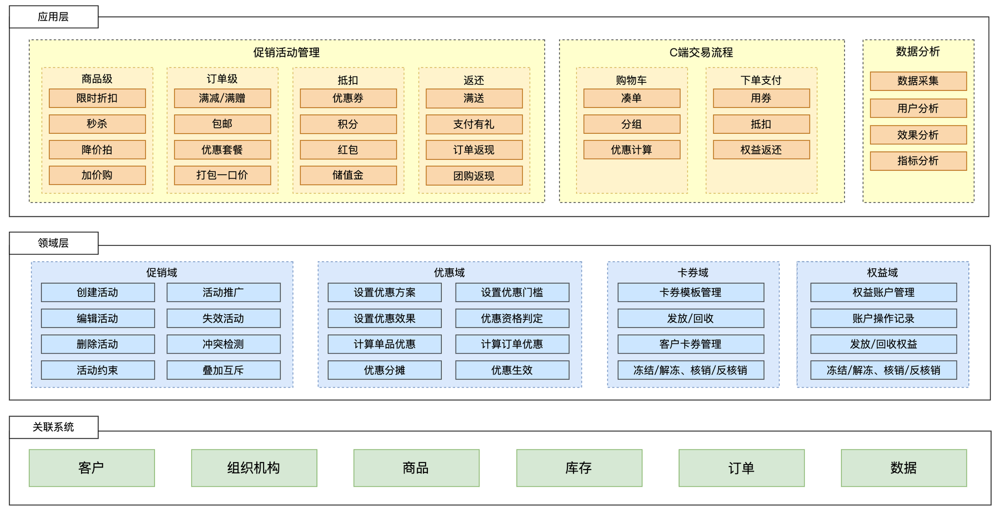

[转至元数据结尾](#page-metadata-end) [转至元数据起始](#page-metadata-start)

## 1、背景

当前优惠工具系统存在较多问题：

1) **从列表、** **商详** **到提单** **链路** **无标准化统一接入层** **：** 目前列表、商祥、提单、下单都是同一接口，无法清晰区分差异化场景，故障无法隔离；其次，优惠下单校验、核销、回退等能力不一，如存在部分优惠在校验时扣减库存资格，部分在核销时扣减，逻辑不一存在潜在资损风险；

2) **单品类优惠工具能力未** **统一** **收拢** **：** 当前存在全网、打折、秒杀、限时抢购、预售等多个工具，其配置和使用均相互独立，导致新增优惠规则（如：分城市投放活动）需重复开发，系统可维护性差，开发迭代成本高；

3) **优惠工具基础** **能力不足** ：库存、资格、选品、活动规则引擎等多个基础服务仍处于建设初期，功能完善度和系统性能上都需进一步提升。否则一是影响营销工具的接入时效，更主要是 **导致价格展示链路及优惠下单链路稳定性不足** 。

综上问题，一方面会导致 **用户转化下单链路稳定性和资金安全都存在较大风险** ；其次影响营销活动玩法快速迭代效率，对平台拉新、促活及转化产生影响（ **23年** **优惠工具** **重点需求** **120+** **个，** **开发平均工时11PD** ） **。**

## 2、业务挑战

1）从稳定性上：

- 核心营销工具（秒杀及赠品）依赖.Net系统，但系统的开发、维护，问题排查等相关技术同学缺失，系统SLA的保障存在较大风险，需尽快推动上游（50+）切换，推动协同难度大。
- 日常及大促因各个方面的系统异常、业务价格的配错等都会产生较大影响的资金损失或客诉，因此对资金安全上相比其他业务会更加严格，需建设较完善的事前、事中、事后监控机制以及离线和实时的数据对账机制，涉及营销所有工具，覆盖B、C端所有场景，覆盖力度细。

2）从配置效率上：

- 营销工具割裂，需频繁在各工具间进行切换操作，效率低，错误率高，需建设较统一操作标准，交互体验友好的系统工具

3）从基建能力上：

- 目前工具更多的是垂直化建设，需抽象出支持全营销工具的领域能力，且基础领域能力性能要求高

## 3、技术重难点：

1）优惠券日常发券量150w，发券量较大，且用户到手价计算依赖券后价，因此已领券、未领券查询需支持较高并发及较好性能

2）选品接口查询需支持10w+QPS，且性能要求RT999线在20ms内

3）选品百万级商品数据全量更新对宽表带来的超高写入速度（1w+），及读取速度（1w+），期望能在分钟级更新完成

4）选品规则的变更，期望执行效率能在分钟级更新完成

5）库存及资格的扣减纬度增加周期（日、周、年），全局等多维度，扣减性能要求高

6）需设计一个灵活且易于扩展的规则引擎，支持复杂的条件和逻辑运算

## 4、关键举措：

1）优惠券集群拆分

2）基础领域服务增加多级缓存

3）选品数据及规则变更增加关键的 MERGE 和 DIFF 操作

4）库存及资格各维度数据统一存入缓存，统一并行扣减

5）

## 5、业务效果：

1）到手价接口性能从RT999线190，降低到110

2）

