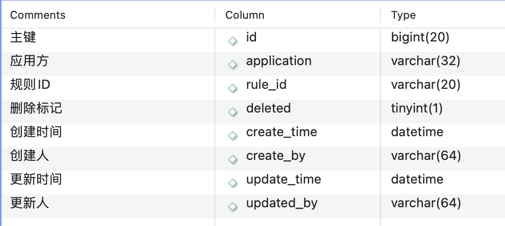
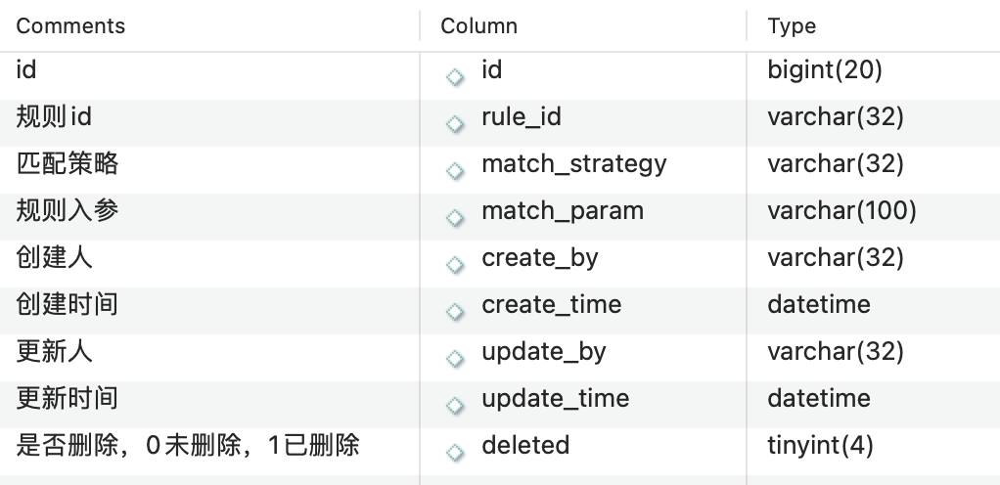
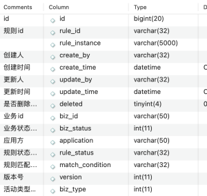

[转至元数据结尾](#page-metadata-end) [转至元数据起始](#page-metadata-start)

## 业务背景

营销活动内部各类活动规则维护，提供统一的规则维护、规则校验

## 功能范围

规则配置、规则校验

## 准入接入流程

1、线下对其规则基本定义，及应用接入方信息  
2、应用发携带业务id【通常是活动id】调用准入服务的规则保存、更新、作废、发布、提前结束等接口管理规则实例信息  
3、应用方携带业务id及需要校验的信息调用准入的规则校验接口，默认校验该业务id下所有规则实例状态为启用的规则实例【不推荐】，也可通过携带规则名称仅校验该业务id下配置的对应规则名称的实例【推荐】

## 规则实例状态

![[Pasted image 20260630011248.png]]

## 数据库概述

## 表application\_rule\_relation

接入应用方及对应规则配置表，脚本插入；需先在此表配置应用方及对应规则id, 应用方才能通过接口创建对应规则实例

## 表rule\_base\_info

规则基本信息表，脚本插入，包含规则id,规则类型，规则元数据定义

## 表rule\_action\_info

规则行为配置表，脚本插入，配置了每个规则对应的执行策略类，以及该规则需要解析的应用方请求中的参数名称

## 表rule\_instance\_offline

规则对应的草稿实例，应用分通过准入提供的创建、更新、作废等接口进行维护

## 表rule\_instance\_online

生效的规则规则实例，可通过接口直接写入(通常是未接入审核流程的应用分使用)，也可通过发布接口将草稿中的规则实例同步到该表  

## 接口设计

## url名称：准入校验URL：/access/accessJudge适用场景：C端活动准入校验

<table><colgroup><col> <col> <col> <col></colgroup><tbody><tr><td colspan="1">名称</td><td colspan="1">类型</td><td colspan="1">必填</td><td colspan="1">备注</td></tr><tr><th>
filterRuleTypes
</th><th>
array
</th><th>
否
</th><th>
过滤规则类型列表, ruleTypes为空或null时生效
</th></tr><tr><td>ruleTypes</td><td>
array
</td><td>
否
</td><td>
规则类型列表
</td></tr><tr><td>
ruleType
</td><td>
string
</td><td>
否
</td><td>
规则类型
</td></tr><tr><td>bizIds</td><td>
array
</td><td>
是
</td><td>
业务id集合
</td></tr><tr><td>
accessRequestMap
</td><td>
object
</td><td>
否
</td><td>
准入规则参数
</td></tr></tbody></table>

## url名称：保持线下规则URL：/config/offline/saveAccessInfo 适用场景：后台创建线下规则

<table><colgroup><col> <col> <col> <col></colgroup><tbody><tr><td colspan="1">名称</td><td colspan="1">类型</td><td colspan="1">必填</td><td colspan="1">备注</td></tr><tr><th>
rewardDTOList
</th><th>
array
</th><th>
否
</th><th>
赠品活动奖励信息
</th></tr><tr><td>
bizType
</td><td>
integer
</td><td>
否
</td><td>
业务类型
</td></tr><tr><td>
version
</td><td>
integer
</td><td>
否
</td><td>
版本号
</td></tr><tr><td>ruleInstance</td><td>
array
</td><td>
否
</td><td>
规则实例列表
</td></tr><tr><td>
operator
</td><td>
string
</td><td>
否
</td><td>
操作人
</td></tr><tr><td colspan="1">
deleted
</td><td colspan="1">
integer
</td><td colspan="1">
否
</td><td colspan="1">
是否删除
</td></tr><tr><td colspan="1">
bizStatus
</td><td colspan="1">
integer
</td><td colspan="1">
否
</td><td colspan="1">
业务状态
</td></tr><tr><td colspan="1">
bizId
</td><td colspan="1">
string
</td><td colspan="1">
是
</td><td colspan="1">
业务id
</td></tr><tr><td>
application
</td><td>
string
</td><td>
是
</td><td>
应用方
</td></tr></tbody></table>

## url名称：发布规则到线上URL：/config/offline/auditPass 适用场景：审核通过后将规则发布到线上

<table><colgroup><col> <col> <col> <col></colgroup><tbody><tr><td colspan="1">名称</td><td colspan="1">类型</td><td colspan="1">必填</td><td colspan="1">备注</td></tr><tr><th>
application
</th><th>
string
</th><th>
否
</th><th>
应用方
</th></tr><tr><td>
operator
</td><td>
string
</td><td>
否
</td><td>
操作人
</td></tr><tr><td>
bizId
</td><td>
string
</td><td>
是
</td><td>
业务id
</td></tr></tbody></table>

## 性能优化

## 缓存

介绍系统中使用的缓存方案（如 Redis 缓存设计），缓存的有效期和刷新策略。

<table><colgroup><col> <col> <col> <col> <col></colgroup><tbody><tr><th>业务场景</th><th>模型结构</th><th>缓存选型</th><th>缓存有效期</th><th>刷新策略</th></tr><tr><td rowspan="2">查询规则实例</td><td>
key：业务id

value: 规则实例列表
</td><td>本地缓存Caffeine</td><td>一分钟</td><td>被动刷新</td></tr><tr><td>
key：{biz_rule_instance_new_ + 业务id的hash取模 + } + bizId

value: 活动列表
</td><td>分布式缓存redis</td><td>一天</td><td>被动刷新</td></tr><tr><td rowspan="2">规则校验-规则实例</td><td>
key：业务id

value: 规则实例列表
</td><td>本地缓存Caffeine</td><td>一分钟</td><td>被动刷新</td></tr><tr><td>
key：{biz_rule_instance_new_ + 业务id的hash取模 + } + bizId

value: 活动列表
</td><td>分布式缓存redis</td><td>一天</td><td>被动刷新</td></tr><tr><td>规则校验-规则基本信息</td><td>
key：rule_type+规则类型

value: 规则id
</td><td>分布式缓存redis</td><td>一天</td><td>被动刷新</td></tr></tbody></table>

## 数据库优化

表：rule\_instance\_online

KEY \`biz\_id\_index\` (\`biz\_id\`),  

## 业务流程

将规则分为慢规则和非慢规则，支持配置。当一次请求中包含的慢规则数量大于1时，自动并行校验