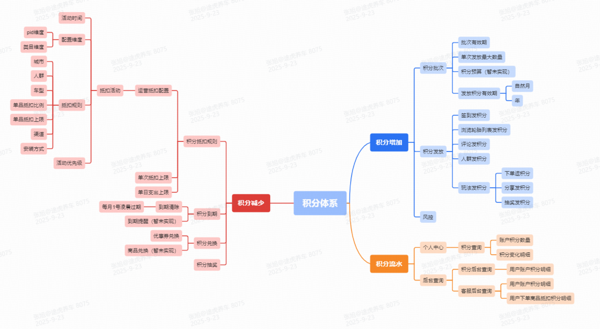
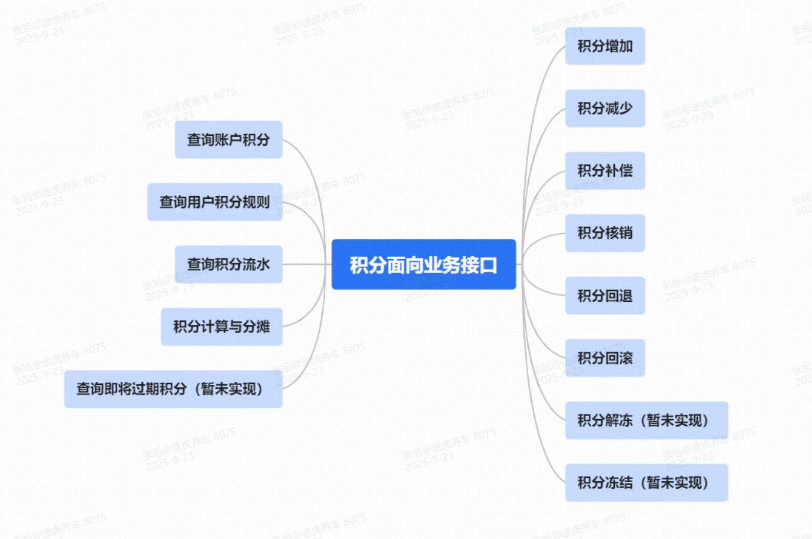
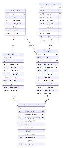
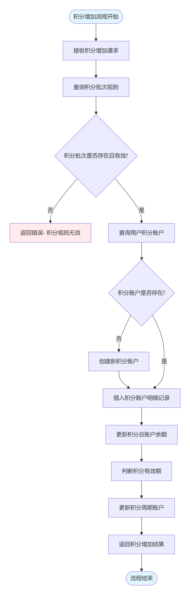
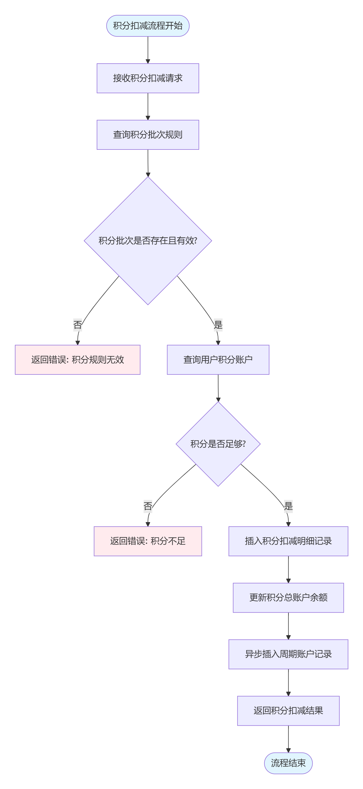
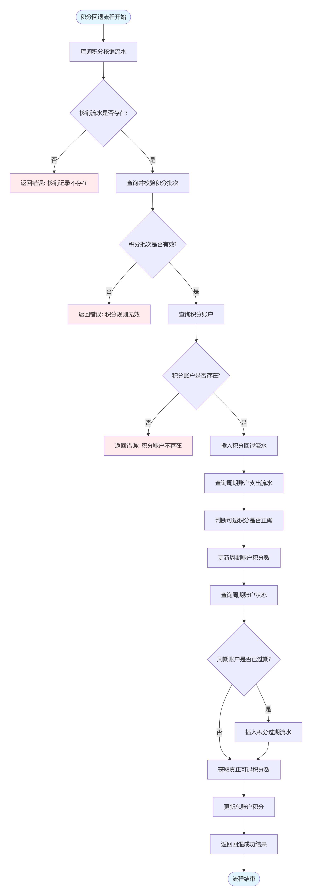
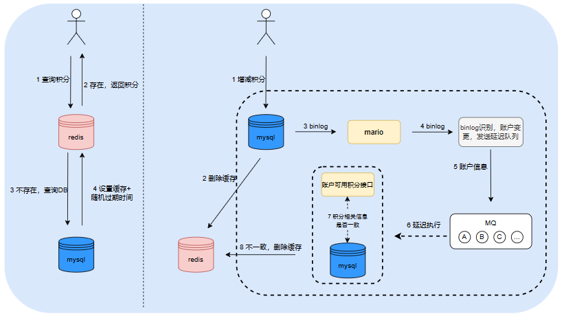
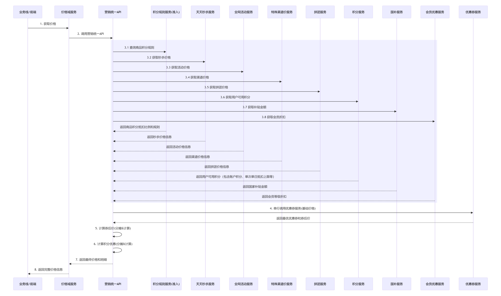
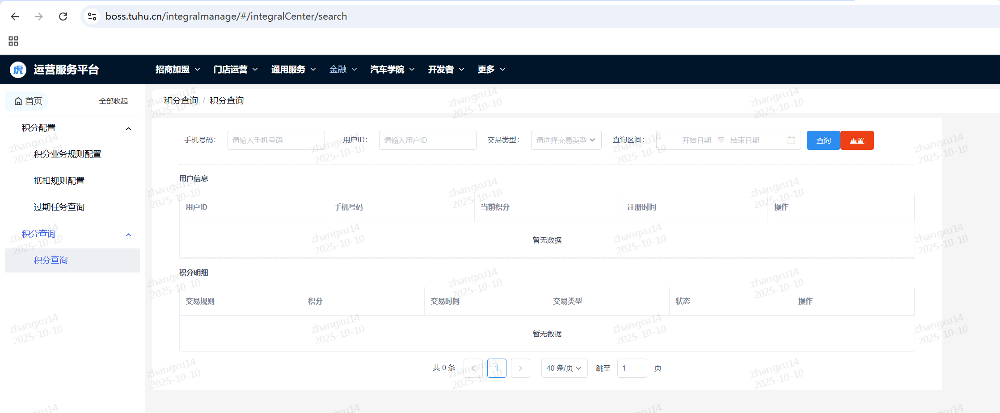
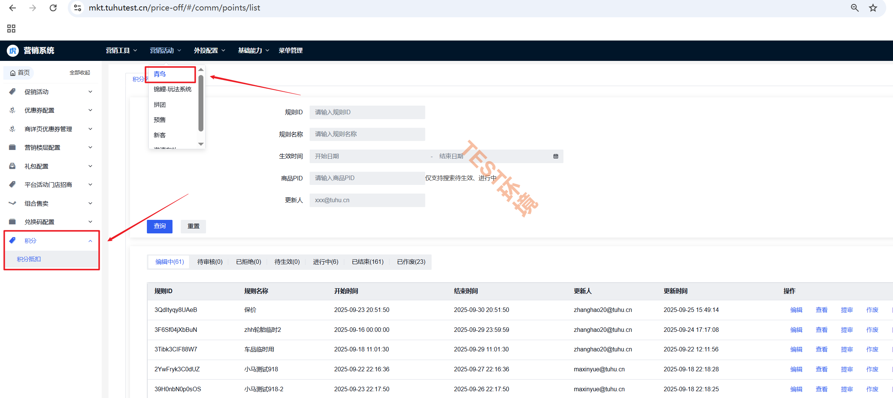

[转至元数据结尾](#page-metadata-end) [转至元数据起始](#page-metadata-start)

## 一、积分定义

**积分** 是电商平台为激励用户消费和增加用户粘性而设计的一种累积奖励机制，用户可以通过消费、签到、参与活动等多种方式获取积分，并用积分兑换商品、优惠券，或直接下单抵扣、参与抽奖等活动。

> 积分系统不仅能为用户带来实际利益和增值体验，还能帮助电商平台收集用户数据，用于精准营销和优化服务，同时还能提高用户活跃度和留存率。

除了上述常规的积分玩法，积分也主要应用于破价场景（电商大促里的一条隐形降价方式）

> 受品牌方限制，每到大促时候，轮胎、车品头部的品牌、商品的价格不能比友商更低，积分就成了唯一合规的“破价杠杆”。
> 
> 把“直接降价”转成“返积分 / 抵积分”，既让用户体验到“更低的价格”，又不触碰品牌方对前台到手价的红线（因为积分被定性为“平台营销资产”，不计入商品成交价）。
> 
> 途虎积分破价方式：浏览轮胎列表直接发放4-8w积分、搜索指定关键词鹰眼发积分、站外触达圈人群发积分等

## 二、积分体系构成

****

## 三、积分业务使用情况

存量积分情况（2025年10月8日快照）

<table><colgroup><col> <col> <col> <col> <col></colgroup><tbody><tr><th>存量积分数</th><th>积分数</th><th>用户数</th><th>用户总数</th><th>占比</th></tr><tr><td rowspan="5">59313497283 </td><td>100以内</td><td>32149371</td><td>36354283</td><td>88.43%</td></tr><tr><td>100-1w</td><td>2727311</td><td>36354283</td><td>7.50%</td></tr><tr><td>1w-5w</td><td>1477573</td><td>36354283</td><td>4.06%</td></tr><tr><td>5w-10w</td><td>28</td><td>36354283</td><td>0%</td></tr><tr><td>10w+</td><td>0</td><td>36354283</td><td>0%</td></tr></tbody></table>

### 积分使用业务线范围

| 业务线 | 配置维度 | 红虎 | wx小程序 | 鸿蒙 |
| --- | --- | --- | --- | --- |
| 轮胎 | pid/类目/业务线 | ✓ | ✓ | ✓ |
| 保养 | 业务线 | ✓ | ✓ | ✓ |
| 深美容 | pid/类目/业务线 | ✓ | ✓ | ✓ |
| 维修 | 业务线 | ✓ | ✓ | ✓ |
| 改装超市 | pid/类目/业务线 | ✓ | ✓ | ✓ |
| 户外运动 | pid/类目/业务线 | ✓ | ✓ | ✓ |
| 蓄电池 | pid/业务线 | ✓ | ✓ | ✓ |
| 轮毂 | 暂不支持 | × | × | × |
| 动力电池 | 暂不支持 | × | × | × |
| 充电 | 暂不支持 | × | × | × |
| 道路救援 | 暂不支持 | × | × | × |
| 加油 | 暂不支持 | × | × | × |
| 钣喷及事故件 | 暂不支持 | × | × | × |
| 洗美 | 暂不支持 | × | × | × |
| 其他 | 暂不支持 | × | × | × |

### Q2积分发放量

| 积分批次 | 类型描述 | 发放积分数量 | 积分总量 | 占比 | 发放用户数（已去重） | 发放用户总数（已去重） | 占比 |
| --- | --- | --- | --- | --- | --- | --- | --- |
| ACTIVE\_INTEGRAL\_COMPENSATION | 活动积分补偿 | 5000 | 269099184815 | 0.00000185805% | 1 | 7662186 | 0.000013051% |
| BIRTHDAY\_GIFT | 生日特权礼包 | 87600 | 269099184815 | 0.00003255305% | 120 | 7662186 | 0.001566133% |
| CANCEL\_GOODS\_EXCHANGE | 取消积分商品兑换 | 37004 | 269099184815 | 0.00001375106% | 772 | 7662186 | 0.010075454% |
| COMPLETE\_MEMBERSHIP\_TASKS | 完成会员任务 | 5026326 | 269099184815 | 0.00186783397% | 140410 | 7662186 | 1.832505763% |
| GOODS\_EVALUATION | 商品评价 | 1244230 | 269099184815 | 0.00046236855% | 38914 | 7662186 | 0.507870730% |
| STORE\_EVALUATION | 门店评价 | 2269380 | 269099184815 | 0.00084332474% | 139389 | 7662186 | 1.819180584% |
| WECHAT\_APPLET\_CHECK\_IN | 小程序签到 | 572962 | 269099184815 | 0.00021291852% | 14530 | 7662186 | 0.189632567% |
| BREAKING\_THE\_PRICE\_BY\_POINT\_TIRELIST | 轮胎积分破价项目 | 266,524,010,000.00 | 269099184815 | 99.04303879004% | 6866044 | 7662186 | 89.609466541% |
| INVITE\_COURTESY | 邀请有礼 | 1 | 269099184815 | 0.00000000037% | 1 | 7662186 | 0.000013051% |
| PRICE\_PROTECT\_REFUND | 保价取消积分退回 | 7455889 | 269099184815 | 0.00277068435% | 1113 | 7662186 | 0.014525881% |
| member\_rights | 会员权益 | 63600 | 269099184815 | 0.00002363441% | 75 | 7662186 | 0.000978833% |
| memberplus\_rights | 会员权益 | 11000 | 269099184815 | 0.00000408771% | 11 | 7662186 | 0.000143562% |
| DAILY\_CHECK\_IN | 签到 | 49411974 | 269099184815 | 0.01836199319% | 850343 | 7662186 | 11.097916443% |
| E\_POINT\_REEXCHANGE | 积分兑换E卡退回 | 2360231049 | 269099184815 | 0.87708591560% | 496330 | 7662186 | 6.477655332% |
| RECOMMEND\_REWARD\_CIRCLE\_OF\_FRIENDS\_SHARE | 分享有礼-朋友圈分享 | 148758800 | 269099184815 | 0.05528028638% | 721058 | 7662186 | 9.410604232% |

### Q2积分核销量

| 积分批次 | 类型描述 | 核销积分数量 | 积分总量 | 占比 | 核销用户数（已去重） | 核销用户总数（已去重） | 占比 |
| --- | --- | --- | --- | --- | --- | --- | --- |
| EXCHANGE\_COUPONS | 优惠券兑换 | 1152766 | 97498319432 | 0.001182344% | 46998 | 8131588 | 0.57796829% |
| E\_POINT\_EXCHANGE | 兑换e点（下单核销 | 5329358883 | 97498319432 | 5.466103328% | 1212219 | 8131588 | 14.90753098% |
| INTEGRAL\_EXPIRE | 积分到期 | 92110217733 | 97498319432 | 94.473646592% | 7807015 | 8131588 | 96.00849182% |
| OBSOLETE\_INTEGRAL | 积分作废 | 49663 | 97498319432 | 0.000050937% | 2 | 8131588 | 0.00002460% |
| PRICE\_PROTECT\_DEDUCT | 积分保价扣减 | 57540387 | 97498319432 | 0.059016799% | 9306 | 8131588 | 0.11444259% |

### Q2订单使用积分情况

| 业务线 | 核销量 | 占比 |
| --- | --- | --- |
| 轮胎 | 2503902272 | 87.64% |
| 保养 | 281096216 | 9.84% |
| 深美容 | 43990116 | 1.54% |
| 维修 | 197077 | 0.82% |

## 四、积分面向业务能力

****

## 五、积分数据模型

以下只展示了核心模型的关键字段  
积分账户、积分账户明细、积分周期账户、积分周期账户支出明细

## 六、积分核心流程

订单可用积分计算流程

### 积分增加流程

### 积分扣减流程

### 积分回退流程

### 积分账户缓存一致性设计

### 到手价（包含积分优惠）时序图

### 券优惠分摊（券后价计算）

点击此处展开...

package com.tuhu.mkt.promo.contract.utils;  
  
import lombok.Data;  
import lombok.extern.slf4j.Slf4j;  
  
import java.math.BigDecimal;  
import java.math.RoundingMode;  
import java.util.\*;  
  
/\*\*  
\* 计算部分商品参与的券后价示例  
\*/  
public class CouponPriceCalculator {  
  
/\*\*  
\* 商品实体  
\*/  
@Data  
public static class Sku {  
/\*\* 商品编号 \*/  
private final String skuId;  
/\*\* 活动价（单位分） \*/  
private final BigDecimal actPrice;  
/\*\* 是否参与本次券优惠 \*/  
private final boolean inCoupon;  
  
public Sku(String skuId, BigDecimal actPrice, boolean inCoupon) {  
this.skuId = skuId;  
this.actPrice = actPrice;  
this.inCoupon = inCoupon;  
}  
}  
  
/\*\*  
\* 计算券后价  
\* @param skus 所有商品（含不参与券的）  
\* @param couponValue 券优惠（单位：分）  
\* @return skuId -> 券后价；未参与券的 sku 保持活动价  
\*/  
public static Map<String, BigDecimal> calcPrice(List\<Sku> skus, BigDecimal couponValue) {  
// 前置校验  
if (skus == null || skus.isEmpty() || null == couponValue) {  
return Collections.emptyMap();  
}  
// 1. 过滤出参与券的商品  
List\<Sku> calcSkuList = new ArrayList<>();  
for (Sku s: skus) {  
if (s.isInCoupon() && s.getActPrice().compareTo(BigDecimal.ZERO) > 0) {  
calcSkuList.add(s);  
}  
}  
  
// 2. 没有参与券的商品,直接返回活动价  
if (calcSkuList.isEmpty()) {  
Map<String, BigDecimal> map = new HashMap<>();  
for (Sku s: skus) map.put(s.getSkuId(), s.getActPrice());  
return map;  
}  
  
// 3. 计算参与券商品的总活动价  
BigDecimal total = calcSkuList.stream().map(Sku::getActPrice).reduce(BigDecimal.ZERO, BigDecimal::add);  
  
// 4. 计算分摊,保留 2 位小数，尾差补给金额最高的 SKU  
Map<String, BigDecimal> clacMap = new HashMap<>();  
BigDecimal allocateSum = BigDecimal.ZERO;  
Sku maxSku = null;  
for (Sku s: calcSkuList) {  
//获取活动价最大的商品，后续处理尾插使用  
if (maxSku == null || s.getActPrice().compareTo(maxSku.getActPrice()) > 0) maxSku = s;  
//计算分摊，使用金额（分）来计算，需要为整数，向下取整  
BigDecimal part = couponValue.multiply(s.getActPrice()).divide(total, 0, RoundingMode.DOWN);  
clacMap.put(s.getSkuId(), part);  
//记录已经分配的券优惠金额，后续处理尾插使用  
allocateSum = allocateSum.add(part);  
}  
  
// 5. 尾差补给最大金额 SKU  
BigDecimal diff = couponValue.subtract(allocateSum);  
if(diff.compareTo(BigDecimal.ZERO)!= 0) {  
BigDecimal fixed = clacMap.get(maxSku.getSkuId()).add(diff);  
clacMap.put(maxSku.getSkuId(), fixed);  
}  
  
// 6. 组装最终结果：参与券的用券后价，其余用活动价  
Map<String, BigDecimal> resultMap = new HashMap<>();  
for (Sku s: skus) {  
if (s.isInCoupon() && clacMap.containsKey(s.getSkuId())) {  
BigDecimal finalPrice = s.getActPrice().subtract(clacMap.get(s.getSkuId())).max(BigDecimal.ZERO); // 兜底非负  
resultMap.put(s.getSkuId(), finalPrice);  
} else {  
resultMap.put(s.getSkuId(), s.getActPrice());  
}  
}  
return resultMap;  
}  
}

### 积分分摊计算

点击此处展开...

package com.tuhu.mkt.promo.contract.utils;  
  
import lombok.Data;  
  
import java.math.BigDecimal;  
import java.math.RoundingMode;  
import java.util.\*;  
  
public class IntegralPriceCalculator {  
  
@Data  
public static final class Sku {  
private final String skuId;  
// 商品券后价（分）  
private final BigDecimal couponPrice;  
// 商品可抵扣积分上限（分）  
private final BigDecimal maxPoints;  
// 是否允许使用积分  
private final boolean allowPoints;  
  
public Sku(String skuId, BigDecimal couponPrice, BigDecimal maxPoints, boolean allowPoints) {  
this.skuId = skuId;  
this.couponPrice = couponPrice;  
this.maxPoints = maxPoints;  
this.allowPoints = allowPoints;  
}  
}  
  
public static Map<String, BigDecimal> calcPromo(List\<Sku> skus, BigDecimal canUseIntegral) {  
//0、前置校验  
if (skus == null || skus.isEmpty() || canUseIntegral == null) {  
return Collections.emptyMap();  
}  
//1、获取参与算积分 且 商品可用积分 大于 0 的商品  
List\<Sku> calcSkuList = new ArrayList<>();  
for (Sku s: skus) {  
if (s.isAllowPoints() && s.getMaxPoints().compareTo(BigDecimal.ZERO) > 0) {  
calcSkuList.add(s);  
}  
}  
  
// 2. 无可抵扣商品返回，返回0  
if (calcSkuList.isEmpty() || canUseIntegral.compareTo(BigDecimal.ZERO) <= 0) {  
Map<String, BigDecimal> result = new HashMap<>();  
for (Sku sku: skus) {  
result.put(sku.getSkuId(), BigDecimal.ZERO);  
}  
return result;  
}  
  
//3、获取参与计算积分的商品的可用总积分  
BigDecimal totalMax = calcSkuList.stream().map(Sku::getMaxPoints).reduce(BigDecimal.ZERO, BigDecimal::add);  
  
//4、实际下单可以使用的积分数  
BigDecimal realUse = canUseIntegral.min(totalMax);  
  
//5、计算分摊  
Map<String, BigDecimal> skuIntegralMap = new HashMap<>();  
  
BigDecimal allocateSum = BigDecimal.ZERO;  
Sku maxSku = null;  
for (Sku s: calcSkuList) {  
//获取可用积分最大的商品，后续处理尾插使用  
if (maxSku == null || s.getMaxPoints().compareTo(maxSku.getMaxPoints()) > 0) maxSku = s;  
//计算分摊，【积分必须为整数，这里向下取整】  
BigDecimal allocatePart = realUse.multiply(s.getMaxPoints()).divide(totalMax, 0, RoundingMode.DOWN);  
skuIntegralMap.put(s.getSkuId(), allocatePart);  
//记录已经分配的积分数，后续处理尾插使用  
allocateSum = allocateSum.add(allocatePart);  
}  
  
//6、处理尾插，将尾插放到可用积分最大的商品上  
BigDecimal diff = realUse.subtract(allocateSum);  
if (diff.compareTo(BigDecimal.ZERO) > 0) {  
BigDecimal fixed = skuIntegralMap.get(maxSku.getSkuId()).add(diff);  
skuIntegralMap.put(maxSku.getSkuId(), fixed);  
}  
  
//7、兜底处理，判断skuIntegralMap中的积分优惠是否小于券后价  
Map<String, BigDecimal> resultMap = new HashMap<>();  
for (Sku sku: skus) {  
BigDecimal integralPromo = skuIntegralMap.get(sku.getSkuId());  
if (sku.isAllowPoints() && integralPromo!= null && integralPromo.compareTo(sku.getCouponPrice()) < 0) {  
resultMap.put(sku.getSkuId(), integralPromo);  
} else {  
resultMap.put(sku.getSkuId(), BigDecimal.ZERO);  
}  
}  
//返回结果  
return resultMap;  
}  
}

## 七、积分相关后台地址

**boss后台：  
****1、 [https://boss.tuhu.cn/integralmanage/#/integralCenter/search](https://boss.tuhu.cn/integralmanage/#/integralCenter/search)**

**2、 [https://boss.tuhutest.cn/integralmanage/#/integralCenter/search](https://boss.tuhutest.cn/integralmanage/#/integralCenter/search)**

****

**青鸟后台：**

**1、 [https://mkt.tuhu.cn/price-off/#/comm/points/list](https://mkt.tuhu.cn/price-off/#/comm/points/list)**

**2、 [https://mkt.tuhutest.cn/price-off/#/comm/points/list](https://mkt.tuhutest.cn/price-off/#/comm/points/list)**

****