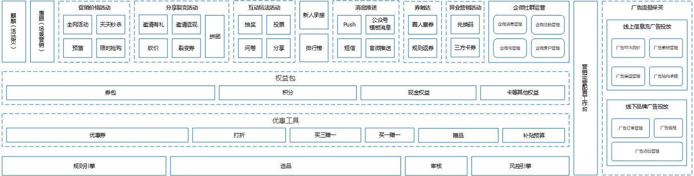
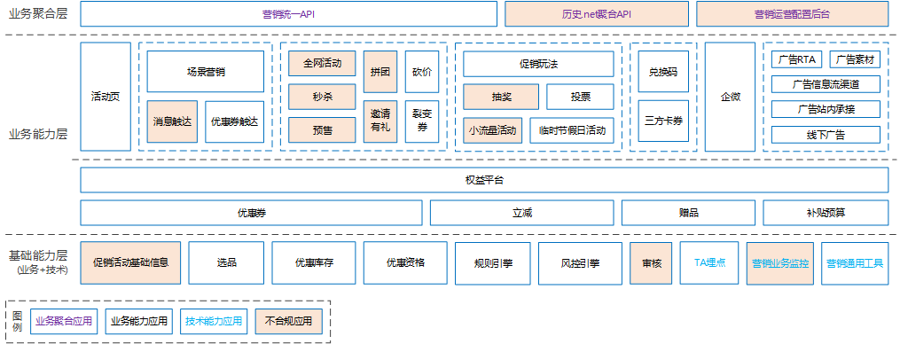
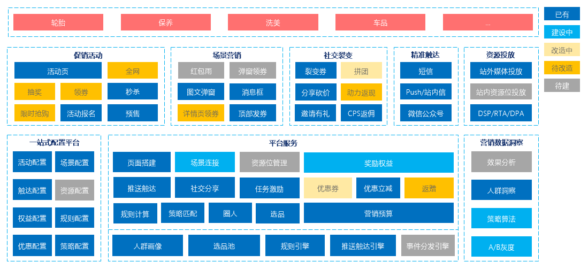
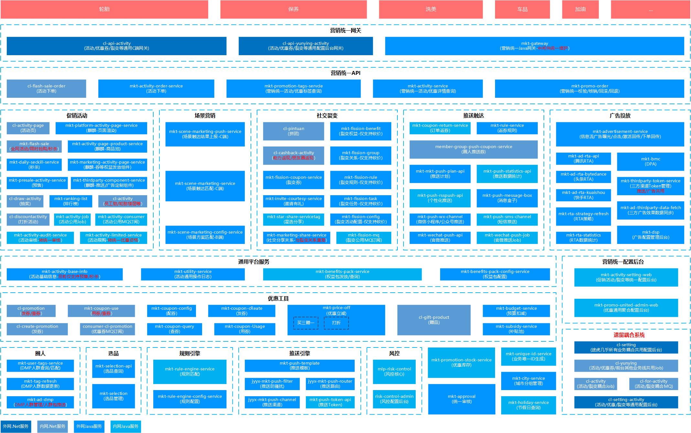
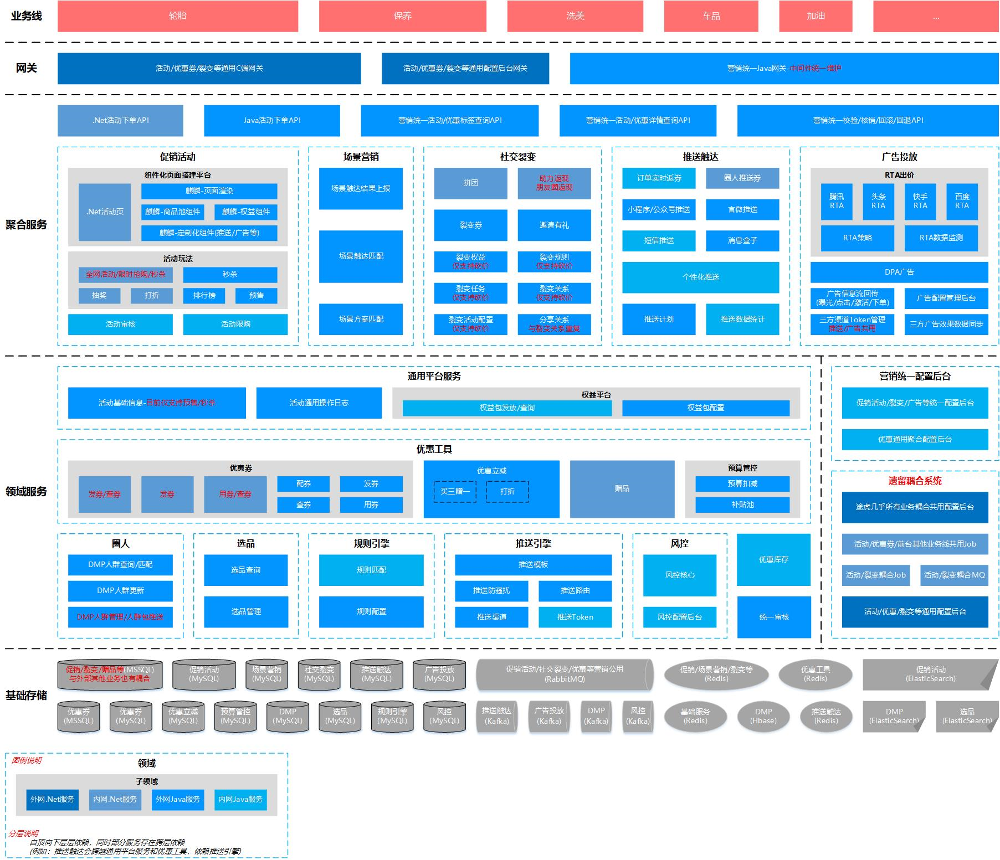

[转至元数据结尾](#page-metadata-end) [转至元数据起始](#page-metadata-start)

**latest\_2022-06**

#### 1、业务功能架构图

#### 2、系统应用架构图

#### 3、应用描述说明

<table><colgroup><col> <col> <col> <col> <col> <col></colgroup><thead><tr><th>
应用名
</th><th>
应用中文名称
</th><th colspan="1">
应用分类
</th><th>
应用简介
</th><th>
应用是否合规
</th><th>
备注
</th></tr></thead><tbody><tr><td>mkt-unified-api</td><td>营销统一API</td><td colspan="1">业务聚合应用</td><td>营销面向上游业务方提供的统一API，包含： 1、优惠到手价查询 2、活动/优惠详情查询 3、活动/优惠校验 4、活动/优惠核销 5、活动/优惠回滚</td><td>
合规
</td><td></td></tr><tr><td colspan="1">mkt-activity-aggregation</td><td colspan="1">历史.net聚合API</td><td colspan="1">业务聚合应用</td><td colspan="1">待改造.Net促销活动聚合服务 1、.Net聚合API服务 2、.Net返现助力服务 3、.Net打折服务 4、.Net聚合活动服务</td><td colspan="1">
不合规
</td><td colspan="1">
不合规原因：历史MSSQL DB的耦合

后续治理规划：逐步推进系统重构及部分历史功能下线
</td></tr><tr><td colspan="1">mkt-activity-setting</td><td colspan="1">营销运营配置后台</td><td colspan="1">业务聚合应用</td><td colspan="1">促销活动通用配置后台，主要涉及.Net/Java服务 1、.Net服务后续会逐渐Java化。 2、Java服务配置后台后续也会迁移到各自应用。 注：后续此应用会下线</td><td colspan="1">
不合规
</td><td colspan="1">
不合规原因：通用配置后台耦合其他应用相关DB

后续治理规划：改为访问其他应用提供的相关接口
</td></tr><tr><td colspan="1">mkt-activity-page</td><td colspan="1">活动页</td><td colspan="1">业务能力应用</td><td colspan="1">营销活动的活动页应用，主要包含： 1、投放页服务 2、麒麟优惠奖励服务 3、目标页跳转服务 4、麒麟第三方组件服务 5、麒麟商品池服务 6、营销活动页服务 7、麒麟活动搭建平台服务 8、麒麟活动页消费者 9、活动页服务（.net ，待下线）</td><td colspan="1">
合规
</td><td colspan="1"></td></tr><tr><td colspan="1">mkt-activity-scenemarketing</td><td colspan="1">场景营销</td><td colspan="1">业务能力应用</td><td colspan="1">
基于场景的用户精细化营销触达应用，主要包含
<ol><li>场景营销触达服务</li><li>场景营销上报服务</li><li>场景营销管理平台</li><li>场景营销领券中心</li></ol></td><td colspan="1">
合规
</td><td colspan="1"></td></tr><tr><td colspan="1">mkt-base-push</td><td colspan="1">消息触达</td><td colspan="1">业务能力应用</td><td colspan="1">途虎消息推送触达平台。 覆盖途虎站外消息推送全渠道场景，支持App Push、短信、官方微信、消息盒子多种触发方式。主要应用于定时推送计划、个性化场景推送、统一接口调用等多种服务形态。</td><td colspan="1">
不合规
</td><td colspan="1">
不合规原因：历史业务DB耦合

后续治理规划：重构改造已完成，推动历史逻辑下线
</td></tr><tr><td colspan="1">mkt-base-couponpush</td><td colspan="1">优惠券触达</td><td colspan="1">业务能力应用</td><td colspan="1">优惠券推送相关业务场景应用。 目前基于服务编排引擎，对于定时、事件的发券任务进行配置化调度执行，收拢优惠券推送计划、下单返券、三方发券等业务。</td><td colspan="1">
不合规
</td><td colspan="1">
不合规原因：历史业务DB耦合

后续治理规划：重构改造已完成，推动历史逻辑下线
</td></tr><tr><td colspan="1">mkt-activity-flashsale</td><td colspan="1">全网活动</td><td colspan="1">业务能力应用</td><td colspan="1">面向途虎站内提供的商品活动定价应用，主要包含 1、新全网活动后台应用 2、新全网C端应用</td><td colspan="1">
不合规
</td><td colspan="1">
不合规原因：耦合访问其他应用DB

后续治理规划：改为访问其他应用提供的相关接口
</td></tr><tr><td colspan="1">mkt-activity-seckill</td><td colspan="1">秒杀</td><td colspan="1">业务能力应用</td><td colspan="1">途虎站内核心秒杀/抢购应用，主要包含： 1、新天天秒杀服务 2、秒杀抢购服务 (限时抢购、活动页秒杀)</td><td colspan="1">
不合规
</td><td colspan="1">
不合规原因：历史MSSQL DB的耦合

后续治理规划：重构改造已完成，推动历史逻辑下线
</td></tr><tr><td colspan="1">mkt-activity-presale</td><td colspan="1">预售</td><td colspan="1">业务能力应用</td><td colspan="1">面向途虎站内提供的商品预售应用，主要包含 1、预售C端服务</td><td colspan="1">
不合规
</td><td colspan="1">
不合规原因：历史MSSQL DB的耦合

后续治理规划：数据表迁移，去除对MSSQL DB的依赖
</td></tr><tr><td colspan="1">mkt-activity-pintuan</td><td colspan="1">拼团</td><td colspan="1">业务能力应用</td><td colspan="1">
基于用户分享邀请好友组团的裂变工具，主要包含：
<ol><li>拼团主服务（.net，待迁移重构）</li><li>拼团 Java 支撑服务</li></ol></td><td colspan="1">
不合规
</td><td colspan="1">
不合规原因：历史MSSQL DB的耦合

后续治理规划：推动.net应用的重构改造
</td></tr><tr><td colspan="1">mkt-activity-invitation</td><td colspan="1">邀请有礼</td><td colspan="1">业务能力应用</td><td colspan="1">C端社交老带新活动，主要包含 1、用户裂变拉新 2、主客态权益发放（券&积分） 3、统一B端活动配置</td><td colspan="1">
不合规
</td><td colspan="1">
不合规原因：其他应用耦合访问Cache

后续治理规划：推动其他应用改为访问接口
</td></tr><tr><td colspan="1">mkt-activity-bargain</td><td colspan="1">砍价</td><td colspan="1">业务能力应用</td><td colspan="1">
基于好友助力砍价的裂变工具，主要包含：
<ol><li>裂变工具配置服务</li><li>裂变工具组团服务</li><li>裂变工具规则服务</li><li>裂变工具任务服务</li><li>裂变工具收益服务</li></ol></td><td colspan="1">
合规
</td><td colspan="1"></td></tr><tr><td colspan="1">mkt-activity-fissioncoupon</td><td colspan="1">裂变券</td><td colspan="1">业务能力应用</td><td colspan="1">
通过社交运营触达更多新用户的优惠券应用，主要包含：
<ol><li>分享裂变活动功能</li><li>客态用户助力上报功能</li><li>主客态权益发放功能（劵）</li></ol></td><td colspan="1">
合规
</td><td colspan="1"></td></tr><tr><td colspan="1">mkt-activity-task</td><td colspan="1">促销玩法</td><td colspan="1">业务能力应用</td><td colspan="1">
营销内部的任务玩法应用，主要包含：
<ol><li>玩法 C 端聚合 API</li><li>玩法单元实例服务</li><li>玩法单元基础服务</li><li>营销任务活动服务</li><li>营销任务管理服务</li></ol></td><td colspan="1">
合规
</td><td colspan="1"></td></tr><tr><td colspan="1">mkt-activity-lottery</td><td colspan="1">抽奖</td><td colspan="1">业务能力应用</td><td colspan="1">面向c端抽奖玩法 1、独立运营配置管理系统 2、大转盘抽奖、摇奖机抽奖、盲盒抽奖等展现方式</td><td colspan="1">
不合规
</td><td colspan="1">
不合规原因：历史MSSQL DB的耦合

后续治理规划：推动.net应用的重构改造
</td></tr><tr><td colspan="1">mkt-activity-voting</td><td colspan="1">投票</td><td colspan="1">业务能力应用</td><td colspan="1">面向C端用户投票活动玩法 1、运营端投票管理平台； 2、面向C端投票内容渲染与投票</td><td colspan="1">
合规
</td><td colspan="1"></td></tr><tr><td colspan="1">mkt-activity-smallactivity</td><td colspan="1">小流量活动</td><td colspan="1">业务能力应用</td><td colspan="1">营销内部小流量活动/玩法的承接应用，主要包含 1、反馈平台服务 2、营销活动分享服务 3、小流量活动服务 4、营销平台星选查询服务</td><td colspan="1">
不合规
</td><td colspan="1">
不合规原因：历史MSSQL DB的耦合

后续治理规划：数据表迁移，去除对MSSQL DB的依赖
</td></tr><tr><td colspan="1">mkt-activity-tempactivity</td><td colspan="1">临时节假日活动</td><td colspan="1">业务能力应用</td><td colspan="1">
活动临时节日活动应用，主要包含： 1、快手x途虎春节发券服务 2、节假日活动：年会抽奖 3、营销活动统计服务 4、双十一红包雨抽奖、发奖
</td><td colspan="1">
合规
</td><td colspan="1"></td></tr><tr><td colspan="1">mkt-promo-cdkey</td><td colspan="1">兑换码</td><td colspan="1">业务能力应用</td><td colspan="1">兑换码平台，期望提供面向外部或内部各业务方统一的权益兑换凭证及相关查询服务</td><td colspan="1">
合规
</td><td colspan="1"></td></tr><tr><td colspan="1">mkt-promo-thirdpartycoupon</td><td colspan="1">三方卡券</td><td colspan="1">业务能力应用</td><td colspan="1">.net应用，主要功能包含微信卡劵的申领、核销，后期做下线处理</td><td colspan="1">
合规
</td><td colspan="1"></td></tr><tr><td colspan="1">mkt-wxwork</td><td colspan="1">企微</td><td colspan="1">业务能力应用</td><td colspan="1">自建企微运营相关能力，涉及渠道活码、门店活码、关键词回复、拉群，企微事件推送等功能</td><td colspan="1">
合规
</td><td colspan="1"></td></tr><tr><td colspan="1">mkt-ad-rta</td><td colspan="1">广告RTA</td><td colspan="1">业务能力应用</td><td colspan="1">广告RTA实时出价API。 目前主要对接腾讯广点通、字节、快手和百度4大头部渠道</td><td colspan="1">
合规
</td><td colspan="1"></td></tr><tr><td colspan="1">mkt-ad-material</td><td colspan="1">广告素材</td><td colspan="1">业务能力应用</td><td colspan="1">广告投放素材管理。 目前主要包含图片、视频、商品等素材。其中商品素材对接途虎商品系统，图片素材部分对接智能UI平台，图片/视频大部分素材目前主要对接第三方增长大师SaaS服务</td><td colspan="1">
合规
</td><td colspan="1"></td></tr><tr><td colspan="1">mkt-ad-newsfeed</td><td colspan="1">广告信息流渠道</td><td colspan="1">业务能力应用</td><td colspan="1">主要承接广告信息流渠道交互相关的点击、曝光信息，以及回传站内的激活、注册、下单事件至媒体渠道，用以优化广告投放模型。 目前累计对接20+渠道（腾讯广点通、字节、知乎、UC等）</td><td colspan="1">
合规
</td><td colspan="1"></td></tr><tr><td colspan="1">mkt-ad-landing</td><td colspan="1">广告站内承接</td><td colspan="1">业务能力应用</td><td colspan="1">广告站内承接相关功能模块。 目前主要包含广告用户进入红虎站内时的广告所见所得功能逻辑</td><td colspan="1">
合规
</td><td colspan="1"></td></tr><tr><td colspan="1">mkt-ad-btl</td><td colspan="1">线下广告</td><td colspan="1">业务能力应用</td><td colspan="1">线下广告（三方采买）系统。 主要是采买三方SaaS服务商开发的系统，用以管理线下（小区、电梯、办公楼宇等）广告点位管理、排期、投放及广告服务商的下单等</td><td colspan="1">
合规
</td><td colspan="1"></td></tr><tr><td colspan="1">mkt-activity-benefitpack</td><td colspan="1">权益平台</td><td colspan="1">业务能力应用</td><td colspan="1">面向途虎站内提供的权益发放应用，主要包含 1、权益包后台配置服务 2、权益包C端服务</td><td colspan="1">
合规
</td><td colspan="1"></td></tr><tr><td colspan="1">mkt-promo-coupon</td><td colspan="1">优惠券</td><td colspan="1">业务能力应用</td><td colspan="1">提供统一的优惠劵能力，主要功能包含： 1.配劵 2.领劵 3.查劵 4.用劵 5.劵后价</td><td colspan="1">
不合规
</td><td colspan="1">
不合规原因：历史MSSQL DB的耦合

后续治理规划：重构改造已完成，推动历史逻辑下线
</td></tr><tr><td colspan="1">mkt-promo-priceoff</td><td colspan="1">立减</td><td colspan="1">业务能力应用</td><td colspan="1">提供统一的立减能力：包含各类减的形式： 1）立减 2）满减 3）打折 4）满折</td><td colspan="1">
合规
</td><td colspan="1"></td></tr><tr><td colspan="1">mkt-promo-gift</td><td colspan="1">赠品</td><td colspan="1">业务能力应用</td><td colspan="1">提供随单赠送的优惠能力，包含： 1）满x件赠 2）阶梯赠 赠送的赠品既可以是实物赠品，也可以是虚拟赠品，还可以组合赠送。</td><td colspan="1">
合规
</td><td colspan="1"></td></tr><tr><td colspan="1">mkt-promo-budget</td><td colspan="1">补贴预算</td><td colspan="1">业务能力应用</td><td colspan="1">营销活动成本预算服务，目前仅支持城市门店运营预算的管理，提供预算扣减，预算调拨等能力。后期支持管控整个营销活动成本预算</td><td colspan="1">
合规
</td><td colspan="1"></td></tr><tr><td colspan="1">mkt-activity-basicinfo</td><td colspan="1">促销活动基础信息</td><td colspan="1">业务能力应用</td><td colspan="1">面向营销内部提供的活动基础应用，主要包含 1、活动基础服务</td><td colspan="1">
不合规
</td><td colspan="1">
不合规原因：其他应用耦合访问DB

后续治理规划：领域上已抽象活动基础信息应用，但各类上层活动仍直接依赖DB，后续需逐步推动切换为接口访问
</td></tr><tr><td colspan="1">mkt-promo-selection</td><td colspan="1">选品</td><td colspan="1">业务能力应用</td><td colspan="1">营销选品服务，主要包含功能： 1、按规则进行选择商品 2、按类目、价格等进行选择商品 3、规则排序能力</td><td colspan="1">
合规
</td><td colspan="1"></td></tr><tr><td colspan="1">mkt-promo-stock</td><td colspan="1">优惠库存</td><td colspan="1">业务能力应用</td><td colspan="1">提供营销统一库存管控能力，主要涉及活动（全网、打折、赠品、秒杀等）和优惠工具的库存扣减，库存查询，库存监控等功能</td><td colspan="1">
合规
</td><td colspan="1"></td></tr><tr><td colspan="1">mkt-promo-qualification</td><td colspan="1">优惠资格</td><td colspan="1">业务能力应用</td><td colspan="1">提供营销统一资格管控能力，主要涉及活动与优惠工具的用户资格扣减，回退等功能</td><td colspan="1">
合规
</td><td colspan="1"></td></tr><tr><td colspan="1">mkt-base-ruleengine</td><td colspan="1">规则引擎</td><td colspan="1">业务能力应用</td><td colspan="1">营销业务规则引擎。 该应用主要包含： 1、规则引擎，支撑首页、场景营销、搜索推荐等业务高效规则实时计算 2、属性管理平台，支持HBase、Http等异构数据源的模板配置化查询</td><td colspan="1">
合规
</td><td colspan="1"></td></tr><tr><td colspan="1">mkt-base-riskcontrol</td><td colspan="1">风控引擎</td><td colspan="1">业务能力应用</td><td colspan="1">途虎自研风控策略引擎。 封装集成同盾、腾讯、自研规则引擎和算法，提供一站式风控服务， 旨在为用户提供灵活、可配置的业务拦截策略。</td><td colspan="1">
合规
</td><td colspan="1"></td></tr><tr><td colspan="1">mkt-promo-approval</td><td colspan="1">审核</td><td colspan="1">业务能力应用</td><td colspan="1">营销内部审核平台，提供面向营销运营的活动与优惠工具的基础审核流程，支持各类营销活动和选品绑定的一键提审。</td><td colspan="1">
不合规
</td><td colspan="1">
不合规原因：历史MSSQL DB的耦合

后续治理规划：数据表迁移，去除对MSSQL DB的依赖
</td></tr><tr><td colspan="1">mkt-base-ta</td><td colspan="1">TA埋点</td><td colspan="1">技术能力应用</td><td colspan="1">面向红虎提供相关前端埋点事件上报功能。目标是建设一套途虎自有的业务重要性高、实时性要求高的稳定埋点上报服务，并计划面向后端各领域，提供统一的事件加工、分发能力</td><td colspan="1">
合规
</td><td colspan="1"></td></tr><tr><td colspan="1">mkt-base-monitor</td><td colspan="1">营销业务监控</td><td colspan="1">技术能力应用</td><td colspan="1">面向营销内部提供统一的业务监控能力。 应用于营销业务通用监控场景和安全事件管理监控场景。</td><td colspan="1">
不合规
</td><td colspan="1">
不合规原因：由于监控需要，耦合访问其他应用DB

后续治理规划：改为访问其他应用提供的相关接口
</td></tr><tr><td colspan="1">mkt-base-utility</td><td colspan="1">营销通用工具</td><td colspan="1">技术能力应用</td><td colspan="1">面向营销内部提供的通用基础工具，主要包含： 1、城市分组匹配服务 2、节假日服务 3、业务唯一ID服务 4、企微机器人通知、告警服务 5、文件上传/下载、外部通用功能包装等脚手架服务</td><td colspan="1">
合规
</td><td colspan="1"></td></tr></tbody></table>

version\_2021-02

#### 1、业务功能架构图

#### 2、系统服务架构图

##### 2.1 详细含AppId版

##### 2.2 含DB分层服务版

当前系统服务架构图存在Top问题：

- 基础能力的抽象度还有待加强，需要进一步下沉（优惠资格、优惠互斥、活动玩法、社交玩法等）
- 一些重要的营销能力仍然还是大的.Net单体应用，需要进行Java服务化改造（赠品、抽奖、优惠券等）
- 营销内部存在部分系统耦合，特别是部分（配置后台、Job、MQ）.Net系统仍然与其他团队的系统耦合严重（见图中红色字体部分）
- 由于基础能力抽象有一定欠缺，能力就更无法通过合理串联来快速支撑新的业务，导致仍然存在一定的系统重复建设（总计124个应用，除开图中102个，各领域还有一些非核心的应用）

#### 3、领域服务映射关系

<table><colgroup><col> <col> <col> <col> <col> <col></colgroup><thead><tr><th></th><th>
AppId
</th><th colspan="1">
技术栈
</th><th colspan="1">
服务等级(核心/非核心)
</th><th colspan="1">
所属领域
</th><th>
服务能力描述（主要功能描述/提供核心接口等）
</th></tr></thead><tbody><tr><th>1</th><td colspan="1">ext-spring-mkt-advertisement-service</td><td colspan="1">Java</td><td colspan="1"></td><td colspan="1">广告投放</td><td colspan="1">广告渠道接入，转化事件回传，数据归档</td></tr><tr><th>2</th><td colspan="1">ext-spring-mkt-subsidy-service</td><td colspan="1">Java</td><td colspan="1"></td><td colspan="1">优惠-预算管控</td><td colspan="1">活动补贴池业务</td></tr><tr><th>3</th><td colspan="1">ext-spring-mkt-budget-service</td><td colspan="1">Java</td><td colspan="1"></td><td colspan="1">优惠-预算管控</td><td colspan="1">补贴服务扣减，扣减日志</td></tr><tr><th>4</th><td colspan="1">int-spring-mkt-coupon-thirdparty-service</td><td colspan="1">Java</td><td colspan="1">
非核心
</td><td colspan="1">优惠-三方渠道卡券</td><td colspan="1">第三方合作渠道卡券服务</td></tr><tr><th>5</th><td colspan="1">ext-spring-mkt-rule-service</td><td colspan="1">Java</td><td colspan="1">
非核心
</td><td colspan="1">推送触达-返券</td><td colspan="1">返券规则服务</td></tr><tr><th>6</th><td colspan="1">int-spring-mkt-coupon-return-service</td><td colspan="1">Java</td><td colspan="1">
非核心
</td><td colspan="1">用户营销</td><td colspan="1">返券服务</td></tr><tr><th>7</th><td colspan="1">int-spring-mkt-holiday-service</td><td colspan="1">Java</td><td colspan="1">
非核心
</td><td colspan="1">基础服务</td><td colspan="1">节假日服务</td></tr><tr><th>8</th><td colspan="1">int-wcf-mkt-coupon-use</td><td colspan="1">.net</td><td colspan="1"></td><td colspan="1">优惠-优惠券</td><td colspan="1">C端优惠券查询服务 - 旧</td></tr><tr><th>9</th><td colspan="1">int-wcf-cl-promotion</td><td colspan="1">.net</td><td colspan="1"></td><td colspan="1">优惠-优惠券</td><td colspan="1">优惠券查询服务 - 新</td></tr><tr><th>10</th><td colspan="1">int-wcf-cl-create-promotion</td><td colspan="1">.net</td><td colspan="1"></td><td colspan="1">优惠-优惠券</td><td colspan="1">发券服务</td></tr><tr><th>11</th><td colspan="1">
int-wcf-cl-thirdparty-weixin
</td><td colspan="1">.net</td><td colspan="1">
非核心
</td><td colspan="1">优惠-三方渠道卡券</td><td colspan="1">微信卡券服务</td></tr><tr><th>12</th><td colspan="1">int-consumer-cl-promotion</td><td colspan="1">.net</td><td colspan="1">
非核心
</td><td colspan="1">优惠-优惠券</td><td colspan="1">优惠券MQ</td></tr><tr><th>13</th><td colspan="1">ext-website-mkt-coupon-setting</td><td colspan="1">Java</td><td colspan="1">
非核心
</td><td colspan="1">优惠-优惠券</td><td colspan="1">优惠券查券运营后台服务</td></tr><tr><th>14</th><td colspan="1">int-job-cl-yunying</td><td colspan="1">.net</td><td colspan="1">
非核心
</td><td colspan="1">促销活动、优惠、社交裂变等</td><td colspan="1">活动/优惠/前台其他业务线耦合job</td></tr><tr><th>15</th><td colspan="1">int-wcf-cl-activity</td><td colspan="1">.net</td><td colspan="1">
非核心
</td><td colspan="1">促销活动</td><td colspan="1">员工胎活动、轮胎活动等</td></tr><tr><th>16</th><td colspan="1">int-wcf-cl-flash-sale-order</td><td colspan="1">.net</td><td colspan="1"></td><td colspan="1">统一API</td><td colspan="1">活动下单服务</td></tr><tr><th>17</th><td colspan="1">int-restful-cl-cashback-activity</td><td colspan="1">.net</td><td colspan="1">
非核心
</td><td colspan="1">社交裂变</td><td colspan="1">朋友圈返现/返现助力</td></tr><tr><th>18</th><td colspan="1">int-wcf-cl-pintuan</td><td colspan="1">.net</td><td colspan="1"></td><td colspan="1">社交裂变</td><td colspan="1">拼团服务</td></tr><tr><th>19</th><td colspan="1">int-wcf-cl-activity-page</td><td colspan="1">.net</td><td colspan="1"></td><td colspan="1">促销活动-活动页</td><td colspan="1">活动页服务</td></tr><tr><th>20</th><td colspan="1">ext-website-cl-api-activity</td><td colspan="1">.net</td><td colspan="1"></td><td colspan="1">促销活动、优惠、社交裂变等</td><td colspan="1">营销活动C端通用的.Net API网关</td></tr><tr><th>21</th><td colspan="1">int-restful-cl-gift-product</td><td colspan="1">.net</td><td colspan="1"></td><td colspan="1">优惠-赠品</td><td colspan="1">赠品服务</td></tr><tr><th>22</th><td colspan="1">ext-website-cl-setting-activity</td><td colspan="1">.net</td><td colspan="1">
非核心
</td><td colspan="1">促销活动、优惠、社交裂变等</td><td colspan="1">营销活动通用配置后台</td></tr><tr><th>23</th><td colspan="1">int-wcf-cl-zeus-activity</td><td colspan="1">.net</td><td colspan="1">
非核心
</td><td colspan="1">促销活动</td><td colspan="1">众测服务</td></tr><tr><th>24</th><td colspan="1">ext-website-cl-api-yunying-activity</td><td colspan="1">.net</td><td colspan="1">
非核心
</td><td colspan="1">促销活动、优惠、社交裂变等</td><td colspan="1">营销活动通用配置后台API</td></tr><tr><th>25</th><td colspan="1">int-wcf-cl-draw-activity</td><td colspan="1">.net</td><td colspan="1"></td><td colspan="1">促销活动</td><td colspan="1">抽奖服务</td></tr><tr><th>26</th><td colspan="1">int-wcf-cl-discountactivity</td><td colspan="1">.net</td><td colspan="1"></td><td colspan="1">促销活动</td><td colspan="1">打折服务</td></tr><tr><th>27</th><td colspan="1">int-service-mkt-int-wcf-mkt-flash-sale</td><td colspan="1">.net</td><td colspan="1"></td><td colspan="1">促销活动</td><td colspan="1">全网/抢购/秒杀</td></tr><tr><th>28</th><td colspan="1">int-job-cl-activity</td><td colspan="1">.net</td><td colspan="1">
非核心
</td><td colspan="1">促销活动、优惠、社交裂变等</td><td colspan="1">活动/前台其他业务线耦合job</td></tr><tr><th>29</th><td colspan="1">int-consumer-cl-for-activity</td><td colspan="1">.net</td><td colspan="1">
非核心
</td><td colspan="1">促销活动、优惠、社交裂变等</td><td colspan="1">活动/前台其他业务线耦合mq</td></tr><tr><th>30</th><td colspan="1">int-spring-mkt-activity-board-web</td><td colspan="1">java</td><td colspan="1">
非核心
</td><td colspan="1">促销活动</td><td colspan="1">活动看板服务</td></tr><tr><th>31</th><td colspan="1">int-job-mkt-activity-board-job</td><td colspan="1">java</td><td colspan="1">
非核心
</td><td colspan="1">促销活动</td><td colspan="1">活动看板job</td></tr><tr><th>32</th><td colspan="1">int-consumer-mkt-activity-board-mq</td><td colspan="1">java</td><td colspan="1">
非核心
</td><td colspan="1">促销活动</td><td colspan="1">活动看板consumer</td></tr><tr><th>33</th><td colspan="1">int-spring-mkt-activity-limited-service</td><td colspan="1">java</td><td colspan="1"></td><td colspan="1">促销活动</td><td colspan="1">活动限购互斥服务</td></tr><tr><th>34</th><td colspan="1">int-spring-mkt-activity-setting-web</td><td colspan="1">java</td><td colspan="1">
非核心
</td><td colspan="1">营销统一配置后台</td><td colspan="1">活动通用配置后台服务</td></tr><tr><th>35</th><td colspan="1">int-job-mkt-activity-job</td><td colspan="1">java</td><td colspan="1">
非核心
</td><td colspan="1">促销活动</td><td colspan="1">促销活动公共job</td></tr><tr><th>36</th><td colspan="1">int-consumer-mkt-activity-consumer</td><td colspan="1">java</td><td colspan="1">
非核心
</td><td colspan="1">促销活动</td><td colspan="1">促销活动公共consumer</td></tr><tr><th>37</th><td colspan="1">ext-spring-mkt-activity-statistics-service</td><td colspan="1">java</td><td colspan="1">
非核心
</td><td colspan="1">优惠基础</td><td colspan="1">营销统计服务</td></tr><tr><th>38</th><td colspan="1">ext-spring-mkt-crowd-rule-service</td><td colspan="1">java</td><td colspan="1"></td><td colspan="1">基础服务-圈人</td><td colspan="1">人群规则分组查询服务</td></tr><tr><th>39</th><td colspan="1">int-spring-mkt-crowd-rule-backend-service</td><td colspan="1">java</td><td colspan="1">
非核心
</td><td colspan="1">基础服务-圈人</td><td colspan="1">人群规则分组刷新服务int-wcf-cl-red-envelope-award</td></tr><tr><th>40</th><td colspan="1">ext-spring-mkt-public-survey-service</td><td colspan="1">java</td><td colspan="1">
非核心
</td><td colspan="1">促销活动</td><td colspan="1">众测服务(小部分)</td></tr><tr><th>41</th><td colspan="1">ext-spring-mkt-utility-service</td><td colspan="1">java</td><td colspan="1">
非核心
</td><td colspan="1">基础服务</td><td colspan="1">营销基础通用服务（统一运营操作变更日志）</td></tr><tr><th>42</th><td colspan="1">ext-spring-mkt-invite-courtesy-service</td><td colspan="1">Java</td><td colspan="1"></td><td colspan="1">社交裂变</td><td colspan="1">邀请有礼核心服务</td></tr><tr><th>43</th><td colspan="1">int-spring-mkt-star-share-servicetag</td><td colspan="1">java</td><td colspan="1">
非核心
</td><td colspan="1">促销活动</td><td colspan="1">星选商品服务(小部分)</td></tr><tr><th>44</th><td colspan="1">ext-spring-mkt-activity-page-service</td><td colspan="1">java</td><td colspan="1"></td><td colspan="1">促销活动-活动页</td><td colspan="1">活动页服务(小部分)</td></tr><tr><th>45</th><td colspan="1">ext-spring-mkt-activity-audit-service</td><td colspan="1">java</td><td colspan="1">
非核心
</td><td colspan="1">促销活动</td><td colspan="1">通用活动审核服务</td></tr><tr><th>46</th><td colspan="1">ext-spring-mkt-presale-activity-service</td><td colspan="1">java</td><td colspan="1"></td><td colspan="1">促销活动</td><td colspan="1">预售核心服务</td></tr><tr><th>47</th><td colspan="1">ext-spring-mkt-user-tags-service</td><td colspan="1">Java</td><td colspan="1"></td><td colspan="1">基础服务-圈人</td><td colspan="1">用户标签服务</td></tr><tr><th>48</th><td colspan="1">ext-spring-mkt-marketing-share-service</td><td colspan="1">java</td><td colspan="1">
非核心
</td><td colspan="1">促销活动</td><td colspan="1">营销分享服务</td></tr><tr><th>49</th><td colspan="1">int-spring-mkt-activity-order-service</td><td colspan="1">java</td><td colspan="1"></td><td colspan="1">统一API</td><td colspan="1">活动下单服务</td></tr><tr><th>50</th><td colspan="1">ext-spring-mkt-promotion-tags-servcie</td><td colspan="1">java</td><td colspan="1"></td><td colspan="1">统一API</td><td colspan="1">活动/优惠标签查询</td></tr><tr><th>51</th><td colspan="1">ext-spring-mkt-feedback-service</td><td colspan="1">java</td><td colspan="1">
非核心
</td><td colspan="1">促销活动</td><td colspan="1">用户反馈平台服务</td></tr><tr><th>52</th><td colspan="1">ext-spring-mkt-activity-service</td><td colspan="1">java</td><td colspan="1"></td><td colspan="1">统一API</td><td colspan="1">活动/优惠详情查询</td></tr><tr><th>53</th><td colspan="1">ext-spring-mkt-ad-rta-api</td><td colspan="1">java</td><td colspan="1"></td><td colspan="1">广告投放</td><td colspan="1">广告投放RTA对接腾讯</td></tr><tr><th>54</th><td colspan="1">int-spring-mkt-unique-id-service</td><td colspan="1">java</td><td colspan="1"></td><td colspan="1">基础服务</td><td colspan="1">业务唯一ID生成</td></tr><tr><th>55</th><td colspan="1">ext-spring-mkt-ad-dmp</td><td colspan="1">java</td><td colspan="1">
非核心
</td><td colspan="1">基础服务-圈人</td><td colspan="1">DMP人群圈选/人群包推送</td></tr><tr><th>56</th><td colspan="1">ext-spring-mkt-fission-coupon-service</td><td colspan="1">java</td><td colspan="1"></td><td colspan="1">促销活动</td><td colspan="1">裂变券</td></tr><tr><th>57</th><td colspan="1">
int-spring-mkt-promotion-stock-service
</td><td colspan="1">java</td><td colspan="1"></td><td colspan="1">基础服务</td><td colspan="1">优惠库存服务</td></tr><tr><th>58</th><td colspan="1">
ext-spring-mkt-small-activity-service
</td><td colspan="1">java</td><td colspan="1">
非核心
</td><td colspan="1">促销活动</td><td colspan="1">小流量零散活动服务</td></tr><tr><th>59</th><td colspan="1">ext-spring-mkt-flashsale-seckill-service</td><td colspan="1">java</td><td colspan="1">
非核心
</td><td colspan="1">促销活动</td><td colspan="1">秒杀服务（全网活动支持超值卡售卖）</td></tr><tr><th>60</th><td colspan="1">ext-spring-mkt-price-off</td><td colspan="1">java</td><td colspan="1"></td><td colspan="1">优惠-优惠立减</td><td colspan="1">立减服务</td></tr><tr><th>61</th><td colspan="1">ext-spring-mkt-selection</td><td colspan="1">java</td><td colspan="1">
非核心
</td><td colspan="1">基础服务-选品</td><td colspan="1">选品工具</td></tr><tr><th>62</th><td colspan="1">ext-spring-mkt-approval</td><td colspan="1">java</td><td colspan="1">
非核心
</td><td colspan="1">基础服务</td><td colspan="1">营销活动审核系统</td></tr><tr><th>63</th><td colspan="1">ext-spring-mkt-wechat-push-api</td><td colspan="1">java</td><td colspan="1">
非核心
</td><td colspan="1">推送触达</td><td colspan="1">官微推送api</td></tr><tr><th>64</th><td colspan="1">int-job-mkt-wechat-push-job</td><td colspan="1">java</td><td colspan="1">
非核心
</td><td colspan="1">推送触达</td><td colspan="1">官微推送job</td></tr><tr><th>65</th><td colspan="1">int-job-arch-member-group-push-coupon-service</td><td colspan="1">.net</td><td colspan="1">
非核心
</td><td colspan="1">推送触达</td><td colspan="1">优惠券推送</td></tr><tr><th>66</th><td colspan="1">
int-consumer-arch-member-group-push-sms-service
</td><td colspan="1">.net</td><td colspan="1">
非核心
</td><td colspan="1">推送触达</td><td colspan="1">短信推送</td></tr><tr><th>67</th><td>ext-spring-jyyx-mkt-push-channel</td><td>java</td><td>
非核心
</td><td>基础服务-推送引擎</td><td>java推送渠道服务</td></tr><tr><th>68</th><td>ext-spring-jyyx-mkt-push-router</td><td>java</td><td>
非核心
</td><td>基础服务-推送引擎</td><td>java推送路由服务</td></tr><tr><th>69</th><td colspan="1">ext-spring-jyyx-mkt-push-filter</td><td colspan="1">java</td><td colspan="1">
非核心
</td><td colspan="1">基础服务-推送引擎</td><td colspan="1">java推送防骚扰服务</td></tr><tr><th>70</th><td colspan="1">ext-spring-mkt-push-template</td><td colspan="1">java</td><td colspan="1">
非核心
</td><td colspan="1">基础服务-推送引擎</td><td colspan="1">java推送模板服务</td></tr><tr><th>71</th><td colspan="1">
int-spring-mkt-push-rsspush-api
</td><td colspan="1">java</td><td colspan="1">
非核心
</td><td colspan="1">推送触达</td><td colspan="1">java个性化推送服务</td></tr><tr><th>72</th><td colspan="1">
ext-service-mkt-mkt-push-plan-api
</td><td colspan="1">java</td><td colspan="1">
非核心
</td><td colspan="1">推送触达</td><td colspan="1">推送计划定时推送服务</td></tr><tr><th>73</th><td colspan="1">int-spring-mkt-station-push-api</td><td colspan="1">java</td><td colspan="1">
非核心
</td><td colspan="1">推送触达</td><td colspan="1">站内推送</td></tr><tr><th>74</th><td colspan="1">ext-service-mkt-promo-order</td><td colspan="1">java</td><td colspan="1"></td><td colspan="1">统一API</td><td colspan="1">活动/优惠统一校验/核销/回滚/回退</td></tr><tr><th>75</th><td colspan="1">ext-service-mkt-selection-api</td><td colspan="1">java</td><td colspan="1"></td><td colspan="1">基础服务-选品</td><td colspan="1">选品c端查询服务</td></tr><tr><th>76</th><td colspan="1">ext-job-mkt-bmc</td><td colspan="1">java</td><td colspan="1">
非核心
</td><td colspan="1">广告投放</td><td colspan="1">DPA相关</td></tr><tr><th>77</th><td colspan="1">ext-service-mkt-ad-rta-bytedance</td><td colspan="1">java</td><td colspan="1"></td><td colspan="1">广告投放</td><td colspan="1">广告投放RTA对接头条</td></tr><tr><th>78</th><td colspan="1">ext-service-mkt-fission-benefit</td><td colspan="1">java</td><td colspan="1"></td><td colspan="1">社交裂变</td><td colspan="1">裂变权益-仅支持砍价</td></tr><tr><th>79</th><td colspan="1">ext-service-mkt-fission-config</td><td colspan="1">java</td><td colspan="1">
非核心
</td><td colspan="1">社交裂变</td><td colspan="1">裂变配置-仅支持砍价</td></tr><tr><th>80</th><td colspan="1">ext-service-mkt-fission-group</td><td colspan="1">java</td><td colspan="1"></td><td colspan="1">社交裂变</td><td colspan="1">裂变关系-仅支持砍价</td></tr><tr><th>81</th><td colspan="1">ext-service-mkt-fission-rule</td><td colspan="1">java</td><td colspan="1"></td><td colspan="1">社交裂变</td><td colspan="1">裂变规则-仅支持砍价</td></tr><tr><th>82</th><td colspan="1">ext-service-mkt-fission-task</td><td colspan="1">java</td><td colspan="1"></td><td colspan="1">社交裂变</td><td colspan="1">裂变任务-仅支持砍价</td></tr><tr><th>83</th><td colspan="1">ext-service-mkt-promotion-award-service</td><td colspan="1">java</td><td colspan="1"></td><td colspan="1">促销活动</td><td colspan="1">活动页领奖服务</td></tr><tr><th>84</th><td colspan="1">ext-spring-mkt-city-service</td><td colspan="1">java</td><td colspan="1">
非核心
</td><td colspan="1">基础服务</td><td colspan="1">分城市服务</td></tr><tr><th>85</th><td colspan="1">ext-spring-mkt-dsp</td><td colspan="1">java</td><td colspan="1">
非核心
</td><td colspan="1">广告投放</td><td colspan="1">广告管理后台，可以配置媒体侧广告在途虎对应的展示链接</td></tr><tr><th>86</th><td colspan="1">ext-spring-mkt-thirdparty-token-service</td><td colspan="1">java</td><td colspan="1">
非核心
</td><td colspan="1">
广告投放、推送触达
</td><td colspan="1">第三方各渠道相关账户token获取</td></tr><tr><th>87</th><td colspan="1">ext-spring-mkt-activity-base-info</td><td colspan="1">java</td><td colspan="1"></td><td colspan="1">通用平台服务</td><td colspan="1">活动基础服务</td></tr><tr><th>88</th><td colspan="1">ext-spring-mkt-daily-seckill-service</td><td colspan="1">java</td><td colspan="1"></td><td colspan="1">促销活动</td><td colspan="1">天天秒杀服务</td></tr><tr><th>89</th><td colspan="1">ext-service-mkt-benefits-pack-config-service</td><td colspan="1">java</td><td colspan="1">
非核心
</td><td colspan="1">通用平台服务</td><td colspan="1">权益包后台B端</td></tr><tr><th>90</th><td colspan="1">int-service-mkt-benefits-pack-service</td><td colspan="1">java</td><td colspan="1"></td><td colspan="1">通用平台服务</td><td colspan="1">权益包C端</td></tr><tr><th>91</th><td colspan="1">ext-service-mkt-promo-united-admin-web</td><td colspan="1">java</td><td colspan="1">
非核心
</td><td colspan="1">营销统一配置后台</td><td colspan="1">优惠后台聚合服务</td></tr><tr><th>92</th><td colspan="1">ext-service-mkt-coupon-config</td><td colspan="1">java</td><td colspan="1">
非核心
</td><td colspan="1">优惠-优惠券</td><td colspan="1">优惠券Java配置服务</td></tr><tr><th>93</th><td colspan="1">ext-service-mkt-coupon-create</td><td colspan="1">java</td><td colspan="1"></td><td colspan="1">优惠-优惠券</td><td colspan="1">优惠券Java发券服务</td></tr><tr><th>94</th><td colspan="1">ext-service-mkt-coupon-query</td><td colspan="1">java</td><td colspan="1"></td><td colspan="1">优惠-优惠券</td><td colspan="1">优惠券Java查询服务</td></tr><tr><th>95</th><td colspan="1">ext-service-mkt-coupon-usage</td><td colspan="1">java</td><td colspan="1"></td><td colspan="1">优惠-优惠券</td><td colspan="1">优惠券Java用券服务</td></tr><tr><th>96</th><td colspan="1"><pre><code>ext-service-mkt-activity-thirdparty-service</code></pre></td><td colspan="1">java</td><td colspan="1">
非核心
</td><td colspan="1">促销活动</td><td colspan="1">快手发券服务</td></tr><tr><th>97</th><td colspan="1">ext-service-mkt-ad-rta-kuaishou</td><td colspan="1">java</td><td colspan="1"></td><td colspan="1">广告投放</td><td colspan="1">广告投放RTA对接快手</td></tr><tr><th>98</th><td colspan="1">ext-service-mkt-ad-thirdparty-data-fetch</td><td colspan="1">java</td><td colspan="1">
非核心
</td><td colspan="1">广告投放</td><td colspan="1">广告媒体侧数据同步，展示、点击、消耗</td></tr><tr><th>99</th><td colspan="1">
ext-service-mkt-push-wx-channel
</td><td colspan="1">java</td><td colspan="1">
非核心
</td><td colspan="1">推送触达</td><td colspan="1">java推送微信渠道服务</td></tr><tr><th>100</th><td colspan="1">int-service-mkt-push-statistics-api</td><td colspan="1">java</td><td colspan="1">
非核心
</td><td colspan="1">推送触达</td><td colspan="1">推送计划统计服务</td></tr><tr><th>101</th><td colspan="1">int-service-mkt-push-token-api</td><td colspan="1">java</td><td colspan="1">
非核心
</td><td colspan="1">基础服务-推送引擎</td><td colspan="1">java推送token服务</td></tr><tr><th>102</th><td colspan="1">int-service-mkt-push-sms-channel</td><td colspan="1">java</td><td colspan="1">
非核心
</td><td colspan="1">推送触达</td><td colspan="1">java推送短信渠道服务</td></tr><tr><th>103</th><td colspan="1">ext-service-mkt-push-message-box</td><td colspan="1">java</td><td colspan="1"></td><td colspan="1">推送触达</td><td colspan="1">java推送消息盒子服务</td></tr><tr><th>104</th><td colspan="1">int-spring-mlp-risk-control</td><td colspan="1">java</td><td colspan="1"></td><td colspan="1">基础服务-风控</td><td colspan="1">风控系统</td></tr><tr><th>105</th><td colspan="1">int-spring-mkt-risk-control-admin</td><td colspan="1">java</td><td colspan="1">
非核心
</td><td colspan="1">基础服务-风控</td><td colspan="1">风控系统管理后台</td></tr><tr><th>106</th><td colspan="1">ext-service-mkt-rta-statistics</td><td colspan="1">java</td><td colspan="1">
非核心
</td><td colspan="1">用户营销</td><td colspan="1">RTA出价策略统计</td></tr><tr><th>107</th><td colspan="1">ext-spring-mkt-platform-activity-page-service</td><td colspan="1">java</td><td colspan="1"></td><td colspan="1">促销活动-麒麟</td><td colspan="1">麒麟平台服务</td></tr><tr><th>108</th><td colspan="1">ext-spring-mkt-activity-page-product-service</td><td colspan="1">java</td><td colspan="1"></td><td colspan="1">促销活动-麒麟</td><td colspan="1">麒麟商品池服务</td></tr><tr><th>109</th><td colspan="1">ext-spring-mkt-marketing-activity-page-service</td><td colspan="1">java</td><td colspan="1"></td><td colspan="1">促销活动-麒麟</td><td colspan="1">手机号领券等组件服务</td></tr><tr><th>110</th><td colspan="1">ext-service-mkt-thirdparty-component-service</td><td colspan="1">java</td><td colspan="1"></td><td colspan="1">促销活动-麒麟</td><td colspan="1">麒麟推送/广告定制化组件服务</td></tr><tr><th>111</th><td colspan="1">ext-service-mkt-rta-strategy-refresh</td><td colspan="1">java</td><td colspan="1">
非核心
</td><td colspan="1">广告投放</td><td colspan="1">RTA策略刷新服务</td></tr><tr><th>112</th><td colspan="1">ext-service-mkt-tag-refresh</td><td colspan="1">java</td><td colspan="1">
非核心
</td><td colspan="1">基础服务-圈人</td><td colspan="1">标签刷新服务</td></tr><tr><th>113</th><td colspan="1">int-service-mkt-rule-engine-service</td><td colspan="1">java</td><td colspan="1"></td><td colspan="1">基础服务-规则引擎</td><td colspan="1">规则引擎服务(C)</td></tr><tr><th>114</th><td colspan="1">ext-service-mkt-rule-engine-config-service</td><td colspan="1">java</td><td colspan="1">
非核心
</td><td colspan="1">基础服务-规则引擎</td><td colspan="1">规则引擎服务(B)</td></tr><tr><th>115</th><td colspan="1">ext-service-mkt-scene-marketing-service</td><td colspan="1">java</td><td colspan="1"></td><td colspan="1">场景营销</td><td colspan="1">场景营销服务(C)</td></tr><tr><th>116</th><td colspan="1">ext-service-mkt-scene-marketing-config-service</td><td colspan="1">java</td><td colspan="1">
非核心
</td><td colspan="1">场景营销</td><td colspan="1">场景营销服务(B)</td></tr><tr><th>117</th><td colspan="1">ext-service-mkt-scene-marketing-push-service</td><td colspan="1">java</td><td colspan="1"></td><td colspan="1">场景营销</td><td colspan="1">场景营销上报服务</td></tr><tr><th>118</th><td colspan="1">int-service-mkt-match-service</td><td colspan="1">java</td><td colspan="1">
非核心
</td><td colspan="1">营销统一配置后台</td><td colspan="1">营销内部面向开发的后台服务</td></tr><tr><th>119</th><td colspan="1">ext-service-mkt-ranking-list</td><td colspan="1">java</td><td colspan="1"></td><td colspan="1">促销活动</td><td colspan="1">排行榜服务</td></tr><tr><th>120</th><td colspan="1">ext-service-mkt-move-car</td><td colspan="1">java</td><td colspan="1">
非核心
</td><td colspan="1">促销活动</td><td colspan="1">挪车码统一服务</td></tr><tr><th>121</th><td colspan="1">int-service-mkt-push-product-benefit-api</td><td colspan="1">java</td><td colspan="1">
非核心
</td><td colspan="1">促销活动</td><td colspan="1">商品利益点服务</td></tr><tr><th>122</th><td colspan="1">ext-service-mkt-carInfo-collect</td><td colspan="1">java</td><td colspan="1"></td><td colspan="1">新人承接</td><td colspan="1">新车用户收集服务</td></tr><tr><th>123</th><td colspan="1">int-consumer-mkt-fission-mq</td><td colspan="1">java</td><td colspan="1">
非核心
</td><td colspan="1">社交裂变</td><td colspan="1">社交裂变消息消费端服务</td></tr><tr><th>124</th><td colspan="1">ext-website-cl-setting</td><td colspan="1">.net</td><td colspan="1">
非核心
</td><td colspan="1">促销活动、优惠、社交裂变等</td><td colspan="1">途虎几乎所有业务共用的配置后台</td></tr></tbody></table>