[转至元数据结尾](#page-metadata-end) [转至元数据起始](#page-metadata-start)

## 1.1 优惠库存产生的背景

我们都知道途虎在大促甚至日常都会上线很多活动和权益，来提高用户的转化率，我们叫这些活动和权益叫做优惠，但是这些优惠不是所有人都可以获取，它们都有数量的限制，所以优惠也就有了库存的概念。

优惠库存是公司整体在领域化的背景下，在优惠领域内沉淀出来的一个基础通用服务，库存的维护原本是耦合在各个优惠服务中的，每个服务都会有一套自己对其维度的库存的实现方式，如今将优惠库存功能拆分出来，这样做的好处有如下几点：

- 将优惠库存和业务解耦，解决了上游服务代码功能复杂性问题；
- 优惠库存的数据均属于最基础的数据，可以单独的维护和建设，利用数据为上游提供更多的能力；
- 服务拆分之后，服务功能职责单一，可由单独的开发人员维护；
- 根据优惠库存特性，做出更有针对性的设计

## 1.2 优惠库存和商品库存业务区别

优惠库存包括活动商品库存、优惠券库存、权益包库存，·只有一个数量的概念，其中活动商品库存是从OMS系统中先拿一部分数量出来给活动商品库存，不会考虑库存的仓位、成本等问题；

而商品库存会在整个交易链路中扮演多个角色，，触发采购（零采）、选仓、占库、成本更新等等，采购业务流程跟库存分配流程高度耦合在一起。

总的来说，优惠库存业务比较纯粹，就是去维护可用库存的数量，保证数量扣减性能和不出现超卖；而商品的库存和业务高度耦合在一起，库存会被划分为多个概念，如销售库存、调度库存、仓库库存等，业务逻辑更加复杂。

## 2 、库存系统设计

## 2.1 设计难点

- 高并发：多个用户去扣减同一个库存，并发量大
- 安全性：合理的设计库存系统，防止库存超卖，导致公司损失

## 2.2 基本功能设计

### 2.2.1 核心功能分析

基于目前营销领域化和标准化的推进，营销内部大部分活动都走核心优惠写服务的核销、回退、回滚这一套流程

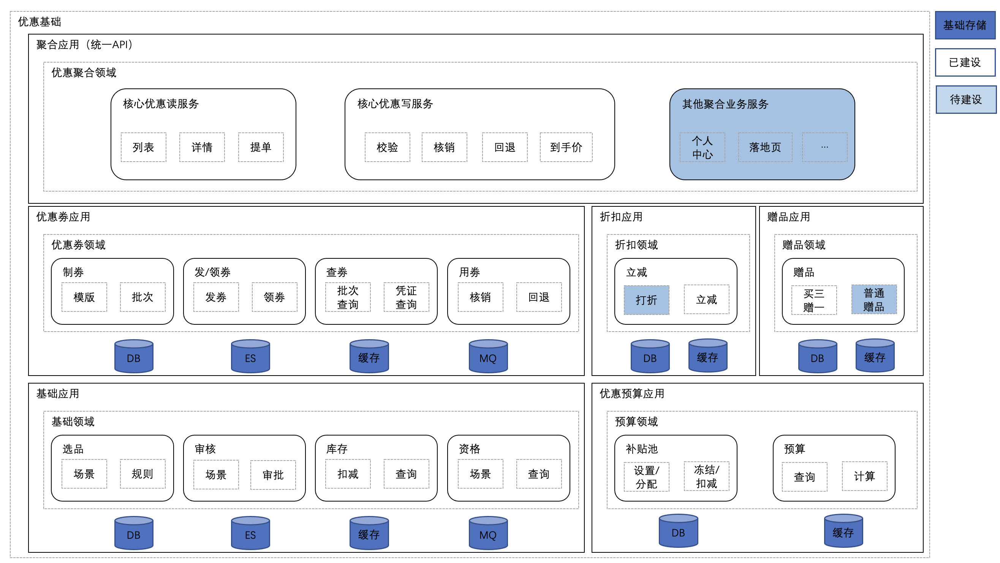

那么对应到库存系统，核心功能包括 **核销、回退、回滚、查询，B端功能包括库存设置功能** 。

### 2.2.2 非核心功能分析

以上核心功能，最重要的是核销功能，涉及到库存的扣减，结合用户的行为特点来考虑，一般库存扣减有两种时机：

- 提单扣减
- 支付扣减

一件商品有10个库存，现在有11个用户，每个用户计划同时购买1个

（1）提单扣减

10个用户可以提单成功，1个用户提示库存不足。

- 优点：用户体验好，系统逻辑简单；
- 缺点：会导致恶意下单或下单后却不买，使得真正有需求的用户无法购买，影响真实销量；

**解决办法：**

1. 设置订单有效时间，若订单创建成功N分钟不付款，则订单取消，库存回滚；
2. 限购，用各种条件来限制买家的购买件数，比如一个账号、一个ip，只能买一件；
3. 风控，从技术角度进行判断，屏蔽恶意账号，禁止恶意账号购买；

（2）支付扣减

11个用户可以提单成功，只有10个用户可以支付成功，1个用户支付失败。

- 优点：可以有效的避免无效订单；
- 缺点：用户体验不好，不及时付款可能会支付失败容易造成客诉；

**解决办法** ：

1. 增加提示信息：在商品详情页，订单步骤页面提示不及时付款，不能保证有库存等。

综合上述两种方案，第一种方案最多只会造成库存会被占用一定时间，较于另一种方案，更加合理，而且在数据库字段设计上更加简洁，只需要总库存，剩余库存和已售库存即可表示优惠维度的库存状态。

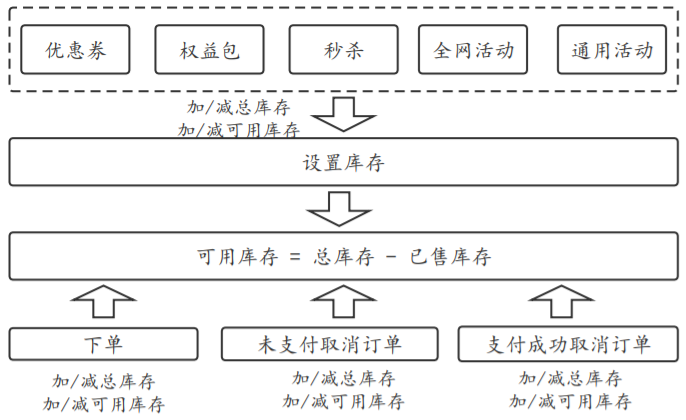

## 2.3 优惠库存系统高可用设计

库存系统设计的难点就在于高并发和超卖问题，下面将针对这两点从数据库设计、分布式事务解决方案、缓存设计（本地缓存和分布式缓存）、热点数据探测、紧急预案几个方面来对本系统进行探讨。

### 2.3.1 数据库设计

数据库设计需要考虑公司当前业务水平，无非是业务量小和业务量大两种情况。

#### 2.3.1.1 业务流量小时数据库设计

一般的库存扣减的逻辑十分简单，分为两步：  
第一步：插入一条操作流水记录（用来记录操作流水，通过业务流水号保证幂等）  
第二步：扣减库存，更新库存数量

数据库表也只需要一张流水表stock\_log和一张主表stock，放在同一个数据库中即可。

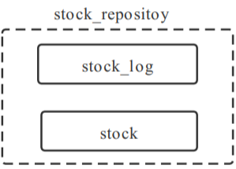

好处：事务操作简单，要么全部成功要么全部失败，适用于数据量较小，且流量不是很大的情况  
坏处：但当请求量增加后，数据库明显会成为瓶颈（数据量、数据库连接数、锁、服务器的cpu、磁盘IO、内存）

#### 2.3.1.2 业务流量大时数据库设计

当业务流量变大，数据库出现瓶颈不足以支撑当前的业务，首先想到的就是对数据进行分库分表；

分库分表分为垂直拆分和水平拆分，由于库存属性本身就比较纯粹，所以是对原本单库单表进行 **水平拆分** 。

在进行拆分时，需要结合业务场景来选择合适的分库分表路由键，保证库表数据均匀。

##### 分析：

优惠库存系统上游对接了多个上游，每个上游都有自己的业务维度，那么这个业务维度就可以抽象出来作为分库分表的路由键

##### 路由键设计细节：

| 场景 | 业务维度 |
| --- | --- |
| 优惠券 | batchId |
| 权益包 | benefitId |
| 活动 | selectionId+pid |
| ....... | ...... |

其中活动的业务维度有两个，该如何结合业务来选择路由键呢？

活动包括秒杀活动、全网活动、打折活动.....需要对这些活动下的商品进行库存设置，而商品的信息又是设置在选品中的，选品和活动是一一对应的关系。

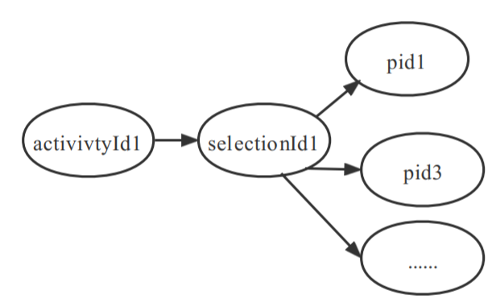

如果选择selectionId作为路由键，当该活动是个秒杀活动，这个选品就会是个热门选品，其对应的库表也会成为热点库表，那么和这个selectionId路由到同一个库的其他库存请求也会受到影响。

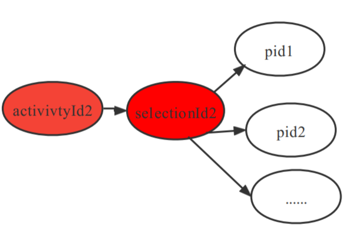

如果选择pid作为路由键，不同的selectionId里面配了相同的pid，就会产生冲突

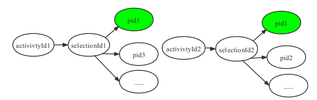

所以应该选择selectionId+pid进行复合组成路由键。

#### 2.3.1.3 设计再优化

目前优惠库存系统对接优惠券、权益包、选品（全网活动、秒杀、打折....）等上游，面对像优惠券、权益包这种数据量巨大的业务，随着时间的累计，数据量会快速累积，会影响其他业务的读写操作，所以在分库分表的基础上又根据不同的业务维度进行了表的拆分，最终分库分表结果是：8个库，每个业务维度又各自分了8个表，其结构图如下：

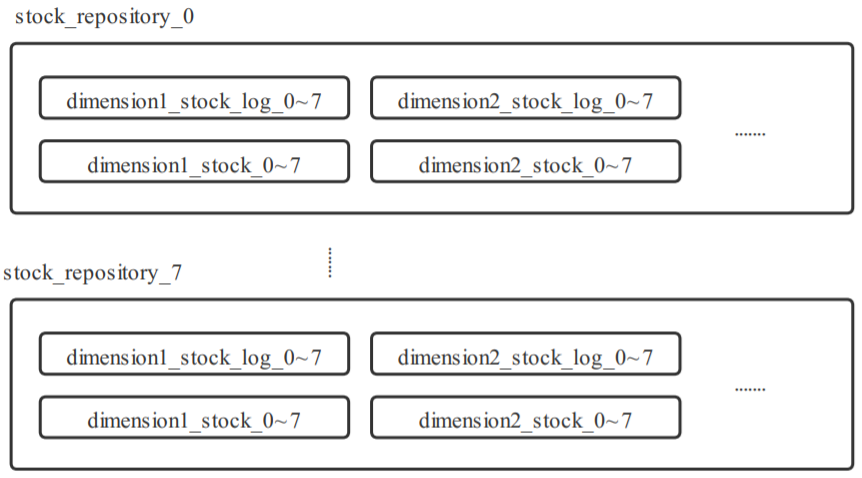

**好处** ：不同业务数据隔离，互相不会被影响，当数据量过大时，可把对应业务维度表中数据进行归档。

**坏处** ：当有新的业务接入，需要新建表结构，开发量较大，合理的设计模式可改善这个缺点。

#### 2.3.1.4 分库分表带来的问题和解决方案

##### 问题：

这里的分布式事务问题指的不仅仅是各个微服务之间分布式事务问题，库存作为调用链的最底层，承担不了事务管理者的角色，只能被动的给上游提供回滚接口，同时做好重试的幂等保护；

这里的分布式事务指的是库存服务和不同数据库之间事务管理，因为如果出现多个维度库存核销，不同维度被路由到不同库，那么每个请求都持有自己的数据库连接，事务之间是隔离的，所以这边的事务是 **跨数据库** 的分布式事务。

##### 解决方案（参考分布式事务原理与实践）：

对于分布式事务的解决方案大家都不陌生，常见的解决方案如下：

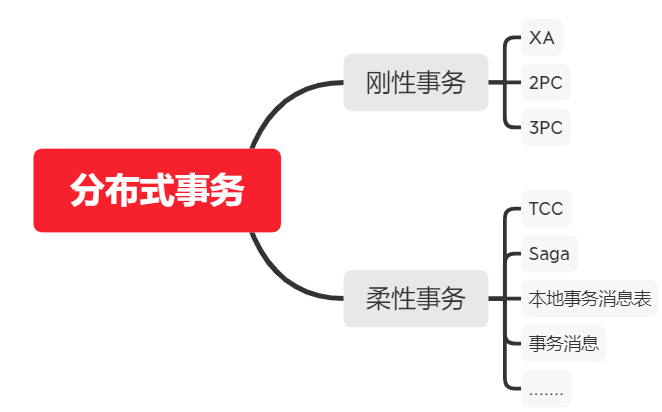

由于优惠库存系统是一个性能要求极高的系统，所以刚性事务这种锁定资源多且事务时间长的解决方案首先被排除。

由于是跨数据库分布式事务，数据库无法给应用发送异步消息，所以本地事务表和事务消息这两种可靠事件解决方案也被排除；

对于TCC和saga，其都是基于补偿的分布式事务解决方案，而saga的实现方式较TCC来说更为简单，所以选择saga作为分布式事务解决的方案。

##### saga模型

saga模型简单来说就是将一个长事务分解长一个个sub-transaction,每个sub-transaction都需要有业务的正向和逆向的实现，下面用下单支付扣减库存这个场景来说明不同的saga实现方式

saga实现方式可以通过 **事件驱动方式实现**

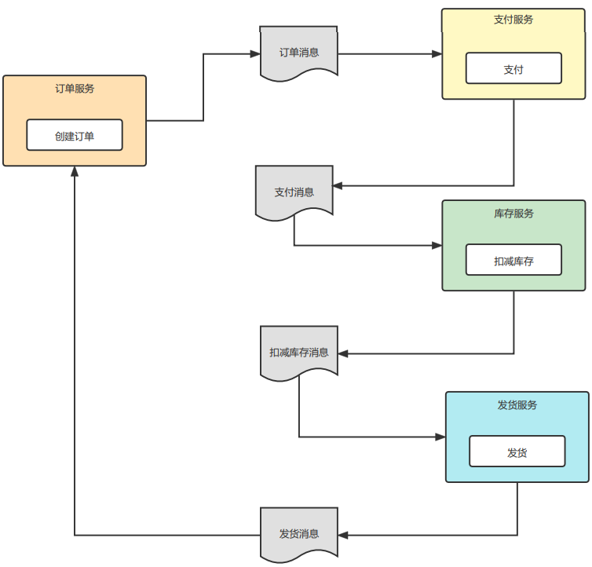

基于事件驱动的正向事务 基于事件驱动的补偿事务

或者 **流程编排实现** （也就是有个事务编排服务）

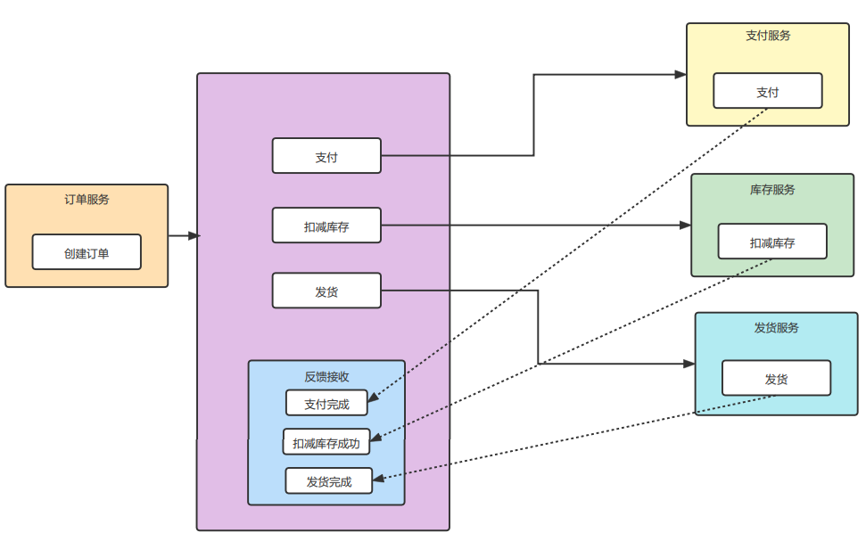

基于流程编排的正向事务 基于流程编排的补偿事务

拿批量核销接口来说，不同维度的库存扣减请求打在不同的数据库，每个请求持有自己的数据库连接（相当于子事务），只要有一个请求扣减失败了，主动补偿已经执行的正向事务，让整个大的事务回到最初的状态，上游可根据失败的状态码判断是否进行重试。

优惠库存选择流程编排的方式进行saga事务的实现，其原理如下：

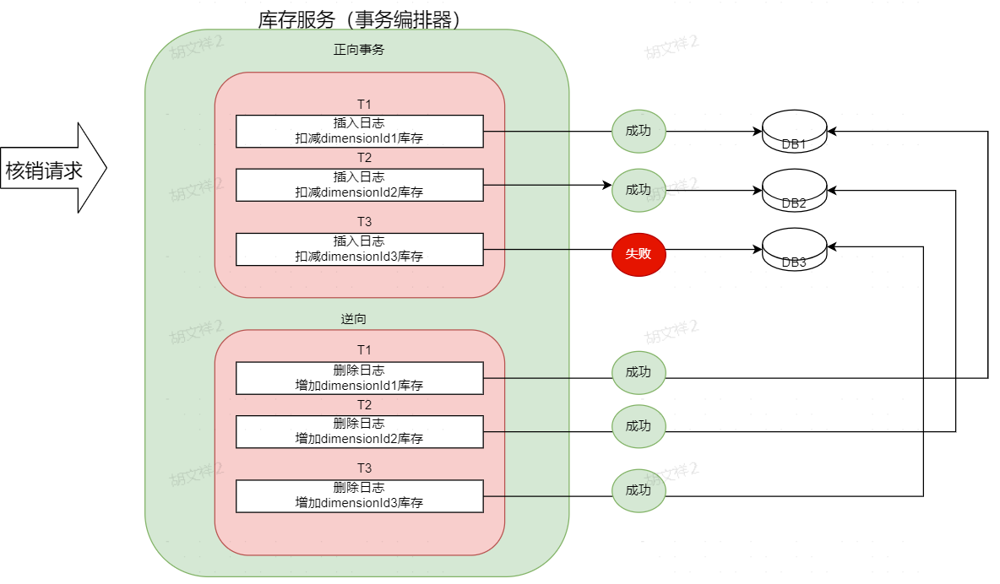

代码实现：

```java
/**
     * 
     * @param transactionContext 事务上下文
     * @param compensation 补偿操作
     * @param action 正向操作
     * @return 返回结果
     */
public<T> T execute(TransactionContext transactionContext, StockTransactionCompensation compensation, StockTransactionCallback<T> action) throwsStockTransactionException {
        booleanbeginTransactionSuccess = false;
        try{
            // 开启事务
            beginTransaction(transactionContext);
            beginTransactionSuccess = true;
            // 业务逻辑处理
            T result = action.doAction();
            // 事务成功处理
            handleTransactionSuccess(transactionContext);
            // 事务执行成功埋点
            logEvent(transactionContext.getTransType(), ".execute", PolarisConstants.MESSAGE_SUCCESS);
            returnresult;
        } catch(Throwable t) {
            // 事务执行失败埋点
            logEvent(transactionContext.getTransType(), ".execute", PolarisConstants.MESSAGE_ERROR);
            // 事务开启失败则不处理
            if(beginTransactionSuccess) {
                if(t instanceofBizException && BizErrorCodeExtEnum.REPEAT_OPERATION.equals(((BizException) t).getErrorCode())) {
                    log.info("流水号为{}事务已经存在，为重复操作，幂等异常",transactionContext.getOptNo());
                    handleTransactionFailure(transactionContext, null);
                    throw(BizException) t;
                }
                    // 事务失败处理
                    handleTransactionFailure(transactionContext, compensation);
            }
 
            // 异常封装
            if(t instanceofBizException) {
                throw(BizException) t;
            } else{
                thrownewStockTransactionException(BizErrorCodeEnum.SYSTEM_ERROR, t);
            }
        }
    }
```

##### 可能会出现的问题

幻读，因为正向逻辑是扣减库存，这时候来一个查询，查询的数量是n，然后批量扣减有一个维度库存不足，整体进行回滚，这个时候又来了一个查询，这个数量可能就变成了n+1。但这并不会影响整体业务逻辑。

#### 2.3.1.5 幂等和服务之间的事务控制设计

幂等性的实质是一次或多次请求同一个资源，其结果是相同的。其关注的是对资源产生的影响。当事务处理失败，底层服务必须要支持上游重试，所以要做好 **幂等保护** 和 **重试限制；**

项目中用saga作为跨数据库的分布式事务的方案，但是如果在进行补偿操作是发生了意外断电和服务器宕机，补偿操作失败，（补偿操作在理论上一定是会成功的）这个事务就永远回不去了，为了 **保证各个服务之间数据状态一致** ，还需要在此数据库设计的基础之上，加一张事务日志记录表，表中详细记录一次请求的详细信息，如操作方式、操作内容、重试次数以及事务状态，reqId作为幂等唯一键，其原理图如下所示。

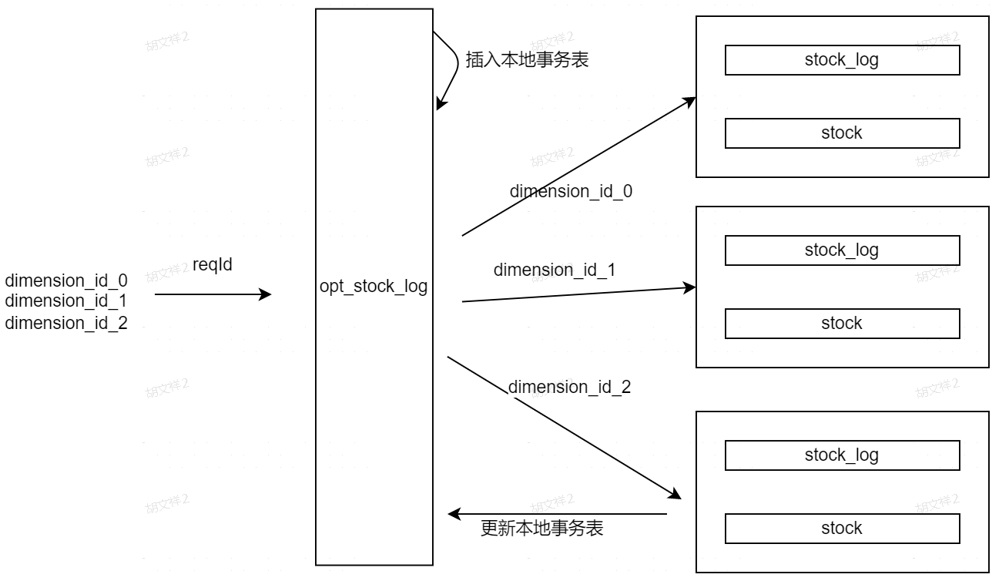

<table><colgroup><col> <col> <col></colgroup><thead><tr><th><p>事务1</p></th><th><p>事务2</p></th><th colspan="1"><p>事务3</p></th></tr></thead><tbody><tr><td colspan="1">开始</td><td colspan="1"></td><td colspan="1"></td></tr><tr><td>插入事务日志表，成功，事务标记未完成</td><td>开始</td><td colspan="1"></td></tr><tr><td>插入库存操作日志（第二层幂等）</td><td>插入事务日志表，幂等，失败，重试次数+1</td><td colspan="1"></td></tr><tr><td colspan="1">更新库存大小</td><td colspan="1">查询事务状态，未完成，重试失败</td><td colspan="1"></td></tr><tr><td colspan="1"></td><td colspan="1">结束</td><td colspan="1"></td></tr><tr><td colspan="1"></td><td colspan="1"></td><td colspan="1"></td></tr><tr><td>扣减完成，更新事务日志表，事务标记已完成</td><td></td><td colspan="1">开始</td></tr><tr><td colspan="1">结束</td><td colspan="1"></td><td colspan="1">插入事务日志表，幂等，失败，重试次数+1</td></tr><tr><td colspan="1"></td><td colspan="1"></td><td colspan="1">查询事务状态，已完成，更改事务为未完成</td></tr><tr><td colspan="1"></td><td colspan="1"></td><td colspan="1">插入库存操作日志（幂等，插入失败）</td></tr><tr><td colspan="1"></td><td colspan="1"></td><td colspan="1">更新事务日志表为已完成</td></tr><tr><td colspan="1"></td><td colspan="1"></td><td colspan="1">结束</td></tr></tbody></table>

如上表所示，事务1开始执行，先插入事务日志，状态未完成，然后插入库存操作日志，要是事务1此时阻塞，来了重试的事务2，对事务2来说事务1是还没完成，所以在插入事务日志表的时候失败了，当事务1执行完，重试事务3进行事务日志表，更新了重试次数，此时事务已经完成了，就把事务标记为未完成，再继续插入日志的时候会出现幂等，事务失败（但其实真正事务已经完成，只不过重试失败），将事务标记已完成。

## 2.3.2 缓存

解决了事务的问题，还需要考虑服务性能的问题，在双十一期间，库存服务写QPS最高1221，读QPS最高4603，纯靠数据库去抗肯定会出现问题，所以需要对优惠库存的读写分别做缓存设计。

### 2.3.2.1 读缓存

在高并发的场景下，数据库读库性能成为瓶颈，需要在DB和高并发的调用之间加上缓存。缓存所带来的性能提升效果更直接、高效。但是相比其他优化手段，缓存的使用并不是零成本的，任何系统使用缓存，都会遇到两大问题：

- 数据不一致问题
- 系统复杂度增加

保持数据一致需要系统耗费很大的性能，也会增加系统复杂度，而库存系统平时是一个读多写少的系统，对于库存数量实时性的重要程度不是很高，因为真正进行秒杀时，前一秒有的库存后一秒也会没了，真正库存判断的逻辑可以在库存核销时去完成。如果允许一定的延时，那么读接口缓存设计就会变得简单，重要的是对缓存组件进行选取。

##### 缓存设计

缓存分为分布式缓存和本地缓存。

- 分布式缓存

优点：多节点共享数据

缺点：分布式架构，存在网络开销

- 本地缓存

优点：就是快

缺点：多节点无法共享缓存，占用内存

考虑使用缓存，且能过容忍一定的缓存和数据库的数据不一致，那可以直接使用本地缓存来提升读的性能。

##### 本地缓存选择

Caffine是目前市面上一款高性能的本地缓存，Springboot已经开始用Caffeine取代了guava，下面是Caffeine的官方性能测试。

- 8个线程读，100%的读操作 8个线程写，100%的写操作

 

Caffeine之所这么快是因为Caffeine支持异步加载方式，相对于GuavaCache的同步方式，它不用阻塞等待数据的载入。另外，它的编程模型是友好的，省去了很多重复的工作。而且Caffeine是基于LRU和LFU的，结合了两者的优点，两者合体之后，变成了新的 `W-TinyLFU` 算法，它的命中率非常高，内存占用更加的小。

##### 数据流向

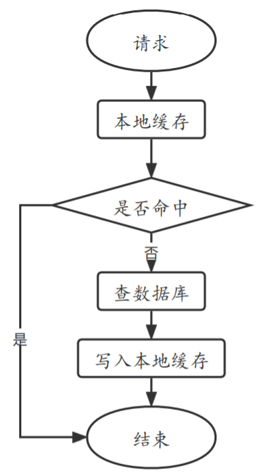

评价缓存设计好坏最重要的指标就是缓存命中率

缓存命中率=缓存命中数量/总请求数量，利用cat对缓存命中率进行监控

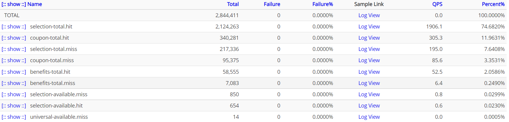

hit表示命中 miss表示未命中，可以看出，这个缓存命中率是非常高的。

### 2.3.2.2 写缓存

写缓存出现的目的是为预防写热点，热点的意思就是同一时间大量请求进入服务，去扣减同一个库中同一张表的同一行记录，那么分库分表的意义就不存在了，这个场景有秒杀、抢券。

大量热点请求一瞬打到数据库，由于打到的是同一个库，会把数据库连接池占满，除了CPU的压力之外，由于更新的是同一个表的同一行数据，会导致热点数据进行锁竞争，会把数据库打挂，最终导致大量请求会失效。

那么如何缓解热点数据这种情况呢，优惠库存在实践中经历了三个阶段：

- 阶段一：缓解数据库压力，在业务层加JVM锁，避免大量请求同时打到数据库（可承受1000QPS非热点库存扣减，但是承受不了100QPS的热点数据扣减）。
- 阶段二：利用热点探测+缓存机制，减少和数据库的交互次数（可适应热点扣减（递增上升），可承受800QPS的热点数据扣减）。
- 阶段三：库存预热+阶段二方案。如果数据在一瞬间变为热点，热点数据的预扣阶段会出现问题，所以目前只能先对缓存进行预热，对于突变的热点库存还没有有效的自动化防护措施。
- **以上数据未压测，是线上的峰值流量**

（1）阶段一

为了防止QPS飙升时，所有的请求都打到数据库，把数据库打挂，在本地加了本地锁，每个库存维度都会有自己的锁（这个锁用的是信号量Semaphore，这种锁可以保证一定的并发），也就是当并发量飙升的时候，该锁的存在可以保证打到数据库的某个维度核销请求数量是 并发度 \* 机器数量 ）

经线上验证，当同一个维度扣减QPS>100就会出现锁超时问题，对应的 **CaseStudy：** [20211031-优惠库存扣减超时导致领券失败](https://wiki.tuhu.cn/pages/viewpage.action?pageId=190365943) 锁超时的原因是由于在数据库进行热点数据更新的时候，会进行锁的争抢，造成频繁的上下文切换，更新操作耗时增加，导致在本地等待获取锁的线程等待超时。

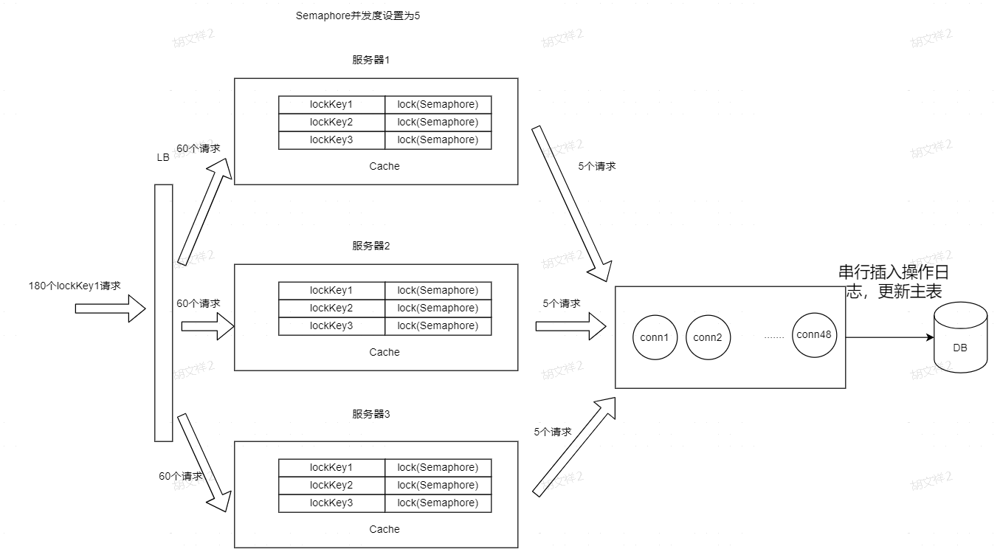

（2）阶段二

阶段一超时的原因是因为一秒内同一维度的库存扣减超过一定阈值了，比如200个，这200个请求就要排队和数据库交互200次，最终导致队尾的请求超时。

阶段二的解决方案首先是对QPS较大的维度数据进行热点探测，当某个维度QPS超过一定阈值时，首先将该维度库存标识为热点库存，然后将该维度的库存 **预扣一部分** 到redis中，后面的请求就都去扣减redis，减少了和数据库的交互。

##### 热点数据探测原理

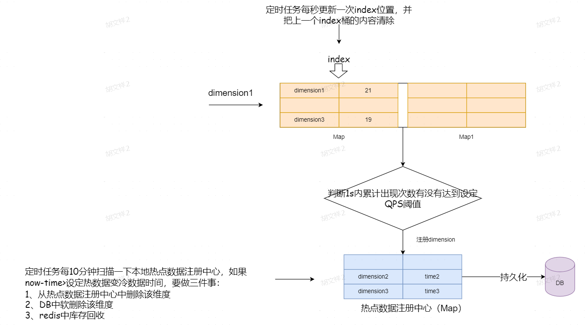

**算法组成组件：**

1、双桶计数器，每个桶的数据结构是一个Map，key是库存维度，value是该维度一秒内访问服务的次数。

2、热点数据注册中心：数据结构是一个Map，key是库存维度，value是该维度上一次成为热点数据的时间。

3、定时任务1：移动双桶下标，清除当前桶内数据，一秒钟执行一次。

4、定时任务2：热点数据降级，定时扫描热点数据注册中心所有数据，判断每个维度上一次成为热点数据的时间和现在时间差是否大于一定阈值，大于就进行热点数据降级。

**算法流程：**

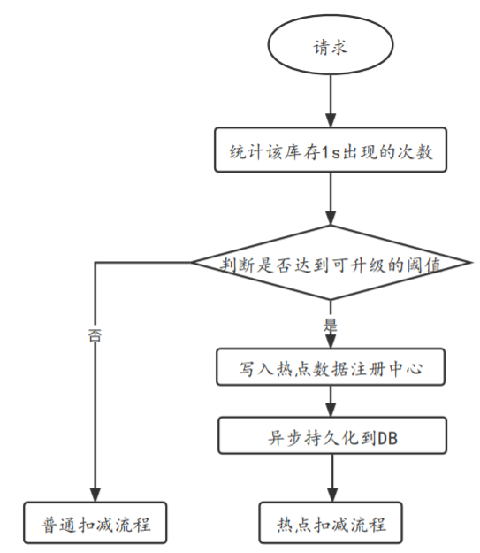

在每次请求进来核销的时候，会先对这个请求中的dimensionId进行计数，如果 **1s内统计的次数超过了热点数据阈值（QPS）（定时任务1）** ，就进行热点数据升级，如果 **某个维度在一段时间内没有再次成为热点数据（定时任务2）** ，就对其进行热点数据降级。

热点数据升级：将成为热点数据的维度dimensionId作为key，成为热点数据的时间作为value，1、存入本地热点数据注册中心 2、并且将记录持久化到DB。

热点数据降级：1、删除本地热点数据注册中心数据2、软删除DB数据 3、回收reids数据

##### 算法改进点：

改进点：热点数据注册中心是本地缓存，每台机器状态不一样，当出现冷热机器的情况，且redis中有数据，数据库没数据，就会造成一部分请求在原本有库存的情况下扣减失败

改进方法：替换热点数据注册中心为分布式缓存，利用分布式缓存去进行热点数据探测即可。

##### 热点扣减流程

### 2.3.3 紧急预案-缓存预热

为了解决缓存为空穿透到DB将DB打挂的风险，可以对商品进行预热，提前将商品数据加载到redis中，将请求直接拦截r，避免大量商品数据同时穿透DB，打挂DB。

那具体预热哪些商品？可以根据如下方法统计：

（1）问运营要即将上线的活动商品或者券id，将一些可能成为热点配置在apollo里，也就是手动注册热点数据，请求过来时直接走redis，避免和数据库交互

（2）上游打标识，标志该维度为热点库存，自动走热点扣减逻辑

（3）统计购物车收藏最多的商品或者浏览量比较大的商品

### 2.3.4 限流降级

**限流** ：在大促之前对各个类型的请求设置最高的QPS阈值，若高于设置的阈值则对该请求直接返回，不再调用后续资源。限流需要结合压测等，了解系统的最高水位，也是在实际开发中应用最多的一种稳定性保障手段。

**降级** ：降级是在服务器压力增加的情况下，进行一些有策略的处理，释放服务器资源，比如热点数据探测也算是一种降级策略，如果以后量更大，可能需要通过异步的方式去落日志DB，让系统快速返回响应。

### 2.3.5 加机器&&压测

在大活动之前，都要进行机器扩容和服务压测，压测出来的指标，也会作为我们设置限流值很重要的参考依据。但是目前公司大多数应用只支持压读接口，写接口涉及到线上数据，目前还不支持，希望公司明年可以完成写接口压测规划。

## 2.4 防超卖设计

超卖问题的出现就是高并发的场景下，如果没有做好并发控制，就会出现超卖，举个例子：

比如一件商品有100件，此时有10万个用户同时访问秒杀接口，当数据库还剩一件商品时，A用户和B用户同时进入接口，操作数据库，都做扣减库存操作（set sum=sum-1），由于数据库的行锁机制，A用户先获取到行锁，所以A用户获取后，库存应该为0（即当前库存-1）。A用户操作完后，释放行锁，B用户进行操作，库存变为-1（即当前库存-1），这很明显是不符合需求的。

### 2.4.1 常见方案

- 分布式锁
- 数据库悲观锁
- 数据库乐观锁

（1）分布式锁

此方案就像是阶段一的数据库扣减方案，只不过吧jvm锁换成了分布式锁，用分布式锁控制系统的并发度更低，但是系统的性能无疑上不去。

（2）数据库悲观锁

利用select for update 语句在数据库层面加排他锁，这种悲观锁创建出来明显会使系统并发度变低，所以也不会选择这种方式。

（3）数据库乐观锁

使用乐观锁就不需要借助数据库的锁机制了。

乐观锁实现主要就是两个步骤：冲突检测和数据更新。其实现方式有一种比较典型的就是 **Compare and Swap(CAS)技术** 。

CAS是项乐观锁技术，当多个线程尝试使用CAS同时更新同一个变量时，只有其中一个线程能更新变量的值，而其它线程都失败， **失败的线程并不会被挂起，而是被告知这次竞争中失败，并可以再次尝试。**

扣减库存问题，通过乐观锁可以实现如下：

```sql
//查询出商品库存信息，quantity = 3
selectquantity fromitems whereid=1
//修改商品库存为2
updateitems setquantity=2 whereid=1 andquantity = 3;
```

在更新之前，先查询一下库存表中当前库存数（quantity），然后在做update的时候，以库存数作为一个修改条件。当我们提交更新的时候，判断数据库表对应记录的当前库存数与第一次取出来的库存数进行比对，如果数据库表当前库存数与第一次取出来的库存数相等，则予以更新，否则认为是过期数据。

但是以上更新语句存在 **ABA问题。** 有一个比较好的办法可以解决ABA问题，那就是通过一个单独的可以顺序递增的version字段。改为以下方式即可：

```sql
//查询出商品信息，version = 1
selectversion fromitems whereid=1
//修改商品库存为2
updateitems setquantity=2,version = 3 whereid=1 andversion = 2;
```

乐观锁每次在执行数据的修改操作时，都会带上一个版本号，一旦版本号和数据的版本号一致就可以执行修改操作并对版本号执行+1操作，否则就执行失败。因为每次操作的版本号都会随之增加，所以不会出现ABA问题，因为版本号只会增加不会减少。

以上SQL其实还是有一定的问题的，就是 **一旦高并发的时候，就只有一个线程可以修改成功，那么就会存在大量的失败。**

库存系统有着天然高并发的属性，总让用户感知到失败显然是不合理的。所以，还是要想办法 **减小乐观锁的粒度** 的。

最终版本如下：

```sql
//修改商品库存
updateitem 
setquantity=quantity - 1 
whereid = 1 andquantity - 1 > 0
```

以上SQL语句中，如果用户下单数为1，则通过 `quantity - 1 > 0` 的方式进行乐观锁控制。

以上update语句，在执行过程中，会在一次原子操作中自己查询一遍quantity的值，并将其扣减掉1。

### 2.4.2 数据库设计

这边主要介绍库存主表设计，建表语句为

```sql
CREATETABLE\`coupon_stock\` (
  \`id\` bigint(20) NOTNULLAUTO_INCREMENT COMMENT '主键',
  \`coupon_batch_id\` varchar(32) NOTNULLDEFAULT''COMMENT '优惠券ID',
  \`stock_status\` tinyint(4) NOTNULLDEFAULT'0'COMMENT '库存状态自定义枚举：0-有效1-无效',
  \`total_stock\` int(10) unsigned NOTNULLDEFAULT'0'COMMENT '总库存',
  \`available_stock\` int(10) unsigned NOTNULLDEFAULT'0'COMMENT '可售库存',
  \`blocked_stock\` int(10) unsigned NOTNULLDEFAULT'0'COMMENT '冻结库存',
  \`sold_stock\` int(10) unsigned NOTNULLDEFAULT'0'COMMENT '已售库存',
  \`create_time\` datetime NOTNULLDEFAULTCURRENT_TIMESTAMPCOMMENT '创建时间',
  \`update_time\` datetime NOTNULLDEFAULTCURRENT_TIMESTAMPONUPDATECURRENT_TIMESTAMPCOMMENT '修改时间',
  \`is_delete\` tinyint(4) NOTNULLDEFAULT'0'COMMENT '删除标志：0：否；1：是；',
  PRIMARYKEY(\`id\`),
  UNIQUEKEY\`ux_coupon_batch_id\` (\`coupon_batch_id\`)
) ENGINE=InnoDB AUTO_INCREMENT=353 DEFAULTCHARSET=utf8mb4 COMMENT='优惠券库存表';
```

其中用即将更新的数量quantity和剩余数量available\_stock进行对比，增加乐观锁粒度，sql语句如下

```sql
updatecoupon_stock
setavailable_stock = available_stock - #{optStock},sold_stock = sold_stock + #{optStock}
wherecoupon_batch_id = '*****'
andavailable_stock >= #{optStock}
```

## 3 总结

## 3.1 cat性能报告

## 3.2 承接上游

承接上游98个权益包，6372个优惠券批次，98125个选品，抗住最高写QPS1221，读QPS4603  
两个caseStudy：  
[20211031-优惠库存扣减超时导致领券失败](https://wiki.tuhu.cn/pages/viewpage.action?pageId=190365943)  
[2021110-优惠库存超扣以及库存超时问题总结](https://wiki.tuhu.cn/pages/viewpage.action?pageId=193156967)

## 3.3 本文小结

本篇文章第一小节介绍了优惠库存系统出现的背景，第二小节主要分析了优惠库存系统的核心功能，然后从高并发角度切入，详细介绍了如何设计数据库、缓存、热点探测的实现保证系统性能，简单介绍了怎么做去保障系统的高可用，最后从防超卖的角度出发，介绍了防超卖的解决方案以及本系统是如何去设计的。

## 4、参考文章

1、 [秒杀系统设计思路和实现方法](https://blog.csdn.net/bigtree_3721/article/details/72760538?spm=1001.2101.3001.6650.11&utm_medium=distribute.pc_relevant.none-task-blog-2%7Edefault%7EOPENSEARCH%7Edefault-11.no_search_link&depth_1-utm_source=distribute.pc_relevant.none-task-blog-2%7Edefault%7EOPENSEARCH%7Edefault-11.no_search_link&utm_relevant_index=20)

2、 [分布式事务原理及解决方案](https://blog.csdn.net/qq_36142146/article/details/85247960)

3、 [缓存架构设计](https://blog.csdn.net/zjttlance/article/details/80234341)

4、 [本地缓存高性能之王Caffeine](https://zhuanlan.zhihu.com/p/142667371)

5、 [百万级QPS，支撑淘宝双11需要哪些技术](https://blog.csdn.net/v123411739/article/details/120935591?spm=1001.2014.3001.5501)