[转至元数据结尾](#page-metadata-end) [转至元数据起始](#page-metadata-start)

## 一、引言

### 营销活动页概念

活动页搭建是一种支持企业快速创建和管理网页的工具，广泛应用于电商、营销、内容展示和活动推广等场景。相比传统网页开发流程，活动页搭建具有可视化编辑和模块化组件两大核心特点。通过所见即所得的编辑模式，用户可以直接调整文本、图片、按钮、表单等页面元素的位置、样式和内容，并实时预览效果，直观高效；同时，平台内置轮播图、商品展示、倒计时、优惠券等多种模块，用户可通过拖拽和配置自由组合，满足多样化需求，让非技术人员也能快速构建网页。活动页搭建的主要优势在于显著提升搭建效率和降低技术依赖与开发成本。传统开发需要经过UI设计、前端开发和后端调试等复杂流程，而活动页搭建工具让运营或设计人员自行完成页面制作，显著缩短开发周期；同时，非技术人员可直接使用工具，减少对技术团队的依赖，研发团队仅需一次性投入开发即可多次复用组件，提高资源利用率。该工具特别适用于大促活动、节日营销等需要快速上线的场景，帮助企业在短时间内完成页面制作，增强市场响应速度并提升业务灵活性。

为直观展示活动页的应用场景，行业内常见的活动页面类型包括：电商促销页（如双十一、618等大促活动，用于商品展示和促销转化）、品牌营销页（用于新品发布和品牌宣传，提升曝光和互动）、内容展示页（用于专题内容推广，简洁直观地呈现信息），以及节日祝福页（如新年贺卡、圣诞活动等，增强互动性和传播力）。这些页面充分体现了活动页搭建工具在电商、营销和内容传播中的高效与灵活，下图是行业内场景的一些活动页面视觉：

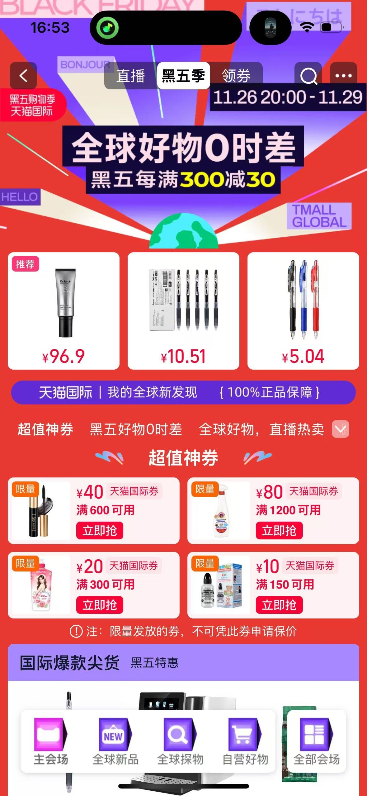  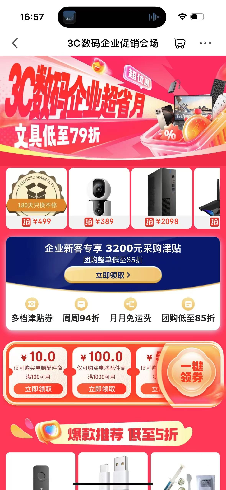 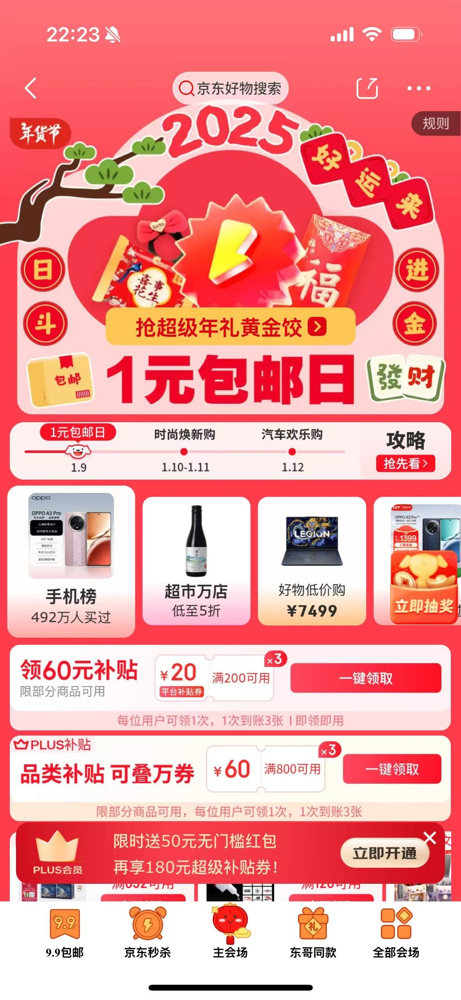 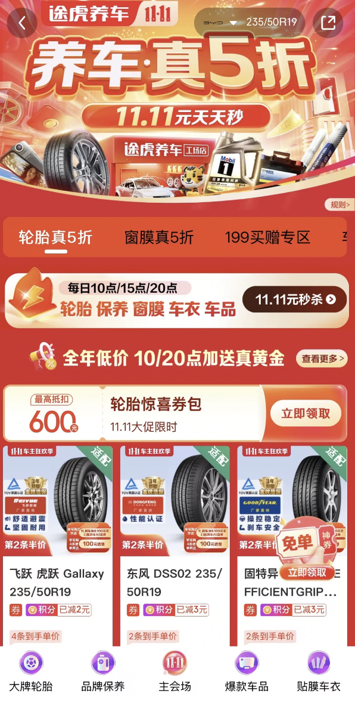 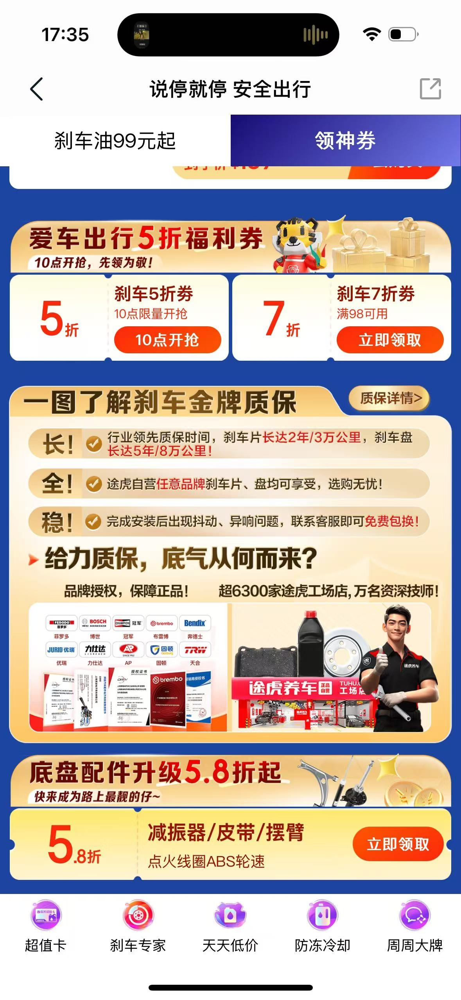

淘宝日常活动页 淘宝品牌活动页 京东日常活动页 京东日常活动页 途虎养双11主会场活动页 途虎养日常活动页

营销活动页的业务流程根据目标用户的不同，主要分为TOB（面向企业）和TOC（面向个人消费者）两部分。

**TOB活动页** 主要服务于企业客户，旨在为企业提供高效的活动页面设计与管理解决方案。通过支持内容编辑和内置多种预设组件（如头图、领券、抽奖、商品展示等），企业运营人员可以快速搭建适配不同场景的营销活动页面（如抢购活动、品牌推广、大促活动等）。此外，TOB活动页还集成了数据分析功能，便于实时监控活动的点击量、转化率等关键指标，帮助业务人员基于数据动态调整策略，持续优化活动效果。这种模式降低了企业对技术资源的依赖，提升了活动运营的效率和灵活性。

**TOC活动页** 则面向个人消费者，重点是吸引用户参与并实现转化。作为消费者在移动端接触的活动页面，其核心目标是通过 **清晰的信息展示** （确保用户快速理解活动内容、优惠信息和参与方式）、 **优化的视觉体验** （通过美化展示、动效、视频等元素提升用户的停留时间和体验感）、以及 **增强的互动交互功能** （如秒杀、抽奖、分享等，增加用户参与感并鼓励用户传播活动），提升整体用户参与度和活动的传播效果。这种设计不仅增加了用户的粘性，还有效促进了消费行为的发生和品牌的社交化传播。

## 二、面临的问题挑战

通过上述介绍，我们可以将营销活动页面临的技术挑战更详细地分类为以下几个方面：

1. **需求多样性与频繁变更** ：营销活动页面需要支撑公司多条业务线（如轮胎、保养、车品、平台、新能源等）相关的需求，涉及20+不同的业务团队。在不同的业务场景中，每个团队可能会有自己独特的需求和个性化差异，这就要求活动页具备较强的适应性和灵活性。此外，营销活动往往受到市场变化、竞争动态以及策略调整的影响，导致活动页面的需求频繁变更。这种需求的高频次波动不仅增加了开发的复杂度，还使得项目管理面临更大的压力，尤其是在有严格上线时间要求的情况下，如何在技术开发与业务需求之间找到平衡，确保活动页能够高效、快速且高质量地上线，成为技术团队必须解决的一个难题。
2. **页面性能与快速加载** ：活动页面支撑40+种不同的活动玩法组件，并且这些组件通常依赖15+不同的业务系统来提供数据和服务。例如，在双11、618等大促期间，主会场页面通常需要承载150+个在线组件，这些组件包括商品展示、倒计时、领券、秒杀等功能模块。如何在如此庞大的组件量下，确保页面加载快速且不影响用户体验，是技术团队面临的一项核心挑战。这不仅仅涉及前端页面的优化，还需要后端系统的高效支持，以保证即使在大流量的压力下，页面能够迅速响应用户请求、稳定运行并呈现清晰、流畅的内容。
3. **高流量与稳定性保障** ：在日常运营中，活动页面的在线投放量常常超过1000个，且这些页面分布在APP站内、站外以及多个主链路业务场景中，其中曝光流量占全站流量的40%左右。特别是在双11、618等大促期间，这些页面作为重要的流量入口，会承接大量的用户访问和互动。因此，如何确保活动页面能够正常展示，且在流量激增时保持高可用性和稳定性，是技术团队的重要任务。面对这些高并发的流量，开发团队需要提前对系统进行压力测试和容量规划，确保服务器能够处理峰值流量，并且能够快速响应，防止由于流量过载导致系统崩溃或页面加载缓慢。
4. **高并发与系统联动** ：在双11等大促期间，整点秒杀等业务场景会引发全站用户的集中访问。通过APP推送、短信、公众号等渠道，用户被引导到特定的活动页面，导致大量用户在固定的时间点同时进入页面。这时，如何保障瞬时流量不至于对系统产生过大冲击，如何确保活动页能顺利承载这些并发流量并呈现给用户，成为关键问题。这个挑战不仅仅是高并发技术问题，更涉及整个系统架构和服务的协调。例如，除了活动页面本身的流量压力，还需要考虑与活动页相关的下游服务的流量，如商品数据服务、优惠券系统、活动系统等，这些服务的稳定性直接影响着整个业务的顺利运行。因此，如何设计一个高效的系统架构，保证在高并发的情况下各个环节能够顺畅协作，确保整个业务链路的稳定性和用户体验，是一个极具挑战性的任务。

上面提到的常见业务诉求和问题，并非单一的技术场景（如高并发、分布式事务等），很多时候都需要在局限的业务条件下寻求最优的解决方案。结合业务的特点，可以归纳出以下技术挑战和要求：

1. **营销业务理解与抽象** ：营销业务的模式丰富且时效性强，涉及多个场景和快速变化的业务需求。无论是线上电商平台、线下商场，还是社交媒体等，营销活动玩法都可能在不同场景中展开。此外，业务策略根据节奏（如传统节日或时事热点）可能会灵活调整，这要求技术团队在业务理解和架构设计上具备高度的灵活性。核心技术要求是能够快速响应和实现业务创意，在短时间内交付解决方案。因此，技术架构必须在稳定的基础上具备良好的扩展性，以便应对变化。
2. **高可用性** ：营销活动通常具有爆发性，特别是在如双11、618等大促期间，活动页面可能遭遇极大流量波动，超出正常的访问量。由于营销活动本身关注度极高，一旦出现问题，可能会造成巨大的负面影响。因此，确保高可用性成为技术的关键挑战。系统必须能够在高负载、高并发的情况下保持稳定性，避免因流量激增或其他突发情况导致系统宕机或响应慢

## 三、我们的解决方案

### 3.1 业务高效支撑

针对业务复杂性和迭代效率的要求，平台化架构在系统建设中起到了关键作用。业界平台系统通常通过领域模型标准化和业务流程的抽象，结合流程编排，实现了70%~80%的系统功能复用。这种架构设计不仅能够显著提升开发效率，还能确保系统具有较强的灵活性和扩展性，从而应对多变的业务需求。此外，通过扩展单一能力点来提高迭代效率，架构可以快速响应业务的变化和优化需求，支持不断迭代和快速交付。

在页面搭建系统设计中，除了复用营销通用领域模型外，还融入了差异化的抽象思路，突破了传统页面设计的固有思维局限。将页面设计转化为元素概念，制定了元素协议与规范，研发团队通过配置元素快速组装不同的业务组件，而这些业务组件再通过组合形成完整的页面。这种设计方法不仅提升了页面搭建的灵活性，还大大缩短了开发周期，提高了迭代速度。此外，系统还初步构建了开放共建能力，将元数据管理能力开放给不同技术团队，推动系统的共同建设。这种开放式架构不仅增强了团队之间的协作，还能有效提升平台的可维护性和可扩展性。未来，随着技术的进一步发展，系统将能够更好地支持多业务场景，帮助公司应对各种营销活动和业务挑战。接下来将详细介绍系统整体架构和页面元素抽象实现的过程。

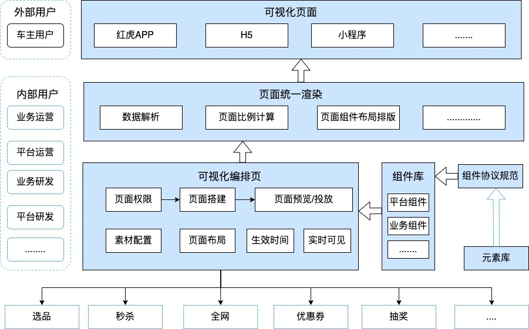

**活动页系统能力架构图**

整体系统能力架构设计框架图展示了系统的主要构成，重点强调了可视化编排页面的功能，这一部分主要面向内部业务运营人员，帮助他们通过直观的操作界面快速进行页面搭建。页面设计包含多个方面，如页面基础信息、组件实例、组件数据、以及组件楼层排版等，这些构成要素可以灵活调整和组合，以适应不同的业务需求和营销场景。在这一架构中，元素库由研发人员负责进行沉淀和定义，确保能够高效管理和更新页面元素。组件协议规范则通过JSON-Schema约定来定义组件的数据结构，这不仅包括数据的类型，还涉及数据的约束、格式等多个方面。使用JSON-Schema可以在创建组件时对基础组件数据的结构进行详细规定，从而确保数据的一致性和有效性。这种方式能有效减少错误，提高开发和维护效率，并增强系统的可靠性和可扩展性，确保不同业务团队可以灵活且高效地创建和管理各种营销活动页面。

**去产品化基础能力抽象，通过自定义配置，提高研发开发效率**

**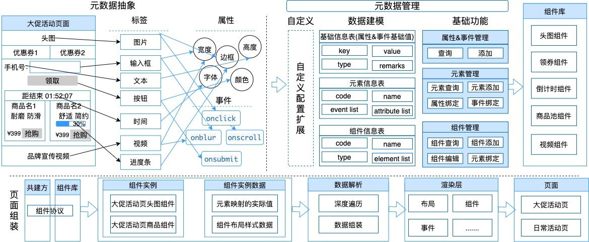**

**页面元素抽象过程**

**元数据抽象** ：将页面内容解析为HTML的 `<form>` 标签，每个标签作为页面组装的核心元素，标签的展示样式（如高度、宽度、颜色等）定义为元素属性，标签的行为和交互动作则抽象为元素事件。通过这种方式，页面的所有元素都被系统化和标准化，便于统一管理和高效复用。同时，元素的属性和事件可以根据不同的业务需求进行动态配置，提升了页面组装的灵活性和可操作性。

**元数据管理** ：主要面向研发人员，要求前置定义和维护基础元素信息（每个元素由多个属性和事件组合生成）。当有新业务组件需求时，可以结合实际场景，利用已有的元素池来组装成新的组件。这一过程不仅提升了开发效率，还能确保不同业务需求在同一平台上得到统一管理和实现，减少了重复开发的工作量。

**组件库** ：主要面向业务人员使用，其中包含多个元素，按照JSON-Schema约定协议沉淀成可复用的业务组件。无业务逻辑的基础组件（如头图、视频、图片链接、悬浮窗等）可以通过零代码配置来实现，而需要定制化交互和业务逻辑的组件（如抽奖、领券、商品池等）则需结合实际业务需求进行开发。这些组件可以根据不同的营销活动页需求进行灵活组合，大大减少了业务人员对技术的依赖，提高了活动页面搭建的效率。

**页面组装** ：业务运营人员可以基于已有的组件库，通过自由拖拽方式将组件实例放入页面，从而完成该页面的搭建，并根据需要调整数据和内容，快速生成符合需求的活动页面。这个过程实现了页面搭建的可视化，非技术人员也能在无代码的环境中完成页面设计和调整，极大提高了工作效率和灵活性。同时，组件的复用性确保了页面的一致性和稳定性，减少了重复工作和错误的发生。

**组件抽象后研发支撑效率差异**

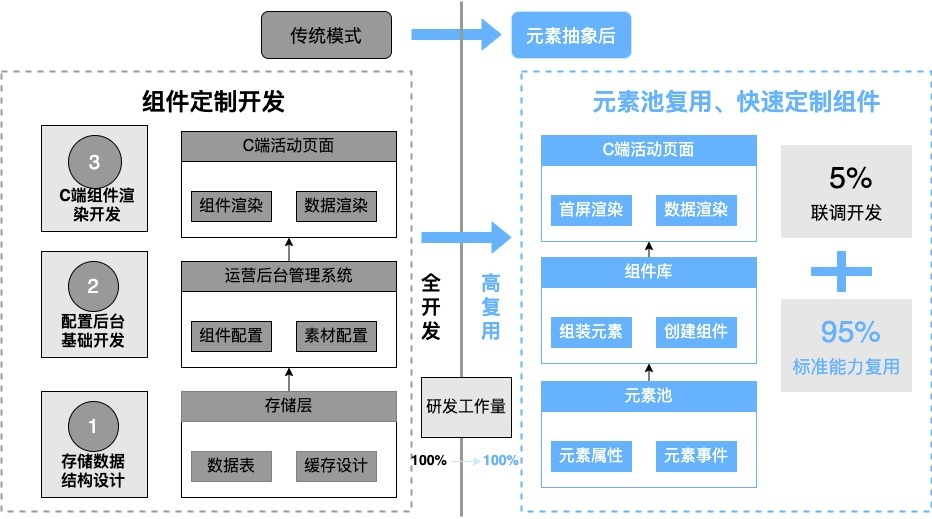

组件抽象的愿景是通过最大化技术和业务能力的复用，快速构建通用的业务组件，并结合定制化开发满足各类个性化业务需求，从而加速新组件和新页面的搭建过程。在传统开发模式下，垂直业务组件的建设通常涉及多个繁琐的步骤，包括需求提报、匹配研发资源、开发后台管理系统、开发业务页面渲染服务、开发各端前端程序等，每个步骤都需要大量的时间和精力，同时还要面对海量流量、性能优化、安全性等非功能性需求，这使得研发支撑效率较低，交付周期长，难以快速响应业务需求。

通过引入元素池抽象模型，系统将大量的通用页面元素进行标准化和复用，业务开发者不再需要重复开发常见的组件。通过元素池，开发者能够快速构建业务所需的通用页面组件，并通过元素事件绑定来满足特定的业务个性化需求。这种模式不仅提高了组件的复用性和灵活性，还使得业务团队可以在没有技术团队深度介入的情况下，快速搭建和调整页面，满足不同业务场景的需求。

结果是，开发者的工作负担大幅减少，他们不再需要从零开始开发和维护所有功能，而是能够专注于处理5%的联调验证工作。通过这种方式，响应速度大幅提升，新的业务组件和页面可以在短时间内上线，确保公司能够快速适应市场变化和业务需求。总的来说，组件抽象为技术团队和业务团队之间搭建了一座桥梁，提高了整体研发效率，降低了开发成本，并加快了业务的创新和市场响应速度。

**开放组件管理，通过标准化接入流程与业务线研发共同建设页面，提升业务支持效率**

**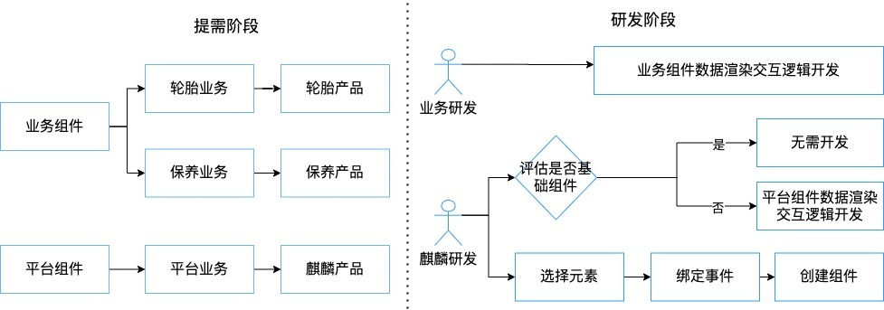**

活动页系统面向全公司业务团队，建设初期每月需求量超过20项，涵盖不同业务线的各类玩法定制需求。由于系统后端研发支持仅有一名开发人员，面对繁重的需求和有限的技术资源，系统的开发和维护面临一定的挑战。为了提升业务支撑效率，初步的建设思路是将元素池与组件创建能力进行初步开放，与各业务研发团队共同建设页面搭建系统。通过开放共享元素池，业务研发团队能够在已有的元素基础上快速构建符合需求页面组件，从而减少了重复开发的工作量，缩短了开发周期。此外，开放页面搭建系统的能力，也使得业务研发团队能够在更大程度上自主进行组件建设，提升了业务研发团队的响应速度和自主性。整体而言，这种协作模式不仅提升了技术团队的效率，还增强了各业务研发团队的灵活性和工作效率，从而更好地支撑公司整体业务需求。  
  
**组件定义：** 在营销活动页的开发和维护过程中，组件的使用者涉及多个不同的角色，包括平台运营、用户运营、以及各业务线的运营团队等。因此，我们将组件分为两大类：平台组件和业务组件。平台组件通常由营销研发团队负责统一维护和迭代，适用于多个业务场景，具有较强的通用性和灵活性。这类组件通常涵盖通用功能，如轮播图、倒计时、商品展示等，能够满足不同业务需求，且易于快速部署和调整。而对于那些由特定业务团队使用的组件，我们则会将它们归类为业务组件。这类组件通常在逻辑上有较多定制化需求，针对具体的业务场景进行开发和维护。例如，保养超值卡商品组件，其数据来源主要为保养业务专场配置等，且交互展示和样式会根据具体业务的需求有所不同；再如内容组播组件，其数据来源可能来自不同的直播房间，每个直播房间的数据展示和交互方式也可能有所差异。这些组件不仅需要依据不同的业务需求进行渲染和交互设计，还要确保与具体的业务流程和数据源的有效衔接。通过这种区分和管理方式，平台组件可以在不同业务间高效复用，而业务组件则能根据各自业务的独特需求进行定制化开发和迭代，从而最大程度上提高系统的灵活性和响应能力。

**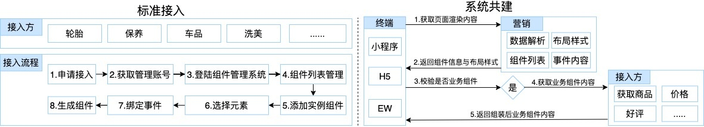**

为了高效支持各业务组件的建设，我们初步建立了一套 **标准化接入流程** 。通过这一流程，各业务团队可以方便地通过组件库管理，自行结合业务场景生成定制化的业务组件。这一标准化流程旨在简化和规范化组件的接入方式，减少重复开发，提高效率。需要注意的是，由于元数据管理和组件接入管理的改动频率相对较低，考虑到开发成本，当前这些流程的相关数据由开发人员手动维护，尚未开发后台管理系统。随着系统的扩展和需求的增加，未来可能会考虑自动化处理这些流程，以进一步提升效率和降低人为错误。

在 **系统共建** 方面，营销系统负责输出页面的整体布局样式以及基础组件，而业务组件的内容则由各业务团队根据实际需求进行自由组装。每个业务研发团队可以根据自己业务场景的需求，灵活选择合适的组件进行组合和定制。这种方式不仅能够保证各业务场景的独特性，还能确保系统的一致性和可维护性。此外，所有的组件都基于统一的设计规范和技术架构，便于后续的扩展和优化，从而提升整体系统的灵活性和可扩展性。

**组件及页面搭建流程图：**

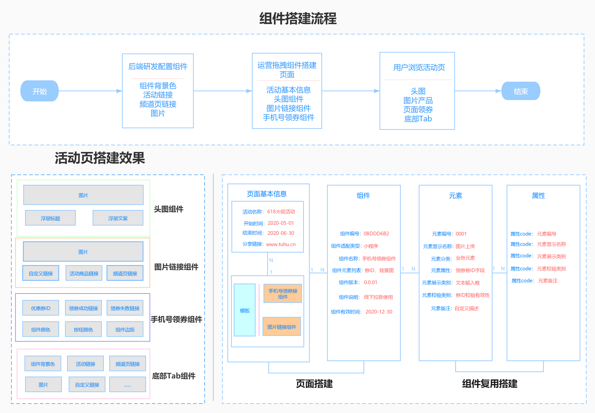

### 3.2 多组件活动页的加载思路

流畅的页面加载体验对于提升用户对品牌的信任感和好感度至关重要，这不仅能增加用户粘性，还能够推动转化和复购。现代用户的耐性较低，尤其在面对复杂页面时，如果页面加载超过3秒，约53%的用户会选择放弃访问。Amazon的测试数据显示，页面每延迟100毫秒，其销售额就可能下降1%。因此，优化页面加载速度已成为提升用户体验和销售转化的重要环节。在大型营销活动页面中，尤其是资源密集、内容复杂的场景，例如双11或618大促页面，这些页面可能包含150个以上的组件。如果采取一次性加载所有内容的方法，可能会导致加载时间过长，甚至因网络中断或服务器压力过大导致加载失败，从而增加页面崩溃的风险。这不仅让用户的访问体验变差，还可能导致他们选择放弃，降低活动页面的整体转化率。

为了应对这一挑战，结合公司业务特点以及行业内的最佳实践，我们最终选择了分屏加载方案。该方案的核心思想是按需加载页面内容，首屏内容优先展示，这样用户可以迅速看到活动的亮点或优惠详情，减少等待时间，提升用户的参与感和满意度。次屏内容逐步加载，确保页面响应更加流畅，避免因一次性加载大量内容而造成的页面卡顿。通过这种方式，页面加载不仅更快，用户体验更加顺畅，同时也能有效降低用户流失率。此外，分屏加载能够减轻服务器的压力，并减少用户设备的带宽消耗。尤其是在大流量瞬时活动中，这一方案能够显著减少服务峰值流量的冲击，有效降低服务器的负担和资源消耗，确保活动页面在高流量情况下依然能够平稳运行。这种优化方案既提升了用户体验，也增强了系统的稳定性和可扩展性，为活动期间的高效运作提供了有力保障。

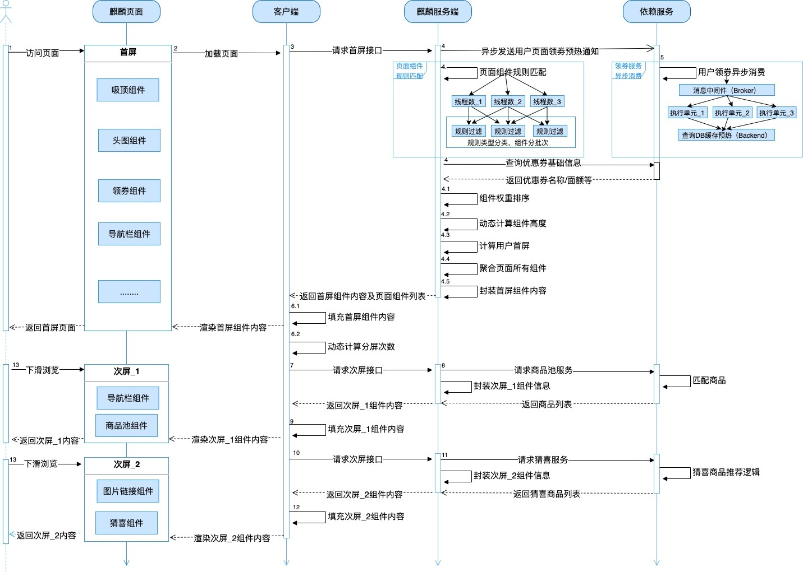

### 3.3 页面稳定性保障措施

在在大促活动页面中，高并发读的场景是一个关键技术挑战，尤其是在大促会场页面中。这类页面通常会面对大量的用户访问，流量呈现尖刺型波动，某些时段的访问量可能会比其他时段高出十几倍，给系统带来巨大的压力。在这种情况下，如何确保页面在高峰流量时能够稳定运行，是系统设计的重点。为了解决这一问题，系统采用了流量管理机制，通过限流保护策略，在流量达到设定阈值时自动进行调节，从而有效减缓流量冲击带来的压力。限流策略的实施可以避免系统因瞬时流量暴增而崩溃，确保用户访问页面时的流畅体验。此外，为了应对最极端的情况，系统还设置了兜底机制。即使整个系统出现大规模故障或宕机，兜底机制仍能保证部分核心业务的基本运行。通过对关键请求的降级处理和流量分配，系统能够在流量冲击期间保护核心业务的稳定性，确保用户的基本需求能够得到满足，同时为系统恢复争取时间，降低流量对整体业务的影响。这样一来，不仅提升了系统的可靠性，还确保了高并发情况下活动页面能够稳定运作，为用户提供更好的访问体验

**大促期间（ 618/双11）稳定性保障全流程：**

**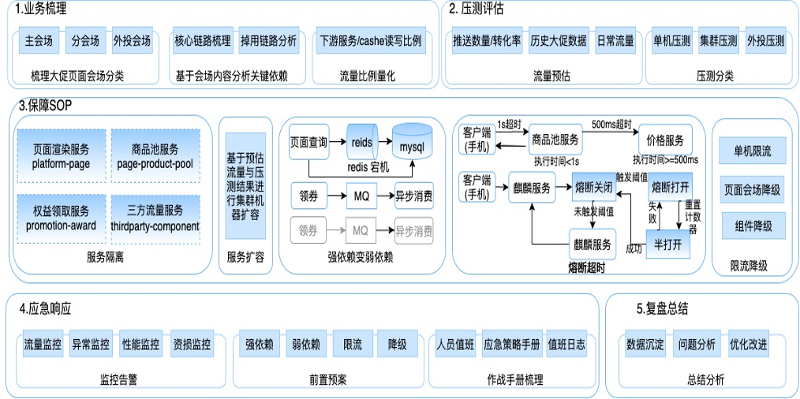**

**业务梳理：** 在大促期间，针对不同的活动玩法需要进行细致的业务梳理，并对其进行初步分类。通常可以将活动划分为非大促活动、大促核心玩法和新活动玩法三大类。每一类活动的保障需求和力度不同，因此，合理分类可以帮助团队在高流量时段为不同业务提供合适的保障措施。特别是对于核心业务，进行详细的链路分析显得尤为重要。链路分析的内容包括：依赖项的确认、依赖程度评估、资源耦合情况评估以及流量放大比例的预测等，这些信息为后续的流量预测和扩容需求评估提供了数据支持，有助于提前做好流量压力应对预案。

**压测评估：** 为了应对大促期间高并发流量的挑战，压测评估是确保系统稳定运行的关键步骤。首先，通过对历史大促数据和日常流量的分析，结合推送渠道、推送数量、转换率等因素，进行流量预估，提前预测出可能的高峰流量。其次，针对系统的接口性能进行单击压测，以识别系统瓶颈并及时进行优化。这些优化可以分为几类：无需优化、快速优化、长期优化等，以帮助技术团队高效处理性能问题。同时，集群压测有助于确认服务器的能力，确保在高流量下各项服务能够无缝运行。最后，通过全链路联合压测，全面验证系统在大流量场景下的承载能力，确保业务链条的每个环节都能够高效稳定地运作，避免因局部瓶颈导致全局崩溃。

**服务隔离：** 在面对大促期间瞬时流量暴增的情况时，合理的服务隔离策略对于保障系统的稳定性至关重要。通过读写分离，可以将页面查询服务与领券服务分开处理，避免对数据库的过度写入影响到用户访问页面的体验。与此同时，针对业务功能，进行拆分维度的服务隔离尤为关键。例如，将商品池、抽奖等涉及较大业务逻辑的服务进行独立处理，避免相互干扰导致性能下降。外部三方流量服务的隔离同样重要，将来自第三方的流量与内部业务流量进行隔离，有助于避免外部流量冲击带来的系统不稳定。在多个维度上进行服务隔离，可以有效降低单一服务对整个系统的影响，提高系统的稳定性、可扩展性及容错能力，确保在大流量情况下，用户体验不受影响，核心业务能够顺利运行。

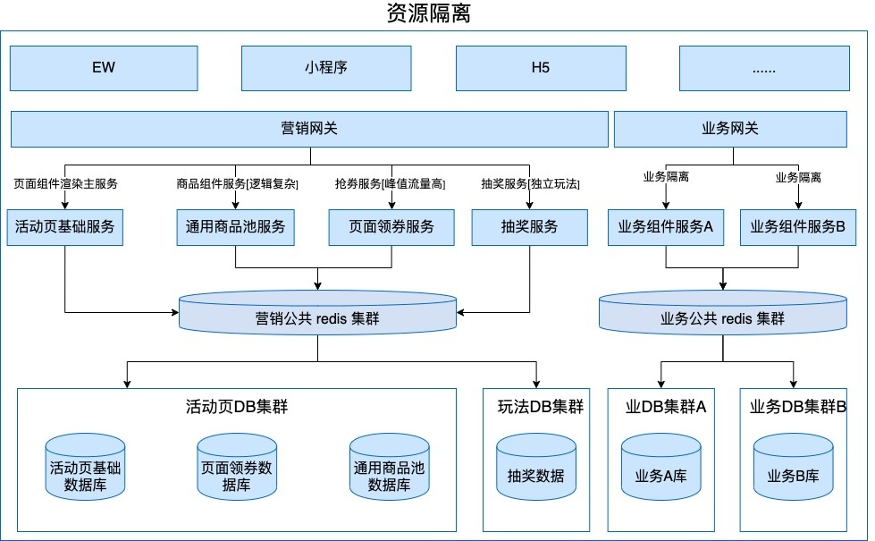

**强弱依赖与稳定性保障：** 为了满足瞬时流量（如页面渲染和整点抢券）的性能需求，我们在实现过程中借助Redis的内存性能进行数据加载，提升页面渲染的速度。由于整点抢券涉及多次写操作，因此采用了“削峰填谷”策略，通过缓存和异步消息队列中间件结合使用来平衡负载，确保系统高效处理流量。页面的核心功能对中间件的依赖性极为重要，因此在基础中间件发生故障或抖动时，必须采取有效措施保障页面稳定性。虽然行业中已有许多成熟的稳定性保障方案，例如存储多集群、异地多活、多机房部署等，通过自动切换保障业务的可用性，但我们结合实际成本和业务流量情况等，最终选择了适合的应急方案。具体而言，当Redis发生异常时，系统会自动降级到数据库，同时控制流量人口最大化提供有损服务能力；而在MQ发生异常时，则通过降级同步执行方式最大化保障系统的可用性。这样的设计使我们能够在确保业务稳定性的同时，优化成本和实现的可行性。

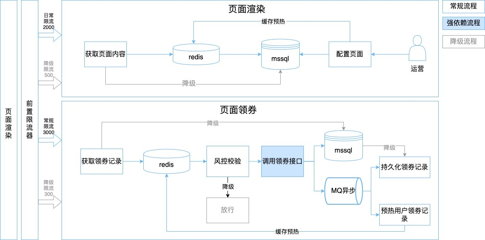

**流量防护：** 每个系统都有其容量的上限，面对突发的海量流量时，如何有效保障系统不被冲垮成为至关重要的课题。为了确保系统在高并发和流量突增的情况下仍能保持稳定运行，常用的防护技术包括限流、降级等手段。限流技术能够通过控制请求频率、限制并发量来避免系统负荷过重，从而防止出现服务器宕机或页面响应迟缓的情况。降级措施则能够根据系统压力的不同，对非核心功能进行临时关闭或降低服务质量，优先保障关键业务的正常运行。

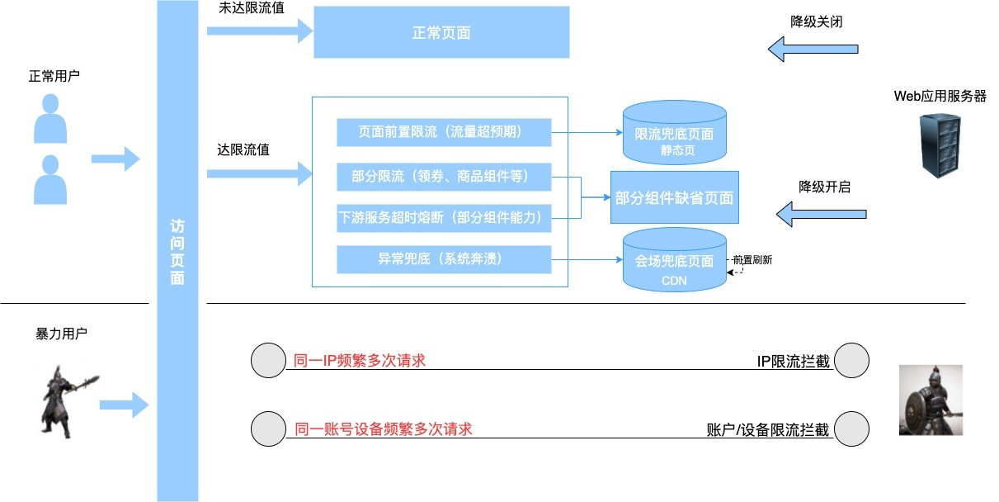

在正常用户访问超出系统承载能力时，必须实施限流措施，防止系统崩溃。通过压测，我们可以得出单台服务器的最大承载能力，并根据这一阈值为每台服务器进行适当配置。这样，在流量达到设定阈值时，系统可以通过自动限流机制避免过载，确保服务的稳定运行。此外，针对频繁进行暴力刷新的用户，防刷机制显得尤为重要。这包括通过清洗恶意流量、对IP地址或用户账号实施黑名单限制等措施，有效地阻止这些恶意用户的访问。具体来说，当恶意流量被识别时，系统会根据IP或账户信息做出及时的限制，拒绝这些流量进入系统，从而避免其对服务器造成不必要的压力。通过这些技术手段，系统能够有效降低因恶意流量带来的风险，确保正常用户的访问不受影响，提升平台的安全性和稳定性，进而优化用户体验并保障系统的长期健康运行。

**应急响应：** 在流量监控大盘的支持下，系统能够实时监测流量和资源的使用情况，帮助团队及时识别潜在风险和瓶颈。应急响应机制提前制定并演练，确保在突发情况发生时，值班人员能够迅速响应并按照预定分工进行处理。系统各个部门之间有清晰的沟通机制，保障信息流畅传递，快速协调和调度必要资源进行应对。各项监控指标和警报会实时提醒值班人员，确保不出现遗漏。此外，在应急响应过程中，明确了每个团队的职责，确保各项工作在压力情况下仍能高效推进，及时恢复系统正常运行。

**复盘总结：** 复盘总结通过沉淀和收集大促期间的关键数据，主要包括服务接口的QPS（每秒请求数）、AVG（平均响应时间）、RT（响应时延），系统集群的CPU、内存占用率，存储集群的连接数、机器负载等关键性能指标。这些数据为系统性能提供了详细的反馈，帮助团队分析和评估大促期间的流量波动、服务性能以及资源消耗情况。通过对这些数据的回溯，团队能够详细了解在高并发流量下的系统表现，并查找出潜在的瓶颈和问题。复盘不仅关注系统稳定性，也通过回溯发现可能的业务逻辑问题，确保改进措施能够有效解决实际挑战。同时，这一过程为未来的大促活动提供了宝贵的经验，有助于优化系统架构和流程，提升系统的容错能力、扩展性和响应速度，从而提升整个业务的稳定性和效率。  

## 五、未来展望规划

**1\. 智能化推荐提升运营效率与用户体验**  
活动页作为主要的流量承接会场页面，帮助业务团队快速搭建和投放活动。然而，每次搭建页面时，运营人员仍需投入大量精力进行数据和素材的填充，这不仅对运营效率造成影响，也可能对用户体验转化率产生一定挑战。随着行业发展的推进，智能化探索已经成为提升运营效率和用户体验的重要方向。未来，我们计划与算法团队紧密合作，基于用户行为分析和历史活动数据沉淀，构建智能组件内容推荐能力。这一能力将能根据用户的兴趣、偏好和历史活动表现，通过智能推荐展示个性化的活动和产品。例如，在商品筛选、权益配置、素材投放等环节，系统能够智能化地为运营团队提供决策支持，从而减少人工干预，提高运营效率。同时，结合运营行为与业务结果形成的正负反馈机制，将不断优化和迭代模型，提升推荐准确性和个性化水平。这一智能化系统不仅提升了用户体验，还有效降低了运营成本，帮助业务实现精准营销与资源优化。

**2\. 实时内容更新与灵活应变**  
为了进一步提升用户体验和增强页面吸引力，未来，我们计划与产品设计团队紧密合作，基于实时用户数据和市场动态，借助技术手段实现内容的实时更新。技术团队将通过API接口从多种数据源（如社交媒体、用户反馈、实时搜索趋势等）获取信息，确保能够及时调整和更新页面的组件元素。这一方案的优势在于能够迅速响应用户的需求变化，同时灵活适应市场和业务环境的动态变化。例如，基于社交媒体的热门话题或用户在页面上的互动行为，系统可以实时推荐相关活动或调整页面内容，从而进一步提高页面的吸引力和互动性。通过这一方案，我们不仅可以提升用户参与度，还能更好地实现市场定位和业务目标，持续优化用户体验并提升整体转化率。