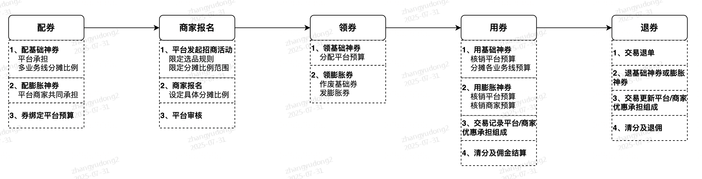
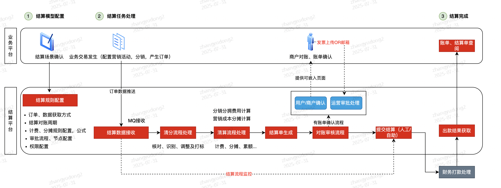
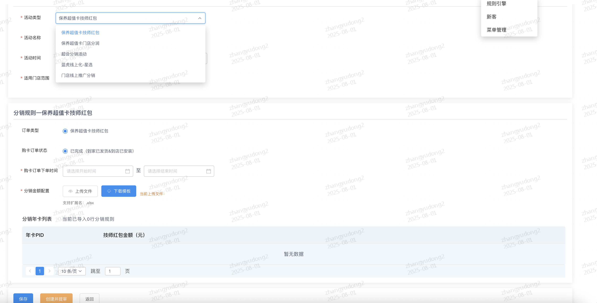
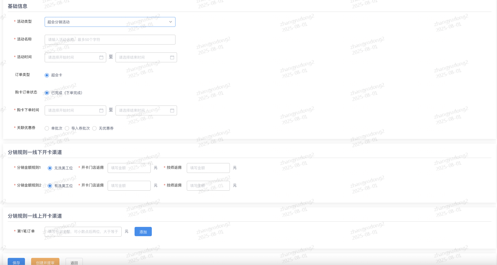
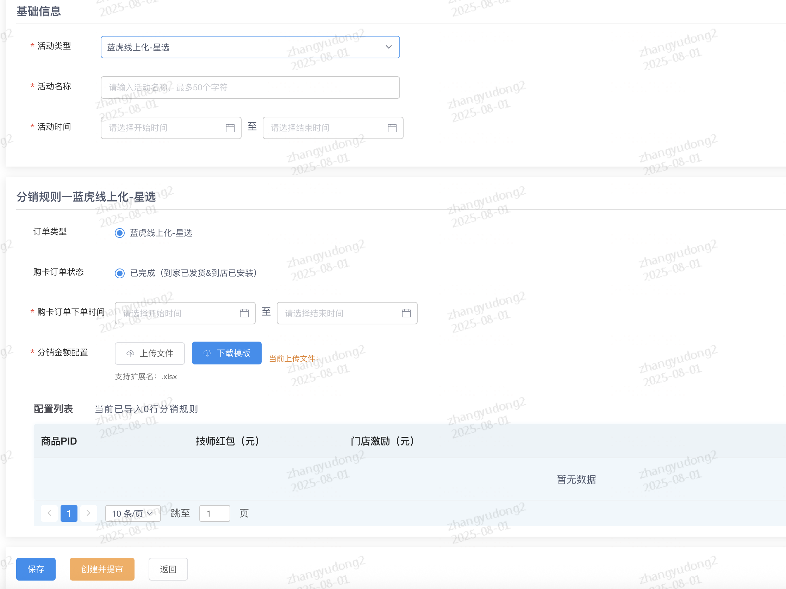
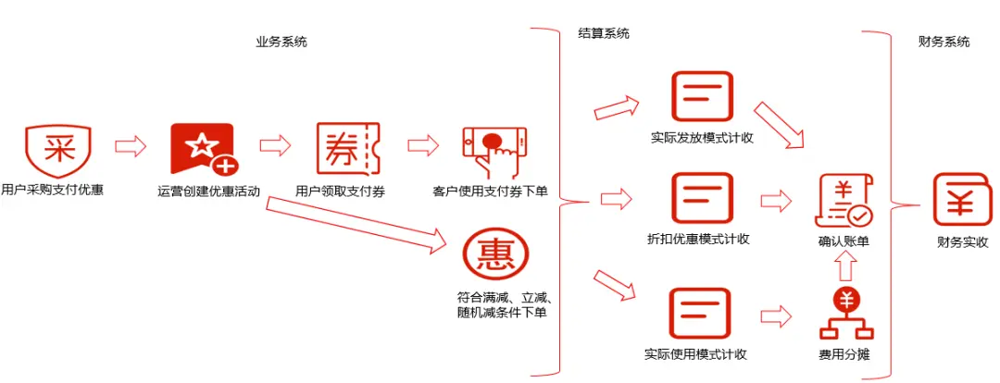
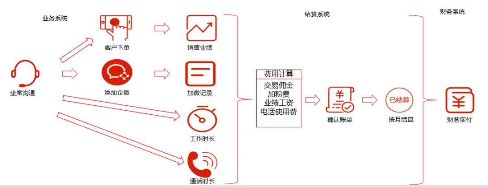

[转至元数据结尾](#page-metadata-end) [转至元数据起始](#page-metadata-start)

## 背景

当前营销成本分摊系统包含优惠成本分摊以及技师推广红包激励两种业务形式，两种业务形式存在明显差异，放在一个系统明显不合适，因此需把技师推广红包激励拆分出来，以及技师推广红包激励拆分后，后续理应归属哪个团队？当前技师推广红包激励业务流程跨6个团队，链路流程较长，对问题排查及需求交付上都有一定影响。

## 1、营销补贴行业调研

点击此处展开...

### 1.1 营销补贴定义

**营销补贴（Marketing Subsidies）** ：企业为推广产品或服务、增加市场份额、提高品牌知名度等目的，联合其他利益相关方一起承担成本，通过营销活动给予消费者、经销商或其他合作伙伴的优惠或财务支持。

营销补贴形式多种多样，视补贴目的、对象和手段等不同而有所差异，包括但不限于：

<table><colgroup><col> <col> <col></colgroup><thead><tr><th>
分类
</th><th>
示例说明
</th><th>
备注
</th></tr></thead><tbody><tr><th>补贴目的</th><td><ul><li>广告推广补贴：为经销商或合作伙伴提供广告费用支持，以鼓励他们推广企业的产品或服务。</li><li>渠道分销补贴：为销售渠道提供补贴，如分销商、批发商等，以增加他们推广销售动力。</li><li><strong>销售价格补贴</strong> ：通过不同活动工具或玩法降低产品或服务销售价格，以吸引消费者购买。</li><li>采购返点补贴：为建立稳定、有竞争力的供货体系，提供给采购方相应价格返点。</li><li>市场开发补贴：为新市场或新产品推广提供专项资金支持。</li><li>培训支持补贴：为企业员工或合作伙伴提供培训、技术支持等资金支持，帮助他们更好完成工作。</li></ul></td><td><ul><li>广告推广补贴<ul><li>朋友圈返现、小红书晒图文</li></ul></li><li>渠道分销补贴<ul><li>技师红包、裂变红包</li></ul></li><li>销售价格补贴<ul><li>券、活动、赠品、后返（积分、花费、现金等）</li></ul></li></ul></td></tr><tr><th colspan="1">补贴对象</th><td colspan="1"><ul><li><strong>C端消费者</strong> ：消费者用户购买产品或服务时，享受补贴以更低价格进行购买下单。</li><li>B端客户：客户批量采买大宗产品或服务时，享受补贴以更低价格进行购买下单。</li><li><strong>B端商家/门店</strong> ：商家/门店联合企业推广营销活动时，享受补贴以更有动力提供低价高质产品或服务。</li><li>渠道分销商：渠道分销商通过各种渠道推广产品或服务，享受补贴以更有推广动力。</li><li>供应商：供应商获取相应补贴返点，以提供更稳定、高质的供货体系。</li><li>其他合作伙伴：企业为达到推广、销售产品或服务等目的，补贴合作伙伴以激励目标更高效达成。</li></ul></td><td colspan="1">
实际某个主体在企业营销活动中，可能同时承担多个角色对象。

例如：
<ul><li>C端消费者可以直接享受补贴进行购买下单，同时又可能作为渠道分销商，通过裂变、推广下单获取分佣补贴；</li><li>B端商家/门店一方面和企业进行联合营销享受补贴，另一方面又可能作为客户享受补贴批量购买下单。</li></ul></td></tr><tr><th colspan="1">补贴手</th><td colspan="1"><ul><li><strong>优惠券</strong> ：以优惠券作为载体，叠加灵活限制规则，实现购买下单时的价格补贴。</li><li><strong>活动价</strong> ：通过立减、一口价、打折等活动价形式，叠加灵活限制规则，实现购买下单时的价格补贴。</li><li>赠品：通过购买下单时随单附送赠品（实物、服务或虚拟商品），实现购买下单时的优惠补贴。</li><li>后返：通过购买下单后（履约完成、晒单推广等）行为完成既定营销活动，以获取相关补贴激励。</li></ul></td><td colspan="1">
优惠券、活动价、赠品：大多数与用户购买下单行为强相关，补贴直接作用于用户当下购买的订单价格；

赠品、后返：下单转化行为只是其中一类营销诉求（非强相关），除此之外也可以用于激励推广、裂变拉新等其他行为。
</td></tr><tr><th colspan="1">补贴承担方</th><td colspan="1"><ul><li>企业（平台）：补贴产生的成本全部由平台来承担；</li><li>商家/门店：补贴产生的成本全部由商家/门店来承担，相应补贴规则一般会由平台+商家联合制定，或由平台提供补贴建议，商家自行制定。</li><li><strong>企业+商家/门店</strong> ：补贴产生的成本由平台+商家/门店按照一定比例或金额进行分摊承担；相应补贴规则由平台+商家联合制定。</li><li>品牌供应商：补贴产生的成本存在全部由品牌供应商承担（类似商家/门店模式），也存在由平台+品牌供应商按协议联合承担（类似企业+商家/门店模式）。</li></ul></td><td colspan="1">
途虎目前：
<ul><li>红虎大多数补贴都是由平台全部承担，少数由平台+门店联合承担（洗美业务线居多）；</li><li>蓝虎门店券成本由门店全部承担（门店自行设置补贴规则）；</li><li>汽配龙目前补贴都是由商家全部承担（但由于商家都是自营，所以可间接认为都是平台承担）。</li></ul></td></tr></tbody></table>

*** 说明：以上补贴分类及示例内容来源于网络资料收集，经整理、汇总后归纳，备注为相应途虎目前存在的补贴案例。

### 1.2 行业常见玩法及建设思路

电商O2O行业，常见玩法一般有： **销售价格补贴** 、 **渠道分销补贴** 和 **广告推广补贴** ，其中以用户增长为目标来设计 **销售价格补贴** 策略又最为普遍，其通常玩法如下：

- 通过优惠券，立减、打折或一口价等活动价作为载体来实现补贴；
- 成本承担早期由平台全部承担，过渡到平台+商家共同分摊，再到由商家承担大部分成本或全部成本；
- 核心补贴C端消费者用户，形成平台低价心智；
- 以期吸引C端用户购买下单、复购提频，提升平台GMV。

不同成本承担方的补贴优惠载体有所差异，但大多遵循以下原则：

| 补贴承担方 | 补贴手段 |
| --- | --- |
| 平台 | 优惠工具：优惠券、立减、打折等  - 优惠形式： 	- 立减至X元（一口价） 		- 立减X元（打X折） 		- 满X减Y元（满X打Y折） 		- 阶梯减（满X1减Y1、满X2减Y2） 		- 随机立减（折） 		- 算法决策减（折） - 优惠组合：单品、单商家多品、多商家多品 - 优惠门槛：商品总额、订单总额等  （淘宝、JD、美团整体来看，平台补贴玩法都比较丰富多样，也相对比较复杂）  PDD相对更简单一些，主要是跨店多品：  - 立减X元 - 满X减Y元  通常称为： **平台优惠** |
| 商家 | 优惠工具：优惠券、立减、打折  - 优惠形式：   	- 立减X元（打X折） 		- 满X减Y元（满X打Y折、满X件打Y折） - 优惠门槛：商品总额、订单总额等  （淘宝、JD、美团、PDD整体来看，为便于商家更好理解，补贴玩法都相对简单）  PDD商家大多数是：  - 立减X元 - 满X件打Y折  通常称为： **商家优惠** |
| 平台+商家 | 平台+商家，由于涉及商家报名参与活动，补贴玩法都和商家承担成本的模式类似，相对简单，但会 **额外增加商家报名环节** 。  尽管补贴玩法类似商家优惠，但由于平台有承担，通常也称为： **平台优惠（商家分担）** |

*** 内容来源于调研淘宝、JD、美团和PDD相关产品或技术文档后梳理汇总形成。

平台+商家共同分摊成本的分摊规则，主要有以下几类：

<table><colgroup><col> <col> <col></colgroup><tbody><tr><th>分摊原则</th><th>平台制定规则</th><th>商家报名</th></tr><tr><th>按金额分摊</th><td><ul><li>固定金额值<ul><li>固定商家承担金额（大多数选择）</li><li>固定平台承担金额</li></ul></li><li>固定金额区间<ul><li>固定商家承担金额区间</li></ul></li></ul>
限定总量：
<ul><li>限商家承担总金额</li><li>限商家承担总次数</li></ul></td><td rowspan="2"><ul><li>是否参与</li><li>哪些商品参与</li></ul>（商家提报后，平台会二次审核）</td></tr><tr><th>按比例分摊</th><td><ul><li>商家平台按固定比例分摊 <ul><li>限商家每单承担金额上限（可选）</li></ul></li></ul>
限定总量：
<ul><li>限商家承担总金额</li><li>限商家承担总次数</li></ul></td></tr></tbody></table>

#### 1.2.1 美团神券

美团神会员券的制作、商家报名、购买领取、用券、退券的大致流程：

其中涉及主要系统或平台：

- 优惠券系统（涉及到家券平台、到店券平台，底层数据互相双写、保持一致，上层系统各自独立）
- 招商系统（面向商家的活动发布、活动报名及审核）
- 平台预算系统（平台预算管控：涉及预算申请、分配、核心、跨业务线分摊）
- 商家预算系统（商家营销预算管控）
- 交易平台（记录营销优惠分摊组成，统一提供订单金额分摊明细查询接口供结算查询 \[ 除营销优惠分摊外，还有其他分摊逻辑 \]）
- 结算平台

资金安全相关保障方面，各系统或平台独有的业务相关监控告警，主要有：

- 优惠券的库存、资格、预算等监控（掉0、异动、同环比、TopN \[ 券、商家、商品、用户 \] 等）
- 平台预算、商家预算消耗监控（掉0、异动、分维度\[ by业务线、商家、商品 \] 切片等）、熔断管控
- 结算平台负佣监控（分维度 \[ 业务线、商家、商品、优惠、用户等 \] 切片统计监控、掉0、异动等）
- 风控嵌入事前/事中/事后各个环节（营销优惠配置、商家活动报名、交易下单、优惠核销、结算打款等）

除此之外，建设有跨系统或平台的联动监控：

- 结算与各数据源头（商品、价格、营销、交易等）的离线/准实时对账
- 商品变价与营销、结算联动（变价触发营销活动力度、结算负佣的联动校验）
- 营销活动变更与结算联动（活动变更触发结算负佣联动校验）

#### 1.2.2 JD立减活动

名词解释：

| 名词 | 解释 |
| --- | --- |
| 清分 | 清分是在清算前对数据标准化处理阶段。在本文中，清分指的是对交易明细数据的核对、识别、调整及打标操作。 |
| 清算 | 清算是标准化数据的计算及核对过程，本文清算主要完成标准化数据的核对、计费及分摊处理。 |
| 结算 | 结算是汇总账单，并完成资金最终转移的过程。本文中的结算指的是对清算明细数据，以不同的维度生成结算单并确认，最终通过财务系统完成收付款的整个过程。 |
| 计费 | 本文中指：单据数据按一定计算规则，生成的结果金额及过程金额。 |
| 分摊 | 本文中指：费用存在多个承担方，在清算过程中，会把计费的结果金额，再次按分摊的规则划分到各方。 |
| 累额 | 本文中指：累额服务于分摊动作,具体过程 为分摊规则中配置了每个承担方最大的承担上限，那么在计费后需要分摊时，需要参考承担方已累加金额是否到了上限，如果到了上限，则此方不进行分摊金额，否则正常累加本次金额。 |
| 冲正 | 本文中指：同一单据重新计费、分摊时，需要把此单据在原累加总额值减去，再累加上本次金额。 |
| 重置 | 本文中指：顺序清算场景时，业务线需要在历史的某个单据向后重新清算时，累额中需要把总额回退到此单据清算时累加的总额快照，并标识累额流水中哪些是效数据。 |

核心流程：

1\. 业务数据通过实时或离线两种方式接入平台。在清分中判别数据归属清分类型（通用流程或个性化流程），而进入不同的清分处理流程。清分域主要是按一定的规则对原始数据进行核对、识别、调整及打标动作，为清算做好数据标准化。

2\. 当清分标准化数据后，会推送结果数据到清算域，清算按模型配置的清算规则，通过流程控制进入计费、分摊、累额等不同的组合处理（譬如：只计费、先计费后分摊、只分摊、先分摊后计费等），以及会补全结算户、合同及汇率数据，数据落到清算明细表。

3\. 结算模型达到结算周期条件时，会产生一个结算任务。结算任务处理时，会从清算表中按条件获取待结算明细，然后按结算维度汇总，各自产生结算单信息。结算单自动按预定审批流程完成确认，最终推送到财务渠道（渠道当前有：科技财务、预存款账户、pop核算等），由财务渠道系统完成收付款。

其中涉及主要系统或平台：

- 营销平台（招商系统、营销工具）
- 结算平台（主要是清分、清算、结算）

资金安全相关保障方面：

- 主要是业务数据和最终提交结算数据流程中，对结算流程进行监控

## 2、途虎营销补贴能力现状

系统自动发红包调研详情

<table><colgroup><col> <col> <col> <col> <col></colgroup><tbody><tr><th>干系方</th><th colspan="1">涉及内容</th><th>研发干系人</th><th colspan="1">业务干系人</th><th colspan="1">备注</th></tr><tr><td>营销</td><td colspan="1">
活动制作：

实物销售奖励（轮胎、车品）

服务销售奖励（洗美）

虚拟商品销售奖励（保养年卡，超级会员卡）

佣金计算：

技师佣金

门店补贴
</td><td>胡文祥、张玉东</td><td colspan="1">
超级会员卡：徐超
</td><td colspan="1">
实物和洗美 技师推广，在特定时间内购买订单，订单完成给技师（通过红包发放）和门店补贴（通过XX发放和清结算确认）

保养年卡

线下购买 通过技师推广，在特定时间内购买订单，订单完成给技师补贴，履约的时候 部分券给门店补贴（这种不是一种分销行为）

线上购买（无补贴）

超级会员卡 <a href="https://doc.weixin.qq.com/sheet/e3_AV4AfAY6APkeaH6zWnlS80H9E3WBI?scode=ANAAUQePAAYScdiXEjAV4AfAY6APk&tab=91ujly">超级会员卡案例链接</a>

线下购买 通过技师推广，在特定时间内购买订单，订单完成给技师（通过红包发放） 和 门店补贴

线上购买 履约的时候会给门店补贴（这种不是一种分销行为）
</td></tr><tr><td>清结算</td><td colspan="1">
清分

线上订单分佣

线下订单分佣
</td><td>顾婵媛</td><td colspan="1"></td><td colspan="1">
1、配置蓝虎 的技师红包规则的业务方是哪个业务？

2、配置红虎的技师红包的规则的业务方是哪些业务？

3、超级会员卡退卡之后，逆向佣金怎么追回？（已结算场景下）

<a href="https://doc.weixin.qq.com/sheet/e3_AE4AhQaQALQmH7cXJGvTuWAeLN3nf?scode=ANAAUQePAAYu1WHGecAE4AhQaQALQ&tab=BB08J2">技师奖励清分账户列表</a>
</td></tr><tr><td rowspan="5">C端业务</td><td colspan="1"><s>洗美</s></td><td><s>欧阳超</s></td><td colspan="1"></td><td colspan="1"></td></tr><tr><td colspan="1">维保</td><td colspan="1">方立丹</td><td colspan="1"></td><td colspan="1">
扫码后落地到麒麟活动页（技师ID，门店ID）

activityType=Activity

MQ：下单后传给 营销：订单号+
</td></tr><tr><td colspan="1">轮胎</td><td colspan="1">平会</td><td colspan="1"></td><td colspan="1">
轮胎是扫完码带着PID进入到红虎商详页，（技师ID，门店ID），落地页打开后会先保存这些信息（包含活动类型）到数据库 +PID

具体哪些轮胎出推广码由门店决定的，C端只提供了（技师精选，星选）的轮胎标签

activityType=TireProduct

MQ：下单后传给 营销：订单号+
</td></tr><tr><td colspan="1">保养超值卡</td><td colspan="1">方立丹</td><td colspan="1"></td><td colspan="1">
扫码后落地到超值卡频道页（技师ID，门店ID，活动ID），落地页打开后会先保存这些信息（包含活动类型）到数据库，下单的时候，取同类型24小时内的最新一条

下单后传给营销：订单号+

MQ：activityType=GreatValueCard + 活动ID
</td></tr><tr><td colspan="1">超级会员卡</td><td colspan="1">路通</td><td colspan="1"></td><td colspan="1">
门店调用C端的二维码管理的后台（传入场景类型+待确认），生成一个技师推广码

落地页：开卡页面（门店ID，技师ID），记缓存，24小时，和上面不是一套，（基于用户维度）

调接口：下单的时候，如果前段传入了技师ID，门店ID，就用参数里的，没有就取缓存
</td></tr><tr><td rowspan="3">门店</td><td colspan="1">
活动制作

预算申请

佣金发放

纯红包发放
</td><td>杨冬</td><td colspan="1"></td><td colspan="1">
1、预算账户的生成逻辑？每次活动生成一个？

2、预算账户和计费项目怎么关联？
</td></tr><tr><td colspan="1">
导购

《甄选强推》

《技师活动》
</td><td colspan="1">何志同</td><td colspan="1"></td><td colspan="1">1、什么情况下展示技师活动，什么情况下展示甄选强推？</td></tr><tr><td colspan="1">
汽车学院

技师答题发红包
</td><td colspan="1">杨亮</td><td colspan="1"></td><td colspan="1"></td></tr><tr><td colspan="1">财务</td><td colspan="1">
记账：

SAP（银行卡账单、支付宝账单）
</td><td colspan="1">蔡蓬亮</td><td colspan="1"></td><td colspan="1"></td></tr><tr><td colspan="1">支付</td><td colspan="1">
账户：

【虚拟账户】预算账户（充钱、扣钱）

账单流水：

【实际资金往来】银行卡支出账单

【实际资金往来】支付宝账单（充值、支出）
</td><td colspan="1">黄中伟</td><td colspan="1"></td><td colspan="1"></td></tr><tr><td colspan="1">朱雀云</td><td colspan="1">完全独立的活动和红包发放流程，因此本次梳理未波及到</td><td colspan="1">张胜</td><td colspan="1"></td><td colspan="1"></td></tr></tbody></table>

24关于红包的故障参考

①用户在门店扫多个技师的二维码下超值卡订单，技师未收到红包 - [https://coe.tuhu.cn/#/bug\_details\_new?edit=true&coeId=2804](https://coe.tuhu.cn/#/bug_details_new?edit=true&coeId=2804)  
②9.1当天超值保养卡因漏执行配置脚本，影响门店技师的红包发放 - [https://coe.tuhu.cn/#/bug\_details\_new?edit=true&coeId=2797](https://coe.tuhu.cn/#/bug_details_new?edit=true&coeId=2797)  
③多个门店反馈星选轮胎未收到红包 \-https://coe.tuhu.cn/#/bug\_details\_new?edit=true&coeId=2636  
④营销星选标签人为误操作导致线上星选标签被全量清除，影响技师红包/薪酬和门店奖励(UT) \-https://coe.tuhu.cn/#/bug\_details\_new?edit=true&coeId=2522

### 2.1 线上补贴场景梳理

<table><colgroup><col> <col> <col> <col> <col></colgroup><tbody><tr><th colspan="1"><strong>场景</strong></th><th><strong>场景细分</strong></th><th><strong>活动类型</strong></th><th><strong>是否有后台</strong></th><th><strong>条件</strong></th></tr><tr><td rowspan="5">
分销补贴
</td><td>
超级会员
</td><td>
超级会员分销补贴活动
</td><td>
有
</td><td>
COUPON_BATCH_ID：优惠券id SHOP_STRATEGY_ID：门店策略id SUPER_MEMBER_ONLINE_DISTRIBUTE：线上补贴规则 SUPER_MEMBER_OFFLINE_DISTRIBUTE：线下分销规则 ORDER_TIME_RANGE_LIMIT：订单下单时间范围
</td></tr><tr><td rowspan="2">
保养超值卡
</td><td colspan="1">
保养年卡分销活动
</td><td colspan="1">
有
</td><td colspan="1">
ORDER_TYPE_LIMIT：14保养年卡 ORDER_STATUS_LIMIT：已完成 ORDER_TIME_RANGE_LIMIT：订单下单时间范围 BAO_YANG_CARD_DISTRIBUTE_CONFIG： <a href="https://doc.weixin.qq.com/sheet/e3_ACoA8gb9ACg2f0GVnhfTUO0xvvzLK?scode=ANAAUQePAAY0L92gYRACoA8gb9ACg&tab=ycdj62">https://doc.weixin.qq.com/sheet/e3_ACoA8gb9ACg2f0GVnhfTUO0xvvzLK?scode=ANAAUQePAAY0L92gYRACoA8gb9ACg&tab=ycdj62</a>
</td></tr><tr><td colspan="1">
保养年卡补贴活动
</td><td colspan="1">
有
</td><td colspan="1">
ORDER_TYPE_LIMIT：20年卡抵扣 ORDER_STATUS_LIMIT：已完成 ORDER_TIME_RANGE_LIMIT： BAO_YANG_CARD_SUBSIDY_CONFIG： <a href="https://doc.weixin.qq.com/sheet/e3_ACoA8gb9ACg2f0GVnhfTUO0xvvzLK?scode=ANAAUQePAAY0L92gYRACoA8gb9ACg&tab=ycdj62">https://doc.weixin.qq.com/sheet/e3_ACoA8gb9ACg2f0GVnhfTUO0xvvzLK?scode=ANAAUQePAAY0L92gYRACoA8gb9ACg&tab=ycdj62</a>
</td></tr><tr><td colspan="1">
蓝虎线上化
</td><td colspan="1">
蓝虎商品分销活动
</td><td colspan="1">
有
</td><td colspan="1">
ORDER_STATUS_LIMIT：1普通 ORDER_STATUS_LIMIT：已完成 ORDER_TIME_RANGE_LIMIT：订单下单时间范围 BLUE_TIGER_DISTRIBUTE_CONFIG：见excel <a href="https://doc.weixin.qq.com/sheet/e3_ALgAFgboAAcSuJ40uc0S3KOT5y0gf?scode=ANAAUQePAAYMht07qrACoA8gb9ACg&tab=BB08J2">https://doc.weixin.qq.com/sheet/e3_ALgAFgboAAcSuJ40uc0S3KOT5y0gf?scode=ANAAUQePAAYMht07qrACoA8gb9ACg&tab=BB08J2</a>
</td></tr><tr><td colspan="1">
洗美转轮保
</td><td colspan="1">
洗美在店推荐分销活动
</td><td colspan="1">
有
</td><td colspan="1"><pre><code>ORDER_STATUS_LIMIT：1普通
ORDER_STATUS_LIMIT：已完成
ORDER_TIME_RANGE_LIMIT：订单下单时间范围
BLUE_TIGER_DISTRIBUTE_CONFIG：见excel</code></pre></td></tr><tr><td rowspan="2">
成本分摊
</td><td colspan="1">
优惠券成本分摊
</td><td colspan="1">
招商活动
</td><td colspan="1">
有
</td><td colspan="1">
见招商后台
</td></tr><tr><td colspan="1">
钣喷活动成本分摊
</td><td colspan="1">
鈑噴活動
</td><td colspan="1">
无需配置
</td><td colspan="1">
订单扩展字段存在钣喷活动，就对优惠金额进行分摊计算，规则默认tuhu承担100%
</td></tr></tbody></table>

页面配置：

  

人工发红包调研详情

<table><colgroup><col> <col> <col> <col> <col> <col></colgroup><thead><tr><th></th><th>
调研对象
</th><th colspan="1">
可系统化
</th><th colspan="1">
24年以来共计发放金额
</th><th>
调研结果
</th><th colspan="1">
活动流程图
</th></tr></thead><tbody><tr><td>抖快短视频带货激励（常态化活动）</td><td>
保养运营：潘雨含
</td><td colspan="1">是</td><td colspan="1">67万</td><td>
<strong>活动简述：</strong> 技师通过抖音、快手平台发视频带货，卖出途虎商家的货后，给予技师激励。

<strong>核心关联：</strong> 技师在抖音、快手平台进行认证成为途虎带货职人，抖音会有职人号，市场运营会维护一份抖音职人到技师ID的关联关系表

【TODO】市场如何获得带货明细以及职人和技师ID的关系

抖音-汤英杰

快手-宋丹丹

人工从快手后台下载，下载后交给BI匹配出，可以走快手的佣金自动发放能力，但是技师团队根据业务规则不允许，要求必须走红包发放的渠道

<strong>商品上架：</strong> 保养业务运营负责决定上架的商品范围，市场运营负责执行

<strong>发放条件：</strong> 根据商品配置，不同的商品发放金额不同，而且必须是订单已安装完成，才可发放

<strong>发放周期：</strong> 每周三汇总金额通知到技师，每个月金额发放一次
</td><td colspan="1">
draw.io
Diagram attachment access error: cannot display diagram</td></tr><tr><td>满意度提升活动红包奖励/口碑提升活动红包/满意度提升晒单奖励（常态化活动）</td><td>门店服务管理组：朱蕾(zhulei2)</td><td colspan="1">是</td><td>333万</td><td>
<strong>活动简述：</strong> 门店邀请客户晒单，提升门店的曝光，提升用户的满意度

<strong>核心关联：</strong> 市场部提供晒单的数据，可以定位到门店和订单号，再根据订单号找到施工技师

【TODO】市场如何获得这份晒单数据 房俊

从营销的 锦鲤 - 玩法系统 - 口碑活动 里获取订单信息

<strong>商品范围：</strong> 轮保修蓄车品（洗美不含），线上订单和U门店订单都可以

<strong>发放条件：</strong> 晒单内容经过市场部审核

1、晒单申请：用户通过扫描二维码申请晒单奖励，市场部审核通过会给用户发放E卡奖励

2、晒单成功给技师奖励：每单固定给予技师固定金额奖励（1-20元之间）

3、晒单成功给门店店长奖励：每单固定给予店长固定金额奖励（0-20元之间）

也可能会尝试阶梯式奖励

<strong>发放周期：</strong> 每2周发放一次奖励

<strong>预算：</strong> 财务部有人员会规划预算，做活动之前会和财务进行对齐
</td><td colspan="1">
draw.io
Diagram attachment access error: cannot display diagram</td></tr><tr><td>门店企微托管号添加激励（常态化活动）</td><td>社群产品运营组：谢佩琳</td><td colspan="1">是</td><td>20万</td><td>
<strong>活动简述：</strong> 门店技师邀请客户加企微并留存后，给门店绑定企微的托管技师发红包

<strong>核心关联：</strong> 企微托管技师信息

<strong>发放条件：</strong> 每个好友1元 或者 添加率 （留存/总添加数量）达到不同的比率给于不同的奖励

<strong>发放周期：</strong> 每个月1次
</td><td colspan="1">
draw.io
Diagram attachment access error: cannot display diagram</td></tr><tr><td>技术支持兼职人员报酬奖励（常态化活动）</td><td>门店技术组：谭久红</td><td colspan="1">是</td><td>12万</td><td>
<strong>背景：</strong> 我们公司的技术支持老师制对一个或两个车辆品牌熟悉，有效解决率只有70%左右，通过外聘技术支持的方式提高解决率，因为如果全职招聘，每月要增加50万的成本，通过外聘也可以提高解决率，还可以减少人工成本。

<strong>发放条件：</strong> 技术支持给出的维修方案得到技师认可，技术支持要实名认证注册蓝虎，一级问题30元，二级问题50元，三级问题80元，四级问题100元。

1、因为技师自身问题安装错误，而非技术支持的方案问题的，依然给于报酬。

2、技术支持老师向兼职人员发起问询，2小时内答复且正确给于报酬

<strong>发放周期：</strong> 每月10号左右发放报酬
</td><td colspan="1">
draw.io
Diagram attachment access error: cannot display diagram</td></tr><tr><td>维修配件抖音推广奖励</td><td>快修运营：苏陈淋</td><td colspan="1">是</td><td colspan="1">945</td><td>见保养调研结果</td><td colspan="1"></td></tr><tr><td colspan="1">“新人履约”红包活动</td><td colspan="1">快修运营：彦森</td><td colspan="1">/</td><td colspan="1">3万</td><td colspan="1">以后不会搞了，一次性活动，未达到业务预期</td><td colspan="1"></td></tr><tr><td colspan="1">线上工时费活动技师红包</td><td colspan="1">快修运营：史怡芳</td><td colspan="1">/</td><td colspan="1">9万</td><td colspan="1">工时费项目已经结束，以后不会再搞了</td><td colspan="1"></td></tr><tr><td>星选轮胎区域PK赛</td><td>星选运营组：朱兆奇</td><td colspan="1">需产品设计PK玩儿法</td><td colspan="1">33万</td><td>
<strong>活动简述：</strong>

<strong>核心关联：</strong>

1、同战区内省份PK，增速最快的省份胜出，全省的门店都可以拿到所有销量的加码红包。

2、同战区TOPX门店，当月技师的销量轮胎都给红包

3、同战区TOPX技师，可获得星选礼品券

3、导购员是技师，如果没有导购员则发放给安装主技师

<strong>商品上架：</strong> 所有的星选商品，且都是铺货商品（U门店订单）

<strong>发放条件：</strong> 每条轮胎固定金额10元，战区PK和门店排名可以叠加

<strong>发放周期：</strong> 一个月一次
</td><td colspan="1"></td></tr><tr><td colspan="1">星选轮胎销量达成挑战赛</td><td colspan="1">星选运营组：朱兆奇</td><td colspan="1">需产品设计PK玩儿法</td><td colspan="1"></td><td colspan="1">
<strong>活动简述：</strong> 针对销量下滑较大的城市，对门店设定销量目标，达成目标的门店，所有商品给予加码红包

<strong>核心关联：</strong> 导购员是技师，如果没有导购员则发放给安装主技师

<strong>商品上架：</strong> 所有的星选商品，且都是铺货商品（U门店订单）

<strong>发放条件：</strong> 每条轮胎固定金额10元

<strong>发放周期：</strong> 一个月一次
</td><td colspan="1"></td></tr><tr><td colspan="1">千店挑战赛活动</td><td colspan="1">星选运营组：朱兆奇</td><td colspan="1">需产品设计PK玩儿法</td><td colspan="1"></td><td colspan="1">
<strong>活动简述：</strong> 针对上海、四川共一千多家店组织活动，给门店设定目标，超出目标部分进行激励

<strong>核心关联：</strong> 导购员是技师，如果没有导购员则发放给安装主技师

<strong>商品上架：</strong> 所有的星选商品，且都是铺货商品（U门店订单）

<strong>发放条件：</strong>

1、超出部分门店每条轮胎10元

2、超出部分技师每条轮胎10元

<strong>发放周期：</strong> 一个季度一次
</td><td colspan="1"></td></tr><tr><td colspan="1">星选轮胎技师红包挑战赛红包加码</td><td colspan="1">星选运营组：蒋卓然</td><td colspan="1">需产品设计PK玩儿法</td><td colspan="1">111万</td><td colspan="1">
去年的活动已经不适用于现在的业务规则，以今年的规则为准

</td><td colspan="1"></td></tr><tr><td colspan="1">春节技师内推奖励</td><td colspan="1">技师运营管理组：刘茜(liuqian6)/张骥明</td><td colspan="1">ROI不高</td><td colspan="1">8700</td><td colspan="1">纯人事奖励，无法线上化</td><td colspan="1"></td></tr><tr><td colspan="1">春节每日打卡及全勤奖红包</td><td colspan="1">技师运营管理组：刘茜(liuqian6)/张骥明</td><td colspan="1">ROI不高</td><td colspan="1">1万</td><td colspan="1">
<strong>活动简述：</strong> 春节留岗技师每日打卡可抽奖，打卡满12天可得全勤抽奖。

<strong>核心关联：</strong> 中奖技师即可获得技师红包

<strong>发放条件：</strong> 根据全勤技师名单，运营通过excel抽奖，给到技师

<strong>发放周期：</strong> 一次性奖励
</td><td colspan="1"></td></tr><tr><td colspan="1">金牌技师表彰奖励</td><td colspan="1">技师运营管理组：刘茜(liuqian6)</td><td colspan="1">
需产品设计技师表彰规则

频次低
</td><td colspan="1">15万</td><td colspan="1">
<strong>发放条件：</strong> 拉出技师的相关数据，业务通过分析，得出金牌技师的清单

<strong>发放周期：</strong> 一年一次，发放走OA审批，超过一定金额走aplle审批

预算：走邮件审批
</td><td colspan="1"></td></tr><tr><td colspan="1">金牌店长表彰奖励</td><td colspan="1">门店服务与现场管理组：董晓磊(dongxiaolei3)</td><td colspan="1">需产品设计技师表彰规则</td><td colspan="1">8万</td><td colspan="1">
和金牌技师的方式一样
</td><td colspan="1"></td></tr><tr><td colspan="1">胜利嫦娥系列-技师红包</td><td colspan="1">三膜运营中心&三膜运营组：郑彦琳</td><td colspan="1">ROI不高</td><td colspan="1">24万</td><td colspan="1">春保红包：可以用线上流程，这两笔线下导入是因为线上活动配置错误，所以走线下重新算，人工补发的。</td><td colspan="1"></td></tr><tr><td colspan="1">技师贴膜技术PK赛</td><td colspan="1">三膜运营中心：郑彦琳</td><td colspan="1">需产品设计PK玩儿法</td><td colspan="1">6万</td><td colspan="1">
<strong>活动简述：</strong> 月度或者季度按照窗膜服务量，TOP给于激励，但是会有额外的其他条件，例如：不能有定责到门店的投诉，门店没有触发红线

<strong>发放条件：</strong> 安装主技师

<strong>发放周期：</strong> 一年2次左右
</td><td colspan="1"></td></tr><tr><td colspan="1">洗美之星获奖技师奖励</td><td colspan="1">
洗美运营中心/B端运营组：

潘瑜(panyu3)/徐畅(xuchang3)
</td><td colspan="1">需产品设计PK玩儿法</td><td colspan="1">6000</td><td colspan="1">
<strong>活动简述：</strong> 每季度有专项奖励，分大区依据技师接单数选出30名技师

<strong>发放条件</strong> ：安装主技师

<strong>发放周期</strong> ：每个季度1次
</td><td colspan="1"></td></tr></tbody></table>

### 2.2 当前系统交互链路及边界

#### 2.2.1 线上分销补贴流程

![[Pasted image 20260630020536.png]]

线下分销流程

draw.io

Diagram attachment access error: cannot display diagram

### 2.3 当前系统存在问题或不足

1. **分销补贴和优惠成本分摊系统融合，业务交杂在一起**
2. **分销记录关系&分销计算规则在不同团队，业务领域不闭环**
	1. 排查问题时间长
		2. 需求交付流程长
3. **补贴管控不完善**
	1. 每种配置方式管控不一，有的需要审核，有的不需要审核，以及无标准审核流程
		2. 补贴配置力度无管控，一个分销活动补贴多少不明确，存在一定刷单风险

## 3、途虎营销补贴能力后续规划

### 3.1 后续建设思路

基于上述行业常用玩法和建设思路调研，结合途虎现有的补贴能力现状，后续计划沉淀两类通用的补贴模式：

<table><colgroup><col> <col> <col></colgroup><thead><tr><th>
模式
</th><th>
营销优惠活动（价格补贴）
</th><th>
营销玩法活动（推广/分销补贴）
</th></tr></thead><tbody><tr><th>补贴目的</th><td>通过提升产品或服务价格竞争力，以吸引消费者购买下单</td><td><ul><li>通过构建一些用户增长玩法，增加推广品牌、产品或服务销售的动力</li></ul></td></tr><tr><th>补贴对象</th><td>C端消费者用户</td><td>C端消费者用户、小B的分销商、推广专员</td></tr><tr><th colspan="1">补贴手段</th><td colspan="1">优惠券、立减、打折</td><td colspan="1">后返（现金、积分、优惠券）</td></tr><tr><th colspan="1">补贴承担方</th><td colspan="1">途虎平台、门店</td><td colspan="1">途虎平台</td></tr><tr><th colspan="1">领域边界/链路</th><td colspan="1">
【补贴规则配置】营销活动

【补贴规则使用】交易下单

【补贴规则结算】结算

----------------------------------------

活动规则：源头事实数据维护在【营销】

活动标识：【营销】->【交易】->【结算】透传

活动结算：【结算】基于活动标识查询【营销】，获取活动规则，进行活动结算
</td><td colspan="1">
【补贴规则配置】营销活动

【补贴规则使用】营销活动

【补贴规则结算】结算

----------------------------------------

品牌推广类活动：是否需要结算线上系统化（？当前都是线下人工结算）

下单转化类推广活动：与营销优惠活动（价格补贴）保持一致
</td></tr><tr><th colspan="1">系统架构</th><td colspan="1">
商家报名层：招商活动
<ul><li>运营端（招商活动生命周期管理、规则管理、审核）</li><li>门店端（活动报名流程）</li></ul>
优惠活动层：
<ul><li>运营端（活动生命周期管理、规则管理）</li><li>C端（活动下单）</li></ul>
公共基础层：圈人、选品、圈店、预算

架构图：待补充
</td><td colspan="1">
玩法活动层：
<ul><li>运营端（活动生命周期管理、规则管理、审核）</li><li>C端（活动参与、活动下单等）</li></ul>
公共基础层：圈人、选品、圈店、预算

架构图：待补充
</td></tr></tbody></table>

**模式一：营销优惠活动（价格补贴）**

**模式二：营销玩法活动（推广/分销补贴）**

### 3.2 推广/分销补贴领域边界

1、业务归属

<table><colgroup><col> <col> <col> <col></colgroup><thead><tr><th>
团队
</th><th>
优点
</th><th>
缺点
</th><th colspan="1">
建议
</th></tr></thead><tbody><tr><td>平台营销团队</td><td><ul><li>
推广行为、归因分析、红包激励计算是其主责，已有相似机制（如邀请新用户）；
</li><li>
擅长设计营销漏斗、埋点追踪、A/B测试，有助于优化活动效果；
</li><li>
平台化结构强，可扩展为“全民推广平台”后续使用。
</li></ul></td><td><ul><li>
不熟悉门店一线技师管理，技师数据常掌握在门店系统；
</li><li>
对“实际履约链路（如服务完成）”依赖于其他业务系统支持。
</li></ul></td><td colspan="1"></td></tr><tr><td>门店营销团队</td><td><ul><li>
最贴近技师，擅长触达与激励；
</li><li>
能够配合现场培训、物料投放，形成强现场执行力；
</li><li>
技师推广的责任主体更清晰，有利于考核与管理。
</li></ul></td><td><ul><li>
通常缺乏平台级推荐逻辑、归因、埋点能力；
</li><li>
激励发放流程依赖平台红包/结算团队，耦合高；
</li><li>
不易抽象为平台能力，难支持其他业务复用。
</li></ul></td><td colspan="1"></td></tr><tr><td>xxx（推广激励平台）</td><td><ul><li>
支持全场景：技师、技师长、门店、用户、供应商都能推广；
</li><li>
推荐链路、归因逻辑、激励规则统一管理；
</li><li>
平台营销/门店营销仅负责策略配置，功能复用性强。
</li></ul></td><td><ul><li>
初期投入大，需跨团队协调；
</li><li>
需精细设计接口能力（归因、发放、安全、风控等）
</li></ul></td><td colspan="1">√</td></tr></tbody></table>

2、线上线下是否可合并

**差异分析**

| 维度 | 推广红包 | 活动红包 | 共性/差异 |
| --- | --- | --- | --- |
| 维度 | 推广红包 | 活动红包 | 共性/差异 |
| **触发方式** | 用户下单行为、订单归因（自动触发） | 人工发起、门店提交名单、运营审核等（半自动/人工） | 差异：前者自动化，后者流程化 |
| **归因机制** | 推荐码 / 渠道 / 扫码 / 分享链路归因 | 指定技师名单、月度排行、门店活动内部数据 | 差异：推广红包需强归因逻辑 |
| **发放方式** | 订单完成后自动发放 | 运营确认后定期统一发放 | ✅共性：都需对接统一发放通道 |
| **发放对象** | 技师（基于推荐关系） | 技师（基于业务表现） | ✅共性：最终接收人相似 |
| **金额计算** | 按推广商品 / 订单金额动态计算 | 固定奖励 / 规则计算 | 差异：前者金额由系统归因后实时算，后者预设 |
| **风控需求** | 高（避免刷单/虚假推荐） | 中等（限制门店自提名作弊） | 差异：推广红包需强风控 |
| **发放频次** | 高频（随订单触发） | 低频（每周/每月/季度） | 差异：频次模型完全不同 |
| **平台建设复杂度** | 需要支持归因 + 异常拦截 + 红包模板 + 发放链路 | 偏简单，配置规则 + 发放 | 差异：推广红包更复杂 |
| **操作方角色** | 技师（参与）、系统（自动发） | 门店长/区域运营/总部活动运营（发起/审批） | 差异：推广是C端触发，活动红包是B端推动 |
| **适配红包平台** | 是 | 是 | ✅共性：底层红包发放服务可复用 |

**业界对标**

| 企业 | 推广红包处理 | 线下激励红包处理 | 平台化情况 |
| --- | --- | --- | --- |
| 美团 / 饿了么 | 推广者 ID + 用户下单归因 → 发放佣金红包 | 金牌骑手/商户奖励走单独月度活动体系 | ✅ 发放系统平台统一、归因系统独立 |
| 京东到家 | 分享拉新推广红包独立平台（归因+发放） | 门店 KA 活动激励在营销运营平台配置 | ✅ 底层打通发放平台、上层策略分离 |
| 滴滴 | 拉新红包、司机邀请归因分系统，发放共平台 | 区域服务星级评选红包走运营策略平台 | ✅ 发放统一、策略模块隔离 |

**总结**

| 合并项 | 是否适合合并 | 合并建议说明 |
| --- | --- | --- |
| 红包 **发放通道平台** | ✅ 是 | ✅ 必须合并，一套统一对接微信/钱包/入账通道 |
| 红包 **模板定义平台** | ✅ 是 | ✅ 合并可配置模板（固定金额、比例、阶梯等），支持不同业务复用 |
| 红包 **归因与触发系统** | ❌ 否 | 不宜合并，推广红包需要更复杂的归因逻辑，活动红包不涉及此部分 |
| 红包 **配置与审批后台** | 部分可合并 | ✅ 建议底层统一但保留配置视图隔离（推广页 vs 活动页），便于分权、易用 |
| 红包 **风控策略** | ❌ 否 | 推广红包需强风控（设备、手机号、多开检测），活动红包风控需求较弱，不宜共用策略 |