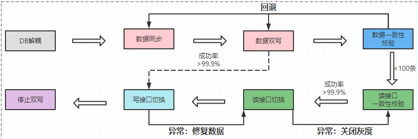
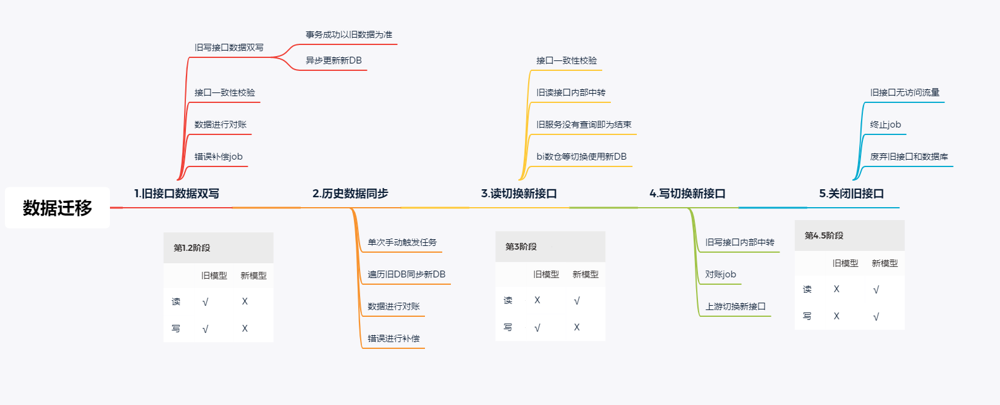
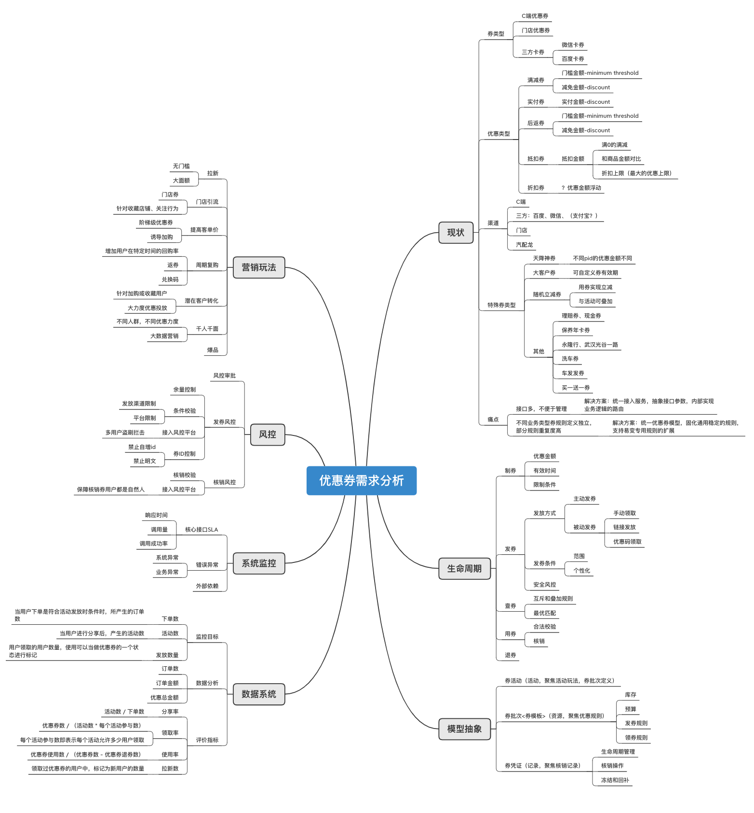
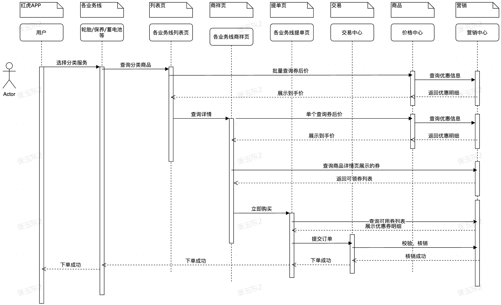
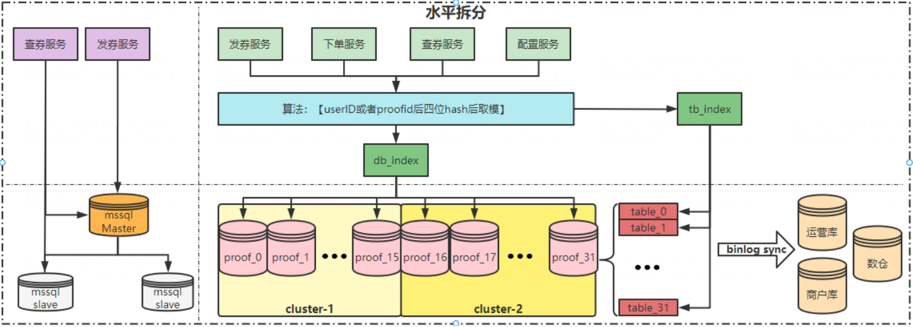
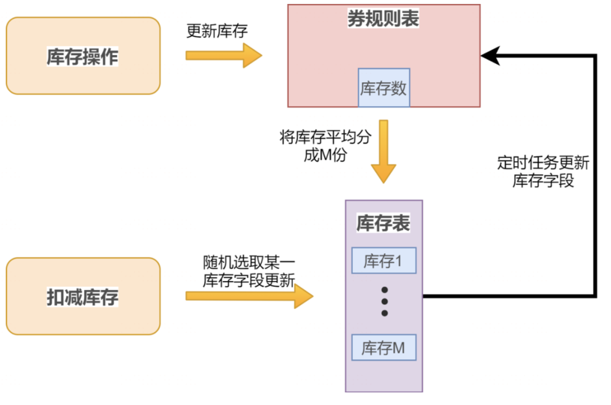
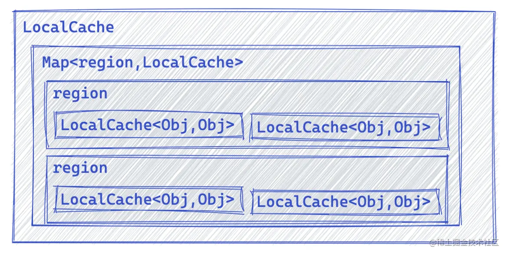
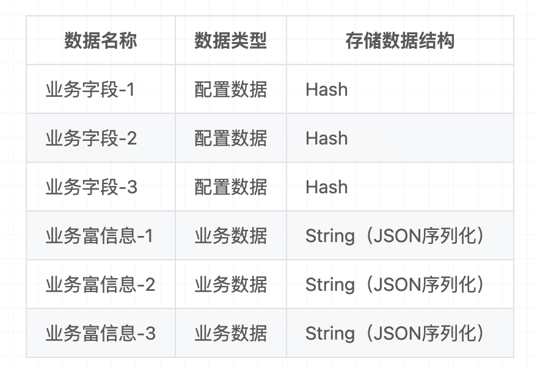

[转至元数据结尾](#page-metadata-end) [转至元数据起始](#page-metadata-start)

## 一、背景

### 业务介绍

优惠券是电商常见的营销手段，具有灵活的特点，既可以作为促销活动的载体，也是重要的引流入口。优惠券系统是途虎营销模块中一个重要组成部分，早在.Net语言开发优惠券单体应用时，优惠券就是其中核心模块之一。随着红虎的发展及用户量的提升，优惠券做了服务拆分，成立了独立的优惠券系统，提供通用的优惠券服务。目前，优惠券系统覆盖了优惠券的4个核心要点：创、发、用、计。

- **“创”** 指优惠券的创建，包含各种券规则和使用门槛的配置。
- **“发”** 指优惠券的发放，优惠券系统提供了多种发放优惠券的方式，满足针对不同人群的主动发放和被动发放。
- **“用”** 指优惠券的使用，包括正向购买商品及反向退款后的优惠券回退。
- **“计”** 指优惠券的统计，包括优惠券的发放数量、使用数量、使用商品等数据汇总。

### 复杂度

- 平台：门店券、C端券、汽配龙、大客户
- 业务线：车品、保养、轮胎、轮毂、蓄电池等
- 类型：满减券、抵扣券、 **实付券** 、折扣券、实物券成本分摊：公司和门店、公司内部集团、公司内部业务线、公司内部部门
- 优惠方式：优惠券 OR 加价券
- 使用范围：商品券、运费券、支付券
- 核心流程：配券→ 发券→ （可用商品）搜索列表→ 商详页→购物车→ 提单页→ 核销→ 回退→ 财务入账
- 发放：领取下单、预发券、算法发券、下单返券
- 使用：价格前置、活动互斥或叠加、多张券组合使用、改单或部分取消、财务核算
- 其他：数据一致性(交易、库存、资格)、监控告警、生命周期、三方券码（微信卡券、支付宝卡、抖音码）
- 影响玩法：引流、拉新、复购
- 数据指标：领取率、券核销率、订单核销率、券回退率、订单回退率、用券优惠总金额、用券总成交额、费效比、用券笔单价、拉新数(所有这些指标可以根据渠道、业务线进行细分统计)
- 提升订单转换率：【价格前置、到期提醒、组合售卖、算法发券】

### 使用场景

|--------领券--------|--------列表--------|--------商详--------|-------提单页-------|--------列表--------|------订单详情------|-----订单取消-----|


整个链路是个漏斗模型，越往后流量越小。

价格前置，提升订单转换率。

### 优惠活动异同

优惠分为两种：优惠券和活动![[Pasted image 20260630021224.png]]

<table><colgroup><col> <col> <col> <col> <col> <col> <col> <col> <col> <col> <col> <col></colgroup><tbody><tr><th rowspan="2">优惠类型</th><th rowspan="2">投放端</th><th colspan="4">准入门槛</th><th colspan="4">计算和展示</th><th rowspan="2">优惠奖励</th><th rowspan="2"><p>其他</p></th></tr><tr><th>领取行为</th><th>内部叠加</th><th>使用限制</th><th>时间限制</th><th>促销标签</th><th>牛皮癣</th><th>到手价</th><th>优惠计算顺序</th></tr><tr><th>会员价（活动）</th><td>C</td><td>购买会员</td><td>否</td><td>会员身份、部分商品</td><td>有：时间很长</td><td>否</td><td>否</td><td rowspan="6"><p>是</p></td><td rowspan="8"><p></p></td><td>金额</td><td>会员权益</td></tr><tr><th><p>打折（活动）</p></th><td><p>C</p></td><td>无需领取</td><td>否</td><td>部分商品</td><td>有：时间较短</td><td>是</td><td>是</td><td>金额</td><td>落地页凑单</td></tr><tr><th>秒杀（活动）</th><td>C</td><td>无需领取</td><td>否</td><td>部分商品</td><td>有：时间较短</td><td>是</td><td>是</td><td>金额</td><td>时间短，固定坑位展示</td></tr><tr><th>拼团（活动）</th><td>C</td><td>无需领取</td><td>否</td><td>部分商品</td><td>有：(成团)时间较短</td><td>是</td><td>否</td><td>金额</td><td>特殊入口，偏社区运营</td></tr><tr><th>赠品（活动）</th><td>C\B</td><td>无需领取</td><td>是</td><td>部分商品</td><td>有：时间较短</td><td>是</td><td>是</td><td>商品、返现、券</td><td>价值较低，或者绑定售卖</td></tr><tr><th>优惠券[优惠]</th><td>C\B</td><td>主动/被动</td><td>是</td><td>部分商品、全品类</td><td>有：时间较短</td><td>是</td><td>否</td><td>金额、实物</td><td>适合精细化运营，玩法多</td></tr><tr><th>红包[优惠]</th><td>C</td><td>主动领取</td><td>是</td><td>全品类</td><td>有：时间较短</td><td>否</td><td>否</td><td rowspan="2"><p>否</p></td><td>金额</td><td>金额较小、多次叠加</td></tr><tr><th>积分[优惠]</th><td>C</td><td>主动领取</td><td>是</td><td>全品类</td><td>有：时间很长</td><td>否</td><td>否</td><td>金额</td><td>金额较小，多次叠加</td></tr></tbody></table>

### 名词解释

优惠券有两个概念: **批次 和凭证** ：

- **券批次（Coupon Batch）**
	资源概念，对应运营发起的一次优惠券资源申请（领取条件， 使用条件），如同一个生产批次（production batch），作为发券凭证的母版或模板， **关注点在于优惠规则** 。
- **券凭证(Coupon Proof)**
	凭证概念，用于管理用户参与和使用某一优惠券批次的生命周期， **关注点在于核销**

> 就是运营投放一张券(券上配置有领取规则,使用规则, 如满100减10 块等)，比如库存有 100 张, 让用户去领 **凭证** ：用户点击运营投放的 优惠券领取, 自己账户多了一张券， 这时候用户看到的优惠券叫 **凭证** ：，此时 **批次** 的库存就 -1， 领券发券都是针对 **批次** 的,，用券核销券都是针对 **凭证** 的。

## 二、系统架构及变迁

### 背景

优惠券最开始是基于.Net语言开发的单库单表应用。随着红虎的不断发展，营销活动力度加大，优惠券使用场景增多，优惠券系统逐渐开始“力不从心”，暴露了很多问题：

- 海量优惠券的发放，达到优惠券单库、单表存储瓶颈。
- 随着场景使用的越来越多，接口的接口性能也越来越差，且影响到主链路到手价性能。
- 针对优惠券，促销活动，相关的圈品、库存、资格，技术层面没有沉淀通用能力。
- 公司技术语言体系开始从.Net转向Java，后续.Net服务维护更加困难。

为了解决以上问题，20年优惠券系统进行了重构，提供通用的优惠券领域服务，独立后的系统架构如下：

![[Pasted image 20260630021015.png]]

### 迁移流程

整个迁移里程碑如下：  


数据迁移是整个项目重构过程非常重重要的一步，主要分为：

- 数据双写，保障增量新老数据都存在
- 历史数据同步，保障历史数据同步成功
- 读接口切换，新老读接口一致性对账达到4个9，即可切换新读接口
- 写接口切换，新增数据对账达到4个9，即可切换新写接口
- 关闭老接口

整个过程中都十分依赖新老DB数据对账，因此增量对账速度，全量亿级别对账速度非常重要，本文不单独赘述，后续单独出文章，详细谈谈亿级别数据对账如何快速完成。



## 三、系统设计

### 需求分析



### 优惠券生命周期

![[Pasted image 20260630021255.png]]

### 领域划分

#### 概念和模型

- 券活动：活动概念， **关注点在于活动玩法** ，由相应的运营活动规则构成
- 券批次：资源概念，对应运营发起的一次优惠券资源申请（有限库存，有限成本预算），如同一个生产批次（production batch），作为发券凭证的母版或模板， **关注点在于优惠规则**
- 券凭证：凭证记录概念，用于管理用户参与和使用某一优惠券活动的生命周期， **关注点在于核销记录**

![[Pasted image 20260630021309.png]]

#### 限界上下文

在优惠券这个问题域中，优惠券被定义为一组优惠规则的集合，不管优惠形式或者活动玩法如何变化，最终都被分解为具体的优惠规则及其业务计算逻辑。

故规则子域为其核心域。

而规则本身并不能独立存在，而是作为一个整体归属于一种券类型的配置模板（券模板）中，再加上运营活动的配置细节（券模板参数），即构成了券批次（券模板+券模板参数）上下文，它也是核心域。所有券规则的计算、业务逻辑的执行、券凭证的作用和生效都源自于某一券批次的具体定义。

关键上下文的职责在于：

- 优惠规则上下文：优惠准入、价格计算、优惠计数等规则的定义和行为
- 券批次上下文：制券、发券、用券、退券的业务逻辑定义
- 券凭证上下文：维护券状态、记录核销记录

![[Pasted image 20260630021325.png]]
#### 上下文映射关系

**限界上下文之间的映射关系**

- 合作关系（Partnership）：两个上下文紧密合作的关系，一荣俱荣，一损俱损。
- 共享内核（Shared Kernel）：两个上下文依赖部分共享的模型。
- 客户方-供应方开发（Customer-Supplier Development）：上下文之间有组织的上下游依赖。
- 遵奉者（Conformist）：下游上下文只能盲目依赖上游上下文。
- 防腐层（Anticorruption Layer）：一个上下文通过一些适配和转换与另一个上下文交互。
- 开放主机服务（Open Host Service）：定义一种协议来让其他上下文来对本上下文进行访问。
- 发布语言（Published Language）：通常与OHS一起使用，用于定义开放主机的协议。

![[Pasted image 20260630021339.png]]

### 核心流程

#### 发券流程


#### 用券流程



### 数据模型

<svg style="left: 0px; top: 0px; width: 100%; height: 100%; display: block; min-width: 1220px; min-height: 572px; background-color: transparent; background-image: none;"><defs></defs><g transformorigin="0 0" transform="scale(0.98,0.98)translate(408,-32)"><g></g><g><g transform="translate(0.5,0.5)" style="visibility: visible;"><path d="M 385 87 L 385 61 L 545 61 L 545 87" fill="#dae8fc" stroke="#6c8ebf" stroke-miterlimit="10" pointer-events="all"></path><path d="M 385 87 L 385 195 L 545 195 L 545 87" fill="#ffffff" stroke="#6c8ebf" stroke-miterlimit="10" pointer-events="all"></path><path d="M 385 87 L 545 87" fill="none" stroke="white" stroke-miterlimit="10" pointer-events="stroke" visibility="hidden" stroke-width="9"></path><path d="M 385 87 L 545 87" fill="none" stroke="#6c8ebf" stroke-miterlimit="10" pointer-events="all"></path></g><g style=""><g fill="#000000" font-family="Helvetica" text-anchor="middle" font-size="14px"><text x="465" y="80">coupon_template</text></g></g> <g style="visibility: visible;"></g><g transform="translate(0.5,0.5)" style="visibility: visible;"><rect x="385" y="87" width="160" height="30" fill="none" stroke="white" pointer-events="stroke" visibility="hidden" stroke-width="9"></rect><rect x="385" y="87" width="160" height="30" fill="none" stroke="none" pointer-events="all"></rect><path d="M 385 87 M 545 87 M 545 117 L 385 117" fill="none" stroke="white" stroke-miterlimit="10" pointer-events="stroke" visibility="hidden" stroke-width="9"></path><path d="M 385 87 M 545 87 M 545 117 L 385 117" fill="none" stroke="#000000" stroke-miterlimit="10" pointer-events="all"></path></g><g style=""><clipPath id="mx-clip-419-87-122-30-0"><rect x="419" y="87" width="122" height="30"></rect></clipPath><g fill="#000000" font-family="Helvetica" font-weight="bold" text-decoration="underline" clip-path="url(https://wiki.tuhu.cn/pages/viewpage.action?pageId=514353651#mx-clip-419-87-122-30-0)" font-size="12px"><text x="421" y="107">券模板ID</text></g></g> <g transform="translate(0.5,0.5)" style="visibility: visible;"><rect x="385" y="87" width="30" height="30" fill="none" stroke="white" pointer-events="stroke" visibility="hidden" stroke-width="9"></rect><rect x="385" y="87" width="30" height="30" fill="none" stroke="none" pointer-events="all"></rect><path d="M 385 87 M 415 87 L 415 117 M 385 117" fill="none" stroke="white" stroke-miterlimit="10" pointer-events="stroke" visibility="hidden" stroke-width="9"></path><path d="M 385 87 M 415 87 L 415 117 M 385 117" fill="none" stroke="#000000" stroke-miterlimit="10" pointer-events="all"></path></g><g style=""><clipPath id="mx-clip-389-87-22-30-0"><rect x="389" y="87" width="22" height="30"></rect></clipPath><g fill="#000000" font-family="Helvetica" clip-path="url(https://wiki.tuhu.cn/pages/viewpage.action?pageId=514353651#mx-clip-389-87-22-30-0)" font-size="12px"><text x="391" y="107">PK</text></g></g> <g transform="translate(0.5,0.5)" style="visibility: visible;"><rect x="385" y="117" width="160" height="26" fill="none" stroke="white" pointer-events="stroke" visibility="hidden" stroke-width="9"></rect><rect x="385" y="117" width="160" height="26" fill="none" stroke="none" pointer-events="all"></rect><path d="M 385 117 M 545 117 M 545 143 M 385 143" fill="none" stroke="white" stroke-miterlimit="10" pointer-events="stroke" visibility="hidden" stroke-width="9"></path><path d="M 385 117 M 545 117 M 545 143 M 385 143" fill="none" stroke="#000000" stroke-miterlimit="10" pointer-events="all"></path></g><g style=""><clipPath id="mx-clip-419-122-122-26-0"><rect x="419" y="122" width="122" height="26"></rect></clipPath><g fill="#000000" font-family="Helvetica" clip-path="url(https://wiki.tuhu.cn/pages/viewpage.action?pageId=514353651#mx-clip-419-122-122-26-0)" font-size="12px"><text x="421" y="135">券模板名称</text></g></g> <g transform="translate(0.5,0.5)" style="visibility: visible;"><rect x="385" y="117" width="30" height="26" fill="none" stroke="white" pointer-events="stroke" visibility="hidden" stroke-width="9"></rect><rect x="385" y="117" width="30" height="26" fill="none" stroke="none" pointer-events="all"></rect><path d="M 385 117 M 415 117 L 415 143 M 385 143" fill="none" stroke="white" stroke-miterlimit="10" pointer-events="stroke" visibility="hidden" stroke-width="9"></path><path d="M 385 117 M 415 117 L 415 143 M 385 143" fill="none" stroke="#000000" stroke-miterlimit="10" pointer-events="all"></path></g><g transform="translate(0.5,0.5)" style="visibility: visible;"><rect x="385" y="143" width="160" height="26" fill="none" stroke="white" pointer-events="stroke" visibility="hidden" stroke-width="9"></rect><rect x="385" y="143" width="160" height="26" fill="none" stroke="none" pointer-events="all"></rect><path d="M 385 143 M 545 143 M 545 169 M 385 169" fill="none" stroke="white" stroke-miterlimit="10" pointer-events="stroke" visibility="hidden" stroke-width="9"></path><path d="M 385 143 M 545 143 M 545 169 M 385 169" fill="none" stroke="#000000" stroke-miterlimit="10" pointer-events="all"></path></g><g style=""><clipPath id="mx-clip-419-148-122-26-0"><rect x="419" y="148" width="122" height="26"></rect></clipPath><g fill="#000000" font-family="Helvetica" clip-path="url(https://wiki.tuhu.cn/pages/viewpage.action?pageId=514353651#mx-clip-419-148-122-26-0)" font-size="12px"><text x="421" y="161">限定平台</text></g></g> <g transform="translate(0.5,0.5)" style="visibility: visible;"><rect x="385" y="143" width="30" height="26" fill="none" stroke="white" pointer-events="stroke" visibility="hidden" stroke-width="9"></rect><rect x="385" y="143" width="30" height="26" fill="none" stroke="none" pointer-events="all"></rect><path d="M 385 143 M 415 143 L 415 169 M 385 169" fill="none" stroke="white" stroke-miterlimit="10" pointer-events="stroke" visibility="hidden" stroke-width="9"></path><path d="M 385 143 M 415 143 L 415 169 M 385 169" fill="none" stroke="#000000" stroke-miterlimit="10" pointer-events="all"></path></g><g transform="translate(0.5,0.5)" style="visibility: visible;"><rect x="385" y="169" width="160" height="26" fill="none" stroke="white" pointer-events="stroke" visibility="hidden" stroke-width="9"></rect><rect x="385" y="169" width="160" height="26" fill="none" stroke="none" pointer-events="all"></rect><path d="M 385 169 M 545 169 M 545 195 M 385 195" fill="none" stroke="white" stroke-miterlimit="10" pointer-events="stroke" visibility="hidden" stroke-width="9"></path><path d="M 385 169 M 545 169 M 545 195 M 385 195" fill="none" stroke="#000000" stroke-miterlimit="10" pointer-events="all"></path></g><g style=""><clipPath id="mx-clip-419-174-122-26-0"><rect x="419" y="174" width="122" height="26"></rect></clipPath><g fill="#000000" font-family="Helvetica" clip-path="url(https://wiki.tuhu.cn/pages/viewpage.action?pageId=514353651#mx-clip-419-174-122-26-0)" font-size="12px"><text x="421" y="187">渠道</text></g></g> <g transform="translate(0.5,0.5)" style="visibility: visible;"><rect x="385" y="169" width="30" height="26" fill="none" stroke="white" pointer-events="stroke" visibility="hidden" stroke-width="9"></rect><rect x="385" y="169" width="30" height="26" fill="none" stroke="none" pointer-events="all"></rect><path d="M 385 169 M 415 169 L 415 195 M 385 195" fill="none" stroke="white" stroke-miterlimit="10" pointer-events="stroke" visibility="hidden" stroke-width="9"></path><path d="M 385 169 M 415 169 L 415 195 M 385 195" fill="none" stroke="#000000" stroke-miterlimit="10" pointer-events="all"></path></g><g transform="translate(0.5,0.5)" style="visibility: visible;"><path d="M 385 485 L 385 459 L 545 459 L 545 485" fill="#dae8fc" stroke="#6c8ebf" stroke-miterlimit="10" pointer-events="all"></path><path d="M 385 485 L 385 593 L 545 593 L 545 485" fill="#ffffff" stroke="#6c8ebf" stroke-miterlimit="10" pointer-events="all"></path><path d="M 385 485 L 545 485" fill="none" stroke="white" stroke-miterlimit="10" pointer-events="stroke" visibility="hidden" stroke-width="9"></path><path d="M 385 485 L 545 485" fill="none" stroke="#6c8ebf" stroke-miterlimit="10" pointer-events="all"></path></g><g style=""><g fill="#000000" font-family="Helvetica" text-anchor="middle" font-size="14px"><text x="465" y="478">coupon_proof</text></g></g> <g style="visibility: visible;"></g><g transform="translate(0.5,0.5)" style="visibility: visible;"><rect x="385" y="485" width="160" height="30" fill="none" stroke="white" pointer-events="stroke" visibility="hidden" stroke-width="9"></rect><rect x="385" y="485" width="160" height="30" fill="none" stroke="none" pointer-events="all"></rect><path d="M 385 485 M 545 485 M 545 515 L 385 515" fill="none" stroke="white" stroke-miterlimit="10" pointer-events="stroke" visibility="hidden" stroke-width="9"></path><path d="M 385 485 M 545 485 M 545 515 L 385 515" fill="none" stroke="#000000" stroke-miterlimit="10" pointer-events="all"></path></g><g style=""><clipPath id="mx-clip-419-485-122-30-0"><rect x="419" y="485" width="122" height="30"></rect></clipPath><g fill="#000000" font-family="Helvetica" font-weight="bold" text-decoration="underline" clip-path="url(https://wiki.tuhu.cn/pages/viewpage.action?pageId=514353651#mx-clip-419-485-122-30-0)" font-size="12px"><text x="421" y="505">券凭证ID</text></g></g> <g transform="translate(0.5,0.5)" style="visibility: visible;"><rect x="385" y="485" width="30" height="30" fill="none" stroke="white" pointer-events="stroke" visibility="hidden" stroke-width="9"></rect><rect x="385" y="485" width="30" height="30" fill="none" stroke="none" pointer-events="all"></rect><path d="M 385 485 M 415 485 L 415 515 M 385 515" fill="none" stroke="white" stroke-miterlimit="10" pointer-events="stroke" visibility="hidden" stroke-width="9"></path><path d="M 385 485 M 415 485 L 415 515 M 385 515" fill="none" stroke="#000000" stroke-miterlimit="10" pointer-events="all"></path></g><g style=""><clipPath id="mx-clip-389-485-22-30-0"><rect x="389" y="485" width="22" height="30"></rect></clipPath><g fill="#000000" font-family="Helvetica" clip-path="url(https://wiki.tuhu.cn/pages/viewpage.action?pageId=514353651#mx-clip-389-485-22-30-0)" font-size="12px"><text x="391" y="505">PK</text></g></g> <g transform="translate(0.5,0.5)" style="visibility: visible;"><rect x="385" y="515" width="160" height="26" fill="none" stroke="white" pointer-events="stroke" visibility="hidden" stroke-width="9"></rect><rect x="385" y="515" width="160" height="26" fill="none" stroke="none" pointer-events="all"></rect><path d="M 385 515 M 545 515 M 545 541 M 385 541" fill="none" stroke="white" stroke-miterlimit="10" pointer-events="stroke" visibility="hidden" stroke-width="9"></path><path d="M 385 515 M 545 515 M 545 541 M 385 541" fill="none" stroke="#000000" stroke-miterlimit="10" pointer-events="all"></path></g><g style=""><clipPath id="mx-clip-419-520-122-26-0"><rect x="419" y="520" width="122" height="26"></rect></clipPath><g fill="#000000" font-family="Helvetica" clip-path="url(https://wiki.tuhu.cn/pages/viewpage.action?pageId=514353651#mx-clip-419-520-122-26-0)" font-size="12px"><text x="421" y="533">状态</text></g></g> <g transform="translate(0.5,0.5)" style="visibility: visible;"><rect x="385" y="515" width="30" height="26" fill="none" stroke="white" pointer-events="stroke" visibility="hidden" stroke-width="9"></rect><rect x="385" y="515" width="30" height="26" fill="none" stroke="none" pointer-events="all"></rect><path d="M 385 515 M 415 515 L 415 541 M 385 541" fill="none" stroke="white" stroke-miterlimit="10" pointer-events="stroke" visibility="hidden" stroke-width="9"></path><path d="M 385 515 M 415 515 L 415 541 M 385 541" fill="none" stroke="#000000" stroke-miterlimit="10" pointer-events="all"></path></g><g transform="translate(0.5,0.5)" style="visibility: visible;"><rect x="385" y="541" width="160" height="26" fill="none" stroke="white" pointer-events="stroke" visibility="hidden" stroke-width="9"></rect><rect x="385" y="541" width="160" height="26" fill="none" stroke="none" pointer-events="all"></rect><path d="M 385 541 M 545 541 M 545 567 M 385 567" fill="none" stroke="white" stroke-miterlimit="10" pointer-events="stroke" visibility="hidden" stroke-width="9"></path><path d="M 385 541 M 545 541 M 545 567 M 385 567" fill="none" stroke="#000000" stroke-miterlimit="10" pointer-events="all"></path></g><g style=""><clipPath id="mx-clip-419-546-122-26-0"><rect x="419" y="546" width="122" height="26"></rect></clipPath><g fill="#000000" font-family="Helvetica" clip-path="url(https://wiki.tuhu.cn/pages/viewpage.action?pageId=514353651#mx-clip-419-546-122-26-0)" font-size="12px"><text x="421" y="559">用户ID</text></g></g> <g transform="translate(0.5,0.5)" style="visibility: visible;"><rect x="385" y="541" width="30" height="26" fill="none" stroke="white" pointer-events="stroke" visibility="hidden" stroke-width="9"></rect><rect x="385" y="541" width="30" height="26" fill="none" stroke="none" pointer-events="all"></rect><path d="M 385 541 M 415 541 L 415 567 M 385 567" fill="none" stroke="white" stroke-miterlimit="10" pointer-events="stroke" visibility="hidden" stroke-width="9"></path><path d="M 385 541 M 415 541 L 415 567 M 385 567" fill="none" stroke="#000000" stroke-miterlimit="10" pointer-events="all"></path></g><g transform="translate(0.5,0.5)" style="visibility: visible;"><rect x="385" y="567" width="160" height="26" fill="none" stroke="white" pointer-events="stroke" visibility="hidden" stroke-width="9"></rect><rect x="385" y="567" width="160" height="26" fill="none" stroke="none" pointer-events="all"></rect><path d="M 385 567 M 545 567 M 545 593 M 385 593" fill="none" stroke="white" stroke-miterlimit="10" pointer-events="stroke" visibility="hidden" stroke-width="9"></path><path d="M 385 567 M 545 567 M 545 593 M 385 593" fill="none" stroke="#000000" stroke-miterlimit="10" pointer-events="all"></path></g><g style=""><clipPath id="mx-clip-419-572-122-26-0"><rect x="419" y="572" width="122" height="26"></rect></clipPath><g fill="#000000" font-family="Helvetica" clip-path="url(https://wiki.tuhu.cn/pages/viewpage.action?pageId=514353651#mx-clip-419-572-122-26-0)" font-size="12px"><text x="421" y="585">订单ID</text></g></g><g transform="translate(0.5,0.5)" style="visibility: visible;"><rect x="385" y="567" width="30" height="26" fill="none" stroke="white" pointer-events="stroke" visibility="hidden" stroke-width="9"></rect><rect x="385" y="567" width="30" height="26" fill="none" stroke="none" pointer-events="all"></rect><path d="M 385 567 M 415 567 L 415 593 M 385 593" fill="none" stroke="white" stroke-miterlimit="10" pointer-events="stroke" visibility="hidden" stroke-width="9"></path><path d="M 385 567 M 415 567 L 415 593 M 385 593" fill="none" stroke="#000000" stroke-miterlimit="10" pointer-events="all"></path></g><g transform="translate(0.5,0.5)" style="visibility: visible;"><path d="M 385 301 L 375 301 Q 365 301 365 311 L 365 480 Q 365 490 375 490 L 385 490" fill="none" stroke="white" stroke-miterlimit="10" pointer-events="stroke" visibility="hidden" stroke-width="9"></path><path d="M 385 301 L 375 301 Q 365 301 365 311 L 365 480 Q 365 490 375 490 L 385 490" fill="none" stroke="#000000" stroke-miterlimit="10" pointer-events="stroke"></path><path d="M 377 494 L 377 486 M 385 486 L 377 490 L 385 494" fill="none" stroke="white" stroke-miterlimit="10" pointer-events="stroke" visibility="hidden" stroke-width="9"></path><path d="M 377 494 L 377 486 M 385 486 L 377 490 L 385 494" fill="none" stroke="#000000" stroke-miterlimit="10" pointer-events="all"></path></g><g transform="translate(0.5,0.5)" style="visibility: visible;"><rect x="385" y="40" width="160" height="20" fill="none" stroke="white" pointer-events="stroke" visibility="hidden" stroke-width="9"></rect><rect x="385" y="40" width="160" height="20" fill="none" stroke="none" pointer-events="all"></rect></g><g style=""><g><foreignObject style="overflow: visible; text-align: left;" pointer-events="none" width="100%" height="100%"><div style="display: flex; align-items: unsafe center; justify-content: unsafe center; width: 158px; height: 1px; padding-top: 50px; margin-left: 386px;"><div style="box-sizing: border-box; font-size: 0; text-align: center; "><div style="display: inline-block; font-size: 12px; font-family: Helvetica; color: #000000; line-height: 1.2; pointer-events: all; white-space: normal; word-wrap: normal; "><font style="font-size: 15px">优惠券模板基础信息表</font></div></div></div></foreignObject></g></g><g transform="translate(0.5,0.5)" style="visibility: visible;"><path d="M 625 87 L 625 61 L 785 61 L 785 87" fill="#dae8fc" stroke="#6c8ebf" stroke-miterlimit="10" pointer-events="all"></path><path d="M 625 87 L 625 181 L 785 181 L 785 87" fill="#ffffff" stroke="#6c8ebf" stroke-miterlimit="10" pointer-events="all"></path><path d="M 625 87 L 785 87" fill="none" stroke="white" stroke-miterlimit="10" pointer-events="stroke" visibility="hidden" stroke-width="9"></path><path d="M 625 87 L 785 87" fill="none" stroke="#6c8ebf" stroke-miterlimit="10" pointer-events="all"></path></g><g style=""><g fill="#000000" font-family="Helvetica" text-anchor="middle" font-size="14px"><text x="705" y="80">coupon_template_spec</text></g></g> <g style="visibility: visible;"></g><g transform="translate(0.5,0.5)" style="visibility: visible;"><rect x="625" y="87" width="160" height="30" fill="none" stroke="white" pointer-events="stroke" visibility="hidden" stroke-width="9"></rect><rect x="625" y="87" width="160" height="30" fill="none" stroke="none" pointer-events="all"></rect><path d="M 625 87 M 785 87 M 785 117 M 625 117" fill="none" stroke="white" stroke-miterlimit="10" pointer-events="stroke" visibility="hidden" stroke-width="9"></path><path d="M 625 87 M 785 87 M 785 117 M 625 117" fill="none" stroke="#000000" stroke-miterlimit="10" pointer-events="all"></path></g><g style=""><clipPath id="mx-clip-685-87-96-30-0"><rect x="685" y="87" width="96" height="30"></rect></clipPath><g fill="#000000" font-family="Helvetica" font-weight="bold" text-decoration="underline" clip-path="url(https://wiki.tuhu.cn/pages/viewpage.action?pageId=514353651#mx-clip-685-87-96-30-0)" font-size="12px"><text x="687" y="107">券模板ID</text></g></g> <g transform="translate(0.5,0.5)" style="visibility: visible;"><rect x="625" y="87" width="56" height="30" fill="none" stroke="white" pointer-events="stroke" visibility="hidden" stroke-width="9"></rect><rect x="625" y="87" width="56" height="30" fill="none" stroke="none" pointer-events="all"></rect><path d="M 625 87 M 681 87 L 681 117 M 625 117" fill="none" stroke="white" stroke-miterlimit="10" pointer-events="stroke" visibility="hidden" stroke-width="9"></path><path d="M 625 87 M 681 87 L 681 117 M 625 117" fill="none" stroke="#000000" stroke-miterlimit="10" pointer-events="all"></path></g><g style=""><clipPath id="mx-clip-629-87-48-30-0"><rect x="629" y="87" width="48" height="30"></rect></clipPath><g fill="#000000" font-family="Helvetica" font-weight="bold" clip-path="url(https://wiki.tuhu.cn/pages/viewpage.action?pageId=514353651#mx-clip-629-87-48-30-0)" font-size="12px"><text x="631" y="107">PK1</text></g></g> <g transform="translate(0.5,0.5)" style="visibility: visible;"><rect x="625" y="117" width="160" height="30" fill="none" stroke="white" pointer-events="stroke" visibility="hidden" stroke-width="9"></rect><rect x="625" y="117" width="160" height="30" fill="none" stroke="none" pointer-events="all"></rect><path d="M 625 117 M 785 117 M 785 147 L 625 147" fill="none" stroke="white" stroke-miterlimit="10" pointer-events="stroke" visibility="hidden" stroke-width="9"></path><path d="M 625 117 M 785 117 M 785 147 L 625 147" fill="none" stroke="#000000" stroke-miterlimit="10" pointer-events="all"></path></g><g style=""><clipPath id="mx-clip-685-117-96-30-0"><rect x="685" y="117" width="96" height="30"></rect></clipPath><g fill="#000000" font-family="Helvetica" font-weight="bold" text-decoration="underline" clip-path="url(https://wiki.tuhu.cn/pages/viewpage.action?pageId=514353651#mx-clip-685-117-96-30-0)" font-size="12px"><text x="687" y="137">规格ID</text></g></g> <g transform="translate(0.5,0.5)" style="visibility: visible;"><rect x="625" y="117" width="56" height="30" fill="none" stroke="white" pointer-events="stroke" visibility="hidden" stroke-width="9"></rect><rect x="625" y="117" width="56" height="30" fill="none" stroke="none" pointer-events="all"></rect><path d="M 625 117 M 681 117 L 681 147 M 625 147" fill="none" stroke="white" stroke-miterlimit="10" pointer-events="stroke" visibility="hidden" stroke-width="9"></path><path d="M 625 117 M 681 117 L 681 147 M 625 147" fill="none" stroke="#000000" stroke-miterlimit="10" pointer-events="all"></path></g><g style=""><clipPath id="mx-clip-629-117-48-30-0"><rect x="629" y="117" width="48" height="30"></rect></clipPath><g fill="#000000" font-family="Helvetica" font-weight="bold" clip-path="url(https://wiki.tuhu.cn/pages/viewpage.action?pageId=514353651#mx-clip-629-117-48-30-0)" font-size="12px"><text x="631" y="137">PK2</text></g></g> <g transform="translate(0.5,0.5)" style="visibility: visible;"><rect x="625" y="147" width="160" height="34" fill="none" stroke="white" pointer-events="stroke" visibility="hidden" stroke-width="9"></rect><rect x="625" y="147" width="160" height="34" fill="none" stroke="none" pointer-events="all"></rect><path d="M 625 147 M 785 147 M 785 181 M 625 181" fill="none" stroke="white" stroke-miterlimit="10" pointer-events="stroke" visibility="hidden" stroke-width="9"></path><path d="M 625 147 M 785 147 M 785 181 M 625 181" fill="none" stroke="#000000" stroke-miterlimit="10" pointer-events="all"></path></g><g style=""><clipPath id="mx-clip-685-152-96-34-0"><rect x="685" y="152" width="96" height="34"></rect></clipPath><g fill="#000000" font-family="Helvetica" clip-path="url(https://wiki.tuhu.cn/pages/viewpage.action?pageId=514353651#mx-clip-685-152-96-34-0)" font-size="12px"><text x="687" y="165">应用场景</text></g></g><g transform="translate(0.5,0.5)" style="visibility: visible;"><rect x="625" y="147" width="56" height="34" fill="none" stroke="white" pointer-events="stroke" visibility="hidden" stroke-width="9"></rect><rect x="625" y="147" width="56" height="34" fill="none" stroke="none" pointer-events="all"></rect><path d="M 625 147 M 681 147 L 681 181 M 625 181" fill="none" stroke="white" stroke-miterlimit="10" pointer-events="stroke" visibility="hidden" stroke-width="9"></path><path d="M 625 147 M 681 147 L 681 181 M 625 181" fill="none" stroke="#000000" stroke-miterlimit="10" pointer-events="all"></path></g><g transform="translate(0.5,0.5)" style="visibility: visible;"><rect x="625" y="40" width="190" height="20" fill="none" stroke="white" pointer-events="stroke" visibility="hidden" stroke-width="9"></rect><rect x="625" y="40" width="190" height="20" fill="none" stroke="none" pointer-events="all"></rect></g><g style=""><g><foreignObject style="overflow: visible; text-align: left;" pointer-events="none" width="100%" height="100%"><div style="display: flex; align-items: unsafe center; justify-content: unsafe center; width: 188px; height: 1px; padding-top: 50px; margin-left: 626px;"><div style="box-sizing: border-box; font-size: 0; text-align: center; "><div style="display: inline-block; font-size: 12px; font-family: Helvetica; color: #000000; line-height: 1.2; pointer-events: all; white-space: normal; word-wrap: normal; "><font style="font-size: 15px">优惠券模板规格关系表(KV)</font></div></div></div></foreignObject></g></g><g transform="translate(0.5,0.5)" style="visibility: visible;"><rect x="625" y="240" width="160" height="20" fill="none" stroke="white" pointer-events="stroke" visibility="hidden" stroke-width="9"></rect><rect x="625" y="240" width="160" height="20" fill="none" stroke="none" pointer-events="all"></rect></g><g style=""><g><foreignObject style="overflow: visible; text-align: left;" pointer-events="none" width="100%" height="100%"><div style="display: flex; align-items: unsafe center; justify-content: unsafe center; width: 158px; height: 1px; padding-top: 250px; margin-left: 626px;"><div style="box-sizing: border-box; font-size: 0; text-align: center; "><div style="display: inline-block; font-size: 12px; font-family: Helvetica; color: #000000; line-height: 1.2; pointer-events: all; white-space: normal; word-wrap: normal; "><span style="font-size: 15px">券批次线上规则表(KV)</span></div></div></div></foreignObject></g></g><g transform="translate(0.5,0.5)" style="visibility: visible;"><rect x="395" y="430" width="120" height="20" fill="none" stroke="white" pointer-events="stroke" visibility="hidden" stroke-width="9"></rect><rect x="395" y="430" width="120" height="20" fill="none" stroke="none" pointer-events="all"></rect></g><g style=""><g><foreignObject style="overflow: visible; text-align: left;" pointer-events="none" width="100%" height="100%"><div style="display: flex; align-items: unsafe center; justify-content: unsafe center; width: 118px; height: 1px; padding-top: 440px; margin-left: 396px;"><div style="box-sizing: border-box; font-size: 0; text-align: center; "><div style="display: inline-block; font-size: 12px; font-family: Helvetica; color: #000000; line-height: 1.2; pointer-events: all; white-space: normal; word-wrap: normal; "><span style="font-size: 15px">券凭证表</span></div></div></div></foreignObject></g></g><g transform="translate(0.5,0.5)" style="visibility: visible;"><path d="M 625 485 L 625 459 L 785 459 L 785 485" fill="#dae8fc" stroke="#6c8ebf" stroke-miterlimit="10" pointer-events="all"></path><path d="M 625 485 L 625 593 L 785 593 L 785 485" fill="#ffffff" stroke="#6c8ebf" stroke-miterlimit="10" pointer-events="all"></path><path d="M 625 485 L 785 485" fill="none" stroke="white" stroke-miterlimit="10" pointer-events="stroke" visibility="hidden" stroke-width="9"></path><path d="M 625 485 L 785 485" fill="none" stroke="#6c8ebf" stroke-miterlimit="10" pointer-events="all"></path></g><g style=""><g fill="#000000" font-family="Helvetica" text-anchor="middle" font-size="14px"><text x="705" y="478">coupon_proof_log</text></g></g> <g style="visibility: visible;"></g><g transform="translate(0.5,0.5)" style="visibility: visible;"><rect x="625" y="485" width="160" height="30" fill="none" stroke="white" pointer-events="stroke" visibility="hidden" stroke-width="9"></rect><rect x="625" y="485" width="160" height="30" fill="none" stroke="none" pointer-events="all"></rect><path d="M 625 485 M 785 485 M 785 515 L 625 515" fill="none" stroke="white" stroke-miterlimit="10" pointer-events="stroke" visibility="hidden" stroke-width="9"></path><path d="M 625 485 M 785 485 M 785 515 L 625 515" fill="none" stroke="#000000" stroke-miterlimit="10" pointer-events="all"></path></g><g style=""><clipPath id="mx-clip-659-485-122-30-0"><rect x="659" y="485" width="122" height="30"></rect></clipPath><g fill="#000000" font-family="Helvetica" font-weight="bold" text-decoration="underline" clip-path="url(https://wiki.tuhu.cn/pages/viewpage.action?pageId=514353651#mx-clip-659-485-122-30-0)" font-size="12px"><text x="661" y="505">券凭证ID</text></g></g> <g transform="translate(0.5,0.5)" style="visibility: visible;"><rect x="625" y="485" width="30" height="30" fill="none" stroke="white" pointer-events="stroke" visibility="hidden" stroke-width="9"></rect><rect x="625" y="485" width="30" height="30" fill="none" stroke="none" pointer-events="all"></rect><path d="M 625 485 M 655 485 L 655 515 M 625 515" fill="none" stroke="white" stroke-miterlimit="10" pointer-events="stroke" visibility="hidden" stroke-width="9"></path><path d="M 625 485 M 655 485 L 655 515 M 625 515" fill="none" stroke="#000000" stroke-miterlimit="10" pointer-events="all"></path></g><g style=""><clipPath id="mx-clip-629-485-22-30-0"><rect x="629" y="485" width="22" height="30"></rect></clipPath><g fill="#000000" font-family="Helvetica" clip-path="url(https://wiki.tuhu.cn/pages/viewpage.action?pageId=514353651#mx-clip-629-485-22-30-0)" font-size="12px"><text x="631" y="505">PK</text></g></g> <g transform="translate(0.5,0.5)" style="visibility: visible;"><rect x="625" y="515" width="160" height="26" fill="none" stroke="white" pointer-events="stroke" visibility="hidden" stroke-width="9"></rect><rect x="625" y="515" width="160" height="26" fill="none" stroke="none" pointer-events="all"></rect><path d="M 625 515 M 785 515 M 785 541 M 625 541" fill="none" stroke="white" stroke-miterlimit="10" pointer-events="stroke" visibility="hidden" stroke-width="9"></path><path d="M 625 515 M 785 515 M 785 541 M 625 541" fill="none" stroke="#000000" stroke-miterlimit="10" pointer-events="all"></path></g><g style=""><clipPath id="mx-clip-659-520-122-26-0"><rect x="659" y="520" width="122" height="26"></rect></clipPath><g fill="#000000" font-family="Helvetica" clip-path="url(https://wiki.tuhu.cn/pages/viewpage.action?pageId=514353651#mx-clip-659-520-122-26-0)" font-size="12px"><text x="661" y="533">操作类型</text></g></g> <g transform="translate(0.5,0.5)" style="visibility: visible;"><rect x="625" y="515" width="30" height="26" fill="none" stroke="white" pointer-events="stroke" visibility="hidden" stroke-width="9"></rect><rect x="625" y="515" width="30" height="26" fill="none" stroke="none" pointer-events="all"></rect><path d="M 625 515 M 655 515 L 655 541 M 625 541" fill="none" stroke="white" stroke-miterlimit="10" pointer-events="stroke" visibility="hidden" stroke-width="9"></path><path d="M 625 515 M 655 515 L 655 541 M 625 541" fill="none" stroke="#000000" stroke-miterlimit="10" pointer-events="all"></path></g><g transform="translate(0.5,0.5)" style="visibility: visible;"><rect x="625" y="541" width="160" height="26" fill="none" stroke="white" pointer-events="stroke" visibility="hidden" stroke-width="9"></rect><rect x="625" y="541" width="160" height="26" fill="none" stroke="none" pointer-events="all"></rect><path d="M 625 541 M 785 541 M 785 567 M 625 567" fill="none" stroke="white" stroke-miterlimit="10" pointer-events="stroke" visibility="hidden" stroke-width="9"></path><path d="M 625 541 M 785 541 M 785 567 M 625 567" fill="none" stroke="#000000" stroke-miterlimit="10" pointer-events="all"></path></g><g style=""><clipPath id="mx-clip-659-546-122-26-0"><rect x="659" y="546" width="122" height="26"></rect></clipPath><g fill="#000000" font-family="Helvetica" clip-path="url(https://wiki.tuhu.cn/pages/viewpage.action?pageId=514353651#mx-clip-659-546-122-26-0)" font-size="12px"><text x="661" y="559">事件场景</text></g></g> <g transform="translate(0.5,0.5)" style="visibility: visible;"><rect x="625" y="541" width="30" height="26" fill="none" stroke="white" pointer-events="stroke" visibility="hidden" stroke-width="9"></rect><rect x="625" y="541" width="30" height="26" fill="none" stroke="none" pointer-events="all"></rect><path d="M 625 541 M 655 541 L 655 567 M 625 567" fill="none" stroke="white" stroke-miterlimit="10" pointer-events="stroke" visibility="hidden" stroke-width="9"></path><path d="M 625 541 M 655 541 L 655 567 M 625 567" fill="none" stroke="#000000" stroke-miterlimit="10" pointer-events="all"></path></g><g transform="translate(0.5,0.5)" style="visibility: visible;"><rect x="625" y="567" width="160" height="26" fill="none" stroke="white" pointer-events="stroke" visibility="hidden" stroke-width="9"></rect><rect x="625" y="567" width="160" height="26" fill="none" stroke="none" pointer-events="all"></rect><path d="M 625 567 M 785 567 M 785 593 M 625 593" fill="none" stroke="white" stroke-miterlimit="10" pointer-events="stroke" visibility="hidden" stroke-width="9"></path><path d="M 625 567 M 785 567 M 785 593 M 625 593" fill="none" stroke="#000000" stroke-miterlimit="10" pointer-events="all"></path></g><g style=""><clipPath id="mx-clip-659-572-122-26-0"><rect x="659" y="572" width="122" height="26"></rect></clipPath><g fill="#000000" font-family="Helvetica" clip-path="url(https://wiki.tuhu.cn/pages/viewpage.action?pageId=514353651#mx-clip-659-572-122-26-0)" font-size="12px"><text x="661" y="585">时间戳</text></g></g><g transform="translate(0.5,0.5)" style="visibility: visible;"><rect x="625" y="567" width="30" height="26" fill="none" stroke="white" pointer-events="stroke" visibility="hidden" stroke-width="9"></rect><rect x="625" y="567" width="30" height="26" fill="none" stroke="none" pointer-events="all"></rect><path d="M 625 567 M 655 567 L 655 593 M 625 593" fill="none" stroke="white" stroke-miterlimit="10" pointer-events="stroke" visibility="hidden" stroke-width="9"></path><path d="M 625 567 M 655 567 L 655 593 M 625 593" fill="none" stroke="#000000" stroke-miterlimit="10" pointer-events="all"></path></g><g transform="translate(0.5,0.5)" style="visibility: visible;"><rect x="635" y="430" width="120" height="20" fill="none" stroke="white" pointer-events="stroke" visibility="hidden" stroke-width="9"></rect><rect x="635" y="430" width="120" height="20" fill="none" stroke="none" pointer-events="all"></rect></g><g style=""><g><foreignObject style="overflow: visible; text-align: left;" pointer-events="none" width="100%" height="100%"><div style="display: flex; align-items: unsafe center; justify-content: unsafe center; width: 118px; height: 1px; padding-top: 440px; margin-left: 636px;"><div style="box-sizing: border-box; font-size: 0; text-align: center; "><div style="display: inline-block; font-size: 12px; font-family: Helvetica; color: #000000; line-height: 1.2; pointer-events: all; white-space: normal; word-wrap: normal; "><span style="font-size: 15px">券凭证日志表</span></div></div></div></foreignObject></g></g><g transform="translate(0.5,0.5)" style="visibility: visible;"><path d="M 545 500 L 625 500" fill="none" stroke="white" stroke-miterlimit="10" pointer-events="stroke" visibility="hidden" stroke-width="9"></path><path d="M 545 500 L 625 500" fill="none" stroke="#000000" stroke-miterlimit="10" pointer-events="stroke"></path><path d="M 617 504 L 617 496 M 625 496 L 617 500 L 625 504" fill="none" stroke="white" stroke-miterlimit="10" pointer-events="stroke" visibility="hidden" stroke-width="9"></path><path d="M 617 504 L 617 496 M 625 496 L 617 500 L 625 504" fill="none" stroke="#000000" stroke-miterlimit="10" pointer-events="all"></path></g><g transform="translate(0.5,0.5)" style="visibility: visible;"><path d="M 385 286 L 385 260 L 545 260 L 545 286" fill="#dae8fc" stroke="#6c8ebf" stroke-miterlimit="10" pointer-events="all"></path><path d="M 385 286 L 385 370 L 545 370 L 545 286" fill="#ffffff" stroke="#6c8ebf" stroke-miterlimit="10" pointer-events="all"></path><path d="M 385 286 L 545 286" fill="none" stroke="white" stroke-miterlimit="10" pointer-events="stroke" visibility="hidden" stroke-width="9"></path><path d="M 385 286 L 545 286" fill="none" stroke="#6c8ebf" stroke-miterlimit="10" pointer-events="all"></path></g><g style=""><g fill="#000000" font-family="Helvetica" text-anchor="middle" font-size="14px"><text x="465" y="279">coupon_batch_base</text></g></g> <g style="visibility: visible;"></g><g transform="translate(0.5,0.5)" style="visibility: visible;"><rect x="385" y="286" width="160" height="30" fill="none" stroke="white" pointer-events="stroke" visibility="hidden" stroke-width="9"></rect><rect x="385" y="286" width="160" height="30" fill="none" stroke="none" pointer-events="all"></rect><path d="M 385 286 M 545 286 M 545 316 L 385 316" fill="none" stroke="white" stroke-miterlimit="10" pointer-events="stroke" visibility="hidden" stroke-width="9"></path><path d="M 385 286 M 545 286 M 545 316 L 385 316" fill="none" stroke="#000000" stroke-miterlimit="10" pointer-events="all"></path></g><g style=""><clipPath id="mx-clip-419-286-122-30-0"><rect x="419" y="286" width="122" height="30"></rect></clipPath><g fill="#000000" font-family="Helvetica" font-weight="bold" text-decoration="underline" clip-path="url(https://wiki.tuhu.cn/pages/viewpage.action?pageId=514353651#mx-clip-419-286-122-30-0)" font-size="12px"><text x="421" y="306">券批次ID</text></g></g> <g transform="translate(0.5,0.5)" style="visibility: visible;"><rect x="385" y="286" width="30" height="30" fill="none" stroke="white" pointer-events="stroke" visibility="hidden" stroke-width="9"></rect><rect x="385" y="286" width="30" height="30" fill="none" stroke="none" pointer-events="all"></rect><path d="M 385 286 M 415 286 L 415 316 M 385 316" fill="none" stroke="white" stroke-miterlimit="10" pointer-events="stroke" visibility="hidden" stroke-width="9"></path><path d="M 385 286 M 415 286 L 415 316 M 385 316" fill="none" stroke="#000000" stroke-miterlimit="10" pointer-events="all"></path></g><g style=""><clipPath id="mx-clip-389-286-22-30-0"><rect x="389" y="286" width="22" height="30"></rect></clipPath><g fill="#000000" font-family="Helvetica" clip-path="url(https://wiki.tuhu.cn/pages/viewpage.action?pageId=514353651#mx-clip-389-286-22-30-0)" font-size="12px"><text x="391" y="306">PK</text></g></g> <g transform="translate(0.5,0.5)" style="visibility: visible;"><rect x="385" y="316" width="160" height="26" fill="none" stroke="white" pointer-events="stroke" visibility="hidden" stroke-width="9"></rect><rect x="385" y="316" width="160" height="26" fill="none" stroke="none" pointer-events="all"></rect><path d="M 385 316 M 545 316 M 545 342 M 385 342" fill="none" stroke="white" stroke-miterlimit="10" pointer-events="stroke" visibility="hidden" stroke-width="9"></path><path d="M 385 316 M 545 316 M 545 342 M 385 342" fill="none" stroke="#000000" stroke-miterlimit="10" pointer-events="all"></path></g><g style=""><clipPath id="mx-clip-419-321-122-26-0"><rect x="419" y="321" width="122" height="26"></rect></clipPath><g fill="#000000" font-family="Helvetica" clip-path="url(https://wiki.tuhu.cn/pages/viewpage.action?pageId=514353651#mx-clip-419-321-122-26-0)" font-size="12px"><text x="421" y="334">券模板ID</text></g></g> <g transform="translate(0.5,0.5)" style="visibility: visible;"><rect x="385" y="316" width="30" height="26" fill="none" stroke="white" pointer-events="stroke" visibility="hidden" stroke-width="9"></rect><rect x="385" y="316" width="30" height="26" fill="none" stroke="none" pointer-events="all"></rect><path d="M 385 316 M 415 316 L 415 342 M 385 342" fill="none" stroke="white" stroke-miterlimit="10" pointer-events="stroke" visibility="hidden" stroke-width="9"></path><path d="M 385 316 M 415 316 L 415 342 M 385 342" fill="none" stroke="#000000" stroke-miterlimit="10" pointer-events="all"></path></g><g transform="translate(0.5,0.5)" style="visibility: visible;"><rect x="385" y="342" width="160" height="28" fill="none" stroke="white" pointer-events="stroke" visibility="hidden" stroke-width="9"></rect><rect x="385" y="342" width="160" height="28" fill="none" stroke="none" pointer-events="all"></rect><path d="M 385 342 M 545 342 M 545 370 M 385 370" fill="none" stroke="white" stroke-miterlimit="10" pointer-events="stroke" visibility="hidden" stroke-width="9"></path><path d="M 385 342 M 545 342 M 545 370 M 385 370" fill="none" stroke="#000000" stroke-miterlimit="10" pointer-events="all"></path></g><g style=""><clipPath id="mx-clip-419-347-122-28-0"><rect x="419" y="347" width="122" height="28"></rect></clipPath><g fill="#000000" font-family="Helvetica" clip-path="url(https://wiki.tuhu.cn/pages/viewpage.action?pageId=514353651#mx-clip-419-347-122-28-0)" font-size="12px"><text x="421" y="360">券批次库存</text></g></g><g transform="translate(0.5,0.5)" style="visibility: visible;"><rect x="385" y="342" width="30" height="28" fill="none" stroke="white" pointer-events="stroke" visibility="hidden" stroke-width="9"></rect><rect x="385" y="342" width="30" height="28" fill="none" stroke="none" pointer-events="all"></rect><path d="M 385 342 M 415 342 L 415 370 M 385 370" fill="none" stroke="white" stroke-miterlimit="10" pointer-events="stroke" visibility="hidden" stroke-width="9"></path><path d="M 385 342 M 415 342 L 415 370 M 385 370" fill="none" stroke="#000000" stroke-miterlimit="10" pointer-events="all"></path></g><g transform="translate(0.5,0.5)" style="visibility: visible;"><rect x="385" y="240" width="140" height="20" fill="none" stroke="white" pointer-events="stroke" visibility="hidden" stroke-width="9"></rect><rect x="385" y="240" width="140" height="20" fill="none" stroke="none" pointer-events="all"></rect></g><g style=""><g><foreignObject style="overflow: visible; text-align: left;" pointer-events="none" width="100%" height="100%"><div style="display: flex; align-items: unsafe center; justify-content: unsafe center; width: 138px; height: 1px; padding-top: 250px; margin-left: 386px;"><div style="box-sizing: border-box; font-size: 0; text-align: center; "><div style="display: inline-block; font-size: 12px; font-family: Helvetica; color: #000000; line-height: 1.2; pointer-events: all; white-space: normal; word-wrap: normal; "><span style="font-size: 15px">券批次线上主表</span></div></div></div></foreignObject></g></g><g transform="translate(0.5,0.5)" style="visibility: visible;"><path d="M 625 286 L 625 260 L 785 260 L 785 286" fill="#fff2cc" stroke="#d6b656" stroke-miterlimit="10" pointer-events="all"></path><path d="M 625 286 L 625 414 L 785 414 L 785 286" fill="#ffffff" stroke="#d6b656" stroke-miterlimit="10" pointer-events="all"></path><path d="M 625 286 L 785 286" fill="none" stroke="white" stroke-miterlimit="10" pointer-events="stroke" visibility="hidden" stroke-width="9"></path><path d="M 625 286 L 785 286" fill="none" stroke="#d6b656" stroke-miterlimit="10" pointer-events="all"></path></g><g style=""><g fill="#000000" font-family="Helvetica" text-anchor="middle" font-size="14px"><text x="705" y="279">coupon_batch_spec</text></g></g> <g style="visibility: visible;"></g><g transform="translate(0.5,0.5)" style="visibility: visible;"><rect x="625" y="286" width="160" height="30" fill="none" stroke="white" pointer-events="stroke" visibility="hidden" stroke-width="9"></rect><rect x="625" y="286" width="160" height="30" fill="none" stroke="none" pointer-events="all"></rect><path d="M 625 286 M 785 286 M 785 316 M 625 316" fill="none" stroke="white" stroke-miterlimit="10" pointer-events="stroke" visibility="hidden" stroke-width="9"></path><path d="M 625 286 M 785 286 M 785 316 M 625 316" fill="none" stroke="#000000" stroke-miterlimit="10" pointer-events="all"></path></g><g style=""><clipPath id="mx-clip-685-286-96-30-0"><rect x="685" y="286" width="96" height="30"></rect></clipPath><g fill="#000000" font-family="Helvetica" font-weight="bold" text-decoration="underline" clip-path="url(https://wiki.tuhu.cn/pages/viewpage.action?pageId=514353651#mx-clip-685-286-96-30-0)" font-size="12px"><text x="687" y="306">券批次ID</text></g></g> <g transform="translate(0.5,0.5)" style="visibility: visible;"><rect x="625" y="286" width="56" height="30" fill="none" stroke="white" pointer-events="stroke" visibility="hidden" stroke-width="9"></rect><rect x="625" y="286" width="56" height="30" fill="none" stroke="none" pointer-events="all"></rect><path d="M 625 286 M 681 286 L 681 316 M 625 316" fill="none" stroke="white" stroke-miterlimit="10" pointer-events="stroke" visibility="hidden" stroke-width="9"></path><path d="M 625 286 M 681 286 L 681 316 M 625 316" fill="none" stroke="#000000" stroke-miterlimit="10" pointer-events="all"></path></g><g style=""><clipPath id="mx-clip-629-286-48-30-0"><rect x="629" y="286" width="48" height="30"></rect></clipPath><g fill="#000000" font-family="Helvetica" font-weight="bold" clip-path="url(https://wiki.tuhu.cn/pages/viewpage.action?pageId=514353651#mx-clip-629-286-48-30-0)" font-size="12px"><text x="631" y="306">PK1</text></g></g> <g transform="translate(0.5,0.5)" style="visibility: visible;"><rect x="625" y="316" width="160" height="30" fill="none" stroke="white" pointer-events="stroke" visibility="hidden" stroke-width="9"></rect><rect x="625" y="316" width="160" height="30" fill="none" stroke="none" pointer-events="all"></rect><path d="M 625 316 M 785 316 M 785 346 L 625 346" fill="none" stroke="white" stroke-miterlimit="10" pointer-events="stroke" visibility="hidden" stroke-width="9"></path><path d="M 625 316 M 785 316 M 785 346 L 625 346" fill="none" stroke="#000000" stroke-miterlimit="10" pointer-events="all"></path></g><g style=""><clipPath id="mx-clip-685-316-96-30-0"><rect x="685" y="316" width="96" height="30"></rect></clipPath><g fill="#000000" font-family="Helvetica" font-weight="bold" text-decoration="underline" clip-path="url(https://wiki.tuhu.cn/pages/viewpage.action?pageId=514353651#mx-clip-685-316-96-30-0)" font-size="12px"><text x="687" y="336">规格ID</text></g></g> <g transform="translate(0.5,0.5)" style="visibility: visible;"><rect x="625" y="316" width="56" height="30" fill="none" stroke="white" pointer-events="stroke" visibility="hidden" stroke-width="9"></rect><rect x="625" y="316" width="56" height="30" fill="none" stroke="none" pointer-events="all"></rect><path d="M 625 316 M 681 316 L 681 346 M 625 346" fill="none" stroke="white" stroke-miterlimit="10" pointer-events="stroke" visibility="hidden" stroke-width="9"></path><path d="M 625 316 M 681 316 L 681 346 M 625 346" fill="none" stroke="#000000" stroke-miterlimit="10" pointer-events="all"></path></g><g style=""><clipPath id="mx-clip-629-316-48-30-0"><rect x="629" y="316" width="48" height="30"></rect></clipPath><g fill="#000000" font-family="Helvetica" font-weight="bold" clip-path="url(https://wiki.tuhu.cn/pages/viewpage.action?pageId=514353651#mx-clip-629-316-48-30-0)" font-size="12px"><text x="631" y="336">PK2</text></g></g> <g transform="translate(0.5,0.5)" style="visibility: visible;"><rect x="625" y="346" width="160" height="34" fill="none" stroke="white" pointer-events="stroke" visibility="hidden" stroke-width="9"></rect><rect x="625" y="346" width="160" height="34" fill="none" stroke="none" pointer-events="all"></rect><path d="M 625 346 M 785 346 M 785 380 M 625 380" fill="none" stroke="white" stroke-miterlimit="10" pointer-events="stroke" visibility="hidden" stroke-width="9"></path><path d="M 625 346 M 785 346 M 785 380 M 625 380" fill="none" stroke="#000000" stroke-miterlimit="10" pointer-events="all"></path></g><g style=""><clipPath id="mx-clip-685-351-96-34-0"><rect x="685" y="351" width="96" height="34"></rect></clipPath><g fill="#000000" font-family="Helvetica" clip-path="url(https://wiki.tuhu.cn/pages/viewpage.action?pageId=514353651#mx-clip-685-351-96-34-0)" font-size="12px"><text x="687" y="364">规格类型</text></g></g> <g transform="translate(0.5,0.5)" style="visibility: visible;"><rect x="625" y="346" width="56" height="34" fill="none" stroke="white" pointer-events="stroke" visibility="hidden" stroke-width="9"></rect><rect x="625" y="346" width="56" height="34" fill="none" stroke="none" pointer-events="all"></rect><path d="M 625 346 M 681 346 L 681 380 M 625 380" fill="none" stroke="white" stroke-miterlimit="10" pointer-events="stroke" visibility="hidden" stroke-width="9"></path><path d="M 625 346 M 681 346 L 681 380 M 625 380" fill="none" stroke="#000000" stroke-miterlimit="10" pointer-events="all"></path></g><g transform="translate(0.5,0.5)" style="visibility: visible;"><rect x="625" y="380" width="160" height="34" fill="none" stroke="white" pointer-events="stroke" visibility="hidden" stroke-width="9"></rect><rect x="625" y="380" width="160" height="34" fill="none" stroke="none" pointer-events="all"></rect><path d="M 625 380 M 785 380 M 785 414 M 625 414" fill="none" stroke="white" stroke-miterlimit="10" pointer-events="stroke" visibility="hidden" stroke-width="9"></path><path d="M 625 380 M 785 380 M 785 414 M 625 414" fill="none" stroke="#000000" stroke-miterlimit="10" pointer-events="all"></path></g><g style=""><clipPath id="mx-clip-685-385-96-34-0"><rect x="685" y="385" width="96" height="34"></rect></clipPath><g fill="#000000" font-family="Helvetica" clip-path="url(https://wiki.tuhu.cn/pages/viewpage.action?pageId=514353651#mx-clip-685-385-96-34-0)" font-size="12px"><text x="687" y="398">规格参数</text></g></g> <g transform="translate(0.5,0.5)" style="visibility: visible;"><rect x="625" y="380" width="56" height="34" fill="none" stroke="white" pointer-events="stroke" visibility="hidden" stroke-width="9"></rect><rect x="625" y="380" width="56" height="34" fill="none" stroke="none" pointer-events="all"></rect><path d="M 625 380 M 681 380 L 681 414 M 625 414" fill="none" stroke="white" stroke-miterlimit="10" pointer-events="stroke" visibility="hidden" stroke-width="9"></path><path d="M 625 380 M 681 380 L 681 414 M 625 414" fill="none" stroke="#000000" stroke-miterlimit="10" pointer-events="all"></path></g><g transform="translate(0.5,0.5)" style="visibility: visible;"><path d="M 135 203.5 L 135 177.5 L 295 177.5 L 295 203.5" fill="#d5e8d4" stroke="#82b366" stroke-miterlimit="10" pointer-events="all"></path><path d="M 135 203.5 L 135 257.5 L 295 257.5 L 295 203.5" fill="#ffffff" stroke="#82b366" stroke-miterlimit="10" pointer-events="all"></path><path d="M 135 203.5 L 295 203.5" fill="none" stroke="white" stroke-miterlimit="10" pointer-events="stroke" visibility="hidden" stroke-width="9"></path><path d="M 135 203.5 L 295 203.5" fill="none" stroke="#82b366" stroke-miterlimit="10" pointer-events="all"></path></g><g style=""><g fill="#000000" font-family="Helvetica" text-anchor="middle" font-size="14px"><text x="215" y="196.5">batch_mapping</text></g></g> <g style="visibility: visible;"></g><g transform="translate(0.5,0.5)" style="visibility: visible;"><rect x="135" y="203.5" width="160" height="30" fill="none" stroke="white" pointer-events="stroke" visibility="hidden" stroke-width="9"></rect><rect x="135" y="203.5" width="160" height="30" fill="none" stroke="none" pointer-events="all"></rect><path d="M 135 203.5 M 295 203.5 M 295 233.5 L 135 233.5" fill="none" stroke="white" stroke-miterlimit="10" pointer-events="stroke" visibility="hidden" stroke-width="9"></path><path d="M 135 203.5 M 295 203.5 M 295 233.5 L 135 233.5" fill="none" stroke="#000000" stroke-miterlimit="10" pointer-events="all"></path></g><g style=""><clipPath id="mx-clip-195-204-96-30-0"><rect x="195" y="204" width="96" height="30"></rect></clipPath><g fill="#000000" font-family="Helvetica" font-weight="bold" text-decoration="underline" clip-path="url(https://wiki.tuhu.cn/pages/viewpage.action?pageId=514353651#mx-clip-195-204-96-30-0)" font-size="12px"><text x="197" y="223.5">券批次ID</text></g></g> <g transform="translate(0.5,0.5)" style="visibility: visible;"><rect x="135" y="203.5" width="56" height="30" fill="none" stroke="white" pointer-events="stroke" visibility="hidden" stroke-width="9"></rect><rect x="135" y="203.5" width="56" height="30" fill="none" stroke="none" pointer-events="all"></rect><path d="M 135 203.5 M 191 203.5 L 191 233.5 M 135 233.5" fill="none" stroke="white" stroke-miterlimit="10" pointer-events="stroke" visibility="hidden" stroke-width="9"></path><path d="M 135 203.5 M 191 203.5 L 191 233.5 M 135 233.5" fill="none" stroke="#000000" stroke-miterlimit="10" pointer-events="all"></path></g><g style=""><clipPath id="mx-clip-139-204-48-30-0"><rect x="139" y="204" width="48" height="30"></rect></clipPath><g fill="#000000" font-family="Helvetica" font-weight="bold" clip-path="url(https://wiki.tuhu.cn/pages/viewpage.action?pageId=514353651#mx-clip-139-204-48-30-0)" font-size="12px"><text x="141" y="223.5">PK</text></g></g> <g transform="translate(0.5,0.5)" style="visibility: visible;"><rect x="135" y="233.5" width="160" height="24" fill="none" stroke="white" pointer-events="stroke" visibility="hidden" stroke-width="9"></rect><rect x="135" y="233.5" width="160" height="24" fill="none" stroke="none" pointer-events="all"></rect><path d="M 135 233.5 M 295 233.5 M 295 257.5 M 135 257.5" fill="none" stroke="white" stroke-miterlimit="10" pointer-events="stroke" visibility="hidden" stroke-width="9"></path><path d="M 135 233.5 M 295 233.5 M 295 257.5 M 135 257.5" fill="none" stroke="#000000" stroke-miterlimit="10" pointer-events="all"></path></g><g style=""><clipPath id="mx-clip-195-239-96-24-0"><rect x="195" y="239" width="96" height="24"></rect></clipPath><g fill="#000000" font-family="Helvetica" clip-path="url(https://wiki.tuhu.cn/pages/viewpage.action?pageId=514353651#mx-clip-195-239-96-24-0)" font-size="12px"><text x="197" y="251.5">(旧)领券规则id</text></g></g><g transform="translate(0.5,0.5)" style="visibility: visible;"><rect x="135" y="233.5" width="56" height="24" fill="none" stroke="white" pointer-events="stroke" visibility="hidden" stroke-width="9"></rect><rect x="135" y="233.5" width="56" height="24" fill="none" stroke="none" pointer-events="all"></rect><path d="M 135 233.5 M 191 233.5 L 191 257.5 M 135 257.5" fill="none" stroke="white" stroke-miterlimit="10" pointer-events="stroke" visibility="hidden" stroke-width="9"></path><path d="M 135 233.5 M 191 233.5 L 191 257.5 M 135 257.5" fill="none" stroke="#000000" stroke-miterlimit="10" pointer-events="all"></path></g><g transform="translate(0.5,0.5)" style="visibility: visible;"><rect x="155" y="153" width="120" height="20" fill="none" stroke="white" pointer-events="stroke" visibility="hidden" stroke-width="9"></rect><rect x="155" y="153" width="120" height="20" fill="none" stroke="none" pointer-events="all"></rect></g><g style=""><g><foreignObject style="overflow: visible; text-align: left;" pointer-events="none" width="100%" height="100%"><div style="display: flex; align-items: unsafe center; justify-content: unsafe center; width: 118px; height: 1px; padding-top: 163px; margin-left: 156px;"><div style="box-sizing: border-box; font-size: 0; text-align: center; "><div style="display: inline-block; font-size: 12px; font-family: Helvetica; color: #000000; line-height: 1.2; pointer-events: all; white-space: normal; word-wrap: normal; "><span style="font-size: 15px">券批次映射表</span></div></div></div></foreignObject></g></g><g transform="translate(0.5,0.5)" style="visibility: visible;"><path d="M 145 457 L 145 431 L 305 431 L 305 457" fill="#d5e8d4" stroke="#82b366" stroke-miterlimit="10" pointer-events="all"></path><path d="M 145 457 L 145 511 L 305 511 L 305 457" fill="#ffffff" stroke="#82b366" stroke-miterlimit="10" pointer-events="all"></path><path d="M 145 457 L 305 457" fill="none" stroke="white" stroke-miterlimit="10" pointer-events="stroke" visibility="hidden" stroke-width="9"></path><path d="M 145 457 L 305 457" fill="none" stroke="#82b366" stroke-miterlimit="10" pointer-events="all"></path></g><g style=""><g fill="#000000" font-family="Helvetica" text-anchor="middle" font-size="14px"><text x="225" y="450">proof_mapping</text></g></g> <g style="visibility: visible;"></g><g transform="translate(0.5,0.5)" style="visibility: visible;"><rect x="145" y="457" width="160" height="30" fill="none" stroke="white" pointer-events="stroke" visibility="hidden" stroke-width="9"></rect><rect x="145" y="457" width="160" height="30" fill="none" stroke="none" pointer-events="all"></rect><path d="M 145 457 M 305 457 M 305 487 L 145 487" fill="none" stroke="white" stroke-miterlimit="10" pointer-events="stroke" visibility="hidden" stroke-width="9"></path><path d="M 145 457 M 305 457 M 305 487 L 145 487" fill="none" stroke="#000000" stroke-miterlimit="10" pointer-events="all"></path></g><g style=""><clipPath id="mx-clip-205-457-96-30-0"><rect x="205" y="457" width="96" height="30"></rect></clipPath><g fill="#000000" font-family="Helvetica" font-weight="bold" text-decoration="underline" clip-path="url(https://wiki.tuhu.cn/pages/viewpage.action?pageId=514353651#mx-clip-205-457-96-30-0)" font-size="12px"><text x="207" y="477">券凭证ID</text></g></g> <g transform="translate(0.5,0.5)" style="visibility: visible;"><rect x="145" y="457" width="56" height="30" fill="none" stroke="white" pointer-events="stroke" visibility="hidden" stroke-width="9"></rect><rect x="145" y="457" width="56" height="30" fill="none" stroke="none" pointer-events="all"></rect><path d="M 145 457 M 201 457 L 201 487 M 145 487" fill="none" stroke="white" stroke-miterlimit="10" pointer-events="stroke" visibility="hidden" stroke-width="9"></path><path d="M 145 457 M 201 457 L 201 487 M 145 487" fill="none" stroke="#000000" stroke-miterlimit="10" pointer-events="all"></path></g><g style=""><clipPath id="mx-clip-149-457-48-30-0"><rect x="149" y="457" width="48" height="30"></rect></clipPath><g fill="#000000" font-family="Helvetica" font-weight="bold" clip-path="url(https://wiki.tuhu.cn/pages/viewpage.action?pageId=514353651#mx-clip-149-457-48-30-0)" font-size="12px"><text x="151" y="477">PK</text></g></g> <g transform="translate(0.5,0.5)" style="visibility: visible;"><rect x="145" y="487" width="160" height="24" fill="none" stroke="white" pointer-events="stroke" visibility="hidden" stroke-width="9"></rect><rect x="145" y="487" width="160" height="24" fill="none" stroke="none" pointer-events="all"></rect><path d="M 145 487 M 305 487 M 305 511 M 145 511" fill="none" stroke="white" stroke-miterlimit="10" pointer-events="stroke" visibility="hidden" stroke-width="9"></path><path d="M 145 487 M 305 487 M 305 511 M 145 511" fill="none" stroke="#000000" stroke-miterlimit="10" pointer-events="all"></path></g><g style=""><clipPath id="mx-clip-205-492-96-24-0"><rect x="205" y="492" width="96" height="24"></rect></clipPath><g fill="#000000" font-family="Helvetica" clip-path="url(https://wiki.tuhu.cn/pages/viewpage.action?pageId=514353651#mx-clip-205-492-96-24-0)" font-size="12px"><text x="207" y="505">(旧)优惠券id</text></g></g><g transform="translate(0.5,0.5)" style="visibility: visible;"><rect x="145" y="487" width="56" height="24" fill="none" stroke="white" pointer-events="stroke" visibility="hidden" stroke-width="9"></rect><rect x="145" y="487" width="56" height="24" fill="none" stroke="none" pointer-events="all"></rect><path d="M 145 487 M 201 487 L 201 511 M 145 511" fill="none" stroke="white" stroke-miterlimit="10" pointer-events="stroke" visibility="hidden" stroke-width="9"></path><path d="M 145 487 M 201 487 L 201 511 M 145 511" fill="none" stroke="#000000" stroke-miterlimit="10" pointer-events="all"></path></g><g transform="translate(0.5,0.5)" style="visibility: visible;"><rect x="165" y="411" width="120" height="20" fill="none" stroke="white" pointer-events="stroke" visibility="hidden" stroke-width="9"></rect><rect x="165" y="411" width="120" height="20" fill="none" stroke="none" pointer-events="all"></rect></g><g style=""><g><foreignObject style="overflow: visible; text-align: left;" pointer-events="none" width="100%" height="100%"><div style="display: flex; align-items: unsafe center; justify-content: unsafe center; width: 118px; height: 1px; padding-top: 421px; margin-left: 166px;"><div style="box-sizing: border-box; font-size: 0; text-align: center; "><div style="display: inline-block; font-size: 12px; font-family: Helvetica; color: #000000; line-height: 1.2; pointer-events: all; white-space: normal; word-wrap: normal; "><span style="font-size: 15px">券凭证映射表</span></div></div></div></foreignObject></g></g><g transform="translate(0.5,0.5)" style="visibility: visible;"><path d="M 295 218.5 L 315 218.5 Q 325 218.5 328.42 227.9 L 351.58 291.6 Q 355 301 365 301 L 385 301" fill="none" stroke="white" stroke-miterlimit="10" pointer-events="stroke" visibility="hidden" stroke-width="9"></path><path d="M 295 218.5 L 315 218.5 Q 325 218.5 328.42 227.9 L 351.58 291.6 Q 355 301 365 301 L 385 301" fill="none" stroke="#000000" stroke-miterlimit="10" pointer-events="stroke"></path><path d="M 299 214.5 L 299 222.5 M 303 214.5 L 303 222.5" fill="none" stroke="white" stroke-miterlimit="10" pointer-events="stroke" visibility="hidden" stroke-width="9"></path><path d="M 299 214.5 L 299 222.5 M 303 214.5 L 303 222.5" fill="none" stroke="#000000" stroke-miterlimit="10" pointer-events="all"></path><path d="M 381 305 L 381 297 M 377 305 L 377 297" fill="none" stroke="white" stroke-miterlimit="10" pointer-events="stroke" visibility="hidden" stroke-width="9"></path><path d="M 381 305 L 381 297 M 377 305 L 377 297" fill="none" stroke="#000000" stroke-miterlimit="10" pointer-events="all"></path></g><g transform="translate(0.5,0.5)" style="visibility: visible;"><path d="M 305 466 L 325 466 Q 335 466 340.13 474.59 L 349.87 490.91 Q 355 499.5 365 499.5 L 385 499.5" fill="none" stroke="white" stroke-miterlimit="10" pointer-events="stroke" visibility="hidden" stroke-width="9"></path><path d="M 305 466 L 325 466 Q 335 466 340.13 474.59 L 349.87 490.91 Q 355 499.5 365 499.5 L 385 499.5" fill="none" stroke="#000000" stroke-miterlimit="10" pointer-events="stroke"></path><path d="M 309 462 L 309 470 M 313 462 L 313 470" fill="none" stroke="white" stroke-miterlimit="10" pointer-events="stroke" visibility="hidden" stroke-width="9"></path><path d="M 309 462 L 309 470 M 313 462 L 313 470" fill="none" stroke="#000000" stroke-miterlimit="10" pointer-events="all"></path><path d="M 381 503.5 L 381 495.5 M 377 503.5 L 377 495.5" fill="none" stroke="white" stroke-miterlimit="10" pointer-events="stroke" visibility="hidden" stroke-width="9"></path><path d="M 381 503.5 L 381 495.5 M 377 503.5 L 377 495.5" fill="none" stroke="#000000" stroke-miterlimit="10" pointer-events="all"></path></g><g transform="translate(0.5,0.5)" style="visibility: visible;"><path d="M -135 486 L -135 460 L 25 460 L 25 486" fill="#e0e0e0" stroke="#000000" stroke-miterlimit="10" pointer-events="all"></path><path d="M -135 486 L -135 594 L 25 594 L 25 486" fill="#ffffff" stroke="#000000" stroke-miterlimit="10" pointer-events="all"></path><path d="M -135 486 L 25 486" fill="none" stroke="white" stroke-miterlimit="10" pointer-events="stroke" visibility="hidden" stroke-width="9"></path><path d="M -135 486 L 25 486" fill="none" stroke="#000000" stroke-miterlimit="10" pointer-events="all"></path></g><g style=""><g fill="#000000" font-family="Helvetica" text-anchor="middle" font-size="14px"><text x="-55" y="479">tbl_PromotionCode</text></g></g> <g style="visibility: visible;"></g><g transform="translate(0.5,0.5)" style="visibility: visible;"><rect x="-135" y="486" width="160" height="30" fill="none" stroke="white" pointer-events="stroke" visibility="hidden" stroke-width="9"></rect><rect x="-135" y="486" width="160" height="30" fill="none" stroke="none" pointer-events="all"></rect><path d="M -135 486 M 25 486 M 25 516 L -135 516" fill="none" stroke="white" stroke-miterlimit="10" pointer-events="stroke" visibility="hidden" stroke-width="9"></path><path d="M -135 486 M 25 486 M 25 516 L -135 516" fill="none" stroke="#000000" stroke-miterlimit="10" pointer-events="all"></path></g><g style=""><clipPath id="mx-clip--101-486-122-30-0"><rect x="-101" y="486" width="122" height="30"></rect></clipPath><g fill="#000000" font-family="Helvetica" font-weight="bold" text-decoration="underline" clip-path="url(https://wiki.tuhu.cn/pages/viewpage.action?pageId=514353651#mx-clip--101-486-122-30-0)" font-size="12px"><text x="-99" y="506">券凭证ID</text></g></g> <g transform="translate(0.5,0.5)" style="visibility: visible;"><rect x="-135" y="486" width="30" height="30" fill="none" stroke="white" pointer-events="stroke" visibility="hidden" stroke-width="9"></rect><rect x="-135" y="486" width="30" height="30" fill="none" stroke="none" pointer-events="all"></rect><path d="M -135 486 M -105 486 L -105 516 M -135 516" fill="none" stroke="white" stroke-miterlimit="10" pointer-events="stroke" visibility="hidden" stroke-width="9"></path><path d="M -135 486 M -105 486 L -105 516 M -135 516" fill="none" stroke="#000000" stroke-miterlimit="10" pointer-events="all"></path></g><g style=""><clipPath id="mx-clip--131-486-22-30-0"><rect x="-131" y="486" width="22" height="30"></rect></clipPath><g fill="#000000" font-family="Helvetica" clip-path="url(https://wiki.tuhu.cn/pages/viewpage.action?pageId=514353651#mx-clip--131-486-22-30-0)" font-size="12px"><text x="-129" y="506">PK</text></g></g> <g transform="translate(0.5,0.5)" style="visibility: visible;"><rect x="-135" y="516" width="160" height="26" fill="none" stroke="white" pointer-events="stroke" visibility="hidden" stroke-width="9"></rect><rect x="-135" y="516" width="160" height="26" fill="none" stroke="none" pointer-events="all"></rect><path d="M -135 516 M 25 516 M 25 542 M -135 542" fill="none" stroke="white" stroke-miterlimit="10" pointer-events="stroke" visibility="hidden" stroke-width="9"></path><path d="M -135 516 M 25 516 M 25 542 M -135 542" fill="none" stroke="#000000" stroke-miterlimit="10" pointer-events="all"></path></g><g style=""><clipPath id="mx-clip--101-521-122-26-0"><rect x="-101" y="521" width="122" height="26"></rect></clipPath><g fill="#000000" font-family="Helvetica" clip-path="url(https://wiki.tuhu.cn/pages/viewpage.action?pageId=514353651#mx-clip--101-521-122-26-0)" font-size="12px"><text x="-99" y="534">领券规则id</text></g></g> <g transform="translate(0.5,0.5)" style="visibility: visible;"><rect x="-135" y="516" width="30" height="26" fill="none" stroke="white" pointer-events="stroke" visibility="hidden" stroke-width="9"></rect><rect x="-135" y="516" width="30" height="26" fill="none" stroke="none" pointer-events="all"></rect><path d="M -135 516 M -105 516 L -105 542 M -135 542" fill="none" stroke="white" stroke-miterlimit="10" pointer-events="stroke" visibility="hidden" stroke-width="9"></path><path d="M -135 516 M -105 516 L -105 542 M -135 542" fill="none" stroke="#000000" stroke-miterlimit="10" pointer-events="all"></path></g><g transform="translate(0.5,0.5)" style="visibility: visible;"><rect x="-135" y="542" width="160" height="26" fill="none" stroke="white" pointer-events="stroke" visibility="hidden" stroke-width="9"></rect><rect x="-135" y="542" width="160" height="26" fill="none" stroke="none" pointer-events="all"></rect><path d="M -135 542 M 25 542 M 25 568 M -135 568" fill="none" stroke="white" stroke-miterlimit="10" pointer-events="stroke" visibility="hidden" stroke-width="9"></path><path d="M -135 542 M 25 542 M 25 568 M -135 568" fill="none" stroke="#000000" stroke-miterlimit="10" pointer-events="all"></path></g><g style=""><clipPath id="mx-clip--101-547-122-26-0"><rect x="-101" y="547" width="122" height="26"></rect></clipPath><g fill="#000000" font-family="Helvetica" clip-path="url(https://wiki.tuhu.cn/pages/viewpage.action?pageId=514353651#mx-clip--101-547-122-26-0)" font-size="12px"><text x="-99" y="560">用户ID</text></g></g> <g transform="translate(0.5,0.5)" style="visibility: visible;"><rect x="-135" y="542" width="30" height="26" fill="none" stroke="white" pointer-events="stroke" visibility="hidden" stroke-width="9"></rect><rect x="-135" y="542" width="30" height="26" fill="none" stroke="none" pointer-events="all"></rect><path d="M -135 542 M -105 542 L -105 568 M -135 568" fill="none" stroke="white" stroke-miterlimit="10" pointer-events="stroke" visibility="hidden" stroke-width="9"></path><path d="M -135 542 M -105 542 L -105 568 M -135 568" fill="none" stroke="#000000" stroke-miterlimit="10" pointer-events="all"></path></g><g transform="translate(0.5,0.5)" style="visibility: visible;"><rect x="-135" y="568" width="160" height="26" fill="none" stroke="white" pointer-events="stroke" visibility="hidden" stroke-width="9"></rect><rect x="-135" y="568" width="160" height="26" fill="none" stroke="none" pointer-events="all"></rect><path d="M -135 568 M 25 568 M 25 594 M -135 594" fill="none" stroke="white" stroke-miterlimit="10" pointer-events="stroke" visibility="hidden" stroke-width="9"></path><path d="M -135 568 M 25 568 M 25 594 M -135 594" fill="none" stroke="#000000" stroke-miterlimit="10" pointer-events="all"></path></g><g style=""><clipPath id="mx-clip--101-573-122-26-0"><rect x="-101" y="573" width="122" height="26"></rect></clipPath><g fill="#000000" font-family="Helvetica" clip-path="url(https://wiki.tuhu.cn/pages/viewpage.action?pageId=514353651#mx-clip--101-573-122-26-0)" font-size="12px"><text x="-99" y="586">订单ID</text></g></g><g transform="translate(0.5,0.5)" style="visibility: visible;"><rect x="-135" y="568" width="30" height="26" fill="none" stroke="white" pointer-events="stroke" visibility="hidden" stroke-width="9"></rect><rect x="-135" y="568" width="30" height="26" fill="none" stroke="none" pointer-events="all"></rect><path d="M -135 568 M -105 568 L -105 594 M -135 594" fill="none" stroke="white" stroke-miterlimit="10" pointer-events="stroke" visibility="hidden" stroke-width="9"></path><path d="M -135 568 M -105 568 L -105 594 M -135 594" fill="none" stroke="#000000" stroke-miterlimit="10" pointer-events="all"></path></g><g transform="translate(0.5,0.5)" style="visibility: visible;"><rect x="-135" y="439" width="120" height="20" fill="none" stroke="white" pointer-events="stroke" visibility="hidden" stroke-width="9"></rect><rect x="-135" y="439" width="120" height="20" fill="none" stroke="none" pointer-events="all"></rect></g><g style=""><g><foreignObject style="overflow: visible; text-align: left;" pointer-events="none" width="100%" height="100%"><div style="display: flex; align-items: unsafe center; justify-content: unsafe center; width: 118px; height: 1px; padding-top: 449px; margin-left: -134px;"><div style="box-sizing: border-box; font-size: 0; text-align: center; "><div style="display: inline-block; font-size: 12px; font-family: Helvetica; color: #000000; line-height: 1.2; pointer-events: all; white-space: normal; word-wrap: normal; "><span style="font-size: 15px">（旧）优惠券表</span></div></div></div></foreignObject></g></g><g transform="translate(0.5,0.5)" style="visibility: visible;"><path d="M -375 485 L -375 459 L -215 459 L -215 485" fill="#e0e0e0" stroke="#000000" stroke-miterlimit="10" pointer-events="all"></path><path d="M -375 485 L -375 593 L -215 593 L -215 485" fill="#ffffff" stroke="#000000" stroke-miterlimit="10" pointer-events="all"></path><path d="M -375 485 L -215 485" fill="none" stroke="white" stroke-miterlimit="10" pointer-events="stroke" visibility="hidden" stroke-width="9"></path><path d="M -375 485 L -215 485" fill="none" stroke="#000000" stroke-miterlimit="10" pointer-events="all"></path></g><g style=""><g fill="#000000" font-family="Helvetica" text-anchor="middle" font-size="14px"><text x="-295" y="478">tbl_PromotionCode_log</text></g></g> <g style="visibility: visible;"></g><g transform="translate(0.5,0.5)" style="visibility: visible;"><rect x="-375" y="485" width="160" height="30" fill="none" stroke="white" pointer-events="stroke" visibility="hidden" stroke-width="9"></rect><rect x="-375" y="485" width="160" height="30" fill="none" stroke="none" pointer-events="all"></rect><path d="M -375 485 M -215 485 M -215 515 L -375 515" fill="none" stroke="white" stroke-miterlimit="10" pointer-events="stroke" visibility="hidden" stroke-width="9"></path><path d="M -375 485 M -215 485 M -215 515 L -375 515" fill="none" stroke="#000000" stroke-miterlimit="10" pointer-events="all"></path></g><g style=""><clipPath id="mx-clip--341-485-122-30-0"><rect x="-341" y="485" width="122" height="30"></rect></clipPath><g fill="#000000" font-family="Helvetica" font-weight="bold" text-decoration="underline" clip-path="url(https://wiki.tuhu.cn/pages/viewpage.action?pageId=514353651#mx-clip--341-485-122-30-0)" font-size="12px"><text x="-339" y="505">PKID</text></g></g> <g transform="translate(0.5,0.5)" style="visibility: visible;"><rect x="-375" y="485" width="30" height="30" fill="none" stroke="white" pointer-events="stroke" visibility="hidden" stroke-width="9"></rect><rect x="-375" y="485" width="30" height="30" fill="none" stroke="none" pointer-events="all"></rect><path d="M -375 485 M -345 485 L -345 515 M -375 515" fill="none" stroke="white" stroke-miterlimit="10" pointer-events="stroke" visibility="hidden" stroke-width="9"></path><path d="M -375 485 M -345 485 L -345 515 M -375 515" fill="none" stroke="#000000" stroke-miterlimit="10" pointer-events="all"></path></g><g style=""><clipPath id="mx-clip--371-485-22-30-0"><rect x="-371" y="485" width="22" height="30"></rect></clipPath><g fill="#000000" font-family="Helvetica" clip-path="url(https://wiki.tuhu.cn/pages/viewpage.action?pageId=514353651#mx-clip--371-485-22-30-0)" font-size="12px"><text x="-369" y="505">PK</text></g></g> <g transform="translate(0.5,0.5)" style="visibility: visible;"><rect x="-375" y="515" width="160" height="26" fill="none" stroke="white" pointer-events="stroke" visibility="hidden" stroke-width="9"></rect><rect x="-375" y="515" width="160" height="26" fill="none" stroke="none" pointer-events="all"></rect><path d="M -375 515 M -215 515 M -215 541 M -375 541" fill="none" stroke="white" stroke-miterlimit="10" pointer-events="stroke" visibility="hidden" stroke-width="9"></path><path d="M -375 515 M -215 515 M -215 541 M -375 541" fill="none" stroke="#000000" stroke-miterlimit="10" pointer-events="all"></path></g><g style=""><clipPath id="mx-clip--341-520-122-26-0"><rect x="-341" y="520" width="122" height="26"></rect></clipPath><g fill="#000000" font-family="Helvetica" clip-path="url(https://wiki.tuhu.cn/pages/viewpage.action?pageId=514353651#mx-clip--341-520-122-26-0)" font-size="12px"><text x="-339" y="533">券凭证ID</text></g></g> <g transform="translate(0.5,0.5)" style="visibility: visible;"><rect x="-375" y="515" width="30" height="26" fill="none" stroke="white" pointer-events="stroke" visibility="hidden" stroke-width="9"></rect><rect x="-375" y="515" width="30" height="26" fill="none" stroke="none" pointer-events="all"></rect><path d="M -375 515 M -345 515 L -345 541 M -375 541" fill="none" stroke="white" stroke-miterlimit="10" pointer-events="stroke" visibility="hidden" stroke-width="9"></path><path d="M -375 515 M -345 515 L -345 541 M -375 541" fill="none" stroke="#000000" stroke-miterlimit="10" pointer-events="all"></path></g><g transform="translate(0.5,0.5)" style="visibility: visible;"><rect x="-375" y="541" width="160" height="26" fill="none" stroke="white" pointer-events="stroke" visibility="hidden" stroke-width="9"></rect><rect x="-375" y="541" width="160" height="26" fill="none" stroke="none" pointer-events="all"></rect><path d="M -375 541 M -215 541 M -215 567 M -375 567" fill="none" stroke="white" stroke-miterlimit="10" pointer-events="stroke" visibility="hidden" stroke-width="9"></path><path d="M -375 541 M -215 541 M -215 567 M -375 567" fill="none" stroke="#000000" stroke-miterlimit="10" pointer-events="all"></path></g><g style=""><clipPath id="mx-clip--341-546-122-26-0"><rect x="-341" y="546" width="122" height="26"></rect></clipPath><g fill="#000000" font-family="Helvetica" clip-path="url(https://wiki.tuhu.cn/pages/viewpage.action?pageId=514353651#mx-clip--341-546-122-26-0)" font-size="12px"><text x="-339" y="559">事件场景</text></g></g> <g transform="translate(0.5,0.5)" style="visibility: visible;"><rect x="-375" y="541" width="30" height="26" fill="none" stroke="white" pointer-events="stroke" visibility="hidden" stroke-width="9"></rect><rect x="-375" y="541" width="30" height="26" fill="none" stroke="none" pointer-events="all"></rect><path d="M -375 541 M -345 541 L -345 567 M -375 567" fill="none" stroke="white" stroke-miterlimit="10" pointer-events="stroke" visibility="hidden" stroke-width="9"></path><path d="M -375 541 M -345 541 L -345 567 M -375 567" fill="none" stroke="#000000" stroke-miterlimit="10" pointer-events="all"></path></g><g transform="translate(0.5,0.5)" style="visibility: visible;"><rect x="-375" y="567" width="160" height="26" fill="none" stroke="white" pointer-events="stroke" visibility="hidden" stroke-width="9"></rect><rect x="-375" y="567" width="160" height="26" fill="none" stroke="none" pointer-events="all"></rect><path d="M -375 567 M -215 567 M -215 593 M -375 593" fill="none" stroke="white" stroke-miterlimit="10" pointer-events="stroke" visibility="hidden" stroke-width="9"></path><path d="M -375 567 M -215 567 M -215 593 M -375 593" fill="none" stroke="#000000" stroke-miterlimit="10" pointer-events="all"></path></g><g style=""><clipPath id="mx-clip--341-572-122-26-0"><rect x="-341" y="572" width="122" height="26"></rect></clipPath><g fill="#000000" font-family="Helvetica" clip-path="url(https://wiki.tuhu.cn/pages/viewpage.action?pageId=514353651#mx-clip--341-572-122-26-0)" font-size="12px"><text x="-339" y="585">时间戳</text></g></g><g transform="translate(0.5,0.5)" style="visibility: visible;"><rect x="-375" y="567" width="30" height="26" fill="none" stroke="white" pointer-events="stroke" visibility="hidden" stroke-width="9"></rect><rect x="-375" y="567" width="30" height="26" fill="none" stroke="none" pointer-events="all"></rect><path d="M -375 567 M -345 567 L -345 593 M -375 593" fill="none" stroke="white" stroke-miterlimit="10" pointer-events="stroke" visibility="hidden" stroke-width="9"></path><path d="M -375 567 M -345 567 L -345 593 M -375 593" fill="none" stroke="#000000" stroke-miterlimit="10" pointer-events="all"></path></g><g transform="translate(0.5,0.5)" style="visibility: visible;"><rect x="-375" y="440" width="170" height="10" fill="none" stroke="white" pointer-events="stroke" visibility="hidden" stroke-width="9"></rect><rect x="-375" y="440" width="170" height="10" fill="none" stroke="none" pointer-events="all"></rect></g><g style=""><g><foreignObject style="overflow: visible; text-align: left;" pointer-events="none" width="100%" height="100%"><div style="display: flex; align-items: unsafe center; justify-content: unsafe center; width: 168px; height: 1px; padding-top: 445px; margin-left: -374px;"><div style="box-sizing: border-box; font-size: 0; text-align: center; "><div style="display: inline-block; font-size: 12px; font-family: Helvetica; color: #000000; line-height: 1.2; pointer-events: all; white-space: normal; word-wrap: normal; "><span style="font-size: 15px">（旧）优惠券日志表</span></div></div></div></foreignObject></g></g><g transform="translate(0.5,0.5)" style="visibility: visible;"><path d="M -135 510 L -175 510 L -175 528 L -215 528" fill="none" stroke="white" stroke-miterlimit="10" pointer-events="stroke" visibility="hidden" stroke-width="9"></path><path d="M -135 510 L -175 510 L -175 528 L -215 528" fill="none" stroke="#000000" stroke-miterlimit="10" pointer-events="stroke"></path><path d="M -207 524 L -207 532 M -215 532 L -207 528 L -215 524" fill="none" stroke="white" stroke-miterlimit="10" pointer-events="stroke" visibility="hidden" stroke-width="9"></path><path d="M -207 524 L -207 532 M -215 532 L -207 528 L -215 524" fill="none" stroke="#000000" stroke-miterlimit="10" pointer-events="all"></path></g><g transform="translate(0.5,0.5)" style="visibility: visible;"><path d="M 25 499.5 L 45 499.5 Q 55 499.5 65 499.42 L 105 499.08 Q 115 499 125 499 L 145 499" fill="none" stroke="white" stroke-miterlimit="10" pointer-events="stroke" visibility="hidden" stroke-width="9"></path><path d="M 25 499.5 L 45 499.5 Q 55 499.5 65 499.42 L 105 499.08 Q 115 499 125 499 L 145 499" fill="none" stroke="#000000" stroke-miterlimit="10" pointer-events="stroke"></path><path d="M 29 495.5 L 29 503.5 M 33 495.5 L 33 503.5" fill="none" stroke="white" stroke-miterlimit="10" pointer-events="stroke" visibility="hidden" stroke-width="9"></path><path d="M 29 495.5 L 29 503.5 M 33 495.5 L 33 503.5" fill="none" stroke="#000000" stroke-miterlimit="10" pointer-events="all"></path><path d="M 141 503 L 141 495 M 137 503 L 137 495" fill="none" stroke="white" stroke-miterlimit="10" pointer-events="stroke" visibility="hidden" stroke-width="9"></path><path d="M 141 503 L 141 495 M 137 503 L 137 495" fill="none" stroke="#000000" stroke-miterlimit="10" pointer-events="all"></path></g><g transform="translate(0.5,0.5)" style="visibility: visible;"><path d="M -135 283.5 L -135 257.5 L 25 257.5 L 25 283.5" fill="#e0e0e0" stroke="#000000" stroke-miterlimit="10" pointer-events="all"></path><path d="M -135 283.5 L -135 365.5 L 25 365.5 L 25 283.5" fill="#ffffff" stroke="#000000" stroke-miterlimit="10" pointer-events="all"></path><path d="M -135 283.5 L 25 283.5" fill="none" stroke="white" stroke-miterlimit="10" pointer-events="stroke" visibility="hidden" stroke-width="9"></path><path d="M -135 283.5 L 25 283.5" fill="none" stroke="#000000" stroke-miterlimit="10" pointer-events="all"></path></g><g style=""><g fill="#000000" font-family="Helvetica" text-anchor="middle" font-size="14px"><text x="-55" y="276.5">tbl_GetCouponRules</text></g></g> <g style="visibility: visible;"></g><g transform="translate(0.5,0.5)" style="visibility: visible;"><rect x="-135" y="283.5" width="160" height="30" fill="none" stroke="white" pointer-events="stroke" visibility="hidden" stroke-width="9"></rect><rect x="-135" y="283.5" width="160" height="30" fill="none" stroke="none" pointer-events="all"></rect><path d="M -135 283.5 M 25 283.5 M 25 313.5 L -135 313.5" fill="none" stroke="white" stroke-miterlimit="10" pointer-events="stroke" visibility="hidden" stroke-width="9"></path><path d="M -135 283.5 M 25 283.5 M 25 313.5 L -135 313.5" fill="none" stroke="#000000" stroke-miterlimit="10" pointer-events="all"></path></g><g style=""><clipPath id="mx-clip--101-284-122-30-0"><rect x="-101" y="284" width="122" height="30"></rect></clipPath><g fill="#000000" font-family="Helvetica" font-weight="bold" text-decoration="underline" clip-path="url(https://wiki.tuhu.cn/pages/viewpage.action?pageId=514353651#mx-clip--101-284-122-30-0)" font-size="12px"><text x="-99" y="303.5">pkid</text></g></g> <g transform="translate(0.5,0.5)" style="visibility: visible;"><rect x="-135" y="283.5" width="30" height="30" fill="none" stroke="white" pointer-events="stroke" visibility="hidden" stroke-width="9"></rect><rect x="-135" y="283.5" width="30" height="30" fill="none" stroke="none" pointer-events="all"></rect><path d="M -135 283.5 M -105 283.5 L -105 313.5 M -135 313.5" fill="none" stroke="white" stroke-miterlimit="10" pointer-events="stroke" visibility="hidden" stroke-width="9"></path><path d="M -135 283.5 M -105 283.5 L -105 313.5 M -135 313.5" fill="none" stroke="#000000" stroke-miterlimit="10" pointer-events="all"></path></g><g style=""><clipPath id="mx-clip--131-284-22-30-0"><rect x="-131" y="284" width="22" height="30"></rect></clipPath><g fill="#000000" font-family="Helvetica" clip-path="url(https://wiki.tuhu.cn/pages/viewpage.action?pageId=514353651#mx-clip--131-284-22-30-0)" font-size="12px"><text x="-129" y="303.5">PK</text></g></g> <g transform="translate(0.5,0.5)" style="visibility: visible;"><rect x="-135" y="313.5" width="160" height="26" fill="none" stroke="white" pointer-events="stroke" visibility="hidden" stroke-width="9"></rect><rect x="-135" y="313.5" width="160" height="26" fill="none" stroke="none" pointer-events="all"></rect><path d="M -135 313.5 M 25 313.5 M 25 339.5 M -135 339.5" fill="none" stroke="white" stroke-miterlimit="10" pointer-events="stroke" visibility="hidden" stroke-width="9"></path><path d="M -135 313.5 M 25 313.5 M 25 339.5 M -135 339.5" fill="none" stroke="#000000" stroke-miterlimit="10" pointer-events="all"></path></g><g style=""><clipPath id="mx-clip--101-319-122-26-0"><rect x="-101" y="319" width="122" height="26"></rect></clipPath><g fill="#000000" font-family="Helvetica" clip-path="url(https://wiki.tuhu.cn/pages/viewpage.action?pageId=514353651#mx-clip--101-319-122-26-0)" font-size="12px"><text x="-99" y="331.5">使用规则id</text></g></g> <g transform="translate(0.5,0.5)" style="visibility: visible;"><rect x="-135" y="313.5" width="30" height="26" fill="none" stroke="white" pointer-events="stroke" visibility="hidden" stroke-width="9"></rect><rect x="-135" y="313.5" width="30" height="26" fill="none" stroke="none" pointer-events="all"></rect><path d="M -135 313.5 M -105 313.5 L -105 339.5 M -135 339.5" fill="none" stroke="white" stroke-miterlimit="10" pointer-events="stroke" visibility="hidden" stroke-width="9"></path><path d="M -135 313.5 M -105 313.5 L -105 339.5 M -135 339.5" fill="none" stroke="#000000" stroke-miterlimit="10" pointer-events="all"></path></g><g transform="translate(0.5,0.5)" style="visibility: visible;"><rect x="-135" y="339.5" width="160" height="26" fill="none" stroke="white" pointer-events="stroke" visibility="hidden" stroke-width="9"></rect><rect x="-135" y="339.5" width="160" height="26" fill="none" stroke="none" pointer-events="all"></rect><path d="M -135 339.5 M 25 339.5 M 25 365.5 M -135 365.5" fill="none" stroke="white" stroke-miterlimit="10" pointer-events="stroke" visibility="hidden" stroke-width="9"></path><path d="M -135 339.5 M 25 339.5 M 25 365.5 M -135 365.5" fill="none" stroke="#000000" stroke-miterlimit="10" pointer-events="all"></path></g><g style=""><clipPath id="mx-clip--101-345-122-26-0"><rect x="-101" y="345" width="122" height="26"></rect></clipPath><g fill="#000000" font-family="Helvetica" clip-path="url(https://wiki.tuhu.cn/pages/viewpage.action?pageId=514353651#mx-clip--101-345-122-26-0)" font-size="12px"><text x="-99" y="357.5">名称</text></g></g><g transform="translate(0.5,0.5)" style="visibility: visible;"><rect x="-135" y="339.5" width="30" height="26" fill="none" stroke="white" pointer-events="stroke" visibility="hidden" stroke-width="9"></rect><rect x="-135" y="339.5" width="30" height="26" fill="none" stroke="none" pointer-events="all"></rect><path d="M -135 339.5 M -105 339.5 L -105 365.5 M -135 365.5" fill="none" stroke="white" stroke-miterlimit="10" pointer-events="stroke" visibility="hidden" stroke-width="9"></path><path d="M -135 339.5 M -105 339.5 L -105 365.5 M -135 365.5" fill="none" stroke="#000000" stroke-miterlimit="10" pointer-events="all"></path></g><g transform="translate(0.5,0.5)" style="visibility: visible;"><rect x="-135" y="236.5" width="120" height="20" fill="none" stroke="white" pointer-events="stroke" visibility="hidden" stroke-width="9"></rect><rect x="-135" y="236.5" width="120" height="20" fill="none" stroke="none" pointer-events="all"></rect></g><g style=""><g><foreignObject style="overflow: visible; text-align: left;" pointer-events="none" width="100%" height="100%"><div style="display: flex; align-items: unsafe center; justify-content: unsafe center; width: 118px; height: 1px; padding-top: 247px; margin-left: -134px;"><div style="box-sizing: border-box; font-size: 0; text-align: center; "><div style="display: inline-block; font-size: 12px; font-family: Helvetica; color: #000000; line-height: 1.2; pointer-events: all; white-space: normal; word-wrap: normal; "><span style="font-size: 15px">（旧)领券规则表</span></div></div></div></foreignObject></g></g><g transform="translate(0.5,0.5)" style="visibility: visible;"><path d="M 25 299.5 L 45 299.5 Q 55 299.5 61.79 292.16 L 98.21 252.84 Q 105 245.5 115 245.5 L 135 245.5" fill="none" stroke="white" stroke-miterlimit="10" pointer-events="stroke" visibility="hidden" stroke-width="9"></path><path d="M 25 299.5 L 45 299.5 Q 55 299.5 61.79 292.16 L 98.21 252.84 Q 105 245.5 115 245.5 L 135 245.5" fill="none" stroke="#000000" stroke-miterlimit="10" pointer-events="stroke"></path><path d="M 29 295.5 L 29 303.5 M 33 295.5 L 33 303.5" fill="none" stroke="white" stroke-miterlimit="10" pointer-events="stroke" visibility="hidden" stroke-width="9"></path><path d="M 29 295.5 L 29 303.5 M 33 295.5 L 33 303.5" fill="none" stroke="#000000" stroke-miterlimit="10" pointer-events="all"></path><path d="M 131 249.5 L 131 241.5 M 127 249.5 L 127 241.5" fill="none" stroke="white" stroke-miterlimit="10" pointer-events="stroke" visibility="hidden" stroke-width="9"></path><path d="M 131 249.5 L 131 241.5 M 127 249.5 L 127 241.5" fill="none" stroke="#000000" stroke-miterlimit="10" pointer-events="all"></path></g><g transform="translate(0.5,0.5)" style="visibility: visible;"><path d="M -135 87 L -135 61 L 25 61 L 25 87" fill="#e0e0e0" stroke="#000000" stroke-miterlimit="10" pointer-events="all"></path><path d="M -135 87 L -135 143 L 25 143 L 25 87" fill="#ffffff" stroke="#000000" stroke-miterlimit="10" pointer-events="all"></path><path d="M -135 87 L 25 87" fill="none" stroke="white" stroke-miterlimit="10" pointer-events="stroke" visibility="hidden" stroke-width="9"></path><path d="M -135 87 L 25 87" fill="none" stroke="#000000" stroke-miterlimit="10" pointer-events="all"></path></g><g style=""><g fill="#000000" font-family="Helvetica" text-anchor="middle" font-size="14px"><text x="-55" y="80">tbl_CouponRules</text></g></g> <g style="visibility: visible;"></g><g transform="translate(0.5,0.5)" style="visibility: visible;"><rect x="-135" y="87" width="160" height="30" fill="none" stroke="white" pointer-events="stroke" visibility="hidden" stroke-width="9"></rect><rect x="-135" y="87" width="160" height="30" fill="none" stroke="none" pointer-events="all"></rect><path d="M -135 87 M 25 87 M 25 117 L -135 117" fill="none" stroke="white" stroke-miterlimit="10" pointer-events="stroke" visibility="hidden" stroke-width="9"></path><path d="M -135 87 M 25 87 M 25 117 L -135 117" fill="none" stroke="#000000" stroke-miterlimit="10" pointer-events="all"></path></g><g style=""><clipPath id="mx-clip--101-87-122-30-0"><rect x="-101" y="87" width="122" height="30"></rect></clipPath><g fill="#000000" font-family="Helvetica" font-weight="bold" text-decoration="underline" clip-path="url(https://wiki.tuhu.cn/pages/viewpage.action?pageId=514353651#mx-clip--101-87-122-30-0)" font-size="12px"><text x="-99" y="107">pkid</text></g></g> <g transform="translate(0.5,0.5)" style="visibility: visible;"><rect x="-135" y="87" width="30" height="30" fill="none" stroke="white" pointer-events="stroke" visibility="hidden" stroke-width="9"></rect><rect x="-135" y="87" width="30" height="30" fill="none" stroke="none" pointer-events="all"></rect><path d="M -135 87 M -105 87 L -105 117 M -135 117" fill="none" stroke="white" stroke-miterlimit="10" pointer-events="stroke" visibility="hidden" stroke-width="9"></path><path d="M -135 87 M -105 87 L -105 117 M -135 117" fill="none" stroke="#000000" stroke-miterlimit="10" pointer-events="all"></path></g><g style=""><clipPath id="mx-clip--131-87-22-30-0"><rect x="-131" y="87" width="22" height="30"></rect></clipPath><g fill="#000000" font-family="Helvetica" clip-path="url(https://wiki.tuhu.cn/pages/viewpage.action?pageId=514353651#mx-clip--131-87-22-30-0)" font-size="12px"><text x="-129" y="107">PK</text></g></g> <g transform="translate(0.5,0.5)" style="visibility: visible;"><path d="M -135 102 L -175 102 L -175 123 L -212.92 123.01" fill="none" stroke="white" stroke-miterlimit="10" pointer-events="stroke" visibility="hidden" stroke-width="9"></path><path d="M -135 102 L -175 102 L -175 123 L -212.92 123.01" fill="none" stroke="#000000" stroke-miterlimit="10" pointer-events="stroke"></path><path d="M -204.92 119 L -204.92 127 M -212.92 127.01 L -204.92 123 L -212.92 119.01" fill="none" stroke="white" stroke-miterlimit="10" pointer-events="stroke" visibility="hidden" stroke-width="9"></path><path d="M -204.92 119 L -204.92 127 M -212.92 127.01 L -204.92 123 L -212.92 119.01" fill="none" stroke="#000000" stroke-miterlimit="10" pointer-events="all"></path></g><g transform="translate(0.5,0.5)" style="visibility: visible;"><rect x="-135" y="117" width="160" height="26" fill="none" stroke="white" pointer-events="stroke" visibility="hidden" stroke-width="9"></rect><rect x="-135" y="117" width="160" height="26" fill="none" stroke="none" pointer-events="all"></rect><path d="M -135 117 M 25 117 M 25 143 M -135 143" fill="none" stroke="white" stroke-miterlimit="10" pointer-events="stroke" visibility="hidden" stroke-width="9"></path><path d="M -135 117 M 25 117 M 25 143 M -135 143" fill="none" stroke="#000000" stroke-miterlimit="10" pointer-events="all"></path></g><g style=""><clipPath id="mx-clip--101-122-122-26-0"><rect x="-101" y="122" width="122" height="26"></rect></clipPath><g fill="#000000" font-family="Helvetica" clip-path="url(https://wiki.tuhu.cn/pages/viewpage.action?pageId=514353651#mx-clip--101-122-122-26-0)" font-size="12px"><text x="-99" y="135">名称</text></g></g><g transform="translate(0.5,0.5)" style="visibility: visible;"><rect x="-135" y="117" width="30" height="26" fill="none" stroke="white" pointer-events="stroke" visibility="hidden" stroke-width="9"></rect><rect x="-135" y="117" width="30" height="26" fill="none" stroke="none" pointer-events="all"></rect><path d="M -135 117 M -105 117 L -105 143 M -135 143" fill="none" stroke="white" stroke-miterlimit="10" pointer-events="stroke" visibility="hidden" stroke-width="9"></path><path d="M -135 117 M -105 117 L -105 143 M -135 143" fill="none" stroke="#000000" stroke-miterlimit="10" pointer-events="all"></path></g><g transform="translate(0.5,0.5)" style="visibility: visible;"><rect x="-145" y="45" width="170" height="10" fill="none" stroke="white" pointer-events="stroke" visibility="hidden" stroke-width="9"></rect><rect x="-145" y="45" width="170" height="10" fill="none" stroke="none" pointer-events="all"></rect></g><g style=""><g><foreignObject style="overflow: visible; text-align: left;" pointer-events="none" width="100%" height="100%"><div style="display: flex; align-items: unsafe center; justify-content: unsafe center; width: 168px; height: 1px; padding-top: 50px; margin-left: -144px;"><div style="box-sizing: border-box; font-size: 0; text-align: center; "><div style="display: inline-block; font-size: 12px; font-family: Helvetica; color: #000000; line-height: 1.2; pointer-events: all; white-space: normal; word-wrap: normal; "><span style="font-size: 15px">（旧）用券规则表</span></div></div></div></foreignObject></g></g><g transform="translate(0.5,0.5)" style="visibility: visible;"><path d="M 545 301 L 625 301" fill="none" stroke="white" stroke-miterlimit="10" pointer-events="stroke" visibility="hidden" stroke-width="9"></path><path d="M 545 301 L 625 301" fill="none" stroke="#000000" stroke-miterlimit="10" pointer-events="stroke"></path><path d="M 617 305 L 617 297 M 625 297 L 617 301 L 625 305" fill="none" stroke="white" stroke-miterlimit="10" pointer-events="stroke" visibility="hidden" stroke-width="9"></path><path d="M 617 305 L 617 297 M 625 297 L 617 301 L 625 305" fill="none" stroke="#000000" stroke-miterlimit="10" pointer-events="all"></path></g><g transform="translate(0.5,0.5)" style="visibility: visible;"><path d="M 545 102 L 565 102 Q 575 102 575 112 L 575 319 Q 575 329 565 329 L 545 329" fill="none" stroke="white" stroke-miterlimit="10" pointer-events="stroke" visibility="hidden" stroke-width="9"></path><path d="M 545 102 L 565 102 Q 575 102 575 112 L 575 319 Q 575 329 565 329 L 545 329" fill="none" stroke="#000000" stroke-miterlimit="10" pointer-events="stroke"></path><path d="M 553 325 L 553 333 M 545 333 L 553 329 L 545 325" fill="none" stroke="white" stroke-miterlimit="10" pointer-events="stroke" visibility="hidden" stroke-width="9"></path><path d="M 553 325 L 553 333 M 545 333 L 553 329 L 545 325" fill="none" stroke="#000000" stroke-miterlimit="10" pointer-events="all"></path></g><g transform="translate(0.5,0.5)" style="visibility: visible;"><path d="M 545 94 L 625 94" fill="none" stroke="white" stroke-miterlimit="10" pointer-events="stroke" visibility="hidden" stroke-width="9"></path><path d="M 545 94 L 625 94" fill="none" stroke="#000000" stroke-miterlimit="10" pointer-events="stroke"></path><path d="M 617 98 L 617 90 M 625 90 L 617 94 L 625 98" fill="none" stroke="white" stroke-miterlimit="10" pointer-events="stroke" visibility="hidden" stroke-width="9"></path><path d="M 617 98 L 617 90 M 625 90 L 617 94 L 625 98" fill="none" stroke="#000000" stroke-miterlimit="10" pointer-events="all"></path></g><g transform="translate(0.5,0.5)" style="visibility: visible;"><path d="M 25 102 L 45 102 L 45 326.5 L 25 326.5" fill="none" stroke="white" stroke-miterlimit="10" pointer-events="stroke" visibility="hidden" stroke-width="9"></path><path d="M 25 102 L 45 102 L 45 326.5 L 25 326.5" fill="none" stroke="#000000" stroke-miterlimit="10" pointer-events="stroke"></path><path d="M 33 322.5 L 33 330.5 M 25 330.5 L 33 326.5 L 25 322.5" fill="none" stroke="white" stroke-miterlimit="10" pointer-events="stroke" visibility="hidden" stroke-width="9"></path><path d="M 33 322.5 L 33 330.5 M 25 330.5 L 33 326.5 L 25 322.5" fill="none" stroke="#000000" stroke-miterlimit="10" pointer-events="all"></path></g><g transform="translate(0.5,0.5)" style="visibility: visible;"><path d="M -375 87 L -375 61 L -215 61 L -215 87" fill="#e0e0e0" stroke="#000000" stroke-miterlimit="10" pointer-events="all"></path><path d="M -375 87 L -375 143 L -215 143 L -215 87" fill="#ffffff" stroke="#000000" stroke-miterlimit="10" pointer-events="all"></path><path d="M -375 87 L -215 87" fill="none" stroke="white" stroke-miterlimit="10" pointer-events="stroke" visibility="hidden" stroke-width="9"></path><path d="M -375 87 L -215 87" fill="none" stroke="#000000" stroke-miterlimit="10" pointer-events="all"></path></g><g style=""><g fill="#000000" font-family="Helvetica" text-anchor="middle" font-size="11px"><text x="-295" y="78.5">tbl_CouponRules_ConfigProduct</text></g></g> <g style="visibility: visible;"></g><g transform="translate(0.5,0.5)" style="visibility: visible;"><rect x="-375" y="87" width="160" height="30" fill="none" stroke="white" pointer-events="stroke" visibility="hidden" stroke-width="9"></rect><rect x="-375" y="87" width="160" height="30" fill="none" stroke="none" pointer-events="all"></rect><path d="M -375 87 M -215 87 M -215 117 L -375 117" fill="none" stroke="white" stroke-miterlimit="10" pointer-events="stroke" visibility="hidden" stroke-width="9"></path><path d="M -375 87 M -215 87 M -215 117 L -375 117" fill="none" stroke="#000000" stroke-miterlimit="10" pointer-events="all"></path></g><g style=""><clipPath id="mx-clip--341-87-122-30-0"><rect x="-341" y="87" width="122" height="30"></rect></clipPath><g fill="#000000" font-family="Helvetica" font-weight="bold" text-decoration="underline" clip-path="url(https://wiki.tuhu.cn/pages/viewpage.action?pageId=514353651#mx-clip--341-87-122-30-0)" font-size="12px"><text x="-339" y="107">pkid</text></g></g> <g transform="translate(0.5,0.5)" style="visibility: visible;"><rect x="-375" y="87" width="30" height="30" fill="none" stroke="white" pointer-events="stroke" visibility="hidden" stroke-width="9"></rect><rect x="-375" y="87" width="30" height="30" fill="none" stroke="none" pointer-events="all"></rect><path d="M -375 87 M -345 87 L -345 117 M -375 117" fill="none" stroke="white" stroke-miterlimit="10" pointer-events="stroke" visibility="hidden" stroke-width="9"></path><path d="M -375 87 M -345 87 L -345 117 M -375 117" fill="none" stroke="#000000" stroke-miterlimit="10" pointer-events="all"></path></g><g style=""><clipPath id="mx-clip--371-87-22-30-0"><rect x="-371" y="87" width="22" height="30"></rect></clipPath><g fill="#000000" font-family="Helvetica" clip-path="url(https://wiki.tuhu.cn/pages/viewpage.action?pageId=514353651#mx-clip--371-87-22-30-0)" font-size="12px"><text x="-369" y="107">PK</text></g></g> <g transform="translate(0.5,0.5)" style="visibility: visible;"><rect x="-375" y="117" width="160" height="26" fill="none" stroke="white" pointer-events="stroke" visibility="hidden" stroke-width="9"></rect><rect x="-375" y="117" width="160" height="26" fill="none" stroke="none" pointer-events="all"></rect><path d="M -375 117 M -215 117 M -215 143 M -375 143" fill="none" stroke="white" stroke-miterlimit="10" pointer-events="stroke" visibility="hidden" stroke-width="9"></path><path d="M -375 117 M -215 117 M -215 143 M -375 143" fill="none" stroke="#000000" stroke-miterlimit="10" pointer-events="all"></path></g><g style=""><clipPath id="mx-clip--341-122-122-26-0"><rect x="-341" y="122" width="122" height="26"></rect></clipPath><g fill="#000000" font-family="Helvetica" clip-path="url(https://wiki.tuhu.cn/pages/viewpage.action?pageId=514353651#mx-clip--341-122-122-26-0)" font-size="12px"><text x="-339" y="135">ruleid</text></g></g><g transform="translate(0.5,0.5)" style="visibility: visible;"><rect x="-375" y="117" width="30" height="26" fill="none" stroke="white" pointer-events="stroke" visibility="hidden" stroke-width="9"></rect><rect x="-375" y="117" width="30" height="26" fill="none" stroke="none" pointer-events="all"></rect><path d="M -375 117 M -345 117 L -345 143 M -375 143" fill="none" stroke="white" stroke-miterlimit="10" pointer-events="stroke" visibility="hidden" stroke-width="9"></path><path d="M -375 117 M -345 117 L -345 143 M -375 143" fill="none" stroke="#000000" stroke-miterlimit="10" pointer-events="all"></path></g><g transform="translate(0.5,0.5)" style="visibility: visible;"><rect x="-400" y="41" width="210" height="20" fill="none" stroke="white" pointer-events="stroke" visibility="hidden" stroke-width="9"></rect><rect x="-400" y="41" width="210" height="20" fill="none" stroke="none" pointer-events="all"></rect></g><g style=""><g><foreignObject style="overflow: visible; text-align: left;" pointer-events="none" width="100%" height="100%"><div style="display: flex; align-items: unsafe center; justify-content: unsafe center; width: 208px; height: 1px; padding-top: 51px; margin-left: -399px;"><div style="box-sizing: border-box; font-size: 0; text-align: center; "><div style="display: inline-block; font-size: 12px; font-family: Helvetica; color: #000000; line-height: 1.2; pointer-events: all; white-space: normal; word-wrap: normal; "><span style="font-size: 15px">（旧）券规则子表-商品范围</span></div></div></div></foreignObject></g></g><g transform="translate(0.5,0.5)" style="visibility: visible;"><path d="M -375 216 L -375 190 L -215 190 L -215 216" fill="#e0e0e0" stroke="#000000" stroke-miterlimit="10" pointer-events="all"></path><path d="M -375 216 L -375 272 L -215 272 L -215 216" fill="#ffffff" stroke="#000000" stroke-miterlimit="10" pointer-events="all"></path><path d="M -375 216 L -215 216" fill="none" stroke="white" stroke-miterlimit="10" pointer-events="stroke" visibility="hidden" stroke-width="9"></path><path d="M -375 216 L -215 216" fill="none" stroke="#000000" stroke-miterlimit="10" pointer-events="all"></path></g><g style=""><g fill="#000000" font-family="Helvetica" text-anchor="middle" font-size="11px"><text x="-295" y="207.5">tbl_CouponRules_ConfigShop</text></g></g> <g style="visibility: visible;"></g><g transform="translate(0.5,0.5)" style="visibility: visible;"><rect x="-375" y="216" width="160" height="30" fill="none" stroke="white" pointer-events="stroke" visibility="hidden" stroke-width="9"></rect><rect x="-375" y="216" width="160" height="30" fill="none" stroke="none" pointer-events="all"></rect><path d="M -375 216 M -215 216 M -215 246 L -375 246" fill="none" stroke="white" stroke-miterlimit="10" pointer-events="stroke" visibility="hidden" stroke-width="9"></path><path d="M -375 216 M -215 216 M -215 246 L -375 246" fill="none" stroke="#000000" stroke-miterlimit="10" pointer-events="all"></path></g><g style=""><clipPath id="mx-clip--341-216-122-30-0"><rect x="-341" y="216" width="122" height="30"></rect></clipPath><g fill="#000000" font-family="Helvetica" font-weight="bold" text-decoration="underline" clip-path="url(https://wiki.tuhu.cn/pages/viewpage.action?pageId=514353651#mx-clip--341-216-122-30-0)" font-size="12px"><text x="-339" y="236">pkid</text></g></g> <g transform="translate(0.5,0.5)" style="visibility: visible;"><rect x="-375" y="216" width="30" height="30" fill="none" stroke="white" pointer-events="stroke" visibility="hidden" stroke-width="9"></rect><rect x="-375" y="216" width="30" height="30" fill="none" stroke="none" pointer-events="all"></rect><path d="M -375 216 M -345 216 L -345 246 M -375 246" fill="none" stroke="white" stroke-miterlimit="10" pointer-events="stroke" visibility="hidden" stroke-width="9"></path><path d="M -375 216 M -345 216 L -345 246 M -375 246" fill="none" stroke="#000000" stroke-miterlimit="10" pointer-events="all"></path></g><g style=""><clipPath id="mx-clip--371-216-22-30-0"><rect x="-371" y="216" width="22" height="30"></rect></clipPath><g fill="#000000" font-family="Helvetica" clip-path="url(https://wiki.tuhu.cn/pages/viewpage.action?pageId=514353651#mx-clip--371-216-22-30-0)" font-size="12px"><text x="-369" y="236">PK</text></g></g> <g transform="translate(0.5,0.5)" style="visibility: visible;"><path d="M -133 110 L -167 110 L -167 254 L -215 254" fill="none" stroke="white" stroke-miterlimit="10" pointer-events="stroke" visibility="hidden" stroke-width="9"></path><path d="M -133 110 L -167 110 L -167 254 L -215 254" fill="none" stroke="#000000" stroke-miterlimit="10" pointer-events="stroke"></path><path d="M -207 250 L -207 258 M -215 258 L -207 254 L -215 250" fill="none" stroke="white" stroke-miterlimit="10" pointer-events="stroke" visibility="hidden" stroke-width="9"></path><path d="M -207 250 L -207 258 M -215 258 L -207 254 L -215 250" fill="none" stroke="#000000" stroke-miterlimit="10" pointer-events="all"></path></g><g transform="translate(0.5,0.5)" style="visibility: visible;"><rect x="-375" y="246" width="160" height="26" fill="none" stroke="white" pointer-events="stroke" visibility="hidden" stroke-width="9"></rect><rect x="-375" y="246" width="160" height="26" fill="none" stroke="none" pointer-events="all"></rect><path d="M -375 246 M -215 246 M -215 272 M -375 272" fill="none" stroke="white" stroke-miterlimit="10" pointer-events="stroke" visibility="hidden" stroke-width="9"></path><path d="M -375 246 M -215 246 M -215 272 M -375 272" fill="none" stroke="#000000" stroke-miterlimit="10" pointer-events="all"></path></g><g style=""><clipPath id="mx-clip--341-251-122-26-0"><rect x="-341" y="251" width="122" height="26"></rect></clipPath><g fill="#000000" font-family="Helvetica" clip-path="url(https://wiki.tuhu.cn/pages/viewpage.action?pageId=514353651#mx-clip--341-251-122-26-0)" font-size="12px"><text x="-339" y="264">ruleid</text></g></g><g transform="translate(0.5,0.5)" style="visibility: visible;"><rect x="-375" y="246" width="30" height="26" fill="none" stroke="white" pointer-events="stroke" visibility="hidden" stroke-width="9"></rect><rect x="-375" y="246" width="30" height="26" fill="none" stroke="none" pointer-events="all"></rect><path d="M -375 246 M -345 246 L -345 272 M -375 272" fill="none" stroke="white" stroke-miterlimit="10" pointer-events="stroke" visibility="hidden" stroke-width="9"></path><path d="M -375 246 M -345 246 L -345 272 M -375 272" fill="none" stroke="#000000" stroke-miterlimit="10" pointer-events="all"></path></g><g transform="translate(0.5,0.5)" style="visibility: visible;"><rect x="-400" y="170" width="210" height="20" fill="none" stroke="white" pointer-events="stroke" visibility="hidden" stroke-width="9"></rect><rect x="-400" y="170" width="210" height="20" fill="none" stroke="none" pointer-events="all"></rect></g><g style=""><g><foreignObject style="overflow: visible; text-align: left;" pointer-events="none" width="100%" height="100%"><div style="display: flex; align-items: unsafe center; justify-content: unsafe center; width: 208px; height: 1px; padding-top: 180px; margin-left: -399px;"><div style="box-sizing: border-box; font-size: 0; text-align: center; "><div style="display: inline-block; font-size: 12px; font-family: Helvetica; color: #000000; line-height: 1.2; pointer-events: all; white-space: normal; word-wrap: normal; "><span style="font-size: 15px">（旧）券规则子表-门店范围</span></div></div></div></foreignObject></g></g><g transform="translate(0.5,0.5)" style="visibility: visible;"><path d="M -375 332 L -375 306 L -215 306 L -215 332" fill="#e0e0e0" stroke="#000000" stroke-miterlimit="10" pointer-events="all"></path><path d="M -375 332 L -375 388 L -215 388 L -215 332" fill="#ffffff" stroke="#000000" stroke-miterlimit="10" pointer-events="all"></path><path d="M -375 332 L -215 332" fill="none" stroke="white" stroke-miterlimit="10" pointer-events="stroke" visibility="hidden" stroke-width="9"></path><path d="M -375 332 L -215 332" fill="none" stroke="#000000" stroke-miterlimit="10" pointer-events="all"></path></g><g style=""><g fill="#000000" font-family="Helvetica" text-anchor="middle" font-size="11px"><text x="-295" y="323.5">tbl_CouponRules_CostShare</text></g></g> <g style="visibility: visible;"></g><g transform="translate(0.5,0.5)" style="visibility: visible;"><rect x="-375" y="332" width="160" height="30" fill="none" stroke="white" pointer-events="stroke" visibility="hidden" stroke-width="9"></rect><rect x="-375" y="332" width="160" height="30" fill="none" stroke="none" pointer-events="all"></rect><path d="M -375 332 M -215 332 M -215 362 L -375 362" fill="none" stroke="white" stroke-miterlimit="10" pointer-events="stroke" visibility="hidden" stroke-width="9"></path><path d="M -375 332 M -215 332 M -215 362 L -375 362" fill="none" stroke="#000000" stroke-miterlimit="10" pointer-events="all"></path></g><g style=""><clipPath id="mx-clip--341-332-122-30-0"><rect x="-341" y="332" width="122" height="30"></rect></clipPath><g fill="#000000" font-family="Helvetica" font-weight="bold" text-decoration="underline" clip-path="url(https://wiki.tuhu.cn/pages/viewpage.action?pageId=514353651#mx-clip--341-332-122-30-0)" font-size="12px"><text x="-339" y="352">pkid</text></g></g> <g transform="translate(0.5,0.5)" style="visibility: visible;"><rect x="-375" y="332" width="30" height="30" fill="none" stroke="white" pointer-events="stroke" visibility="hidden" stroke-width="9"></rect><rect x="-375" y="332" width="30" height="30" fill="none" stroke="none" pointer-events="all"></rect><path d="M -375 332 M -345 332 L -345 362 M -375 362" fill="none" stroke="white" stroke-miterlimit="10" pointer-events="stroke" visibility="hidden" stroke-width="9"></path><path d="M -375 332 M -345 332 L -345 362 M -375 362" fill="none" stroke="#000000" stroke-miterlimit="10" pointer-events="all"></path></g><g style=""><clipPath id="mx-clip--371-332-22-30-0"><rect x="-371" y="332" width="22" height="30"></rect></clipPath><g fill="#000000" font-family="Helvetica" clip-path="url(https://wiki.tuhu.cn/pages/viewpage.action?pageId=514353651#mx-clip--371-332-22-30-0)" font-size="12px"><text x="-369" y="352">PK</text></g></g> <g transform="translate(0.5,0.5)" style="visibility: visible;"><rect x="-375" y="362" width="160" height="26" fill="none" stroke="white" pointer-events="stroke" visibility="hidden" stroke-width="9"></rect><rect x="-375" y="362" width="160" height="26" fill="none" stroke="none" pointer-events="all"></rect><path d="M -375 362 M -215 362 M -215 388 M -375 388" fill="none" stroke="white" stroke-miterlimit="10" pointer-events="stroke" visibility="hidden" stroke-width="9"></path><path d="M -375 362 M -215 362 M -215 388 M -375 388" fill="none" stroke="#000000" stroke-miterlimit="10" pointer-events="all"></path></g><g style=""><clipPath id="mx-clip--341-367-122-26-0"><rect x="-341" y="367" width="122" height="26"></rect></clipPath><g fill="#000000" font-family="Helvetica" clip-path="url(https://wiki.tuhu.cn/pages/viewpage.action?pageId=514353651#mx-clip--341-367-122-26-0)" font-size="12px"><text x="-339" y="380">getruleid</text></g></g><g transform="translate(0.5,0.5)" style="visibility: visible;"><rect x="-375" y="362" width="30" height="26" fill="none" stroke="white" pointer-events="stroke" visibility="hidden" stroke-width="9"></rect><rect x="-375" y="362" width="30" height="26" fill="none" stroke="none" pointer-events="all"></rect><path d="M -375 362 M -345 362 L -345 388 M -375 388" fill="none" stroke="white" stroke-miterlimit="10" pointer-events="stroke" visibility="hidden" stroke-width="9"></path><path d="M -375 362 M -345 362 L -345 388 M -375 388" fill="none" stroke="#000000" stroke-miterlimit="10" pointer-events="all"></path></g><g transform="translate(0.5,0.5)" style="visibility: visible;"><rect x="-400" y="286" width="210" height="20" fill="none" stroke="white" pointer-events="stroke" visibility="hidden" stroke-width="9"></rect><rect x="-400" y="286" width="210" height="20" fill="none" stroke="none" pointer-events="all"></rect></g><g style=""><g><foreignObject style="overflow: visible; text-align: left;" pointer-events="none" width="100%" height="100%"><div style="display: flex; align-items: unsafe center; justify-content: unsafe center; width: 208px; height: 1px; padding-top: 296px; margin-left: -399px;"><div style="box-sizing: border-box; font-size: 0; text-align: center; "><div style="display: inline-block; font-size: 12px; font-family: Helvetica; color: #000000; line-height: 1.2; pointer-events: all; white-space: normal; word-wrap: normal; "><span style="font-size: 15px">（旧）券规则子表-成本分摊</span></div></div></div></foreignObject></g></g><g transform="translate(0.5,0.5)" style="visibility: visible;"><path d="M -135 301 L -135 290 L -175 290 L -175 375 L -215 375" fill="none" stroke="white" stroke-miterlimit="10" pointer-events="stroke" visibility="hidden" stroke-width="9"></path><path d="M -135 301 L -135 290 L -175 290 L -175 375 L -215 375" fill="none" stroke="#000000" stroke-miterlimit="10" pointer-events="stroke"></path><path d="M -207 371 L -207 379 M -215 379 L -207 375 L -215 371" fill="none" stroke="white" stroke-miterlimit="10" pointer-events="stroke" visibility="hidden" stroke-width="9"></path><path d="M -207 371 L -207 379 M -215 379 L -207 375 L -215 371" fill="none" stroke="#000000" stroke-miterlimit="10" pointer-events="all"></path></g><g transform="translate(0.5,0.5)" style="visibility: visible;"><path d="M -138.04 306 L -155 306 L -155 529 L -135 529" fill="none" stroke="white" stroke-miterlimit="10" pointer-events="stroke" visibility="hidden" stroke-width="9"></path><path d="M -138.04 306 L -155 306 L -155 529 L -135 529" fill="none" stroke="#000000" stroke-miterlimit="10" pointer-events="stroke"></path><path d="M -143 533 L -143 525 M -135 525 L -143 529 L -135 533" fill="none" stroke="white" stroke-miterlimit="10" pointer-events="stroke" visibility="hidden" stroke-width="9"></path><path d="M -143 533 L -143 525 M -135 525 L -143 529 L -135 533" fill="none" stroke="#000000" stroke-miterlimit="10" pointer-events="all"></path></g></g><g></g><g></g></g></svg>

## 四、技术难点

### 如何选择优惠券凭证分库分表路由策略？

用户优惠券与用户id关联，并且用户id是贯穿整个系统的重要字段，因此用户id肯定是分库分表的路由因子，而具体排查问题的时候，经常会用户优惠券凭证，因此分库分表路由策略做了巧妙的设计：



采用用户id或优惠券凭证id后四位进行hash取模，优惠券凭证id生成的时候加上用户id后四位，这样即可支持用户id查询，也可支持优惠券凭证id查询。

### 如何保障大促大批量发券？

- **一键领取多张券**

在对接的业务方的领券场景中，存在用户一键领取多张券的情形。因此统一领券接口需要支持用户一键领券，除了领取同一券模板的多张，也支持领取不同券模板的多张。一般来说，一键领取多张券指领取不同券模板的多张。在实现过程中，需要注意以下几点：

**1）如何保证性能**

领取多张券，如果每张券分别进行校验、库存扣减、入库，那么接口性能的瓶颈卡在券的数量上，数量越多，性能直线下降。那么在券数量多的情况下，怎么保证高性能呢？主要采取两个措施：

> a. **批量操作** 。
> 
> 从发券流程来看，瓶颈在于券的入库。领券是实时的（异步的话，不能实时将券发到用户账户下，影响到用户的体验还有券的转化率），券越多，入库时与数据库的IO次数越多，性能越差。批量入库可以保证与数据库的IO的次数只有一次，不受券的数量影响。如上所述，用户优惠券数据做了分库分表，同一用户的优惠券资产保存在同一库表中，因此同一用户可实现批量入库。
> 
> b. **限制单次领券数量** 。
> 
> 设置阀值，超出数量后，直接返回，保证系统在安全范围内。

**2）保证高并发情况下，用户不会超领**

假如用户在商城发起请求，一键领取A/B/C/D四张券，同时活动系统给用户发放券A，这两个领券请求是同时的。其中，券A限制了每个用户只能领取一张。按照前述采用分布式锁保证校验的准确性，两次请求的分布式锁的key分别为：

> 用户id+A\_id+B\_id+C\_id+D\_id
> 
> 用户id+A\_id

这种情况下，两次请求的分布式锁并没有发挥作用，因为锁key是不同，数量校验依旧存在错误的可能性。为避免批量领券过程中用户超领现象的发生，在批量领券过程中，对分布锁的获取进行了改造。上例一键领取A/B/C/D四张券，需要批量获取4个分布式锁，锁key为：

> 用户id+A\_id
> 
> 用户id+B\_id
> 
> 用户id+C\_id
> 
> 用户id+D\_id

获取其中任何一个锁失败，即表明此时该用户正在领取其中某一张券，需要自旋等待（在超时时间内）。获取所有的分布式锁成功，才可以进行下一步。

- **库存扣减**

领券要进行库存扣减，常见库存扣减方案有两种：

> **方案一：** 数据库扣减。
> 
> 扣减库存时，直接更新数据库中库存字段。
> 
> 该方案的 **优点** 是简单便捷，查验库存时直接查库即可获取到实时库存。且有数据库事务保证，不用考虑数据丢失和不一致的问题。
> 
> **缺点** 也很明显，主要有两点：
> 
> 1）库存是数据库中的单个字段，在更新库存时，所有的请求需要等待行锁。一旦并发量大了，就会有很多请求阻塞在这里，导致请求超时，进而系统雪崩。
> 
> 2）频繁请求数据库，比较耗时，且会大量占用数据库连接资源。

> **方案二：** 基于redis实现库存扣减操作。
> 
> 将库存放到缓存中，利用redis的incrby特性来扣减库存。
> 
> 该方案的 **优点** 是突破数据库的瓶颈，速度快，性能高。
> 
> **缺点** 是系统流程会比较复杂，而且需要考虑缓存丢失或宕机数据恢复的问题，容易造成库存数据不一致。

由于目前日常发券量较低，因此还是选择逻辑简单的方案一进行扣减。后续如果满足营销发券量较大的场景，可在方案一上进行改进：



将库存平均分配成M份，初始化更新到库存记录表中。用户领券，随机选取库存记录表中已分配的某一库存字段（共M个）进行更新，更新成功即为库存扣减成功。

### 如何保障主链路已领券&未领券券后价性能？

**（1）多级缓存**

为了提升查询速度，减轻数据库的压力，同时为了应对瞬时高流量带来热点key的场景，优惠券采用了多级缓存的方式，会针对相关批次信息增加本地缓存。

- **什么是分布式多级缓存？**

通查泛指JVM级的驻留缓存和外部依赖的缓存。

- **使用多级缓存的思考？**
	- **数据对比**
		- 大量的数据需要进行核验有效性，增加了服务响应的线性时间，可以试图通过哈希表存储避免线性遍历带来的性能问题，通过空间换时间达到 `O(1)` 时间复杂度
		- **数据读取**
		- 校验数据是相对稳定且数据量较小的，可以将其预加载配置数据到缓存中，减少高频次对数据库层的读取以提高性能
				- 一般而言， `Redis` 作为二级缓存即可满足，由于Redis数据读取也是一层网络传递消耗，为了追求性能极致和服务SLA的更高要求，增加了应用缓存作为一级缓存直接做数据返回
		- **数据存储**
		- 配置数据量小，变更低频，读取高频，适合驻留使用一级缓存
				- 业务数据量相对较大，变更不可控，读取高频，适合存储使用二级缓存

由于券批次信息属于变更低频，读取高频，因此比较适合增加一道本地缓存

- 一级缓存（本地缓存）服务能力设计

```java
publicinterfaceLocalCache {
    // 获取缓存对象
    Object get(Object key);
    // 设置缓存对象
    voidput(Object key, Object value);
    // 设置缓存对象，如果不存在某个Key
    voidputIfAbsent(Object key, Object value);
    // 设置缓存Map
    voidput(Map map);
    // 移除某个缓存
    voidremove(Object key);
    // 获取Key集合
    Collection<?> getKeys();
    // 清空
    voidclear();
    // 判断是否存在Key
    booleanhasKey(Object key);
    // 销毁缓存
    voiddestroy();
    // 返回Key数量
    longsize();
    // 判断是否为空
    booleanisEmpty();
    // 获取本地缓存区域
    String getRegion();
    // Map结构化
    Map asMap();
}
```

- 一级缓存-存储区域扩展化

由于缓存都是 `Key-Value` 形式存储，只能支持 `Key` 单维度数据存储，为了提供更为便捷和可扩展的数据存储与读取场景，引入了 `Region` 分区使得缓存支持多维度业务。其实这里每个缓存实现内部都持有一个可见性的 `Map<Region,LocalCache<Object,Object>>` ，每个 `Region` 都是单例的只会被初始化一次，可以简单理解为两个嵌套 `Map` 的数据结构，数据的存取都是基于 `Region` 分区来进行读取的，一般拆分两个维度可以满足大部分场景，如果复杂的数据结构可以考虑继续对 `Value` 进行序列化。



- ConcurrentHashMap本地缓存的实现

```java
publicclassConcurrentHashMapCache implementsLocalCache {
 
    /**
     * 多分区单例
     * {@String region 缓存分区标识}
     */
    privatestaticvolatileMap<String, ConcurrentHashMapCache> INSTANCES = Maps.newConcurrentMap();
 
    /**
     * 缓存分区标识
     */
    privateString region;
 
    /**
     * 缓存容器
     * {@code Map<Object,Object> 缓存信息}
     */
    privateMap<Object, Object> cache = Maps.newConcurrentMap();
 
    @Override
    publicObject get(Object key) {
        returncache.get(key);
    }
 
    @Override
    publicvoidput(Object key, Object value) {
        cache.put(key, value);
    }
 
    @Override
    publicvoidputIfAbsent(Object key, Object value) {
        cache.putIfAbsent(key, value);
    }
 
    @Override
    publicvoidput(Map map) {
        cache.putAll(map);
    }
 
    @Override
    publicvoidremove(Object key) {
        cache.remove(key);
    }
 
    @Override
    publicCollection<?> getKeys() {
        returncache.keySet();
    }
 
    @Override
    publicvoidclear() {
        cache.clear();
    }
 
    @Override
    publicbooleanhasKey(Object key) {
        returncache.containsKey(key);
    }
 
    @Override
    publicvoiddestroy() {
        INSTANCES.remove(region);
    }
 
    @Override
    publiclongsize() {
        returncache.size();
    }
 
    @Override
    publicbooleanisEmpty() {
        returncache.isEmpty();
    }
 
    @Override
    publicString getRegion() {
        returnthis.region;
    }
 
    @Override
    publicMap asMap() {
        returncache;
    }
 
    publicstaticConcurrentHashMapCache getInstance(String region) {
        if(INSTANCES.containsKey(region)) {
            returnINSTANCES.get(region);
        }
 
        ConcurrentHashMapCache instance = null;
        if(!INSTANCES.containsKey(region)) {
            synchronized(INSTANCES) {
                if(!INSTANCES.containsKey(region)) {
                    instance = newConcurrentHashMapCache(region);
                    INSTANCES.putIfAbsent(region, instance);
                }
            }
        }
        returninstance;
    }
 
    privateConcurrentHashMapCache(String region) {
        this.region = region;
    }
}
```

- Caffeine本地缓存的实现

```java
publicclassCaffeineCache implementsLocalCache {
 
    privatefinalstaticLogger LOGGER = LoggerFactory.getLogger(CaffeineCache.class);
    /**
     * 多分区单例
     * {@String region 缓存分区标识}
     */
    privatestaticvolatileMap<String, CaffeineCache> INSTANCES = Maps.newConcurrentMap();
 
    /**
     * 缓存分区标识
     */
    privateString region;
 
    /**
     * 缓存容器
     * {@code Cache<Object,Object> 缓存信息}
     */
    privateCache<Object, Object> cache = Caffeine.newBuilder()
            .recordStats()
            .initialCapacity(2<< 2)
            .build();
 
    privateObject synLock = newObject();
 
    @Override
    publicObject get(Object key) {
        Object value = cache.getIfPresent(key);
        LOGGER.debug("[CaffeineCache] region={}, key={},value={} getted.", region, key, JSON.toJSONString(value));
        returnvalue;
    }
 
    @Override
    publicvoidput(Object key, Object value) {
        cache.put(key, value);
        LOGGER.debug("[CaffeineCache] region={}, key={},value={} putted.", region, key, JSON.toJSONString(value));
    }
 
    @Override
    publicvoidputIfAbsent(Object key, Object value) {
        synchronized(synLock) {
            if(null!= cache.getIfPresent(key)) return;
            cache.put(key, value);
            LOGGER.debug("[CaffeineCache] region={}, key={},value={} putted.", region, key, JSON.toJSONString(value));
        }
    }
 
    @Override
    publicvoidput(Map map) {
        cache.putAll(map);
        LOGGER.debug("[CaffeineCache] region={}, map={} putted.", region, JSON.toJSONString(map));
    }
 
    @Override
    publicvoidremove(Object key) {
        cache.cleanUp();
    }
 
    @Override
    publicCollection<?> getKeys() {
        returncache.asMap().keySet();
    }
 
    @Override
    publicvoidclear() {
        cache.invalidateAll();
    }
 
    @Override
    publicbooleanhasKey(Object key) {
        LOGGER.debug("[CaffeineCache] region={}, key={}, map={}.", region, key, JSON.toJSONString(cache.asMap()));
        returnnull!= cache.getIfPresent(key);
    }
 
    @Override
    publicvoiddestroy() {
        INSTANCES.remove(region);
    }
 
    @Override
    publiclongsize() {
        returncache.asMap().keySet().size();
    }
 
    @Override
    publicbooleanisEmpty() {
        return0== cache.asMap().keySet().size();
    }
 
    @Override
    publicString getRegion() {
        returnregion;
    }
 
    @Override
    publicMap asMap() {
        returncache.asMap();
    }
 
    publicstaticCaffeineCache getInstance(String region) {
        if(INSTANCES.containsKey(region)) {
            returnINSTANCES.get(region);
        }
 
        CaffeineCache instance = null;
        if(!INSTANCES.containsKey(region)) {
            synchronized(INSTANCES) {
                if(!INSTANCES.containsKey(region)) {
                    instance = newCaffeineCache(region);
                    INSTANCES.putIfAbsent(region, instance);
                    LOGGER.debug("[CaffeineCache] region={} is established.", region);
                }
            }
        } else{
            instance = INSTANCES.get(region);
        }
        returninstance;
    }
 
    privateCaffeineCache(String region) {
        this.region = region;
    }
}
```

- 二级缓存，redis数据存储设计



- 缓存查询流程

「Step - 1」 业务请求先请求本地缓存是否存在业务数据，若存在直接返回

「Step - 2」本地缓存不存在，查询 `Redis` 缓存中是否存在数据，若存在直接将Redis查询结果返回，同时把redis结果更新本地缓存

「Step - 3」若 `Redis` 数据为空则请求 `DB` 进行数据拉取，为了避免同一时刻频繁请求打到DB，这里做了分布式锁控制，同一时刻只发起一次数据拉取操作之后更新 `Redis` ，未获取分布式锁进行异步轮询 `Redis` 完成最终数据加载

- 缓存更新流程
	- `Redis` 缓存更新直接通过业务方法触发进行存储、移除设置即可
		- 本地缓存更新，可基于redis更新后，发布广播消息，进行本地消息更新，当前优惠券批次由于变更频率极低，因此直接设置了本地缓存10ms，不做更新，失效后等待重新通过redis加载更新。

**（2）数据库读写分离**

优惠券除了上述所说的分库分表外，在此基础上还做了读写分离操作。主库负责执行数据更新请求，然后将数据变更实时同步到所有从库，用从库来分担查询请求，解决数据库写入影响查询的问题。主从同步存在延迟，正常情况下延迟不超过1ms，优惠券的领取或状态变更存在一个耗时的过程，主从延迟对于用户来说无感知。

**（3）依赖外部接口熔断隔离**

优惠券内部依赖了第三方的系统，为了防止因为依赖方服务不可用，产生连锁效应，最终导致优惠券服务雪崩的事情发生，优惠券对依赖外部接口做了隔离和熔断。

**（4）用户维度优惠券字段冗余**

查询用户相关的优惠券数据是优惠券最频繁的查询操作之一，用户优惠券数据做了分库分表，在查询时无法关联券规则表进行查询，为了减少IO次数，用户优惠券表中冗余了部分券规则的字段。优惠券规则表字段较多，冗余的字段不能很多，要在性能和字段数之间做好平衡。

## 五、未来发展方向

随着途虎优惠券平台化能力越来越成熟，承接的业务方也越来越多，核心接口发券、券后价等QPS也在每年以30%的量向上涨，每年双十一扩容的机器也越来越多，渐渐的存在以下问题：

- 优惠券DB机器连接数有限，无法无限横向扩容，后续接口如何支撑高QPS
- 优惠券使用方包含了C端、门店、大客户、三方合作等，如果保障相互隔离不受影响

其次随着途虎在香港开展业务，营销能力首先要支持的优惠券，可预知后续在开展海外业务时，优惠券也是首要具备的能力。因此，对优惠券未来发展，有以下几点方向可开展：

- 账户券缓存化：为了进一步性能提升，可针对亿级别的账户券做缓存，但要考虑好缓存数据的准确性
- Set化能力：当前优惠券作为途虎最核心营销工具，为了支持一定的冗灾能力，需要具备一定的服务Set化能力。
- 国际化支持：考虑到未来业务发展，一定程度上需支持多语言，多租户等能力