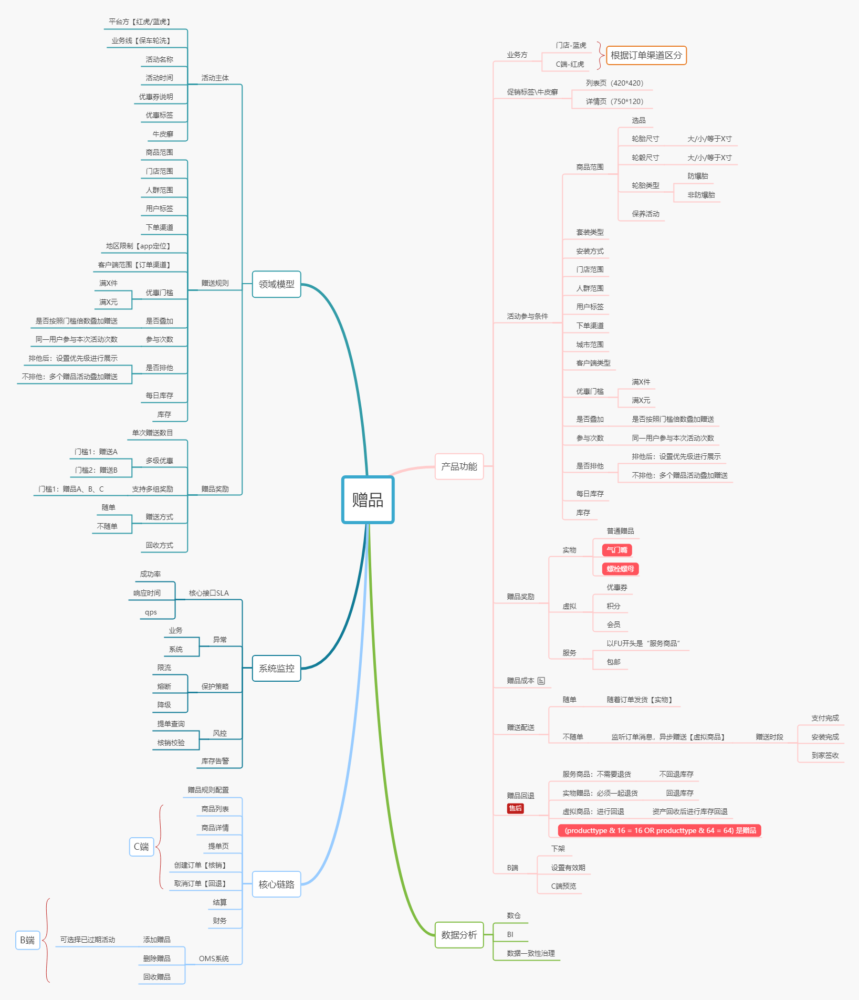
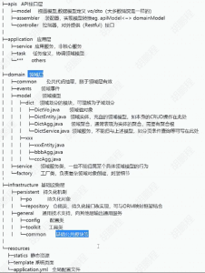
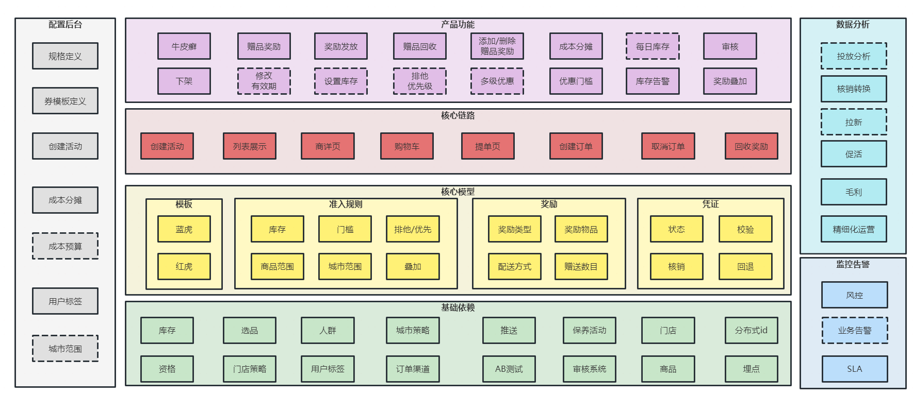
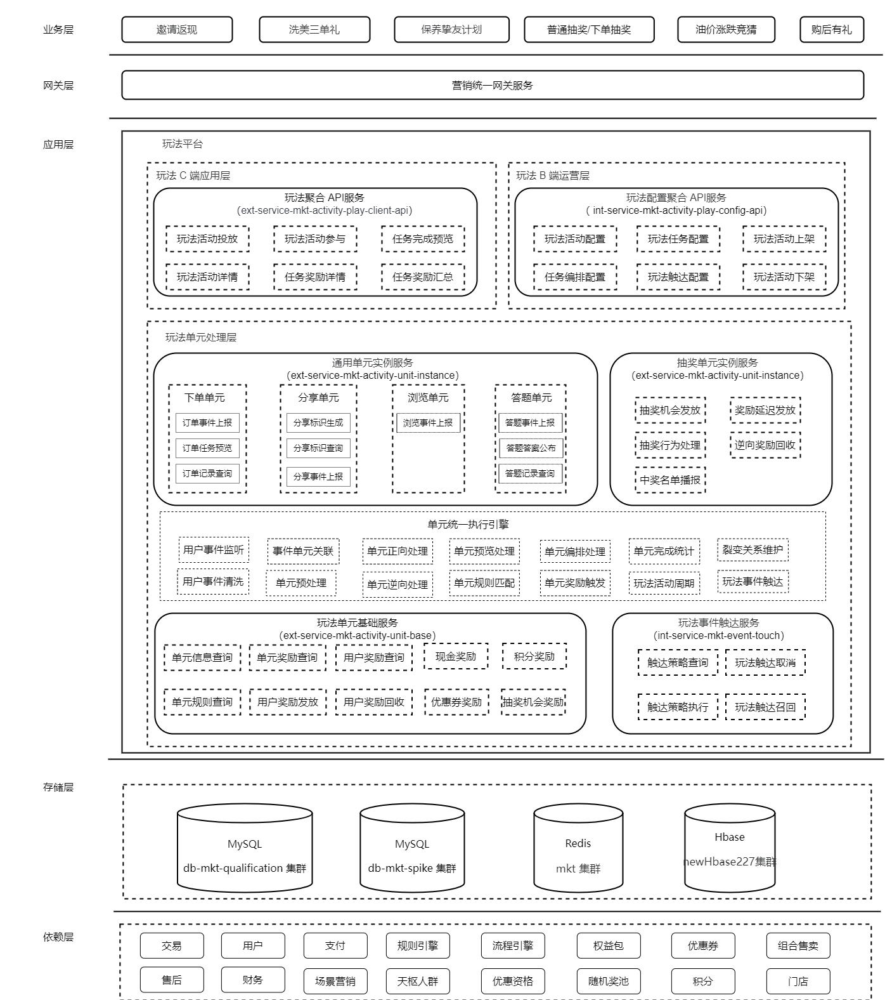
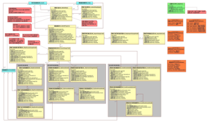
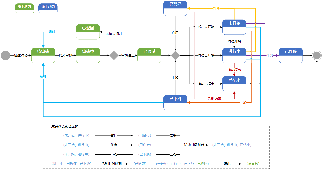
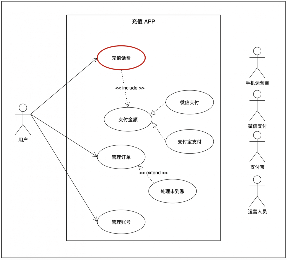
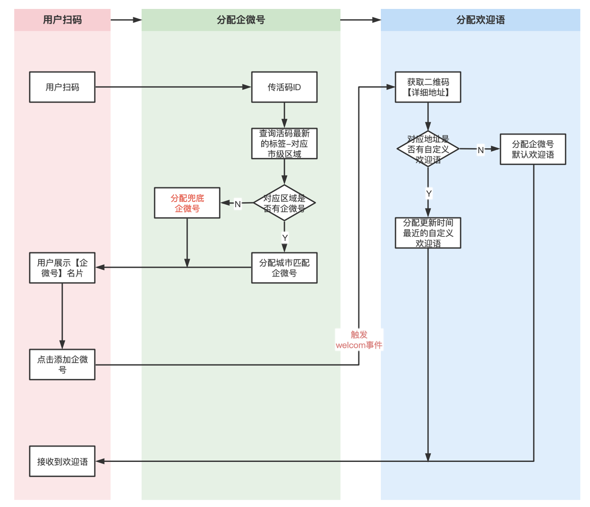
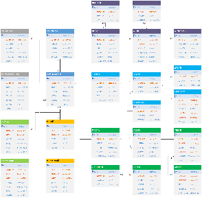
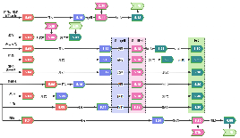

# 用户营销技术中心-技术方案设计模版 - 研发部

2023年10月10日 · [tuhu.cn](https://wiki.tuhu.cn/pages/viewpage.action?pageId=345277833)

[转至元数据结尾](https://wiki.tuhu.cn/pages/viewpage.action?pageId=345277833#page-metadata-end) [转至元数据起始](https://wiki.tuhu.cn/pages/viewpage.action?pageId=345277833#page-metadata-start)

**方案设计说明：**

[1] 系统方案设计标题命名： **yyyymmdd-[概要设计/详细设计]项目名称-领域（草稿 | 待评审 | 评审通过）**

[2] 技术方案设计文档 **统一管理目录 → [c.用户营销技术中心](https://wiki.tuhu.cn/pages/viewpage.action?pageId=425745683)**

[3] 撰写原则和评审机制:

1. When: 业务需求在产品移交完成后；技改需求在项目目标明确并正式启动后；服务端开发总耗时 * 15%（仅供参考）
2. Who：技术主R主导整体方案设计，任务模块拆分后，由各模块负责开发完善细节部分。
3. How：参考下面技术方案设计模版正文

|服务端开发工时  <br>优先级递减|是否强制按照模板|存放目录|参与人员|通过标准|研发部抽查|
|---|---|---|---|---|---|
|中心 **>=10PD**|是|[c.用户营销技术中心](https://wiki.tuhu.cn/pages/viewpage.action?pageId=425745683)|共计3名<br><br>- **技术主R的TL(必须参加)**<br>- 中心架构师<br>- **其他三级部门TL至少一名**  <br>    **(优先选择业务相关的三级部门)**<br>- 产品主R（可选）<br>- 测试主R（可选）<br>- 中心总监（>30PD需参与）|- 单人评分 **>=60** 则通过一票  <br>    参考： [技术方案设计评审标准](https://wiki.tuhu.cn/pages/viewpage.action?pageId=320708021)<br>- 最终投票（最少3票） **超过>50%** 即为通过<br>- 评审未通过需根据评审建议进行改进，  <br>    再次发起评审，直至通过后再启动开发|是|
|中心<10PD && **三级部门>5PD**|否|各部门的内部技术方案设计目录|- 技术主R的TL<br>- 组内P7+成员至少一名<br>- 中心架构师（可选）<br>- 其他参与开发、测试人员|- 三级部门TL和P7+协商决定|否|
|三级部门 **<=5PD**|否|各部门的内部技术方案设计目录|- 组内P7+成员至少一名<br>- 其他参与人员（开发、测试）<br>- 技术主R的TL（可选）|- 组内P7+协商决定|否|

PS：方案设计评审标准应以实际Flash任务录入的后端开发工时为准。如果方案设计时评估不足10人日，而后续开发过程中因人员变动、业务不熟悉或评估不全等意外情况导致实际工时超过10人日，均视为漏评。

[4]发起评审的标准：

1. 方案设计中 **不允许出现模板中存在的案例未替换的情况**
2. 方案模板的中的目录不可删除，没有或者不涉及模块可以进行备注并说明原因
3. **TL评审前已经确认过方案文档的内容，并确定符合要求**
4. 主责任人所在团队的团队领导（TL）必须参与方案设计评审会议，否则需重新预约评审会议

[5]评审结果:

1. 评审后的TODO项需要附加到文档的评论中，后续需要及时完成进展更新
2. 评审打分规则参考:[CheckList核对](https://wiki.tuhu.cn/pages/viewpage.action?pageId=445706413) 【 **针对倒排期的紧急需求，耗时的模块进行了红色标记** 】

## 0x00 系统概述

简单描述设计方案的系统业务情况。

## 0x00-00 背景

从业务上简单说明，为啥需要做这个方案设计（业务价值）？业务需求发起方？最好附上需求方的PRD。

从技术上简单描述，目前技术上是否有可复用的系统？

是迭代、重构还是新系统开发？

技术栈？涉及的关联方技术团队有哪些？

如果是跨多个团队的大项目，最好附上项目立项相关资料文档。

业务需求：需附上产品相关文档说明连接

案例

**业务功能不完善**

1. 部分配置项不生效：如"满额门槛”
2. 配置后台交互不清晰：运营不了解配置如何生效，往往配置后发现牛皮癣不展示，需要研发介入排查
3. 业务耦合严重：赠品耦合有适配领域逻辑（轮毂适配螺栓螺母和中心套环）

**系统支撑有瓶颈**

1. .net研发人力有瓶颈：只有0.5人力支持；
2. 容量支撑有瓶颈：无法支撑未来业务增量发展，在老.net系统上进行改造成本非常高
3. 资金安全风险高：历史库存设计不合理，大并发场景下存在超卖风险，老系统改造又成本非常高，目前依赖实时监控告警并人工及时介入；

**技术支持成本高**

1. 因功能不完善需耗费研发每周约0.5pd的问题（赠品未显示、牛皮癣未显示、未进行返券或返券重复）排查成本
2. 设计缺陷导致性能问题，在大促中短暂出现，需要研发手工介入，无法彻底解决
3. 周均1.5个追问，无法彻底解决（老系统无资源进行改造，成本较高）

**0x00-01 系统目标**

系统的目标是指系统所追求的最终结果或期望的成果。通常包括以下几个方面：

1. **业务目标** ：系统的业务目标是指系统所服务的业务或组织的核心目标。这可能包括提供特定的产品或服务、实现业务流程的自动化、提高业务效率和盈利能力等。
    
2. **用户目标** ：系统的用户目标是指满足用户需求和提供良好用户体验的目标。这可能包括提供易用性、响应性、可靠性和安全性的系统，以及提供符合用户期望的功能和界面设计。
    
3. **性能目标** ：系统的性能目标是指系统在各个方面的性能要求和指标。这可能包括响应时间、吞吐量、并发性能、可扩展性、可靠性等方面的要求。
    
4. **安全目标** ：系统的安全目标是指确保系统的数据和资源的安全性和保密性。这可能包括身份认证、访问控制、数据加密、防止网络攻击和数据泄露等安全措施。
    
5. **可维护性目标** ：系统的可维护性目标是指系统的易维护性和可扩展性。这可能包括系统的模块化、可测试性、文档化、容易修改和升级等方面的要求，以便系统能够持续演进和维护。
    
6. **成本目标** ：系统的成本目标是指在资源和预算范围内实现系统的目标。这可能包括开发和维护成本、硬件和软件成本、运营成本等方面的要求，以确保系统的经济效益。
    

案例

**业务支撑效率提升**

1. 虚拟赠品发放优化： 废弃与【优惠券返券任务】系统耦合的方式，采用赠品内部实现的方式，预计运营配置成本提升50% ，人工操作错误率降级到0，返券相关客诉率降低50%
2. 功能扩展优化：支持《多级优惠门槛》功能，预计运营配置效率提升20%；接入选品基础支撑，预计提升运营二次配置活动范围效率提升30%
3. 交互流程优化：支持预览功能和不可用原因提示，方便运营进行配置和调整，同时追问和咨询次数降低至0
4. 领域模型优化：重新设计领域模型和数据存储模型，后续50%的10PD需求降低到5PD以内
5. 技术栈迁移：人力上可增加1.5个人力支持赠品业务，提升业务支撑效率300%

**系统稳定性和安全性提升**

1. 优惠下单标准流程统一：推动交易对接优惠标准化核销接口，修复并发场景库存超卖的问题，进一步保障资金安全
2. 赠品展示链路优化：从（业务线=》商品=》赠品）变成（业务线=》赠品），减少调用链路，系统性能提升约20% ，实时返回最新数据，避免了商品缓存导致的数据展示延时问题，此类客诉可降低至0
3. 赠品C端接口优化：技术栈迁移后，C端相关接口可支撑的并发量和响应时间有更多的优化空间，从而可降低客诉，提升用户体验

**系统维护成本降低**

1. 容量评估与设计：可支撑业务后续5年年均20%的数据增长率
2. 复用公司中间件：快速实现系统稳定性保障，降低研发维护成本50%
3. 规范化赠品对接流程：上游业务接入成本减少约30%，内部服务维护成本降低约20%
4. 降低系统机器成本：技术栈迁移后，机器成本上预计服务器从8台window（4C8G）减少到6台linux（4C8g），成本减少25%

属于项目重构，涉及团队：优惠活动，交易，客服，业务线（轮胎、保养、车品），价格域，大客户

**0x00-02 名词解释**

统一语言，减少后续沟通成本，有利于领域边界的划分；如：

|名词|说明|
|---|---|
|返赠活动|是运营后台配置的活动类型的一种，主要进行下单赠送奖励，由以下三部分组成：|
|- 返赠主体信息|活动主体信息，主要包括活动名称、活动说明、平台方、业务线、有效期等、优惠门槛类型【满件/满额】、牛皮癣；|
|- 返赠准入规则|用户参与活动条件，主要包括：订单渠道、安装方式、商品范围、城市范围、优惠门槛、用户标签、用户资格、排他规则、库存、每日库存等;|
|- 返赠奖励规则|奖励类型【实物、虚拟、权益等】、奖励物品标识【PID/券批次ID/E卡编号/积分】、返赠门槛、返赠数目、落地页、是否回收、成本分摊|
|返赠凭证|记录用户参与活动后相关上下文信息，包括返赠活动ID、返赠规则ID、返赠奖励ID列表、核销订单号、核销状态等|
|凭证流水|奖励每次发放和回收的明细，包括返赠凭证id、操作类型、赠记录ID、返赠奖励ID、赠送状态（成功/失败）、奖励赠送成功标识ID等|

## 0x00-03 系统功能

说明当前系统包括的功能、模块、名词、概念等，如：



---

## 0x01 需求分析

简单分析方案设计/实现可能会遇到的难点或挑战，如果有做相关的技术调研，最好附上技术调研的相关文档或wiki。

## 0x01-00 功能需求分析

#### 0x01-00-00 流程CheckList

|C端（用户）|M端（商户）|S端（销售）|P端（运营等内部用户）|T端（定时任务等系统触发逻辑端）|
|---|---|---|---|---|
|有|有|无|有|有|

|   |   |   |   |   |
|---|---|---|---|---|
|模块|子功能|功能描述|是否新增|功能等级|
|中控|方案下发|天枢人群触发中控的匹配逻辑，根据优先级排序后选择方案中配置的素材下发||核心功能|
|素材ab|对下发的素材进行ab分组||核心功能|
|推送|亮屏功能|等待用户亮屏后进行推送||核心功能|
|模版内容组装|组装模版中携带的自定义参数||核心功能|
|实验功能|push现有进行的一系列实验逻辑||核心功能|
|会话意图服务|会话id（sessionId）生成|生成唯一id，用于场景和场景之间的会话保持||核心功能|
|会话保持|保证sessionId的有效性||核心功能|
|会话意图决策|决策最终的意图内容||核心功能|
|鹰眼|意图执行|执行会话意图服务决策出来的意图||核心功能|
|弹窗渲染|将配置好的素材按照和客户端约定的格式进行组装||核心功能|
|计数上报|对于曝光的方案进行上报，用于频次/疲劳值控制||重要功能|

#### 0x01-00-01 异常分支CheckList

|异常分支|分支逻辑|业务异常|系统异常|备注|
|---|---|---|---|---|
|抽奖请求限流|流量过大，需要限流时，如何反馈给用户友好感知|√|||
|已中奖但发奖接口调用异常|抽奖逻辑完成，用户已中奖，但在发放奖品时调用依赖服务接口异常||√||

## 0x01-01 非功能需求分析

|   |   |   |   |
|---|---|---|---|
|非功能需求项|具体子项|预计目标|备注|
|版本兼容|终端原生是否兼容|- 是<br>- 否|评估对老版本的影响，是否需要做版本兼容，怎么做版本兼容|
|可用性|核心接口可用性|99.9%||
|性能|响应时间|现状：100ms [999Line]  <br>计划：110ms [999Line] → 上升10ms|此处需要说明评估的过程，比如为什么需要增加10ms？|
|QPS|现状：1K  <br>计划：1.5K|根据线上真实流量进行评估|
|安全审计|一致性保证|- 强一致性<br>- 弱一致性<br>- 最终一致性|下面为名词说明，实际写方案过程中需要替换成实际的项目中的决策原因<br><br>一致性说明<br><br>1. 强一致性：要求在分布式系统中的所有节点上的数据副本在任何时间点都具有相同的值。即使在并发访问和更新的情况下，所有节点之间的数据都是一致的。  <br>    强一致性能够提供最高级别的数据一致性，但可能会牺牲一些性能和可用性。  <br>    【如：银行转账】 → 本地事务、分布式事务<br>    <br>2. 弱一致性：允许在分布式系统中的不同节点之间存在一段时间的数据不一致。节点之间的数据复制和同步可能存在一定的延迟，因此在某个时间点读取到的数据可能不是最新的。  <br>    弱一致性可以提高系统的性能和可用性，但在一些场景下可能需要应用程序或用户来处理数据的一致性问题。  <br>    【如：分布式缓存的数据更新】<br>    <br>3. 最终一致性：保证在分布式系统中的所有节点最终会达到一致的状态。  <br>    最终一致性可以提供更高的可用性和性能，但在某些情况下需要应用程序或用户来处理数据的冲突和一致性问题。  <br>    【如:电子商务网站的订单支付】→ 离线和实时对账、 监控告警、自动补偿|
|幂等保证|- 调用端保证<br>- 服务端保证|下面为名词说明，实际写方案过程中需要替换成实际的项目中的决策原因<br><br>幂等说明<br><br>幂等性是指对同一(写)操作的多次执行所产生的结果与对该操作执行一次的结果相同。<br><br>实现方法：<br><br>1. 请求唯一标识：为每个请求生成唯一的标识符，并在每次请求中将该标识符传递给服务器。服务器可以根据标识符来判断是否已经处理过该请求，避免重复处理。<br>    <br>2. 幂等性检查：在服务端对接收到的请求进行幂等性检查，可以通过记录已处理请求的状态或结果来判断是否已经处理过该请求。如果已经处理过，则可以直接返回之前的结果而不执行重复的操作。<br>    <br>3. 乐观锁机制：在数据库或共享资源的访问中采用乐观锁机制。通过在操作中使用版本号或时间戳等标识来判断资源是否被修改过。如果资源已被修改，可以拒绝重复的修改请求。<br>    <br>4. 幂等性设计：在系统设计中，针对关键操作或接口进行幂等性设计。例如，将幂等性的逻辑放在关键业务逻辑中，确保在重复请求时不会对系统状态或数据产生不一致的影响。|
|Web安全|- [水平/垂直]越权<br>- 流量攻击<br>- 风控|下面为名词说明，实际写方案过程中需要替换成实际的项目中的决策原因<br><br>越权说明<br><br>越权是指在系统或组织中，某个用户或实体未经授权或权限越界地获取了超出其应有权限范围的权力或访问权限。<br><br>1. **水平越权** （Horizontal Privilege Escalation）：指一个用户或实体在同一权限级别下获取了其他用户或实体的权限。例如，一个普通用户通过某种方式获取了另一个普通用户的账户信息，从而能够以该用户的身份执行操作。<br><br>解决水平越权的措施包括：<br><br>- 实施严格的身份验证和访问控制机制，确保每个用户只能访问其所需的资源和功能。<br>- 限制用户的权限范围，避免用户拥有超出其角色或职责所需的权限。<br>- 定期审查和监控用户权限，及时发现和纠正任何异常或越权行为。<br><br>1. **垂直越权** （Vertical Privilege Escalation）：指一个用户或实体在系统中提升了其权限级别，获得了高于其原始权限的访问权限。例如，一个普通用户通过漏洞或恶意手段提升为管理员用户，获取了系统管理权限。<br><br>解决垂直越权的措施包括：<br><br>- 实施最小权限原则，即确保每个用户或实体只能拥有完成其工作所需的最低权限级别。<br>- 限制特权账户的使用，并采用严格的身份验证和访问控制措施，防止未经授权的特权提升。<br>- 定期审计和监控特权账户的使用情况，及时检测和纠正任何潜在的越权行为。|
|审计日志|LOG文件/持久化存储||
|数据统计|数据埋点|业务的访问流量埋点||
|指标埋点|系统的关键指标埋点||
|测试|测试|单元测试/开发自测/QA自测等||
|运维|部署|开发维护/运维维护||

## 0x02 系统分析

针对需求分析过程中梳理的功能/非功能需求项，站在系统全局的视角，一一给出相关的分析和解决方法、技术。

## 0x02-00 行业对标&选型

在公司内部，大多数业务系统都会遵循公司内部的SOA架构风格，按照业务粒度，拆分成一个个服务单元并独立部署。

在服务单元内部，大多数架构都会遵循分层架构模式来搭建系统，如采用其它架构模式请具体说明。

[1] 如在方案设计过程中，未涉及到架构调整，此处可不做要求；

[2] 对于新的业务系统，强制要求必须给出架构选型说明；

[3] 具体架构选型说明如下：

[3.1] 如采用分层架构模式，请简述如何分层及每层的含义，优先建议通过图来表达；

案例



[3.2] 如采用其它架构模式， 请给出选型理由以及架构简图；

若项目已上线，本次需要更换框架、存储、中间件等，需要增加本节  
若项目未上线，需要增加本节  
以表格的形式列出3种选型

|方案|易用性|可靠性|性能|扩展性|监控|
|---|---|---|---|---|---|
|MySQL|标准SQL、社区资料多|ACID事务、主从、MGR|4c8g TPS =xxx、QPS=xxx|主从复制，读从写主|zabbix|
|TiDB|标准SQL，社区资料多|ACID事务、分布式|4c8g TPS=xxx、QPS=xxx|分布式|grafana|
|...||||||

## 0x02-01 业务边界依赖

列举系统在上下游链路中的位置，依赖下游哪些（公司内部/外部、团队）应用，被上游哪些应用所依赖。

[1] 对于新的业务系统，强制要求必须列出上下游链路的组织依赖关系；

[2] 对于已有业务系统的迭代，如果组织依赖关系有相关调整或变更，需要列出变化的部分；

#### 0x02-01-00 上下游依赖

#### 0x02-01-01 外部系统依赖

## 0x02-02 设计挑战与解决

为了更好地指导后续编码实现，防止系统顶层设计在底层实现上走形，可以在此部分，针对功能需求和非功能需求中的关键重难点部分，进行详细说明。

例如：【表示形式调整，缺少一个案例】

[1] 核心功能逻辑中的关键业务流程、算法、数据结构，甚至可以给出伪代码形式的代码块；

[2] 非功能需求中，针对一致性、幂等、高并发的关键技术实现要点；

[3] 针对数据模型变更后，新老模型的的数据迁移、验证等技术保障流程、措施；

[4] 为解决功能和非功能需求，引入新的框架、技术栈、中间件或基础存储设施等，需着重说明的注意事项；

如：

策略运营：推送速率、数据准确性高（不重、不丢）  
搜推：性能、业务效果、业务监控、召回、排序数据准确性、容错降级  
社区社群：活动玩法（性能、稳定性、资金安全）、企微（数据准确性高）  
广告：全链路数据完整性  
优惠活动：性能、稳定性、资金安全

## 0x02-03 系统编排

系统编排部分，主要关注服务单元内部的组件选型、模块依赖关系以及整体的服务部署模型。

[1] 对于新的业务系统，强制要求必须列出系统编排；

[2] 对组件选型有调整或变更，需要给出变更说明；

[3] 模块依赖关系有变更，需要给出变更前后的差异以及变更理由，变更差异优先建议通过图来表达；

[4] 涉及到应用层/存储层的异地、跨机房、泳道等部署，强制要求说明理由以及部署图；

## 0x02-04 整体架构设计

基于团队共识，规定方案设计过程中需要输出的架构图：业务架构图、系统架构图、数据架构图。

**[1]业务架构图（非必选）**

对于团队内部的一个平台级业务，需要给出整体的业务架构图（譬如：促销活动平台、优惠券平台、预算管控平台、营销推送平台等）。

对于平台级业务下一级的子系统，或者还不够平台级业务的系统，不做强制要求。



**[2]系统架构图**

对于团队内部的平台级业务，需要给出整体的系统架构图（可能会涉及多个服务单元）。

对于平台级业务下一级的子系统，或者还不够平台级业务的系统，也可以梳理并输出系统架构图，但不做强制要求。



**[3]数据架构图（非必选）**

对于平台级业务下一级的子系统，或者还不够平台级业务的系统，可参考 [0x02-00-02 领域模型](https://wiki.tuhu.cn/pages/viewpage.action?pageId=12914860#id-%E7%B3%BB%E7%BB%9F%E6%96%B9%E6%A1%88%E8%AE%BE%E8%AE%A1%E6%A8%A1%E6%9D%BF-0x02-00-02%E9%A2%86%E5%9F%9F%E6%A8%A1%E5%9E%8B)

对于团队内部的一个平台级业务，可将多个子系统的 [0x02-00-02 领域模型](https://wiki.tuhu.cn/pages/viewpage.action?pageId=12914860#id-%E7%B3%BB%E7%BB%9F%E6%96%B9%E6%A1%88%E8%AE%BE%E8%AE%A1%E6%A8%A1%E6%9D%BF-0x02-00-02%E9%A2%86%E5%9F%9F%E6%A8%A1%E5%9E%8B) 再关联起来，形成一个整体的数据架构图。

**待补充案例**

## 0x03 系统设计

系统设计部分，主要根据上述需求分析/系统分析中梳理总结的问题/挑战和解决方法/手段，再细化描述具体在工程实现方面如何落地。

## 0x03-00 领域模型

着重描述业务系统的边界划分、领域上下文识别、聚合根提取以及关联组织关系。

[1] 领域模型表现形式不做要求，但建议可参考UML的类图表述语言；

[2] 涉及到领域模型的变更，强制要求必须有领域模型；

领域模型图与数据库E-R图的异同点：

相同点：

[1] 领域模型图和E-R图都能展现业务系统的核心数据实体及其关联关系；

不同点：

[1] 领域模型图更偏向于顶层的业务分析，E-R图更偏向于底层的数据存储模型设计；

[2] 领域模型图抽象粒度更粗，主要关注核心的领域对象，E-R图抽象粒度更细，除了核心领域对象还有更细节性的领域实体；

[3] 领域模型图更强调不同子域边界划分、领域层次以及领域上下文识别，E-R图则比较扁平，更强调数据实体的属性及实体之间关联关系；

**_领域模型图示例：_**



## 0x03-01 状态迁移

着重描述核心领域对象的状态空间，以及状态之间的跃迁。

[1] 优先建议通过UML状态图来表述；

[2] 涉及到核心领域对象的状态变更，强制要求必须有状态图；

**_状态图示例：_**



## 0x03-02 功能分析

#### 0x03-02-00 用例

着重描述业务流程中不同利益涉众方及其各自关键的动作。

[1] 优先建议通过UML用例图来表述；

[2] 项目工期（>=10人日）强制要求必须有用例，项目工期（<10人日）不做强制要求；

**_用例图示例：_**



#### 0x03-02-01 时序/活动

着重描述业务流程中不同涉众方、子系统、模块之间彼此时间（先后/同步/异步）、空间（顺序/循环/分支判断）上的交互。

[1] 时序交互优先建议通过UML时序图来表述，空间交互优先建议通过UML活动图来表述；

[2] 项目项目工期（>=5人日）强制要求必须有时序/活动，项目项目工期（<5人日）不做强制要求；

_**扫码拉新-活动图 扫码拉新-时序图示** （对性能有要求的需要标明每个步骤的响应时间）_



## 0x04 模型设计

## 0x04-00 数据表模型

**1.ER图示例：要有映射关系和表更说明**  


**2.DDL： 要有索引说明 和 数仓同步说明**

```sql
CREATETABLE`gift_proof_reward` (
`id` bigint(20) NOTNULLAUTO_INCREMENT COMMENT '主键ID',
`user_id` varchar(40) NOTNULLCOMMENT '用户ID',
`proof_id` varchar(20) DEFAULTNULLCOMMENT '唯一标识：分布式id，单个奖励唯一id',
`order_id` varchar(20) DEFAULTNULLCOMMENT '核销订单ID',
`operate_no` varchar(40) DEFAULTNULLCOMMENT '核销操作流水唯一id，回滚使用',
`return_operate_no` varchar(40) DEFAULTNULLCOMMENT '回退操作流水唯一id',
`activity_id` varchar(20) NOTNULLCOMMENT '赠品活动唯一标识，分布式id',
`version` int(11) NOTNULLDEFAULT'1'COMMENT '版本号',
`sku_id` varchar(32) NOTNULLCOMMENT '购买商品id',
`sku_num`int(11) NOTNULLCOMMENT '购买个数',
`unit_price` int(11) NOTNULLDEFAULT'0'COMMENT '商品单价 【活动价，原价等】 单位/分',
`reward_id` varchar(20) NOTNULLCOMMENT '命中的奖励规则id,若命中多个规则，则多行存储',
`reward_sku_id` varchar(32) NOTNULLCOMMENT '赠送的商品id',
`reward_num`int(11) NOTNULLCOMMENT '奖励个数，和奖励规则的个数相同',
`status` varchar(20) NOTNULLDEFAULT'1'COMMENT '状态：已核销、已回退',
`operator` varchar(32) NOTNULLCOMMENT '用户/系统/客服邮箱',
`note` varchar(256) NULLCOMMENT '备注信息',
`must_return` tinyint(1) COMMENT '取消时是否进行强制取回：1=是',
`is_delete` tinyint(1) NOTNULLDEFAULT'0'COMMENT '1:删除',
`create_time` timestampNOTNULLDEFAULTCURRENT_TIMESTAMPCOMMENT '创建时间',
`update_time` timestampNOTNULLDEFAULTCURRENT_TIMESTAMPONUPDATECURRENT_TIMESTAMPCOMMENT '修改时间',
PRIMARYKEY(`id`),
KEY`ix_userid_operateno` (`user_id`,`operate_no`),
KEY`ix_userid_orderid_rewardid` (`user_id`,`order_id`,`reward_id`)
) ENGINE=InnoDB DEFAULTCHARSET=utf8mb4 COMMENT='赠品凭证奖励明细表';
```

- 同步数仓变更点：新增表、新增字段、新增枚举、修改自动类型等

## 0x04-01 缓存模型

**参考 [后端服务缓存使用规范和最佳实践](https://wiki.tuhu.cn/pages/viewpage.action?pageId=446304051)**

|场景|key生成规则|缓存选型：|数据结构|容量评估|过期时间|组件选择|缓存模式|缓存更新策略|缓存命中率|常见问题解决方案|
|---|---|---|---|---|---|---|---|---|---|---|
|群成员查询|prefix + xxx|- 本地缓存<br>    - 堆内<br>    - 堆外<br>- 分布式缓存（Redis）<br>- 多级缓存|- String<br>- Hash<br>- List<br>- Set<br>- Sort Set<br>- BitMap|单个大小：<1K<br><br>预计总大小：50M|10min|- hotCache<br>- hashmap<br>- Caffeine<br>- renault|- 通读缓存（read-through）<br>- 旁路缓存（cache-aside）|- 过期策略：<br>- 更新策略：<br>- 淘汰策略：<br>- 内存大小：|95%|- 如何保障缓存一致性<br>- 如何解决缓存穿透、击穿？<br>- 是否存在big key问题，如何解决？|
|其他场景依次列举|||||||||||

## 0x04-02 数仓模型影响

包括新增字段、新增枚举、模型等，通知数仓

## 0x04-03 其他数据模型（MQ/ES/HIVE等）

案例

**索引配置基础信息 ： [https://hubble.tuhu.cn/#/index/index-detail/index-info?indexId=233&indexName=mkt-coupon-batch&isTemplate=false&isShow=true](https://hubble.tuhu.cn/#/index/index-detail/index-info?indexId=233&indexName=mkt-coupon-batch&isTemplate=false&isShow=true)**

|   |   |
|---|---|
|索引名称|mkt-coupon-batch|
|AppID|ext-service-mkt-coupon-config|
|集群|Tuhu-Production-v7|
|分区|zone_v7|
|索引名称|mkt-coupon-batch|
|Mapping|如果是在现有基础上进行修改，需要标明改动点<br><br>{  <br>"mkt-coupon-batch":{  <br>"mappings":{  <br>"dynamic":"strict",  <br>"properties":{  <br>"templateId":{  <br>"type":"keyword"  <br>},  <br>"batchName":{  <br>"type":"text"  <br>},  <br>"status":{  <br>"type":"integer"  <br>},  <br>"startTime":{  <br>"type":"date",  <br>"format":"yyyy-MM-dd'T'HH:mm:ss.SSS'Z'\|yyyy-MM-dd'T'HH:mm:ss.SSSZ\|yyyy-MM-dd'T'HH:mm:ssZ\|yyyy-MM-dd HH:mm:ss\|yyyy-MM-dd HH:mm:ss'.0'\|yyyy-MM-dd HH:mm:ss.SSS\|yyyy-MM-dd\|epoch_millis"  <br>},  <br>"isOnline":{  <br>"type":"boolean"  <br>}  <br>}  <br>}  <br>}  <br>}|

## 0x05 接口设计

提供接口设计文档(保障接口文档准确性)，包括入参出参字段定义，接口参数校验逻辑，异常情况的处理和返回的错误码。

## 0x05-00 平台对上游提供的接口

不要贴forsit链接，需要评估改动点

案例

|   |   |   |   |   |   |
|---|---|---|---|---|---|
|访问方式|内网 POST|||||
|APPID|ext-service-mkt-gift-core|||||
|相对地址|{appid}/gift/listActivity [批量-单次只支持30个]|||||
|请求参数|{  <br>"userId":"7c6117f1-00c5-4934-8c19-50e820855ef3",  <br>"bizTag":"redTiger",  <br>"orderChannel":"订单渠道--有则校验，没有不校验该属性",  <br>"installType":"安装方式--有则校验，没有不校验该属性",  <br>"cityId":"0",  <br>"productList":[  <br>{  <br>**"skuId":"FU-MD-BZXC-F\|1",**  <br>**"tid":"五级车型"**  <br>}  <br>]  <br>}|userId||非必填|用户身份唯一标识|
|bizTag|||券模板渠道（ `redTiger` =红虎、blueTiger=蓝虎、all=所有）|
|orderChannel||非必填|订单渠道|
|installType||非必填|安装方式：1=仅到家订单，2=仅到店订单|
|cityId||非必填|城市id|
|productList|||商品列表信息|
||skuId||商品id|
||tid|非必填|五级车型 【新增字段】|
|返回值|{  <br>"code":10000,  <br>"message":"操作成功",  <br>"data":[  <br>{  <br>"skuId":"TR123124-344184855696929\|1",  <br>"activityId":"2Z37jJDEpqtw2",  <br>"tag":"",  <br>"columnCover":" [http://123456](http://0.1.226.64/) "  <br>}  <br>]  <br>}|skuId|||商品ID|
|activityid|||赠品活动id|
|Tag|||赠品名称|
|column_cover|||商品列表牛皮癣|

## 0x05-01 平台内部相互依赖的接口

**同上**

## 0x06 非功能性设计

针对 [1230x01-01 非功能需求分析](https://wiki.tuhu.cn/pages/viewpage.action?pageId=345277833#id-%E6%8A%80%E6%9C%AF%E6%96%B9%E6%A1%88%E8%AE%BE%E8%AE%A1%E6%A8%A1%E7%89%88-0x01-01%E9%9D%9E%E5%8A%9F%E8%83%BD%E9%9C%80%E6%B1%82%E5%88%86%E6%9E%90) 中列出的非功能需求项，分析完成预计目标可能遇到的困难和挑战，以及解决这些困难挑战相关的方法、技术手段。

## 0x06-00 异常分支（一致性/幂等）

针对 [0x01-00-01 异常分支CheckList](https://wiki.tuhu.cn/pages/viewpage.action?pageId=345277833#id-%E6%8A%80%E6%9C%AF%E6%96%B9%E6%A1%88%E8%AE%BE%E8%AE%A1%E6%A8%A1%E7%89%88-0x01-00-01%E5%BC%82%E5%B8%B8%E5%88%86%E6%94%AFCheckList) 中罗列的异常分析，一一分析并给出对应的解决方法。

表格列出异常情况和处理方案

|模块|异常情况|处理方案|
|---|---|---|
|奖励方法（到家、到店）|上线后发现实时对账出现大量错误告警|- 关闭开关，业务快速回滚<br>- 终止灰度发布，业务快速回滚<br>- 发布历史版本包，业务开始恢复<br>- 修复异常数据|
|客态领券|客态重复点击领取券包,多次领取|- 根据用户ID和活动ID做幂等控制<br>- 使用分布式锁进行控制|
|奖励发放|客态/主态奖励发放失败|- JOB补偿|

**以下场景必选：**

策略运营：推送数据准确性高（不重、不丢）

社区社群：企微数据准确性

优惠活动：优惠券、活动核销回退等

广告活动：全链路数据完整性

## 0x06-01 风控/Web安全/审计

敏感信息加解密、应用网关鉴权、接口是否需要风控介入

|   |   |   |
|---|---|---|
|权限类型|关键点|保障方案|
|数据权限|订单详情-用户手机号<br><br>1、加密存储<br><br>2、默认不展示，查看手机号需要额外点击申请|1、手机号支持加密存储<br><br>2、手机号查看接口需要增加申请通过的验签|
|优惠券列表-数据越权<br><br>1、当前用户只能查询自己的券凭证列表|1、查询用户券列表接口要求userid必填，且只能查到自己的券凭证列表|
|用户权限|1、用户必须登录后才能够查询券凭证列表|1、接入权限系统-南天门|
|审计日志|1、客服给用户在后台进行补发券需要有日志进行记录|1、需要记录操作人、操作时间、操作原因等信息|

## 0x06-02 可用性/性能/容量

对用到的存储进行评估，列出表格

|模块|使用到的存储|上线一周增长|上线一月增长|上线半年增长|上线一年增长|
|---|---|---|---|---|---|
|活动|MySQL表：invite_base_activity<br><br>invite_activity|<1000行 <100M|<1000行 <100M|<1000行 <100M|<1000行 <100M|
|邀请关系|invite_relation|<1000行 <100M|<6000行 <100M|<40000行 <100M|<80000行 <100M|
|奖励发放|award_record|<1000行 <100M|<3000行 <100M|<20000行 <100M|<40000行 <100M|

对可能存在流量徒增的接口进行评估，列出表格

|模块|接口|上线一周增长|上线一月增长|上线半年增长|上线一年增长|
|---|---|---|---|---|---|
|模块1|接口1|<1000QPS|<2000QPS|<5000QPS|<10000QPS|
|…||||||

## 0x06-03 监控告警（业务&系统告警）

表格列出监控项，说明正常值、阈值

|模块|功能|正常|阈值|
|---|---|---|---|
|活动配置|当活动信息/奖励信息等保存失败时,进行业务监控告警|0次|1次|
|主态查看页面|查询返回结果失败|0次|1次|
|活动页uv数量|上报邀请有礼活动页uv数据|1小时内>0次|1小时内0次|
|主态获取分享链接|分享链接获取失败|0次|1次|
|客态点击分享链接查看邀请|根据分享链接查询分享人和信息失败|0次|1次|
|客态绑定|绑定关系失败|0次|1次|
||客态绑定成功数量上报|1小时内>0次|1小时内0次|
|客态领取奖励|客态领取奖励失败|0次|1次|
|客态下单核销|客态下单到店安装/到家签收 阻断告警|0次|1次|
|主态发放奖励|主态发放奖励数量|-|活动发放金额总和大于1万告警|
|job补偿|job奖励补偿异常|0次|1次|

**以下场景必选：**

策略运营：推送速率、数据准确性  
搜推：性能、业务效果、业务监控、召回、排序数据准确性  
社区社群：活动玩法性能、企微（数据准确性）  
广告：全链路数据完整性  
优惠活动：性能

## 0x06-04 测试验证

写出改造点，重点需要测试什么，测试依赖有什么，是否需要压力测试、Mock大批量数据测试、是否需要一致性验证

业务测试：如使用优惠券下单和取消定期场景，需要正常测试优惠券在C端展示的状态和订单的状态是否保持一致。

接口测试：验证核心接口的幂等性，是否能保障数据的最终一致性。

数据测试：优惠券凭证的数据状态、时间、用户和订单的状态、时间、用户等字段是否保持一致。

## 0x06-05 降级方案

表格列出降级范围和方案：

|模块|降级类型|是否有损|备注|
|---|---|---|---|
|推送-防骚扰服务-调用客服进线状态失败|自动降级|无|推送侧兜底当做非进线用户处理还会继续推送<br><br>>考虑顶多1000人在进线中，其实推送退出去了用户也未必会点，且即使点了，进入客服领域，客服还会校验进线状态做兜底|
|推送-意图服务-发券失败|自动降级|无|自动重试一次后仍然失败则回复兜底文案<br><br>>删除会话<br><br>>非常抱歉本次活动已失效，期待下次邀请~|
|推送-意图服务-聚合回复信息失败|自动降级|无|>删除会话<br><br>>非常抱歉本次活动已失效，期待下次邀请~|
|统一API中的价格查询部分优惠类型可降级|自动降级|有|只展示优惠类型正常返回的活动，并参与计算最终的优惠|

## 0x06-06 数据质量

列出怎么保障数据准确性、线上是否需要AB测试等

|场景|保障方案|
|---|---|
|企微-好友关系|目标：保障本地记录的好友关系数据和企微平台的数据的一致性<br><br>解决方案：<br><br>- 监听消息企微好友关系数据变更时的异步回调通知，并更新到数据库<br>- 离线job每日全量便利一遍和企微接口返回的数据一致性性进行比对，并进行修复<br>- 修复原则：已企微官方数据为准，并已时间戳作为版本号进行覆盖，避免并发导致数据被覆盖|

## 0x06-07 资损风险评估

列出怎么保障资金安全的防控措施，包含资金安全对账，一致性校验，幂等、补偿等

|场景|保障方案|
|---|---|
|优惠券核销和回退|1. 核销和回退时通过eagle平台进行准实时对账和告警，第一时间发现问题，并人工接入<br>2. 通过数仓平台对T+1的数据进行对账（订单状态、券状态、订单时间、券核销时间等字段）|

**以下场景必选：**

社区社群：活动玩法资金安全

优惠活动：资金安全

---

## 0x07 执行计划

整个项目开发节奏及里程碑，其中开发任务估时的展现形式不限，但需包含以下几个基本要素：

- 需要对整体任务进行拆分，列出拆分后的任务子项；
- 需要体现不同的团队任务分工，团队内部不同开发人员的任务人工；
- 需要体现任务子项的开发工时，以及预估的开发开始时间和结束时间；
- 针对一些关键的任务子项，可以增加备注特别说明一些开发过程中需注意的一些事项；

案例

总体计划：



排期明细： [https://doc.weixin.qq.com/sheet/e3_APAAYAaNALQiz0EtZppT6uMoeYdOU?scode=ANAAUQePAAYFuEUz4AAPAAYAaNALQ&tab=BB08J2](https://doc.weixin.qq.com/sheet/e3_APAAYAaNALQiz0EtZppT6uMoeYdOU?scode=ANAAUQePAAYFuEUz4AAPAAYAaNALQ&tab=BB08J2)

## 0x08 上线部署

上线部署部分涉及的点包括环境准备，系统准备，发布顺序，线上验证；

## 0x08-00 环境准备

系统依赖环境的准备包括MySQL、Redis、MQ、ES和Nginx等服务搭建和初始化，机器资源等。

- 流量评估是否需要提前申请新的集群进行隔离【大部分情况不需要考虑】
- 根据流量评估需要的服务器数目

## 0x08-01 系统准备

系统准备常见主要如下： 不涉及的直接删除

|准备项|说明|
|---|---|
|apollo|配置初始化（如：一些灰度开关配置）|
|SERVICE|**申请新服务** → 点击查看： **[丨微服务申请](https://wiki.tuhu.cn/pages/viewpage.action?pageId=423967246) 规范**<br><br>申请原因:xxxxxxxx<br><br>注意：新需求<>新业务 ； 模块 <> 微服务|
|ES|hubble平台申请索引，并初始化mapping；|
|MQ|Mercury平台申请或者绑定相应的队列|
|JOB|初始化xxljob|
|监控|提前配置好监控告警看板→ **[点击查看参考](https://grafana.tuhuyun.cn/d/oFW4eQ_4z/zeng-pin?orgId=4&refresh=30s&from=now-30m&to=now)**|
|白名单|提前设置白名单|
|部署|发布系统初始化配置|

## 0x08-02 发布顺序

发布部署的服务之前有业务依赖关系，被依赖的服务需要先发布部署，如果有这种依赖关系，在技术方案中应当标明。例如：

|   |   |   |   |   |
|---|---|---|---|---|
|阶段|系统|服务appid/Apollo|发布时间|备注|
|阶段1|适配|APPID1|2023-10-10 20:00|提前发布|
|选品|APPID2|2023-10-10 20:00|
|同步服务开关开启|APPID3|2023-10-10 20:30|
|营销数仓|无|2023-10-10|
|阶段2|赠品【配置后台】|APPID4|2023-10-11 18:00|新赠品动态套装逻辑下沉到选品；  <br>当前线上只有一个在线的活动配置了该选型，等系统上线后，联系运营进行修改选品配置后，在发布配置后台|
|阶段3|赠品【C端接口】|APPID5|2023-10-11 20:00|发布后，建议预留观察期：3天|
|营销查询统一API|APPID6|2023-10-11 21:00|
|阶段4|交易创建订单|APPID7|2023-10-12 20:00|发布后，建议预留观察期：3天|
|价格域|APPID8|2023-10-12 21:00|
|阶段5|轮胎|APPID9|2023-10-13 20:00|发布后，建议预留观察期：3天|
|阶段6|终端发包|APPID10|2023-10-16 20:00||

## 0x08-03 灰度设计

正对复杂或者影响面比较大场景（如重构，架构调整大，模型变更大灯），需要有具体的灰度切换策略，如：

- B端根据门店范围进行灰度
- C端根据 userid 或者DevicedId 哈希取模 进行灰度
- 业务唯一标识（如：券批次id 哈希取模，业务线，订单渠道等 ）进行灰度
- 根据流量随机百分比进行灰度

灰度计划案例

**阶段1：新接口灰度计划**

**新接口查询老赠品配置 -- 预计时间1~2周 2023-6-8 ~ 2023-6-18**

- 搜索列表和 麒麟等场景 存在牛皮癣未实时更新问题，期望6.1之前上线，目前整体上线时间 在 2023-5-30, 存在一定的风险
- 轮胎侧根据服务进行灰度：  
    2023-6-12 灰度列表、详情、麒麟、超值购  
    2023-6-14 订单相关、标签
    

**阶段2：新活动灰度计划**

**按照新配置后台配置的活动进行灰度 2023-6-21 ~ 2023-6-28**

上线后的第一周： 2023-6-19 只投放几个流量较小的活动（需覆盖：普通赠品、气门嘴赠品、车型适配、库存不限、门槛条件大于场景）: 待和运营沟通 ；【参考： [线上气门嘴配置清单](https://doc.weixin.qq.com/sheet/e3_APAAYAaNALQiz0EtZppT6uMoeYdOU?scode=ANAAUQePAAYFuEUz4AAPAAYAaNALQ&tab=o9jbh6) 排除轮毂之后共13个配置】  
赠品侧接口支持根据userid配置白名单（非白名单用户无法看见新赠品配置,蓝虎端已配置的活动除外，因为蓝虎端之前已经接过新赠品接口），确保在正式投放前保障核心流程场景覆盖  
新建的新活动需要确认订单渠道，是否要在蓝虎端展示  
白名单列表待确认： [https://doc.weixin.qq.com/sheet/e3_APAAYAaNALQiz0EtZppT6uMoeYdOU?scode=ANAAUQePAAYFuEUz4AAPAAYAaNALQ&tab=kzqmse](https://doc.weixin.qq.com/sheet/e3_APAAYAaNALQiz0EtZppT6uMoeYdOU?scode=ANAAUQePAAYFuEUz4AAPAAYAaNALQ&tab=kzqmse)  
2023-6-29 将上述的白名单范围放开，继续灰度观察

上周后的第二周： 2023-7-3 切换其他所有气门嘴配置 ；需要和运营沟通,【参考： [线上气门嘴配置清单](https://doc.weixin.qq.com/sheet/e3_APAAYAaNALQiz0EtZppT6uMoeYdOU?scode=ANAAUQePAAYFuEUz4AAPAAYAaNALQ&tab=o9jbh6) 排除轮毂之后共13个配置】

上周后的第三周：轮胎侧后续新活动都是使用新后台进行投放，老配置等自然过期下线

灰度问题1：新老活动无缝切换

因新接口会同时返回新老赠品配置 ，为了在迁移的过程中平滑迁移，不出现赠品重复送2次或者不送的情况，需要提前设置好新老活动的开始时间和结束时间  
如：老活动的结束时间设置为 6-21 20:00; 同时 对应的新活的开始时间 也是6-21 20:00

**0x08-04 线上验证**

线上验证的部分，需要说明服务部署之后，怎么验证服务是否正常，需要做哪些检查验证项。例如日志是否有报错，通过线上测试账号走一笔业务看看是否正常，监控面板要看哪些指标。

在开发和测试阶段，当配置项，脚本，配置出现更新调整，需要更新保存在技术方案文档里面，上线时照着文档操作，不容易遗漏。

## 0x09 附录

附录部分，可列出在设计方案过程中，参考的内外部文档、wiki、博客、论文等参考资料。

Obsidian Reader · 12,340 words · parsed in 79 ms