[转至元数据结尾](#page-metadata-end) [转至元数据起始](#page-metadata-start)

## 一、领域概要介绍

## 1.1 领域概述

**优惠定义：** 为满足业务营销运营目标，基于线上/线下不同的销售平台、渠道或活动场景，在商品定价基础之上，面向特定客户限时提供一系列的营销推广、促销手段。客户在交易过程中，通过多种促销手段组合，降低自己的成交成本。客户所享受的促销差价，即为业务主体（平台或门店）为满足特定营销目标所承担的促销成本。

基于以上优惠定义，可以明确以下几点 **基础信息** ：

1） **服务业务目标** ：优惠的配置一定是以某个或某些业务营销运营目标服务；

2） **涵盖线上/线下** ：优惠面向的客户不仅仅是线上交易的客户，还可以是线下到店的客户；

3） **不同平台/渠道** ：优惠可以针对不同平台（自有平台、第三方平台\[天猫、京东等\]）、渠道（APP、H5、小程序等）等灵活配置；

4） **特定活动场景** ：优惠可以针对特定的节假日大促特殊设定；

5） **目标客户** ：会针对不同客户进行圈层、筛选，提高业务目标达成效率；

6） **限时** ：优惠一定会有时间限制，不可能无限期享受；

7） **促销改价** ：优惠不会改变商品定价，而是在其基础之上叠加，来改变用户最终的交易成交价格（或成本）；

8） **促销组合** ：优惠促销手段多种多样，不同促销手段彼此之间，可共享也可互斥，客户可以基于组合规则叠加享受；

9） **促销资格** ：客户在享受某些促销手段时，会消耗优惠资格（全局/每月/每天等）；

10） **促销类型** ：促销手段的展现形式可以多种多样（券、立减、满减、打折、返现、赠品等），可以根据具体的营销运营目标灵活选择；

11） **促销成本** ：业务提供方（平台或门店）为满足业务运营目标所预估的成本一定有限额，且客户消耗促销成本时必须有清晰记录，以用于后续的业务资金结算；

基于优惠定义，可以明确优惠域的 **领域涉众** ：

1） **平台** ：途虎自身，优惠域提供相关系统所依赖的业务平台；

2） **用户** ：享受并使用优惠的目标客户；

3） **第三方门店** ：在优惠域相关系统上进行优惠管理配置的第三方门店维护人员等；

4） **运营** ：在优惠域相关系统上进行优惠管理配置的相关运营人员；

5） **其他的第三方角色** ：汽配龙的供应商等其他的一些需要用到优惠能力的角色；

\*\*\* 特别说明：在途虎平台上，部分角色会重叠（例如：有些涉众既是平台的第三方门店，又是平台的用户）；

基于上述明确的基础信息和涉众，可以初步明确包含的2大 **核心领域实体** ：

1） **优惠活动** ：门店或平台运营配置具体优惠时，所创建的核心领域实体（包含或关联优惠的促销形式、限制条件、促销规则等）；

2） **优惠标识** ：用户参与具体某种优惠活动时，所创建的核心领域实体（用户具体享受某种优惠时的凭证，以及后续使用时的核销等信息）；

基于上述优惠定义，对比不同促销形式的异同点，沉淀以下 **3种通用促销形式** ： **优惠券** 、 **优惠立减** 和 **返赠** 。

相同点：

1）3种通用促销形式，都有从配置、到展示、再到校验的一系列通用流程，且同样依赖类似的基础能力（规则计算、圈人、选单、库存、资格和预算等）。

2）3种通用促销形式，都跟交易流程强相关，涉及订单的优惠成本组成及后续资金结算。

不同点：

1） **优惠券** ：与其他2种促销形式不同的是，优惠券有前置的领取流程，且用户领取和核销有一定时间间隔，可灵活控制。基于优惠领取和核销流程分离，带来非常高的灵活度。

2） **优惠立减** ：无领取流程，所见即可享受，简单、直接，用户理解门槛低，通常营造一种即时、紧迫的促销氛围（例如：限时优惠、打折、特价等）。

3） **返赠** ：后置领取流程，用户需满足一定交易下单条件后才可后返，通常可利用返赠后的（券、卡等）带来二次消费。

除开上述通用促销形式之外，还有其他的一些促销形式，基本可以分为以下几大类：

1） **基于通用促销形式的二次包装** ：通常是通用促销形式的一种特殊类型的独立包装，或在其基础之上叠加一些用户交互的互动玩法形成的活动，如特价、打折、买三赠一、优惠定价、购后返券、赠虚拟物品卡券等

2） **独立的促销活动** ：有自己一套相对较独立的活动流程，在活动流程中能够享受到优惠，如拼团、秒杀、众测等；

3） **一般优惠等价物** ：积分、E点/E卡等（有自己的一套相对较独立的产品流程）；

4） **优惠权益** ：把通用的促销形式或优惠等价物打包成权益，如黑卡；

基于之前的领域现状和上述领域定义，明确优惠领域化设计的 **核心目标** ：

1）收拢散落各处的各式各样的优惠促销形式，统一闭环到优惠领域内部，抽象沉淀通用优惠促销模型，并在此基础之上提供良好的扩展性，支持各业务的优惠促销需求；

2）针对用户端的优惠感知、领取、使用一系列流程，面向各业务线和关联领域，提供封装多种优惠促销形式的统一、高性能的服务接口，支持业务高效、灵活接入优惠能力；

3）针对运营、门店或其他端，提供一站式配置后台或标准的API配置服务；

## 1.2 术语列表

基于领域定义，重点介绍领域相关的重要名词术语。

<table><colgroup><col> <col> <col></colgroup><thead><tr><th>
序号
</th><th>
术语
</th><th>
释义
</th></tr></thead><tbody><tr><th>1</th><td>优惠活动</td><td>
业务主体（平台或门店）配置某一类优惠时，对其所配置的（促销形式、限制条件、促销规则等）信息的一种抽象统称。

优惠券、优惠立减、返赠、打折、秒杀、拼团等都可看作是一种优惠活动。
</td></tr><tr><th>2</th><td colspan="1">优惠标识</td><td colspan="1">
用户参与具体某种优惠活动时，标记其有资格享受该优惠活动的凭证，或记录用户参与该优惠活动的唯一标识。

例如：优惠券、返赠记录、具体立减核销记录的唯一标识等。
</td></tr><tr><th colspan="1">3</th><td colspan="1">优惠记录</td><td colspan="1">用户在交易时（下单/成功后）享受优惠的相关上下文信息（订单号、优惠标识、优惠活动、用户ID等）记录。</td></tr><tr><th colspan="1">4</th><td colspan="1">优惠券</td><td colspan="1">
一种需要用户主动/被动领取优惠凭证（优惠标识），用于交易下单时使用的促销形式，且领取和实际使用流程分离，玩法定制灵活度比较高。

核心包含券活动和用户券2个主要实体。
</td></tr><tr><th colspan="1">5</th><td colspan="1">券模板/券活动</td><td colspan="1">
业务主体配置的某一类券信息（券名称、有效起始/结束时间、面额等）的抽象统称。

属于优惠活动的一种。
</td></tr><tr><th>6</th><td colspan="1">用户券</td><td colspan="1">
用户参与某个券活动领取券之后，对于该用户已领取的券称为优惠券/用户券。

属于优惠标识的一种。
</td></tr><tr><th colspan="1">7</th><td colspan="1">优惠立减</td><td colspan="1">
一种即时、所见即可享受的，用于交易下单时直接减免部分订单金额的促销形式。无需用户领取优惠，强调即时性，用户下单时实时抵扣。

属于优惠活动的一种。
</td></tr><tr><th colspan="1">8</th><td colspan="1">返赠</td><td colspan="1">
一种用户需满足一定交易下单条件后才可后返优惠的促销形式。通常可利用返赠后的（券、卡等）带来二次消费。

属于优惠活动的一种。
</td></tr><tr><th colspan="1">9</th><td colspan="1">优惠等价物</td><td colspan="1">可用于直接抵扣交易订单金额的一般优惠等价物（显示或隐式地与现金存在兑换关系），例如：积分、E卡等。</td></tr><tr><th colspan="1">10</th><td colspan="1">优惠库存</td><td colspan="1">
优惠活动配置的限制条件的一类，限制优惠可享受的总次数。与预算存在相关性。往往会叠加其他维度进行细粒度控制。

如某个优惠活动的总库存、分天库存、分地区库存、指定商品库存等。
</td></tr><tr><th colspan="1">11</th><td colspan="1">优惠资格</td><td colspan="1">
每个用户享受某个优惠活动的限制次数。往往会叠加其他维度进行细粒度控制。

如每个用户针对某个优惠活动的可用次数、每天可用次数、指定商品可用次数等。
</td></tr><tr><th colspan="1">12</th><td colspan="1">营销预算</td><td colspan="1">为满足特定营销活动而拨付的相关财务资金预算，优惠活动相关的预算是营销预算的一种。</td></tr></tbody></table>

## 1.3 领域划分

通过1.1中的优惠定义，我们可以对优惠按照促销形式进行归类：

1） **通用促销形式** ：优惠券、优惠立减、返赠

2） **基于通用促销形式的二次包装** ：限时抢购、打折、特价、返现、赠品等，能够通过通用促销形式的抽象来支持；

3） **独立促销活动** ：拼团、秒杀、众测等，往往流程比较独立，相对比较适合单独建设；

4） **一般优惠等价物** ：积分、E卡等，都有围绕各自一套相对独立的产品业务逻辑，比较适合单独建设；

5） **优惠权益** ：黑卡、洗美年卡等，往往是对通用促销形式、一般优惠等价物等优惠的权益打包，且围绕打包后的权益有自己一套独立的产品流程，也相对适合单独建设；

故在优惠域内部，按照上述归类方式，再进一步划分小的领域，分领域独立建设，涉及共性的地方，再看是否需要在优惠域内部进行沉淀公用基础能力。

从 [01-领域现状（promo）](https://wiki.tuhu.cn/pages/viewpage.action?pageId=23303047) 中梳理的促销形式现状来看，占绝大多数的是 **基于通用促销形式的二次包装** 。故优先考虑设计通用促销形式中的3种基础优惠：优惠券、优惠立减、返赠。

考虑到这3种基础优惠彼此之间仍有不小的差异，故再各自细分为独立领域，分别进行设计。

故本次优惠域的概要设计核心关注在： **优惠券** 、 **优惠立减** 、 **返赠** 。其他几部分视后续的系统建设进度再一一进行设计。

## 二、领域能力介绍

## 2.1 领域经典流程

在梳理经典流程之前，我们基于上述优惠定义以及本次概要设计核心关注点（ **优惠券** 、 **优惠立减** 、 **返赠** ），先梳理 **优惠的核心生命周期** ：

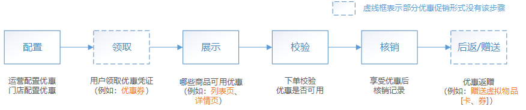

围绕优惠核心生命周期，梳理经典流程如下：

### 2.1.1 优惠配置流程

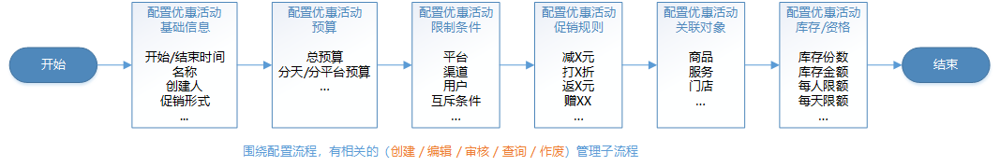

### 2.1.2 优惠领取流程

### 2.1.3 优惠展示流程

### 2.1.4 优惠校验流程

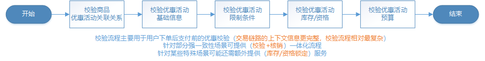

### 2.1.5 优惠核销流程

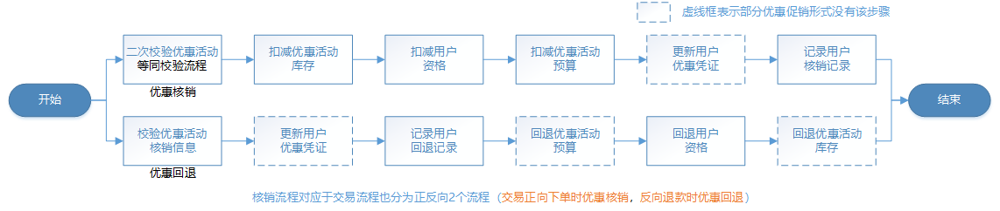

### 2.1.6 优惠后返/赠送流程

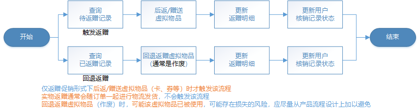

### 2.1.7 优惠状态变更广播流程

## 2.2 领域能力列表

基于上述 **领域经典流程** ，结合 **领域涉众** ，梳理面向各端提供的领域能力。其中领域能力主要从以下2方面来描述：

### 2.2.1 优惠领域面向外部领域提供的能力

<table><colgroup><col> <col> <col> <col> <col></colgroup><tbody><tr><th>服务</th><th>主要能力</th><th>能力描述</th><th colspan="1">涉众</th><th colspan="1">涵盖优惠促销形式</th></tr><tr><td colspan="5"><strong>面向（运营/门店）端的优惠管理后台</strong></td></tr><tr><td rowspan="6">优惠配置服务</td><td>创建优惠活动</td><td>支持（运营、第三方门店等）不同角色人员创建</td><td colspan="1">运营、门店</td><td colspan="1">优惠券、优惠立减、返赠</td></tr><tr><td colspan="1">批量创建优惠活动</td><td colspan="1">批量操作</td><td colspan="1">门店</td><td colspan="1">优惠立减、返赠</td></tr><tr><td colspan="1">编辑优惠活动</td><td colspan="1">优惠活动创建之后的修改编辑（仅允许修改部分信息）</td><td colspan="1">运营、门店</td><td colspan="1">优惠券、优惠立减、返赠</td></tr><tr><td>审核优惠活动</td><td>活动安全审核（包含系统风控自动审核、人工审批链）</td><td colspan="1">运营、BD</td><td colspan="1">优惠券、优惠立减、返赠</td></tr><tr><td colspan="1">批量审核优惠活动</td><td colspan="1">批量操作</td><td colspan="1">运营、BD</td><td colspan="1">优惠券、优惠立减、返赠</td></tr><tr><td colspan="1">优惠活动状态变更</td><td colspan="1">支持（暂停、下线、作废等）操作</td><td colspan="1">运营、门店、BD</td><td colspan="1">优惠券、优惠立减、返赠</td></tr><tr><td rowspan="2">优惠查询服务</td><td colspan="1">查询优惠活动列表</td><td colspan="1">多条件过滤查询</td><td colspan="1">运营、门店、BD</td><td colspan="1">优惠券、优惠立减、返赠</td></tr><tr><td colspan="1">查询优惠活动明细</td><td colspan="1">查询活动相关明细信息</td><td colspan="1">运营、门店、BD</td><td colspan="1">优惠券、优惠立减、返赠</td></tr><tr><td colspan="5"><strong>面向（用户/门店/运营）端的优惠领取</strong></td></tr><tr><td rowspan="2">优惠领取服务</td><td colspan="1">领取单种优惠</td><td colspan="1">（单用户、多用户）领取（用户/门店端的活动领取，运营端的后台塞券）</td><td colspan="1">用户、门店、运营</td><td colspan="1">优惠券</td></tr><tr><td colspan="1">批量领取多种优惠</td><td colspan="1">（单用户、多用户）批量操作</td><td colspan="1">用户、门店、运营</td><td colspan="1">优惠券</td></tr><tr><td colspan="5"><strong>面向（用户/门店）端的优惠展示</strong></td></tr><tr><td rowspan="3">优惠查询服务</td><td colspan="1">查询可用优惠活动列表</td><td colspan="1">查询单个（商品、门店、服务等）的可用优惠活动（一般用于详情页）</td><td colspan="1">用户、门店</td><td colspan="1">优惠券、优惠立减、返赠</td></tr><tr><td colspan="1">批量查询可用优惠活动列表</td><td colspan="1">多个（商品、门店、服务等）批量操作（一般用于列表页，搜索页、活动页）</td><td colspan="1">用户、门店</td><td colspan="1">优惠券、优惠立减、返赠</td></tr><tr><td colspan="1">查询可用优惠活动最优组合列表</td><td colspan="1">查询（单个、多个）商品的可用优惠活动的最优组合（一般用于提单页）</td><td colspan="1">用户、门店</td><td colspan="1">优惠券、优惠立减、返赠</td></tr><tr><td colspan="5"><strong>面向（交易流程）的优惠使用</strong></td></tr><tr><td rowspan="2">优惠校验服务</td><td colspan="1">校验优惠</td><td colspan="1">（单个、多个）（商品、门店、服务等）校验是否可用某一个优惠活动</td><td colspan="1">交易下单</td><td colspan="1">优惠券、优惠立减、返赠</td></tr><tr><td colspan="1">批量校验优惠</td><td colspan="1">（单个、多个）（商品、门店、服务等）校验是否可用多个优惠活动</td><td colspan="1">交易下单</td><td colspan="1">优惠券、优惠立减、返赠</td></tr><tr><td rowspan="2">优惠锁定服务</td><td colspan="1">预锁定优惠</td><td colspan="1">校验成功后预先锁定优惠库存及资格（用于部分严格控制库存&资格的场景）</td><td colspan="1">交易下单</td><td colspan="1">优惠券、优惠立减、返赠</td></tr><tr><td colspan="1">取消锁定优惠</td><td colspan="1">回滚之前预先锁定的优惠库存及资格（通常是交易下单失败后的回滚）</td><td colspan="1">交易下单</td><td colspan="1">优惠券、优惠立减、返赠</td></tr><tr><td rowspan="6">优惠核销服务</td><td colspan="1">核销优惠</td><td colspan="1">核销具体某一个优惠活动（对应交易正向下单流程）</td><td colspan="1">交易下单</td><td colspan="1">优惠券、优惠立减、返赠</td></tr><tr><td colspan="1">校验并核销优惠</td><td colspan="1">校验并核销具体某一个优惠活动（适用部分要求强一致性场景）</td><td colspan="1">交易下单</td><td colspan="1">优惠券、优惠立减、返赠</td></tr><tr><td colspan="1">批量核销优惠</td><td colspan="1">批量操作核销多个优惠活动（对应交易正向下单流程）</td><td colspan="1">交易下单</td><td colspan="1">优惠券、优惠立减、返赠</td></tr><tr><td colspan="1">回退优惠</td><td colspan="1">核销优惠的反向操作（对应交易反向退单流程）</td><td colspan="1">交易退单</td><td colspan="1">优惠券、优惠立减、返赠</td></tr><tr><td colspan="1">批量回退优惠</td><td colspan="1">批量操作（对应交易反向退单流程）</td><td colspan="1">交易退单</td><td colspan="1">优惠券、优惠立减、返赠</td></tr><tr><td colspan="1">部分回退优惠</td><td colspan="1">多个商品退单其中某1个或几个商品时触发优惠部分回退</td><td colspan="1">交易退单</td><td colspan="1">优惠券、优惠立减、返赠</td></tr><tr><td rowspan="2">优惠后返/赠送服务</td><td colspan="1">后返/赠送优惠</td><td colspan="1">
交易成功后返还/赠送指定的优惠（主要是虚拟物品，例如：券、E卡等）（核销优惠之后，通过MQ/定时Job来驱动）
</td><td colspan="1">交易下单</td><td colspan="1">返赠</td></tr><tr><td colspan="1">回退（后返/赠送的）优惠</td><td colspan="1">
回退之前返还/赠送的优惠（内部回退优惠之后，通过MQ/定时Job来驱动）
</td><td colspan="1">交易退单</td><td colspan="1">返赠</td></tr><tr><td colspan="5"><strong>面向（资金结算）的优惠对账</strong></td></tr><tr><td colspan="1">优惠查询服务</td><td colspan="1">查询订单优惠明细</td><td colspan="1">查询用户订单上关联的每笔优惠的优惠明细</td><td colspan="1">结算、营销预算</td><td colspan="1">优惠券、优惠立减、返赠</td></tr><tr><td colspan="5"><strong>面向（下游业务方）的优惠状态变更广播</strong></td></tr><tr><td colspan="1">优惠状态广播MQ</td><td colspan="1">通知优惠状态变更</td><td colspan="1">已创建/已领取/已使用/已作废/已回退等状态变更的MQ通知</td><td colspan="1">下游业务方</td><td colspan="1">优惠券、优惠立减、返赠</td></tr></tbody></table>

### 2.2.2 优惠领域内部沉淀的通用能力

<table><colgroup><col> <col> <col> <col></colgroup><tbody><tr><th>服务</th><th>主要能力</th><th>能力描述</th><th>领域外部依赖</th></tr><tr><td rowspan="4">统一标准接入服务</td><td>统一优惠查询</td><td>提供优惠域（优惠券、优惠立减、返赠）的对外统一封装查询和对内分发</td><td>用户账号、门店账号</td></tr><tr><td colspan="1">统一优惠校验</td><td colspan="1">提供优惠域（优惠券、优惠立减、返赠）的对外统一封装校验和对内分发</td><td colspan="1">用户账号、门店账号</td></tr><tr><td colspan="1">统一优惠锁定</td><td colspan="1">提供优惠域（优惠券、优惠立减、返赠）的对外统一封装锁定和对内分发</td><td colspan="1">用户账号、门店账号</td></tr><tr><td colspan="1">统一优惠核销</td><td colspan="1">提供优惠域（优惠券、优惠立减、返赠）的对外统一封装核销和对内分发</td><td colspan="1">用户账号、门店账号</td></tr><tr><td rowspan="2">活动信息服务</td><td>统一活动信息管理</td><td>提供通用的优惠活动信息（创建/作废/编辑/查询）管理</td><td></td></tr><tr><td>活动状态流转控制</td><td>提供通用的优惠活动状态（已创建/审核中/审核成功/已暂停/已作废等）变更</td><td></td></tr><tr><td rowspan="3">规则计算服务</td><td colspan="1">条件匹配</td><td colspan="1">提供通用的促销限制条件与促销规则计算与匹配（支持条件的与、或、非和基础运算）</td><td colspan="1">商品、价格、品类、用户账号等</td></tr><tr><td colspan="1">用户匹配</td><td colspan="1">提供通用的目标用户圈选（支持条件筛选、用户画像组合、算法动态匹配等）</td><td colspan="1">营销圈人</td></tr><tr><td colspan="1">产品索引</td><td colspan="1">提供通用的优惠关联产品（商品、门店、服务等）的筛选和索引查询</td><td colspan="1">营销选单</td></tr><tr><td rowspan="5">
优惠库存服务
</td><td colspan="1">优惠库存配置</td><td colspan="1">提供（全局、分周期、分商品、分城市等）的优惠库存（创建/编辑/作废/查询）管理</td><td colspan="1"></td></tr><tr><td colspan="1">优惠库存锁定</td><td colspan="1">（锁定/取消锁定）（全局、分周期、分商品、分城市等）的优惠库存</td><td colspan="1"></td></tr><tr><td colspan="1">优惠库存消耗</td><td colspan="1">（锁定后消耗/直接消耗）（全局、分周期、分商品、分城市等）的优惠库存</td><td colspan="1"></td></tr><tr><td colspan="1">优惠库存回退</td><td colspan="1">（消耗后回退）（全局、分周期、分商品、分城市等）的优惠库存</td><td colspan="1"></td></tr><tr><td colspan="1">优惠库存部分回退</td><td colspan="1">（消耗后部分回退）（全局、分周期、分商品、分城市等）的优惠库存</td><td colspan="1"></td></tr><tr><td rowspan="4">优惠资格服务</td><td colspan="1">优惠资格配置</td><td colspan="1">提供（用户、商品、周期等维度）的优惠资格（创建/编辑/作废/查询）管理</td><td colspan="1"></td></tr><tr><td colspan="1">优惠资格锁定</td><td colspan="1">（锁定/取消锁定）（用户、商品、周期等维度）的优惠资格</td><td colspan="1"></td></tr><tr><td colspan="1">优惠资格消耗</td><td colspan="1">（锁定后消耗/直接消耗）（用户、商品、周期等维度）的优惠资格</td><td colspan="1"></td></tr><tr><td colspan="1">优惠资格回退</td><td colspan="1">（消耗后回退）（用户、商品、周期等维度）的优惠资格</td><td colspan="1"></td></tr><tr><td rowspan="4">优惠预算服务</td><td colspan="1">优惠预算管理</td><td colspan="1">提供业务主体（平台、第三方门店）预算（申请、增、减）管理</td><td rowspan="4">营销预算</td></tr><tr><td colspan="1">优惠预算消耗</td><td colspan="1">消耗业务主体（平台、第三方门店）预算</td></tr><tr><td colspan="1">优惠预算回退</td><td colspan="1">回退业务主体（平台、第三方门店）预算</td></tr><tr><td colspan="1">优惠预算部分回退</td><td colspan="1">部分回退业务主体（平台、第三方门店）预算</td></tr><tr><td rowspan="2">优惠资金对账服务</td><td colspan="1">准实时资金对账</td><td colspan="1">监听（订单、优惠、预算）三方的资金流水，准实时比对</td><td rowspan="2">订单、营销预算</td></tr><tr><td colspan="1">离线资金对账</td><td colspan="1">T+1拉取（订单、优惠、预算）三方的资金流水，离线比对</td></tr></tbody></table>

## 2.3 领域边界

<table><colgroup><col> <col> <col> <col></colgroup><thead><tr><th>
序号
</th><th>
其他领域名称
</th><th>
与本领域的依赖关系
</th><th colspan="1">依赖逻辑</th></tr></thead><tbody><tr><td>1</td><td>业务域（各业务线）</td><td rowspan="3">优惠域的上游（该领域依赖优惠域提供的相关服务接口） </td><td colspan="1">优惠查询（展示）、优惠领取、优惠状态变更广播</td></tr><tr><td>2</td><td>交易</td><td colspan="1">优惠校验、优惠锁定、优惠核销</td></tr><tr><td>3</td><td colspan="1">结算</td><td colspan="1">优惠查询（对账）</td></tr><tr><td>4</td><td colspan="1">商品</td><td rowspan="10">优惠域的下游（优惠域依赖该领域提供的相关服务接口）</td><td colspan="1">查询商品基础信息（品牌、品类、状态等）</td></tr><tr><td>5</td><td colspan="1">价格</td><td colspan="1">查询商品价格信息</td></tr><tr><td>6</td><td colspan="1">用户账号</td><td colspan="1">查询、校验用户基础信息</td></tr><tr><td colspan="1">7</td><td colspan="1">门店账号</td><td colspan="1">查询、校验门店账号相关信息</td></tr><tr><td colspan="1">8</td><td colspan="1">员工账号</td><td colspan="1">查询、校验员工账号相关信息</td></tr><tr><td>9</td><td colspan="1">门店</td><td colspan="1">查询门店基础信息，所售商品信息等</td></tr><tr><td>10</td><td colspan="1">营销预算</td><td colspan="1">营销预算的管理、消耗、回退</td></tr><tr><td>11</td><td colspan="1">营销圈人</td><td colspan="1">目标用户圈选</td></tr><tr><td>12</td><td colspan="1">营销选单</td><td colspan="1">目标（商品、门店等）筛选</td></tr><tr><td colspan="1">13</td><td colspan="1">风控</td><td colspan="1">基础风控拦截</td></tr></tbody></table>

## 三、逻辑架构设计

## 3.1 逻辑架构图

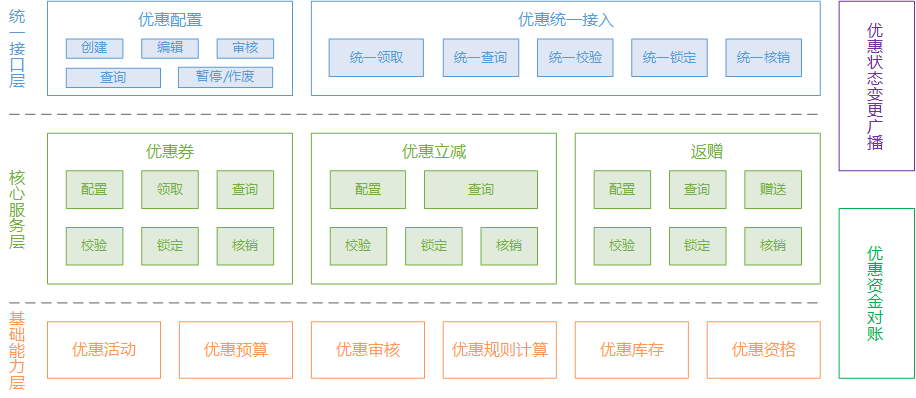

**\*\*\*** 需要说明：图中的每一个模块实际可能对应一到多个物理部署单元（Spring Boot的Fat Jar），具体映射关系视系统开发阶段的实现逻辑而定（会在后续的详细设计中标明）。

## 3.2 状态机

针对优惠领域核心领域模型，梳理其状态变迁，主要分为以下几部分：

### 3.2.1 优惠活动状态变迁

优惠券、优惠立减、返赠都是优惠活动，针对共性部分，抽象统一的优惠活动信息管理，共享同一个优惠活动状态变迁，其状态机如下所示：

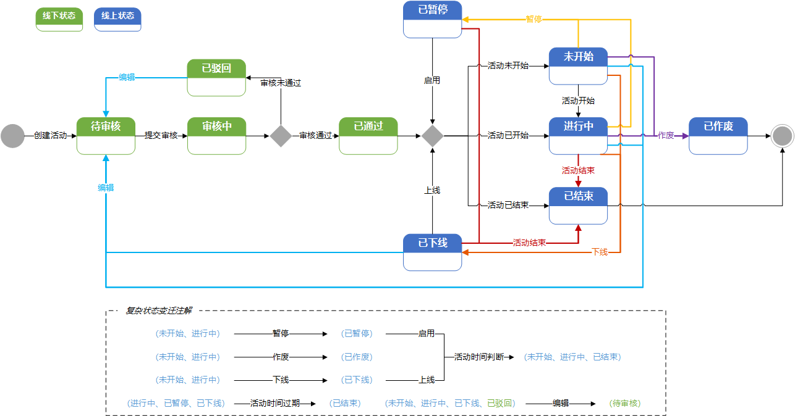

### 3.2.2 用户券状态变迁

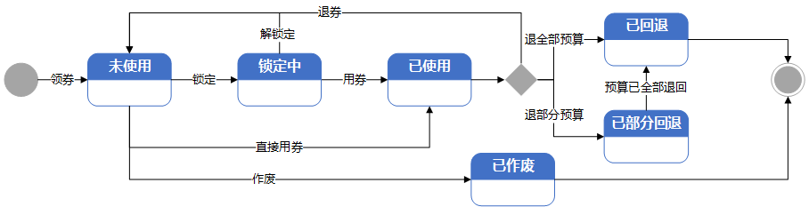

### 3.2.3 立减核销记录状态变迁

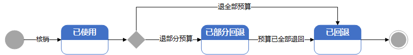

### 3.2.4 返赠记录状态变迁

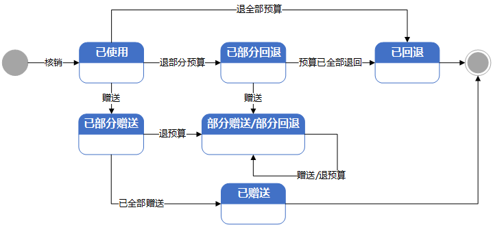

## 四、数据结构设计

## 4.1 数据库设计

基于3.1中领域架构图和分层逻辑，梳理必须包含的核心数据库表：

<table><colgroup><col> <col> <col> <col> <col></colgroup><thead><tr><th>
序号
</th><th>
数据表名
</th><th>
表说明
</th><th colspan="1">
表容量预估
</th><th colspan="1">所属数据库名</th></tr></thead><tbody><tr><td>1</td><td>优惠活动基础信息</td><td>记录（优惠券、优惠立减、返赠）通用的一些活动基础信息，如：名称、开始/结束时间、业务线等</td><td colspan="1">约200W</td><td rowspan="4">优惠活动配置库 </td></tr><tr><td colspan="1">2</td><td colspan="1">优惠活动基础信息草稿</td><td colspan="1">优惠活动编辑、审核时的线下记录表</td><td colspan="1">约500W</td></tr><tr><td>3</td><td>活动预算信息</td><td>记录活动相关营销预算信息，如：预算编号、预算金额、成本归属等</td><td colspan="1">约200W</td></tr><tr><td>4</td><td>活动审核信息</td><td>记录活动审核时的变更信息、审核信息，如：审核人、审核内容、审核时间等</td><td colspan="1">约500W</td></tr><tr><td>5</td><td colspan="1">券活动</td><td colspan="1">记录优惠券活动相关的一些限制条件、奖励规则等信息，如：库存、适用渠道、可用时间、促销类型（立减券/满减券）等</td><td colspan="1">约50W</td><td rowspan="5">优惠券相关信息库 </td></tr><tr><td colspan="1">6</td><td colspan="1">券规则扩展</td><td colspan="1">记录优惠券一些相对较灵活的限制条件信息，如：适用城市、适用APP版本、适用业务等（KV形式，便于扩展）</td><td colspan="1">约250W</td></tr><tr><td>7</td><td colspan="1">用户券</td><td colspan="1">记录用户参与优惠券活动领取到账后的优惠凭证相关信息，如：用户ID、券活动ID、有效期、核销状态、核销时间、核销订单号、核销订单金额、优惠金额等</td><td colspan="1">约20亿</td></tr><tr><td>8</td><td>用户券扩展</td><td>记录用户领取到账时才最终确定的一些限制条件信息，如：实际优惠奖励金额、特定限制渠道、手机号等（KV形式，便于扩展）</td><td colspan="1">约2亿</td></tr><tr><td colspan="1">9</td><td colspan="1">用户券核销记录</td><td colspan="1">记录用户券核销时的详细上下文信息，包括用户券ID、核销订单金额、核销订单号、核销请求唯一标识、优惠金额、核销类型（核销/回退）等</td><td colspan="1">约3000W</td></tr><tr><td colspan="1">10</td><td colspan="1">立减活动</td><td colspan="1">记录立减活动相关的一些通用限制条件等信息，如：库存、促销类型（立减/满减/折扣/立减至X/阶梯减）、适用渠道等</td><td colspan="1">约100W</td><td rowspan="5">优惠立减相关信息库</td></tr><tr><td colspan="1">11</td><td colspan="1">立减规则</td><td colspan="1">记录立减活动的一些跟奖励相关的差异化限制条件信息，如：用户限制、商品限制</td><td colspan="1">约150W</td></tr><tr><td colspan="1">12</td><td colspan="1">立减规则扩展</td><td colspan="1">记录立减规则的一些相对较灵活的限制条件信息，如：适用城市、适用APP版本、适用业务等（KV形式，便于扩展）</td><td colspan="1">约500W</td></tr><tr><td colspan="1">13</td><td colspan="1">立减奖励</td><td colspan="1">记录与立减规则相关联的具体奖励等信息，如立减金额、满减门槛、折扣比例等（一个用户通常只会获取具体某一种奖励）</td><td colspan="1">约250W</td></tr><tr><td colspan="1">14</td><td colspan="1">立减核销记录</td><td colspan="1">记录立减核销时的相关上下文信息，包括立减活动ID、立减规则ID、立减奖励ID、立减金额、核销订单号、核销状态等</td><td colspan="1">约5亿</td></tr><tr><td colspan="1">15</td><td colspan="1">返赠活动</td><td colspan="1">记录优惠券活动相关的一些限制条件、奖励规则等信息，如：返赠类型（立返/满返/阶梯返）、库存、适用渠道、可用时间、订单安装类型等</td><td colspan="1">约50W</td><td rowspan="6">返赠相关信息库 </td></tr><tr><td colspan="1">16</td><td colspan="1">返赠规则</td><td colspan="1">记录返赠活动的一些跟奖励相关的差异化限制条件信息，如：用户限制、商品限制、轮胎类型、轮胎尺寸等</td><td colspan="1">约100W</td></tr><tr><td colspan="1">17</td><td colspan="1">返赠规则扩展</td><td colspan="1">记录立减规则的一些相对较灵活的限制条件信息，如：适用城市、适用APP版本、轮胎品牌（KV形式，便于扩展）</td><td colspan="1">约250W</td></tr><tr><td colspan="1">18</td><td colspan="1">返赠奖励</td><td colspan="1">记录与返赠规则相关联的具体奖励等信息，如返赠奖励类型（实物/券/E卡等）、返赠门槛、返赠数量、返赠物品标识（PID/券ID/E卡编号）等（一个用户通常可能会获取多种不同奖励）</td><td colspan="1">约150W</td></tr><tr><td colspan="1">19</td><td colspan="1">返赠记录</td><td colspan="1">记录用户获取返赠奖励时的相关上下文信息，包括返赠活动ID、返赠规则ID、返赠奖励ID列表、核销订单号、核销状态等</td><td colspan="1">约5亿</td></tr><tr><td colspan="1">20</td><td colspan="1">返赠明细</td><td colspan="1">记录用户返赠奖励的具体赠送明细信息，包括返赠记录ID、返赠奖励ID、赠送状态（成功/失败）、奖励赠送成功标识ID等</td><td colspan="1">约15亿</td></tr><tr><td colspan="1">21</td><td colspan="1">活动库存</td><td colspan="1">记录活动的库存明细，如：活动ID、奖励ID（活动粒度的库存该字段为空）、库存类型（数量/金额）、总库存、冻结库存、剩余库存等（总库存 - 剩余库存 - 冻结库存 = 已消耗库存）</td><td colspan="1">约500W</td><td rowspan="2">优惠库存库</td></tr><tr><td colspan="1">22</td><td colspan="1">活动分维度库存</td><td colspan="1">记录活动分维度（指定周期/商品/渠道等）的库存明细，叠加：维度ID（多个维度标识可通过编码统一为1个维度ID）</td><td colspan="1">约5亿</td></tr><tr><td colspan="1">23</td><td colspan="1">用户资格</td><td colspan="1">记录活动参与用户的资格明细，如：用户ID、活动ID、总资格、冻结资格、剩余资格等</td><td colspan="1">约50亿</td><td rowspan="2">优惠资格库</td></tr><tr><td colspan="1">24</td><td colspan="1">用户分维度资格</td><td colspan="1">记录活动参与用户分维度（指定周期/商品/渠道等）的资格明细，叠加：维度ID（多个维度标识可通过编码统一为1个维度ID）</td><td colspan="1">约100亿</td></tr></tbody></table>

**\*\*\*** 需要说明：表格中表容量预估逻辑：2019年相关业务的数据量 + 预估未来2~3年的数据增长量（5倍）+表数据之间的关联放大比例。

## 4.2 核心数据表设计

针对上述核心数据表，给出部分关键字段设计，详细的表结构在详细设计阶段给出。

<table><colgroup><col> <col> <col> <col> <col> <col> <col></colgroup><thead><tr><th>
字段名
</th><th>
类型
</th><th>
长度
</th><th>
默认值
</th><th>
是否可空
</th><th>
描述
</th><th>索引信息</th></tr></thead><tbody><tr><td>ID</td><td>bigint</td><td>20</td><td>auto_increment</td><td>否</td><td>自增ID（所有表统一必须包含）</td><td>主键索引</td></tr><tr><td>创建时间</td><td>datetime</td><td></td><td></td><td>否</td><td>（所有表统一必须包含）</td><td></td></tr><tr><td>更新时间</td><td>datetime</td><td></td><td>current_timestamp</td><td>否</td><td>（所有表统一必须包含）</td><td>索引列，便于大数据平台做同步</td></tr><tr><td colspan="7"><strong>优惠活动基础信息表</strong></td></tr><tr><td>活动标识ID</td><td>varchar</td><td>32</td><td></td><td>否</td><td>优惠活动对外暴露的唯一标识ID（需考虑安全性设计，防遍历）</td><td>唯一索引</td></tr><tr><td>活动名称</td><td>varchar</td><td>256</td><td></td><td>否</td><td></td><td></td></tr><tr><td>活动描述</td><td>varchar</td><td>1024</td><td></td><td>是</td><td></td><td></td></tr><tr><td>开始时间</td><td>datetime</td><td></td><td></td><td>否</td><td></td><td>（状态，开始时间）联合索引</td></tr><tr><td>结束时间</td><td>datetime</td><td></td><td></td><td>否</td><td></td><td>（状态，结束时间）联合索引</td></tr><tr><td>活动类型</td><td>tinyint</td><td>2</td><td></td><td>否</td><td>优惠券、优惠立减、返赠</td><td></td></tr><tr><td>业务类型</td><td>tinyint</td><td>2</td><td></td><td>否</td><td>轮胎/保养/车品/美容</td><td></td></tr><tr><td>活动状态</td><td>tinyint</td><td>2</td><td></td><td>否</td><td>已上线（未开始/进行中）/已暂停/已下线/已结束/已作废</td><td></td></tr><tr><td>版本号</td><td>int</td><td>10</td><td>0</td><td>否</td><td>用于标识同一个优惠活动多次修改时的版本</td><td></td></tr><tr><td>成本归属类型</td><td>tinyint</td><td>2</td><td></td><td>否</td><td>平台/第三方门店/供应商</td><td></td></tr><tr><td>成本归属标识</td><td>varchar</td><td>64</td><td></td><td>否</td><td>（平台：组织架构部门）/（第三方门店：门店ID）/（供应商：供应商ID）/...</td><td></td></tr><tr><td>创建人</td><td>varchar</td><td>64</td><td></td><td>否</td><td></td><td></td></tr><tr><td>修改人</td><td>varchar</td><td>64</td><td></td><td>否</td><td></td><td></td></tr><tr><td colspan="7"><strong>优惠活动基础信息草稿表（线下表）</strong></td></tr><tr><td>活动标识ID</td><td>varchar</td><td>32</td><td></td><td>否</td><td>优惠活动对外暴露的唯一标识ID（需考虑安全性设计，防遍历）</td><td>唯一索引</td></tr><tr><td>活动名称</td><td>varchar</td><td>256</td><td></td><td>否</td><td></td><td></td></tr><tr><td>活动描述</td><td>varchar</td><td>1024</td><td></td><td>是</td><td></td><td></td></tr><tr><td>开始时间</td><td>datetime</td><td></td><td></td><td>否</td><td></td><td>单列索引</td></tr><tr><td>结束时间</td><td>datetime</td><td></td><td></td><td>否</td><td></td><td></td></tr><tr><td>活动类型</td><td>tinyint</td><td>2</td><td></td><td>否</td><td>优惠券、优惠立减、返赠</td><td></td></tr><tr><td>业务类型</td><td>tinyint</td><td>2</td><td></td><td>否</td><td>轮胎/保养/车品/美容</td><td></td></tr><tr><td>活动状态</td><td>tinyint</td><td>2</td><td></td><td>否</td><td>待审核/审核中/已驳回/已通过</td><td></td></tr><tr><td>版本号</td><td>int</td><td>10</td><td>0</td><td>否</td><td>用于标识同一个优惠活动多次修改时的版本</td><td></td></tr><tr><td>活动明细</td><td>text</td><td></td><td></td><td>否</td><td>除与优惠活动基础信息表保持一致的相关字段外，（其他所有字段内容组合后的Json串）</td><td></td></tr><tr><td>成本归属类型</td><td>tinyint</td><td>2</td><td></td><td>否</td><td>平台/第三方门店/供应商</td><td></td></tr><tr><td>成本归属标识</td><td>varchar</td><td>64</td><td></td><td>否</td><td>（平台：组织架构部门）/（第三方门店：门店ID）/（供应商：供应商ID）/...</td><td></td></tr><tr><td>创建人</td><td>varchar</td><td>64</td><td></td><td>否</td><td></td><td></td></tr><tr><td>修改人</td><td>varchar</td><td>64</td><td></td><td>否</td><td></td><td></td></tr><tr><td colspan="7"><strong>活动预算信息表</strong></td></tr><tr><td>活动标识ID</td><td>varchar</td><td>32</td><td></td><td>否</td><td>优惠活动对外暴露的唯一标识ID（需考虑安全性设计，防遍历）</td><td>唯一索引</td></tr><tr><td>预算编号</td><td>varchar</td><td>32</td><td></td><td>否</td><td>营销预算系统标识某一笔预算的唯一编号</td><td>单列索引</td></tr><tr><td>预算金额</td><td>decimal</td><td>(10, 2)</td><td></td><td>否</td><td></td><td></td></tr><tr><td>核销比例</td><td>decimal</td><td>(10, 4)</td><td></td><td>否</td><td>百分比小数（0，100]</td><td></td></tr><tr><td>成本归属</td><td>varchar</td><td>128</td><td></td><td>否</td><td>预算成本归属信息（跨部门/门店/供应商/平台和门店比例承担等）</td><td></td></tr><tr><td colspan="7"><strong>活动审核信息表（线下表）</strong></td></tr><tr><td>活动标识ID</td><td>varchar</td><td>32</td><td></td><td>否</td><td>优惠活动对外暴露的唯一标识ID（需考虑安全性设计，防遍历）</td><td>（活动标识ID，活动版本号）唯一索引</td></tr><tr><td>活动版本号</td><td>int</td><td>10</td><td>0</td><td>否</td><td>用于标识同一个优惠活动多次修改时的版本</td><td></td></tr><tr><td>审核内容</td><td>text</td><td></td><td></td><td>否</td><td>待审核的变更内容</td><td></td></tr><tr><td>审核流程标识ID</td><td>varchar</td><td>64</td><td></td><td>否</td><td>审批链的标识</td><td></td></tr><tr><td>审核人列表</td><td>varchar</td><td>512</td><td></td><td>否</td><td>审批链上的多个审批人（审批流程复用其他现有的系统）</td><td></td></tr><tr><td>审核意见</td><td>varchar</td><td>512</td><td>“”</td><td>是</td><td>审核通过的理由或审核驳回的原因</td><td></td></tr><tr><td colspan="7"><strong>券活动表</strong></td></tr><tr><td>活动标识ID</td><td>varchar</td><td>32</td><td></td><td>否</td><td>优惠活动对外暴露的唯一标识ID（需考虑安全性设计，防遍历）</td><td>唯一索引</td></tr><tr><td>券类型</td><td>tinyint</td><td>2</td><td></td><td>否</td><td>立减券/满减券/折扣券/</td><td></td></tr><tr><td>数量</td><td>bigint</td><td>20</td><td></td><td>否</td><td>库存数量</td><td></td></tr><tr><td>适用平台列表</td><td>varchar</td><td>128</td><td></td><td>否</td><td>自定义枚举（Android/iOS/PC/H5/小程序）</td><td></td></tr><tr><td>适用渠道列表</td><td>varchar</td><td>128</td><td></td><td>否</td><td>自定义枚举（红虎/蓝虎/大客户）</td><td></td></tr><tr><td colspan="1">适用场景列表</td><td colspan="1">varchar</td><td colspan="1">256</td><td colspan="1"></td><td colspan="1">否</td><td colspan="1">自定义枚举（活动抽奖/保养返券/会员权益塞券/新人礼包等）</td><td colspan="1"></td></tr><tr><td>领取后有效期</td><td>int</td><td>10</td><td></td><td>是</td><td>领取后X天可用</td><td></td></tr><tr><td>可用开始时间</td><td>datetime</td><td></td><td></td><td>是</td><td></td><td></td></tr><tr><td>可用结束时间</td><td>datetime</td><td></td><td></td><td>是</td><td></td><td></td></tr><tr><td>是否节假日可用</td><td>tinyint</td><td>1</td><td></td><td>是</td><td></td><td></td></tr><tr><td>互斥条件列表</td><td>varchar</td><td>128</td><td></td><td>否</td><td>自定义枚举（不与券同享/不与立减同享/不与返赠同享）</td><td></td></tr><tr><td>每人限领次数</td><td>int</td><td>10</td><td></td><td>是</td><td></td><td></td></tr><tr><td>每人每天可使用次数</td><td>int</td><td>10</td><td></td><td>是</td><td></td><td></td></tr><tr><td colspan="7"><strong>券规则扩展表</strong></td></tr><tr><td>活动标识ID</td><td>varchar</td><td>32</td><td></td><td>否</td><td>优惠活动对外暴露的唯一标识ID（需考虑安全性设计，防遍历）</td><td>（活动标识ID、扩展条件名称）联合索引</td></tr><tr><td>扩展条件名称</td><td>int</td><td>10</td><td></td><td>否</td><td>自定义枚举（城市/APP版本/黑白名单等）</td><td></td></tr><tr><td>扩展条件值</td><td>varchar</td><td>1024</td><td></td><td>否</td><td></td><td></td></tr><tr><td colspan="7"><strong>用户券表</strong></td></tr><tr><td>用户ID</td><td>varchar</td><td>64</td><td></td><td>否</td><td></td><td>单列索引</td></tr><tr><td>活动标识ID</td><td>varchar</td><td>32</td><td></td><td>否</td><td>优惠活动对外暴露的唯一标识ID（需考虑安全性设计，防遍历）</td><td>单列索引</td></tr><tr><td>活动版本号</td><td>int</td><td>10</td><td>0</td><td>否</td><td>用于标识同一个优惠活动多次修改时的版本（冗余，便于跟踪历史轨迹）</td><td></td></tr><tr><td>可用开始时间</td><td>datetime</td><td></td><td></td><td>否</td><td></td><td></td></tr><tr><td>可用结束时间</td><td>datetime</td><td></td><td></td><td>否</td><td></td><td></td></tr><tr><td>核销状态</td><td>tinyint</td><td>2</td><td></td><td>否</td><td>未使用/已使用/已作废/已回退/已部分回退</td><td></td></tr><tr><td>核销时间</td><td>datetime</td><td></td><td></td><td>是</td><td></td><td></td></tr><tr><td>核销订单号</td><td>varchar</td><td>64</td><td></td><td>是</td><td>下单时订单号</td><td></td></tr><tr><td>核销订单金额</td><td>decimal</td><td>(10, 2)</td><td></td><td>是</td><td></td><td></td></tr><tr><td>优惠金额</td><td>decimal</td><td>(10, 2)</td><td></td><td>是</td><td></td><td></td></tr><tr><td colspan="7"><strong>用户券扩展表</strong></td></tr><tr><td>用户券ID</td><td>bigint</td><td>20</td><td></td><td>否</td><td>用户券主键ID</td><td>（用户券、扩展条件名称）联合索引</td></tr><tr><td>扩展条件名称</td><td>int</td><td>10</td><td></td><td>否</td><td>自定义枚举（限制渠道/手机号/优惠面额等）</td><td></td></tr><tr><td>扩展条件值</td><td>varchar</td><td>1024</td><td></td><td>否</td><td></td><td></td></tr><tr><td colspan="7"><strong>用户券核销记录表</strong></td></tr><tr><td>用户券ID</td><td>bigint</td><td>20</td><td></td><td>否</td><td>用户券主键ID</td><td>单列索引</td></tr><tr><td>核销请求唯一标识</td><td>varchar</td><td>64</td><td></td><td>否</td><td></td><td>单列索引</td></tr><tr><td>核销类型</td><td>tinyint</td><td>2</td><td></td><td>否</td><td>核销/回退</td><td></td></tr><tr><td>核销订单号</td><td>varchar</td><td>64</td><td></td><td>否</td><td>根据核销类型分别记录下单订单号和退款订单号</td><td>单列索引</td></tr><tr><td>核销订单金额</td><td>decimal</td><td>(10, 2)</td><td></td><td>否</td><td></td><td></td></tr><tr><td>优惠金额</td><td>decimal</td><td>(10, 2)</td><td></td><td>否</td><td></td><td></td></tr><tr><td colspan="7"><strong>立减活动表</strong></td></tr><tr><td>活动标识ID</td><td>varchar</td><td>32</td><td></td><td>否</td><td>优惠活动对外暴露的唯一标识ID（需考虑安全性设计，防遍历）</td><td>唯一索引</td></tr><tr><td>立减类型</td><td>tinyint</td><td>2</td><td></td><td>否</td><td>立减/满减/折扣/立减至/阶梯减/随机立减</td><td></td></tr><tr><td>适用平台列表</td><td>varchar</td><td>128</td><td></td><td>否</td><td>自定义枚举（Android/iOS/PC/H5/小程序）</td><td></td></tr><tr><td>适用渠道列表</td><td>varchar</td><td>128</td><td></td><td>否</td><td>自定义枚举（红虎/蓝虎/大客户）</td><td></td></tr><tr><td>互斥条件列表</td><td>varchar</td><td>128</td><td></td><td>否</td><td>自定义枚举（不与券同享/不与立减同享/不与返赠同享）</td><td></td></tr><tr><td>每人可使用次数</td><td>int</td><td>10</td><td></td><td>是</td><td></td><td></td></tr><tr><td colspan="7"><strong>立减规则表</strong></td></tr><tr><td>活动标识ID</td><td>varchar</td><td>32</td><td></td><td>否</td><td>优惠活动对外暴露的唯一标识ID（需考虑安全性设计，防遍历）</td><td>单列索引</td></tr><tr><td>用户标签</td><td>varchar</td><td>128</td><td></td><td>否</td><td>用户标签列表（平台新用户/业务新用户）</td><td></td></tr><tr><td>适用商品品类</td><td>varchar</td><td>128</td><td></td><td>是</td><td></td><td></td></tr><tr><td colspan="7"><strong>立减规则扩展表</strong></td></tr><tr><td>立减规则ID</td><td>bigint</td><td>20</td><td></td><td>否</td><td>立减规则主键ID</td><td>单列索引</td></tr><tr><td>扩展条件名称</td><td>int</td><td>10</td><td></td><td>否</td><td>自定义枚举（城市/APP版本/黑白名单等）</td><td></td></tr><tr><td>扩展条件值</td><td>varchar</td><td>1024</td><td></td><td>否</td><td></td><td></td></tr><tr><td colspan="7"><strong>立减奖励表</strong></td></tr><tr><td>立减规则ID</td><td>bigint</td><td>20</td><td></td><td>否</td><td>立减规则主键ID</td><td>单列索引</td></tr><tr><td>立减面额</td><td>varchar</td><td>128</td><td></td><td>是</td><td>（立减：金额）/（折扣：比例）/（立减至：价格）/（满减：金额）视立减类型而定</td><td></td></tr><tr><td>立减门槛</td><td>varchar</td><td>128</td><td></td><td>是</td><td>（立减：空）/（折扣：门槛）/（立减至：门槛）/（满减：门槛）视立减类型而定</td><td></td></tr><tr><td colspan="7"><strong>立减核销记录表</strong></td></tr><tr><td>用户ID</td><td>varchar</td><td>64</td><td></td><td>否</td><td></td><td>（用户ID、活动标识ID）联合索引</td></tr><tr><td>活动标识ID</td><td>varchar</td><td>32</td><td></td><td>否</td><td>优惠活动对外暴露的唯一标识ID（需考虑安全性设计，防遍历）</td><td>单列索引</td></tr><tr><td>活动版本号</td><td>int</td><td>10</td><td>0</td><td>否</td><td>用于标识同一个优惠活动多次修改时的版本（冗余，便于跟踪历史轨迹）</td><td></td></tr><tr><td>立减规则ID</td><td>bigint</td><td>20</td><td></td><td>否</td><td>立减规则主键ID</td><td></td></tr><tr><td>立减奖励ID</td><td>bigint</td><td>20</td><td></td><td>否</td><td>立减奖励主键ID</td><td></td></tr><tr><td>核销状态</td><td>tinyint</td><td>2</td><td></td><td>否</td><td>已使用/已部分回退/已回退</td><td></td></tr><tr><td>核销请求唯一标识</td><td>varchar</td><td>64</td><td></td><td>否</td><td></td><td>单列索引</td></tr><tr><td>核销订单号</td><td>varchar</td><td>64</td><td></td><td>否</td><td>用户下单时的订单号</td><td>单列索引</td></tr><tr><td>核销订单金额</td><td>decimal</td><td>(10, 2)</td><td></td><td>否</td><td></td><td></td></tr><tr><td>核销金额</td><td>decimal</td><td>(10, 2)</td><td></td><td>否</td><td></td><td></td></tr><tr><td colspan="7"><strong>返赠活动表</strong></td></tr><tr><td>活动标识ID</td><td>varchar</td><td>32</td><td></td><td>否</td><td>优惠活动对外暴露的唯一标识ID（需考虑安全性设计，防遍历）</td><td>唯一索引</td></tr><tr><td>返赠类型</td><td>tinyint</td><td>2</td><td></td><td>否</td><td>立返/满返/阶梯返</td><td></td></tr><tr><td>适用平台列表</td><td>varchar</td><td>128</td><td></td><td>否</td><td>自定义枚举（Android/iOS/PC/H5/小程序）</td><td></td></tr><tr><td>适用渠道列表</td><td>varchar</td><td>128</td><td></td><td>否</td><td>自定义枚举（红虎/蓝虎/大客户）</td><td></td></tr><tr><td>互斥条件列表</td><td>varchar</td><td>128</td><td></td><td>否</td><td>自定义枚举（不与券同享/不与立减同享/不与返赠同享）</td><td></td></tr><tr><td>订单安装类型</td><td>tinyint</td><td>2</td><td></td><td>否</td><td>到店/上门/到家</td><td></td></tr><tr><td colspan="7"><strong>返赠规则表</strong></td></tr><tr><td>活动标识ID</td><td>varchar</td><td>32</td><td></td><td>否</td><td>优惠活动对外暴露的唯一标识ID（需考虑安全性设计，防遍历）</td><td>单列索引</td></tr><tr><td>用户分类</td><td>varchar</td><td>128</td><td></td><td>否</td><td>用户分类标识列表（平台新用户/业务新用户）</td><td></td></tr><tr><td>适用商品品类</td><td>varchar</td><td>128</td><td></td><td>是</td><td></td><td></td></tr><tr><td>轮胎类型</td><td>int</td><td>10</td><td></td><td>是</td><td></td><td></td></tr><tr><td>轮胎尺寸</td><td>tinyint</td><td>4</td><td></td><td>是</td><td></td><td></td></tr><tr><td colspan="7"><strong>返赠规则扩展表</strong></td></tr><tr><td>返赠规则ID</td><td>bigint</td><td>20</td><td></td><td>否</td><td>返赠规则主键ID</td><td>单列索引</td></tr><tr><td>扩展条件名称</td><td>int</td><td>10</td><td></td><td>否</td><td>自定义枚举（城市/APP版本/黑白名单等）</td><td></td></tr><tr><td>扩展条件值</td><td>varchar</td><td>1024</td><td></td><td>否</td><td></td><td></td></tr><tr><td colspan="7"><strong>返赠奖励表</strong></td></tr><tr><td>返赠规则ID</td><td>bigint</td><td>20</td><td></td><td>否</td><td>返赠规则主键ID</td><td>单列索引</td></tr><tr><td>返赠奖励类型</td><td>tinyint</td><td>2</td><td></td><td>否</td><td>自定义枚举（实物/券/E卡）</td><td></td></tr><tr><td>返赠门槛</td><td>varchar</td><td>128</td><td></td><td>是</td><td>（立返：空）/（满返：金额/数量）/（阶梯返：金额/数量）视具体返赠类型而定</td><td></td></tr><tr><td>返赠数量</td><td>int</td><td>10</td><td></td><td>否</td><td></td><td></td></tr><tr><td>返赠物品标识</td><td>varchar</td><td>64</td><td></td><td>否</td><td>实物商品ID/券ID/卡编号等</td><td></td></tr><tr><td colspan="7"><strong>返赠记录表</strong></td></tr><tr><td>用户ID</td><td>varchar</td><td>64</td><td></td><td>否</td><td></td><td>（用户ID、活动标识ID）联合索引</td></tr><tr><td>活动标识ID</td><td>varchar</td><td>32</td><td></td><td>否</td><td>优惠活动对外暴露的唯一标识ID（需考虑安全性设计，防遍历）</td><td>单列索引</td></tr><tr><td>活动版本号</td><td>int</td><td>10</td><td>0</td><td>否</td><td>用于标识同一个优惠活动多次修改时的版本（冗余，便于跟踪历史轨迹）</td><td></td></tr><tr><td>返赠规则ID</td><td>bigint</td><td>20</td><td></td><td>否</td><td>返赠规则主键ID</td><td></td></tr><tr><td>返赠奖励ID列表</td><td>varchar</td><td>256</td><td></td><td>否</td><td></td><td></td></tr><tr><td>核销状态</td><td>tinyint</td><td>2</td><td></td><td>否</td><td>已使用/已部分回退/已回退/已部分赠送/部分赠送部分回退/已赠送</td><td></td></tr><tr><td>核销请求唯一标识</td><td>varchar</td><td>64</td><td></td><td>否</td><td></td><td>单列索引</td></tr><tr><td>核销订单号</td><td>varchar</td><td>64</td><td></td><td>否</td><td>用户下单时的订单号</td><td>单列索引</td></tr><tr><td>核销订单金额</td><td>decimal</td><td>(10, 2)</td><td></td><td>否</td><td></td><td></td></tr><tr><td colspan="7"><strong>返赠明细表</strong></td></tr><tr><td>返赠记录ID</td><td>bigint</td><td>20</td><td></td><td>否</td><td>返赠记录主键ID</td><td>（返赠记录ID、返赠奖励ID）唯一索引</td></tr><tr><td>返赠奖励ID</td><td>bigint</td><td>20</td><td></td><td>否</td><td>返赠奖励主键ID</td><td></td></tr><tr><td>赠送状态</td><td>tinyint</td><td>2</td><td></td><td>否</td><td>部分赠送成功/赠送成功/赠送失败</td><td></td></tr><tr><td>已赠送数量</td><td>int</td><td>10</td><td>0</td><td>否</td><td></td><td></td></tr><tr><td>已赠送成功标识ID列表</td><td>varchar</td><td>512</td><td></td><td>是</td><td>已赠送成功的（用户券ID/E卡流水号）列表</td><td></td></tr><tr><td colspan="7"><strong>活动库存表</strong></td></tr><tr><td>活动标识ID</td><td>varchar</td><td>32</td><td></td><td>否</td><td>优惠活动对外暴露的唯一标识ID（需考虑安全性设计，防遍历）</td><td>（活动标识ID、奖励ID）唯一索引</td></tr><tr><td>奖励ID</td><td>bigint</td><td>20</td><td>0</td><td>否</td><td>0-默认标识活动粒度的库存；其他-活动下指定奖励粒度的库存</td><td></td></tr><tr><td>库存类型</td><td>tinyint</td><td>2</td><td></td><td>否</td><td>自定义枚举（数量/金额）</td><td></td></tr><tr><td>总库存</td><td>decimal</td><td>(10, 2)</td><td></td><td>否</td><td></td><td></td></tr><tr><td>冻结库存</td><td>decimal</td><td>(10, 2)</td><td></td><td>否</td><td></td><td></td></tr><tr><td>剩余库存</td><td>decimal</td><td>(10, 2)</td><td></td><td>否</td><td></td><td></td></tr><tr><td colspan="7"><strong>活动分维度库存表</strong></td></tr><tr><td>活动标识ID</td><td>varchar</td><td>32</td><td></td><td>否</td><td>优惠活动对外暴露的唯一标识ID（需考虑安全性设计，防遍历）</td><td>（活动标识ID、奖励ID、维度ID）唯一索引</td></tr><tr><td>奖励ID</td><td>bigint</td><td>20</td><td>0</td><td>否</td><td>0-默认标识活动粒度的库存；其他-活动下指定奖励粒度的库存</td><td></td></tr><tr><td>维度ID</td><td>varchar</td><td>128</td><td></td><td>否</td><td>多个维度编码（活动每个平台每天库存：“平台标识_20200221"）</td><td></td></tr><tr><td>库存类型</td><td>tinyint</td><td>2</td><td></td><td>否</td><td>自定义枚举（数量/金额）</td><td></td></tr><tr><td>总库存</td><td>decimal</td><td>(10, 2)</td><td></td><td>否</td><td></td><td></td></tr><tr><td>冻结库存</td><td>decimal</td><td>(10, 2)</td><td></td><td>否</td><td></td><td></td></tr><tr><td>剩余库存</td><td>decimal</td><td>(10, 2)</td><td></td><td>否</td><td></td><td></td></tr><tr><td colspan="7"><strong>用户资格表</strong></td></tr><tr><td>用户ID</td><td>varchar</td><td>64</td><td></td><td>否</td><td></td><td>（用户ID、活动标识ID）唯一索引</td></tr><tr><td>活动标识ID</td><td>varchar</td><td>32</td><td></td><td>否</td><td>优惠活动对外暴露的唯一标识ID（需考虑安全性设计，防遍历）</td><td></td></tr><tr><td>总次数</td><td>int</td><td>10</td><td></td><td>否</td><td></td><td></td></tr><tr><td>冻结次数</td><td>int</td><td>10</td><td></td><td>否</td><td></td><td></td></tr><tr><td>剩余次数</td><td>int</td><td>10</td><td></td><td>否</td><td></td><td></td></tr><tr><td colspan="7"><strong>用户分维度资格表</strong></td></tr><tr><td>用户ID</td><td>varchar</td><td>64</td><td></td><td>否</td><td></td><td>（用户ID、活动标识ID、维度ID）唯一索引</td></tr><tr><td>活动标识ID</td><td>varchar</td><td>32</td><td></td><td>否</td><td>优惠活动对外暴露的唯一标识ID（需考虑安全性设计，防遍历）</td><td></td></tr><tr><td>维度ID</td><td>varchar</td><td>128</td><td></td><td>否</td><td>多个维度编码（每人每个平台每天资格次数：“平台标识_20200221"）</td><td></td></tr><tr><td>总次数</td><td>int</td><td>10</td><td></td><td>否</td><td></td><td></td></tr><tr><td>冻结次数</td><td>int</td><td>10</td><td></td><td>否</td><td></td><td></td></tr><tr><td>剩余次数</td><td>int</td><td>10</td><td></td><td>否</td><td></td><td></td></tr></tbody></table>

## 4.3 数据ER图

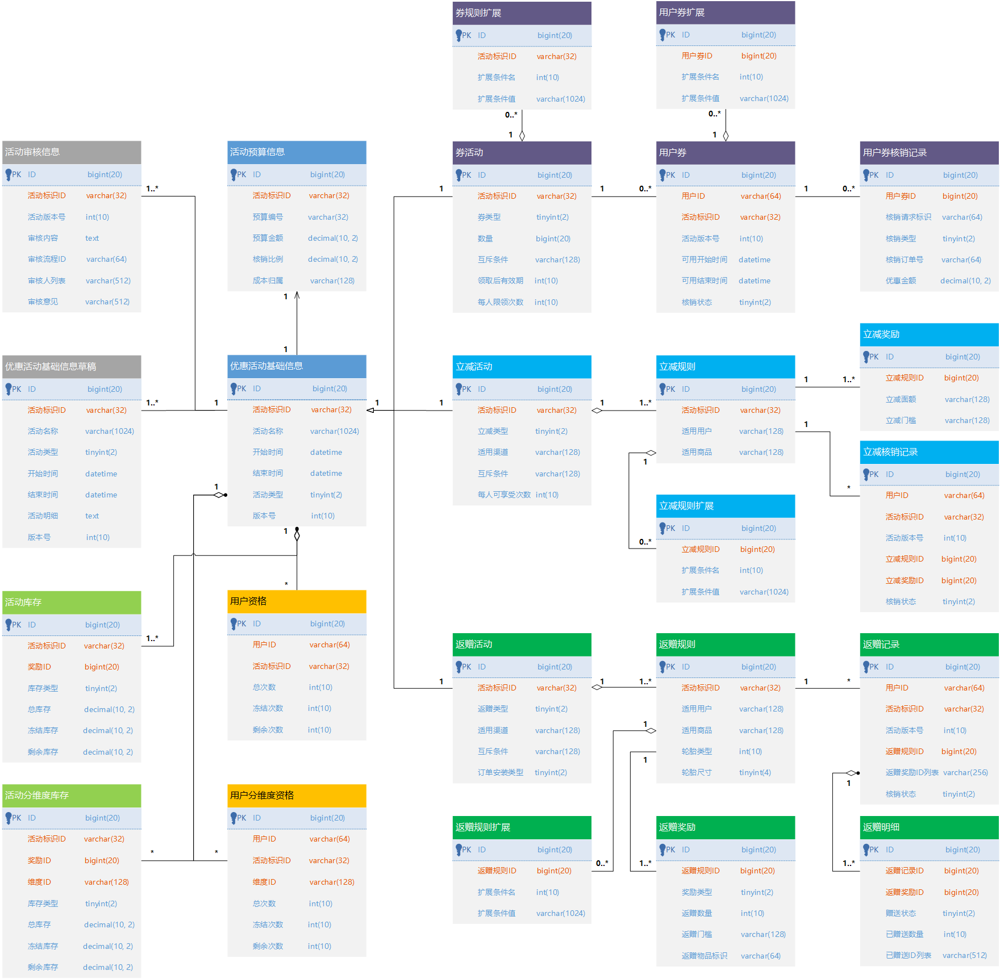

## 五、核心服务设计

在描述优惠领域核心服务设计时，主要描述优惠领域对外部领域提供的统一封装服务，通过统一封装服务的接口时序图来串联起内部模块和下游依赖之间的调用关系。

其中性能指标和容量指标在第六部分再详细说明。

<table><colgroup><col> <col> <col> <col> <col> <col></colgroup><thead><tr><th>
序号
</th><th>
能力描述
</th><th>
服务接口契约
</th><th colspan="1">
调用方约定
</th><th colspan="1">
下游依赖及依赖方式
</th><th colspan="1">
其他备注
</th></tr></thead><tbody><tr><td>1</td><td rowspan="2">优惠配置服务</td><td>
创建优惠活动

（Http）
</td><td colspan="1">
面向前端提供Http接口

需提供相关配置后台权限认证信息
</td><td colspan="1">
商品（RPC） 营销选单（RPC）

价格（RPC） 营销圈人（RPC）

门店（RPC） 营销预算（RPC）

员工账号（RPC） 门店账号（RPC）
</td><td colspan="1">如后续平台运营/商家各自有较重的配置业务逻辑，再单独建设，并与用户端进行同步</td></tr><tr><td>2</td><td>
审核优惠活动

（Http)
</td><td colspan="1">
面向前端提供Http接口

需提供相关配置后台权限认证信息
</td><td colspan="1">
工单（RPC）

风控（RPC）
</td><td colspan="1">先风控、后人工</td></tr><tr><td>3</td><td colspan="1">优惠领取服务</td><td colspan="1">
发放优惠券

（RPC）
</td><td colspan="1">
面向上游各优惠券使用方提供RPC接口

需提供用户相关领取上下文信息
</td><td colspan="1">
营销圈人（RPC） 用户账号（RPC）

营销预算（RPC）
</td><td colspan="1">需提供上下游请求唯一标识（幂等）</td></tr><tr><td>4</td><td rowspan="3">优惠查询服务</td><td colspan="1">批量查询可用优惠活动列表 （RPC）</td><td colspan="1">
面向各列表页（搜索/商品列表/活动页）后端提供RPC接口

需提供用户浏览相关上下文信息
</td><td colspan="1">
商品（RPC） 营销选单（RPC）

价格（RPC） 营销圈人（RPC）

门店（RPC） 用户账号（RPC）
</td><td colspan="1"></td></tr><tr><td colspan="1">5</td><td colspan="1">
查询可用优惠活动列表

（RPC）
</td><td colspan="1">
面向详情页后端提供RPC接口

需提供用户浏览相关上下文信息
</td><td colspan="1">
商品（RPC） 营销选单（RPC）

价格（RPC） 营销圈人（RPC）

门店（RPC） 用户账号（RPC）
</td><td colspan="1"></td></tr><tr><td colspan="1">6</td><td colspan="1">
查询可用优惠活动最优组合

（RPC）
</td><td colspan="1">
面向提单页后端提供RPC接口

需提供用户交易相关上下文信息
</td><td colspan="1">
商品（RPC） 营销选单（RPC）

价格（RPC） 营销圈人（RPC）

门店（RPC） 营销预算（RPC）

用户账号（RPC）
</td><td colspan="1">要求用户处于登录态</td></tr><tr><td colspan="1">7</td><td colspan="1">优惠校验服务</td><td colspan="1">
校验选定优惠活动

（RPC）
</td><td rowspan="3">
面向交易链路后台相关服务提供RPC接口

需提供用户交易链路上下文信息
</td><td colspan="1">
商品（RPC） 营销选单（RPC）

价格（RPC） 营销圈人（RPC）

门店（RPC） 营销预算（RPC）

用户账号（RPC）
</td><td colspan="1">要求用户处于登录态</td></tr><tr><td colspan="1">8</td><td colspan="1">优惠锁定服务</td><td colspan="1">
预锁定优惠活动

（RPC）
</td><td colspan="1">用户账号（RPC）</td><td colspan="1">
需提供上下游请求唯一标识（幂等）

要求用户处于登录态
</td></tr><tr><td colspan="1">9</td><td colspan="1">优惠核销服务</td><td colspan="1">
核销选定优惠活动

（RPC）
</td><td colspan="1">
商品（RPC） 营销选单（RPC）

价格（RPC） 营销圈人（RPC）

门店（RPC） 营销预算（RPC）

用户账号（RPC）
</td><td colspan="1">
需提供上下游请求唯一标识（幂等）

要求用户处于登录态
</td></tr></tbody></table>

需要特定说明的是，面向提单页提供的“ **查询可用优惠活动最优组合** ”服务接口。

基于各业务线在提单页的通用性，可以考虑从端到端的角度来完成可用优惠活动查询的闭环，提供一个 **提单页嵌入式的优惠展示组件** 。

<table><colgroup><col> <col> <col> <col> <col></colgroup><thead><tr><th>
能力描述
</th><th>
服务接口契约
</th><th>
调用方约定
</th><th>
下游依赖及依赖方式
</th><th colspan="1">
其他备注
</th></tr></thead><tbody><tr><td>
优惠展示组件
</td><td>
1）可用优惠活动的加载

2）优惠活动的选择&校验

3）商品/优惠/下单的联动
</td><td>
提单页嵌入式组件

通过Http接口直接与优惠后端进行交互
</td><td>
优惠查询服务（Http）

优惠校验服务（Http）
</td><td colspan="1">提供前后端交互的安全控制（Https）</td></tr></tbody></table>

## 5.1 核心服务接口时序图

针对上述核心服务接口，分别详细描述其上下游依赖机调用时序关系。

### 5.1.1 创建优惠活动

以平台运营创建优惠券流程为典型来展示系统调用时序，优惠立减、返赠的流程类似，门店侧创建优惠活动流程要简单一些。

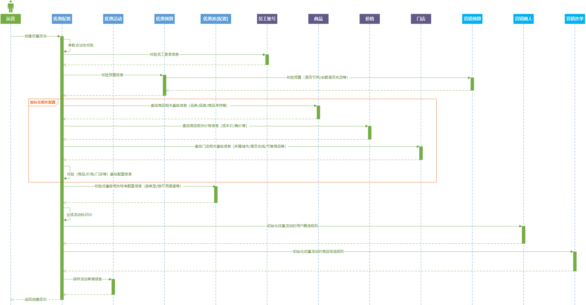

### 5.1.2 审核优惠活动

以平台运营审核优惠券流程为典型来展示系统调用时序，优惠立减和返赠的流程类似。

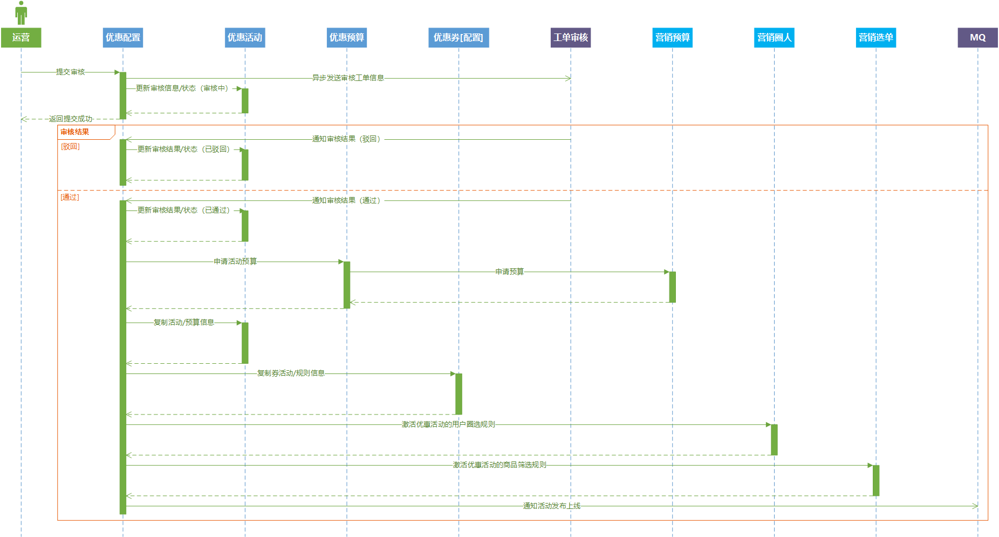

### 5.1.3 发放优惠券

以用户活动页领取优惠券为典型来展示发放优惠券的系统调用时序。

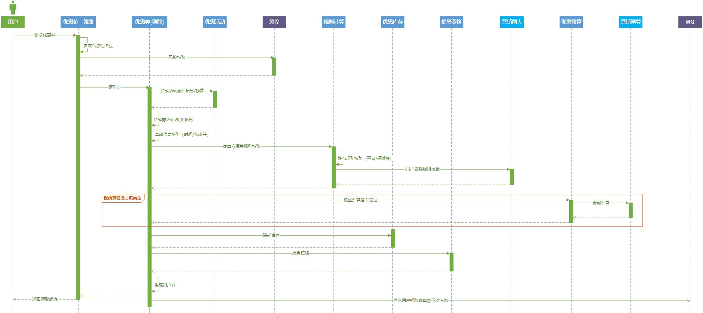

### 5.1.4 批量查询可用优惠活动列表（适用于列表页）

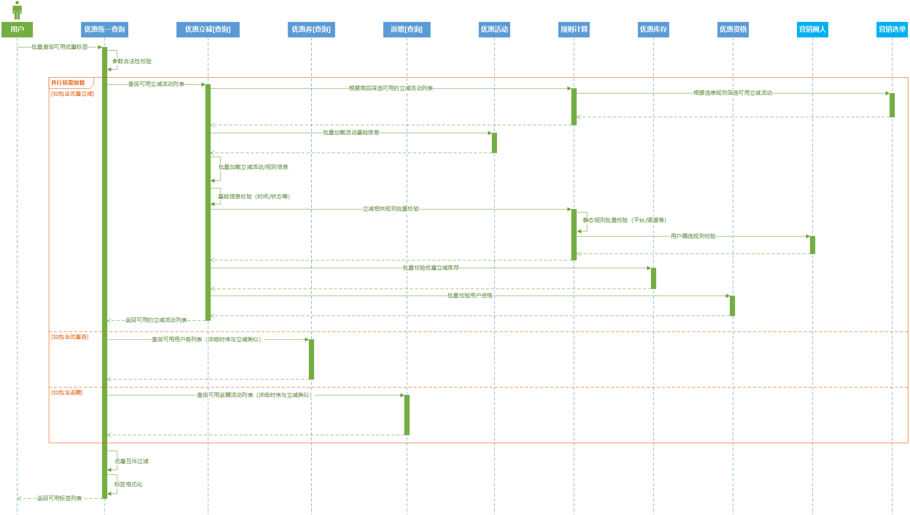

### 5.1.5 查询可用优惠活动列表（适用于详情页）

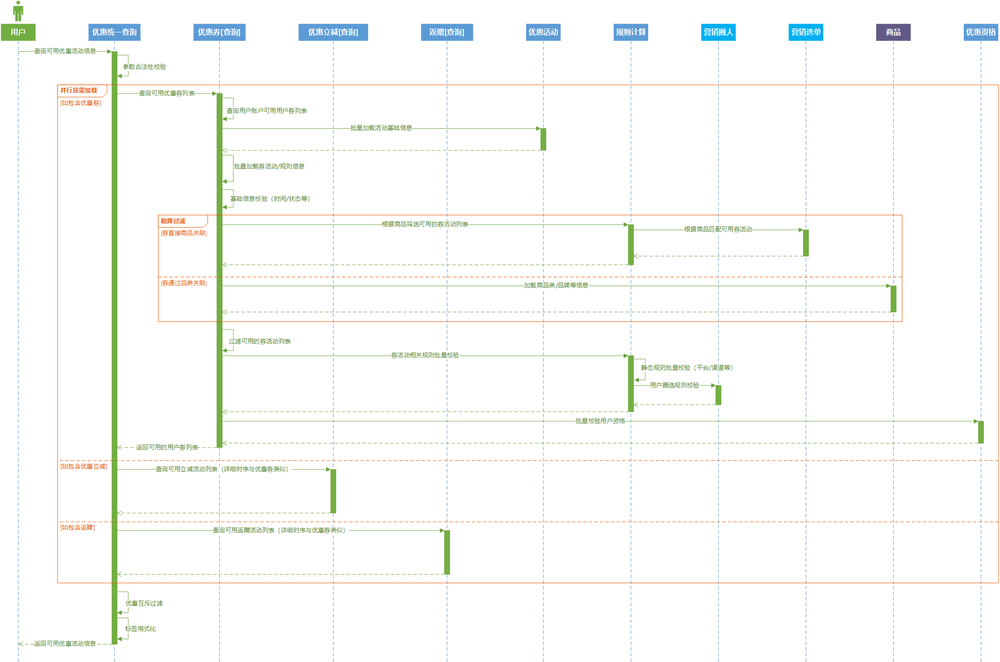

### 5.1.6 查询可用优惠活动最优组合（适用于提单页）

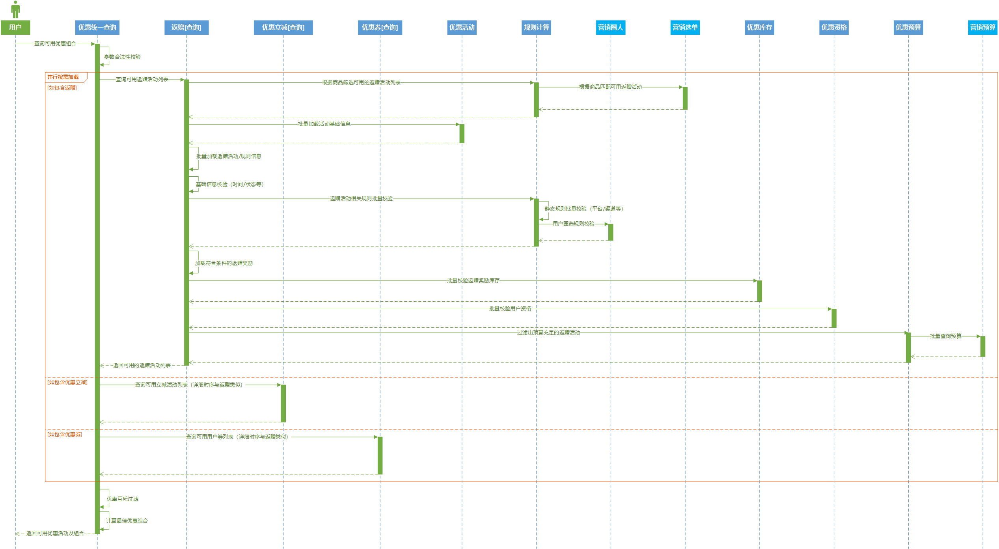

### 5.1.7 校验选定优惠活动

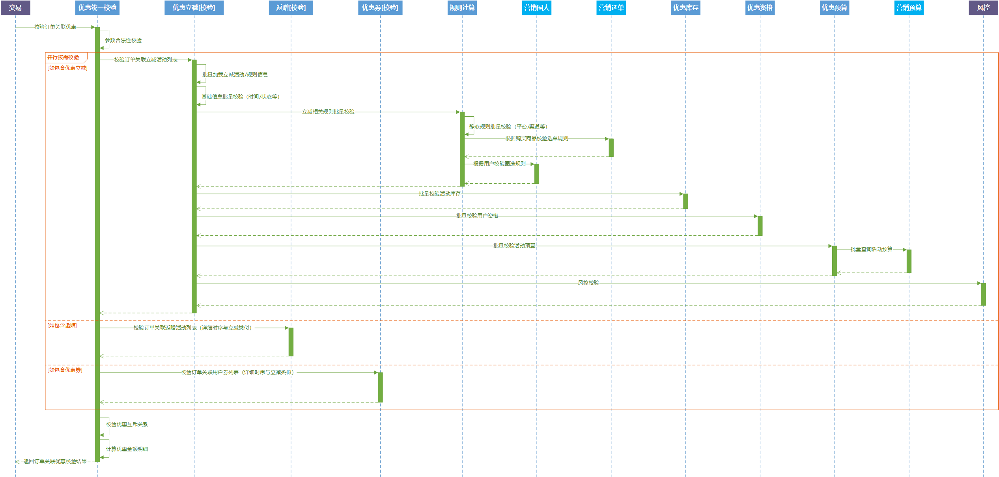

### 5.1.8 预锁定优惠活动

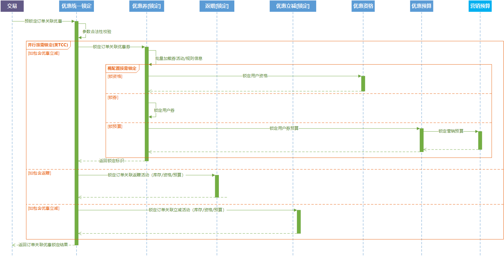

### 5.1.9 核销优惠活动

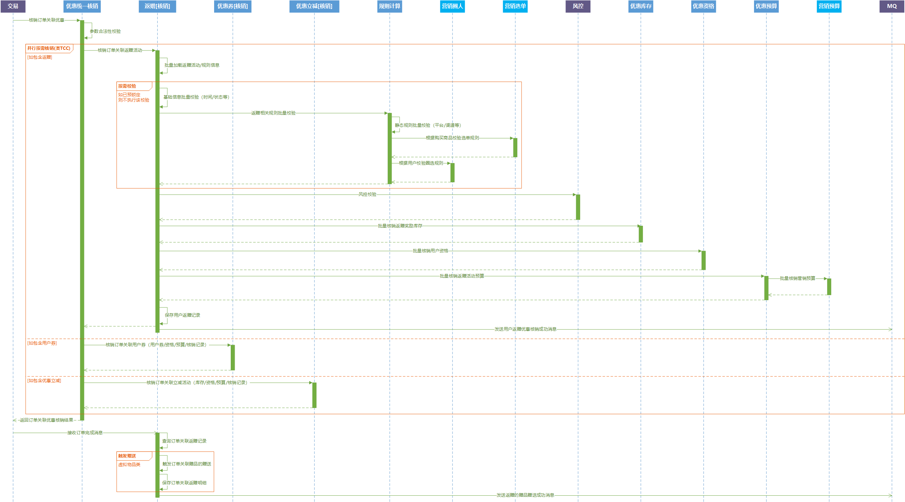

### 5.1.10 回退优惠活动

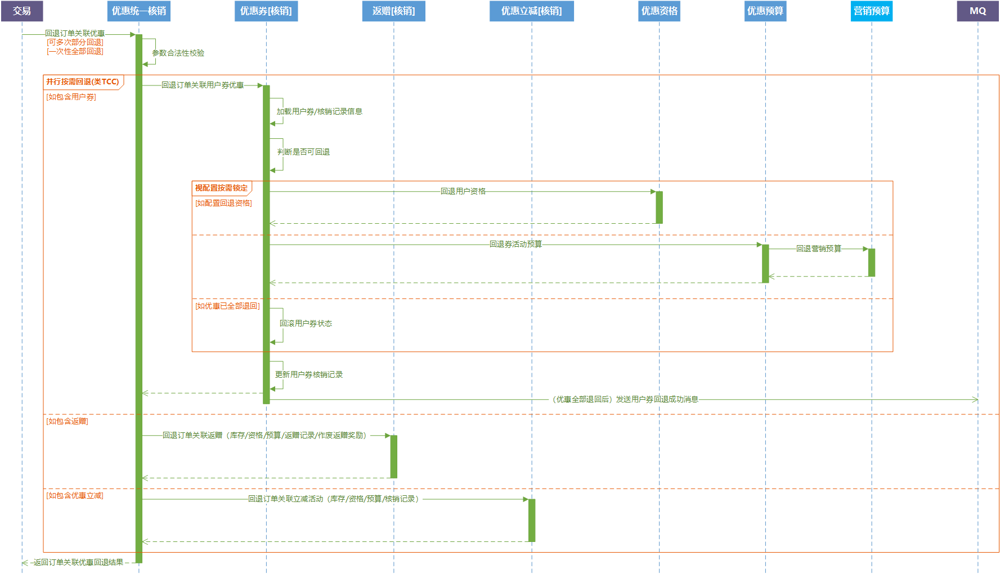

## 5.2 核心服务接口参数表

详细的服务接口及相关参数，在详细设计中会明确细化。此部分仅列出面向不同端的服务接口的部分参数列表。

接口参数列表除必要的业务参数，主要列举一些必要的通用参数。

### 5.2.1 面向配置端部分参数列表

<table><colgroup><col> <col> <col> <col> <col></colgroup><thead><tr><th>
序号
</th><th>
参数名
</th><th>
参数类型
</th><th>
是否必填
</th><th colspan="1">
备注
</th></tr></thead><tbody><tr><td>1</td><td>operator</td><td>String</td><td>是</td><td colspan="1">操作人（通用）</td></tr><tr><td>2</td><td>operateTime</td><td>Datetime</td><td>是</td><td colspan="1">操作时间（通用）</td></tr><tr><td colspan="1">3</td><td colspan="1">sourceType</td><td colspan="1">Integer</td><td colspan="1">是</td><td colspan="1">来源类型（枚举值，通用，标识运营端/门店端，还可进一步细化）</td></tr><tr><td colspan="1">4</td><td colspan="1">activityId</td><td colspan="1">String</td><td colspan="1">是</td><td colspan="1">活动标识</td></tr><tr><td colspan="1">5</td><td colspan="1">departmentId</td><td colspan="1">String</td><td colspan="1">是</td><td colspan="1">部门ID（运营配置后台）</td></tr><tr><td colspan="1">6</td><td colspan="1">staffId</td><td colspan="1">String</td><td colspan="1">是</td><td colspan="1">员工ID（运营配置后台）</td></tr><tr><td colspan="1">7</td><td colspan="1">shopId</td><td colspan="1">Long</td><td colspan="1">否</td><td colspan="1">门店ID（门店配置后台）</td></tr><tr><td colspan="1">8</td><td colspan="1">accountId</td><td colspan="1">Long</td><td colspan="1">是</td><td colspan="1">门店账号ID（门店配置后台）</td></tr></tbody></table>

### 5.2.2 面向用户端部分参数列表

<table><colgroup><col> <col> <col> <col> <col></colgroup><thead><tr><th>
序号
</th><th>
参数名
</th><th>
参数类型
</th><th>
是否必填
</th><th colspan="1">
备注
</th></tr></thead><tbody><tr><td>1</td><td>userId</td><td>String</td><td>否</td><td colspan="1">用户ID（通用）</td></tr><tr><td>2</td><td>deviceId</td><td>String</td><td>否</td><td colspan="1">设备ID（通用）</td></tr><tr><td colspan="1">3</td><td colspan="1">mobile</td><td colspan="1">String</td><td colspan="1">否</td><td colspan="1">手机号（通用）</td></tr><tr><td colspan="1">4</td><td colspan="1">platformType</td><td colspan="1">Integer</td><td colspan="1">否</td><td colspan="1">平台类型（枚举值，通用）</td></tr><tr><td colspan="1">5</td><td colspan="1">channelType</td><td colspan="1">Integer</td><td colspan="1">否</td><td colspan="1">渠道类型（枚举值，通用）</td></tr><tr><td colspan="1">6</td><td colspan="1">appVersion</td><td colspan="1">String</td><td colspan="1">否</td><td colspan="1">应用版本（通用）</td></tr><tr><td colspan="1">7</td><td colspan="1">cityId</td><td colspan="1">Integer</td><td colspan="1">否</td><td colspan="1">城市ID（通用）</td></tr><tr><td colspan="1">8</td><td colspan="1">sceneId</td><td colspan="1">Integer</td><td colspan="1">是</td><td colspan="1">场景ID（通用，调用方接入场景标识）</td></tr></tbody></table>

### 5.2.3 面向交易链路和优惠领取链路部分参数列表

在包含5.2.2 面向用户端部分参数列表的基础之上，交易链路和优惠领取链路还有自己独有的一些参数。

<table><colgroup><col> <col> <col> <col> <col></colgroup><thead><tr><th>
序号
</th><th>
参数名
</th><th>
参数类型
</th><th>
是否必填
</th><th colspan="1">
备注
</th></tr></thead><tbody><tr><td>1</td><td>orderId</td><td>String</td><td>否</td><td colspan="1">订单标识（交易链路必填）</td></tr><tr><td>2</td><td>identityId</td><td>String</td><td>否</td><td colspan="1">身份标识（跨领域通用，交易链路必填）</td></tr><tr><td colspan="1">3</td><td colspan="1">bizReqId</td><td colspan="1">String</td><td colspan="1">是</td><td colspan="1">业务请求唯一标识（通用）</td></tr><tr><td colspan="1">4</td><td colspan="1">riskContext</td><td colspan="1">Map<String, String></td><td colspan="1">否</td><td colspan="1">风控所需上下文信息（通用）</td></tr></tbody></table>

## 5.3 定时作业清单

领域内围绕核心服务能力支撑，而设计的定时作业清单如下：

<table><colgroup><col> <col> <col> <col> <col> <col></colgroup><thead><tr><th>
序号
</th><th>
作业名称
</th><th>
功能描述
</th><th>
执行周期
</th><th colspan="1">
执行方式
</th><th colspan="1">
监控与告警机制
</th></tr></thead><tbody><tr><td>1</td><td>活动开始状态变迁</td><td>活动开始时间到了，更新活动状态至（进行中）</td><td>每分钟一次</td><td colspan="1">定时扫描优惠活动基础信息表</td><td colspan="1">业务逻辑会做（开始/结束时间）判断，并在辅助推进状态更新时（监控打点）</td></tr><tr><td>2</td><td>活动结束状态变迁</td><td>活动结束时间到了，更新活动状态至（已结束）</td><td>每分钟一次</td><td colspan="1">定时扫描优惠活动基础信息表</td><td colspan="1">业务逻辑会做（开始/结束时间）判断，并在辅助推进状态更新时（监控打点）</td></tr><tr><td colspan="1">3</td><td colspan="1">用户券批量作废</td><td colspan="1">大量用户券的批量作废</td><td colspan="1">不定期的一次性任务</td><td colspan="1">接收作废请求，异步触发批量作废</td><td colspan="1">监控作废进度，并通知完成时间</td></tr><tr><td colspan="1">4</td><td colspan="1">返赠赠品赠送</td><td colspan="1">赠品的延时/定时赠送</td><td colspan="1">每5分钟一次</td><td colspan="1">扫描返赠记录和返赠明细表</td><td colspan="1">监控待赠送的返赠明细记录数量</td></tr><tr><td>5</td><td>ETL任务</td><td>关键数据表到大数据平台的（全量/增量）数据同步</td><td colspan="2">视大数据平台统一的执行策略</td><td colspan="1">大数据平台通用的ETL任务告警</td></tr><tr><td colspan="1">6</td><td colspan="1">离线资金对账</td><td colspan="1">T+1的（优惠、预算、订单、结算）多方对账</td><td colspan="2">大数据平台Hive脚本，每天凌晨一次</td><td colspan="1">大数据平台通用的Hive任务告警</td></tr></tbody></table>

## 5.4 消息队列清单

领域内围绕核心服务能力支撑，而设计的消息队列清单如下：

<table><colgroup><col> <col> <col> <col> <col></colgroup><tbody><tr><th>序号</th><th>队列名称</th><th>功能描述</th><th>备注</th><th colspan="1">监控</th></tr><tr><td>1</td><td>活动状态变迁</td><td>
通知活动状态（已上线/已开始/已暂停/已启用/已结束/已作废）变迁

方便下游监听，触发对应的操作
</td><td rowspan="6">
1、缓存刷新（活动/用户券）

2、索引刷新（选单）

3、数据统计（发放量/核销量）

4、外部监听

5、延时对账（准实时资金对账）
</td><td rowspan="6">依赖MQ中间件的基础监控</td></tr><tr><td>2</td><td>用户券状态变迁</td><td>通知用户券状态（未使用/已使用/已回退/已作废）变迁</td></tr><tr><td colspan="1">3</td><td colspan="1">返赠状态变迁</td><td colspan="1">通知返赠记录状态（已使用/已回退/已赠送）和返赠赠品发放状态（待发放/已发放/已回收）变迁</td></tr><tr><td colspan="1">4</td><td colspan="1">立减核销记录状态变迁</td><td colspan="1">通知用户立减核销记录的状态（核销/回退）变迁</td></tr><tr><td colspan="1">5</td><td colspan="1">库存/资格的解除锁定</td><td colspan="1">锁定超时之后，接收订单取消的消息之后触发库存资格的过期解锁（与订单取消时间保持一致）</td></tr><tr><td colspan="1">6</td><td colspan="1">缓存被动更新</td><td colspan="1">查询/校验等操作时发现数据过期后异步触发的缓存重建任务</td></tr><tr><td colspan="1">7</td><td colspan="1">关键库表的Binlog</td><td colspan="1">监听关键数据库/表的Binlog变更，触发异构数据更新</td><td>
1、ES索引的更新

2、C端分库分表→B端数据汇总

3、大数据平台的增量同步
</td><td>Canal等类似数据同步中间件的监控</td></tr></tbody></table>

## 六、非功能性设计

本节先基于现状，整体给出优惠领域在非功能性设计方面的一些目标指标，再详细描述达成上述指标的一些关键技术要点。

<table><colgroup><col> <col> <col> <col> <col> <col></colgroup><tbody><tr><th colspan="1">端</th><th colspan="1">服务</th><th colspan="1">场景</th><th colspan="3">关注点</th></tr><tr><td rowspan="2"><strong>B端</strong></td><td rowspan="2">优惠配置</td><td>面向运营端的配置后台</td><td colspan="3">
1、一站式配置后台（功能配置闭环）

2、功能的易用性、可响应性（前端体验）

3、权限控制（业务线或部门粒度隔离）

3.1 数据查看权限（记录部门/业务线等信息）

3.2 数据操作权限（配置后台角色控制）

4、操作审计日志
</td></tr><tr><td colspan="1">面向门店或其他端的API配置服务</td><td colspan="3">
1、API的易用性

2、登录鉴权

3、操作审计日志

4、一定程度的RT要求（99线 < 1s）和峰值QPS要求（500）
</td></tr><tr><td rowspan="10"><strong>C端</strong></td><td colspan="1"><strong>服务</strong></td><td colspan="1"><strong>接口</strong></td><td colspan="1"><strong>目标99线RT（ms）</strong></td><td colspan="1"><strong>目标集群峰值QPS</strong></td><td colspan="1"><strong>其他关注点</strong></td></tr><tr><td rowspan="2">优惠统一领取</td><td>单人/单券领取</td><td colspan="1">100</td><td colspan="1">3000</td><td rowspan="9">
1、安全

防遍历碰撞攻击

频次控制

风控拦截

数据脱敏

2、一致性

3、幂等

4、数据埋点

A/B、算法等业务埋点

业务指标埋点
</td></tr><tr><td colspan="1">多人/多券批量领取</td><td colspan="1">250（batchSize<=10）</td><td colspan="1">1000（batchSize<=10）</td></tr><tr><td rowspan="2">优惠统一查询</td><td>单商品查询</td><td colspan="1">40</td><td colspan="1">5000</td></tr><tr><td colspan="1">多商品批量查询</td><td colspan="1">80（batchSize<=20）</td><td colspan="1">5000（batchSize<=20）</td></tr><tr><td colspan="1">优惠统一校验</td><td colspan="1">校验</td><td colspan="1">50</td><td colspan="1">5000</td></tr><tr><td rowspan="2">优惠统一锁定</td><td colspan="1">锁定</td><td colspan="1">50</td><td colspan="1">2000</td></tr><tr><td colspan="1">解除锁定</td><td colspan="1">50</td><td colspan="1">1000</td></tr><tr><td rowspan="2">优惠统一核销</td><td colspan="1">核销</td><td colspan="1">200</td><td colspan="1">2000</td></tr><tr><td colspan="1">回退</td><td colspan="1">200</td><td colspan="1">1000</td></tr></tbody></table>

**\*\*\*** 需要说明：上述目标RT和QPS可以支持一定扩展性（数据分库分表扩容 + 应用水平扩展部署）。

## 6.1 性能设计

主要描述优惠领域中，影响服务性能的关键设计。

### 6.1.1 服务拆分

整体遵循：（B端配置 + C端访问）的服务拆分。

针对C端访问，按照流量大小、读/写模式等进行二次拆分：（优惠查询 + 优惠领取 + 交易链路优惠使用 \[ 校验 + 锁定 + 核销 \] ）。

离线的任务和对账，隔离出单独的服务，依赖统一的任务调度中间件和大数据平台。

### 6.1.2 异构数据访问

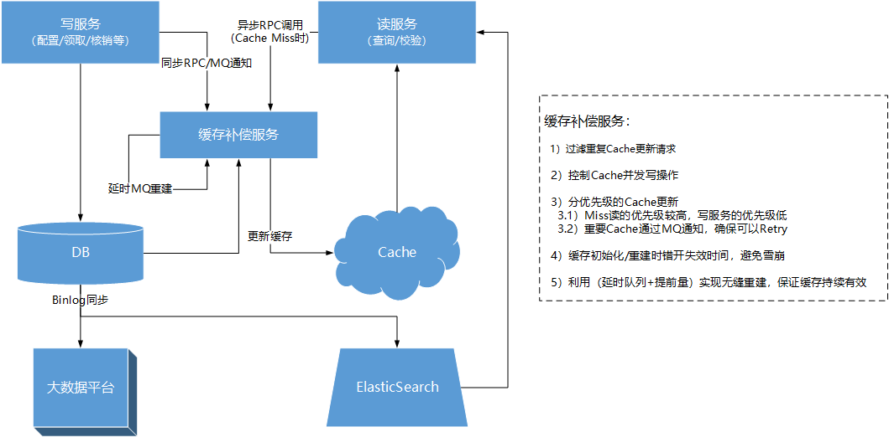

### 6.1.3 编程实践

- DB的索引优化（基于访问场景的联合索引优化）
- 下游服务异步并发调用
- 特定场景下适量线程池并发
- 特定场景下业务编排（基于不同优惠规则筛选度进行接口调用编排）
- 大缓存Key的单独本地化建设（极个别用户大批量的用户券）

## 6.2 容量设计

主要描述优惠领域中，针对目标服务的关键容量设计。

### 6.2.1 缓存容量设计

- 优惠券/优惠立减/返赠的缓存集群隔离
- 基础库存/资格的缓存集群隔离
- 大容量缓存结构（List/Hash）的业务层面拆分

### 6.2.2 DB容量设计

<table><colgroup><col> <col> <col> <col> <col></colgroup><tbody><tr><th>表</th><th>预估表容量（记录行数）</th><th>预估容量等级</th><th colspan="1">预估字段数量</th><th>容量设计策略</th></tr><tr><td>用户券</td><td>约20亿</td><td>高</td><td colspan="1">多</td><td rowspan="3">
1、用户券库

2、按用户ID分库分表
</td></tr><tr><td>用户券扩展</td><td>约2亿</td><td>高</td><td colspan="1">少</td></tr><tr><td colspan="1">用户券核销记录</td><td colspan="1">约3000W</td><td colspan="1">中</td><td colspan="1">中</td></tr><tr><td>立减核销记录</td><td>约5亿</td><td>高</td><td colspan="1">多</td><td>
1、立减核销记录库

2、按照用户ID分库分表
</td></tr><tr><td colspan="1">返赠记录</td><td colspan="1">约5亿</td><td colspan="1">高</td><td colspan="1">多</td><td rowspan="2">
1、返赠记录库

2、按照用户ID分库分表
</td></tr><tr><td colspan="1">返赠明细</td><td colspan="1">约15亿</td><td colspan="1">高</td><td colspan="1">中</td></tr><tr><td colspan="1">活动库存</td><td colspan="1">约500W</td><td colspan="1">低</td><td colspan="1">少</td><td rowspan="2">
1、活动库存库

2、按照活动ID分库（考虑到事务性，确保同一活动的库存和分维度库存落到同一库）

3、考虑数据量差异分表粒度不同

4、可以视资源合理考虑分库分表数量（尽量2的阶乘拆分策略，兼顾后续扩容时数据迁移）

5、配合有对应log表（用于保证接口幂等性）
</td></tr><tr><td colspan="1">活动分维度库存</td><td colspan="1">约5亿</td><td colspan="1">高</td><td colspan="1">少</td></tr><tr><td colspan="1">用户资格</td><td colspan="1">约50亿</td><td colspan="1">高</td><td colspan="1">少</td><td rowspan="2">
1、用户资格库

2、按照用户ID分库（考虑到事务性，确保同一用户的资格和分维度资格落到同一库）

3、考虑数据量差异分表粒度不同

4、可以视资源合理考虑分库分表数量（尽量2的阶乘拆分策略，兼顾后续扩容时数据迁移）

5、配合有对应log表（用于保证接口幂等性）
</td></tr><tr><td colspan="1">用户分维度资格</td><td colspan="1">约100亿</td><td colspan="1">高</td><td colspan="1">少</td></tr><tr><td colspan="1">相关活动信息</td><td colspan="1">约100W</td><td colspan="1">低</td><td colspan="1">多</td><td rowspan="3">
1、按照领域分库
<ul><li>基础活动信息库（基础活动、草稿、审核）</li><li>优惠券库（券活动、规则、规则扩展）</li><li>优惠立减库（立减活动、规则、规则扩展）</li><li>返赠库（返赠活动、规则、规则扩展）</li></ul>
2、由于记录容量和字段数量都相对不多，暂不考虑分表
</td></tr><tr><td colspan="1">相关规则信息</td><td colspan="1">约250W</td><td colspan="1">低</td><td colspan="1">中</td></tr><tr><td colspan="1">相关规则扩展信息</td><td colspan="1">约500W</td><td colspan="1">低</td><td colspan="1">少</td></tr><tr><td colspan="5">
考虑到后续可能提供门店端或其他端（特点：有一定的访问量 [ 但没有C端用户量大 ]，且有独有访问维度 [ 门店ID、供应商ID等 ]）的优惠活动数据（基础数据、统计数据、报表数据等）展示需求

可以针对上述库表单独设计以下的容量策略：

1、提供异构的数据库表（以门店ID或供应商ID为维度进行分库分表，异构数据库之间通过binlog进行同步）

2、提供ES进行门店或其他端的访问（DB到ES之间通过binlog进行同步）

3、大批量的明细数据报表或下载（考虑通过大数据平台提供T-1的数据）
</td></tr></tbody></table>

## 6.3 安全性设计

主要描述优惠领域中，针对目标服务的信息安全风险相关设计。

### 6.3.1 系统安全设计

**1、安全标识**

优惠活动ID：扩展位 **\[** 业务/版本标识 **\]** + （唯一位 **\[** 自增ID **\]** + 随机位 **\[** 数字+大小字母 Random **\]** 交错） + 校验位 **\[** 参考身份证校验位算法，具体校验算法在详细设计阶段给出 **\]**

**2、场景隔离**

发券场景：针对上游不同发券调用方，分配唯一场景标识，配券的时候，强制指定券发放的目标场景标识

**3、频次限制**

限制每人/每天/每个平台/每个渠道的优惠（领取/使用）额度

**4、监控告警**

不同业务维度的（环比 | 总量）曲线

- 分平台 / 分渠道 /
- （异常 / 错误 / 非法）
- 优惠（配置 / 领取 / 核销 / 回退）

**5、数据脱敏**

- 手机号等数据脱敏存储
- 数据脱敏后流入监控平台/日志
- 敏感数据访问日志

### 6.3.2 风控安全审核

- （高风险 / 高价值）优惠规则的系统Double Check流程 + 兜底校验
- 事前（优惠配置时）的风控系统审核 + 人工审核
- 事中（优惠校验、核销时）的风控拦截

### 6.3.3 资金安全管控

- 对接营销预算
- 优惠 与（交易 / 结算 / 预算）两两对账
- T+1离线对账 + 准实时对账

## 6.4 可用性设计

基于中间件和基础组件的基础之上，一些常用的最佳实践设计：

- 限流（针对上游调用方的自我保护）
- 容错（针对下游依赖方的自我包含）
- 降级（针对部分非严格场景 \[例如：查询\] 下，非必要信息的降级展示和有选择性的校验降级开关）
- 幂等重试（在RT允许的情况下，有限地内部重试 + 接口返回可重试的提示）

## 6.5 一致性设计

针对系统一致性要求等级，明确提供 **最终一致性** 。具体的保障手段如下：

- 异构数据之间一致性同步（CQRS的主动 / 被动更新 + 基于MQ和binlog的数据同步机制，5.4节和6.1.2节也有相关说明）
- 多个下游服务接口调用的状态一致性（类TCC的commit/rollback \[ 锁定/解除锁定、核销/回退 \] + 异步MQ补偿机制）
- 写操作幂等契约保证（交易链路的唯一请求标识，见5.2.3节中的bizReqId）

针对优惠库存和优惠资格核心服务，一个重要的问题是：如何在保证幂等性的基础之上，提供强一致性和很好地性能（响应时间和QPS）。整体的技术方案如下：

- 通过增加log表来保证幂等性（log表应该足够简单，且尽量是顺序写，兼容能够满足库存/资格锁定的需求）；
- 通过分库分表来保证性能（特别是写的性能瓶颈）；
- 通过数据库事务来保证强一致性（保证对对同一个活动相关库存或同一个用户相关资格的写操作都落到同一个分库）；
- 对于热点库存或分库无法承载的高流量，需要Case by Case来设计，增加额外的缓存层（会增加对应的复杂度和一致性维护成本）；

## 6.6 优惠域相关服务的外部调用建议

**1、活动-优惠领取链路**

建议优惠领取调用方：

- 增加访问鉴权
- 接入必要的防刷/风控
- 面向前端避免非必要的用户标识/业务标识暴露
- 面向前端传递的业务字段做好必要的Encode，防止SQL注入等攻击
- 尽量补全风控上下文信息

**2、交易-优惠使用链路**

建议交易相关调用方：

- 定义业务唯一请求标识
- 传递业务身份标识
- 尽量补全风控上下文信息
- 核销接口的调用时机评估
	- 创单后支付前（支付前校验 + 核销，存在与交易类的用户标签口径不一致 \[平台新用户的口径：购买成功后由新转老\] 的问题可能导致此类用户标签校验失效）
		- 支付成功后（支付前校验+支付后核销，存在临界优惠库存耗尽导致支付成功购买失败的体验）

## 七、领域演进方案

## 7.1 领域建设计划

细化可执行的领域建设计划，包含分步建设范围、新建还是改造原有系统、工作量预估等

<table><colgroup><col> <col> <col> <col> <col> <col> <col></colgroup><thead><tr><th>
序号
</th><th colspan="1">
建设能力/服务范围
</th><th>
启动时间
</th><th>
结束时间
</th><th>
建设方案（新建/改造）
</th><th>
方案&路径
</th><th colspan="1">
工作量预估
</th></tr></thead><tbody><tr><td>1</td><td colspan="1">优惠立减基础系统建设</td><td>2020.04</td><td>2020.05</td><td>新建</td><td>
1、先抽象立减基础模型及服务，支持线下门店立减促销

2、在此基础之上为后续其他形式的立减促销预留扩展
</td><td colspan="1">约40PD</td></tr><tr><td>2</td><td colspan="1">优惠券重构</td><td>2020.04</td><td>2020.Q3</td><td>改造</td><td>
1、先抽象核心基础模型，再基于基础模型设计核心服务接口

2、然后进行灰度数据迁移

3、最后推动上游逐步迁移新的服务接口
</td><td colspan="1">约100PD</td></tr><tr><td>3</td><td colspan="1">赠品重构</td><td>2020.05</td><td>2020.Q2</td><td>改造</td><td>
1、借着赠品老系统的重构，设计新的返赠系统基础模型及服务

2、完成现有赠品系统的无缝迁移

3、为其他返赠类的促销形式预留扩展
</td><td colspan="1">约50PD</td></tr><tr><td>4</td><td colspan="1">优惠促销迁移</td><td>2020.Q2</td><td>2020.Q3</td><td>改造</td><td>
（打折、全网活动、买三赠一、返油卡、返E卡、特价等）

促销形式的逐步迁移
</td><td colspan="1">约100PD</td></tr></tbody></table>

## 7.2 迁移方案

在优惠券重构、赠品重构以及其他优惠促销迁移的过程中，给出相对通用的迁移方案和流程，相关具体的详细细节在每一种促销形式的迁移过程中再详细描述。

通用的迁移方案和流程如下：

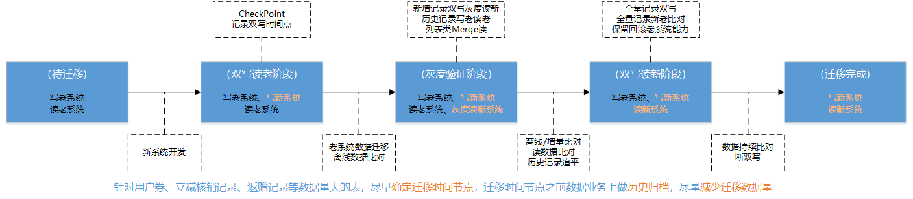